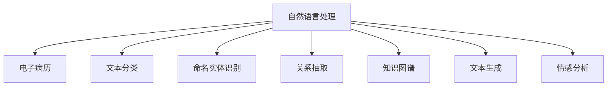

                 

# 医疗诊断中的自然语言处理应用

## 1. 背景介绍

### 1.1 问题由来
医疗诊断是一项复杂且精细的工作，涉及对病历、检查报告、临床记录等医疗文本的深入分析和理解。随着电子病历(Electronic Health Record, EHR)系统的大量应用，海量的医疗文本数据成为了宝贵的信息资源。如何从这些文本数据中提取有用的信息，为医疗诊断和治疗提供支持，成为了医学信息处理的重要研究课题。

自然语言处理(Natural Language Processing, NLP)作为人工智能(AI)领域的重要分支，近年来在医疗诊断中得到了广泛应用。NLP技术通过对医疗文本的自动分析，帮助医生快速准确定位疾病线索，提供决策支持，减轻医生的工作负担，提升诊断和治疗的准确性和效率。

### 1.2 问题核心关键点
医疗诊断中的NLP应用，主要包括以下几个关键点：

- **文本预处理**：去除噪声、分词、命名实体识别等，提取文本中的关键信息。
- **情感分析**：判断文本情感倾向，识别患者的主观感受。
- **关系抽取**：从医疗文本中提取实体间的关系，如病因、治疗方案等。
- **文本分类**：将医疗文本分为不同类别，如疾病诊断、治疗建议等。
- **文本生成**：自动生成诊断报告、治疗方案等，减轻医生的文书工作。
- **知识图谱**：构建医疗知识图谱，将文本信息结构化，便于知识检索和推理。

这些关键技术共同构成了医疗诊断中NLP应用的基础，使得医疗文本可以转化为结构化、可量化的信息，为临床决策提供支持。

## 2. 核心概念与联系

### 2.1 核心概念概述

为更好地理解医疗诊断中NLP应用的方法，本节将介绍几个密切相关的核心概念：

- **自然语言处理(NLP)**：利用计算机技术，实现对人类语言的理解、分析和生成，涵盖词法、语法、语义等多个层面的处理。
- **电子病历(EHR)**：医疗机构中电子化的患者病历记录，包含病人的临床信息、检查结果、治疗记录等。
- **文本分类**：将文本分为预定义的类别，如疾病诊断、症状、治疗方案等。
- **命名实体识别(NER)**：识别文本中的实体，如人名、地名、药物名等。
- **关系抽取(RE)**：从文本中抽取实体间的关系，如因果、治疗、相互作用等。
- **知识图谱**：通过语义网技术，将医疗领域中的实体和关系构建为图结构，形成结构化知识体系。
- **文本生成**：使用NLP模型自动生成文本，如临床报告、诊断说明等。
- **情感分析**：判断文本情感倾向，如患者的情绪、疾病的严重程度等。

这些核心概念之间的逻辑关系可以通过以下Mermaid流程图来展示：



这个流程图展示了大语言模型在医疗诊断中的应用流程：

1. 通过NLP技术处理电子病历中的文本数据，提取有用的信息。
2. 对提取的信息进行分类、命名实体识别、关系抽取等预处理，构建结构化知识图谱。
3. 利用知识图谱和文本分类信息生成诊断报告和治疗建议。
4. 通过情感分析判断患者的情绪，辅助医生的决策。

## 3. 核心算法原理 & 具体操作步骤
### 3.1 算法原理概述

医疗诊断中的NLP应用，主要是基于文本挖掘和信息抽取技术的自然语言处理。其核心思想是通过机器学习模型，从结构化或非结构化的医疗文本中提取关键信息，支持临床决策。

形式化地，假设医疗文本为 $X$，目标任务为 $T$（如疾病诊断、治疗方案等）。医疗NLP应用的目标是找到最优的模型参数 $\theta$，使得模型 $M_{\theta}$ 在任务 $T$ 上表现最佳。具体而言，任务 $T$ 可以分为分类任务和生成任务，其优化目标分别为：

- 分类任务：最小化分类错误率，即 $M_{\theta}(x) \neq y$ 的次数。
- 生成任务：最小化生成的文本与真实文本之间的差异，即 $M_{\theta}(x)$ 与 $y$ 的距离。

常见的模型包括循环神经网络(RNN)、卷积神经网络(CNN)、长短期记忆网络(LSTM)、Transformer等。通过对这些模型在标注数据集上进行训练，可以使模型学习到文本中的规律，从而在新数据上进行预测。

### 3.2 算法步骤详解

医疗诊断中的NLP应用通常包括以下关键步骤：

**Step 1: 数据准备**
- 收集并清洗电子病历数据，提取文本信息。
- 标注数据集，包括医疗文本和对应的分类标签或实体信息。
- 将标注数据集划分为训练集、验证集和测试集。

**Step 2: 模型选择**
- 选择合适的NLP模型，如BERT、ELMo、GPT等。
- 配置模型的参数，如隐藏层数、学习率等。

**Step 3: 模型训练**
- 使用标注数据集对模型进行训练，最小化分类错误率或生成差异。
- 定期在验证集上评估模型性能，调整参数。
- 使用测试集评估模型最终性能。

**Step 4: 模型评估**
- 对训练好的模型进行评估，检查其对新数据的泛化能力。
- 结合医生的经验和知识，进一步优化模型的输出。

**Step 5: 模型应用**
- 将模型集成到电子病历系统中，进行实时文本分析。
- 生成诊断报告、治疗方案等文本输出，辅助医生决策。
- 记录患者的情绪和反馈，进一步优化模型。

### 3.3 算法优缺点

医疗诊断中的NLP应用具有以下优点：
1. **效率提升**：自动化的信息提取和分析，减少了医生的工作负担，加快了诊断和治疗速度。
2. **准确性提高**：机器学习模型能够从大量数据中学习规律，提高诊断的准确性和一致性。
3. **跨领域适用**：NLP模型适用于多种医疗领域，包括内、外、儿、神经等，具有广泛的适用性。

同时，该方法也存在一定的局限性：
1. **数据依赖性**：模型的性能很大程度上依赖于标注数据的质量和数量，获取高质量医疗数据的成本较高。
2. **领域差异**：不同领域的医疗文本存在较大差异，模型在特定领域的效果可能不佳。
3. **可解释性不足**：NLP模型的决策过程通常缺乏可解释性，难以对其推理逻辑进行分析和调试。
4. **知识图谱构建复杂**：医疗领域的实体和关系非常复杂，构建准确的知识图谱需要大量的专业知识和时间投入。

尽管存在这些局限性，但就目前而言，NLP技术在医疗诊断中的应用已经取得了显著的效果，成为医疗信息化建设的重要工具。

### 3.4 算法应用领域

医疗诊断中的NLP应用已经在多个领域得到了应用，例如：

- **疾病诊断**：从病历中自动提取病情、病因、临床特征等信息，辅助医生进行诊断。
- **症状识别**：识别患者的症状和体征，提供早期预警。
- **治疗方案**：生成个性化的治疗方案，提供治疗建议。
- **药物推荐**：根据患者病情和病史，推荐适合的药物。
- **临床研究**：分析病历数据，发现疾病的新治疗方法和疗效评估。
- **患者管理**：管理患者的电子健康档案，提供健康咨询服务。

除了上述这些经典应用外，NLP技术还被创新性地应用于药物发现、基因组学、公共卫生等多个领域，为医学研究和实践带来了新的突破。

## 4. 数学模型和公式 & 详细讲解  
### 4.1 数学模型构建

本节将使用数学语言对医疗诊断中NLP应用过程进行更加严格的刻画。

记医疗文本为 $X=\{x_i\}_{i=1}^N$，其中 $x_i$ 表示第 $i$ 条病历记录。假设任务 $T$ 为疾病诊断，对应的标签为 $y_i \in \{1,2,\cdots,K\}$，其中 $K$ 为疾病的种类。

定义模型 $M_{\theta}$ 在输入 $x_i$ 上的预测输出为 $\hat{y}_i=M_{\theta}(x_i)$。则分类任务下的损失函数为：

$$
\mathcal{L}(\theta) = \frac{1}{N}\sum_{i=1}^N \ell(y_i,\hat{y}_i)
$$

其中 $\ell$ 为分类交叉熵损失函数，定义为：

$$
\ell(y_i,\hat{y}_i) = -\sum_{k=1}^K y_i \log \hat{y}_{ik}
$$

目标是最小化损失函数 $\mathcal{L}(\theta)$，即找到最优参数：

$$
\theta^* = \mathop{\arg\min}_{\theta} \mathcal{L}(\theta)
$$

在实践中，我们通常使用基于梯度的优化算法（如SGD、Adam等）来近似求解上述最优化问题。设 $\eta$ 为学习率，$\lambda$ 为正则化系数，则参数的更新公式为：

$$
\theta \leftarrow \theta - \eta \nabla_{\theta}\mathcal{L}(\theta) - \eta\lambda\theta
$$

其中 $\nabla_{\theta}\mathcal{L}(\theta)$ 为损失函数对参数 $\theta$ 的梯度，可通过反向传播算法高效计算。

### 4.2 公式推导过程

以下我们以疾病诊断任务为例，推导分类交叉熵损失函数及其梯度的计算公式。

假设模型 $M_{\theta}$ 在输入 $x_i$ 上的输出为 $\hat{y}_i=M_{\theta}(x_i) \in [0,1]^K$，表示样本属于各个疾病的概率向量。真实标签 $y_i \in \{1,2,\cdots,K\}$。则分类交叉熵损失函数定义为：

$$
\ell(y_i,\hat{y}_i) = -\sum_{k=1}^K y_i \log \hat{y}_{ik}
$$

将其代入经验风险公式，得：

$$
\mathcal{L}(\theta) = -\frac{1}{N}\sum_{i=1}^N \sum_{k=1}^K y_i \log \hat{y}_{ik}
$$

根据链式法则，损失函数对参数 $\theta_k$ 的梯度为：

$$
\frac{\partial \mathcal{L}(\theta)}{\partial \theta_k} = -\frac{1}{N}\sum_{i=1}^N \sum_{k=1}^K \frac{y_i}{\hat{y}_{ik}}\frac{\partial \hat{y}_{ik}}{\partial \theta_k}
$$

其中 $\frac{\partial \hat{y}_{ik}}{\partial \theta_k}$ 可进一步递归展开，利用自动微分技术完成计算。

在得到损失函数的梯度后，即可带入参数更新公式，完成模型的迭代优化。重复上述过程直至收敛，最终得到适应疾病诊断的最优模型参数 $\theta^*$。

## 5. 项目实践：代码实例和详细解释说明
### 5.1 开发环境搭建

在进行医疗诊断中的NLP应用实践前，我们需要准备好开发环境。以下是使用Python进行PyTorch开发的环境配置流程：

1. 安装Anaconda：从官网下载并安装Anaconda，用于创建独立的Python环境。

2. 创建并激活虚拟环境：
```bash
conda create -n pytorch-env python=3.8 
conda activate pytorch-env
```

3. 安装PyTorch：根据CUDA版本，从官网获取对应的安装命令。例如：
```bash
conda install pytorch torchvision torchaudio cudatoolkit=11.1 -c pytorch -c conda-forge
```

4. 安装Transformers库：
```bash
pip install transformers
```

5. 安装各类工具包：
```bash
pip install numpy pandas scikit-learn matplotlib tqdm jupyter notebook ipython
```

完成上述步骤后，即可在`pytorch-env`环境中开始NLP应用的开发。

### 5.2 源代码详细实现

下面我们以疾病诊断任务为例，给出使用Transformers库对BERT模型进行分类训练的PyTorch代码实现。

首先，定义分类任务的数据处理函数：

```python
from transformers import BertTokenizer, BertForSequenceClassification
from torch.utils.data import Dataset
import torch

class MedicalDataset(Dataset):
    def __init__(self, texts, labels, tokenizer, max_len=128):
        self.texts = texts
        self.labels = labels
        self.tokenizer = tokenizer
        self.max_len = max_len
        
    def __len__(self):
        return len(self.texts)
    
    def __getitem__(self, item):
        text = self.texts[item]
        label = self.labels[item]
        
        encoding = self.tokenizer(text, return_tensors='pt', max_length=self.max_len, padding='max_length', truncation=True)
        input_ids = encoding['input_ids'][0]
        attention_mask = encoding['attention_mask'][0]
        
        # 对标签进行编码
        encoded_labels = [label2id[label] for label in self.labels] 
        encoded_labels.extend([label2id['O']] * (self.max_len - len(encoded_labels)))
        labels = torch.tensor(encoded_labels, dtype=torch.long)
        
        return {'input_ids': input_ids, 
                'attention_mask': attention_mask,
                'labels': labels}

# 标签与id的映射
label2id = {'O': 0, '疾病1': 1, '疾病2': 2, '疾病3': 3}
id2label = {v: k for k, v in label2id.items()}

# 创建dataset
tokenizer = BertTokenizer.from_pretrained('bert-base-cased')

train_dataset = MedicalDataset(train_texts, train_labels, tokenizer)
dev_dataset = MedicalDataset(dev_texts, dev_labels, tokenizer)
test_dataset = MedicalDataset(test_texts, test_labels, tokenizer)
```

然后，定义模型和优化器：

```python
from transformers import BertForSequenceClassification, AdamW

model = BertForSequenceClassification.from_pretrained('bert-base-cased', num_labels=len(label2id))

optimizer = AdamW(model.parameters(), lr=2e-5)
```

接着，定义训练和评估函数：

```python
from torch.utils.data import DataLoader
from tqdm import tqdm
from sklearn.metrics import classification_report

device = torch.device('cuda') if torch.cuda.is_available() else torch.device('cpu')
model.to(device)

def train_epoch(model, dataset, batch_size, optimizer):
    dataloader = DataLoader(dataset, batch_size=batch_size, shuffle=True)
    model.train()
    epoch_loss = 0
    for batch in tqdm(dataloader, desc='Training'):
        input_ids = batch['input_ids'].to(device)
        attention_mask = batch['attention_mask'].to(device)
        labels = batch['labels'].to(device)
        model.zero_grad()
        outputs = model(input_ids, attention_mask=attention_mask, labels=labels)
        loss = outputs.loss
        epoch_loss += loss.item()
        loss.backward()
        optimizer.step()
    return epoch_loss / len(dataloader)

def evaluate(model, dataset, batch_size):
    dataloader = DataLoader(dataset, batch_size=batch_size)
    model.eval()
    preds, labels = [], []
    with torch.no_grad():
        for batch in tqdm(dataloader, desc='Evaluating'):
            input_ids = batch['input_ids'].to(device)
            attention_mask = batch['attention_mask'].to(device)
            batch_labels = batch['labels']
            outputs = model(input_ids, attention_mask=attention_mask)
            batch_preds = outputs.logits.argmax(dim=1).to('cpu').tolist()
            batch_labels = batch_labels.to('cpu').tolist()
            for pred, label in zip(batch_preds, batch_labels):
                preds.append(id2label[pred])
                labels.append(id2label[label])
                
    print(classification_report(labels, preds))
```

最后，启动训练流程并在测试集上评估：

```python
epochs = 5
batch_size = 16

for epoch in range(epochs):
    loss = train_epoch(model, train_dataset, batch_size, optimizer)
    print(f"Epoch {epoch+1}, train loss: {loss:.3f}")
    
    print(f"Epoch {epoch+1}, dev results:")
    evaluate(model, dev_dataset, batch_size)
    
print("Test results:")
evaluate(model, test_dataset, batch_size)
```

以上就是使用PyTorch对BERT进行疾病诊断任务分类训练的完整代码实现。可以看到，得益于Transformers库的强大封装，我们可以用相对简洁的代码完成BERT模型的加载和分类训练。

### 5.3 代码解读与分析

让我们再详细解读一下关键代码的实现细节：

**MedicalDataset类**：
- `__init__`方法：初始化文本、标签、分词器等关键组件。
- `__len__`方法：返回数据集的样本数量。
- `__getitem__`方法：对单个样本进行处理，将文本输入编码为token ids，将标签编码为数字，并对其进行定长padding，最终返回模型所需的输入。

**label2id和id2label字典**：
- 定义了标签与数字id之间的映射关系，用于将预测结果解码回真实的标签。

**训练和评估函数**：
- 使用PyTorch的DataLoader对数据集进行批次化加载，供模型训练和推理使用。
- 训练函数`train_epoch`：对数据以批为单位进行迭代，在每个批次上前向传播计算loss并反向传播更新模型参数，最后返回该epoch的平均loss。
- 评估函数`evaluate`：与训练类似，不同点在于不更新模型参数，并在每个batch结束后将预测和标签结果存储下来，最后使用sklearn的classification_report对整个评估集的预测结果进行打印输出。

**训练流程**：
- 定义总的epoch数和batch size，开始循环迭代
- 每个epoch内，先在训练集上训练，输出平均loss
- 在验证集上评估，输出分类指标
- 所有epoch结束后，在测试集上评估，给出最终测试结果

可以看到，PyTorch配合Transformers库使得BERT模型分类训练的代码实现变得简洁高效。开发者可以将更多精力放在数据处理、模型改进等高层逻辑上，而不必过多关注底层的实现细节。

当然，工业级的系统实现还需考虑更多因素，如模型的保存和部署、超参数的自动搜索、更灵活的任务适配层等。但核心的微调范式基本与此类似。

## 6. 实际应用场景
### 6.1 智能病历记录

智能病历记录是医疗诊断中NLP应用的重要场景。传统的病历记录需要医生手工填写，繁琐耗时且容易出错。智能病历记录系统通过自动识别和记录患者的病情、检查结果等信息，大幅提升了医生的工作效率和准确性。

在技术实现上，可以采集患者在医院接受检查和诊断过程中的各项数据，包括体温、血压、血液指标、影像学检查等。通过自然语言处理技术，将这些数据自动转化为文本记录，并入电子病历系统中。例如，可以使用命名实体识别技术，自动识别患者的年龄、性别、病史等信息，并在病历中自动填写。此外，还可以利用文本分类和情感分析技术，自动提取病情描述和患者的情绪，辅助医生的诊断和治疗决策。

### 6.2 患者情绪识别

患者情绪识别是医疗诊断中的重要环节，对于诊断和治疗具有重要参考价值。通过自然语言处理技术，可以从患者的对话、文本记录中识别出其情绪状态，为医生的诊疗提供支持。

例如，可以使用情感分析技术，从患者的对话中识别其情绪状态（如焦虑、抑郁、愤怒等），并记录在电子病历中。根据情绪状态，医生可以采取相应的心理疏导措施，提升患者的治疗体验。此外，还可以通过情感分析技术，实时监测患者在医院的焦虑程度，预防自杀等极端情况的发生。

### 6.3 医疗知识图谱

医疗知识图谱是将医疗领域的实体和关系结构化的知识库，具有丰富的知识表示能力。通过自然语言处理技术，可以将医疗文本中的实体和关系抽取出来，构建医疗知识图谱，为临床决策提供支持。

例如，可以使用命名实体识别和关系抽取技术，从病历记录中抽取医学术语、疾病名称、治疗方案等信息，构建医疗知识图谱。医生在诊疗过程中，可以实时查询知识图谱，获取患者的病情、治疗方案等信息，辅助诊断和治疗。

### 6.4 未来应用展望

随着NLP技术的不断发展，医疗诊断中的NLP应用将在未来迎来更多突破。

在智慧医院建设中，智能病历记录、患者情绪识别、知识图谱构建等技术将得到广泛应用，提升医院的智能化水平。

在远程医疗中，NLP技术将帮助医生通过在线诊疗系统，快速准确地获取患者的信息，提升诊断和治疗的效果。

在个性化医疗中，NLP技术将结合基因组学、影像学等技术，为每个患者提供定制化的诊疗方案，提升医疗服务的个性化程度。

此外，NLP技术还将与AI技术结合，进一步推动医疗人工智能的发展，如智能影像识别、智能药物研发等，为医疗创新带来更多可能性。

## 7. 工具和资源推荐
### 7.1 学习资源推荐

为了帮助开发者系统掌握医疗诊断中NLP应用的理论基础和实践技巧，这里推荐一些优质的学习资源：

1. 《自然语言处理综论》（中文版）：该书系统介绍了NLP的基础理论、技术和应用，包括医疗领域的应用。

2. CS229《机器学习》课程：斯坦福大学开设的机器学习经典课程，涵盖了机器学习的基本概念和算法，是学习NLP技术的重要基础。

3. 《医学自然语言处理》（英文版）：该书详细介绍了NLP在医学领域的应用，包括文本分类、命名实体识别、关系抽取等。

4. ArXiv上的相关论文：ArXiv收录了大量的NLP和医疗领域的研究论文，可以从中了解最新的研究成果和技术进展。

5. 华为OpenLab的NLP教程：华为推出的在线NLP教程，涵盖NLP的基础知识和实践技巧，包括医疗领域的应用案例。

通过对这些资源的学习实践，相信你一定能够快速掌握医疗诊断中NLP应用的精髓，并用于解决实际的医疗问题。
### 7.2 开发工具推荐

高效的开发离不开优秀的工具支持。以下是几款用于医疗诊断中NLP应用开发的常用工具：

1. PyTorch：基于Python的开源深度学习框架，灵活动态的计算图，适合快速迭代研究。大部分预训练语言模型都有PyTorch版本的实现。

2. TensorFlow：由Google主导开发的开源深度学习框架，生产部署方便，适合大规模工程应用。同样有丰富的预训练语言模型资源。

3. Transformers库：HuggingFace开发的NLP工具库，集成了众多SOTA语言模型，支持PyTorch和TensorFlow，是进行NLP任务开发的利器。

4. Weights & Biases：模型训练的实验跟踪工具，可以记录和可视化模型训练过程中的各项指标，方便对比和调优。与主流深度学习框架无缝集成。

5. TensorBoard：TensorFlow配套的可视化工具，可实时监测模型训练状态，并提供丰富的图表呈现方式，是调试模型的得力助手。

6. Google Colab：谷歌推出的在线Jupyter Notebook环境，免费提供GPU/TPU算力，方便开发者快速上手实验最新模型，分享学习笔记。

合理利用这些工具，可以显著提升医疗诊断中NLP应用的开发效率，加快创新迭代的步伐。

### 7.3 相关论文推荐

医疗诊断中的NLP应用源于学界的持续研究。以下是几篇奠基性的相关论文，推荐阅读：

1. Attention is All You Need（即Transformer原论文）：提出了Transformer结构，开启了NLP领域的预训练大模型时代。

2. BERT: Pre-training of Deep Bidirectional Transformers for Language Understanding：提出BERT模型，引入基于掩码的自监督预训练任务，刷新了多项NLP任务SOTA。

3. The Unified Model for Medical Text Understanding（UMLS）：提出UMLS模型，从生物医学文本中抽取知识图谱，为医疗文本分析提供支持。

4. A Survey on Natural Language Processing for Medical Text Understanding：综述了NLP在医学领域的研究进展，包括文本分类、命名实体识别、关系抽取等。

5. Mining Informative Features for Disease Prediction in Clinical Notes（I2B2竞赛）：使用NLP技术从临床记录中提取疾病预测特征，提升了诊断准确性。

这些论文代表了大语言模型在医疗诊断中的应用进展。通过学习这些前沿成果，可以帮助研究者把握学科前进方向，激发更多的创新灵感。

## 8. 总结：未来发展趋势与挑战

### 8.1 总结

本文对医疗诊断中NLP应用的方法进行了全面系统的介绍。首先阐述了NLP技术在医疗诊断中的重要性，明确了其在提高诊断和治疗效率、减轻医生工作负担方面的价值。其次，从原理到实践，详细讲解了分类模型的数学原理和关键步骤，给出了医疗诊断中NLP应用的完整代码实例。同时，本文还广泛探讨了NLP技术在智能病历记录、患者情绪识别、医疗知识图谱等多个应用场景中的前景，展示了NLP技术的广阔潜力。此外，本文精选了NLP技术的各类学习资源，力求为读者提供全方位的技术指引。

通过本文的系统梳理，可以看到，NLP技术在医疗诊断中的应用已经取得了显著的效果，成为医疗信息化建设的重要工具。未来，伴随NLP技术的持续演进，其在医疗领域的创新应用将更加广泛和深入，为医疗健康事业带来更多的改变。

### 8.2 未来发展趋势

展望未来，医疗诊断中的NLP应用将呈现以下几个发展趋势：

1. **多模态融合**：未来的NLP模型将融合图像、语音、文本等多种模态信息，构建更加全面的医疗信息体系。例如，可以通过医学影像识别技术，从影像中提取病情信息，并与文本信息相结合，提升诊断和治疗的效果。

2. **深度学习与符号逻辑结合**：NLP技术将与符号逻辑推理结合，构建知识图谱，提升诊断和治疗的精确性和一致性。例如，通过符号逻辑推理，可以更准确地解释和应用知识图谱中的信息，辅助医生的决策。

3. **个性化医疗**：NLP技术将与基因组学、影像学等技术结合，为每个患者提供定制化的诊疗方案，提升医疗服务的个性化程度。例如，通过分析患者的基因信息、影像信息、病历信息等，自动生成个性化的治疗方案，提升治疗效果。

4. **实时监测与预警**：NLP技术将实时监测患者情绪和病情变化，提供预警和干预措施。例如，通过分析患者的对话、文本记录等，实时监测其情绪变化，及时提供心理干预，防止不良情绪影响病情。

5. **多任务学习与自监督学习**：NLP模型将通过多任务学习、自监督学习等方式，提高诊断和治疗的准确性。例如，通过同时训练多个医疗任务，如症状识别、疾病诊断、治疗方案等，提升模型的泛化能力和鲁棒性。

6. **联邦学习与隐私保护**：NLP模型将通过联邦学习等技术，保护患者隐私，同时提升模型的性能。例如，通过在各医疗机构之间共享模型参数，提升模型的泛化能力，同时保护患者隐私。

以上趋势凸显了NLP技术在医疗诊断中的应用前景。这些方向的探索发展，必将进一步提升NLP系统在医疗领域的性能和应用范围，为医疗健康事业带来更多的改变。

### 8.3 面临的挑战

尽管NLP技术在医疗诊断中已经取得了显著的效果，但在迈向更加智能化、普适化应用的过程中，它仍面临着诸多挑战：

1. **数据隐私与安全**：医疗数据涉及患者隐私，如何保护数据安全和隐私，是NLP技术应用的重要问题。例如，如何匿名化患者信息，防止数据泄露和滥用。

2. **数据质量和标注成本**：高质量医疗数据和标注数据获取成本高，如何降低数据标注成本，提升数据质量，是NLP技术应用的重要挑战。

3. **模型泛化性与鲁棒性**：医疗数据具有复杂性和多样性，NLP模型在不同医院、不同病患之间的泛化性和鲁棒性需要进一步提升。例如，如何在不同医疗机构和病患间，保持模型的稳定性和一致性。

4. **知识图谱构建与维护**：医疗知识图谱的构建和维护需要大量时间和专业知识，如何构建高效、可扩展的知识图谱，是NLP技术应用的重要问题。

5. **伦理与道德**：NLP技术在医疗诊断中的应用需要考虑伦理与道德问题，例如如何避免算法偏见、确保模型公平性等。

6. **算力与资源**：NLP技术需要大量算力和资源支持，如何优化模型结构、提升计算效率，是NLP技术应用的重要挑战。

正视NLP技术在医疗诊断中面临的这些挑战，积极应对并寻求突破，将是大语言模型微调走向成熟的必由之路。相信随着学界和产业界的共同努力，这些挑战终将一一被克服，NLP技术必将在医疗领域展现更多的创新应用。

### 8.4 研究展望

面对NLP技术在医疗诊断中面临的挑战，未来的研究需要在以下几个方面寻求新的突破：

1. **数据增强与生成**：通过数据增强和生成技术，提升NLP模型对医疗数据的适应能力。例如，通过生成假数据、对现有数据进行扩充，提升模型的泛化能力。

2. **自监督学习**：利用自监督学习技术，降低NLP模型对标注数据的依赖，提升模型的泛化性和鲁棒性。例如，通过自监督学习任务，从无标注数据中学习通用的语言表征。

3. **跨领域迁移学习**：研究NLP模型在不同医疗领域之间的迁移学习能力，提升模型的跨领域泛化性。例如，通过在不同医疗机构和病患间迁移模型参数，提升模型的稳定性和一致性。

4. **多模态融合**：研究多模态数据融合技术，提升NLP模型对多种模态数据的整合能力。例如，通过融合医学影像、基因组数据、临床记录等多种模态信息，提升诊断和治疗的效果。

5. **联邦学习**：研究联邦学习技术，保护患者隐私，同时提升模型的性能。例如，通过在各医疗机构之间共享模型参数，提升模型的泛化能力，同时保护患者隐私。

6. **知识图谱增强**：研究如何增强医疗知识图谱，提升其表示能力和应用价值。例如，通过引入符号逻辑推理，构建更全面、精确的知识图谱。

这些研究方向的探索，必将引领NLP技术在医疗诊断中迈向更高的台阶，为医疗健康事业带来更多的改变。面向未来，NLP技术还需要与其他人工智能技术进行更深入的融合，如知识表示、因果推理、强化学习等，多路径协同发力，共同推动自然语言理解和智能交互系统的进步。只有勇于创新、敢于突破，才能不断拓展NLP技术在医疗诊断中的应用边界，为人类健康事业带来深远影响。

## 9. 附录：常见问题与解答

**Q1：医疗诊断中的NLP应用是否适用于所有医疗机构？**

A: 医疗诊断中的NLP应用在大多数医疗机构中都有应用前景。但不同规模和类型的医疗机构，其应用需求和场景可能有所不同。例如，大型综合性医院通常需要处理大量病历数据，NLP技术可以大幅提升医生的工作效率；而小型诊所可能更关注患者的情绪识别和个性化诊疗方案。因此，医疗机构需要根据自身需求，选择合适的NLP应用方案。

**Q2：如何进行数据隐私保护？**

A: 数据隐私保护是医疗诊断中NLP应用的重要问题。为保护患者隐私，通常采用以下几种方法：

1. 数据匿名化：去除患者的敏感信息，如姓名、身份证号等，只保留匿名化的标识符。

2. 差分隐私：在数据发布过程中，引入噪声，使得攻击者难以从数据中恢复个人信息。

3. 联邦学习：在各医疗机构之间共享模型参数，而不是直接共享数据，保护患者隐私。

4. 数据加密：对医疗数据进行加密处理，确保数据传输和存储的安全性。

5. 访问控制：对医疗数据进行严格的访问控制，限制只有授权人员才能访问数据。

通过这些方法，可以在保护患者隐私的同时，充分利用医疗数据，提升NLP模型的性能。

**Q3：NLP模型在医疗诊断中的泛化性如何提升？**

A: 提升NLP模型在医疗诊断中的泛化性，可以从以下几个方面入手：

1. 数据增强：通过数据增强技术，扩充训练数据的多样性，提升模型的泛化能力。例如，通过生成假数据、对现有数据进行扩充，提升模型的泛化能力。

2. 自监督学习：利用自监督学习技术，降低NLP模型对标注数据的依赖，提升模型的泛化性和鲁棒性。例如，通过自监督学习任务，从无标注数据中学习通用的语言表征。

3. 跨领域迁移学习：研究NLP模型在不同医疗领域之间的迁移学习能力，提升模型的跨领域泛化性。例如，通过在不同医疗机构和病患间迁移模型参数，提升模型的稳定性和一致性。

4. 多模态融合：研究多模态数据融合技术，提升NLP模型对多种模态数据的整合能力。例如，通过融合医学影像、基因组数据、临床记录等多种模态信息，提升诊断和治疗的效果。

5. 联邦学习：研究联邦学习技术，保护患者隐私，同时提升模型的性能。例如，通过在各医疗机构之间共享模型参数，提升模型的泛化能力，同时保护患者隐私。

通过这些方法，可以提升NLP模型在医疗诊断中的泛化性和鲁棒性，更好地适应不同的医疗场景和病患需求。

**Q4：如何构建高效的医疗知识图谱？**

A: 构建高效的医疗知识图谱是NLP技术在医疗诊断中的重要应用。为构建高效的医疗知识图谱，可以从以下几个方面入手：

1. 多源数据融合：将不同来源的医疗数据融合到知识图谱中，如电子病历、医学文献、临床指南等。

2. 实体和关系抽取：利用NLP技术，从医疗文本中抽取实体和关系，构建知识图谱的节点和边。

3. 符号逻辑推理：通过符号逻辑推理，增强知识图谱的表示能力和应用价值。例如，通过逻辑推理，从知识图谱中提取疾病诊断和治疗方法。

4. 知识图谱更新：定期更新知识图谱，添加新的医学知识和实体，保持知识图谱的时效性和准确性。

5. 知识图谱查询：构建高效的查询引擎，使得医生和研究人员能够方便地从知识图谱中检索信息，辅助诊断和治疗。

通过这些方法，可以构建高效、可扩展的医疗知识图谱，提升NLP技术在医疗诊断中的应用价值。

**Q5：NLP技术在医疗诊断中的可解释性如何提升？**

A: 提升NLP技术在医疗诊断中的可解释性，可以从以下几个方面入手：

1. 透明模型设计：设计透明的NLP模型，使得医生的决策过程更加透明，易于理解和接受。

2. 可解释性评估：引入可解释性评估指标，如可解释性得分、决策路径等，帮助医生理解模型的决策过程。

3. 模型可视化：通过模型可视化工具，展示模型的内部结构和参数，帮助医生理解模型的工作机制。

4. 用户界面优化：优化用户界面，使得医生能够方便地查看模型的输出和解释，辅助诊断和治疗。

5. 交互式解释系统：构建交互式解释系统，医生可以根据模型输出，查看具体的决策依据和推理过程。

通过这些方法，可以提升NLP技术在医疗诊断中的可解释性，增强医生对模型的信任和接受度，提升诊断和治疗的效果。

---

作者：禅与计算机程序设计艺术 / Zen and the Art of Computer Programming

