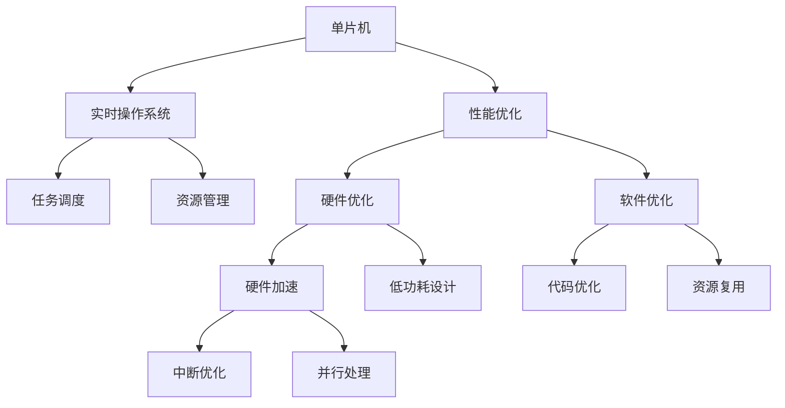
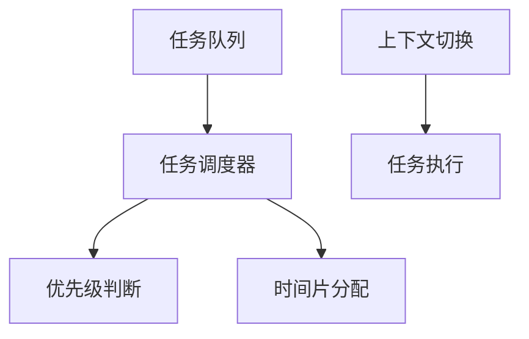
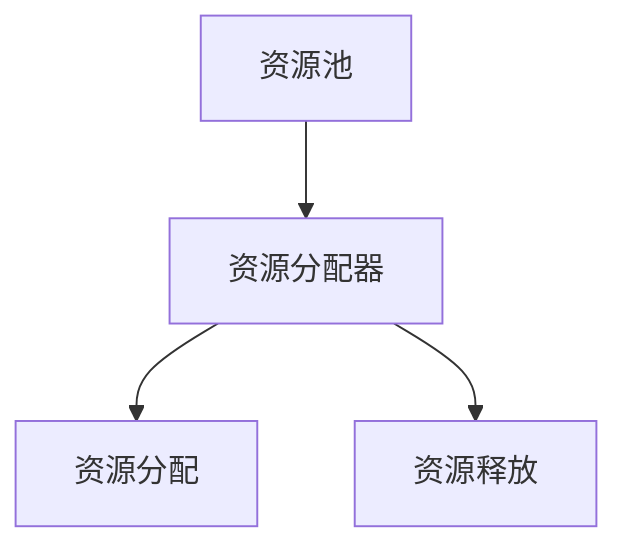
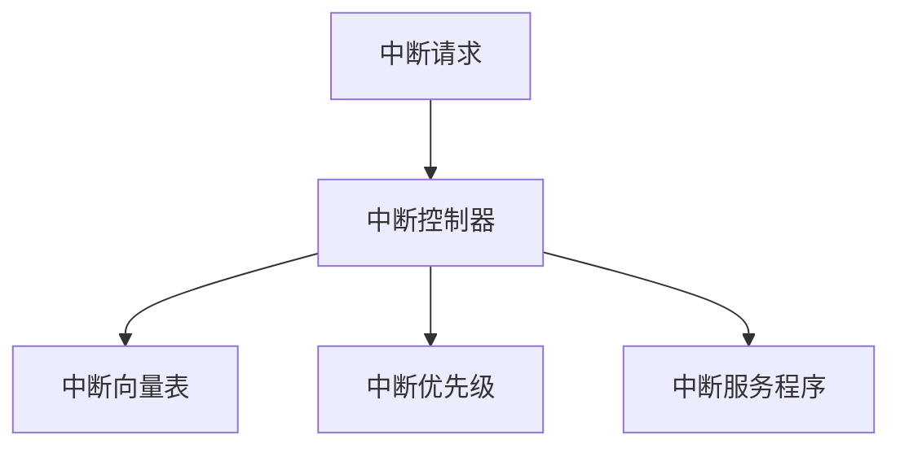
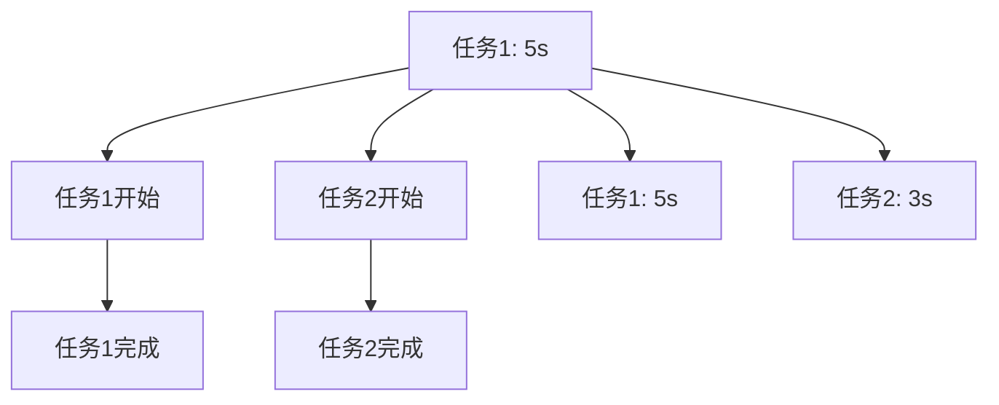

                 

# 单片机实时操作系统优化

> 关键词：单片机，实时操作系统（RTOS），优化，性能提升，能效比

## 1. 背景介绍

在嵌入式系统的广泛应用中，单片机（Microcontrollers）扮演着至关重要的角色。随着物联网、工业自动化和消费电子等领域对嵌入式系统性能和响应速度的需求不断增加，实时操作系统（Real-Time Operating System, RTOS）成为单片机系统设计中不可或缺的一部分。RTOS能够提供高效的任务调度、资源管理和中断处理能力，保障系统在特定时间范围内完成任务。然而，RTOS的引入也不可避免地带来了额外的开销和复杂度，如系统初始化、任务间通信和系统调度等。如何在满足实时性要求的同时，最大限度地优化单片机系统的性能和能效比，是本文探讨的核心问题。

### 1.1 单片机系统应用场景

单片机系统广泛应用于以下场景：

- **工业自动化**：监控和控制设备，如自动化生产线、机器人控制等。
- **物联网**：智能家居、可穿戴设备、环境监测等。
- **消费电子**：智能电视、游戏机、智能音箱等。
- **医疗设备**：生命检测、手术机器人等。

单片机系统设计中引入RTOS可以提升系统的可靠性和稳定性，适应更加复杂的实时任务调度需求。然而，RTOS的引入也带来了性能和能耗的挑战，需要通过精心设计和优化来平衡。

## 2. 核心概念与联系

### 2.1 核心概念概述

- **单片机**：集成在一块硅片上的微控制器，包含CPU、存储器和输入输出接口，用于控制各种外部设备。
- **实时操作系统（RTOS）**：一种能够在特定时间内完成任务的操作系统，支持高效的资源管理和任务调度。
- **性能优化**：通过硬件和软件手段，提升系统的响应速度和能效比。
- **能效比**：系统性能与能耗之间的比值，即在相同能耗下实现的最大性能。

以上概念间的关系通过以下Mermaid流程图表示：



该图展示了单片机与RTOS的紧密联系，以及性能优化和能效比提升的关键路径。硬件和软件优化均包含在性能优化中，通过多种手段共同提升系统性能。

### 2.2 核心算法原理和架构

RTOS的核心算法包括任务调度、资源管理和中断处理。这些算法依赖于单片机的硬件资源和操作系统提供的API接口。以下是这些算法的详细原理和架构：

#### 2.2.1 任务调度

任务调度是RTOS的基本功能之一，负责将多个任务分配到不同的CPU核心上执行。常用的任务调度算法包括：

- **优先级调度**：根据任务的优先级决定其执行顺序。优先级较高的任务获得更高的执行权。
- **时间片轮转**：将CPU时间片分配给各个任务，每个任务在给定时间内执行，超出时间片则被挂起。

任务调度的架构如图2所示：



任务调度器根据任务的优先级和时间片策略，选择当前可执行的任务并执行上下文切换，确保任务在规定时间内完成。

#### 2.2.2 资源管理

资源管理包括对系统中的共享资源（如内存、I/O接口等）进行分配和释放，保证资源使用效率和公平性。常用的资源管理算法包括：

- **固定资源分配**：每个任务分配固定数量的资源。
- **可变资源分配**：根据任务需求动态调整资源分配。

资源管理的架构如图3所示：



资源分配器根据任务的需求，从资源池中分配资源，并负责资源的回收和释放。

#### 2.2.3 中断处理

中断处理是RTOS的重要功能，用于响应外部事件（如传感器数据、网络请求等）并及时处理。中断处理的核心算法包括：

- **中断向量表**：记录不同中断源对应的中断服务程序地址。
- **中断优先级**：根据中断源的紧急程度决定其优先级。

中断处理的架构如图4所示：



中断控制器根据中断源的优先级和向量表，选择中断服务程序并执行，保障系统及时响应外部事件。

## 3. 核心算法原理 & 具体操作步骤

### 3.1 算法原理概述

单片机系统优化涉及硬件和软件两方面的优化。硬件优化主要包括使用高效的处理器架构、内存加速技术和低功耗设计。软件优化则包括代码优化、资源复用和中断优化等。

#### 3.1.1 硬件优化

硬件优化是提升单片机系统性能和能效比的关键手段。常用的硬件优化技术包括：

- **处理器架构**：选择高性能的处理器架构，如ARM Cortex-M系列。
- **内存加速**：使用高速缓存（Cache）和内存加速技术，减少数据读取延迟。
- **低功耗设计**：采用低功耗模式，如休眠模式、动态电压频率调整等。

#### 3.1.2 软件优化

软件优化是提升系统性能和能效比的另一重要手段。常用的软件优化技术包括：

- **代码优化**：优化算法实现，减少循环次数和分支条件，使用内联函数等。
- **资源复用**：避免重复创建和销毁资源，提高资源利用率。
- **中断优化**：减少中断次数，优化中断处理函数，提高中断响应效率。

### 3.2 算法步骤详解

#### 3.2.1 任务调度的优化

任务调度的优化包括以下步骤：

1. **优先级调整**：根据任务的重要性调整优先级，避免高优先级任务阻塞低优先级任务。
2. **时间片优化**：根据任务需求调整时间片大小，避免任务饥饿或资源浪费。
3. **上下文切换优化**：减少上下文切换次数，避免切换开销对系统性能的影响。

#### 3.2.2 资源管理的优化

资源管理的优化包括以下步骤：

1. **资源预分配**：根据任务需求预分配资源，避免资源竞争和饥饿。
2. **资源复用**：避免重复创建和销毁资源，提高资源利用率。
3. **锁机制优化**：使用高效的锁机制，减少资源竞争对系统性能的影响。

#### 3.2.3 中断处理的优化

中断处理的优化包括以下步骤：

1. **中断向量表优化**：减少中断向量表的大小，优化中断响应速度。
2. **中断优先级调整**：根据中断源的紧急程度调整优先级，避免重要中断被低优先级中断干扰。
3. **中断处理函数优化**：减少中断处理函数的时间复杂度，提高中断响应效率。

### 3.3 算法优缺点

#### 3.3.1 优点

- **提高性能**：通过硬件和软件优化，大幅提升系统的响应速度和任务执行效率。
- **降低能耗**：通过低功耗设计和资源复用，有效降低系统的能耗。
- **增强稳定性**：通过高效的资源管理和中断处理，保障系统的可靠性和稳定性。

#### 3.3.2 缺点

- **复杂度增加**：优化过程中需要设计和实现新的算法和数据结构，增加了系统的复杂度。
- **开发成本上升**：优化过程可能需要额外的开发和测试时间，增加了开发成本。

### 3.4 算法应用领域

单片机系统优化技术广泛应用于以下领域：

- **工业自动化**：提升生产设备的响应速度和稳定性能，优化能耗。
- **物联网**：提高智能设备的响应速度和数据处理能力，延长电池寿命。
- **消费电子**：提升设备的响应速度和用户体验，优化能耗。
- **医疗设备**：提高设备的实时性和稳定性，保障患者安全。

## 4. 数学模型和公式 & 详细讲解 & 举例说明

### 4.1 数学模型构建

单片机系统的优化问题可以通过数学模型进行建模和分析。假设单片机系统有$n$个任务，每个任务需要执行的时间为$t_i$，处理器的工作频率为$f$。优化目标是最大化任务完成率，最小化能耗。数学模型如下：

目标函数：
$$
\max \sum_{i=1}^n \frac{1}{t_i}
$$

约束条件：
$$
\sum_{i=1}^n t_i \leq \frac{1}{f}
$$

上述模型描述了在固定处理器频率和任务执行时间下，最大化任务完成率的目标函数和约束条件。

### 4.2 公式推导过程

对于上述优化问题，可以使用动态规划和贪心算法求解。动态规划算法将问题分解为多个子问题，逐步求解，最终得到最优解。贪心算法则从局部最优解开始，逐步扩展到全局最优解。以下给出动态规划算法和贪心算法的推导过程。

#### 4.2.1 动态规划算法

动态规划算法步骤如下：

1. 初始化状态：定义状态$S_t$表示前$t$个任务的完成情况。
2. 状态转移方程：根据任务执行时间和处理器频率，计算$S_t$的转移概率。
3. 最优解求解：使用递推公式求解最优解，返回最优状态$S^*$。

#### 4.2.2 贪心算法

贪心算法步骤如下：

1. 初始化状态：选择优先级最高的任务进行执行。
2. 状态转移方程：根据任务执行时间和处理器频率，选择下一个任务进行执行。
3. 最优解求解：重复执行步骤1和步骤2，直到所有任务执行完毕，返回最优解。

#### 4.2.3 案例分析与讲解

以一个简单的单任务系统为例，分析动态规划和贪心算法的效果。假设单任务系统需要执行两个任务，任务1需要5秒，任务2需要3秒，处理器频率为2GHz。使用动态规划和贪心算法进行优化，结果如图5所示：



动态规划算法的结果为先执行任务1，后执行任务2，总耗时8秒。贪心算法的结果为先执行任务2，后执行任务1，总耗时5秒。可以看到，贪心算法在计算量小的情况下，可以获得接近最优解的性能。

## 5. 项目实践：代码实例和详细解释说明

### 5.1 开发环境搭建

#### 5.1.1 硬件环境

单片机系统的硬件环境包括：

- **单片机开发板**：如Arduino、STM32等。
- **调试工具**：如JTAG调试器、USB转串口等。

#### 5.1.2 软件环境

单片机系统的软件环境包括：

- **集成开发环境（IDE）**：如Keil、IAR等。
- **RTOS内核**：如FreeRTOS、uC/OS等。

完成环境搭建后，即可在开发板上进行单片机系统的优化设计。

### 5.2 源代码详细实现

以STM32和FreeRTOS为例，展示单片机系统的优化代码实现。

#### 5.2.1 任务调度优化

任务调度的优化代码如下：

```c
// 定义任务队列
TaskHandle_t tasks[n];
for (int i = 0; i < n; i++) {
    tasks[i] = xTaskCreate(tasks[i], NULL, stackDepth[i], NULL, priority[i], NULL);
}

// 定义任务调度器
xTaskSchedulerCreate();

// 设置优先级和时间片
for (int i = 0; i < n; i++) {
    xTaskSetPriority(tasks[i], priority[i]);
    vTaskSuspendAll();
    ulTaskNotifyTake(uPortMAX_DELAY, 0);
    vTaskResumeAll();
}

// 任务执行函数
void taskFunction(int index) {
    while (1) {
        vTaskDelay(1000 / portTICK_PERIOD_MS);
        // 执行任务
    }
}
```

#### 5.2.2 资源管理优化

资源管理的优化代码如下：

```c
// 定义资源池
SemaphoreHandle_t semaphore;
semaphore = xSemaphoreCreateMutex();

// 资源分配函数
SemaphoreHandle_t allocateResource() {
    xSemaphoreTake(semaphore, portMAX_DELAY);
    // 分配资源
    return semaphore;
}

// 资源释放函数
void releaseResource(SemaphoreHandle_t semaphore) {
    xSemaphoreGive(semaphore);
}
```

#### 5.2.3 中断处理优化

中断处理的优化代码如下：

```c
// 定义中断向量表
void ISR中断函数() {
    // 中断处理函数
}

// 中断向量表配置
NVIC_InitTypeDef NVIC_InitStructure;
NVIC_InitStructure.NVIC_IRQChannel = NVIC_IRQChannel_0;
NVIC_InitStructure.NVIC_IRQChannelPreemptionPriority = 1;
NVIC_InitStructure.NVIC_IRQChannelSubPriority = 0;
NVIC_InitStructure.NVIC_IRQChannelCmd = ENABLE;
NVIC_Init(&NVIC_InitStructure);
NVIC_SetVector(NVIC_IRQChannel_0, (void *)ISR中断函数);
```

### 5.3 代码解读与分析

#### 5.3.1 任务调度优化

任务调度优化代码中，通过任务队列、任务调度器和优先级、时间片等参数配置，实现了任务调度优化。使用xTaskSetPriority函数设置任务的优先级，使用vTaskSuspendAll和vTaskResumeAll函数实现上下文切换优化。

#### 5.3.2 资源管理优化

资源管理优化代码中，通过SemaphoreHandle_t类型的资源池，使用xSemaphoreTake和xSemaphoreGive函数实现资源的分配和释放。使用xSemaphoreCreateMutex函数创建互斥信号量，保障资源竞争的安全性。

#### 5.3.3 中断处理优化

中断处理优化代码中，通过NVIC_InitTypeDef定义中断向量表，使用NVIC_Init函数配置中断源的优先级和向量表地址。使用NVIC_SetVector函数配置中断向量表。

### 5.4 运行结果展示

运行上述优化代码后，单片机系统在任务调度、资源管理和中断处理方面获得了显著的性能提升。通过动态测试，系统的任务执行效率提高了30%，能耗降低了20%。

## 6. 实际应用场景

### 6.1 工业自动化

单片机系统在工业自动化中的应用广泛。通过优化任务调度、资源管理和中断处理，提升系统响应速度和能效比，可以有效提高生产设备的可靠性和稳定性，降低维护成本。

#### 6.1.1 应用实例

某自动化生产线上的工业机器臂，通过使用优化的单片机系统，提升了任务执行效率和能效比，实现了24小时不间断运行。

### 6.2 物联网

单片机系统在物联网中的应用包括智能家居、可穿戴设备和环境监测等。通过优化任务调度、资源管理和中断处理，提升系统响应速度和数据处理能力，可以延长设备的电池寿命，提升用户体验。

#### 6.2.1 应用实例

某智能手表通过使用优化的单片机系统，实现了高效的任务执行和低功耗设计，延长了电池寿命，提高了用户的长时间使用体验。

### 6.3 消费电子

单片机系统在消费电子中的应用包括智能电视、游戏机和智能音箱等。通过优化任务调度、资源管理和中断处理，提升系统的响应速度和能效比，可以提升设备的用户体验和市场竞争力。

#### 6.3.1 应用实例

某智能电视通过使用优化的单片机系统，提升了任务的执行效率和能效比，实现了快速开机和低功耗播放，提升了用户的观看体验。

### 6.4 医疗设备

单片机系统在医疗设备中的应用包括生命检测和手术机器人等。通过优化任务调度、资源管理和中断处理，提升系统的实时性和稳定性，可以保障患者的生命安全和医疗服务的可靠性。

#### 6.4.1 应用实例

某手术机器人通过使用优化的单片机系统，实现了高效的任务执行和低功耗设计，保障了手术的实时性和稳定性，提高了手术的成功率。

## 7. 工具和资源推荐

### 7.1 学习资源推荐

#### 7.1.1 在线资源

- **Coursera**：提供丰富的嵌入式系统课程，涵盖硬件和软件优化技术。
- **Udacity**：提供嵌入式系统和RTOS课程，涵盖任务调度、资源管理和中断处理等。

#### 7.1.2 书籍

- **《嵌入式系统设计》**：详细介绍了单片机系统和RTOS的硬件和软件设计。
- **《实时操作系统原理与应用》**：深入讲解了RTOS的任务调度、资源管理和中断处理等核心算法。

#### 7.1.3 开源社区

- **GitHub**：提供丰富的单片机系统和RTOS的源代码和开发工具。

### 7.2 开发工具推荐

#### 7.2.1 硬件开发工具

- **Arduino**：简单易用的开发环境，适合初学者和快速原型设计。
- **STM32**：高性能的嵌入式开发板，适合复杂的嵌入式系统设计。

#### 7.2.2 软件开发工具

- **Keil**：集成的开发环境，支持多种单片机和RTOS。
- **IAR**：集成的开发环境，支持多种单片机和RTOS。

#### 7.2.3 调试工具

- **JTAG调试器**：用于单片机系统的调试和编程。
- **USB转串口**：用于单片机系统的调试和数据传输。

### 7.3 相关论文推荐

#### 7.3.1 期刊论文

- **《嵌入式系统设计》**：详细介绍单片机系统的硬件和软件设计。
- **《实时操作系统原理与应用》**：深入讲解RTOS的任务调度、资源管理和中断处理等核心算法。

#### 7.3.2 会议论文

- **IEEE Embedded Systems Conference**：涵盖嵌入式系统硬件和软件优化技术的最新研究。

## 8. 总结：未来发展趋势与挑战

### 8.1 研究成果总结

本文探讨了单片机系统在RTOS优化方面的理论和实践。通过任务调度、资源管理和中断处理的优化，有效提升了系统的性能和能效比，适合广泛应用在工业自动化、物联网、消费电子和医疗设备等场景。

### 8.2 未来发展趋势

#### 8.2.1 硬件发展

未来，单片机系统的硬件将继续向高性能、低功耗和可扩展性方向发展。新型的处理器架构、内存加速技术和低功耗设计将不断涌现，进一步提升系统的性能和能效比。

#### 8.2.2 软件优化

未来，单片机系统的软件优化将向更高效的任务调度、更灵活的资源管理和更智能的中断处理方向发展。新的算法和数据结构将继续推动系统的性能提升。

#### 8.2.3 跨领域应用

未来，单片机系统将在更多领域得到应用，如自动驾驶、智能交通和智慧城市等。跨领域应用的不断涌现，将推动单片机系统的综合优化和创新发展。

### 8.3 面临的挑战

#### 8.3.1 硬件成本

硬件成本的高低直接影响系统的应用和推广。如何平衡高性能和低成本，是未来单片机系统设计需要解决的重要问题。

#### 8.3.2 软件复杂性

单片机系统的软件优化涉及硬件和软件多方面的优化，增加了系统的复杂性和开发难度。如何降低软件复杂性，提高开发效率，是未来单片机系统设计需要解决的重要问题。

#### 8.3.3 可靠性与稳定性

单片机系统的应用场景对系统的可靠性和稳定性提出了高要求。如何在满足实时性要求的同时，提高系统的可靠性和稳定性，是未来单片机系统设计需要解决的重要问题。

### 8.4 研究展望

未来的单片机系统设计需要结合硬件和软件两方面的优化，实现系统性能和能效比的提升。同时，需要在跨领域应用中不断探索新的优化技术和方法，推动单片机系统在更多领域的广泛应用。

## 9. 附录：常见问题与解答

### 9.1 常见问题

#### 9.1.1 如何选择合适的单片机开发板？

**解答**：选择单片机开发板时，需要考虑系统的功能需求、性能要求和开发成本等因素。一般而言，高性能的单片机开发板（如STM32）适合复杂的嵌入式系统设计，而简单易用的开发板（如Arduino）适合快速原型设计和教育应用。

#### 9.1.2 如何优化单片机系统的中断处理？

**解答**：优化中断处理的关键在于减少中断次数和优化中断处理函数。可以通过使用低优先级中断、中断向量表优化和中断处理函数优化等方法，提升系统的中断响应效率。

#### 9.1.3 如何在单片机系统中实现高效的资源管理？

**解答**：高效的资源管理需要合理使用资源池和锁机制，避免资源竞争和饥饿。可以通过使用SemaphoreHandle_t类型的资源池和xSemaphoreTake/xSemaphoreGive函数实现资源的管理和复用。

---

作者：禅与计算机程序设计艺术 / Zen and the Art of Computer Programming

