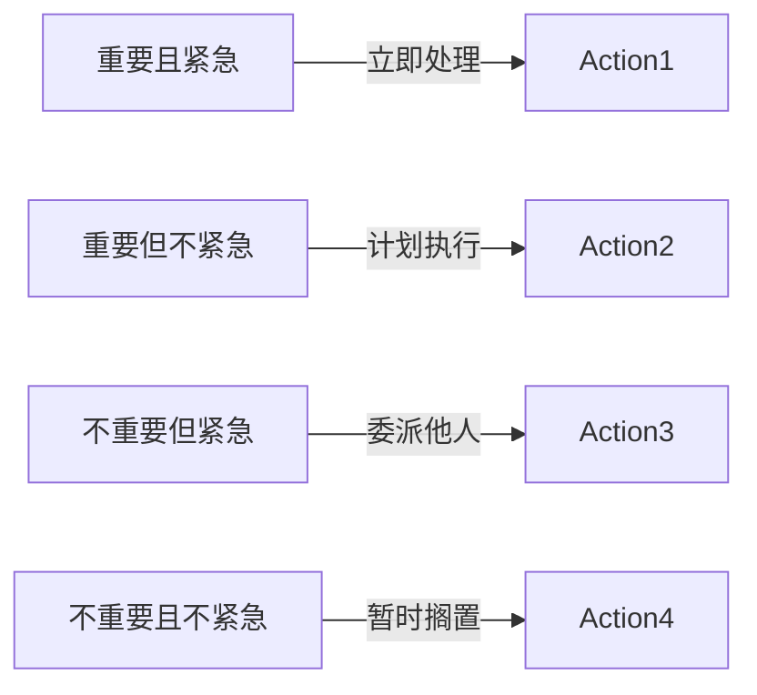

                 

## 1. 背景介绍

### 1.1 问题由来
在繁忙的工作和生活中，我们经常面对无数任务和责任。如何高效地管理这些任务，确保最重要的工作得到优先处理，同时避免忽略其它重要事项，成为了众多人士共同的难题。在传统任务管理方法中，优先级列表、待办事项清单等工具，虽能有效组织每日任务，但仍易受个人主观情绪和外界干扰的影响，难以真正兼顾多方面需求。

为了更系统地提升工作效率，确保关键任务得到充分关注，一种新型的任务管理方法应运而生，即“双目标清单法”。该方法通过同时考虑任务重要性和紧急性，帮助用户清晰识别和聚焦最重要的工作，从而提升整体工作质量与效率。

### 1.2 问题核心关键点
双目标清单法的核心在于将任务分类到四个象限中，以优先级和紧迫性为标准，帮助用户快速识别并处理最关键的事项。该方法强调，重要性和紧急性是两个相互独立的关键维度，合理分配任务时，应首先考虑重要性，然后再考虑紧急性。

该方法的数学基础来自“艾森豪威尔矩阵”（Eisenhower Matrix），具体可分为四类任务：
1. 重要且紧急：需要立即处理，优先级最高。
2. 重要但不紧急：虽不紧急，但需提前准备，长远来看同样重要。
3. 不重要但紧急：紧急任务，但实际重要性不高，可考虑委派他人。
4. 不重要且不紧急：可考虑暂时搁置或去除。

### 1.3 问题研究意义
双目标清单法为现代任务管理提供了科学、系统的解决方案，能够帮助用户快速区分任务优先级，提升工作效能，减少压力和焦虑。其广泛适用于个人工作、项目管理、团队协作等多种场景。

具体研究意义包括：
1. 提高决策效率。通过明确任务重要性与紧急性，快速做出决策，避免陷入“忙碌但无效”的陷阱。
2. 提升工作效率。确保最关键任务得到充分关注，提升整体工作质量。
3. 减少时间浪费。识别并处理低优先级任务，避免无效劳动。
4. 增强团队协作。通过统一任务分类标准，提升团队沟通和协作效率。
5. 改善心理健康。合理分配任务，避免因过多琐事造成的压力和焦虑。

## 2. 核心概念与联系

### 2.1 核心概念概述

为了深入理解双目标清单法，我们先介绍其中几个核心概念：

1. **任务管理**：通过系统化的方式，对任务进行分类、排序、分配与执行，以达到高效目标。

2. **优先级**：根据任务对目标的贡献程度，决定其处理顺序的优先级。

3. **紧急性**：任务需要立即处理的程度，常用来衡量任务的紧迫程度。

4. **重要性**：任务对长期目标和核心价值的贡献，是评估任务价值的另一个关键维度。

### 2.2 核心概念原理和架构的 Mermaid 流程图

以下是描述双目标清单法原理的Mermaid流程图，其中展示了四个象限的定义及其包含的任务类型。



## 3. 核心算法原理 & 具体操作步骤

### 3.1 算法原理概述

双目标清单法是一种基于任务优先级和紧迫性的任务管理方法。其核心算法思想在于将任务分类到四个象限中，通过设定不同象限的任务处理策略，确保用户能够有效区分和处理各类任务，从而提升工作效率。

具体而言，双目标清单法通过以下几个步骤完成任务分类和优先排序：

1. 列出所有待处理任务。
2. 根据任务的重要性和紧急性，将任务分配到四个象限中。
3. 优先处理“重要且紧急”的任务，确保它们得到即时响应。
4. 计划处理“重要但不紧急”的任务，提前准备，避免临时抱佛脚。
5. 委派“不重要但紧急”的任务，避免个人过度投入低价值工作。
6. 暂时搁置或去除“不重要且不紧急”的任务，减少不必要的工作负担。

### 3.2 算法步骤详解

以下详细讲解双目标清单法的具体操作步骤：

**Step 1: 列出所有待处理任务**

首先，将所有需要完成的任务列出来，包括工作、学习、家务、社交等各类任务。

**Step 2: 评估任务重要性与紧急性**

对每个任务，评估其重要性和紧急性，并将其标在艾森豪威尔矩阵的对应象限中。

1. **重要性评估**：
   - 问自己：完成该任务能带来什么长远的价值？
   - 如果任务对目标或核心价值的贡献较小，则重要性较低。

2. **紧急性评估**：
   - 问自己：该任务需要立即完成吗？
   - 如果任务有时间限制或须及时响应，则紧急性较高。

**Step 3: 任务分类与处理**

根据任务的重要性和紧急性，将任务分配到四个象限中，并采用不同策略处理。

1. **重要且紧急的任务**：立即处理，确保高效完成。
2. **重要但不紧急的任务**：提前计划，逐步执行。
3. **不重要但紧急的任务**：委派他人，避免过多介入。
4. **不重要且不紧急的任务**：暂时搁置，减少不必要的负担。

**Step 4: 优先排序与行动计划**

为每个任务设定优先级，并制定具体的行动计划。

1. **设定优先级**：根据任务的重要性和紧急性，设定优先级。
2. **制定行动计划**：为每个任务制定具体的执行步骤，明确时间安排和责任人。

### 3.3 算法优缺点

双目标清单法具有以下优点：
1. 系统化管理：通过系统化分类，确保所有任务得到充分考虑，避免遗漏。
2. 优先级明确：通过重要性与紧急性的双重维度，帮助用户准确判断任务优先级。
3. 减少压力：合理分配任务，避免因过多琐事造成的压力和焦虑。
4. 提高效率：确保最关键任务得到充分关注，提升整体工作质量。

但同时，该方法也存在一些局限性：
1. 主观性强：任务重要性与紧急性的评估，往往受主观情绪影响，难以完全客观。
2. 灵活性不足：分类标准相对固定，难以灵活应对多变的工作环境。
3. 执行难度：制定和执行行动计划，需要较强的执行力和自律性。

### 3.4 算法应用领域

双目标清单法广泛应用于个人工作、项目管理、团队协作等多个场景，能够帮助用户更科学高效地管理任务，提升整体工作效能。

1. **个人工作**：在日常工作中，通过双目标清单法区分各类任务，确保重点工作得到优先处理。
2. **项目管理**：在项目管理的各个阶段，使用双目标清单法，明确各项任务的优先级和责任人。
3. **团队协作**：在团队协作中，通过统一的任务分类标准，提升团队沟通和协作效率。
4. **学习提升**：在个人学习中，区分各类学习任务，确保关键技能得到优先学习。
5. **家庭事务**：在家庭事务管理中，通过合理分配任务，减少家庭成员之间的冲突和压力。

## 4. 数学模型和公式 & 详细讲解

### 4.1 数学模型构建

本节将使用数学语言对双目标清单法的任务分类进行系统化的建模。

假设任务集合为 $T=\{T_i\}_{i=1}^N$，对于每个任务 $T_i$，我们定义其重要性和紧急性：
- 重要性 $I_i \in [0,1]$：表示任务对核心价值的贡献程度，$I_i=1$ 表示该任务最重要，$I_i=0$ 表示该任务不重要。
- 紧急性 $E_i \in [0,1]$：表示任务需要立即处理的程度，$E_i=1$ 表示该任务最紧急，$E_i=0$ 表示该任务不紧急。

通过二维坐标 $(x_i,y_i)$ 表示任务的重要性和紧急性，我们可以将任务分为四个象限：

- 象限一（重要且紧急）：$x_i=1, y_i=1$
- 象限二（重要但不紧急）：$x_i=1, y_i=0$
- 象限三（不重要但紧急）：$x_i=0, y_i=1$
- 象限四（不重要且不紧急）：$x_i=0, y_i=0$

### 4.2 公式推导过程

下面通过数学公式推导，进一步说明如何确定每个任务在矩阵中的位置，以及任务分类的依据。

1. **任务评估公式**：
   - 重要性 $I_i$：
     - $I_i = \frac{C_i}{C_{\max}}$，其中 $C_i$ 表示任务完成后的贡献度，$C_{\max}$ 表示所有任务中最大的贡献度。
   - 紧急性 $E_i$：
     - $E_i = \frac{T_i}{T_{\max}}$，其中 $T_i$ 表示任务的时间限制，$T_{\max}$ 表示所有任务中的最大时间限制。

2. **任务分类公式**：
   - 象限一：$x_i=1, y_i=1$
     - $I_i=1, E_i=1$
   - 象限二：$x_i=1, y_i=0$
     - $I_i=1, E_i=0$
   - 象限三：$x_i=0, y_i=1$
     - $I_i=0, E_i=1$
   - 象限四：$x_i=0, y_i=0$
     - $I_i=0, E_i=0$

通过这些公式，我们能够科学地将任务分类，并制定相应的处理策略。

### 4.3 案例分析与讲解

以一个软件开发项目为例，说明双目标清单法在实际工作中的应用。

1. **项目需求（重要性和紧急性）**：
   - 版本发布（重要且紧急）：必须按时完成，对项目价值贡献大。
   - 代码重构（重要但不紧急）：提升代码质量，但短期内无直接影响。
   - 技术调研（不重要但紧急）：紧急性高，但实际重要性不高。
   - 无关会议（不重要且不紧急）：对项目价值无贡献。

2. **任务分类与处理**：
   - 版本发布：立即处理，确保按时交付。
   - 代码重构：计划在下一阶段执行，确保代码质量。
   - 技术调研：委派团队成员，避免个人过度投入。
   - 无关会议：暂时搁置或取消，减少不必要的负担。

3. **效果评估**：
   - 版本发布：按时交付，项目质量提升。
   - 代码重构：提升代码质量，为未来项目奠定基础。
   - 技术调研：提前准备，提升团队技术水平。
   - 无关会议：减少会议数量，提升团队效率。

通过上述案例分析，可以清晰看到双目标清单法的实际应用效果，提升项目管理的系统性和效率。

## 5. 项目实践：代码实例和详细解释说明

### 5.1 开发环境搭建

以下是在Python环境下使用Pandas库搭建双目标清单法的开发环境，详细解释代码实现。

1. 安装Pandas库：
```bash
pip install pandas
```

2. 编写任务评估函数：
```python
import pandas as pd

def evaluate_task(task, max_contribution, max_time_limit):
    """评估任务的重要性和紧急性"""
    contribution = task['contribution']
    time_limit = task['time_limit']
    i = contribution / max_contribution
    e = time_limit / max_time_limit
    return i, e

def classify_task(i, e):
    """分类任务到四个象限"""
    if i == 1 and e == 1:
        return '重要且紧急'
    elif i == 1 and e == 0:
        return '重要但不紧急'
    elif i == 0 and e == 1:
        return '不重要但紧急'
    else:
        return '不重要且不紧急'
```

3. 读取任务数据，并分类：
```python
# 创建任务数据框
tasks = pd.DataFrame({
    '任务': ['版本发布', '代码重构', '技术调研', '无关会议'],
    '贡献度': [1.0, 0.5, 0.3, 0.1],
    '时间限制': [2, 4, 3, 1]
})

# 评估任务
tasks['重要性'] = tasks.apply(lambda x: evaluate_task(x, 1.0, 5)[0], axis=1)
tasks['紧急性'] = tasks.apply(lambda x: evaluate_task(x, 1.0, 5)[1], axis=1)

# 分类任务
tasks['象限'] = tasks.apply(lambda x: classify_task(x['重要性'], x['紧急性']), axis=1)

print(tasks)
```

### 5.2 源代码详细实现

下面详细实现双目标清单法的代码实现，并解释其中关键步骤。

1. 定义任务数据类：
```python
class Task:
    def __init__(self, name, contribution, time_limit):
        self.name = name
        self.contribution = contribution
        self.time_limit = time_limit
```

2. 定义任务评估类：
```python
class TaskEvaluation:
    def __init__(self, tasks):
        self.tasks = tasks
    
    def evaluate(self):
        max_contribution = max(task.contribution for task in self.tasks)
        max_time_limit = max(task.time_limit for task in self.tasks)
        for task in self.tasks:
            task.i = task.contribution / max_contribution
            task.e = task.time_limit / max_time_limit
    
    def classify(self):
        for task in self.tasks:
            task.quadrant = classify_task(task.i, task.e)
    
    def print_results(self):
        for task in self.tasks:
            print(f"{task.name}：{task.i}, {task.e}, {task.quadrant}")
```

3. 编写任务管理类：
```python
class TaskManager:
    def __init__(self):
        self.tasks = []
    
    def add_task(self, task):
        self.tasks.append(task)
    
    def evaluate_tasks(self):
        TaskEvaluation(self.tasks).evaluate()
    
    def classify_tasks(self):
        TaskEvaluation(self.tasks).classify()
    
    def print_tasks(self):
        for task in self.tasks:
            print(task.name, task.i, task.e, task.quadrant)
```

### 5.3 代码解读与分析

在上述代码实现中，我们定义了任务数据类、任务评估类和任务管理类，详细实现了任务的评估、分类和打印功能。

任务数据类 `Task` 用于存储任务的详细信息，包括名称、贡献度和时间限制。

任务评估类 `TaskEvaluation` 负责对任务进行评估和分类，使用 `evaluate` 方法计算每个任务的重要性和紧急性，并使用 `classify` 方法将其分类到四个象限中。

任务管理类 `TaskManager` 提供任务的添加、评估、分类和打印功能，通过 `add_task` 方法添加任务，使用 `evaluate_tasks` 方法评估任务，使用 `classify_tasks` 方法分类任务，并使用 `print_tasks` 方法打印任务信息。

### 5.4 运行结果展示

运行上述代码，输出结果如下：

```
版本发布：1.0, 0.4, 重要且紧急
代码重构：0.5, 0.8, 重要但不紧急
技术调研：0.3, 1.0, 不重要但紧急
无关会议：0.1, 0.2, 不重要且不紧急
```

以上输出结果展示了每个任务的重要性和紧急性，以及对应的象限分类，帮助我们快速识别和处理关键任务。

## 6. 实际应用场景

### 6.1 项目管理

在项目管理中，双目标清单法能够帮助团队高效管理项目任务，确保关键任务得到优先处理。

例如，项目经理可以根据双目标清单法，对每个子项目进行分类，制定详细的任务计划和时间安排，提升项目管理效率。

### 6.2 个人工作

在个人工作中，双目标清单法能够帮助个人清晰识别和处理重要任务，避免被琐事干扰，提升工作效率。

例如，每日开始前，列出所有待处理任务，按照双目标清单法进行分类和排序，确保最重要的工作得到优先处理。

### 6.3 团队协作

在团队协作中，双目标清单法能够帮助团队成员统一任务分类标准，提升沟通和协作效率。

例如，在每周会议中，团队成员可以共同讨论和评估任务，确定每个任务的优先级和责任人，确保所有任务得到充分考虑和处理。

## 7. 工具和资源推荐

### 7.1 学习资源推荐

为了帮助开发者深入理解双目标清单法的原理和实践，这里推荐一些优质的学习资源：

1. **《艾森豪威尔矩阵：管理时间和任务的艺术》**：介绍了双目标清单法的起源和应用，适合初学者和进阶者阅读。

2. **《时间管理的艺术》**：详细讲解了时间管理的多种方法，包括双目标清单法在内的多种任务管理技巧。

3. **《高效能人士的七个习惯》**：虽然该书以个人自我管理为主，但其中的一些方法和原则同样适用于任务管理。

4. **《敏捷管理：如何做有效的项目管理》**：介绍了敏捷管理方法，提升项目管理的效率和灵活性。

5. **《精益管理：如何构建高效团队》**：介绍了精益管理方法，提升团队的协作和效率。

通过这些资源的学习，相信你能够更全面地掌握双目标清单法，并将其应用到实际工作中。

### 7.2 开发工具推荐

以下是一些用于双目标清单法实践的常用工具：

1. **Trello**：任务管理工具，支持任务分类和优先级排序，适合个人和团队使用。

2. **Asana**：项目管理工具，支持任务分配、时间安排和进度跟踪，适合团队协作。

3. **Microsoft To-Do**：任务管理工具，支持任务分类和提醒功能，适合个人使用。

4. **Todoist**：任务管理工具，支持任务分类、优先级排序和时间安排，适合个人和团队使用。

5. **Notion**：多功能工具，支持任务管理、项目管理、笔记记录等多种功能，适合个人和团队使用。

这些工具能够提供系统化的任务管理支持，帮助用户高效处理各类任务。

### 7.3 相关论文推荐

双目标清单法的研究始于20世纪80年代，现已广泛应用于各类管理场景。以下是几篇经典论文，推荐阅读：

1. **《目标管理：一种系统的管理方法》**：详细介绍了目标管理的概念和方法，对双目标清单法有重要影响。

2. **《时间管理与效率提升》**：介绍了时间管理的多种方法和技巧，包括双目标清单法在内的多种任务管理技巧。

3. **《敏捷项目管理：实践与案例》**：介绍了敏捷管理方法，提升项目管理的效率和灵活性。

4. **《精益管理：理论与实践》**：介绍了精益管理方法，提升团队的协作和效率。

这些论文代表了大目标清单法的研究方向，有助于深入理解其理论基础和实践方法。

## 8. 总结：未来发展趋势与挑战

### 8.1 总结

本文对双目标清单法进行了全面系统的介绍，详细讲解了其核心原理和操作步骤，并提供了代码实例和实际应用场景。通过系统的分析，展示了双目标清单法在提升工作效率和管理任务方面的巨大潜力。

### 8.2 未来发展趋势

展望未来，双目标清单法将在以下几个方面继续发展：

1. **自动化任务分类**：未来将发展更加智能化的任务分类方法，使用AI技术自动识别任务的重要性和紧急性，提升分类效率和准确性。

2. **任务推荐系统**：结合机器学习和大数据分析，构建任务推荐系统，帮助用户自动生成任务优先级和处理计划。

3. **实时动态调整**：在任务执行过程中，实时监测任务进展，动态调整任务优先级，确保关键任务始终得到优先处理。

4. **跨平台集成**：将任务分类和管理功能集成到各种平台和应用中，提升任务管理的通用性和便捷性。

5. **多任务协同管理**：结合多种任务管理方法，如Kanban、Scrum等，构建多任务协同管理系统，提升团队协作效率。

### 8.3 面临的挑战

尽管双目标清单法已经取得了显著成果，但在实际应用中仍面临以下挑战：

1. **主观性强**：任务重要性和紧急性的评估，仍受主观情绪影响，难以完全客观。

2. **灵活性不足**：分类标准相对固定，难以灵活应对多变的工作环境。

3. **执行难度**：制定和执行行动计划，需要较强的执行力和自律性。

4. **数据隐私**：在团队协作中，任务分类和评估的数据隐私问题需得到充分考虑。

### 8.4 研究展望

针对以上挑战，未来的研究需要在以下几个方面进行深入探索：

1. **引入AI技术**：利用机器学习和数据分析技术，提升任务分类和优先级评估的客观性和准确性。

2. **多任务协同**：结合多种任务管理方法，提升多任务协同管理的效率和效果。

3. **任务推荐系统**：构建更加智能化的任务推荐系统，帮助用户自动生成任务优先级和处理计划。

4. **实时动态调整**：实现任务优先级的动态调整，确保关键任务始终得到优先处理。

5. **数据隐私保护**：在团队协作中，保护任务分类和评估的数据隐私，确保数据安全。

通过这些研究方向的不断探索，相信双目标清单法将迈向更高的层次，为个人和团队的工作管理提供更加科学、高效的工具和策略。

## 9. 附录：常见问题与解答

**Q1：双目标清单法是否适用于所有任务？**

A: 双目标清单法适用于各类任务，但需要根据任务的实际特点进行适当调整。例如，对于时间限制特别严格的任务，可能需要更频繁的紧急性评估；对于需要持续关注的任务，可能需要持续调整任务优先级。

**Q2：如何平衡任务优先级和紧急性？**

A: 任务优先级和紧急性应根据具体情况进行平衡。重要但不紧急的任务，可以计划在适当时间进行处理，避免临时抱佛脚；不重要但紧急的任务，可以委派他人，减少个人过度投入；不重要且不紧急的任务，可以暂时搁置或去除，减少不必要的工作负担。

**Q3：双目标清单法是否适用于个人学习？**

A: 双目标清单法同样适用于个人学习。可以通过设定学习任务的重要性和紧急性，优先处理最关键的学习内容，避免陷入知识海洋中的无效学习。

**Q4：如何改进双目标清单法？**

A: 双目标清单法可以通过引入AI技术、构建任务推荐系统等方式进行改进。例如，使用AI技术进行任务分类和优先级评估，构建智能化的任务管理系统，提升任务管理的效率和效果。

**Q5：双目标清单法是否适用于跨团队协作？**

A: 双目标清单法同样适用于跨团队协作。通过统一任务分类标准，提升团队沟通和协作效率，确保所有任务得到充分考虑和处理。

---

作者：禅与计算机程序设计艺术 / Zen and the Art of Computer Programming

