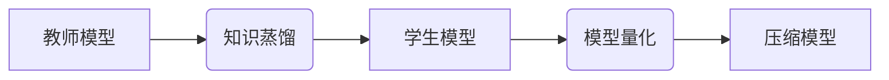

> 知识蒸馏，模型量化，深度学习，模型压缩，高效推理

## 1. 背景介绍

深度学习模型在图像识别、自然语言处理等领域取得了显著的成果，但其庞大的模型规模和高昂的计算成本限制了其在移动设备、嵌入式系统等资源受限环境中的应用。为了解决这一问题，模型压缩技术应运而生，其中知识蒸馏和模型量化是两种重要的技术手段。

**1.1 模型压缩的必要性**

随着深度学习模型规模的不断增长，模型参数量和计算复杂度也随之增加，这导致了以下问题：

* **存储成本高：** 大型模型需要大量的存储空间，这在移动设备和嵌入式系统中是一个挑战。
* **推理速度慢：** 模型推理需要大量的计算资源，这会导致延迟和性能下降。
* **部署成本高：** 部署大型模型需要强大的硬件设备，这增加了部署成本。

**1.2 知识蒸馏与模型量化的优势**

* **知识蒸馏：** 通过训练一个较小的学生模型来模仿一个较大的教师模型的知识，从而实现模型压缩。
* **模型量化：** 将模型参数从高精度（例如32位浮点数）量化为低精度（例如8位整数），从而减少模型大小和计算量。

## 2. 核心概念与联系

**2.1 知识蒸馏**

知识蒸馏是一种模型压缩技术，它通过训练一个较小的学生模型来模仿一个较大的教师模型的知识。教师模型通常是一个经过充分训练的预训练模型，而学生模型则是一个更小的模型，其目标是尽可能地模仿教师模型的输出。

**2.2 模型量化**

模型量化是一种将模型参数从高精度（例如32位浮点数）量化为低精度（例如8位整数）的技术。量化可以有效地减少模型大小和计算量，从而提高模型的效率。

**2.3 知识蒸馏与模型量化的结合**

将知识蒸馏和模型量化结合起来可以进一步提高模型压缩的效果。

* **知识蒸馏可以帮助生成更紧凑的模型：** 通过知识蒸馏，可以将教师模型的知识转移到一个更小的学生模型中，从而减少模型参数量。
* **模型量化可以进一步降低模型大小和计算量：** 将学生模型的参数量化为低精度，可以进一步减少模型大小和计算量。

**2.4 结合应用架构**



## 3. 核心算法原理 & 具体操作步骤

**3.1 算法原理概述**

知识蒸馏与模型量化的结合应用主要包括以下步骤：

1. **训练教师模型：** 首先需要训练一个大型的教师模型，例如ResNet、BERT等。
2. **知识蒸馏：** 使用教师模型的输出作为监督信号，训练一个较小的学生模型。
3. **模型量化：** 将学生模型的参数量化为低精度，例如8位整数。
4. **评估压缩模型：** 评估压缩模型的性能，并根据需要进行调整。

**3.2 算法步骤详解**

1. **训练教师模型：** 使用大量的训练数据训练一个大型的教师模型，例如ResNet、BERT等。
2. **知识蒸馏：**
    * 选择一个较小的学生模型架构。
    * 使用教师模型的输出作为监督信号，训练学生模型。
    * 除了预测输出之外，还可以使用教师模型的中间层输出作为监督信号，从而更好地学习教师模型的知识。
3. **模型量化：**
    * 使用量化技术将学生模型的参数量化为低精度，例如8位整数。
    * 常用的量化方法包括量化感知训练、后训练量化等。
4. **评估压缩模型：** 使用测试数据评估压缩模型的性能，并根据需要进行调整。

**3.3 算法优缺点**

**优点：**

* 可以有效地压缩模型大小和计算量。
* 可以保持较高的模型精度。

**缺点：**

* 训练教师模型需要大量的计算资源。
* 知识蒸馏的训练过程可能比较复杂。

**3.4 算法应用领域**

* **移动设备：** 将深度学习模型部署到移动设备上，例如手机、平板电脑等。
* **嵌入式系统：** 将深度学习模型部署到嵌入式系统上，例如无人机、智能家居等。
* **边缘计算：** 将深度学习模型部署到边缘设备上，例如传感器、摄像头等。

## 4. 数学模型和公式 & 详细讲解 & 举例说明

**4.1 数学模型构建**

知识蒸馏的目标是训练一个学生模型，使其尽可能地模仿教师模型的知识。

* **教师模型输出：** $y_t = f_t(x)$，其中 $x$ 是输入数据， $f_t$ 是教师模型的函数， $y_t$ 是教师模型的输出。
* **学生模型输出：** $y_s = f_s(x)$，其中 $f_s$ 是学生模型的函数。

**4.2 公式推导过程**

知识蒸馏的损失函数通常由两个部分组成：

* **分类损失：** 衡量学生模型预测结果与真实标签之间的差异。
* **知识损失：** 衡量学生模型的输出与教师模型的输出之间的差异。

**4.3 案例分析与讲解**

假设我们使用知识蒸馏训练一个图像分类模型。

* 教师模型是一个预训练的ResNet模型，已经训练好了。
* 学生模型是一个较小的MobileNet模型。

我们可以使用交叉熵损失函数作为分类损失，并使用KL散度作为知识损失。

**4.4 量化模型的数学模型**

模型量化可以看作是一个映射关系，将高精度参数映射到低精度参数。

* **高精度参数：** $w_h$
* **低精度参数：** $w_l$

量化映射函数可以表示为：

$$w_l = Q(w_h)$$

其中 $Q$ 是量化函数。

## 5. 项目实践：代码实例和详细解释说明

**5.1 开发环境搭建**

* 操作系统：Ubuntu 20.04
* Python 版本：3.8
* 深度学习框架：PyTorch 1.8

**5.2 源代码详细实现**

```python
import torch
import torch.nn as nn
import torchvision.models as models

# 定义学生模型
class StudentModel(nn.Module):
    def __init__(self):
        super(StudentModel, self).__init__()
        # ...

    def forward(self, x):
        # ...

# 定义教师模型
teacher_model = models.resnet50(pretrained=True)

# 知识蒸馏
student_model = StudentModel()
criterion = nn.CrossEntropyLoss()
optimizer = torch.optim.Adam(student_model.parameters(), lr=0.001)

for epoch in range(num_epochs):
    for images, labels in train_loader:
        # 前向传播
        outputs_student = student_model(images)
        outputs_teacher = teacher_model(images)

        # 计算损失
        loss_student = criterion(outputs_student, labels)
        loss_knowledge = nn.KLDivLoss()(torch.softmax(outputs_student, dim=1), torch.softmax(outputs_teacher, dim=1))
        loss = loss_student + 0.1 * loss_knowledge

        # 反向传播
        optimizer.zero_grad()
        loss.backward()
        optimizer.step()

# 模型量化
quantized_model = torch.quantization.quantize_dynamic(student_model, {torch.nn.Linear}, dtype=torch.qint8)

```

**5.3 代码解读与分析**

* 代码首先定义了学生模型和教师模型。
* 然后使用知识蒸馏的训练过程，训练学生模型。
* 最后使用PyTorch的量化工具对学生模型进行量化。

**5.4 运行结果展示**

通过运行代码，可以得到压缩后的模型的性能指标，例如精度、速度等。

## 6. 实际应用场景

**6.1 移动设备上的图像识别**

将知识蒸馏和模型量化结合应用于移动设备上的图像识别，可以有效地降低模型大小和计算量，从而提高图像识别的速度和效率。

**6.2 语音识别**

将知识蒸馏和模型量化结合应用于语音识别，可以有效地降低模型大小和计算量，从而提高语音识别的速度和准确率。

**6.3 自然语言处理**

将知识蒸馏和模型量化结合应用于自然语言处理，可以有效地降低模型大小和计算量，从而提高自然语言处理的速度和效率。

**6.4 未来应用展望**

随着深度学习技术的不断发展，知识蒸馏和模型量化将被应用于更多领域，例如自动驾驶、医疗诊断、金融分析等。

## 7. 工具和资源推荐

**7.1 学习资源推荐**

* **论文：**
    * Hinton, G. E., Vinyals, O., & Dean, J. (2015). Distilling the knowledge in a neural network. arXiv preprint arXiv:1503.02531.
    * Zhou, S., & Wu, Y. (2018). Learning transferable visual representations with a large corpus of natural images. arXiv preprint arXiv:1311.2901.
* **博客文章：**
    * https://towardsdatascience.com/knowledge-distillation-a-powerful-technique-for-model-compression-a3919129919b
    * https://blog.paperspace.com/knowledge-distillation-tutorial/

**7.2 开发工具推荐**

* **PyTorch:** https://pytorch.org/
* **TensorFlow Lite:** https://www.tensorflow.org/lite

**7.3 相关论文推荐**

* **MobileNet:** https://arxiv.org/abs/1704.04861
* **EfficientNet:** https://arxiv.org/abs/1905.11946

## 8. 总结：未来发展趋势与挑战

**8.1 研究成果总结**

知识蒸馏和模型量化是深度学习模型压缩的重要技术手段，可以有效地降低模型大小和计算量，从而提高模型的效率。

**8.2 未来发展趋势**

* **更有效的知识蒸馏方法：** 研究更有效的知识蒸馏方法，例如自监督学习、迁移学习等。
* **更精确的模型量化方法：** 研究更精确的模型量化方法，例如量化感知训练、后训练量化等。
* **模型压缩与加速的结合：** 将模型压缩与加速技术结合起来，进一步提高模型的效率。

**8.3 面临的挑战**

* **知识蒸馏的泛化能力：** 知识蒸馏的泛化能力仍然存在挑战，需要进一步研究如何提高学生模型的泛化能力。
* **模型量化的精度损失：** 模型量化会导致精度损失，需要研究如何减小精度损失。
* **模型压缩与性能之间的平衡：** 需要找到模型压缩与性能之间的平衡点，既要压缩模型大小，又要保证模型的性能。

**8.4 研究展望**

未来，知识蒸馏和模型量化技术将继续发展，并被应用于更多领域，推动深度学习技术的普及和应用。

## 9. 附录：常见问题与解答

**9.1 Q：知识蒸馏和模型量化有什么区别？**

**A：** 知识蒸馏是一种通过训练一个较小的学生模型来模仿一个较大的教师模型的知识的技术，而模型量化是一种将模型参数从高精度量化为低精度技术。

**9.2 Q：知识蒸馏的训练过程复杂吗？**

**A：** 知识蒸馏的训练过程比传统的模型训练过程复杂一些，需要使用额外的