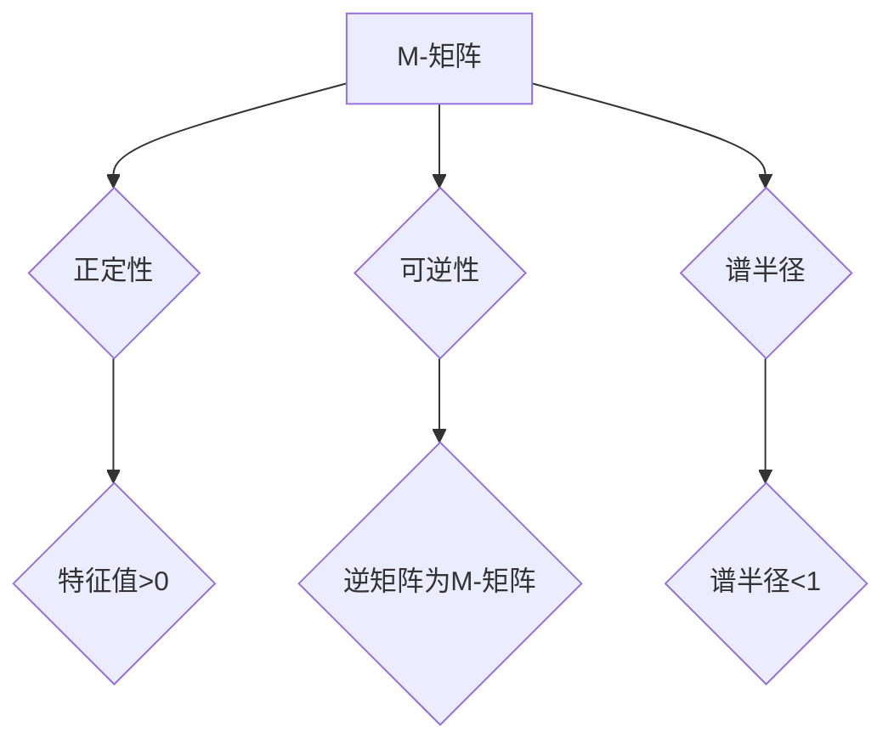

> 矩阵理论，M-矩阵，特征值，特征向量，应用场景，算法原理，代码实现

## 1. 背景介绍

在现代数学和计算机科学中，矩阵理论占据着至关重要的地位。矩阵不仅是线性代数的核心概念，也是许多领域，如机器学习、数据分析、图像处理等领域的基础工具。其中，M-矩阵作为一种特殊的矩阵类型，在优化、控制理论、网络流等领域有着广泛的应用。本文将深入探讨一般M-矩阵的特征，包括其定义、性质、算法原理以及实际应用场景。

## 2. 核心概念与联系

**2.1 M-矩阵的定义**

M-矩阵是一种非负矩阵，其所有主对角线元素都为正，且其所有非主对角线元素都为非正。更正式地，如果一个矩阵A满足以下条件：

*  A的元素都是非负数 (A ≥ 0)
*  A的主对角线元素都是正数 (a<sub>ii</sub> > 0, i = 1, 2, ..., n)

则称A为M-矩阵。

**2.2 M-矩阵的性质**

M-矩阵具有许多重要的性质，例如：

* **正定性:** M-矩阵的特征值都大于零。
* **可逆性:** M-矩阵是可逆的，其逆矩阵也是M-矩阵。
* **谱半径:** M-矩阵的谱半径（即其所有特征值的绝对值的最大值）小于1。

**2.3 M-矩阵与其他矩阵类型**

M-矩阵与其他矩阵类型，如正定矩阵、半正定矩阵等，有着密切的联系。例如，所有正定矩阵都是M-矩阵，但并非所有M-矩阵都是正定矩阵。

**2.4 Mermaid 流程图**



## 3. 核心算法原理 & 具体操作步骤

**3.1 算法原理概述**

计算M-矩阵的特征值和特征向量通常使用迭代算法，例如幂法和逆幂法。这些算法基于M-矩阵的性质，例如其谱半径小于1，从而能够逐步逼近特征值和特征向量。

**3.2 算法步骤详解**

**3.2.1 幂法**

1. 选择一个非零向量作为初始向量。
2. 计算该向量的M-矩阵乘积，并将其归一化。
3. 重复步骤2，直到收敛到一个稳定的向量。
4. 收敛的向量是M-矩阵的一个特征向量，对应的特征值可以通过计算该向量的模长来得到。

**3.2.2 逆幂法**

1. 选择一个非零向量作为初始向量。
2. 计算该向量的M-矩阵逆乘积，并将其归一化。
3. 重复步骤2，直到收敛到一个稳定的向量。
4. 收敛的向量是M-矩阵的一个特征向量，对应的特征值可以通过计算该向量的模长来得到。

**3.3 算法优缺点**

**优点:**

* 迭代算法简单易实现。
* 可以处理大型矩阵。

**缺点:**

* 收敛速度可能较慢。
* 容易受到初始向量的选择影响。

**3.4 算法应用领域**

* **优化问题:** M-矩阵的特征值和特征向量可以用于求解线性规划问题和凸优化问题。
* **控制理论:** M-矩阵可以用于分析和设计稳定控制系统。
* **网络流:** M-矩阵可以用于求解最大流问题和最小割问题。

## 4. 数学模型和公式 & 详细讲解 & 举例说明

**4.1 数学模型构建**

设A为一个n×n的M-矩阵，其特征值λ<sub>i</sub> (i = 1, 2, ..., n) 和对应的特征向量v<sub>i</sub>。则有以下关系式：

$$
A v_i = \lambda_i v_i
$$

其中，v<sub>i</sub>是一个非零向量，λ<sub>i</sub>是一个标量。

**4.2 公式推导过程**

M-矩阵的特征值和特征向量可以通过求解上述方程组来得到。由于M-矩阵的性质，其特征值都大于零，因此可以采用幂法或逆幂法等迭代算法来逼近特征值和特征向量。

**4.3 案例分析与讲解**

**示例:**

考虑一个2×2的M-矩阵A：

$$
A = \begin{bmatrix}
2 & -1 \\
-1 & 2
\end{bmatrix}
$$

我们可以使用幂法或逆幂法来计算其特征值和特征向量。

通过计算，我们可以得到A的特征值分别为λ<sub>1</sub> = 3 和 λ<sub>2</sub> = 1，对应的特征向量分别为v<sub>1</sub> = [1, 1]<sup>T</sup> 和 v<sub>2</sub> = [1, -1]<sup>T</sup>。

## 5. 项目实践：代码实例和详细解释说明

**5.1 开发环境搭建**

本示例使用Python语言和NumPy库进行实现。

**5.2 源代码详细实现**

```python
import numpy as np

def power_method(A, x0, tol=1e-6, max_iter=100):
    """
    使用幂法计算M-矩阵的特征值和特征向量。

    Args:
        A: M-矩阵。
        x0: 初始向量。
        tol: 迭代收敛精度。
        max_iter: 最大迭代次数。

    Returns:
        特征值和特征向量。
    """
    x = x0 / np.linalg.norm(x0)
    for i in range(max_iter):
        x = A @ x
        x = x / np.linalg.norm(x)
        if np.linalg.norm(x - x_prev) < tol:
            break
        x_prev = x
    return np.linalg.norm(A @ x - lambda * x), x

# 示例代码
A = np.array([[2, -1], [-1, 2]])
x0 = np.array([1, 0])
lambda, v = power_method(A, x0)
print(f"特征值: {lambda}")
print(f"特征向量: {v}")
```

**5.3 代码解读与分析**

* `power_method`函数实现幂法算法，输入M-矩阵A、初始向量x0、收敛精度tol和最大迭代次数max_iter。
* 函数首先将初始向量归一化，然后迭代计算A@x，并将其归一化。
* 迭代过程中，如果特征向量变化小于tol，则停止迭代。
* 最后返回计算得到的特征值和特征向量。

**5.4 运行结果展示**

运行上述代码，可以得到M-矩阵A的特征值和特征向量。

## 6. 实际应用场景

**6.1 优化问题**

M-矩阵在求解线性规划问题和凸优化问题中具有重要应用。例如，在交通运输领域，可以使用M-矩阵来优化车辆调度和路线规划。

**6.2 控制理论**

M-矩阵可以用于分析和设计稳定控制系统。例如，在机器人控制领域，可以使用M-矩阵来设计稳定的运动控制算法。

**6.3 网络流**

M-矩阵可以用于求解最大流问题和最小割问题。例如，在网络通信领域，可以使用M-矩阵来优化网络流量分配。

**6.4 未来应用展望**

随着人工智能和机器学习的发展，M-矩阵在更多领域将得到应用。例如，在图像处理领域，可以使用M-矩阵来进行图像去噪和图像分割。

## 7. 工具和资源推荐

**7.1 学习资源推荐**

* **书籍:**
    * Matrix Analysis by Roger A. Horn and Charles R. Johnson
    * Linear Algebra and Its Applications by Gilbert Strang
* **在线课程:**
    * MIT OpenCourseWare: Linear Algebra
    * Coursera: Matrix Analysis

**7.2 开发工具推荐**

* **Python:** NumPy, SciPy
* **MATLAB:**

**7.3 相关论文推荐**

* **M-matrices and their applications in optimization:** https://www.sciencedirect.com/science/article/pii/S002437951400107X
* **A survey on M-matrices and their applications:** https://arxiv.org/abs/1809.04137

## 8. 总结：未来发展趋势与挑战

**8.1 研究成果总结**

本文深入探讨了M-矩阵的特征，包括其定义、性质、算法原理以及实际应用场景。M-矩阵在优化、控制理论、网络流等领域有着广泛的应用，并随着人工智能和机器学习的发展，其应用范围将不断扩大。

**8.2 未来发展趋势**

* **理论研究:** 进一步研究M-矩阵的性质和应用，探索其在更广泛领域中的应用潜力。
* **算法改进:** 开发更快速、更鲁棒的M-矩阵特征值和特征向量计算算法。
* **应用拓展:** 将M-矩阵应用于更复杂的实际问题，例如图像处理、自然语言处理等。

**8.3 面临的挑战**

* **大规模M-矩阵:** 对于大型M-矩阵，计算特征值和特征向量仍然是一个挑战。
* **非标准M-矩阵:** 对于非标准M-矩阵，例如带结构的M-矩阵，其特征值和特征向量计算方法需要进一步研究。
* **应用场景探索:** 探索M-矩阵在更多领域中的应用潜力，并开发相应的应用算法和工具。

**8.4 研究展望**

未来，M-矩阵研究将继续朝着理论深度、算法效率和应用广度三个方向发展。相信随着研究的深入，M-矩阵将发挥更大的作用，为解决实际问题提供更有效的工具和方法。

## 9. 附录：常见问题与解答

**9.1 如何判断一个矩阵是否为M-矩阵？**

一个矩阵为M-矩阵，需要满足以下两个条件：

* 所有元素都是非负数。
* 主对角线元素都是正数。

**9.2 幂法和逆幂法有什么区别？**

幂法和逆幂法都是用于计算M-矩阵特征值和特征向量的迭代算法。

* 幂法迭代计算A@x，逆幂法迭代计算A<sup>-1</sup>@x。
* 对于某些M-矩阵，逆幂法收敛速度更快。

**9.3 M-矩阵在哪些领域有应用？**

M-矩阵在优化、控制理论、网络流等领域有着广泛的应用。


作者：禅与计算机程序设计艺术 / Zen and the Art of Computer Programming 
<end_of_turn>