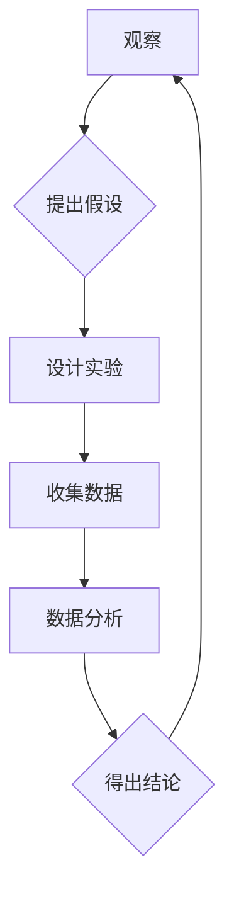

> 科学方法、观察、假设、实验、数据分析、结论、迭代、人工智能、机器学习、深度学习

## 1. 背景介绍

在瞬息万变的科技时代，人工智能（AI）正以惊人的速度发展，深刻地改变着我们的生活和工作方式。从自动驾驶汽车到智能语音助手，从医疗诊断到金融预测，AI技术的应用领域日益广泛。然而，AI的发展并非一蹴而就，它源于对世界规律的探索和理解，而这种探索和理解的核心在于科学方法。

科学方法是一种系统性的知识获取和检验方法，它强调基于观察、假设、实验和数据分析来推导结论，并通过不断迭代和验证来完善我们的理解。在AI领域，科学方法同样至关重要，它为我们提供了构建可靠、可解释和可信赖的AI模型的框架。

## 2. 核心概念与联系

科学方法的核心概念包括：

* **观察：** 这是科学探究的起点，通过对现象的观察，我们能够识别出问题和潜在的规律。
* **假设：** 观察后，我们提出一个关于现象本质的假设，作为我们进一步探索的指导。
* **实验：** 为了检验假设的正确性，我们设计和进行实验，收集相关数据。
* **数据分析：** 对实验数据进行分析，寻找规律和模式，并评估假设的合理性。
* **结论：** 根据数据分析的结果，我们得出结论，并将其与已有的知识体系进行整合。

**Mermaid 流程图：**



## 3. 核心算法原理 & 具体操作步骤

### 3.1  算法原理概述

在AI领域，许多算法都是基于科学方法的原理设计的。例如，机器学习算法通过大量的训练数据来学习模式和规律，从而能够对新的数据进行预测或分类。深度学习算法则通过多层神经网络来模拟人类大脑的学习过程，能够处理更复杂的数据和任务。

### 3.2  算法步骤详解

以机器学习中的线性回归算法为例，其步骤如下：

1. **数据准备：** 收集和预处理训练数据，将数据转换为算法可以理解的格式。
2. **模型构建：** 定义线性回归模型，即假设目标变量与输入变量之间存在线性关系。
3. **参数训练：** 使用训练数据，通过最小化模型预测误差，调整模型参数，使模型能够更好地拟合数据。
4. **模型评估：** 使用测试数据评估模型的性能，例如计算预测误差或准确率。
5. **模型优化：** 根据评估结果，调整模型参数或结构，进一步提高模型性能。

### 3.3  算法优缺点

线性回归算法具有以下优点：

* **易于理解和实现：** 模型结构简单，易于理解和实现。
* **计算效率高：** 训练和预测速度较快。

但也存在以下缺点：

* **假设线性关系：** 模型假设目标变量与输入变量之间存在线性关系，如果实际关系是非线性的，则模型性能会下降。
* **容易受到异常值影响：** 模型对异常值敏感，可能会导致模型性能下降。

### 3.4  算法应用领域

线性回归算法广泛应用于以下领域：

* **预测分析：** 预测销售额、房价、股票价格等。
* **风险评估：** 评估贷款风险、信用风险等。
* **市场营销：** 分析客户行为，预测客户购买意愿等。

## 4. 数学模型和公式 & 详细讲解 & 举例说明

### 4.1  数学模型构建

线性回归模型的数学表达式为：

$$y = w_0 + w_1x_1 + w_2x_2 + ... + w_nx_n + \epsilon$$

其中：

* $y$ 是目标变量
* $x_1, x_2, ..., x_n$ 是输入变量
* $w_0, w_1, w_2, ..., w_n$ 是模型参数
* $\epsilon$ 是误差项

### 4.2  公式推导过程

模型参数的训练过程是通过最小化模型预测误差来实现的。常用的误差函数是均方误差（MSE）：

$$MSE = \frac{1}{n}\sum_{i=1}^{n}(y_i - \hat{y}_i)^2$$

其中：

* $n$ 是样本数量
* $y_i$ 是第 $i$ 个样本的目标变量值
* $\hat{y}_i$ 是模型预测的第 $i$ 个样本的目标变量值

通过梯度下降算法，可以迭代地更新模型参数，使MSE最小化。

### 4.3  案例分析与讲解

假设我们想要预测房屋价格，输入变量包括房屋面积、房间数量、地理位置等。我们可以使用线性回归模型来建立房屋价格预测模型。

通过训练数据，模型会学习到房屋面积、房间数量等因素对房屋价格的影响程度，并得出相应的模型参数。然后，我们可以使用这个模型来预测新房子的价格。

## 5. 项目实践：代码实例和详细解释说明

### 5.1  开发环境搭建

本项目使用Python语言进行开发，需要安装以下软件：

* Python 3.x
* NumPy
* Pandas
* Scikit-learn

### 5.2  源代码详细实现

```python
import numpy as np
from sklearn.linear_model import LinearRegression
from sklearn.model_selection import train_test_split

# 准备数据
data = np.array([[100, 2, '市中心'],
                 [150, 3, '市郊'],
                 [200, 4, '郊区'],
                 [250, 5, '郊区']])

X = data[:, :2]  # 输入变量
y = data[:, 2]  # 目标变量

# 将数据分为训练集和测试集
X_train, X_test, y_train, y_test = train_test_split(X, y, test_size=0.2)

# 创建线性回归模型
model = LinearRegression()

# 训练模型
model.fit(X_train, y_train)

# 预测测试集数据
y_pred = model.predict(X_test)

# 评估模型性能
print('模型系数:', model.coef_)
print('截距:', model.intercept_)
print('预测结果:', y_pred)
```

### 5.3  代码解读与分析

这段代码首先准备了房屋价格预测的数据，然后将数据分为训练集和测试集。接着，创建了一个线性回归模型，并使用训练集训练模型。最后，使用测试集数据进行预测，并评估模型性能。

### 5.4  运行结果展示

运行代码后，会输出模型系数、截距和预测结果。

## 6. 实际应用场景

### 6.1  金融领域

* **信用风险评估：** 使用机器学习算法分析客户的财务数据，预测客户是否会违约。
* **欺诈检测：** 使用机器学习算法分析交易数据，识别异常交易行为。

### 6.2  医疗领域

* **疾病诊断：** 使用机器学习算法分析患者的医疗记录和影像数据，辅助医生诊断疾病。
* **药物研发：** 使用机器学习算法分析药物分子结构和生物活性数据，加速药物研发过程。

### 6.3  电商领域

* **商品推荐：** 使用机器学习算法分析用户的购买历史和浏览记录，推荐用户可能感兴趣的商品。
* **价格预测：** 使用机器学习算法分析商品的市场价格趋势，预测商品未来的价格变化。

### 6.4  未来应用展望

随着人工智能技术的不断发展，其应用场景将更加广泛，例如：

* **自动驾驶汽车：** 使用深度学习算法训练车辆感知环境、做出决策和控制车辆的系统。
* **个性化教育：** 使用机器学习算法分析学生的学习情况，提供个性化的学习方案。
* **智能客服：** 使用自然语言处理技术，开发能够理解和回复用户问题的智能客服系统。

## 7. 工具和资源推荐

### 7.1  学习资源推荐

* **在线课程：** Coursera、edX、Udacity 等平台提供丰富的AI课程。
* **书籍：** 《深度学习》、《机器学习实战》等书籍是学习AI的基础教材。
* **博客和论坛：** 许多AI领域的专家和学者在博客和论坛上分享他们的研究成果和经验。

### 7.2  开发工具推荐

* **Python：** 作为AI开发的主要语言，Python拥有丰富的库和框架，例如NumPy、Pandas、Scikit-learn、TensorFlow等。
* **Jupyter Notebook：** 用于编写和运行Python代码的交互式笔记本环境。
* **IDE：** PyCharm、VS Code 等IDE可以提高开发效率。

### 7.3  相关论文推荐

* **《ImageNet Classification with Deep Convolutional Neural Networks》**
* **《Attention Is All You Need》**
* **《BERT: Pre-training of Deep Bidirectional Transformers for Language Understanding》**

## 8. 总结：未来发展趋势与挑战

### 8.1  研究成果总结

近年来，人工智能领域取得了令人瞩目的进展，例如：

* **深度学习算法的突破：** 深度学习算法在图像识别、语音识别、自然语言处理等领域取得了显著的成果。
* **大规模数据量的积累：** 互联网和物联网的快速发展，为AI算法的训练提供了海量数据。
* **计算能力的提升：** GPU和TPU等高性能计算设备的出现，加速了AI算法的训练和推理速度。

### 8.2  未来发展趋势

未来，人工智能的发展趋势包括：

* **更强大的模型：** 研究人员将继续探索更强大的深度学习模型，例如Transformer、Generative Adversarial Networks（GAN）等。
* **更广泛的应用场景：** AI技术将应用于更多领域，例如医疗、教育、金融、交通等。
* **更可解释的模型：** 研究人员将致力于开发更可解释的AI模型，以便更好地理解模型的决策过程。

### 8.3  面临的挑战

AI技术的发展也面临着一些挑战：

* **数据安全和隐私保护：** AI算法的训练需要大量数据，如何保证数据的安全和隐私是重要的挑战。
* **算法偏见：** AI算法可能会受到训练数据的偏见影响，导致算法输出结果存在偏差。
* **伦理问题：** AI技术的应用可能会引发一些伦理问题，例如人工智能的责任和义务、人工智能的就业影响等。

### 8.4  研究展望

未来，我们需要继续加强对AI技术的研究和探索，并积极应对AI技术带来的挑战，以确保AI技术能够造福人类社会。

## 9. 附录：常见问题与解答

### 9.1  什么是机器学习？

机器学习是一种人工智能技术，它通过分析数据，学习模式和规律，从而能够对新的数据进行预测或分类。

### 9.2  什么是深度学习？

深度学习是一种机器学习的子领域，它使用多层神经网络来模拟人类大脑的学习过程，能够处理更复杂的数据和任务。

### 9.3  如何选择合适的AI算法？

选择合适的AI算法取决于具体的应用场景和数据特点。需要考虑算法的适用范围、性能、复杂度等因素。

### 9.4  如何评估AI模型的性能？

常用的AI模型性能评估指标包括准确率、召回率、F1-score、AUC等。

### 9.5  如何解决AI算法的偏见问题？

可以采用以下方法来解决AI算法的偏见问题：

* 使用更公平的训练数据。
* 使用偏见检测和缓解技术。
* 提高算法的可解释性，以便更好地理解算法的决策过程。


作者：禅与计算机程序设计艺术 / Zen and the Art of Computer Programming 
<end_of_turn>