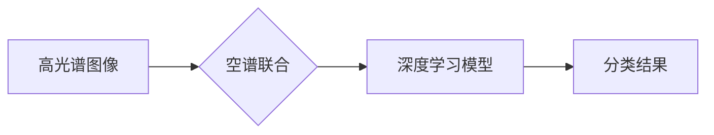

> 高光谱图像、空谱联合、分类、深度学习、遥感

## 1. 背景介绍

高光谱遥感技术凭借其丰富的波段信息，能够提供丰富的物质信息，在土地利用、环境监测、矿产勘探等领域具有广泛应用前景。然而，高光谱图像数据具有高维、冗余、噪声等特点，直接进行分类往往难以获得理想的分类效果。空谱联合技术通过融合高光谱图像和光谱信息，有效地降低了数据维度，提高了分类精度。

近年来，深度学习技术在图像分类领域取得了显著进展，其强大的特征提取能力和非线性拟合能力为高光谱图像分类提供了新的思路。空谱联合与深度学习的结合，进一步提升了高光谱图像分类的性能。

## 2. 核心概念与联系

### 2.1 高光谱图像

高光谱图像是一种具有数百个连续波段的光谱数据，每个波段对应特定光谱范围。与传统的多光谱图像相比，高光谱图像拥有更丰富的波段信息，能够提供更详细的物质信息。

### 2.2 空谱联合

空谱联合是指将高光谱图像和光谱信息融合在一起，形成新的特征空间，用于分类。空谱联合可以有效地降低数据维度，提高分类精度。

### 2.3 深度学习

深度学习是一种机器学习方法，利用多层神经网络进行特征提取和分类。深度学习模型能够自动学习数据中的复杂特征，具有强大的分类能力。

**Mermaid 流程图**



## 3. 核心算法原理 & 具体操作步骤

### 3.1 算法原理概述

空谱联合的高光谱图像分类算法通常包括以下步骤：

1. **数据预处理:** 对高光谱图像进行辐射校正、大气校正等预处理，去除噪声和干扰。
2. **空谱特征提取:** 将高光谱图像和光谱信息融合，提取空谱特征。
3. **深度学习模型训练:** 利用提取的空谱特征训练深度学习模型，例如卷积神经网络 (CNN) 或循环神经网络 (RNN)。
4. **分类预测:** 将训练好的深度学习模型应用于新的高光谱图像数据，进行分类预测。

### 3.2 算法步骤详解

1. **数据预处理:**

   - **辐射校正:** 将高光谱图像的数字值转换为真实辐射值，消除传感器响应和大气散射的影响。
   - **大气校正:** 移除大气散射和吸收对高光谱图像的影响，恢复地表反射光谱。
   - **噪声去除:** 使用滤波算法或其他降噪方法去除高光谱图像中的噪声。

2. **空谱特征提取:**

   - **光谱特征提取:** 从高光谱图像中提取每个像元的谱特征，例如平均值、标准差、峰值等。
   - **空间特征提取:** 使用卷积神经网络或其他空间特征提取方法，从高光谱图像中提取空间特征，例如边缘、纹理等。
   - **空谱特征融合:** 将光谱特征和空间特征融合在一起，形成新的空谱特征。

3. **深度学习模型训练:**

   - **模型选择:** 选择合适的深度学习模型，例如CNN或RNN，用于分类任务。
   - **模型参数设置:** 设置模型的超参数，例如学习率、批处理大小等。
   - **模型训练:** 使用训练数据训练深度学习模型，优化模型参数。

4. **分类预测:**

   - **模型评估:** 使用测试数据评估模型的分类性能，例如准确率、召回率等。
   - **分类预测:** 将训练好的模型应用于新的高光谱图像数据，进行分类预测。

### 3.3 算法优缺点

**优点:**

- 能够有效地降低数据维度，提高分类精度。
- 深度学习模型能够自动学习数据中的复杂特征，具有强大的分类能力。

**缺点:**

- 需要大量的训练数据。
- 模型训练时间较长。
- 对硬件资源要求较高。

### 3.4 算法应用领域

空谱联合的高光谱图像分类算法在以下领域具有广泛应用前景：

- **土地利用/覆盖分类:** 识别不同类型的土地利用/覆盖，例如森林、农田、水体等。
- **环境监测:** 监测大气污染、水质污染、植被变化等环境问题。
- **矿产勘探:** 识别矿物类型、矿体分布等信息。
- **农业监测:** 监测作物生长状况、病虫害发生等信息。

## 4. 数学模型和公式 & 详细讲解 & 举例说明

### 4.1 数学模型构建

空谱联合的高光谱图像分类模型可以表示为一个多分类问题，目标是将每个像元分类到预定义的类别中。

假设有 $N$ 个像元， $M$ 个类别， $L$ 个光谱波段。

- $x_i$ 表示第 $i$ 个像元的空谱特征向量，维度为 $(L+D)$，其中 $D$ 为空间特征维度。
- $y_i$ 表示第 $i$ 个像元的类别标签，取值范围为 $\{1, 2, ..., M\}$。

### 4.2 公式推导过程

常用的深度学习模型，例如CNN，可以用来学习空谱特征和分类决策边界。

损失函数通常采用交叉熵损失函数，用于衡量模型预测结果与真实标签之间的差异。

$$
L = -\sum_{i=1}^{N} \sum_{j=1}^{M} y_{i,j} \log(p_{i,j})
$$

其中，$y_{i,j}$ 为真实标签，$p_{i,j}$ 为模型预测第 $i$ 个像元属于第 $j$ 个类别的概率。

模型参数通过反向传播算法进行优化，目标是最小化损失函数。

### 4.3 案例分析与讲解

假设我们使用CNN模型进行空谱联合的高光谱图像分类，模型结构如下：

- 输入层：接收空谱特征向量，维度为 $(L+D)$。
- 卷积层：使用多个卷积核提取空间特征。
- 池化层：降低特征维度，提高模型鲁棒性。
- 全连接层：将提取的特征进行分类。

训练过程中，使用高光谱图像数据集进行训练，并使用交叉熵损失函数和反向传播算法进行模型优化。

## 5. 项目实践：代码实例和详细解释说明

### 5.1 开发环境搭建

- 操作系统：Ubuntu 20.04
- Python 版本：3.8
- 深度学习框架：TensorFlow 2.0

### 5.2 源代码详细实现

```python
import tensorflow as tf

# 定义CNN模型
model = tf.keras.models.Sequential([
    tf.keras.layers.Input(shape=(L+D,)),
    tf.keras.layers.Conv1D(filters=32, kernel_size=3, activation='relu'),
    tf.keras.layers.MaxPooling1D(pool_size=2),
    tf.keras.layers.Conv1D(filters=64, kernel_size=3, activation='relu'),
    tf.keras.layers.MaxPooling1D(pool_size=2),
    tf.keras.layers.Flatten(),
    tf.keras.layers.Dense(units=M, activation='softmax')
])

# 编译模型
model.compile(optimizer='adam',
              loss='sparse_categorical_crossentropy',
              metrics=['accuracy'])

# 训练模型
model.fit(x_train, y_train, epochs=10, batch_size=32)

# 评估模型
loss, accuracy = model.evaluate(x_test, y_test)
print('Loss:', loss)
print('Accuracy:', accuracy)
```

### 5.3 代码解读与分析

- 代码首先定义了CNN模型结构，包括卷积层、池化层和全连接层。
- 然后，使用Adam优化器和交叉熵损失函数编译模型。
- 接着，使用训练数据训练模型，并设置训练轮数和批处理大小。
- 最后，使用测试数据评估模型的性能，并打印损失和准确率。

### 5.4 运行结果展示

训练完成后，可以将模型应用于新的高光谱图像数据，进行分类预测。

## 6. 实际应用场景

空谱联合的高光谱图像分类算法在以下实际应用场景中具有广泛应用前景：

### 6.1 土地利用/覆盖分类

利用空谱联合的高光谱图像分类算法可以识别不同类型的土地利用/覆盖，例如森林、农田、水体等。

### 6.2 环境监测

空谱联合的高光谱图像分类算法可以用于监测大气污染、水质污染、植被变化等环境问题。

### 6.3 矿产勘探

空谱联合的高光谱图像分类算法可以识别矿物类型、矿体分布等信息，辅助矿产勘探工作。

### 6.4 未来应用展望

随着高光谱遥感技术的不断发展，空谱联合的高光谱图像分类算法将有更广泛的应用前景，例如：

- **精准农业:** 监测作物生长状况、病虫害发生等信息，实现精准农业管理。
- **城市规划:** 识别城市绿地、道路、建筑等信息，辅助城市规划和管理。
- **灾害监测:** 监测地震、洪水、火灾等灾害信息，及时发布预警信息。

## 7. 工具和资源推荐

### 7.1 学习资源推荐

- **书籍:**
    - "Deep Learning with Python" by Francois Chollet
    - "Hands-On Machine Learning with Scikit-Learn, Keras & TensorFlow" by Aurélien Géron
- **在线课程:**
    - Coursera: "Deep Learning Specialization" by Andrew Ng
    - Udacity: "Deep Learning Nanodegree"

### 7.2 开发工具推荐

- **Python:** 
    - TensorFlow
    - PyTorch
    - scikit-learn
- **数据处理工具:**
    - ENVI
    - SNAP

### 7.3 相关论文推荐

- "Spectral-Spatial Classification of Hyperspectral Imagery Using Deep Learning" by Zhong et al. (2017)
- "Hyperspectral Image Classification Using Deep Convolutional Neural Networks" by Liu et al. (2016)

## 8. 总结：未来发展趋势与挑战

### 8.1 研究成果总结

空谱联合的高光谱图像分类算法取得了显著进展，能够有效地提高分类精度。

### 8.2 未来发展趋势

- **模型创新:** 探索新的深度学习模型结构，例如Transformer、Graph Neural Network等，提高模型性能。
- **数据增强:** 利用数据增强技术，增加训练数据量，提高模型泛化能力。
- **跨模态融合:** 将高光谱图像与其他模态数据，例如LiDAR数据、SAR数据等进行融合，提高分类精度。

### 8.3 面临的挑战

- **数据标注:** 高光谱图像数据标注成本高，难以获取大量高质量标注数据。
- **模型解释性:** 深度学习模型的决策边界难以解释，难以理解模型的分类结果。
- **计算资源:** 训练大型深度学习模型需要大量的计算资源。

### 8.4 研究展望

未来，空谱联合的高光谱图像分类算法将继续朝着更智能、更高效、更可解释的方向发展。


## 9. 附录：常见问题与解答

### 9.1 什么是空谱联合？

空谱联合是指将高光谱图像和光谱信息融合在一起，形成新的特征空间，用于分类。

### 9.2 深度学习模型有哪些？

常用的深度学习模型包括卷积神经网络 (CNN)、循环神经网络 (RNN)、Transformer等。

### 9.3 如何选择合适的深度学习模型？

选择合适的深度学习模型需要根据具体任务和数据特点进行选择。

### 9.