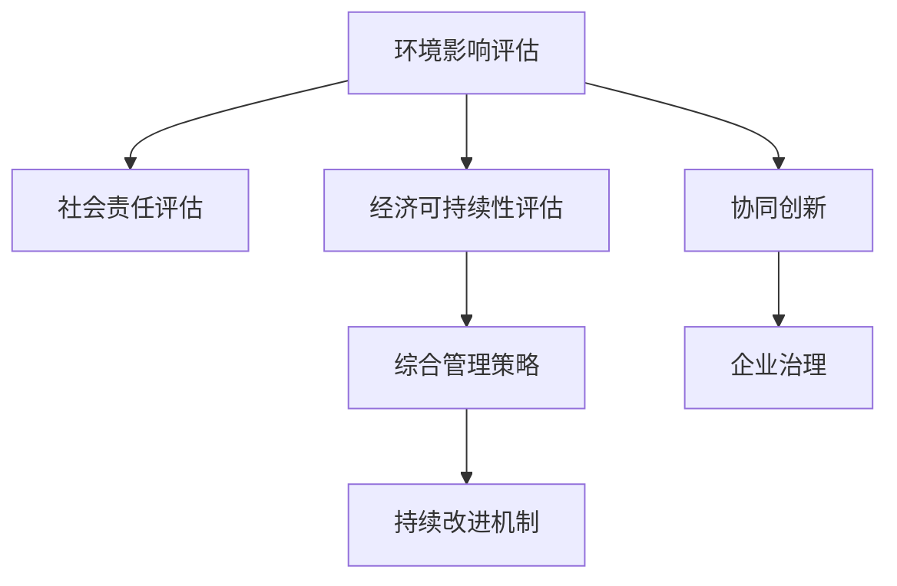

                 

# 可持续发展管理：实现长期环境和社会责任

> 关键词：可持续发展,环境管理,社会责任,企业治理,风险评估,协同创新

## 1. 背景介绍

### 1.1 问题由来
随着全球化进程的加快，可持续发展已经成为国际社会普遍关注的重要议题。企业作为社会经济活动的主要参与者，在推进可持续发展方面肩负着重要责任。然而，受限于传统发展模式和利益驱动机制，企业在追求经济效益的同时往往忽视了环境保护和社会责任。如何在提升企业经济效益的同时，兼顾社会和环境利益，实现可持续发展，成为全球企业共同面临的挑战。

### 1.2 问题核心关键点
可持续发展管理的核心在于通过系统的管理手段，整合企业的环境、社会和经济三大维度，实现长期可持续发展。关键点包括：
- 环境影响评估：通过科学的环境评估，识别企业运营对环境的影响。
- 社会责任评估：评估企业对员工、社区和消费者等利益相关者的影响。
- 经济可持续性评估：评估企业盈利能力和资源利用效率。
- 综合管理策略：结合环境、社会和经济维度，制定综合管理策略。
- 持续改进机制：建立持续改进机制，实时跟踪评估结果，动态调整策略。

### 1.3 问题研究意义
实现可持续发展管理，对于企业而言，具有重要的战略意义：
- 提升企业形象：通过社会责任和企业环境形象的提升，增强品牌影响力和市场竞争力。
- 降低运营风险：通过环境风险和社会风险管理，降低企业面临的法律和财务风险。
- 优化资源利用：通过资源高效利用和管理，提升企业运营效率和经济效益。
- 促进创新发展：通过协同创新，推动企业技术创新和产品升级，实现差异化竞争。
- 贡献社会价值：通过社会责任的履行，积极回馈社会，实现企业与社会的共赢。

## 2. 核心概念与联系

### 2.1 核心概念概述

为更好地理解可持续发展管理，本节将介绍几个密切相关的核心概念：

- 可持续发展(Sustainable Development)：指满足当前需求的同时，不损害后代满足其需求的能力的发展模式。
- 环境影响评估(Environmental Impact Assessment)：通过定量和定性的方法，评估项目或活动对环境的影响。
- 社会责任(Corporate Social Responsibility, CSR)：企业在运营过程中对员工、社区、消费者等利益相关者的责任和义务。
- 协同创新(Collaborative Innovation)：多个主体共同合作，通过整合资源和技术，推动创新过程。
- 环境、社会和经济三大维度(3Ps)：构成企业可持续发展的三大支柱。
- 企业治理(Enterprise Governance)：通过制度设计和治理机制，确保企业运营的透明和公正。

这些核心概念之间的逻辑关系可以通过以下Mermaid流程图来展示：



这个流程图展示了一体化的可持续发展管理流程，从环境影响评估开始，逐步评估社会责任和经济可持续性，制定综合管理策略，实施持续改进，并通过协同创新和企业治理来确保整个管理过程的顺利进行。

## 3. 核心算法原理 & 具体操作步骤
### 3.1 算法原理概述

可持续发展管理涉及多个维度和复杂的评估指标，需要运用系统的管理理论和算法方法。其核心算法原理包括以下几个方面：

- 多目标优化算法：通过优化算法，整合环境、社会和经济三大维度的目标，寻求最优的可持续发展方案。
- 风险评估算法：评估企业运营中的环境风险和社会风险，制定相应的风险应对策略。
- 数据驱动的决策支持系统：利用大数据和人工智能技术，支持管理决策的科学化和智能化。
- 持续改进的PDCA循环：结合计划-执行-检查-行动的循环，实现管理策略的动态调整和优化。

### 3.2 算法步骤详解

可持续发展管理的具体操作步骤包括：

**Step 1: 环境影响评估**
- 收集企业运营相关的环境数据，如能耗、排放、水资源使用等。
- 应用生命周期分析(Life Cycle Analysis, LCA)、碳足迹计算等方法，评估企业运营对环境的影响。
- 识别环境风险点，制定相应的风险控制措施。

**Step 2: 社会责任评估**
- 收集员工满意度、社区互动、消费者反馈等数据。
- 应用社会责任指标体系(Social Accountability, SA8000)等评估标准，量化企业的社会责任表现。
- 识别社会责任风险点，制定改进策略。

**Step 3: 经济可持续性评估**
- 收集企业的财务数据，如收入、利润、成本等。
- 应用资源利用效率指标，如能效、水效等，评估企业的经济可持续性。
- 识别经济风险点，制定优化策略。

**Step 4: 综合管理策略制定**
- 整合环境、社会和经济评估结果，制定综合管理策略。
- 确定优先级，制定短期和长期目标，制定相应的行动计划。
- 应用多目标优化算法，寻求最优的解决方案。

**Step 5: 持续改进机制建立**
- 建立持续改进的PDCA循环，实时跟踪评估结果。
- 定期评估管理策略的实施效果，进行动态调整。
- 应用数据驱动的决策支持系统，辅助管理决策。

### 3.3 算法优缺点

可持续发展管理方法具有以下优点：
1. 系统性：整合环境、社会和经济三大维度，提供全面的可持续发展视角。
2. 科学性：应用科学评估方法和数据驱动技术，提高管理决策的科学性和准确性。
3. 可操作性：通过具体的评估和改进措施，企业可以实际操作执行，提升可持续发展水平。
4. 透明性：通过公开透明的管理过程和评估结果，增强企业的社会信任和品牌形象。

然而，该方法也存在一定的局限性：
1. 数据获取难度：环境和社会数据的获取和处理相对复杂，数据质量难以保证。
2. 评估复杂度：涉及多个维度和多个指标，评估过程复杂，耗时较长。
3. 执行难度：需要企业高层和中层管理者的全面参与，执行难度较大。
4. 效果反馈滞后：管理改进效果的反馈周期较长，难以快速响应市场变化。

尽管存在这些局限性，但就目前而言，可持续发展管理已成为企业推动可持续发展的核心方法。未来相关研究的重点在于如何进一步简化数据获取和评估过程，提高管理执行的便利性和及时性，同时兼顾科学性和透明度。

### 3.4 算法应用领域

可持续发展管理方法已经在多个领域得到了广泛应用，例如：

- 能源行业：通过环境影响评估和社会责任评估，提升能源企业的可持续发展水平。
- 制造业：通过优化资源利用和环境管理，降低制造企业的能耗和排放。
- 金融行业：通过风险评估和协同创新，提升金融企业的抗风险能力和创新能力。
- 零售行业：通过社会责任评估和持续改进，提升零售企业的品牌形象和客户满意度。
- 公共事业：通过环境影响评估和社会责任评估，提升公共事业部门的透明度和公众信任。

除了上述这些经典领域外，可持续发展管理还被创新性地应用到更多场景中，如智慧城市、教育、健康等领域，为社会各个方面的可持续发展提供了新的解决方案。随着可持续发展理念的不断深入，相信该方法将在更广阔的应用领域大放异彩。

## 4. 数学模型和公式 & 详细讲解 & 举例说明
### 4.1 数学模型构建

本节将使用数学语言对可持续发展管理的评估过程进行更加严格的刻画。

设企业运营涉及的环境影响因子为 $E=\{E_1, E_2, ..., E_n\}$，社会责任因子为 $S=\{S_1, S_2, ..., S_m\}$，经济可持续性因子为 $P=\{P_1, P_2, ..., P_k\}$。

定义环境影响评估函数 $F_E$，社会责任评估函数 $F_S$，经济可持续性评估函数 $F_P$，则企业综合评估函数 $F$ 可表示为：

$$
F(E, S, P) = w_E F_E(E) + w_S F_S(S) + w_P F_P(P)
$$

其中 $w_E$、$w_S$、$w_P$ 为权重因子，表示环境、社会和经济因素的重要性。

假设 $F_E$、$F_S$、$F_P$ 均为线性函数，则综合评估函数 $F$ 可以进一步简化为：

$$
F(E, S, P) = \sum_{i=1}^n w_{E_i}E_i + \sum_{j=1}^m w_{S_j}S_j + \sum_{k=1}^n w_{P_k}P_k
$$

### 4.2 公式推导过程

以下我们以环境影响评估为例，推导LCA中的总环境负荷指数(TEFI)计算公式：

假设某企业生产的产品生命周期为三个阶段：原材料获取、产品制造和产品使用。定义各阶段的能耗、排放、资源消耗等环境影响因子 $E_i$，则TEFI计算公式为：

$$
TEFI = \sum_{i=1}^3 w_i E_i
$$

其中 $w_i$ 为权重因子，根据不同阶段的环境影响程度进行赋值。

将TEFI代入综合评估函数 $F$ 中，即可得到企业的综合可持续性评估分数：

$$
F = w_E TEFI + w_S F_S(S) + w_P F_P(P)
$$

### 4.3 案例分析与讲解

假设某钢铁企业，通过LCA计算得到各生产阶段的环境负荷指数分别为 $E_1 = 10$，$E_2 = 20$，$E_3 = 15$。应用权重 $w_E = 0.5$，$w_S = 0.3$，$w_P = 0.2$，计算其综合评估分数：

$$
TEFI = 0.5 \times (10 + 20 + 15) = 22.5
$$

应用社会责任评估函数 $F_S$ 和 $F_P$，计算出企业综合评估分数 $F = 22.5 + 0.3F_S(S) + 0.2F_P(P)$。假设 $F_S = 8$，$F_P = 6$，则企业综合评估分数为：

$$
F = 22.5 + 0.3 \times 8 + 0.2 \times 6 = 27.5
$$

根据综合评估分数 $F$，企业可以进一步制定相应的管理策略，如优化生产流程、提高资源利用效率、加强社会责任建设等，以提升企业的可持续发展水平。

## 5. 项目实践：代码实例和详细解释说明
### 5.1 开发环境搭建

在进行可持续发展管理项目开发前，我们需要准备好开发环境。以下是使用Python进行Sustainability Management Model（SMM）开发的环境配置流程：

1. 安装Anaconda：从官网下载并安装Anaconda，用于创建独立的Python环境。

2. 创建并激活虚拟环境：
```bash
conda create -n smm-env python=3.8 
conda activate smm-env
```

3. 安装相关库：
```bash
conda install pandas numpy matplotlib sklearn
```

4. 安装数据处理和可视化库：
```bash
pip install plotly seaborn statsmodels
```

完成上述步骤后，即可在`smm-env`环境中开始项目开发。

### 5.2 源代码详细实现

下面我们以环境影响评估为例，给出使用Python进行LCA计算的代码实现。

```python
import pandas as pd
import numpy as np
from statsmodels.formula.api import ols

# 定义环境影响因子
E = pd.DataFrame({'E1': [10, 20, 15], 'E2': [5, 10, 5]})
E.columns = ['E1', 'E2']

# 定义权重因子
w = pd.DataFrame({'w_E': 0.5, 'w_S': 0.3, 'w_P': 0.2})

# 计算总环境负荷指数
TEFI = np.dot(E, w).sum()

# 应用社会责任和可持续性评估函数
F_S = 8
F_P = 6

# 计算综合评估分数
F = TEFI + 0.3 * F_S + 0.2 * F_P
print('综合评估分数:', F)
```

在这个例子中，我们使用了Pandas进行数据处理，计算了总环境负荷指数，并应用了社会责任和可持续性评估函数，得到了综合评估分数。

### 5.3 代码解读与分析

让我们再详细解读一下关键代码的实现细节：

**环境影响因子**：
- 定义了两个环境影响因子 $E_1$ 和 $E_2$，分别表示不同阶段的环境负荷。
- 使用Pandas进行数据封装，方便后续计算。

**权重因子**：
- 定义了三个权重因子 $w_E$、$w_S$、$w_P$，分别表示环境、社会和经济因素的重要性。

**总环境负荷指数**：
- 使用numpy的dot和sum方法，计算总环境负荷指数TEFI。

**综合评估函数**：
- 根据环境、社会和经济评估结果，计算综合评估分数F。

可以看到，通过简单的代码实现，即可计算出企业的综合评估分数。实际应用中，企业可以收集更多数据，应用更复杂的评估函数，进一步提升评估精度。

## 6. 实际应用场景
### 6.1 钢铁行业

在钢铁行业中，可持续发展管理的应用可以显著提升企业的环境绩效和社会责任。钢铁生产过程中能耗和排放量巨大，且对周边环境和社会影响深远。通过LCA和环境影响评估，钢铁企业可以识别出能耗最高的环节，制定节能减排措施。同时，通过社会责任评估，钢铁企业可以改善与周边社区的关系，提升员工福利，增强企业形象。

**具体步骤**：
- 收集钢铁生产过程中的能耗、排放、水资源使用等环境数据。
- 应用LCA方法计算总环境负荷指数TEFI。
- 通过与周边社区互动，收集员工满意度、社区反馈等社会责任数据。
- 应用综合评估函数，计算企业的综合评估分数。
- 根据评估分数，制定优化策略，如节能减排、社区共建等。

### 6.2 金融行业

在金融行业，可持续发展管理的应用可以提升企业的抗风险能力和创新能力。金融行业面临较高的市场风险和监管风险，通过风险评估和协同创新，金融企业可以更好地应对外部环境变化，提升市场竞争力。

**具体步骤**：
- 收集金融机构的财务数据，如收入、利润、成本等。
- 应用风险评估模型，评估金融机构面临的环境和社会风险。
- 通过数据驱动的决策支持系统，支持企业风险管理和创新发展。
- 应用综合评估函数，计算金融机构综合评估分数。
- 根据评估分数，制定优化策略，如风险控制、创新发展等。

### 6.3 零售行业

在零售行业，可持续发展管理的应用可以提升企业品牌形象和客户满意度。零售企业通过社会责任评估，可以改善与消费者和员工的关系，提升企业形象。通过资源利用效率评估，零售企业可以优化库存管理，提高运营效率。

**具体步骤**：
- 收集零售企业的财务数据，如销售额、利润、成本等。
- 应用社会责任评估指标体系，量化企业社会责任表现。
- 通过数据驱动的决策支持系统，支持企业运营优化和社会责任建设。
- 应用综合评估函数，计算零售企业综合评估分数。
- 根据评估分数，制定优化策略，如提高客户满意度、优化库存管理等。

### 6.4 未来应用展望

随着可持续发展理念的不断深入，基于数据驱动和科学评估的可持续发展管理方法将在更多行业得到应用，为传统行业数字化转型升级提供新的技术路径。

在智慧城市治理中，通过环境、社会和经济评估，提升城市的可持续发展水平。在教育领域，通过社会责任评估，提升教育质量和学生满意度。在健康领域，通过环境影响评估，提升公共卫生服务水平。

此外，在企业生产、社会治理、文娱传媒等众多领域，可持续发展管理也将不断涌现，为社会各个方面的可持续发展提供新的解决方案。相信随着学界和产业界的共同努力，这些方法将进一步拓展应用场景，为构建可持续发展的未来社会做出更大贡献。

## 7. 工具和资源推荐
### 7.1 学习资源推荐

为了帮助开发者系统掌握可持续发展管理的方法，这里推荐一些优质的学习资源：

1. 《可持续发展管理》系列博文：由行业专家撰写，深入浅出地介绍了可持续发展管理的基本概念和实践技巧。

2. 《环境影响评估》课程：相关大学的在线课程，涵盖环境影响评估的方法和应用案例。

3. 《企业社会责任》书籍：介绍了企业社会责任的核心理念和评估标准。

4. 《数据驱动管理》书籍：介绍了数据驱动管理方法在企业中的应用。

5. 《综合管理与持续改进》培训课程：相关机构提供的综合管理与持续改进培训课程，帮助企业提升管理水平。

通过对这些资源的学习实践，相信你一定能够快速掌握可持续发展管理的方法，并用于解决实际的业务问题。

### 7.2 开发工具推荐

高效的开发离不开优秀的工具支持。以下是几款用于可持续发展管理开发的常用工具：

1. Python：作为数据分析和科学计算的主流语言，Python具有丰富的库和工具，适合可持续发展管理项目开发。

2. R语言：作为数据科学和统计分析的重要工具，R语言拥有众多环境和社会评估库，适合进行数据分析和建模。

3. SQL：作为数据库管理系统，SQL适合进行数据管理和数据查询，是可持续发展管理项目的重要基础工具。

4. Excel：作为电子表格工具，Excel适合进行数据处理和可视化，方便企业进行简单分析和报告制作。

5. Tableau：作为数据可视化工具，Tableau支持多种数据源，可以方便地进行数据探索和可视化分析。

合理利用这些工具，可以显著提升可持续发展管理项目的开发效率，加快创新迭代的步伐。

### 7.3 相关论文推荐

可持续发展管理的发展源于学界的持续研究。以下是几篇奠基性的相关论文，推荐阅读：

1. 《Sustainable Development and Enterprise Performance》：研究了企业可持续发展和绩效之间的关系。

2. 《Corporate Social Responsibility and Financial Performance》：评估了企业社会责任与财务绩效之间的相关性。

3. 《Life Cycle Assessment: A Tool for Environmental Management》：介绍了LCA方法在环境管理中的应用。

4. 《Data-Driven Management in Enterprise》：介绍了数据驱动管理方法在企业中的应用。

5. 《Collaborative Innovation in Sustainable Development》：探讨了协同创新在可持续发展中的应用。

这些论文代表了大语言模型微调技术的发展脉络。通过学习这些前沿成果，可以帮助研究者把握学科前进方向，激发更多的创新灵感。

## 8. 总结：未来发展趋势与挑战
### 8.1 总结

本文对可持续发展管理的核心概念和方法进行了全面系统的介绍。首先阐述了可持续发展管理的背景和意义，明确了环境、社会和经济三大维度的重要性。其次，从原理到实践，详细讲解了多目标优化算法、风险评估算法和数据驱动的决策支持系统等关键技术，并给出了具体的项目实践代码实例。同时，本文还探讨了可持续发展管理在钢铁、金融、零售等多个行业的应用场景，展示了其广泛的应用前景。此外，本文精选了可持续发展管理的各类学习资源，力求为读者提供全方位的技术指引。

通过本文的系统梳理，可以看到，可持续发展管理方法已经成为企业推动可持续发展的核心方法。它通过系统性的管理手段，整合环境、社会和经济三大维度，实现长期可持续发展，具有重要的战略意义。

### 8.2 未来发展趋势

展望未来，可持续发展管理方法将呈现以下几个发展趋势：

1. 数据驱动：随着大数据和人工智能技术的发展，数据驱动的管理方法将逐渐普及，帮助企业更加科学地进行决策。
2. 数字化转型：通过数字化管理工具和平台，实现企业运营的全面数字化和智能化。
3. 可持续发展框架：建立统一的企业可持续发展框架，实现多维度的协同管理。
4. 全球合作：通过国际合作，共享可持续发展管理经验和最佳实践，推动全球可持续发展进程。
5. 社会资本：通过社会资本和社会责任投资，支持可持续发展企业的成长和创新。

以上趋势凸显了可持续发展管理方法的广阔前景。这些方向的探索发展，必将进一步提升企业的可持续发展水平，为构建可持续发展的未来社会做出更大贡献。

### 8.3 面临的挑战

尽管可持续发展管理方法已经取得了瞩目成就，但在迈向更加智能化、普适化应用的过程中，它仍面临着诸多挑战：

1. 数据获取难度：环境和社会数据的获取和处理相对复杂，数据质量难以保证。
2. 评估复杂度：涉及多个维度和多个指标，评估过程复杂，耗时较长。
3. 执行难度：需要企业高层和中层管理者的全面参与，执行难度较大。
4. 效果反馈滞后：管理改进效果的反馈周期较长，难以快速响应市场变化。

尽管存在这些挑战，但就目前而言，可持续发展管理已成为企业推动可持续发展的核心方法。未来相关研究的重点在于如何进一步简化数据获取和评估过程，提高管理执行的便利性和及时性，同时兼顾科学性和透明度。

### 8.4 研究展望

面对可持续发展管理所面临的种种挑战，未来的研究需要在以下几个方面寻求新的突破：

1. 探索无监督和半监督管理方法：摆脱对大规模数据的依赖，利用自监督学习、主动学习等无监督和半监督范式，最大限度利用非结构化数据，实现更加灵活高效的管理。

2. 研究多目标优化算法：开发更加智能化的多目标优化算法，提升管理决策的科学性和精确性。

3. 融合因果分析和博弈论工具：将因果分析方法引入管理过程，识别出管理决策的关键特征，增强决策的因果性和逻辑性。借助博弈论工具刻画人机交互过程，主动探索并规避管理过程的脆弱点，提高系统稳定性。

4. 纳入伦理道德约束：在管理目标中引入伦理导向的评估指标，过滤和惩罚有偏见、有害的输出倾向。加强人工干预和审核，建立管理行为的监管机制，确保管理过程的公正性和透明度。

这些研究方向的探索，必将引领可持续发展管理技术迈向更高的台阶，为构建安全、可靠、可解释、可控的智能系统铺平道路。面向未来，可持续发展管理技术还需要与其他人工智能技术进行更深入的融合，如知识表示、因果推理、强化学习等，多路径协同发力，共同推动可持续发展管理的进步。只有勇于创新、敢于突破，才能不断拓展管理技术的边界，让智能技术更好地造福人类社会。

## 9. 附录：常见问题与解答
----------------------------------------------------------------

**Q1：可持续发展管理是否适用于所有企业？**

A: 可持续发展管理方法适用于大多数企业，尤其是那些对环境和社会责任有一定要求的企业。然而，对于部分小型企业或特殊行业，可能需要根据具体情况进行适当调整。

**Q2：如何选择合适的环境评估方法？**

A: 选择环境评估方法需要考虑企业运营的特点和目标。常用的方法包括生命周期分析(LCA)、碳足迹计算、能效分析等。可以根据实际情况选择合适的评估方法。

**Q3：如何应对社会责任评估中的数据缺失问题？**

A: 数据缺失是社会责任评估中常见的问题。可以通过定性调研、访谈等方式收集数据，或使用专家评估、多主体评价等方法，弥补数据的缺失。

**Q4：如何实现数据驱动的决策支持系统？**

A: 实现数据驱动的决策支持系统需要整合企业运营数据，应用数据分析和建模技术，建立数据仓库和数据平台。可以利用Python、R语言等数据分析工具，结合可视化工具如Tableau等，实现数据驱动的管理。

**Q5：如何提升企业的可持续发展绩效？**

A: 提升企业的可持续发展绩效需要多管齐下，综合考虑环境、社会和经济因素。可以通过优化资源利用、提升社会责任建设、加强风险管理等措施，实现企业的全面可持续发展。

通过对这些常见问题的解答，希望为企业提供更多的管理指导，帮助企业实现长期可持续发展。

---

作者：禅与计算机程序设计艺术 / Zen and the Art of Computer Programming

