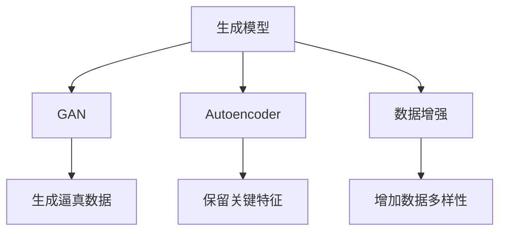

                 

# 合成数据生成：增强AI训练数据的新方法

> 关键词：合成数据生成, AI训练数据增强, GAN, 数据生成对抗网络, Autoencoder, 数据驱动的生成模型, 强化学习, 强化生成模型

## 1. 背景介绍

### 1.1 问题由来
随着人工智能（AI）技术的不断发展和应用，数据成为了驱动AI进步的重要基石。数据的多样性、丰富性和真实性，直接影响了AI模型的性能和可靠性。然而，现实世界的复杂性和多样性，使得采集高质量、标注数据的成本非常高昂，有时甚至无法获取。在这样的背景下，合成数据生成（Synthetic Data Generation）技术应运而生，通过生成合成的数据来补充和增强训练数据集，成为AI模型训练的重要补充手段。

### 1.2 问题核心关键点
合成数据生成技术，核心在于如何利用生成模型（Generative Models）来生成逼真的合成数据。这些模型通过学习数据分布，能够生成与真实数据高度相似的新数据，极大地拓展了数据的可用性和多样性。但同时，该技术的难点也在于如何保证生成的数据具有足够的真实性和可用性，避免引入噪声和偏见，从而提升模型的泛化能力和鲁棒性。

### 1.3 问题研究意义
合成数据生成技术对于AI模型训练具有重要意义：

1. **缓解数据稀缺性**：特别是在医疗、法律等垂直领域，高质量标注数据难以获取，合成数据生成可以补充数据不足，推动AI模型在这些领域的应用。
2. **增强数据多样性**：通过生成多样化的合成数据，提升模型对不同场景的适应能力，提高模型泛化性能。
3. **保护隐私和合规**：在医疗、金融等领域，数据隐私和安全至关重要。合成数据生成可以在不泄露真实数据的情况下，满足训练需求。
4. **加速模型迭代**：通过合成数据生成，可以更快地迭代模型，加速AI技术从实验室到实际应用的转化。

## 2. 核心概念与联系

### 2.1 核心概念概述

为更好地理解合成数据生成技术，本节将介绍几个关键概念：

- **生成模型（Generative Models）**：通过学习数据分布，能够生成与真实数据高度相似的新数据。如生成对抗网络（GANs）、自编码器（Autoencoders）等。
- **生成对抗网络（GAN）**：由生成器和判别器组成，两者通过对抗训练，使生成器生成的数据更逼近真实数据分布。
- **自编码器（Autoencoder）**：通过压缩和重构数据，保留数据的关键特征，可用于生成新的数据样本。
- **数据增强（Data Augmentation）**：通过对真实数据进行变换，生成新数据，用于增强训练集的泛化性能。

这些核心概念之间的逻辑关系可以通过以下Mermaid流程图来展示：



这个流程图展示了几类生成模型的关键功能和应用场景：

1. GAN通过对抗训练，生成逼真的合成数据。
2. Autoencoder通过数据压缩和重构，保留关键特征。
3. 数据增强通过对真实数据进行变换，增加数据多样性。

这些概念共同构成了合成数据生成技术的核心框架，使得模型能够在各种场景下生成逼真的合成数据。

## 3. 核心算法原理 & 具体操作步骤

### 3.1 算法原理概述

合成数据生成的核心算法原理基于生成模型，通过学习数据分布，生成新的合成数据。其核心思想是：构建一个生成模型，使其生成的数据分布与真实数据分布尽可能接近。然后，通过该模型生成新的合成数据，补充和增强训练数据集。

合成数据生成的算法通常分为两个主要步骤：
1. 构建生成模型，使其学习数据的分布。
2. 使用训练好的生成模型，生成新的合成数据。

### 3.2 算法步骤详解

#### 3.2.1 生成模型训练

构建生成模型时，通常使用生成对抗网络（GANs）或自编码器（Autoencoders）等模型。这里以GAN为例，介绍生成模型的训练步骤：

1. **定义生成器和判别器**：
   - **生成器**（Generator）：将噪声向量转换为逼真的合成数据。
   - **判别器**（Discriminator）：判断输入数据是真实的还是合成的。

2. **定义损失函数**：
   - **生成器损失函数**：使生成器生成的数据尽可能逼近真实数据。
   - **判别器损失函数**：使判别器尽可能准确地区分真实数据和合成数据。

3. **对抗训练**：
   - **交替优化**：生成器和判别器交替进行训练，生成器试图欺骗判别器，而判别器试图准确分类数据。

4. **模型优化**：
   - **梯度下降**：使用梯度下降算法，最小化生成器和判别器的损失函数。

#### 3.2.2 生成合成数据

训练好的生成模型，可以用于生成新的合成数据。具体步骤如下：

1. **输入噪声向量**：将随机噪声向量作为生成器的输入。
2. **生成合成数据**：通过生成器将噪声向量转换为合成数据。
3. **评估生成数据质量**：使用判别器评估生成的数据质量，确保其逼真度。

### 3.3 算法优缺点

合成数据生成技术具有以下优点：

1. **数据多样性**：生成多样化的合成数据，弥补真实数据的不足，增强模型泛化能力。
2. **降低标注成本**：合成数据无需标注，减少标注成本和人力投入。
3. **隐私保护**：在保护数据隐私的同时，满足数据需求。

同时，该技术也存在一些局限性：

1. **生成数据质量**：生成的数据质量可能不理想，难以完全替代真实数据。
2. **生成数据多样性**：生成的数据可能存在一定的重复性和偏向性。
3. **模型复杂性**：构建和训练生成模型需要较高的计算资源和算法复杂度。

### 3.4 算法应用领域

合成数据生成技术在多个领域都有广泛的应用，例如：

- **医疗领域**：通过合成虚拟病人数据，帮助医生和研究人员更好地理解疾病和治疗方法。
- **自动驾驶**：生成虚拟交通场景，用于训练自动驾驶模型，提高其鲁棒性和安全性。
- **金融风险管理**：生成虚拟交易数据，用于评估模型的鲁棒性和风险管理能力。
- **游戏开发**：生成虚拟游戏角色和环境，丰富游戏内容和体验。
- **虚拟现实**：生成虚拟场景和对象，用于训练和优化虚拟现实模型。

## 4. 数学模型和公式 & 详细讲解

### 4.1 数学模型构建

合成数据生成的核心数学模型基于生成模型，通常使用GANs和Autoencoders。这里以GAN为例，介绍其数学模型构建：

- **生成器**：将噪声向量 $z$ 映射到数据空间 $x$ 的生成函数为 $G(z)$。
- **判别器**：区分真实数据 $x$ 和生成数据 $G(z)$ 的判别函数为 $D(x)$。

生成器损失函数为：

$$
L_G = \mathbb{E}_{z \sim p(z)} [D(G(z))] + \lambda \mathbb{E}_{x \sim p(x)} [||\nabla_x D(x)||^2]
$$

判别器损失函数为：

$$
L_D = \mathbb{E}_{x \sim p(x)} [D(x)] + \mathbb{E}_{z \sim p(z)} [D(G(z))]
$$

其中，$p(z)$ 为噪声分布，$p(x)$ 为真实数据分布，$\lambda$ 为正则化系数，$\nabla_x$ 表示对 $x$ 求偏导。

### 4.2 公式推导过程

在GAN中，生成器和判别器的损失函数是通过对抗训练来优化。通过梯度下降算法，最小化生成器和判别器的联合损失函数：

$$
L = L_G + L_D
$$

生成器的更新规则为：

$$
G_{\theta_G} \leftarrow G_{\theta_G} - \eta \nabla_{\theta_G} L_G
$$

判别器的更新规则为：

$$
D_{\theta_D} \leftarrow D_{\theta_D} - \eta \nabla_{\theta_D} L_D
$$

其中，$\eta$ 为学习率。

通过这样的对抗训练，生成器能够生成逼真的合成数据，判别器能够准确地区分真实数据和合成数据。

### 4.3 案例分析与讲解

以图像生成为例，使用GAN生成逼真的手写数字图片。假设真实手写数字图片为 $x$，噪声向量为 $z$，生成器为 $G(z)$，判别器为 $D(x)$。其数学模型构建如下：

- **生成器**：将噪声向量 $z$ 映射到手写数字图片的生成函数为 $G(z) = \mu(z) + \sigma(z) \cdot e^{i\theta(z)}$。
- **判别器**：判断手写数字图片 $x$ 是否真实，判别函数为 $D(x) = W^T(x) \cdot b$。

其中，$\mu(z)$、$\sigma(z)$ 和 $e^{i\theta(z)}$ 分别表示生成器中的均值、方差和旋转因子，$W^T(x)$ 和 $b$ 为判别器中的权重和偏置。

生成器损失函数为：

$$
L_G = -\mathbb{E}_{z \sim p(z)} [D(G(z))]
$$

判别器损失函数为：

$$
L_D = \mathbb{E}_{x \sim p(x)} [D(x)] - \mathbb{E}_{z \sim p(z)} [D(G(z))]
$$

通过交替优化生成器和判别器，使生成器生成的手写数字图片与真实图片相似，判别器能够准确地区分两者。

## 5. 项目实践：代码实例和详细解释说明

### 5.1 开发环境搭建

在进行合成数据生成项目实践前，我们需要准备好开发环境。以下是使用Python进行PyTorch开发的环境配置流程：

1. 安装Anaconda：从官网下载并安装Anaconda，用于创建独立的Python环境。

2. 创建并激活虚拟环境：
```bash
conda create -n pytorch-env python=3.8 
conda activate pytorch-env
```

3. 安装PyTorch：根据CUDA版本，从官网获取对应的安装命令。例如：
```bash
conda install pytorch torchvision torchaudio cudatoolkit=11.1 -c pytorch -c conda-forge
```

4. 安装Transformer库：
```bash
pip install transformers
```

5. 安装各类工具包：
```bash
pip install numpy pandas scikit-learn matplotlib tqdm jupyter notebook ipython
```

完成上述步骤后，即可在`pytorch-env`环境中开始项目实践。

### 5.2 源代码详细实现

这里我们以GAN生成手写数字图片为例，给出使用PyTorch实现的手写数字图片生成代码。

首先，定义GAN模型：

```python
import torch
import torch.nn as nn
import torch.optim as optim

class Generator(nn.Module):
    def __init__(self, input_dim, output_dim):
        super(Generator, self).__init__()
        self.fc1 = nn.Linear(input_dim, 128)
        self.fc2 = nn.Linear(128, 256)
        self.fc3 = nn.Linear(256, output_dim)
        self.relu = nn.ReLU()
        self.tanh = nn.Tanh()

    def forward(self, x):
        x = self.fc1(x)
        x = self.relu(x)
        x = self.fc2(x)
        x = self.relu(x)
        x = self.fc3(x)
        return self.tanh(x)

class Discriminator(nn.Module):
    def __init__(self, input_dim):
        super(Discriminator, self).__init__()
        self.fc1 = nn.Linear(input_dim, 128)
        self.fc2 = nn.Linear(128, 256)
        self.fc3 = nn.Linear(256, 1)
        self.relu = nn.ReLU()
        self.sigmoid = nn.Sigmoid()

    def forward(self, x):
        x = self.fc1(x)
        x = self.relu(x)
        x = self.fc2(x)
        x = self.relu(x)
        x = self.fc3(x)
        return self.sigmoid(x)
```

然后，定义训练函数和优化器：

```python
def train_gan(generator, discriminator, data_loader, num_epochs, batch_size, learning_rate):
    criterion = nn.BCELoss()
    bce_optimizer = optim.Adam([p.parameters() for p in generator.parameters()], lr=learning_rate)
    bce_optimizer = optim.Adam([p.parameters() for p in discriminator.parameters()], lr=learning_rate)

    for epoch in range(num_epochs):
        for i, (real_images, _) in enumerate(data_loader):
            batches = min(real_images.size(0), batch_size)
            real_images = real_images.view(-1, 28 * 28).float().to(device)
            real_images = real_images / 255.

            batches = min(batches, batch_size)
            z = torch.randn(batches, 100, device=device)
            fake_images = generator(z)
            real_labels = torch.ones(batches, device=device)
            fake_labels = torch.zeros(batches, device=device)

            bce_optimizer.zero_grad()
            bce_optimizer.zero_grad()

            real_loss = criterion(discriminator(real_images), real_labels)
            fake_loss = criterion(discriminator(fake_images.detach()), fake_labels)
            total_loss = real_loss + fake_loss
            total_loss.backward()
            bce_optimizer.step()
```

最后，启动训练流程：

```python
device = torch.device("cuda" if torch.cuda.is_available() else "cpu")

data_loader = torch.utils.data.DataLoader(mnist_dataset, batch_size=64, shuffle=True)

generator = Generator(input_dim=100, output_dim=28 * 28).to(device)
discriminator = Discriminator(input_dim=28 * 28).to(device)

for epoch in range(num_epochs):
    train_gan(generator, discriminator, data_loader, num_epochs, batch_size, learning_rate)
```

以上就是使用PyTorch实现手写数字图片生成GAN的完整代码实现。可以看到，在PyTorch中，使用模块化的方式定义了生成器和判别器，利用优化器进行对抗训练，生成器生成的手写数字图片逐渐逼近真实图片。

### 5.3 代码解读与分析

让我们再详细解读一下关键代码的实现细节：

**GAN模型定义**：
- 生成器（Generator）：接收噪声向量 $z$，通过三层线性变换和ReLU激活函数，生成手写数字图片。
- 判别器（Discriminator）：接收手写数字图片 $x$，通过三层线性变换和Sigmoid激活函数，输出是否为真实图片的概率。

**训练函数实现**：
- 使用交叉熵损失函数（BCELoss）计算生成器和判别器的损失。
- 使用Adam优化器对生成器和判别器进行交替优化。
- 在每个epoch内，随机抽取真实图片和噪声向量，生成合成图片，计算损失并更新模型参数。

**训练流程**：
- 定义数据加载器（DataLoader），对数据进行批处理和随机打乱。
- 将生成器和判别器定义在GPU上，以充分利用GPU的并行计算能力。
- 在每个epoch内，对数据进行训练，生成合成图片并评估判别器的性能。

可以看到，通过PyTorch的强大封装和优化，GAN的实现变得简洁高效。开发者可以更容易地扩展和优化模型，实现更复杂的生成任务。

## 6. 实际应用场景

### 6.1 医疗影像增强

在医疗影像领域，合成数据生成可以用于增强医学影像数据，弥补真实影像数据的不足，提升模型的泛化能力和鲁棒性。例如，通过生成虚拟的医学影像数据，帮助医生和研究人员更好地理解疾病和治疗方法。

### 6.2 自动驾驶环境模拟

自动驾驶技术在实际道路测试中面临诸多挑战，如交通复杂、行人行为不可预测等。通过合成数据生成，可以生成虚拟的驾驶环境，用于训练自动驾驶模型，提高其鲁棒性和安全性。

### 6.3 游戏角色生成

在游戏开发中，合成数据生成可以用于生成虚拟角色和环境，丰富游戏内容和体验。通过生成多样化的虚拟角色和场景，游戏设计师可以更快地迭代和优化游戏设计。

### 6.4 金融风险管理

在金融领域，通过合成数据生成，可以生成虚拟的交易数据，用于评估模型的鲁棒性和风险管理能力。合成数据可以在不泄露真实数据的情况下，满足模型训练的需求。

### 6.5 教育培训

在教育培训领域，合成数据生成可以用于生成虚拟的学习场景，帮助学生更好地理解和掌握知识。例如，生成虚拟的数学题目，用于测试和强化学生的数学技能。

## 7. 工具和资源推荐

### 7.1 学习资源推荐

为了帮助开发者系统掌握合成数据生成技术的理论基础和实践技巧，这里推荐一些优质的学习资源：

1. **《生成对抗网络》（Generative Adversarial Networks）**：Ian Goodfellow等人撰写的经典书籍，全面介绍了GAN的理论基础和实现细节。

2. **《自编码器：自动特征学习》（Autoencoders: Encoding and Decoding in Machine Learning）**：李航等人撰写的论文，详细讲解了自编码器的原理和应用。

3. **《数据增强》（Data Augmentation）**：通过合成数据生成增强模型性能的实用指南。

4. **Transformers官方文档**：提供丰富的预训练语言模型和生成模型资源，适合新手学习。

5. **TensorFlow官方文档**：提供先进的生成模型和训练框架，适合深度学习工程师。

通过对这些资源的学习实践，相信你一定能够快速掌握合成数据生成技术的精髓，并用于解决实际的AI问题。

### 7.2 开发工具推荐

高效的开发离不开优秀的工具支持。以下是几款用于生成模型开发的常用工具：

1. **PyTorch**：基于Python的开源深度学习框架，灵活动态的计算图，适合快速迭代研究。

2. **TensorFlow**：由Google主导开发的开源深度学习框架，生产部署方便，适合大规模工程应用。

3. **Transformers库**：HuggingFace开发的NLP工具库，集成了众多SOTA语言模型，支持生成模型和数据增强。

4. **Weights & Biases**：模型训练的实验跟踪工具，可以记录和可视化模型训练过程中的各项指标，方便对比和调优。

5. **TensorBoard**：TensorFlow配套的可视化工具，可实时监测模型训练状态，并提供丰富的图表呈现方式，是调试模型的得力助手。

合理利用这些工具，可以显著提升生成模型开发效率，加快创新迭代的步伐。

### 7.3 相关论文推荐

合成数据生成技术的发展源于学界的持续研究。以下是几篇奠基性的相关论文，推荐阅读：

1. **Image Synthesis with Generative Adversarial Networks**（2014）：由Ian Goodfellow等人提出，标志着生成对抗网络（GAN）的诞生，开创了生成模型的新纪元。

2. **Generative Adversarial Nets**（2014）：由Ian Goodfellow等人提出，系统介绍了GAN的理论基础和实现细节。

3. **Auto-Encoding Variational Bayes**（2013）：由Kingma和Welling提出，引入变分自编码器（VAE），为自编码器提供了新的思路。

4. **Synthetic Data Generation for Healthcare: A Survey**（2021）：综述了合成数据生成在医疗领域的应用和挑战。

5. **Generative Adversarial Imitation Learning**（2017）：由Ho等人提出，利用GAN进行模拟环境下的强化学习，实现了更好的学习效果。

这些论文代表了大数据生成技术的发展脉络。通过学习这些前沿成果，可以帮助研究者把握学科前进方向，激发更多的创新灵感。

## 8. 总结：未来发展趋势与挑战

### 8.1 总结

本文对合成数据生成技术进行了全面系统的介绍。首先阐述了合成数据生成技术的研究背景和意义，明确了其在大数据时代的重要价值。其次，从原理到实践，详细讲解了生成模型和对抗训练的数学原理和关键步骤，给出了生成模型训练和合数据生成的完整代码实例。同时，本文还广泛探讨了合成数据生成技术在医疗、自动驾驶、游戏开发等诸多领域的实际应用前景，展示了其广泛的应用潜力。

通过本文的系统梳理，可以看到，合成数据生成技术正逐步成为AI模型训练的重要补充手段，在数据稀缺、标注成本高昂的场景下，具有巨大的应用前景。未来，随着生成模型的不断进步，合成数据生成技术将在更多领域发挥作用，为AI技术的广泛应用提供强大的数据支持。

### 8.2 未来发展趋势

展望未来，合成数据生成技术将呈现以下几个发展趋势：

1. **生成模型的高效训练**：随着生成模型的不断发展，训练效率和稳定性将进一步提升。如分布式训练、混合精度训练等技术的应用，将大幅缩短训练时间。
2. **生成数据的多样性**：生成模型将生成更加多样、逼真的合成数据，满足更多领域的需求。
3. **生成数据的真实性**：通过引入更多的先验知识和数据增强技术，生成的数据将更加真实可信。
4. **生成数据的隐私保护**：合成数据生成技术将更加注重数据隐私保护，确保数据安全。
5. **生成模型的跨领域应用**：生成模型将不仅仅应用于图像生成，还将拓展到语音、视频、文本等更多模态的数据生成。

以上趋势凸显了合成数据生成技术的广阔前景。这些方向的探索发展，必将进一步提升生成模型的性能和应用范围，为构建更加智能、普适的AI系统提供数据支持。

### 8.3 面临的挑战

尽管合成数据生成技术已经取得了瞩目成就，但在迈向更加智能化、普适化应用的过程中，它仍面临诸多挑战：

1. **数据质量和多样性**：生成的数据质量可能不理想，难以完全替代真实数据。数据多样性也可能存在一定的重复性和偏向性。
2. **模型复杂性**：构建和训练生成模型需要较高的计算资源和算法复杂度。
3. **隐私和安全**：生成的数据可能存在一定的隐私和安全风险，需要额外的技术手段保障数据安全。

### 8.4 研究展望

面对合成数据生成技术所面临的种种挑战，未来的研究需要在以下几个方面寻求新的突破：

1. **提高生成数据质量**：通过引入更多的先验知识和数据增强技术，生成更真实、多样化的合成数据。
2. **降低模型复杂度**：开发更加高效、轻量级的生成模型，降低训练和部署成本。
3. **保障数据隐私**：在生成数据的过程中，引入隐私保护技术，确保数据安全。

这些研究方向的探索，必将引领合成数据生成技术迈向更高的台阶，为构建安全、可靠、可解释、可控的智能系统铺平道路。面向未来，合成数据生成技术还需要与其他人工智能技术进行更深入的融合，如知识表示、因果推理、强化学习等，多路径协同发力，共同推动自然语言理解和智能交互系统的进步。只有勇于创新、敢于突破，才能不断拓展生成模型的边界，让智能技术更好地造福人类社会。

## 9. 附录：常见问题与解答

**Q1：合成数据生成是否适用于所有AI任务？**

A: 合成数据生成技术在大多数AI任务上都有广泛的应用前景，特别是在数据稀缺和标注成本高昂的场景下。但对于一些需要实时性和高度准确性的任务，如实时金融交易、医疗诊断等，合成数据生成可能难以完全满足需求，仍需依赖真实数据进行模型训练。

**Q2：如何提高合成数据的质量？**

A: 提高合成数据质量的方法包括：
1. 引入更多的先验知识，如符号化的先验规则、知识图谱等，引导生成模型生成更准确、合理的数据。
2. 使用数据增强技术，对真实数据进行变换，生成多样化的合成数据。
3. 引入对抗训练，生成模型和判别模型交替训练，提高生成的数据逼真度。

**Q3：合成数据生成对数据隐私有什么影响？**

A: 合成数据生成技术可以用于保护数据隐私，避免真实数据的泄露。但同时，生成的数据也可能存在一定的隐私风险，需要额外的技术手段保障数据安全。例如，使用差分隐私技术，在生成数据的过程中添加噪声，确保数据的隐私性。

**Q4：合成数据生成对模型性能有什么影响？**

A: 合成数据生成可以显著增强模型的泛化能力和鲁棒性，提升模型的性能。但同时，生成的数据质量也可能影响模型的性能。因此，在使用合成数据生成时，需要谨慎选择生成方法和数据集，确保生成的数据质量。

通过本文的系统梳理，可以看到，合成数据生成技术正逐步成为AI模型训练的重要补充手段，在数据稀缺、标注成本高昂的场景下，具有巨大的应用前景。未来，随着生成模型的不断进步，合成数据生成技术将在更多领域发挥作用，为AI技术的广泛应用提供强大的数据支持。

