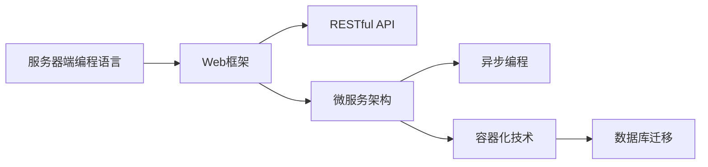

                 

# 后端开发：服务器端编程语言与框架

> 关键词：服务器端编程语言, Web框架, 数据库, RESTful API, 微服务, 异步编程, 容器化, 数据库迁移

## 1. 背景介绍

### 1.1 问题由来
随着互联网技术的快速发展，服务器端编程语言与框架在Web开发中扮演着至关重要的角色。选择合适的编程语言与框架，不仅可以提高开发效率，还可以提升系统的稳定性和可维护性。然而，目前市面上的编程语言与框架众多，开发者往往面临“选择困难症”，不知道该如何取舍。

为了帮助开发者更好地理解和应用服务器端编程语言与框架，本文将从语言选择、框架选择、技术栈构建等多个角度出发，系统介绍后端开发的方方面面。本文的核心内容将围绕以下三个方面展开：

1. 服务器端编程语言的选择与比较。
2. 服务器端Web框架的选择与比较。
3. 常见后端技术栈的构建与实践。

## 2. 核心概念与联系

### 2.1 核心概念概述

服务器端编程语言和Web框架是Web后端开发中不可或缺的核心组件。以下是一些关键概念：

- **服务器端编程语言**：用于编写Web后端逻辑的编程语言，例如Java、Python、Node.js等。
- **Web框架**：用于封装HTTP请求和响应处理的框架，提供路由、中间件、模板等功能，帮助开发者快速开发Web应用。
- **RESTful API**：基于REST架构风格的API设计规范，以HTTP协议为基础，适用于Web服务的交互。
- **微服务架构**：将大系统拆分成多个小型、独立的服务，每个服务独立运行、相互协作，提升系统的灵活性和可扩展性。
- **异步编程**：通过非阻塞的I/O操作和事件驱动机制，提高系统吞吐量和响应速度。
- **容器化技术**：通过Docker等容器技术，实现应用的打包、部署和运行标准化。
- **数据库迁移**：在不中断服务的前提下，将数据从一种数据库迁移到另一种数据库的过程。

这些概念之间存在着紧密的联系。例如，服务器端编程语言的选择会直接影响到Web框架的选择，微服务架构的采用也会改变数据库的设计和使用方式。因此，理解这些概念及其之间的联系，有助于开发者更好地选择和使用后端技术栈。

### 2.2 核心概念原理和架构的 Mermaid 流程图



这个流程图展示了服务器端编程语言、Web框架、RESTful API、微服务架构、异步编程、容器化技术、数据库迁移之间的关系。

## 3. 核心算法原理 & 具体操作步骤

### 3.1 算法原理概述

服务器端编程语言和Web框架的选择，是一个涉及到技术栈构建和系统架构设计的复杂问题。选择时需要综合考虑性能、可维护性、扩展性、社区活跃度等因素。以下将详细讲解选择和构建后端技术栈的步骤和方法。

### 3.2 算法步骤详解

选择和构建后端技术栈一般分为以下几个步骤：

**Step 1: 确定业务需求和技术栈需求**

- 梳理业务需求和技术栈需求，包括业务场景、系统规模、性能要求、安全性需求等。
- 确定技术栈的上下限，例如支持哪些编程语言、Web框架等。

**Step 2: 选择合适的编程语言**

- 根据业务需求和技术栈需求，选择适合的编程语言。例如，对于高并发、低延迟的系统，可以选择Java或Go；对于快速迭代、灵活性强的系统，可以选择Python。
- 考虑社区活跃度、库和框架丰富程度、人才储备等因素。

**Step 3: 选择合适的Web框架**

- 根据编程语言和业务需求，选择适合的Web框架。例如，对于Java系统，可以选择Spring Boot或Django；对于Python系统，可以选择Flask或Tornado。
- 考虑框架的稳定性和性能、社区活跃度、文档和社区支持等因素。

**Step 4: 构建完整的技术栈**

- 选择合适的数据库、缓存、消息队列等组件，构建完整的技术栈。
- 考虑组件之间的兼容性、性能和扩展性。

**Step 5: 设计和实现系统架构**

- 根据业务需求和技术栈需求，设计和实现系统架构，例如RESTful API设计、微服务拆分等。
- 考虑架构的可扩展性、性能和可维护性。

**Step 6: 集成开发和测试**

- 集成开发和测试工具，例如Jenkins、GitLab CI等。
- 实现持续集成和持续部署(CI/CD)流程。

**Step 7: 上线和监控**

- 部署到生产环境，并进行性能测试和压力测试。
- 监控系统性能和稳定性，及时发现和解决问题。

### 3.3 算法优缺点

选择和构建后端技术栈的优势和劣势如下：

- **优势**：
  - 提高开发效率和系统稳定性。
  - 降低开发和运维成本。
  - 提供丰富的组件和库，提高开发效率。
- **劣势**：
  - 框架和库的复杂性可能增加开发难度。
  - 组件和库的兼容性问题可能影响系统性能。
  - 技术栈更新可能增加迁移成本。

### 3.4 算法应用领域

服务器端编程语言和Web框架的应用领域非常广泛，包括Web应用、API服务、微服务、物联网(IoT)等。以下将列举几个典型的应用场景：

- **Web应用**：例如电商系统、社交网络、博客平台等。
- **API服务**：例如支付接口、短信服务、地图服务等。
- **微服务**：例如金融服务、供应链管理、电子商务等。
- **物联网**：例如智能家居、智慧城市、车联网等。

## 4. 数学模型和公式 & 详细讲解 & 举例说明

### 4.1 数学模型构建

本节将通过一个简单的示例，说明服务器端编程语言和Web框架的数学模型构建过程。

**示例：Web服务请求处理**

假设有一个简单的Web服务，接收GET请求并返回数据。服务器的响应时间为T，每个请求的处理时间为t，每秒发送100个请求。

模型构建步骤如下：

- **输入**：请求数、请求处理时间、响应时间。
- **输出**：服务器吞吐量、响应时间。
- **目标**：最小化响应时间和最大化吞吐量。

数学模型为：

$$
\begin{aligned}
& \text{最小化} \quad \max(T) \\
& \text{最大化} \quad \frac{100}{t} \\
& \text{约束} \quad T \leq \sum_{i=1}^N t_i \\
\end{aligned}
$$

其中，$N$ 为请求数，$t_i$ 为第 $i$ 个请求的处理时间。

### 4.2 公式推导过程

通过对数学模型的推导，可以得到最优解的计算公式：

$$
\begin{aligned}
& \text{最小化} \quad \max(T) \\
& \text{最大化} \quad \frac{100}{t} \\
& \text{约束} \quad T \leq \sum_{i=1}^N t_i \\
\end{aligned}
$$

推导过程如下：

1. 根据约束条件，将 $T$ 表示为请求数和请求处理时间的函数：

$$
T = \sum_{i=1}^N t_i
$$

2. 根据响应时间，将吞吐量表示为请求处理时间的函数：

$$
吞吐量 = \frac{100}{t}
$$

3. 最小化响应时间和最大化吞吐量的目标函数转换为极值问题：

$$
\begin{aligned}
& \text{最小化} \quad \max(T) \\
& \text{最大化} \quad \frac{100}{t} \\
& \text{约束} \quad T \leq \sum_{i=1}^N t_i \\
\end{aligned}
$$

### 4.3 案例分析与讲解

**案例：Node.js + Express框架**

- **选择编程语言**：Node.js。
- **选择Web框架**：Express。
- **构建技术栈**：MySQL数据库、Redis缓存、RabbitMQ消息队列。

**分析**：

- Node.js的异步I/O特性可以显著提高系统的吞吐量和响应速度。
- Express框架的路由和中间件功能可以帮助开发者快速构建Web应用。
- MySQL数据库和Redis缓存可以提高数据查询和存储的性能。
- RabbitMQ消息队列可以支持高并发和异步处理的场景。

## 5. 项目实践：代码实例和详细解释说明

### 5.1 开发环境搭建

以下是使用Python和Flask框架构建Web服务的开发环境搭建步骤：

1. 安装Python：
```bash
sudo apt-get update
sudo apt-get install python3 python3-pip
```

2. 安装Flask：
```bash
pip install flask
```

3. 创建项目目录：
```bash
mkdir mywebapp
cd mywebapp
```

4. 创建Flask应用：
```python
from flask import Flask

app = Flask(__name__)

@app.route('/')
def hello():
    return 'Hello, World!'
```

5. 运行Flask应用：
```bash
flask run
```

### 5.2 源代码详细实现

以下是Flask应用的具体代码实现：

```python
from flask import Flask, request, jsonify

app = Flask(__name__)

@app.route('/api/user', methods=['POST'])
def add_user():
    data = request.get_json()
    user = {
        'id': len(app.config['users']) + 1,
        'name': data['name'],
        'email': data['email']
    }
    app.config['users'].append(user)
    return jsonify(user)

@app.route('/api/user', methods=['GET'])
def get_user():
    id = request.args.get('id')
    user = next((u for u in app.config['users'] if u['id'] == int(id)), None)
    return jsonify(user)

if __name__ == '__main__':
    app.config['users'] = []
    app.run(debug=True)
```

### 5.3 代码解读与分析

**代码解读**：

- `from flask import Flask, request, jsonify`：导入Flask框架及相关模块。
- `app = Flask(__name__)`：创建Flask应用实例。
- `@app.route('/')`：定义路由。
- `@app.route('/api/user', methods=['POST'])`：定义POST请求路由。
- `@app.route('/api/user', methods=['GET'])`：定义GET请求路由。
- `request.get_json()`：获取请求中的JSON数据。
- `jsonify(user)`：将JSON格式的响应数据返回。

**分析**：

- Flask框架的路由和中间件功能可以方便地实现HTTP请求的处理和响应。
- `request.get_json()`和`jsonify()`函数提供了处理JSON数据的便捷方式。
- 通过定义不同的路由，可以实现不同的功能，例如用户信息添加和获取。

### 5.4 运行结果展示

运行上述代码，可以在浏览器中访问`http://localhost:5000/api/user`，提交POST请求添加用户信息，或者提交GET请求获取用户信息。

## 6. 实际应用场景

### 6.1 电商系统

电商系统是典型的Web应用场景，需要使用服务器端编程语言和Web框架构建后端逻辑。以下是电商系统的技术栈推荐：

- **编程语言**：Java或Node.js。
- **Web框架**：Spring Boot或Express。
- **数据库**：MySQL或MongoDB。
- **缓存**：Redis。
- **消息队列**：RabbitMQ或Kafka。

### 6.2 API服务

API服务通常需要高并发和低延迟的处理能力，可以考虑使用服务器端编程语言和Web框架构建后端逻辑。以下是API服务的技术栈推荐：

- **编程语言**：Go或Node.js。
- **Web框架**：Gin或Koa。
- **数据库**：MySQL或PostgreSQL。
- **缓存**：Redis或Memcached。
- **消息队列**：RabbitMQ或Kafka。

### 6.3 微服务架构

微服务架构将大系统拆分成多个小型、独立的服务，每个服务独立运行、相互协作。以下是微服务架构的技术栈推荐：

- **编程语言**：Java或Python。
- **Web框架**：Spring Boot或Django。
- **数据库**：MySQL或PostgreSQL。
- **缓存**：Redis。
- **消息队列**：RabbitMQ或Kafka。
- **容器化技术**：Docker或Kubernetes。

## 7. 工具和资源推荐

### 7.1 学习资源推荐

为了帮助开发者掌握服务器端编程语言和Web框架的使用，以下是一些推荐的学习资源：

- **书籍**：
  - 《Java核心技术》（Cay S.Horstmann著）
  - 《Python核心编程》（Wesley Chun著）
  - 《Node.js设计模式》（Rohit Bhargava著）

- **在线课程**：
  - Coursera上的《Java编程与软件工程实践》课程
  - Udemy上的《Python Web Development with Flask》课程
  - Udacity上的《Node.js高级课程》

### 7.2 开发工具推荐

以下是一些常用的服务器端编程语言和Web框架的开发工具：

- **IDE**：
  - IntelliJ IDEA（Java）
  - PyCharm（Python）
  - Visual Studio Code（Node.js）

- **版本控制**：
  - Git
  - GitHub/GitLab

### 7.3 相关论文推荐

以下是一些关于服务器端编程语言和Web框架的研究论文，推荐阅读：

- **Java编程语言**：
  - 《Java并发编程实战》（Brian Goetz著）
  - 《Java核心技术》（Cay S.Horstmann著）

- **Python编程语言**：
  - 《Python编程》（Mark Lutz著）
  - 《Python网络编程》（Jakob Foerster著）

- **Node.js编程语言**：
  - 《Node.js设计模式》（Rohit Bhargava著）
  - 《Node.js权威指南》（Nicholas C. Zakas著）

## 8. 总结：未来发展趋势与挑战

### 8.1 研究成果总结

服务器端编程语言和Web框架在Web开发中发挥着重要作用。本文从编程语言和Web框架的选择和构建两个方面，系统介绍了后端开发的方方面面。主要成果包括：

- 系统介绍了服务器端编程语言和Web框架的选择方法和构建步骤。
- 通过数学模型和公式推导，展示了Web服务请求处理的优化过程。
- 提供了Flask框架构建Web服务的完整代码实现和运行结果展示。

### 8.2 未来发展趋势

未来，服务器端编程语言和Web框架将呈现以下几个发展趋势：

- **高性能和低延迟**：服务器端编程语言和Web框架将更加注重性能和响应速度，例如异步编程、无阻塞I/O等。
- **分布式和微服务**：微服务架构将逐步普及，分布式系统开发和运维将更加便捷。
- **容器化和云原生**：容器化技术将进一步推广，云原生应用将更加普及。
- **实时计算和流计算**：实时计算和流计算将越来越多地应用于后端系统，提升数据处理效率。

### 8.3 面临的挑战

服务器端编程语言和Web框架的普及和使用，也面临着诸多挑战：

- **性能和稳定性**：高性能和低延迟的要求将带来更高的开发难度和运行成本。
- **可扩展性和可维护性**：微服务架构和分布式系统将增加系统的复杂性和运维难度。
- **安全和可靠性**：分布式系统和微服务架构需要更高的安全性和可靠性保障。
- **学习和迁移成本**：新语言和框架的学习和迁移成本较高，开发人员需要不断学习和更新知识。

### 8.4 研究展望

未来，服务器端编程语言和Web框架的研究将集中在以下几个方向：

- **高性能编程语言**：研究新的高性能编程语言，提升系统的响应速度和处理能力。
- **分布式和微服务**：研究更加便捷的微服务开发和运维工具，提高系统的可扩展性和可维护性。
- **实时计算和流计算**：研究实时计算和流计算技术，提升数据处理效率。
- **安全和可靠性**：研究新的安全和可靠性保障措施，提高系统的稳定性和安全性。

## 9. 附录：常见问题与解答

**Q1: 服务器端编程语言和Web框架的选择标准是什么？**

A: 服务器端编程语言和Web框架的选择标准如下：
1. 性能和响应速度：选择高性能的编程语言和Web框架。
2. 可扩展性和可维护性：选择易于扩展和维护的框架。
3. 社区活跃度和库和框架的丰富程度：选择社区活跃度高、库和框架丰富的框架。
4. 人才储备和开发效率：选择人才储备多、开发效率高的框架。

**Q2: 如何构建完整的技术栈？**

A: 构建完整的技术栈需要考虑以下几个方面：
1. 选择合适的数据库、缓存、消息队列等组件。
2. 考虑组件之间的兼容性、性能和扩展性。
3. 使用DevOps工具进行持续集成和持续部署(CI/CD)。

**Q3: 如何优化Web服务的响应时间？**

A: 优化Web服务的响应时间可以从以下几个方面入手：
1. 使用缓存技术，减少数据库和缓存的查询次数。
2. 使用异步编程和并发处理，提高系统的吞吐量。
3. 使用CDN和负载均衡技术，提升系统的响应速度。

**Q4: 如何处理Web服务中的并发请求？**

A: 处理Web服务中的并发请求可以从以下几个方面入手：
1. 使用线程池和任务队列，管理并发请求。
2. 使用消息队列，异步处理请求。
3. 使用分布式架构，负载均衡请求。

**Q5: 如何选择适合的Web框架？**

A: 选择适合的Web框架需要考虑以下几个方面：
1. 编程语言：选择与开发语言匹配的框架。
2. 功能和特性：选择具有丰富功能和特性的框架。
3. 社区活跃度和文档支持：选择社区活跃度高、文档支持好的框架。
4. 可扩展性和可维护性：选择易于扩展和维护的框架。

**Q6: 如何进行微服务的拆分？**

A: 进行微服务的拆分需要考虑以下几个方面：
1. 业务拆分：将大系统按照业务模块进行拆分。
2. 服务解耦：通过消息队列、API网关等技术实现服务解耦。
3. 数据拆分：使用分布式数据库和缓存技术，保证数据一致性。
4. 监控和治理：使用分布式监控和治理工具，保障服务稳定性。

**Q7: 如何进行数据库迁移？**

A: 进行数据库迁移需要考虑以下几个方面：
1. 数据库设计：设计清晰的数据库结构，确保数据一致性。
2. 数据迁移工具：使用数据库迁移工具，进行数据迁移。
3. 数据验证：使用数据验证工具，确保数据迁移的正确性。
4. 回滚机制：设计回滚机制，保障迁移失败后的数据恢复。

