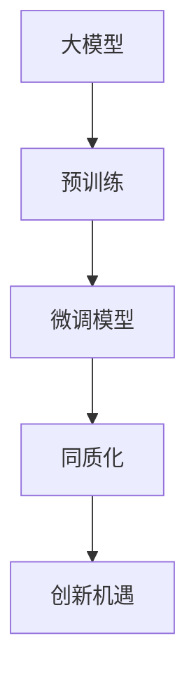

                 

# 国内大模型市场：贾扬清观点，同质化发展与创新机遇并存

> 关键词：大模型，语言模型，预训练模型，微调模型，同质化，创新

## 1. 背景介绍

在过去几年里，人工智能领域的预训练大模型技术取得了飞速发展。尤其是在自然语言处理（NLP）领域，诸如GPT-3、BERT等大模型相继问世，这些模型在多项NLP任务中刷新了最先进性能。而近年来，国内也涌现出了一批具有国际竞争力的预训练大模型，从百度文心一言、阿里灵犀模型、腾讯AI lab的魔搭等，国内大模型市场持续升温。

然而，尽管国内大模型技术取得了显著进展，但在市场和技术上仍存在诸多同质化现象，比如目标领域过于集中，集中在NLP、图像领域，对其他领域的覆盖较少；产品功能上较为相似，主要集中在模型训练、推理和微调上，缺乏具有差异化的产品功能。

尽管存在这些问题，但不可否认，大模型也带来了前所未有的创新机遇。如何更好地理解和把握这一发展态势，将为国内外技术企业和研究者提供极具价值的参考。

## 2. 核心概念与联系

### 2.1 核心概念概述

1. **大模型**：指在训练数据上预训练出的大量参数，能够在特定任务上通过微调获得较好性能的模型。常见的大模型有BERT、GPT-3、T5等。
2. **预训练模型**：指在大规模无标签数据上进行的自监督学习，用于学习语言的通用表示。
3. **微调模型**：指在大模型基础上，通过少量有标签数据进行细粒度训练，适配特定任务。
4. **同质化**：指市场上各产品功能和技术路径趋于一致，缺乏差异化竞争。
5. **创新机遇**：指在现有技术基础上的创新空间，如模型的应用拓展、训练方法改进等。

这些概念之间的联系如下：
1. **大模型-预训练模型-微调模型**：构成了从基础研究到应用的连续路径，大模型是预训练模型的产物，微调模型则是大模型在特定任务上的具体应用。
2. **同质化-创新机遇**：同质化现象在一定程度上限制了技术创新，但同时也带来了新的创新方向和机遇。

### 2.2 核心概念原理和架构的 Mermaid 流程图

## 3. 核心算法原理 & 具体操作步骤

### 3.1 算法原理概述

预训练大模型的核心原理是通过大规模数据进行自监督学习，学习语言的基本规律和语法结构。通过这种无标签的训练，模型获得了丰富的语言表示能力。而微调模型则是在预训练模型的基础上，通过有限的有标签数据对模型进行针对特定任务的学习，提升模型在该任务上的表现。

同质化现象的存在，表明市场上各个产品在大模型训练和微调方法上具有较高一致性，导致了技术应用和市场功能上的趋同。

### 3.2 算法步骤详解

1. **数据准备**：收集大规模无标签数据，进行预训练。然后收集特定任务的有标签数据，进行微调。
2. **模型选择**：选择合适的预训练模型，如BERT、GPT-3等。
3. **微调设置**：设置微调的超参数，包括学习率、训练轮次、批大小等。
4. **训练和验证**：使用验证集评估模型性能，并进行微调。
5. **测试**：在测试集上评估模型性能，并应用到实际场景中。

### 3.3 算法优缺点

#### 优点：

1. **通用性**：预训练模型可以在多个任务上进行微调，通用性较强。
2. **高效性**：相对于从头训练模型，预训练大模型可以快速适应新任务，效果显著。

#### 缺点：

1. **同质化问题**：各企业在大模型和微调方法上的趋同，导致产品功能和服务趋同。
2. **模型偏见**：预训练模型可能存在数据偏见，如性别、种族等。
3. **资源消耗大**：预训练模型和微调模型需要大量的计算资源，增加了企业的运营成本。

### 3.4 算法应用领域

大模型和微调模型在自然语言处理、图像识别、语音识别等多个领域得到了广泛应用。具体应用包括但不限于：

- **自然语言处理**：如情感分析、机器翻译、文本分类等。
- **图像识别**：如目标检测、图像分类等。
- **语音识别**：如语音识别、语音合成等。
- **医疗领域**：如医学影像分析、病理报告生成等。
- **金融领域**：如信用评估、风险控制等。

## 4. 数学模型和公式 & 详细讲解 & 举例说明

### 4.1 数学模型构建

大模型的预训练通常使用自监督学习任务，如掩码语言模型(MLM)、下一句预测(NSP)等。模型的目标函数为：

$$ L_{pretrain} = -\sum_{i=1}^n p_{i-1}(x_i | x_{<i}) $$

其中，$x_{<i}$ 表示 $x_i$ 之前的上下文序列，$p_{i-1}(x_i | x_{<i})$ 表示模型在给定上下文的情况下预测下一个词的概率。

微调模型的目标函数为：

$$ L_{fine-tune} = \sum_{i=1}^N l_i(\theta) $$

其中，$N$ 为有标签数据量，$l_i(\theta)$ 为第 $i$ 个有标签样本的损失函数，$\theta$ 为微调后的模型参数。

### 4.2 公式推导过程

预训练模型一般使用Transformer结构，其目标函数为：

$$ L_{pretrain} = -\frac{1}{N}\sum_{i=1}^N \log P(x_{<i}|x_{<i-1}) $$

其中，$P(x_{<i}|x_{<i-1})$ 为模型的预测概率。

微调模型的目标函数通常为交叉熵损失，即：

$$ L_{fine-tune} = -\sum_{i=1}^N y_i \log P(y_i|x_i) $$

其中，$y_i$ 为有标签样本的真实标签，$P(y_i|x_i)$ 为模型预测的标签概率。

### 4.3 案例分析与讲解

假设使用BERT模型进行情感分析的微调。数据准备阶段，收集大量电影评论数据，进行标注。微调设置阶段，使用AdamW优化器，学习率为1e-5，训练轮次为5轮。在训练和验证阶段，使用验证集评估模型性能，并进行微调。最后，在测试集上评估模型性能，应用到实际场景中。

## 5. 项目实践：代码实例和详细解释说明

### 5.1 开发环境搭建

使用Python环境，安装所需的深度学习库和框架，如TensorFlow、PyTorch、BERT等。同时安装相应的预训练模型和微调所需的库。

### 5.2 源代码详细实现

具体代码实现步骤包括：

1. 数据准备：收集并标注数据集。
2. 模型选择：选择预训练模型，如BERT、GPT-3等。
3. 微调设置：设置超参数，如学习率、训练轮次等。
4. 模型微调：在预训练模型上进行微调。
5. 模型评估：在测试集上评估模型性能。

### 5.3 代码解读与分析

代码中主要使用TensorFlow或PyTorch框架，进行模型的构建和训练。对于数据准备，使用Pandas等库进行数据处理和标注。微调设置主要使用优化器，如AdamW，学习率等。模型微调通过定义目标函数和损失函数，进行反向传播计算。模型评估使用Evaluate库，在测试集上评估模型性能。

### 5.4 运行结果展示

展示模型的训练曲线、验证曲线和测试集上的准确率等指标，展示微调的效果。

## 6. 实际应用场景

### 6.1 金融领域

金融领域的应用包括信用评估、风险控制、情感分析等。如使用BERT模型进行信用卡申请评估，可以更准确地判断申请者的信用风险。

### 6.2 医疗领域

医疗领域的应用包括医学影像分析、病理报告生成等。如使用Transformer模型进行病理切片图像分类，提高病理诊断的准确率。

### 6.3 教育领域

教育领域的应用包括自然语言理解和生成、作业批改、学情分析等。如使用GPT模型进行智能辅导，提供个性化的学习建议。

### 6.4 未来应用展望

未来的发展趋势包括模型训练方法改进、多模态数据融合、智能化决策等。如使用多模态大模型，结合文本、图像、语音等多种数据进行综合分析，提高决策的准确性和智能化水平。

## 7. 工具和资源推荐

### 7.1 学习资源推荐

1. **《深度学习》（Ian Goodfellow 等著）**：介绍深度学习基本概念和算法。
2. **Coursera 深度学习课程**：由斯坦福大学Andrew Ng教授主讲，深入浅出地介绍深度学习理论和技术。
3. **自然语言处理综述**：NLP领域顶级会议ACL、EMNLP上的综述论文，了解最新研究方向和技术进展。

### 7.2 开发工具推荐

1. **TensorFlow**：Google开发的深度学习框架，适用于大规模工程应用。
2. **PyTorch**：Facebook开发的深度学习框架，适用于研究和原型开发。
3. **Keras**：高层次的深度学习API，易于上手使用。
4. **Jupyter Notebook**：交互式Python环境，适合进行快速原型开发和数据分析。

### 7.3 相关论文推荐

1. **Attention is All You Need**：Transformer模型原论文，介绍Transformer结构和预训练大模型。
2. **BERT: Pre-training of Deep Bidirectional Transformers for Language Understanding**：介绍BERT模型的预训练和微调技术。
3. **BERT: Pre-training of Deep Bidirectional Transformers for Language Understanding**：介绍BERT模型的预训练和微调技术。

## 8. 总结：未来发展趋势与挑战

### 8.1 研究成果总结

预训练大模型和微调技术取得了显著进展，在多个领域得到了广泛应用。然而，市场上各产品之间的同质化现象较为严重，缺乏差异化竞争。

### 8.2 未来发展趋势

未来的发展趋势包括：

1. **技术多样化**：企业将在更多领域进行预训练和微调，拓展大模型的应用范围。
2. **模型个性化**：企业将根据自身需求定制化预训练和微调模型，提高产品的差异化水平。
3. **算法创新**：新的训练算法和微调方法将不断涌现，提高模型训练效率和性能。

### 8.3 面临的挑战

未来需要解决的问题包括：

1. **模型偏见**：预训练模型可能存在数据偏见，需要进行纠偏。
2. **资源消耗**：大模型的训练和推理需要大量的计算资源，需要优化算法和硬件。
3. **模型解释性**：大模型通常缺乏可解释性，需要开发更好的解释工具。

### 8.4 研究展望

未来需要继续在以下几个方面进行深入研究：

1. **模型训练方法改进**：提高模型的泛化能力和训练效率。
2. **多模态数据融合**：结合多种数据类型，提升模型的决策能力。
3. **智能化决策**：将深度学习与传统算法结合，提高决策的智能化水平。

总之，预训练大模型和微调技术在多个领域的应用前景广阔，但也面临着同质化等问题。未来需要各企业进行技术创新，提升模型的性能和应用水平，推动人工智能技术的产业化进程。

---

作者：禅与计算机程序设计艺术 / Zen and the Art of Computer Programming

