                 

# 国际化将成为知识付费的新增长点

> 关键词：国际化,知识付费,增长点,电子商务,数字经济,技术创新,内容创作,用户体验,跨境交易,在线平台,企业发展

## 1. 背景介绍

随着全球化的深入发展，经济和文化交流日益频繁，“国际化”已成为各行各业关注的焦点。知识付费市场作为信息消费领域的重要组成部分，也顺应这一趋势，逐步向国际化方向迈进。2020年，全球知识付费市场规模达到500亿美元，增长率达到19%。预计到2025年，这一市场规模有望突破1000亿美元，呈现出强劲的增长势头。

国际化不仅拓展了知识付费的边界，还为企业和消费者带来了新的发展机遇。然而，这一过程也充满了挑战，如何抓住机遇，应对挑战，成为业界亟需解决的问题。本文将从国际化背景下知识付费的发展趋势、面临的挑战和应对策略等方面进行探讨，以期为业内人士提供有价值的参考。

## 2. 核心概念与联系

### 2.1 核心概念概述

国际化（Internationalization）：将产品或服务推广至全球市场，满足不同地域和文化背景用户需求的过程。

知识付费（Knowledge-Based Subscription）：用户为获取专业知识、技能、经验等资源付费，通过订阅模式获取独家内容或服务。

增长点（Growth Point）：指在企业或市场中具有巨大潜力的业务领域，可以通过投资或创新实现快速增长。

电子商务（E-Commerce）：通过电子方式进行的买卖活动，包括在线支付、物流配送等环节。

数字经济（Digital Economy）：以数字技术为基础，通过数据化、网络化、智能化等手段驱动的经济形态。

技术创新（Technological Innovation）：通过技术研发和应用，提升产品或服务的功能和性能，满足市场需求。

内容创作（Content Creation）：包括文本、图像、音频、视频等多种形式的原创和编辑工作，旨在为用户提供有价值的信息和娱乐内容。

用户体验（User Experience, UX）：用户在使用产品或服务过程中感受到的愉悦和满足程度，直接影响用户留存和复购率。

跨境交易（Cross-Border Trade）：跨越国界的交易活动，涉及货币、税收、物流等多个复杂环节。

在线平台（Online Platform）：通过互联网提供服务的平台，如电商平台、在线教育平台等。

企业发展（Corporate Development）：企业在市场环境变化下，通过战略调整、业务拓展等方式实现持续增长。

这些核心概念之间的关系可以通过以下Mermaid流程图来展示：

```mermaid
graph LR
    A[国际化] --> B[知识付费]
    B --> C[增长点]
    C --> D[电子商务]
    C --> E[数字经济]
    C --> F[技术创新]
    C --> G[内容创作]
    C --> H[用户体验]
    C --> I[跨境交易]
    C --> J[在线平台]
    C --> K[企业发展]
```



这个流程图展示了大语言模型微调的主要概念及其之间的关系：国际化知识付费通过电子商务、数字经济、技术创新、内容创作、用户体验、跨境交易、在线平台和企业发展等多个环节的协同作用，成为企业增长的新动力。

## 3. 核心算法原理 & 具体操作步骤
### 3.1 算法原理概述

国际化知识付费的实现依赖于多种技术的有机结合，包括大数据、人工智能、云计算等。其核心算法原理如下：

**用户画像分析**：通过大数据技术对用户行为、偏好、兴趣等进行分析，构建详细的用户画像，为个性化推荐和服务提供依据。

**智能推荐系统**：基于人工智能算法，如协同过滤、内容推荐等，为用户提供精准的内容推荐，提升用户体验。

**自然语言处理（NLP）**：通过自然语言处理技术，如语言模型、语义理解等，提升内容创作的效率和质量。

**个性化营销**：利用用户画像和智能推荐系统，进行个性化营销，提高转化率和用户满意度。

**跨境支付与物流**：通过跨境支付和物流系统，实现跨境交易的顺畅进行，减少交易成本，提升用户满意度。

**多语言支持**：通过多语言处理技术，如机器翻译、本地化等，提升平台的多语言支持能力，扩大用户覆盖面。

### 3.2 算法步骤详解

**Step 1: 数据收集与分析**
- 收集全球各地的用户数据，涵盖年龄、性别、职业、兴趣等多种维度。
- 利用大数据技术进行数据清洗和分析，构建详细的用户画像。

**Step 2: 内容创作与推荐**
- 基于用户画像，利用人工智能技术进行内容创作，生成具有高相关性的优质内容。
- 通过智能推荐系统，为用户提供个性化的内容推荐。

**Step 3: 多语言支持**
- 采用机器翻译技术，实现内容的多语言支持。
- 利用本地化技术，将内容适配至不同国家和地区的文化和语言习惯。

**Step 4: 跨境支付与物流**
- 搭建跨境支付和物流系统，支持不同货币和物流标准的交易需求。
- 优化支付和物流流程，减少交易成本，提升用户体验。

**Step 5: 用户体验优化**
- 通过用户反馈和数据分析，不断优化平台功能和用户界面。
- 提升平台的响应速度和稳定性，增强用户粘性。

### 3.3 算法优缺点

国际化知识付费的优势：
1. 拓展市场空间：通过跨境交易，企业能够进入新的市场，扩大用户基础。
2. 提升用户粘性：个性化推荐和优质内容能够提升用户满意度和忠诚度。
3. 降低运营成本：通过技术创新，如智能推荐系统、多语言支持等，降低运营成本。

国际化知识付费的挑战：
1. 文化差异：不同国家和地区的文化和语言差异，可能导致内容无法满足用户需求。
2. 数据隐私：跨境交易和数据传输涉及数据隐私和安全问题，需要严格遵守当地法律法规。
3. 支付和物流：跨境支付和物流的复杂性，增加了企业的运营难度。
4. 技术壁垒：多语言支持和跨境交易需要复杂的后台系统和技术支持，增加了技术难度。

### 3.4 算法应用领域

国际化知识付费在多个领域都具有广泛的应用前景，例如：

- 在线教育：提供多语言支持和个性化教学，满足全球用户的需求。
- 职业技能培训：通过跨境交易，提供专业的技能培训课程，提升用户职业技能。
- 健康咨询：提供多语言的健康咨询服务和个性化健康方案，提升用户体验。
- 法律服务：提供多语言的法律咨询和定制化服务，扩大法律服务市场。
- 金融理财：提供跨境支付和理财服务，满足全球客户的金融需求。

这些领域的应用不仅拓展了知识付费的边界，也为企业和用户带来了新的机遇和挑战。

## 4. 数学模型和公式 & 详细讲解 & 举例说明

### 4.1 数学模型构建

设用户画像为 $U=(u_1,u_2,...,u_n)$，其中 $u_i$ 表示用户 $i$ 的特征向量。内容特征为 $C=(c_1,c_2,...,c_m)$，其中 $c_j$ 表示内容 $j$ 的特征向量。推荐算法为 $R$。

用户和内容的匹配度计算公式为：

$$
P(u_i,c_j) = \frac{1}{1+\exp(-\sum_{k=1}^K a_k u_{ik} c_{jk})}
$$

其中 $a_k$ 表示特征 $k$ 的权重。

用户和内容的匹配度矩阵为 $P=(P_{ij})$。根据匹配度矩阵，推荐算法 $R$ 可以计算出用户 $i$ 对内容 $j$ 的推荐度 $r_{ij}$。推荐度较高的内容会被优先推荐给用户。

### 4.2 公式推导过程

设 $N$ 为用户的总数，$M$ 为内容的总数。推荐算法 $R$ 的输出为推荐度矩阵 $R=(\vec{r}_i)_{i=1}^N$，其中 $\vec{r}_i$ 表示用户 $i$ 的推荐度向量。

推荐度矩阵 $R$ 的计算公式为：

$$
R = P^T C
$$

其中 $P^T$ 表示匹配度矩阵的转置。

推荐算法 $R$ 的计算公式为：

$$
r_{ij} = \sum_{k=1}^K a_k P_{ik} c_{kj}
$$

通过公式推导，可以看出推荐算法 $R$ 基于用户画像和内容特征，通过计算匹配度矩阵，得到用户的推荐度向量，从而实现个性化推荐。

### 4.3 案例分析与讲解

假设某在线教育平台，有 $N=10,000$ 个用户和 $M=5,000$ 个课程内容。用户画像特征 $U=(u_1,u_2,...,u_n)$ 包括年龄、职业、地域等多种维度。课程内容特征 $C=(c_1,c_2,...,c_m)$ 包括课程名称、作者、时长等多种维度。匹配度矩阵 $P=(P_{ij})$ 基于用户画像和内容特征，计算出用户和内容的匹配度。

根据推荐算法 $R$ 的计算公式，推荐度矩阵 $R=(\vec{r}_i)_{i=1}^N$ 可以表示用户 $i$ 对课程内容的推荐度向量。通过推荐度矩阵 $R$，平台可以为每个用户推荐最相关的课程内容，提升用户满意度和学习效果。

## 5. 项目实践：代码实例和详细解释说明

### 5.1 开发环境搭建

开发环境搭建主要包括数据库、服务器、开发工具等，具体如下：

- 数据库：使用MySQL或MongoDB等关系型/非关系型数据库。
- 服务器：使用AWS或阿里云等云服务器，支持高并发和高可用性。
- 开发工具：使用Python、JavaScript、React等开发语言和框架。
- 前端框架：使用Vue或React等前端框架，提升用户体验。

### 5.2 源代码详细实现

**用户画像分析**

```python
import pandas as pd
import numpy as np

# 读取用户数据
data = pd.read_csv('user_data.csv')

# 特征工程
features = ['age', 'gender', 'profession', 'interest']

# 构建用户画像特征
user_profile = data[features].groupby('user_id').mean()

# 输出用户画像特征
print(user_profile)
```

**智能推荐系统**

```python
import numpy as np
import pandas as pd
from sklearn.feature_extraction.text import TfidfVectorizer
from sklearn.metrics.pairwise import cosine_similarity

# 读取课程内容数据
data = pd.read_csv('course_data.csv')

# 特征工程
features = ['name', 'author', 'duration']

# 构建内容特征
content_profile = data[features].groupby('course_id').mean()

# 构建匹配度矩阵
similarity_matrix = cosine_similarity(content_profile)

# 输出匹配度矩阵
print(similarity_matrix)
```

**多语言支持**

```python
import numpy as np
import pandas as pd
from sklearn.feature_extraction.text import TfidfVectorizer
from sklearn.metrics.pairwise import cosine_similarity

# 读取课程内容数据
data = pd.read_csv('course_data.csv')

# 特征工程
features = ['name', 'author', 'duration']

# 构建内容特征
content_profile = data[features].groupby('course_id').mean()

# 构建匹配度矩阵
similarity_matrix = cosine_similarity(content_profile)

# 多语言支持
language_map = {'en': 'English', 'zh': 'Chinese', 'fr': 'French'}

# 翻译课程名称
translated_names = []
for course in data['name']:
    translated_name = translate(course)
    translated_names.append(translated_name)

# 输出翻译后的课程名称
print(translated_names)
```

**跨境支付与物流**

```python
import numpy as np
import pandas as pd

# 读取支付和物流数据
data = pd.read_csv('payment_and_logistics.csv')

# 特征工程
features = ['currency', 'shipping_method']

# 构建支付和物流特征
payment_and_logistics_profile = data[features].groupby('order_id').mean()

# 输出支付和物流特征
print(payment_and_logistics_profile)
```

**用户体验优化**

```python
import numpy as np
import pandas as pd

# 读取用户反馈数据
data = pd.read_csv('user_feedback.csv')

# 特征工程
features = ['satisfaction', 'rating', 'feedback']

# 构建用户反馈特征
user_feedback_profile = data[features].groupby('user_id').mean()

# 输出用户反馈特征
print(user_feedback_profile)
```

### 5.3 代码解读与分析

**用户画像分析**

通过特征工程和数据聚合，我们构建了详细的用户画像，帮助平台更好地理解用户需求。用户画像的特征包括年龄、性别、职业、兴趣等，这些特征将作为个性化推荐的基础。

**智能推荐系统**

通过内容特征和匹配度矩阵，我们实现了个性化推荐算法。匹配度矩阵基于内容特征计算出课程之间的相似度，推荐算法基于匹配度矩阵和用户画像特征，生成用户的推荐度向量，实现个性化推荐。

**多语言支持**

多语言支持是国际化知识付费的关键环节。我们通过翻译课程名称，实现内容的多语言支持。同时，利用本地化技术，将内容适配至不同国家和地区的文化和语言习惯，提升用户体验。

**跨境支付与物流**

跨境支付和物流系统是国际化知识付费的重要保障。我们通过支付和物流特征，构建跨境支付和物流系统，支持不同货币和物流标准的交易需求，提升交易效率和用户满意度。

**用户体验优化**

用户反馈数据是提升用户体验的重要依据。通过用户反馈特征，我们可以了解用户的需求和满意度，不断优化平台功能和用户界面，增强用户粘性。

### 5.4 运行结果展示

通过以上代码实现，我们得到了详细的用户画像、个性化推荐度向量、翻译后的课程名称、跨境支付和物流特征、用户反馈特征等结果。这些结果将帮助平台更好地实现国际化知识付费，提升用户满意度和平台竞争力。

## 6. 实际应用场景

### 6.1 在线教育

在线教育平台通过国际化知识付费，可以提供多语言支持和个性化教学，满足全球用户的需求。例如，某在线教育平台通过智能推荐系统，为用户推荐最适合的课程内容，提升学习效果。同时，平台提供多语言支持，满足不同国家和地区的用户需求。

### 6.2 职业技能培训

职业技能培训平台通过国际化知识付费，提供专业的技能培训课程，提升用户职业技能。例如，某职业技能培训平台通过跨境交易，为全球用户提供专业技能培训课程，提升用户职业技能和就业竞争力。

### 6.3 健康咨询

健康咨询平台通过国际化知识付费，提供多语言的健康咨询服务和个性化健康方案，提升用户体验。例如，某健康咨询平台通过多语言支持，为全球用户提供健康咨询服务，提升用户健康水平。

### 6.4 法律服务

法律服务平台通过国际化知识付费，提供多语言的法律咨询和定制化服务，扩大法律服务市场。例如，某法律服务平台通过跨境交易，为全球用户提供法律咨询服务，提升用户法律意识和维权能力。

### 6.5 金融理财

金融理财平台通过国际化知识付费，提供跨境支付和理财服务，满足全球客户的金融需求。例如，某金融理财平台通过跨境支付和物流系统，为全球客户提供金融理财服务，提升客户金融素养和理财能力。

## 7. 工具和资源推荐

### 7.1 学习资源推荐

为了帮助开发者系统掌握国际化知识付费的理论基础和实践技巧，这里推荐一些优质的学习资源：

1. 《国际化知识付费原理与应用》系列博文：由国际化知识付费专家撰写，深入浅出地介绍了国际化知识付费的原理、技术和应用场景。

2. 《电子商务国际化发展战略》课程：北京大学商学院开设的国际化电子商务课程，涵盖国际贸易、跨境电商等基础知识和实践技巧。

3. 《数字经济与国际合作》书籍：国际知名学者撰写的关于数字经济和国际合作的著作，全面介绍了数字经济的基础理论和国际合作机制。

4. 《技术创新与国际化》博客：知名科技媒体开设的关于技术创新和国际化的博客，提供最新的技术动态和政策解读。

5. 《用户体验设计》书籍：关于用户体验设计原则和方法的著作，帮助开发者提升用户体验。

6. 《跨境支付与物流管理》书籍：介绍跨境支付和物流管理的原理和实践，帮助企业优化跨境交易流程。

通过对这些资源的学习实践，相信你一定能够快速掌握国际化知识付费的精髓，并用于解决实际的NLP问题。

### 7.2 开发工具推荐

高效的开发离不开优秀的工具支持。以下是几款用于国际化知识付费开发的常用工具：

1. PyTorch：基于Python的开源深度学习框架，灵活动态的计算图，适合快速迭代研究。

2. TensorFlow：由Google主导开发的开源深度学习框架，生产部署方便，适合大规模工程应用。

3. Flask：Python的轻量级Web框架，简单易用，适合快速开发API接口。

4. Django：Python的Web开发框架，功能丰富，适合构建大型Web应用。

5. React：用于构建前端页面的JavaScript库，性能高效，组件化设计，方便维护。

6. Vue：用于构建前端页面的JavaScript框架，简单易学，组件化设计，灵活扩展。

合理利用这些工具，可以显著提升国际化知识付费任务的开发效率，加快创新迭代的步伐。

### 7.3 相关论文推荐

国际化知识付费的发展源于学界的持续研究。以下是几篇奠基性的相关论文，推荐阅读：

1. Harnessing Big Data for Personalized Recommendation Systems：介绍了基于大数据和人工智能的个性化推荐系统，提升用户体验。

2. The Future of Work: Navigating the Digital Economy：讨论了数字经济的发展趋势，探讨了企业在数字经济中的机遇和挑战。

3. Multilingual Text Generation with Continuous Prompts：介绍了一种新的多语言生成技术，通过连续型Prompt引导大语言模型生成多语言文本。

4. Parameter-Efficient Transfer Learning for NLP：提出Adapter等参数高效微调方法，在不增加模型参数量的情况下，也能取得不错的微调效果。

5. The Role of AI in Cross-Border E-commerce：探讨了人工智能在跨境电商中的作用和前景，推动跨境电商的发展。

这些论文代表了大语言模型微调技术的发展脉络。通过学习这些前沿成果，可以帮助研究者把握学科前进方向，激发更多的创新灵感。

## 8. 总结：未来发展趋势与挑战

### 8.1 总结

本文对国际化知识付费的发展趋势、面临的挑战和应对策略进行了全面系统的介绍。首先阐述了国际化背景下的知识付费发展趋势，明确了国际化知识付费在拓展市场空间、提升用户粘性、降低运营成本等方面的优势。其次，从数据收集与分析、内容创作与推荐、多语言支持、跨境支付与物流、用户体验优化等多个方面，详细讲解了国际化知识付费的实现步骤和关键算法。同时，本文还广泛探讨了国际化知识付费在在线教育、职业技能培训、健康咨询、法律服务、金融理财等多个领域的应用前景，展示了国际化知识付费的巨大潜力。此外，本文精选了国际化知识付费的学习资源、开发工具和相关论文，力求为读者提供全方位的技术指引。

通过本文的系统梳理，可以看到，国际化知识付费在提升用户体验、拓展市场空间、降低运营成本等方面具有巨大的潜力和前景。未来的国际化知识付费将在更多领域得到广泛应用，成为企业发展的新增长点。

### 8.2 未来发展趋势

展望未来，国际化知识付费的发展趋势主要包括以下几个方面：

1. 内容多元化：随着用户需求的不断变化，知识付费平台将提供更多元化的内容形式，如视频、直播、虚拟现实等，提升用户体验。

2. 技术创新：大数据、人工智能、云计算等技术将继续推动国际化知识付费的发展，实现更精准的个性化推荐和服务。

3. 全球化运营：越来越多的企业将拓展全球市场，实现多国多语言的运营，提升全球用户覆盖面。

4. 政策环境：各国政府将出台更多支持知识付费的政策，推动数字经济和跨境电商的发展。

5. 行业标准：国际化知识付费行业将制定更多行业标准和规范，提升平台和用户的安全性和合规性。

6. 消费者意识：消费者将更加注重知识付费的价值和效果，推动平台提升内容和服务的质量。

以上趋势凸显了国际化知识付费发展的广阔前景。这些方向的探索发展，必将进一步提升知识付费系统的性能和应用范围，为数字经济的发展注入新的动力。

### 8.3 面临的挑战

尽管国际化知识付费具有广阔的前景，但在实现过程中仍面临诸多挑战：

1. 文化差异：不同国家和地区的文化和语言差异，可能导致内容无法满足用户需求。

2. 数据隐私：跨境交易和数据传输涉及数据隐私和安全问题，需要严格遵守当地法律法规。

3. 支付和物流：跨境支付和物流的复杂性，增加了企业的运营难度。

4. 技术壁垒：多语言支持和跨境交易需要复杂的后台系统和技术支持，增加了技术难度。

5. 用户教育：用户对知识付费的认知和接受度不同，需要开展用户教育，提高用户转化率。

6. 市场竞争：知识付费市场的竞争日趋激烈，企业需要不断创新和优化，保持竞争优势。

7. 知识产权：知识产权保护问题需要得到重视，避免侵权和盗版行为。

这些挑战需要企业从多个方面进行综合应对，才能实现国际化知识付费的可持续发展。

### 8.4 研究展望

面对国际化知识付费所面临的挑战，未来的研究需要在以下几个方面寻求新的突破：

1. 多语言支持技术：开发更高效的多语言处理技术，提升内容的可读性和可理解性。

2. 跨境支付和物流优化：探索更高效的跨境支付和物流解决方案，降低运营成本，提升交易效率。

3. 用户体验优化：利用大数据和人工智能技术，提升个性化推荐和用户体验，增强用户粘性。

4. 数据隐私保护：建立数据隐私保护机制，确保用户数据的安全性和合规性。

5. 技术创新和升级：持续进行技术创新和升级，提升平台的稳定性和性能。

6. 政策环境优化：与政府部门和行业协会合作，制定和优化相关政策，推动国际化知识付费的发展。

7. 市场教育和推广：开展市场教育和推广活动，提高用户对知识付费的认知和接受度。

这些研究方向的探索，必将引领国际化知识付费技术迈向更高的台阶，为数字经济的发展注入新的动力。面向未来，国际化知识付费技术还需要与其他人工智能技术进行更深入的融合，如知识表示、因果推理、强化学习等，多路径协同发力，共同推动数字经济的进步。只有勇于创新、敢于突破，才能不断拓展国际化知识付费的边界，让知识付费技术更好地造福全人类。

## 9. 附录：常见问题与解答

**Q1：如何进行国际化知识付费的市场拓展？**

A: 国际化知识付费的市场拓展主要依赖于以下策略：

1. 多语言支持：将内容适配至不同国家和地区的文化和语言习惯，提升用户体验。

2. 本地化营销：根据不同国家和地区的用户特点，制定本地化营销策略，提高用户转化率。

3. 跨境支付和物流：搭建跨境支付和物流系统，支持不同货币和物流标准的交易需求，降低交易成本。

4. 政策合规：了解和遵守当地法律法规，确保业务合法合规。

5. 多渠道推广：通过社交媒体、搜索引擎、电商平台等渠道进行推广，提升用户覆盖面。

6. 合作伙伴关系：与本地企业、机构和平台建立合作关系，共同推广知识付费业务。

**Q2：如何提高国际化知识付费的内容质量和用户体验？**

A: 提高国际化知识付费的内容质量和用户体验需要从多个方面进行优化：

1. 内容创作：招募专业的内容创作者，提供优质的内容资源。

2. 个性化推荐：利用人工智能技术，进行精准的内容推荐，提升用户体验。

3. 本地化定制：根据不同国家和地区的用户需求，提供定制化的内容和解决方案。

4. 多语言支持：通过机器翻译和本地化技术，实现多语言支持，满足用户需求。

5. 用户反馈：收集用户反馈，不断优化内容和功能，提升用户满意度。

6. 技术创新：利用大数据和人工智能技术，提升平台的稳定性和性能，增强用户粘性。

**Q3：国际化知识付费面临的主要挑战有哪些？**

A: 国际化知识付费面临的主要挑战包括：

1. 文化差异：不同国家和地区的文化和语言差异，可能导致内容无法满足用户需求。

2. 数据隐私：跨境交易和数据传输涉及数据隐私和安全问题，需要严格遵守当地法律法规。

3. 支付和物流：跨境支付和物流的复杂性，增加了企业的运营难度。

4. 技术壁垒：多语言支持和跨境交易需要复杂的后台系统和技术支持，增加了技术难度。

5. 用户教育：用户对知识付费的认知和接受度不同，需要开展用户教育，提高用户转化率。

6. 市场竞争：知识付费市场的竞争日趋激烈，企业需要不断创新和优化，保持竞争优势。

7. 知识产权：知识产权保护问题需要得到重视，避免侵权和盗版行为。

**Q4：如何构建国际化知识付费平台的技术架构？**

A: 构建国际化知识付费平台的技术架构需要考虑以下几个方面：

1. 用户画像分析：通过大数据技术，构建详细的用户画像，为个性化推荐和服务提供依据。

2. 智能推荐系统：基于人工智能算法，如协同过滤、内容推荐等，为用户提供精准的内容推荐。

3. 多语言支持：通过机器翻译和本地化技术，实现内容的多语言支持。

4. 跨境支付与物流：搭建跨境支付和物流系统，支持不同货币和物流标准的交易需求。

5. 用户体验优化：通过用户反馈和数据分析，不断优化平台功能和用户界面，增强用户粘性。

6. 数据隐私保护：建立数据隐私保护机制，确保用户数据的安全性和合规性。

7. 技术创新和升级：持续进行技术创新和升级，提升平台的稳定性和性能。

**Q5：国际化知识付费的未来发展前景如何？**

A: 国际化知识付费的未来发展前景非常广阔：

1. 市场空间：随着全球化进程的加速，国际化知识付费市场空间将进一步扩大。

2. 技术创新：大数据、人工智能、云计算等技术将继续推动国际化知识付费的发展，实现更精准的个性化推荐和服务。

3. 用户需求：用户对个性化、高质量知识内容的需求将持续增长，推动平台提升内容质量和用户体验。

4. 政策环境：各国政府将出台更多支持知识付费的政策，推动数字经济和跨境电商的发展。

5. 技术壁垒：随着技术的发展，多语言支持、跨境支付和物流等技术壁垒将逐步被突破。

6. 市场竞争：虽然市场竞争激烈，但通过技术创新和个性化服务，企业可以保持竞争优势。

7. 用户教育：随着用户教育水平的提升，知识付费市场将逐步成熟，用户转化率将不断提高。

综上所述，国际化知识付费具有广阔的发展前景，将成为企业发展的新增长点。

作者：禅与计算机程序设计艺术 / Zen and the Art of Computer Programming

