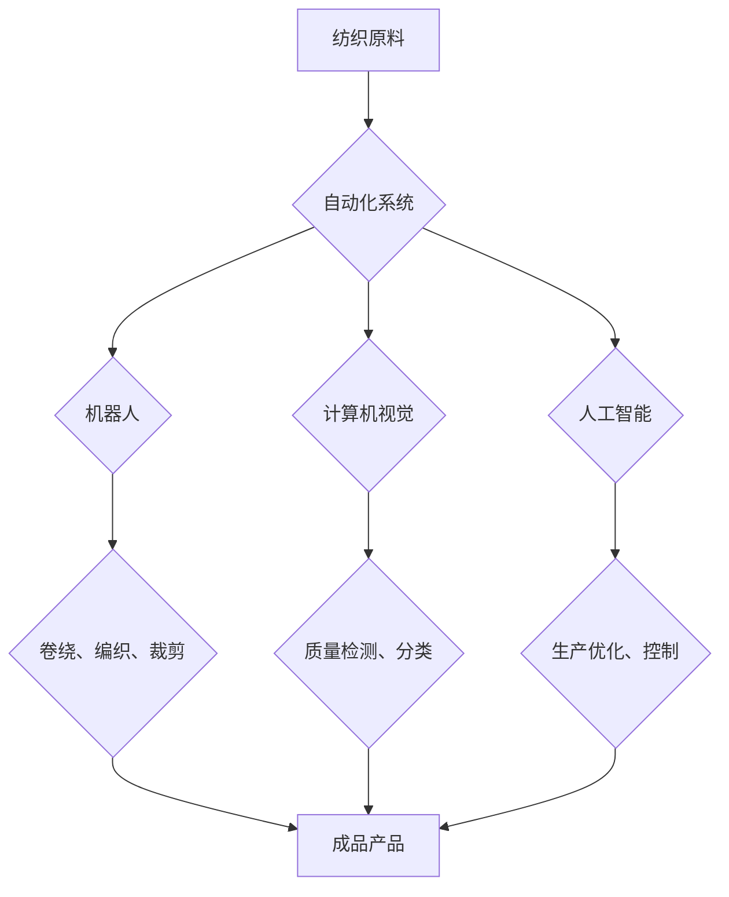

> 纺织机械自动化、就业效应、经济影响、技术替代、技能升级、未来趋势

## 1. 背景介绍

纺织业作为世界经济的重要组成部分，历经数百年发展，从手工纺织到现代化机械化生产，经历了翻天覆地的变化。近年来，随着人工智能、机器学习、大数据等技术的快速发展，纺织机械自动化正处于爆发式增长阶段。自动化生产线、智能机器人、数字化控制系统等技术不断涌现，为纺织业带来了更高的效率、更低的成本和更优质的产品。然而，纺织机械自动化也引发了人们对就业效应的广泛关注。

一方面，自动化生产可以提高生产效率，降低生产成本，促进纺织业的竞争力提升。另一方面，自动化也可能导致部分传统纺织岗位被替代，引发失业问题。因此，探讨纺织机械自动化的就业效应，对于促进纺织业的可持续发展和保障劳动者权益至关重要。

## 2. 核心概念与联系

**2.1 纺织机械自动化**

纺织机械自动化是指利用自动化技术和智能控制系统，实现纺织生产过程的智能化、高效化和数字化。

**2.2 核心概念原理和架构**

纺织机械自动化主要包括以下几个核心概念：

* **机器人技术:** 机器人可以替代人工完成重复性、高强度、危险性操作，例如卷绕、编织、裁剪等。
* **计算机视觉:** 计算机视觉技术可以识别和分析纺织材料的质量、颜色、纹理等信息，实现自动检测和分类。
* **人工智能:** 人工智能算法可以学习和优化纺织生产过程，例如预测生产需求、调整生产参数、控制机器运行等。
* **物联网:** 物联网技术可以将纺织生产设备连接起来，实现数据共享和远程监控，提高生产效率和管理水平。

**2.3 Mermaid 流程图**



## 3. 核心算法原理 & 具体操作步骤

**3.1 算法原理概述**

纺织机械自动化中常用的算法包括机器学习、深度学习、计算机视觉算法等。

* **机器学习:** 机器学习算法可以从数据中学习模式和规律，用于预测生产需求、优化生产参数、控制机器运行等。
* **深度学习:** 深度学习算法是一种更高级的机器学习算法，可以处理更复杂的数据，例如图像、语音、文本等，用于图像识别、语音识别、自然语言处理等应用。
* **计算机视觉算法:** 计算机视觉算法可以使计算机“看”图像，识别和分析图像中的物体、场景、特征等信息，用于质量检测、缺陷识别、自动导航等应用。

**3.2 算法步骤详解**

以机器学习算法为例，其基本步骤包括：

1. **数据收集:** 收集大量相关数据，例如生产历史数据、机器运行数据、产品质量数据等。
2. **数据预处理:** 对收集到的数据进行清洗、转换、特征提取等处理，使其适合机器学习算法的训练。
3. **模型选择:** 选择合适的机器学习算法模型，例如线性回归、决策树、支持向量机等。
4. **模型训练:** 使用训练数据训练机器学习模型，使其能够学习数据中的模式和规律。
5. **模型评估:** 使用测试数据评估模型的性能，例如准确率、召回率、F1-score等。
6. **模型部署:** 将训练好的模型部署到生产环境中，用于实际应用。

**3.3 算法优缺点**

* **优点:** 能够自动学习和优化生产过程，提高生产效率和产品质量。
* **缺点:** 需要大量的数据进行训练，算法模型的准确性依赖于数据质量，算法解释性较差。

**3.4 算法应用领域**

* **质量检测:** 利用计算机视觉算法自动检测纺织产品的质量缺陷。
* **生产优化:** 利用机器学习算法预测生产需求、优化生产参数、控制机器运行。
* **智能物流:** 利用人工智能算法优化物流配送路线、提高物流效率。

## 4. 数学模型和公式 & 详细讲解 & 举例说明

**4.1 数学模型构建**

纺织机械自动化的数学模型可以描述生产过程中的各种关系，例如生产效率、成本、质量等。

例如，可以建立一个生产效率模型，用生产量和生产时间来表示生产效率：

$$
效率 = \frac{生产量}{生产时间}
$$

**4.2 公式推导过程**

可以根据实际生产数据，通过统计分析和回归分析等方法，推导出生产效率模型的具体公式。

**4.3 案例分析与讲解**

假设一家纺织厂采用自动化生产线，生产效率提高了 20%。

$$
效率_{自动化} = 1.2 \times 效率_{传统}
$$

这意味着，自动化生产线可以生产出更多产品，在相同的时间内。

## 5. 项目实践：代码实例和详细解释说明

**5.1 开发环境搭建**

* 操作系统: Ubuntu 20.04
* 编程语言: Python 3.8
* 库依赖: TensorFlow, OpenCV, NumPy

**5.2 源代码详细实现**

```python
import tensorflow as tf
from tensorflow.keras.models import Sequential
from tensorflow.keras.layers import Conv2D, MaxPooling2D, Flatten, Dense

# 定义卷积神经网络模型
model = Sequential()
model.add(Conv2D(32, (3, 3), activation='relu', input_shape=(28, 28, 1)))
model.add(MaxPooling2D((2, 2)))
model.add(Conv2D(64, (3, 3), activation='relu'))
model.add(MaxPooling2D((2, 2)))
model.add(Flatten())
model.add(Dense(10, activation='softmax'))

# 编译模型
model.compile(optimizer='adam',
              loss='sparse_categorical_crossentropy',
              metrics=['accuracy'])

# 训练模型
model.fit(x_train, y_train, epochs=10)

# 评估模型
loss, accuracy = model.evaluate(x_test, y_test)
print('Test loss:', loss)
print('Test accuracy:', accuracy)
```

**5.3 代码解读与分析**

这段代码实现了使用 TensorFlow 库构建一个简单的卷积神经网络模型，用于图像分类任务。

* `Sequential()` 创建一个顺序模型，层级结构清晰。
* `Conv2D()` 定义卷积层，提取图像特征。
* `MaxPooling2D()` 定义最大池化层，降低特征维度，提高模型鲁棒性。
* `Flatten()` 将多维特征转换为一维向量。
* `Dense()` 定义全连接层，进行分类。
* `compile()` 编译模型，指定优化器、损失函数和评价指标。
* `fit()` 训练模型，使用训练数据进行模型参数更新。
* `evaluate()` 评估模型，使用测试数据计算模型性能。

**5.4 运行结果展示**

训练完成后，模型可以用于预测新的图像类别。

## 6. 实际应用场景

**6.1 纺织品质量检测**

利用计算机视觉算法，可以自动检测纺织品中的缺陷，例如颜色不均匀、织物破损、针脚松动等，提高产品质量。

**6.2 自动化裁剪**

利用机器人技术，可以实现自动裁剪，提高裁剪效率和精度，减少人工操作。

**6.3 智能库存管理**

利用物联网技术，可以实时监控纺织原料的库存情况，及时补充原材料，避免生产中断。

**6.4 未来应用展望**

随着人工智能、机器学习等技术的不断发展，纺织机械自动化将更加智能化、个性化、高效化。

## 7. 工具和资源推荐

**7.1 学习资源推荐**

* **在线课程:** Coursera, edX, Udacity 等平台提供人工智能、机器学习、计算机视觉等方面的在线课程。
* **书籍:** 《深度学习》、《机器学习实战》、《计算机视觉》等书籍。
* **开源项目:** TensorFlow, PyTorch, OpenCV 等开源项目提供丰富的代码和文档资源。

**7.2 开发工具推荐**

* **编程语言:** Python, C++, Java 等编程语言。
* **机器学习框架:** TensorFlow, PyTorch, scikit-learn 等机器学习框架。
* **计算机视觉库:** OpenCV, Dlib 等计算机视觉库。

**7.3 相关论文推荐**

* **纺织机械自动化:** "A Review of Automation in Textile Industry"
* **机器学习在纺织业应用:** "Machine Learning Applications in the Textile Industry"
* **计算机视觉在纺织品质量检测中的应用:** "Computer Vision for Textile Quality Inspection"

## 8. 总结：未来发展趋势与挑战

**8.1 研究成果总结**

纺织机械自动化技术取得了显著进展，为纺织业带来了更高的效率、更低的成本和更优质的产品。

**8.2 未来发展趋势**

* **更智能化:** 利用人工智能、机器学习等技术，实现纺织生产过程的智能化控制和优化。
* **更个性化:** 利用3D打印、个性化定制等技术，满足消费者对个性化产品的需求。
* **更可持续:** 利用绿色环保技术，减少纺织生产过程中的能源消耗和环境污染。

**8.3 面临的挑战**

* **技术难题:** 纺织生产过程复杂多样，需要开发更先进的算法和技术来解决技术难题。
* **人才短缺:** 纺织机械自动化需要大量高素质人才，而目前人才供给不足。
* **成本问题:** 纺织机械自动化设备成本较高，需要降低成本才能推广应用。

**8.4 研究展望**

未来，需要加强对纺织机械自动化的研究，开发更先进的技术，解决技术难题，培养更多高素质人才，推动纺织机械自动化技术向更智能化、更个性化、更可持续的方向发展。

## 9. 附录：常见问题与解答

**9.1 纺织机械自动化会取代所有纺织工人吗？**

纺织机械自动化会改变纺织行业的就业结构，但不会完全取代所有纺织工人。自动化技术可以替代一些重复性、高强度、危险性操作，但仍然需要人工进行一些需要创造力和判断力的工作，例如设计、研发、质量控制等。

**9.2 纺织工人如何适应纺织机械自动化？**

纺织工人需要不断学习新的技能，适应新的工作环境。政府、企业和教育机构需要加强职业培训，帮助纺织工人掌握新的技术和知识，提升自身竞争力。

**9.3 纺织机械自动化对纺织业的经济影响如何？**

纺织机械自动化可以提高生产效率、降低生产成本，促进纺织业的竞争力提升。但同时也可能导致部分岗位被替代，引发失业问题。因此，需要政府和企业采取措施，缓解就业压力，促进纺织业的可持续发展。


作者：禅与计算机程序设计艺术 / Zen and the Art of Computer Programming 
<end_of_turn>