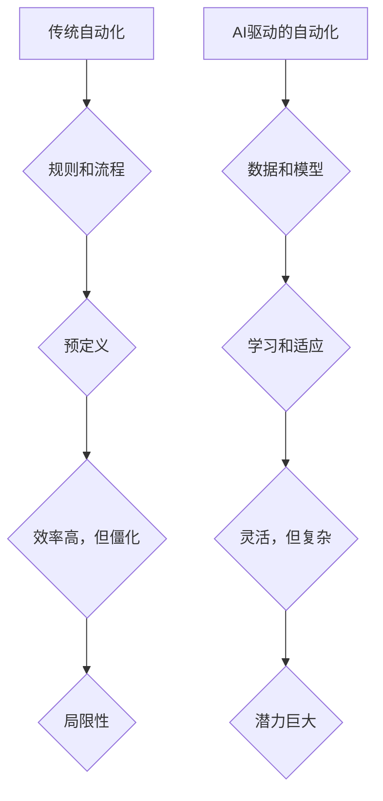

> 自动化、机器学习、深度学习、自然语言处理、计算机视觉、流程自动化、Robotic Process Automation (RPA)、人工智能伦理

## 1. 背景介绍

自动化一直是科技发展的重要驱动力，从工业革命的机械化到信息时代的软件自动化，自动化技术不断革新，推动着社会生产力和生活水平的提升。近年来，随着人工智能（AI）技术的飞速发展，自动化领域迎来了新的机遇和挑战。

传统的自动化主要依赖于预先定义的规则和流程，而AI驱动的自动化则能够学习和适应不断变化的环境，实现更智能、更灵活的自动化。例如，机器学习算法可以从海量数据中识别模式，自动完成图像识别、语音识别、文本分析等任务；深度学习算法则能够学习更复杂的模式，实现更精准的预测和决策。

## 2. 核心概念与联系

**2.1 自动化概述**

自动化是指利用技术手段，使生产、工作或其他过程无需人工干预即可自动完成的过程。它可以分为：

* **硬自动化:** 通过机械设备和控制系统实现自动化，例如流水线生产、机器人操作等。
* **软自动化:** 通过软件程序和算法实现自动化，例如数据处理、流程审批、任务调度等。

**2.2 人工智能概述**

人工智能是指模拟人类智能行为的计算机系统。它包括以下几个关键领域：

* **机器学习:** 使计算机能够从数据中学习，并根据学习到的知识进行预测或决策。
* **深度学习:** 一种更高级的机器学习方法，利用多层神经网络模拟人类大脑的学习过程。
* **自然语言处理:** 使计算机能够理解和处理人类语言。
* **计算机视觉:** 使计算机能够“看”图像和视频，并从中提取信息。

**2.3 AI驱动的自动化**

AI驱动的自动化将人工智能技术与自动化技术相结合，实现更智能、更灵活的自动化。它可以应用于各个领域，例如：

* **制造业:** 自动化生产线、机器人协作、智能质检等。
* **金融业:** 自动化交易、风险管理、客户服务等。
* **医疗保健:** 自动化诊断、药物研发、患者管理等。
* **零售业:** 自动化库存管理、个性化推荐、智能客服等。

**2.4 流程图**



## 3. 核心算法原理 & 具体操作步骤

### 3.1 算法原理概述

机器学习算法的核心原理是通过学习数据中的模式，建立数学模型，并利用该模型进行预测或决策。常见的机器学习算法包括：

* **监督学习:** 利用标记数据训练模型，例如分类、回归等。
* **无监督学习:** 利用未标记数据发现数据中的隐藏结构，例如聚类、降维等。
* **强化学习:** 通过试错学习，使智能体在环境中获得最大奖励。

### 3.2 算法步骤详解

**3.2.1 监督学习算法步骤:**

1. **数据收集和预处理:** 收集相关数据，并进行清洗、转换、特征工程等预处理操作。
2. **模型选择:** 根据任务类型选择合适的模型，例如线性回归、逻辑回归、决策树、支持向量机等。
3. **模型训练:** 利用标记数据训练模型，调整模型参数，使模型能够准确预测或分类。
4. **模型评估:** 利用测试数据评估模型的性能，例如准确率、召回率、F1-score等。
5. **模型部署:** 将训练好的模型部署到实际应用场景中，用于预测或分类新的数据。

**3.2.2 无监督学习算法步骤:**

1. **数据收集和预处理:** 收集相关数据，并进行清洗、转换等预处理操作。
2. **模型选择:** 根据任务类型选择合适的模型，例如k-means聚类、主成分分析等。
3. **模型训练:** 利用未标记数据训练模型，发现数据中的隐藏结构。
4. **结果分析:** 分析模型训练的结果，例如聚类结果、降维后的特征等。

### 3.3 算法优缺点

**3.3.1 监督学习算法:**

* **优点:** 准确率高，可以解决各种分类和回归问题。
* **缺点:** 需要大量的标记数据，训练成本高，对数据质量要求高。

**3.3.2 无监督学习算法:**

* **优点:** 不需要标记数据，可以发现数据中的隐藏结构。
* **缺点:** 难以评估模型性能，结果解释性较差。

### 3.4 算法应用领域

机器学习算法广泛应用于各个领域，例如：

* **图像识别:** 自动识别图像中的物体、场景、人脸等。
* **语音识别:** 将语音转换为文本。
* **自然语言处理:** 理解和处理人类语言，例如机器翻译、文本摘要、情感分析等。
* **推荐系统:** 根据用户的历史行为推荐相关商品或内容。
* **预测分析:** 利用历史数据预测未来趋势，例如销售预测、风险评估等。

## 4. 数学模型和公式 & 详细讲解 & 举例说明

### 4.1 数学模型构建

机器学习算法的核心是建立数学模型，用于描述数据之间的关系。常见的数学模型包括：

* **线性回归模型:** 用于预测连续变量，假设数据之间存在线性关系。

$$
y = w_0 + w_1x_1 + w_2x_2 + ... + w_nx_n + \epsilon
$$

其中：

* $y$ 是预测变量
* $x_1, x_2, ..., x_n$ 是输入变量
* $w_0, w_1, w_2, ..., w_n$ 是模型参数
* $\epsilon$ 是误差项

* **逻辑回归模型:** 用于预测分类变量，假设数据之间存在非线性关系。

$$
P(y=1|x) = \frac{1}{1 + e^{-(w_0 + w_1x_1 + w_2x_2 + ... + w_nx_n)}}
$$

其中：

* $P(y=1|x)$ 是预测类别为1的概率
* $x_1, x_2, ..., x_n$ 是输入变量
* $w_0, w_1, w_2, ..., w_n$ 是模型参数

### 4.2 公式推导过程

机器学习算法的模型参数通常通过优化算法进行调整，例如梯度下降法。梯度下降法的核心思想是迭代地更新模型参数，使模型的损失函数最小化。

损失函数衡量模型预测结果与真实结果之间的差异。常见的损失函数包括：

* **均方误差 (MSE):** 用于回归问题，计算预测值与真实值之间的平方差的平均值。

$$
MSE = \frac{1}{n} \sum_{i=1}^{n} (y_i - \hat{y}_i)^2
$$

其中：

* $y_i$ 是真实值
* $\hat{y}_i$ 是预测值
* $n$ 是样本数量

* **交叉熵损失 (Cross-Entropy Loss):** 用于分类问题，计算预测概率分布与真实概率分布之间的差异。

$$
Cross-Entropy Loss = - \sum_{i=1}^{n} y_i \log(\hat{y}_i)
$$

其中：

* $y_i$ 是真实类别
* $\hat{y}_i$ 是预测类别概率

### 4.3 案例分析与讲解

**4.3.1 线性回归案例:**

假设我们想要预测房屋价格，已知房屋面积和房间数量等特征数据。我们可以使用线性回归模型建立预测模型。

通过训练数据，我们可以得到模型参数 $w_0$, $w_1$, $w_2$, ..., $w_n$。然后，我们可以使用这些参数预测新房子的价格。

**4.3.2 逻辑回归案例:**

假设我们想要预测客户是否会购买产品，已知客户的年龄、收入等特征数据。我们可以使用逻辑回归模型建立预测模型。

通过训练数据，我们可以得到模型参数 $w_0$, $w_1$, $w_2$, ..., $w_n$。然后，我们可以使用这些参数预测新客户是否会购买产品。

## 5. 项目实践：代码实例和详细解释说明

### 5.1 开发环境搭建

* **操作系统:** Ubuntu 20.04 LTS
* **编程语言:** Python 3.8
* **机器学习库:** scikit-learn
* **数据可视化库:** matplotlib, seaborn

### 5.2 源代码详细实现

```python
# 导入必要的库
import pandas as pd
from sklearn.model_selection import train_test_split
from sklearn.linear_model import LinearRegression
from sklearn.metrics import mean_squared_error

# 加载数据
data = pd.read_csv('house_price.csv')

# 选择特征和目标变量
features = ['area', 'rooms']
target = 'price'

# 将数据分割为训练集和测试集
X_train, X_test, y_train, y_test = train_test_split(data[features], data[target], test_size=0.2, random_state=42)

# 创建线性回归模型
model = LinearRegression()

# 训练模型
model.fit(X_train, y_train)

# 预测测试集数据
y_pred = model.predict(X_test)

# 计算模型性能
mse = mean_squared_error(y_test, y_pred)
print(f'Mean Squared Error: {mse}')
```

### 5.3 代码解读与分析

* **数据加载和预处理:** 使用 pandas 库加载数据，并选择特征和目标变量。
* **数据分割:** 使用 train_test_split 函数将数据分割为训练集和测试集。
* **模型创建和训练:** 创建线性回归模型，并使用 fit 函数训练模型。
* **模型预测:** 使用 predict 函数预测测试集数据。
* **模型性能评估:** 使用 mean_squared_error 函数计算模型性能。

### 5.4 运行结果展示

运行代码后，会输出模型的均方误差值。均方误差值越小，模型的预测性能越好。

## 6. 实际应用场景

### 6.1 自动化流程

AI驱动的自动化可以应用于各种流程自动化，例如：

* **客户服务自动化:** 利用聊天机器人自动回复客户咨询，提高服务效率。
* **数据处理自动化:** 利用机器学习算法自动提取数据、清洗数据、进行数据分析等。
* **财务自动化:** 利用机器学习算法自动进行账单处理、风险评估、财务预测等。

### 6.2 智能决策支持

AI驱动的自动化可以帮助企业做出更智能的决策，例如：

* **市场营销自动化:** 利用机器学习算法分析客户数据，进行精准营销。
* **产品开发自动化:** 利用机器学习算法分析用户需求，进行产品设计和开发。
* **风险管理自动化:** 利用机器学习算法识别潜在风险，进行风险评估和控制。

### 6.4 未来应用展望

AI驱动的自动化技术将继续发展，并应用于更多领域，例如：

* **医疗保健:** 自动化诊断、药物研发、个性化治疗等。
* **教育:** 个性化学习、智能辅导等。
* **交通运输:** 自动驾驶、智能交通管理等。

## 7. 工具和资源推荐

### 7.1 学习资源推荐

* **在线课程:** Coursera, edX, Udacity 等平台提供丰富的机器学习和深度学习课程。
* **书籍:** 《机器学习》 (周志华), 《深度学习》 (Ian Goodfellow) 等书籍是机器学习和深度学习的经典教材。
* **博客和论坛:** Kaggle, Towards Data Science 等平台上有许多机器学习和深度学习相关的博客和论坛。

### 7.2 开发工具推荐