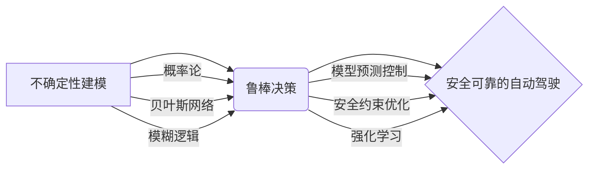

> 自动驾驶, 不确定性建模, 鲁棒决策, 深度学习, 贝叶斯网络, 概率论

## 1. 背景介绍

自动驾驶技术作为未来交通运输的重要发展方向，其核心目标是实现车辆在复杂环境下自主行驶，并安全可靠地到达目的地。然而，自动驾驶系统面临着诸多挑战，其中不确定性是其中最为关键的因素之一。

自动驾驶环境充满了各种不确定性，例如：

* **传感器噪声和误差:** 摄像头、雷达、激光雷达等传感器数据会受到噪声和误差的影响，导致感知信息不准确。
* **环境变化:** 道路状况、天气变化、行人行为等环境因素会不断变化，导致系统感知模型失效。
* **其他车辆行为:** 其他车辆的行为难以预测，例如突然变道、超速行驶等，会给自动驾驶系统带来安全风险。

不确定性会导致自动驾驶系统决策失误，甚至引发安全事故。因此，如何有效建模和处理不确定性，是自动驾驶技术发展的重要课题。

## 2. 核心概念与联系

**2.1 不确定性建模**

不确定性建模是指利用数学模型和概率论等工具，对自动驾驶环境中的不确定性进行量化和描述。常见的建模方法包括：

* **概率论:** 利用概率分布描述不确定性，例如车辆速度、位置、行人轨迹等。
* **贝叶斯网络:** 建立一个概率图模型，描述不同变量之间的依赖关系，并利用贝叶斯公式进行推理和更新。
* **模糊逻辑:** 利用模糊集和模糊规则，处理不确定性和模糊信息。

**2.2 鲁棒决策**

鲁棒决策是指在面对不确定性环境时，能够保证系统决策的可靠性和安全性。常用的鲁棒决策方法包括：

* **模型预测控制 (MPC):** 利用系统动力学模型预测未来状态，并设计控制策略以实现目标。
* **安全约束优化:** 在决策过程中加入安全约束，确保决策结果满足安全要求。
* **强化学习:** 利用强化学习算法，训练一个能够在不确定环境中做出鲁棒决策的智能代理。

**2.3 核心概念关系图**



## 3. 核心算法原理 & 具体操作步骤

### 3.1 算法原理概述

本文将重点介绍基于贝叶斯网络的不确定性建模和鲁棒决策方法。贝叶斯网络是一种概率图模型，可以表示变量之间的依赖关系，并利用贝叶斯公式进行推理和更新。

在自动驾驶场景中，我们可以利用贝叶斯网络建模传感器数据、环境信息、车辆状态等变量之间的关系。通过对这些变量进行概率推理，可以获得对不确定性的量化描述，并为鲁棒决策提供依据。

### 3.2 算法步骤详解

1. **构建贝叶斯网络:** 根据自动驾驶场景，确定需要建模的变量，并建立变量之间的依赖关系图。
2. **学习贝叶斯网络参数:** 利用历史数据，例如传感器数据、驾驶记录等，学习贝叶斯网络的参数，例如节点的概率分布、边之间的关联强度等。
3. **进行概率推理:** 当系统感知到新的环境信息时，利用贝叶斯网络进行概率推理，更新变量的概率分布，并获得对不确定性的量化描述。
4. **进行鲁棒决策:** 基于更新后的概率分布，利用鲁棒决策算法，例如安全约束优化，设计决策策略，确保决策结果满足安全要求。

### 3.3 算法优缺点

**优点:**

* 可以有效建模和处理不确定性。
* 可以利用历史数据进行学习和更新。
* 可以提供对不确定性的量化描述。

**缺点:**

* 需要大量的历史数据进行训练。
* 构建贝叶斯网络需要专业知识和经验。
* 计算复杂度较高。

### 3.4 算法应用领域

* 自动驾驶
* 医疗诊断
* 金融风险管理
* 决策支持系统

## 4. 数学模型和公式 & 详细讲解 & 举例说明

### 4.1 数学模型构建

假设我们想要建模车辆速度的不确定性。我们可以使用一个概率分布来描述车辆速度的可能性。例如，我们可以使用正态分布来描述车辆速度，其均值为 20 m/s，标准差为 2 m/s。

### 4.2 公式推导过程

贝叶斯公式用于更新概率分布。假设我们有关于车辆速度的先验知识，以及新的传感器数据。我们可以使用贝叶斯公式更新先验知识，得到后验知识。

贝叶斯公式如下：

$$P(A|B) = \frac{P(B|A)P(A)}{P(B)}$$

其中：

* $P(A|B)$ 是在已知事件 B 发生的情况下，事件 A 发生的概率（后验概率）。
* $P(B|A)$ 是在已知事件 A 发生的情况下，事件 B 发生的概率（似然概率）。
* $P(A)$ 是事件 A 发生的概率（先验概率）。
* $P(B)$ 是事件 B 发生的概率（证据概率）。

### 4.3 案例分析与讲解

假设我们有一个传感器测量了车辆的速度为 22 m/s。我们知道车辆速度的先验分布为正态分布，均值为 20 m/s，标准差为 2 m/s。我们可以使用贝叶斯公式更新先验知识，得到车辆速度的后验分布。

通过计算，我们可以得到车辆速度的后验分布为正态分布，均值为 21.8 m/s，标准差为 1.7 m/s。

## 5. 项目实践：代码实例和详细解释说明

### 5.1 开发环境搭建

* 操作系统：Ubuntu 20.04
* Python 版本：3.8
* 必要的库：NumPy, Pandas, Scikit-learn, TensorFlow

### 5.2 源代码详细实现

```python
import numpy as np
from sklearn.gaussian_process import GaussianProcessRegressor
from sklearn.gaussian_process.kernels import RBF

# 训练数据
X_train = np.array([[1], [2], [3], [4], [5]])
y_train = np.array([2.1, 2.3, 2.5, 2.7, 2.9])

# 创建 Gaussian Process Regressor 模型
kernel = RBF(length_scale=1.0)
gp = GaussianProcessRegressor(kernel=kernel, n_restarts_optimizer=10)

# 训练模型
gp.fit(X_train, y_train)

# 预测新数据
X_new = np.array([[6]])
y_pred, sigma = gp.predict(X_new, return_std=True)

# 打印预测结果
print(f"预测结果: {y_pred}")
print(f"预测标准差: {sigma}")
```

### 5.3 代码解读与分析

这段代码演示了如何使用 Gaussian Process Regressor 模型进行不确定性建模。

* 首先，我们定义了训练数据和目标变量。
* 然后，我们创建了一个 Gaussian Process Regressor 模型，并指定了核函数。
* 接着，我们训练模型，并使用训练好的模型预测新数据。
* 最后，我们打印预测结果和预测标准差。

### 5.4 运行结果展示

运行结果会显示预测结果和预测标准差。预测标准差可以反映模型对预测结果的不确定性。

## 6. 实际应用场景

### 6.1 自动驾驶场景

在自动驾驶场景中，不确定性建模和鲁棒决策方法可以应用于以下方面：

* **路径规划:** 在面对不确定环境时，自动驾驶系统需要规划一条安全可靠的路径。
* **决策控制:** 在面对紧急情况时，自动驾驶系统需要做出快速而鲁棒的决策。
* **感知融合:** 自动驾驶系统需要融合来自不同传感器的数据，并处理数据之间的不确定性。

### 6.2 其他应用场景

除了自动驾驶，不确定性建模和鲁棒决策方法还可以应用于其他领域，例如：

* **医疗诊断:** 利用患者症状和检查结果进行诊断，并处理诊断的不确定性。
* **金融风险管理:** 评估金融投资的风险，并制定相应的风险管理策略。
* **决策支持系统:** 为决策者提供决策支持，并处理决策的不确定性。

### 6.4 未来应用展望

随着人工智能技术的不断发展，不确定性建模和鲁棒决策方法将在更多领域得到应用。未来，我们可能会看到以下发展趋势：

* **更强大的不确定性建模方法:** 能够更好地处理复杂环境中的不确定性。
* **更鲁棒的决策算法:** 能够在面对更严峻的不确定性挑战时，仍然做出安全可靠的决策。
* **更广泛的应用场景:** 不确定性建模和鲁棒决策方法将应用于更多领域，例如机器人、航空航天、能源等。

## 7. 工具和资源推荐

### 7.1 学习资源推荐

* **书籍:**
    * Probabilistic Robotics by Sebastian Thrun, Wolfram Burgard, and Dieter Fox
    * Bayesian Networks and Decision Graphs by Judea Pearl
* **在线课程:**
    * Coursera: Probabilistic Graphical Models
    * edX: Introduction to Probabilistic Graphical Models

### 7.2 开发工具推荐

* **Python:** 广泛用于机器学习和人工智能开发。
* **TensorFlow:** 深度学习框架。
* **PyTorch:** 深度学习框架。
* **Scikit-learn:** 机器学习库。

### 7.3 相关论文推荐

* **Probabilistic Robotics** by Sebastian Thrun, Wolfram Burgard, and Dieter Fox
* **Bayesian Networks and Decision Graphs** by Judea Pearl
* **Gaussian Processes for Machine Learning** by Carl Edward Rasmussen and Christopher K. I. Williams

## 8. 总结：未来发展趋势与挑战

### 8.1 研究成果总结

本文介绍了自动驾驶中的不确定性建模和鲁棒决策方法，并探讨了其核心概念、算法原理、应用场景以及未来发展趋势。

### 8.2 未来发展趋势

未来，不确定性建模和鲁棒决策方法将朝着以下方向发展：

* **更强大的不确定性建模方法:** 能够更好地处理复杂环境中的不确定性，例如深度学习、强化学习等方法。
* **更鲁棒的决策算法:** 能够在面对更严峻的不确定性挑战时，仍然做出安全可靠的决策，例如安全约束优化、模型预测控制等方法。
* **更广泛的应用场景:** 不确定性建模和鲁棒决策方法将应用于更多领域，例如机器人、航空航天、能源等。

### 8.3 面临的挑战

尽管不确定性建模和鲁棒决策方法取得了显著进展，但仍面临着一些挑战：

* **数据获取和标注:** 训练鲁棒决策算法需要大量的真实世界数据，而获取和标注这些数据成本高昂。
* **模型复杂度:** 复杂环境中的不确定性建模需要构建复杂的模型，这会增加计算复杂度和推理时间。
* **安全性和可靠性:** 鲁棒决策算法需要保证在面对不确定性挑战时，仍然能够做出安全可靠的决策。

### 8.4 研究展望

未来，我们需要继续努力解决这些挑战，并推动不确定性建模和鲁棒决策方法的进一步发展。

## 9. 附录：常见问题与解答

**Q1: 为什么不确定性建模很重要？**

**A1:** 不确定性是自动驾驶系统面临的重大挑战，它会导致决策失误，甚至引发安全事故。不确定性建模可以帮助自动驾驶系统量化和处理不确定性，从而提高决策的可靠