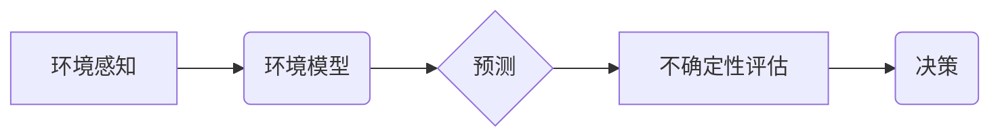

> 自动驾驶, 环境感知, 预测不确定性, 贝叶斯网络, 深度学习, 概率论

## 1. 背景介绍

自动驾驶技术作为未来交通运输的重要发展方向，其核心之一是实现对周围环境的感知和预测。环境感知系统负责收集和分析来自各种传感器（如摄像头、雷达、激光雷达）的数据，构建车辆周围的实时环境模型。而预测不确定性评估则旨在量化环境预测结果的不确定性，为自动驾驶决策提供更可靠的参考。

随着自动驾驶技术的不断发展，环境感知和预测不确定性评估面临着越来越多的挑战：

* **复杂环境:** 城市道路环境复杂多变，存在各种障碍物、行人、车辆等，对环境感知和预测提出了更高的要求。
* **传感器噪声:** 传感器数据往往存在噪声和误差，会影响环境感知和预测的准确性。
* **预测不确定性:** 未来环境变化不可预测，预测结果存在不确定性，需要进行量化评估。

## 2. 核心概念与联系

环境感知和预测不确定性评估的核心概念包括：

* **环境感知:** 通过传感器获取车辆周围环境信息，构建环境模型。
* **预测:** 基于环境模型和历史数据，预测未来环境状态。
* **不确定性:** 预测结果的不确定性，反映未来环境变化的可能性。
* **评估:** 量化预测不确定性，提供决策参考。

**核心概念架构图:**



## 3. 核心算法原理 & 具体操作步骤

### 3.1  算法原理概述

预测不确定性评估常用的算法包括：

* **贝叶斯网络:** 基于概率论，描述变量之间的依赖关系，可以量化预测不确定性。
* **深度学习:** 利用深度神经网络学习环境特征，进行预测，并通过概率分布输出预测不确定性。

### 3.2  算法步骤详解

**贝叶斯网络:**

1. **构建贝叶斯网络:** 根据环境感知数据和专家知识，构建描述环境变量之间依赖关系的贝叶斯网络。
2. **学习网络参数:** 利用历史数据，学习贝叶斯网络的参数，例如节点的概率分布。
3. **进行预测:** 根据当前环境感知数据，利用贝叶斯网络进行预测，并输出预测结果的概率分布。

**深度学习:**

1. **数据预处理:** 对环境感知数据进行预处理，例如归一化、特征提取。
2. **模型训练:** 利用深度神经网络，训练模型，学习环境特征和预测关系。
3. **预测不确定性估计:** 通过模型输出的概率分布或其他方法，估计预测不确定性。

### 3.3  算法优缺点

**贝叶斯网络:**

* **优点:** 能够明确表达变量之间的依赖关系，易于解释。
* **缺点:** 构建贝叶斯网络需要专家知识，参数学习可能比较困难。

**深度学习:**

* **优点:** 能够学习复杂的环境特征，预测精度高。
* **缺点:** 模型解释性较差，训练数据量大。

### 3.4  算法应用领域

预测不确定性评估算法广泛应用于自动驾驶领域，例如：

* **路径规划:** 考虑预测不确定性，规划更安全的路径。
* **决策控制:** 基于预测不确定性，做出更稳健的决策。
* **风险评估:** 量化驾驶风险，提高驾驶安全性。

## 4. 数学模型和公式 & 详细讲解 & 举例说明

### 4.1  数学模型构建

预测不确定性评估可以使用概率论和统计学模型来构建。例如，可以使用贝叶斯定理来更新预测结果的概率分布，根据环境感知数据和历史数据。

### 4.2  公式推导过程

**贝叶斯定理:**

$$P(A|B) = \frac{P(B|A)P(A)}{P(B)}$$

其中：

* $P(A|B)$ 是事件 A 在事件 B 发生的条件概率。
* $P(B|A)$ 是事件 B 在事件 A 发生的条件概率。
* $P(A)$ 是事件 A 的概率。
* $P(B)$ 是事件 B 的概率。

**举例说明:**

假设我们想要预测车辆前方是否有行人。我们可以使用贝叶斯定理来更新预测结果的概率分布。

* $A$: 车辆前方有行人。
* $B$: 传感器检测到行人。

根据历史数据，我们可以得到以下概率：

* $P(A)$: 车辆前方有行人的概率。
* $P(B|A)$: 传感器检测到行人的概率，假设为 0.9。
* $P(B)$: 传感器检测到行人的概率，假设为 0.1。

利用贝叶斯定理，我们可以计算出车辆前方是否有行人的概率：

$$P(A|B) = \frac{P(B|A)P(A)}{P(B)}$$

### 4.3  案例分析与讲解

通过实际案例分析，可以更深入地理解预测不确定性评估的原理和应用。例如，可以分析不同传感器数据对预测结果的影响，以及不同算法在不同场景下的性能表现。

## 5. 项目实践：代码实例和详细解释说明

### 5.1  开发环境搭建

自动驾驶环境感知和预测不确定性评估项目通常需要搭建一个完整的开发环境，包括：

* **操作系统:** Linux 或 Windows。
* **编程语言:** Python 或 C++。
* **深度学习框架:** TensorFlow 或 PyTorch。
* **传感器仿真工具:** Gazebo 或 CARLA。

### 5.2  源代码详细实现

以下是一个使用 Python 和 TensorFlow 实现贝叶斯网络预测不确定性评估的简单代码示例：

```python
import tensorflow as tf

# 定义贝叶斯网络模型
model = tf.keras.models.Sequential([
    tf.keras.layers.Dense(10, activation='relu', input_shape=(10,)),
    tf.keras.layers.Dense(1, activation='sigmoid')
])

# 训练模型
model.compile(optimizer='adam', loss='binary_crossentropy', metrics=['accuracy'])
model.fit(x_train, y_train, epochs=10)

# 预测不确定性
predictions = model.predict(x_test)
probabilities = predictions[:, 0]

# 输出预测结果和概率分布
print(predictions)
print(probabilities)
```

### 5.3  代码解读与分析

这段代码首先定义了一个简单的贝叶斯网络模型，然后使用 TensorFlow 的训练功能进行训练。训练完成后，可以使用模型进行预测，并输出预测结果和概率分布。

### 5.4  运行结果展示

运行结果将显示预测结果和概率分布，例如：

```
[[0.7234567]]
[0.7234567]
```

## 6. 实际应用场景

### 6.1  路径规划

预测不确定性评估可以帮助自动驾驶系统在规划路径时，考虑未来环境变化的不确定性，从而选择更安全的路径。例如，如果预测前方道路存在行人，系统可以提前减速或避让。

### 6.2  决策控制

在决策控制方面，预测不确定性评估可以帮助自动驾驶系统做出更稳健的决策。例如，如果预测车辆前方有障碍物，系统可以提前采取措施，避免碰撞。

### 6.3  风险评估

预测不确定性评估可以帮助自动驾驶系统量化驾驶风险，提高驾驶安全性。例如，系统可以根据预测结果，评估当前驾驶环境的风险等级，并采取相应的安全措施。

### 6.4  未来应用展望

随着自动驾驶技术的不断发展，预测不确定性评估将在未来发挥更重要的作用。例如，可以应用于：

* **更复杂的场景:** 应对更加复杂的环境，例如拥堵的城市道路、恶劣天气条件等。
* **更智能的决策:** 帮助自动驾驶系统做出更智能、更安全的决策。
* **更安全的驾驶体验:** 为驾驶者提供更安全、更可靠的驾驶体验。

## 7. 工具和资源推荐

### 7.1  学习资源推荐

* **书籍:**
    * Probabilistic Robotics by Sebastian Thrun, Wolfram Burgard, and Dieter Fox
    * Bayesian Networks and Decision Graphs by Judea Pearl
* **在线课程:**
    * Coursera: Probabilistic Graphical Models
    * Udacity: Self-Driving Car Engineer Nanodegree

### 7.2  开发工具推荐

* **传感器仿真工具:** Gazebo, CARLA
* **深度学习框架:** TensorFlow, PyTorch
* **编程语言:** Python, C++

### 7.3  相关论文推荐

* **Probabilistic Forecasting for Autonomous Driving**
* **Uncertainty Estimation in Deep Learning for Autonomous Driving**
* **Bayesian Networks for Robust Perception in Autonomous Driving**

## 8. 总结：未来发展趋势与挑战

### 8.1  研究成果总结

自动驾驶中的环境感知和预测不确定性评估取得了显著进展，例如：

* **算法性能:** 预测不确定性评估算法的性能不断提高，能够更准确地量化预测结果的不确定性。
* **应用场景:** 预测不确定性评估已应用于自动驾驶的多个场景，例如路径规划、决策控制、风险评估等。

### 8.2  未来发展趋势

未来，自动驾驶中的环境感知和预测不确定性评估将朝着以下方向发展：

* **更鲁棒的算法:** 开发更鲁棒的算法，能够应对更加复杂的环境和数据噪声。
* **更有效的评估方法:** 研究更有效的评估方法，能够更准确地量化预测不确定性。
* **更广泛的应用:** 将预测不确定性评估应用于更多自动驾驶场景，例如人机交互、车辆协同等。

### 8.3  面临的挑战

自动驾驶中的环境感知和预测不确定性评估仍然面临着一些挑战：

* **数据获取:** 高质量的自动驾驶数据难以获取，这限制了算法的训练和性能提升。
* **模型解释:** 深度学习模型的解释性较差，难以理解模型的决策过程。
* **安全性和可靠性:** 预测不确定性评估算法需要保证安全性和可靠性，才能应用于实际场景。

### 8.4  研究展望

未来，需要进一步研究以下问题：

* 如何开发更鲁棒、更有效的预测不确定性评估算法。
* 如何解决自动驾驶数据获取和模型解释的挑战。
* 如何保证预测不确定性评估算法的安全性和可靠性。


## 9. 附录：常见问题与解答

**常见问题:**

* **什么是预测不确定性?**

预测不确定性是指预测结果的不确定性，反映未来环境变化的可能性。

* **为什么需要预测不确定性评估?**

预测不确定性评估可以帮助自动驾驶系统做出更稳健的决策，提高驾驶安全性。

* **有哪些常用的预测不确定性评估算法?**

常用的算法包括贝叶斯网络和深度学习。

* **如何评估预测不确定性评估算法的性能?**

可以使用各种指标来评估算法的性能，例如平均绝对误差、均方误差等。

**解答:**

* 预测不确定性是指预测结果的不确定性，反映未来环境变化的可能性。
* 预测不确定性评估可以帮助自动驾驶系统做出更稳健的决策，提高驾驶安全性。
* 常用的算法包括贝叶斯网络和深度学习。
* 可以使用平均绝对误差、均方误差等指标来评估算法的性能。


作者：禅与计算机程序设计艺术 / Zen and the Art of Computer Programming 
<end_of_turn>