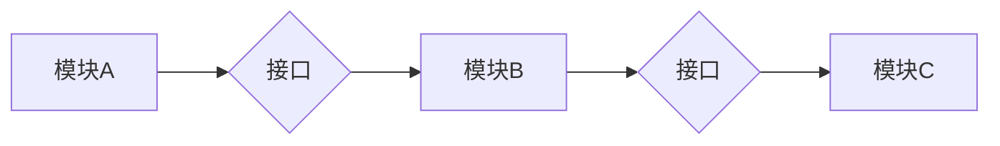

> 自由组合，人工智能，软件架构，代码生成，低代码平台，可编程性，自动化，创新

## 1. 背景介绍

在当今科技飞速发展的时代，软件和算法已经渗透到生活的方方面面。从智能手机到自动驾驶汽车，从医疗诊断到金融交易，软件的力量无处不在。然而，传统的软件开发模式面临着越来越多的挑战：

* **开发周期长:** 软件开发流程复杂，需要经历需求分析、设计、编码、测试等多个阶段，周期长，难以满足快速迭代的需求。
* **人才短缺:** 优秀的软件开发人才稀缺，而软件需求却日益增长，导致人才供不应求。
* **维护成本高:** 软件系统随着时间的推移，需要不断进行维护和更新，维护成本高昂。

为了解决这些问题，人们开始探索新的软件开发模式，其中“自由组合”的概念逐渐成为主流。

## 2. 核心概念与联系

“自由组合”是指利用现有的软件组件、模块和服务，通过灵活的连接和配置，快速构建新的软件系统。这种模式的核心在于：

* **模块化设计:** 将软件系统分解成独立的模块，每个模块具有特定的功能，可以独立开发和维护。
* **接口标准化:** 模块之间通过标准化的接口进行通信，保证模块之间的互操作性。
* **可重用性:** 模块可以被多个不同的系统重用，提高开发效率和代码质量。

**Mermaid 流程图:**



## 3. 核心算法原理 & 具体操作步骤

### 3.1  算法原理概述

自由组合的核心算法原理是基于**元编程**和**代码生成**技术。元编程是指使用程序来编写程序，可以动态地生成代码，从而实现对软件系统的灵活配置和定制。

### 3.2  算法步骤详解

1. **定义模块接口:** 首先需要定义每个模块的接口，包括输入参数、输出结果和通信协议。
2. **构建模块库:** 将各个模块打包成可重用的库，并提供相应的文档和示例代码。
3. **设计组合规则:** 根据业务需求，设计模块之间的组合规则，确定哪些模块需要连接，如何连接，以及如何传递数据。
4. **生成代码:** 利用元编程技术，根据组合规则，自动生成连接模块的代码。
5. **测试和部署:** 对生成的代码进行测试，确保其功能正确，然后部署到生产环境。

### 3.3  算法优缺点

**优点:**

* **提高开发效率:** 自动化代码生成，减少手动编码工作量。
* **降低开发成本:** 减少人力成本和开发周期。
* **提高代码质量:** 模块化设计和标准化接口，提高代码的可读性和可维护性。
* **增强可定制性:** 用户可以根据需求灵活组合模块，定制个性化的软件系统。

**缺点:**

* **依赖于模块库:** 需要丰富的模块库资源，才能实现自由组合。
* **组合规则复杂:** 设计合理的组合规则需要一定的经验和技巧。
* **代码可读性:** 自动生成的代码可能难以理解，需要进行适当的优化和注释。

### 3.4  算法应用领域

自由组合技术广泛应用于以下领域:

* **企业级软件开发:** 快速构建定制化的企业级应用系统。
* **移动应用开发:** 快速开发跨平台的移动应用。
* **数据分析和机器学习:** 快速构建数据分析和机器学习模型。
* **物联网应用:** 快速开发物联网设备的软件系统。

## 4. 数学模型和公式 & 详细讲解 & 举例说明

### 4.1  数学模型构建

自由组合可以抽象为一个图论模型，其中：

* 节点代表软件模块。
* 边代表模块之间的连接关系。

我们可以使用**图的邻接矩阵**来表示模块之间的连接关系，其中矩阵元素为1表示两个模块连接，为0表示不连接。

### 4.2  公式推导过程

假设我们有n个模块，可以构建一个n x n的邻接矩阵A，其中A[i][j]表示模块i和模块j之间的连接关系。

**连接度:** 模块i的连接度是指它与其他模块连接的个数，可以计算为：

$$
degree(i) = \sum_{j=1}^{n} A[i][j]
$$

**平均连接度:** 系统的平均连接度是指所有模块的连接度的平均值，可以计算为：

$$
average\_degree = \frac{1}{n} \sum_{i=1}^{n} degree(i)
$$

### 4.3  案例分析与讲解

假设我们有一个包含4个模块的系统，其邻接矩阵为：

$$
A = \begin{bmatrix}
0 & 1 & 0 & 1 \\
1 & 0 & 1 & 0 \\
0 & 1 & 0 & 1 \\
1 & 0 & 1 & 0
\end{bmatrix}
$$

模块1的连接度为3，模块2的连接度为2，模块3的连接度为2，模块4的连接度为2。系统的平均连接度为2.25。

## 5. 项目实践：代码实例和详细解释说明

### 5.1  开发环境搭建

本项目使用Python语言开发，需要安装以下软件：

* Python 3.x
* pip

### 5.2  源代码详细实现

```python
# 模块A
def module_a(input_data):
    # 模块A的业务逻辑
    return processed_data

# 模块B
def module_b(input_data):
    # 模块B的业务逻辑
    return processed_data

# 模块C
def module_c(input_data):
    # 模块C的业务逻辑
    return processed_data

# 组合模块
def combine_modules(module_a, module_b, module_c):
    # 连接模块并执行业务逻辑
    result = module_a(input_data)
    result = module_b(result)
    result = module_c(result)
    return result

# 示例代码
input_data = "example data"
result = combine_modules(module_a, module_b, module_c)
print(result)
```

### 5.3  代码解读与分析

* 模块A、模块B和模块C分别代表不同的软件模块，每个模块都有自己的业务逻辑。
* `combine_modules`函数负责连接模块并执行业务逻辑。
* 示例代码演示了如何使用`combine_modules`函数组合模块，并输出结果。

### 5.4  运行结果展示

运行上述代码，将输出模块组合后的结果。

## 6. 实际应用场景

自由组合技术在实际应用场景中具有广泛的应用前景：

### 6.1  企业级应用开发

企业可以利用自由组合技术快速构建定制化的企业级应用系统，例如CRM、ERP、OA等。

### 6.2  移动应用开发

开发人员可以使用现有的移动开发框架和组件，通过自由组合的方式快速开发跨平台的移动应用。

### 6.3  数据分析和机器学习

数据科学家可以使用现有的数据分析和机器学习库，通过自由组合的方式快速构建数据分析和机器学习模型。

### 6.4  未来应用展望

随着人工智能和云计算技术的不断发展，自由组合技术将更加成熟和完善，在更多领域得到应用。例如：

* **自动代码生成:** 利用人工智能技术，自动生成更复杂的代码，进一步提高开发效率。
* **低代码平台:** 基于自由组合技术的低代码平台，将使非程序员也能轻松构建软件系统。
* **智能软件架构:** 利用人工智能技术，自动设计和优化软件架构，提高软件系统的性能和可靠性。

## 7. 工具和资源推荐

### 7.1  学习资源推荐

* **书籍:**
    * 《软件架构》
    * 《设计模式》
    * 《敏捷软件开发》
* **在线课程:**
    * Coursera
    * Udemy
    * edX

### 7.2  开发工具推荐

* **IDE:**
    * Visual Studio Code
    * IntelliJ IDEA
    * Eclipse
* **代码生成工具:**
    * Swagger Codegen
    * OpenAPI Generator

### 7.3  相关论文推荐

* **论文:**
    * "Microservices: Architectural Style and Patterns"
    * "The Twelve-Factor App"
    * "Serverless Computing: One Step Further to Abstraction"

## 8. 总结：未来发展趋势与挑战

### 8.1  研究成果总结

自由组合技术为软件开发带来了新的思路和方法，提高了开发效率和代码质量，并为软件系统的定制化和个性化提供了新的可能性。

### 8.2  未来发展趋势

未来，自由组合技术将朝着以下方向发展：

* **更智能的代码生成:** 利用人工智能技术，自动生成更复杂的代码，并提供更智能的代码建议。
* **更丰富的模块库:** 构建更丰富的模块库，涵盖更多领域和功能。
* **更强大的组合规则引擎:** 开发更强大的组合规则引擎，支持更复杂的组合逻辑。

### 8.3  面临的挑战

自由组合技术也面临一些挑战：

* **模块质量:** 模块库的质量直接影响到自由组合的成功，需要建立完善的模块质量评估机制。
* **组合规则设计:** 设计合理的组合规则需要一定的经验和技巧，需要开发更易于使用的组合规则设计工具。
* **安全性和可靠性:** 自由组合的软件系统需要保证安全性和可靠性，需要开发相应的安全性和可靠性保障机制。

### 8.4  研究展望

未来，我们将继续研究自由组合技术，探索其在更多领域和应用场景的应用，并致力于解决其面临的挑战，推动软件开发模式的创新和发展。

## 9. 附录：常见问题与解答

### 9.1  常见问题

* **如何找到合适的模块库？**

* **如何设计合理的组合规则？**

* **如何保证自由组合的软件系统的安全性和可靠性？**

### 9.2  解答

* **如何找到合适的模块库？**

可以参考以下资源：

* **开源软件库:** GitHub, GitLab, Apache Software Foundation
* **商业软件平台:** AWS Marketplace, Azure Marketplace, Google Cloud Marketplace

* **如何设计合理的组合规则？**

需要根据业务需求和模块特性进行设计，可以参考以下原则：

* **清晰明确:** 组合规则应该清晰明确，易于理解和维护。
* **灵活可变:** 组合规则应该能够适应业务需求的变化。
* **安全可靠:** 组合规则应该保证软件系统的安全性和可靠性。

* **如何保证自由组合的软件系统的安全性和可靠性？**

可以采取以下措施：

* **模块安全审计:** 对模块进行安全审计，确保其安全性。
* **组合规则验证:** 对组合规则进行验证，确保其正确性和安全性。
* **系统测试:** 对组合后的软件系统进行全面测试，确保其可靠性。


作者：禅与计算机程序设计艺术 / Zen and the Art of Computer Programming 
<end_of_turn>