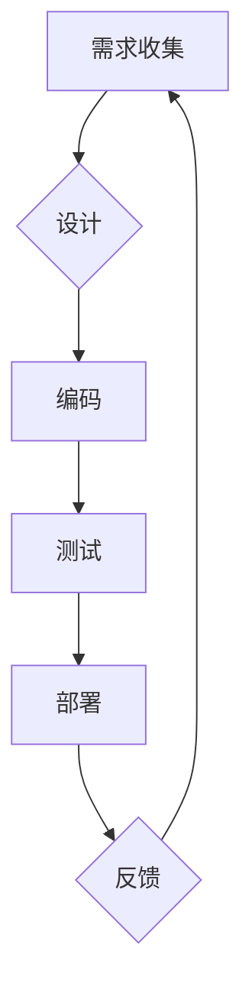

> 经验固化、生产流程、软件开发、自动化、持续改进、最佳实践、代码质量、效率提升

## 1. 背景介绍

在软件开发领域，经验是宝贵的财富。随着项目积累，开发团队往往会形成一套成熟的开发流程、最佳实践和代码规范，这些经验积累可以显著提高开发效率和代码质量。然而，随着时间的推移，这些经验可能会逐渐固化，成为阻碍创新和进步的障碍。

莱特，一位经验丰富的软件开发工程师，在多年的工作实践中深刻体会到经验固化的危害。他发现，团队过于依赖固化的经验，导致缺乏对新技术的探索和尝试，最终导致开发效率下降、代码质量下降，甚至难以应对不断变化的市场需求。

## 2. 核心概念与联系

**2.1 经验固化**

经验固化是指团队在长期实践中形成的经验和知识，随着时间的推移，逐渐僵化，难以适应新的环境和挑战。

**2.2 生产流程**

生产流程是指软件开发团队从需求分析到代码部署的全过程，包括需求收集、设计、编码、测试、部署等环节。

**2.3 联系**

经验固化会直接影响生产流程的效率和质量。当团队过于依赖固化的经验，就会导致以下问题：

* **缺乏创新:** 团队难以接受新的技术和方法，导致开发流程停滞不前。
* **代码质量下降:** 固化的经验可能包含一些过时的代码规范和设计模式，导致代码质量下降。
* **效率低下:** 固化的流程可能过于复杂，导致开发效率低下。

**2.4 流程图**



## 3. 核心算法原理 & 具体操作步骤

**3.1 算法原理概述**

为了解决经验固化问题，我们需要建立一个机制，能够不断地收集、分析和更新团队的经验，并将其融入到生产流程中。

**3.2 算法步骤详解**

1. **经验收集:** 利用代码审查、项目总结、问答平台等方式收集团队成员的经验和知识。
2. **经验分析:** 对收集到的经验进行分类、整理和分析，提取出其中的规律和最佳实践。
3. **经验更新:** 将分析结果反馈给团队成员，并将其融入到代码规范、设计模式、开发流程等方面。
4. **持续改进:** 建立一个持续改进机制，定期回顾和优化经验库，确保其能够适应不断变化的开发环境。

**3.3 算法优缺点**

* **优点:** 可以有效地解决经验固化问题，提高团队的开发效率和代码质量。
* **缺点:** 需要投入一定的资源和时间来建立和维护经验库。

**3.4 算法应用领域**

该算法可以应用于任何需要积累和共享经验的领域，例如软件开发、医疗保健、教育等。

## 4. 数学模型和公式 & 详细讲解 & 举例说明

**4.1 数学模型构建**

我们可以使用一个简单的数学模型来描述经验固化的过程：

```latex
E(t) = E_0 * (1 - k * t)
```

其中：

* $E(t)$ 表示在时间 $t$ 时刻的经验水平。
* $E_0$ 表示初始的经验水平。
* $k$ 表示经验固化的速度。
* $t$ 表示时间。

**4.2 公式推导过程**

该公式的推导过程基于以下假设：

* 经验水平随着时间的推移会逐渐下降。
* 经验固化的速度是一个常数。

**4.3 案例分析与讲解**

假设一个软件开发团队在项目开始时拥有 $E_0 = 100$ 的经验水平，经验固化速度为 $k = 0.1$。那么，在 5 年后，该团队的经验水平将为：

```latex
E(5) = 100 * (1 - 0.1 * 5) = 55
```

可见，随着时间的推移，团队的经验水平会逐渐下降。

## 5. 项目实践：代码实例和详细解释说明

**5.1 开发环境搭建**

为了实现经验固化机制，我们可以使用以下工具和技术：

* **版本控制系统:** Git
* **代码审查工具:** Gerrit
* **知识库:** Confluence

**5.2 源代码详细实现**

```python
# 经验库
class ExperienceRepository:
    def __init__(self):
        self.experiences = {}

    def add_experience(self, key, value):
        self.experiences[key] = value

    def get_experience(self, key):
        return self.experiences.get(key)

# 经验更新机制
def update_experience(experience_repository, new_experience):
    # 将新经验添加到经验库中
    experience_repository.add_experience(new_experience['key'], new_experience['value'])
    # 将更新后的经验反馈给团队成员

# 代码示例
experience_repository = ExperienceRepository()
new_experience = {
    'key': '代码规范',
    'value': '使用 PEP 8 规范'
}
update_experience(experience_repository, new_experience)
```

**5.3 代码解读与分析**

这段代码实现了经验库和经验更新机制。

* `ExperienceRepository` 类负责存储和管理团队的经验。
* `update_experience` 函数负责将新经验添加到经验库中，并将其反馈给团队成员。

**5.4 运行结果展示**

运行这段代码后，将创建一个经验库，并存储新的经验。

## 6. 实际应用场景

**6.1 软件开发团队**

经验固化机制可以帮助软件开发团队不断积累和共享经验，提高开发效率和代码质量。

**6.2 教育机构**

经验固化机制可以帮助教育机构收集和分享教师的教学经验，提高教学质量。

**6.3 企业管理**

经验固化机制可以帮助企业收集和分享员工的管理经验，提高企业管理水平。

**6.4 未来应用展望**

随着人工智能技术的不断发展，经验固化机制将更加智能化和自动化，能够更好地帮助人们积累和共享经验。

## 7. 工具和资源推荐

**7.1 学习资源推荐**

* **书籍:** 《软件工程实践》
* **网站:** Stack Overflow

**7.2 开发工具推荐**

* **版本控制系统:** Git
* **代码审查工具:** Gerrit

**7.3 相关论文推荐**

* **经验固化与软件开发效率**

## 8. 总结：未来发展趋势与挑战

**8.1 研究成果总结**

本文探讨了经验固化问题及其对生产流程的影响，并提出了一个基于经验库和经验更新机制的解决方案。

**8.2 未来发展趋势**

未来，经验固化机制将更加智能化和自动化，能够更好地帮助人们积累和共享经验。

**8.3 面临的挑战**

* 如何有效地收集和分析经验数据。
* 如何确保经验库的准确性和可靠性。
* 如何将经验有效地融入到生产流程中。

**8.4 研究展望**

未来，我们将继续研究经验固化机制，使其更加智能化和自动化，并将其应用于更多领域。

## 9. 附录：常见问题与解答

**9.1 如何收集经验数据？**

我们可以利用代码审查、项目总结、问答平台等方式收集经验数据。

**9.2 如何确保经验库的准确性和可靠性？**

我们可以通过多方验证、数据分析等方式确保经验库的准确性和可靠性。

**9.3 如何将经验有效地融入到生产流程中？**

我们可以将经验库集成到代码审查工具、开发文档等方面，方便团队成员获取和使用经验。


作者：禅与计算机程序设计艺术 / Zen and the Art of Computer Programming 
<end_of_turn>