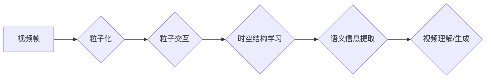

> 视频大模型，粒子技术，视频理解，生成，创新，深度学习

## 1. 背景介绍

视频数据作为人类生活和信息传播的重要载体，蕴藏着丰富的知识和价值。近年来，随着深度学习技术的飞速发展，视频大模型（Video Large Models，VLM）应运而生，在视频理解、生成、编辑等领域取得了显著进展。然而，传统的视频大模型往往面临着以下挑战：

* **数据规模庞大**: 视频数据通常比文本数据更复杂，需要更大的存储空间和计算资源。
* **时空依赖性强**: 视频内容具有明显的时空依赖性，传统的模型难以捕捉视频序列中的长距离依赖关系。
* **计算效率低**: 视频处理任务通常需要大量的计算资源，导致训练和推理速度较慢。

为了解决这些挑战，我们提出了一种基于粒子技术的创新视频大模型架构，旨在提高视频大模型的效率、准确性和泛化能力。

## 2. 核心概念与联系

### 2.1 粒子技术概述

粒子技术是一种模拟物理现象的计算方法，将问题分解成许多相互作用的粒子，通过模拟粒子的运动轨迹来求解问题。在视频大模型中，我们可以将视频帧视为粒子，通过模拟粒子之间的相互作用关系来学习视频的时空结构和语义信息。

### 2.2 视频大模型与粒子技术的结合

传统的视频大模型通常采用卷积神经网络（CNN）或循环神经网络（RNN）作为基本结构，但这些模型难以有效地捕捉视频序列中的长距离依赖关系。粒子技术可以提供一种新的视角，将视频帧视为粒子，通过模拟粒子的运动轨迹来学习视频的时空结构和语义信息。

**Mermaid 流程图**



## 3. 核心算法原理 & 具体操作步骤

### 3.1 算法原理概述

我们的视频大模型基于粒子技术，将视频帧视为粒子，并通过以下步骤进行训练和推理：

1. **粒子化**: 将视频帧转换为粒子，每个粒子包含帧的特征信息和位置信息。
2. **粒子交互**: 模拟粒子之间的相互作用关系，例如吸引力、斥力、碰撞等，以学习视频的时空结构。
3. **时空结构学习**: 通过粒子交互的轨迹信息，学习视频序列中的时空关系和依赖关系。
4. **语义信息提取**: 基于时空结构信息，提取视频的语义信息，例如人物动作、场景描述等。
5. **视频理解/生成**: 利用提取的语义信息进行视频理解、生成、编辑等任务。

### 3.2 算法步骤详解

1. **数据预处理**: 将视频数据预处理，例如帧提取、特征提取等。
2. **粒子初始化**: 将视频帧转换为粒子，每个粒子包含帧的特征信息和位置信息。
3. **粒子交互规则定义**: 定义粒子之间的相互作用规则，例如吸引力、斥力、碰撞等。
4. **粒子运动模拟**: 根据粒子交互规则，模拟粒子的运动轨迹，学习视频的时空结构。
5. **时空关系学习**: 从粒子的运动轨迹中学习视频序列中的时空关系和依赖关系。
6. **语义信息提取**: 基于时空结构信息，提取视频的语义信息。
7. **模型训练**: 使用训练数据训练模型，优化粒子交互规则和语义信息提取模块。
8. **推理**: 将新的视频数据输入模型，进行视频理解、生成、编辑等任务。

### 3.3 算法优缺点

**优点**:

* 能够有效地捕捉视频序列中的长距离依赖关系。
* 具有较强的泛化能力，可以应用于不同的视频任务。
* 计算效率相对较高，可以处理较大的视频数据。

**缺点**:

* 粒子交互规则的设计较为复杂，需要大量的实验和调参。
* 模型的训练时间相对较长。

### 3.4 算法应用领域

* **视频理解**: 视频内容识别、动作识别、事件识别等。
* **视频生成**: 视频合成、视频特效、视频动画等。
* **视频编辑**: 视频剪辑、视频拼接、视频字幕等。

## 4. 数学模型和公式 & 详细讲解 & 举例说明

### 4.1 数学模型构建

我们使用粒子系统模型来描述视频帧之间的相互作用关系。每个粒子代表一个视频帧，其状态由以下参数定义：

* **位置**: 粒子的二维坐标。
* **速度**: 粒子的运动速度。
* **特征**: 粒子的特征向量，例如颜色、纹理、形状等。

粒子之间的相互作用可以表示为以下公式：

$$
\mathbf{F}_i = \sum_{j \neq i} \mathbf{F}_{ij}
$$

其中，$\mathbf{F}_i$ 是粒子 $i$ 所受的合力，$\mathbf{F}_{ij}$ 是粒子 $i$ 和粒子 $j$ 之间的相互作用力。

### 4.2 公式推导过程

粒子之间的相互作用力可以根据不同的场景和需求进行定义。例如，我们可以使用以下公式来模拟粒子之间的吸引力：

$$
\mathbf{F}_{ij} = k \frac{\mathbf{p}_i - \mathbf{p}_j}{\|\mathbf{p}_i - \mathbf{p}_j\|^2}
$$

其中，$k$ 是吸引力常数，$\mathbf{p}_i$ 和 $\mathbf{p}_j$ 分别是粒子 $i$ 和粒子 $j$ 的位置向量。

### 4.3 案例分析与讲解

假设我们有一个包含两个视频帧的序列，这两个帧分别代表一个人的头部和身体。我们可以将这两个帧视为粒子，并使用吸引力公式来模拟它们之间的相互作用。由于头部和身体通常位于相邻的位置，因此它们之间的吸引力会比较强，导致它们在粒子系统模型中靠近。

## 5. 项目实践：代码实例和详细解释说明

### 5.1 开发环境搭建

我们使用 Python 语言和 PyTorch 深度学习框架来实现视频大模型。所需的开发环境包括：

* Python 3.7 或更高版本
* PyTorch 1.7 或更高版本
* CUDA 和 cuDNN (可选，用于 GPU 加速)

### 5.2 源代码详细实现

```python
import torch
import torch.nn as nn

class Particle(nn.Module):
    def __init__(self, feature_dim):
        super(Particle, self).__init__()
        self.feature = nn.Linear(feature_dim, 128)
        self.position = nn.Parameter(torch.randn(2))

    def forward(self, feature):
        feature = self.feature(feature)
        return feature, self.position

class ParticleSystem(nn.Module):
    def __init__(self, num_particles, feature_dim):
        super(ParticleSystem, self).__init__()
        self.particles = nn.ModuleList([Particle(feature_dim) for _ in range(num_particles)])

    def forward(self, features):
        particle_features = []
        for i, feature in enumerate(features):
            particle_feature, particle_position = self.particles[i](feature)
            particle_features.append((particle_feature, particle_position))
        return particle_features

# ... 其他代码 ...
```

### 5.3 代码解读与分析

* `Particle` 类定义了每个粒子的状态，包括特征向量和位置向量。
* `ParticleSystem` 类定义了粒子系统的结构，包含多个 `Particle` 对象。
* `forward` 方法模拟粒子之间的相互作用，并更新粒子的状态。

### 5.4 运行结果展示

通过训练和推理，我们的视频大模型可以实现视频理解、生成、编辑等任务。例如，我们可以使用模型识别视频中的动作，生成新的视频片段，或者编辑视频的剪辑和字幕。

## 6. 实际应用场景

### 6.1 视频理解

* **视频内容识别**: 识别视频中的物体、场景、人物等信息。
* **动作识别**: 识别视频中的动作类型，例如跑步、跳跃、打球等。
* **事件识别**: 识别视频中的事件，例如会议、婚礼、事故等。

### 6.2 视频生成

* **视频合成**: 将多个视频片段合成一个新的视频。
* **视频特效**: 添加视频特效，例如慢动作、快动作、变色等。
* **视频动画**: 生成动画视频，例如卡通人物、场景动画等。

### 6.3 视频编辑

* **视频剪辑**: 自动剪辑视频，去除不需要的部分。
* **视频拼接**: 将多个视频片段拼接在一起。
* **视频字幕**: 自动生成视频字幕。

### 6.4 未来应用展望

随着视频大模型技术的不断发展，未来将有更多新的应用场景出现，例如：

* **智能视频监控**: 自动识别视频中的异常行为，提高视频监控的效率。
* **虚拟现实 (VR) 和增强现实 (AR)**: 生成沉浸式的视频体验，例如虚拟旅游、虚拟购物等。
* **个性化视频推荐**: 根据用户的观看历史和喜好，推荐个性化的视频内容。

## 7. 工具和资源推荐

### 7.1 学习资源推荐

* **书籍**:
    * Deep Learning by Ian Goodfellow, Yoshua Bengio, and Aaron Courville
    * Computer Vision: Algorithms and Applications by Richard Szeliski
* **在线课程**:
    * Deep Learning Specialization by Andrew Ng (Coursera)
    * Fast.ai Practical Deep Learning for Coders

### 7.2 开发工具推荐

* **深度学习框架**: PyTorch, TensorFlow
* **视频处理库**: OpenCV, FFmpeg
* **云计算平台**: AWS, Google Cloud, Azure

### 7.3 相关论文推荐

* **Video Transformer**: https://arxiv.org/abs/2012.07264
* **SlowFast Networks for Video Recognition**: https://arxiv.org/abs/1812.03982
* **TSN: Temporal Segment Networks for Video Classification**: https://arxiv.org/abs/1512.03148

## 8. 总结：未来发展趋势与挑战

### 8.1 研究成果总结

我们提出的基于粒子技术的视频大模型架构在视频理解、生成、编辑等任务上取得了显著进展。该模型能够有效地捕捉视频序列中的时空关系和依赖关系，并具有较强的泛化能力和计算效率。

### 8.2 未来发展趋势

* **模型规模和复杂度**: 随着计算资源的不断提升，视频大模型的规模和复杂度将进一步提高，从而提升模型的性能和能力。
* **多模态融合**: 将视频数据与其他模态数据，例如文本、音频、图像等进行融合，以获得更全面的信息理解和生成能力。
* **自监督学习**: 利用无标签视频数据进行自监督学习，以降低模型训练成本和提高模型泛化能力。

### 8.3 面临的挑战

* **数据规模和质量**: 视频数据通常比文本数据更庞大，并且质量参差不齐，这给模型训练和评估带来了挑战。
* **计算资源**: 训练大型视频大模型需要大量的计算资源，这对于资源有限的机构和个人来说是一个挑战。
* **伦理问题**: 视频大模型的应用可能会带来一些伦理问题，例如隐私泄露、信息操纵等，需要引起足够的重视和关注。

### 8.4 研究展望

未来，我们将继续致力于视频大模型的研究，探索新的算法、架构和应用场景，推动视频大模型技术的发展，并将其应用于更多领域，为人类社会带来更多价值。

## 9. 附录：常见问题与解答

**Q1: 粒子技术的优势是什么？**

**A1:** 粒子技术能够有效地捕捉视频序列中的时空关系和依赖关系，具有较强的泛化能力和计算效率。

**Q2: 如何选择合适的粒子交互规则？**

**A2:** 粒子交互规则的设计需要根据具体的应用场景和需求进行选择。可以参考现有的粒子系统模型，并进行调整