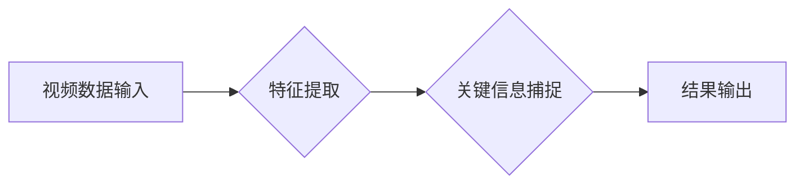

> 视频数据、关键信息捕捉、计算机视觉、深度学习、目标检测、动作识别、时间序列分析、信息提取

## 1. 背景介绍

随着互联网和移动设备的普及，视频数据正在以指数级速度增长。视频蕴含着丰富的视觉信息，是理解世界和获取知识的重要来源。然而，视频数据体积庞大，处理和分析视频数据面临着巨大的挑战。因此，如何有效地捕捉视频数据的关键信息，并将其转化为有价值的知识，成为一个重要的研究课题。

视频关键信息捕捉技术旨在从视频流中提取关键信息，例如目标检测、动作识别、场景理解等。这些关键信息可以用于多种应用场景，例如视频搜索、视频监控、视频剪辑、自动驾驶等。

## 2. 核心概念与联系

视频关键信息捕捉技术涉及多个领域，包括计算机视觉、深度学习、时间序列分析等。

**2.1 核心概念**

* **目标检测:**  识别视频中存在的物体，并对其进行定位和分类。
* **动作识别:**  识别视频中发生的特定动作，例如行走、跑步、跳跃等。
* **场景理解:**  理解视频中所呈现的场景，例如室内、室外、街道等。
* **时间序列分析:**  分析视频中的时间序列数据，例如物体运动轨迹、动作发生时间等。

**2.2 核心架构**



**2.3 核心技术**

* **深度学习:** 深度学习算法，例如卷积神经网络 (CNN) 和循环神经网络 (RNN)，在视频关键信息捕捉领域取得了显著的成果。
* **计算机视觉:** 计算机视觉技术，例如图像处理和特征提取，为视频关键信息捕捉提供了基础。
* **时间序列分析:** 时间序列分析方法，例如滑动窗口和动态时间规整，用于处理视频中的时间信息。

## 3. 核心算法原理 & 具体操作步骤

### 3.1  算法原理概述

视频关键信息捕捉算法通常分为以下几个步骤：

1. **视频预处理:** 对视频数据进行预处理，例如帧率调整、尺寸缩放、噪声去除等。
2. **特征提取:** 从视频帧中提取特征，例如颜色特征、纹理特征、形状特征等。
3. **关键信息捕捉:** 利用深度学习算法或其他算法，从提取的特征中捕捉关键信息，例如目标检测、动作识别、场景理解等。
4. **结果输出:** 将捕捉到的关键信息输出，例如目标位置、动作类别、场景描述等。

### 3.2  算法步骤详解

**3.2.1 视频预处理**

视频预处理旨在提高视频数据质量，并为后续算法提供更好的输入。常见的视频预处理方法包括：

* **帧率调整:** 将视频帧率调整到一个合适的水平，例如24fps或30fps。
* **尺寸缩放:** 将视频帧尺寸调整到一个标准的大小，例如640x480或1280x720。
* **噪声去除:** 使用滤波器去除视频帧中的噪声，例如椒盐噪声、高斯噪声等。

**3.2.2 特征提取**

特征提取是视频关键信息捕捉的关键步骤，旨在从视频帧中提取有意义的特征信息。常见的特征提取方法包括：

* **颜色特征:** 使用颜色直方图、颜色共现矩阵等方法提取视频帧的颜色特征。
* **纹理特征:** 使用纹理描述符，例如LBP、HOG等方法提取视频帧的纹理特征。
* **形状特征:** 使用形状描述符，例如轮廓特征、边界框等方法提取视频帧的形状特征。

**3.2.3 关键信息捕捉**

关键信息捕捉利用深度学习算法或其他算法，从提取的特征中捕捉关键信息。常见的关键信息捕捉算法包括：

* **目标检测:** 使用目标检测算法，例如YOLO、Faster R-CNN等，识别视频中存在的物体，并对其进行定位和分类。
* **动作识别:** 使用动作识别算法，例如C3D、TSN等，识别视频中发生的特定动作，例如行走、跑步、跳跃等。
* **场景理解:** 使用场景理解算法，例如ResNet、Inception等，理解视频中所呈现的场景，例如室内、室外、街道等。

**3.2.4 结果输出**

将捕捉到的关键信息输出，例如目标位置、动作类别、场景描述等。

### 3.3  算法优缺点

**优点:**

* **高精度:** 深度学习算法在视频关键信息捕捉领域取得了显著的成果，能够实现高精度的目标检测、动作识别、场景理解等。
* **自动化:** 视频关键信息捕捉算法能够自动提取关键信息，无需人工干预。
* **可扩展性:** 深度学习算法能够处理大规模视频数据，并可以根据需要进行扩展。

**缺点:**

* **计算资源需求高:** 深度学习算法训练和推理需要大量的计算资源。
* **数据依赖性强:** 深度学习算法需要大量的训练数据，否则性能会下降。
* **解释性差:** 深度学习算法的决策过程难以解释，难以理解算法是如何工作的。

### 3.4  算法应用领域

视频关键信息捕捉技术在多个领域都有广泛的应用，例如：

* **视频搜索:** 根据视频内容进行搜索，例如搜索特定物体、动作或场景的视频。
* **视频监控:** 监控视频流，识别异常行为，例如入侵、火灾等。
* **视频剪辑:** 自动剪辑视频，提取关键片段，例如精彩瞬间、重要信息等。
* **自动驾驶:** 识别道路上的物体，例如车辆、行人、交通信号灯等，辅助驾驶决策。
* **医疗诊断:** 分析医学影像视频，辅助医生诊断疾病。

## 4. 数学模型和公式 & 详细讲解 & 举例说明

### 4.1  数学模型构建

视频关键信息捕捉算法通常基于数学模型，例如卷积神经网络 (CNN) 和循环神经网络 (RNN)。

**4.1.1 卷积神经网络 (CNN)**

CNN 是一种专门用于处理图像和视频数据的深度学习算法。CNN 的核心结构是卷积层和池化层。卷积层使用卷积核对输入数据进行卷积运算，提取特征。池化层对卷积层的输出进行降维，减少计算量。

**4.1.2 循环神经网络 (RNN)**

RNN 是一种专门用于处理时间序列数据的深度学习算法。RNN 的核心结构是循环单元，能够记住过去的输入信息，并将其用于处理当前的输入信息。

### 4.2  公式推导过程

CNN 和 RNN 的数学公式推导过程比较复杂，这里只列举一些关键公式。

**4.2.1 卷积运算公式:**

$$
y(i,j) = \sum_{m=0}^{M-1} \sum_{n=0}^{N-1} x(i+m,j+n) * w(m,n)
$$

其中：

* $y(i,j)$ 是卷积层的输出值。
* $x(i,j)$ 是输入数据的像素值。
* $w(m,n)$ 是卷积核的权值。
* $M$ 和 $N$ 是卷积核的大小。

**4.2.2 池化运算公式:**

$$
y(i,j) = \max_{m=0}^{k-1} \max_{n=0}^{l-1} x(i*s+m,j*s+n)
$$

其中：

* $y(i,j)$ 是池化层的输出值。
* $x(i,j)$ 是池化层的输入值。
* $s$ 是池化窗口的大小。
* $k$ 和 $l$ 是池化窗口的大小。

**4.2.3 RNN 更新公式:**

$$
h_t = f(W_{hh}h_{t-1} + W_{xh}x_t + b_h)
$$

其中：

* $h_t$ 是时间步 $t$ 的隐藏状态。
* $f$ 是激活函数。
* $W_{hh}$ 是隐藏状态之间的权值矩阵。
* $W_{xh}$ 是输入和隐藏状态之间的权值矩阵。
* $x_t$ 是时间步 $t$ 的输入值。
* $b_h$ 是隐藏状态的偏置项。

### 4.3  案例分析与讲解

**4.3.1 目标检测案例分析:**

使用 YOLO 目标检测算法，从视频流中检测出行人、车辆等物体。

**4.3.2 动作识别案例分析:**

使用 C3D 动作识别算法，识别视频中发生的特定动作，例如行走、跑步、跳跃等。

## 5. 项目实践：代码实例和详细解释说明

### 5.1  开发环境搭建

* **操作系统:** Ubuntu 18.04
* **编程语言:** Python 3.6
* **深度学习框架:** TensorFlow 2.0
* **其他依赖库:** OpenCV, NumPy, Matplotlib

### 5.2  源代码详细实现

```python
import tensorflow as tf
from tensorflow.keras.models import Model
from tensorflow.keras.layers import Input, Conv2D, MaxPooling2D, Flatten, Dense

# 定义目标检测模型
input_tensor = Input(shape=(224, 224, 3))
x = Conv2D(32, (3, 3), activation='relu')(input_tensor)
x = MaxPooling2D((2, 2))(x)
x = Conv2D(64, (3, 3), activation='relu')(x)
x = MaxPooling2D((2, 2))(x)
x = Flatten()(x)
output_tensor = Dense(10, activation='softmax')(x)

model = Model(inputs=input_tensor, outputs=output_tensor)

# 编译模型
model.compile(optimizer='adam', loss='categorical_crossentropy', metrics=['accuracy'])

# 训练模型
model.fit(train_data, train_labels, epochs=10)

# 预测结果
predictions = model.predict(test_data)
```

### 5.3  代码解读与分析

* **模型定义:** 代码定义了一个简单的目标检测模型，包含卷积层、池化层和全连接层。
* **模型编译:** 使用 Adam 优化器、交叉熵损失函数和准确率指标编译模型。
* **模型训练:** 使用训练数据和标签训练模型。
* **模型预测:** 使用测试数据预测模型输出。

### 5.4  运行结果展示

运行代码后，可以得到模型的训练结果和预测结果。

## 6. 实际应用场景

### 6.1  视频搜索

视频搜索引擎可以使用视频关键信息捕捉技术，根据视频内容进行搜索，例如搜索特定物体、动作或场景的视频。

### 6.2  视频监控

视频监控系统可以使用视频关键信息捕捉技术，识别异常行为，例如入侵、火灾等，并及时报警。

### 6.3  视频剪辑

视频剪辑软件可以使用视频关键信息捕捉技术，自动剪辑视频，提取关键片段，例如精彩瞬间、重要信息等。

### 6.4  未来应用展望

视频关键信息捕捉技术在未来将有更广泛的应用，例如：

* **虚拟现实 (VR) 和增强现实 (AR):** 用于理解和交互虚拟环境。
* **机器人技术:** 用于帮助机器人理解和导航现实世界。
* **医疗诊断:** 用于辅助医生诊断疾病，并提供个性化治疗方案。

## 7. 工具和资源推荐

### 7.1  学习资源推荐

* **书籍:**
    * Deep Learning with Python by Francois Chollet
    * Computer Vision: Algorithms and Applications by Richard Szeliski
* **在线课程:**
    * Coursera: Deep Learning Specialization by Andrew Ng
    * Udacity: Intro to Computer Vision Nanodegree

### 7.2  开发工具推荐

* **深度学习框架:** TensorFlow, PyTorch,