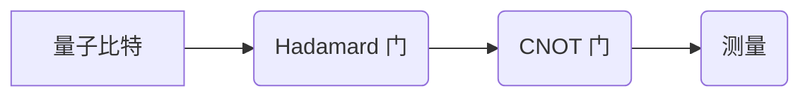

> 量子计算，量子算法，量子位，叠加态，纠缠态，量子门，量子线路，量子退火，量子机器学习

## 1. 背景介绍

随着传统计算机技术的发展逐渐接近物理极限，人们开始探索新的计算 paradigms。量子计算作为一种全新的计算模式，利用量子力学原理，拥有超越经典计算机的强大计算能力，被认为是未来计算领域的重要发展方向。

量子计算的核心在于利用量子力学中的叠加态和纠缠态等特性，构建量子比特（qubit）作为计算单元。与经典计算机的比特只能处于0或1状态不同，量子比特可以同时处于0和1的叠加态，从而实现并行计算，大幅提升计算效率。

## 2. 核心概念与联系

### 2.1 量子比特（Qubit）

量子比特是量子计算的基本单元，与经典计算机中的比特类似，但具有量子力学特性。

* **叠加态:** 量子比特可以同时处于0和1的叠加态，即$|ψ⟩ = α|0⟩ + β|1⟩$，其中α和β是复数，满足$|α|^2 + |β|^2 = 1$。
* **纠缠态:** 两个或多个量子比特可以纠缠在一起，这意味着它们的量子状态相互关联，即使它们相隔很远，测量一个量子比特的状态也能立即影响另一个量子比特的状态。

### 2.2 量子门（Quantum Gate）

量子门是量子计算中的逻辑操作，类似于经典计算机中的逻辑门，用于改变量子比特的状态。常见的量子门包括：

* **Hadamard 门 (H):** 将量子比特从$|0⟩$状态变换到$|ψ⟩ = (|0⟩ + |1⟩)/\sqrt{2}$状态。
* **CNOT 门 (Controlled-NOT):** 当控制量子比特处于|1⟩状态时，将目标量子比特从|0⟩状态变换到|1⟩状态，否则保持不变。

### 2.3 量子线路（Quantum Circuit）

量子线路是量子算法的执行流程，由一系列量子门和量子比特组成。量子线路的执行过程类似于经典计算机的指令执行，但量子计算的并行性和叠加性使得量子线路的计算效率更高。

**Mermaid 流程图**



## 3. 核心算法原理 & 具体操作步骤

### 3.1 算法原理概述

量子算法利用量子力学的特性，例如叠加态和纠缠态，来解决传统算法难以解决的问题。

* **叠加态:** 量子算法可以将多个计算路径同时进行，从而大幅提升计算效率。
* **纠缠态:** 量子算法可以利用纠缠态来实现信息共享和计算加速。

### 3.2 算法步骤详解

量子算法的具体步骤取决于具体的算法，但一般包括以下几个步骤：

1. **初始化量子比特:** 将量子比特置于初始状态。
2. **执行量子门:** 根据算法的逻辑，对量子比特执行一系列量子门操作。
3. **测量量子比特:** 测量量子比特的状态，得到计算结果。

### 3.3 算法优缺点

**优点:**

* 计算效率高，可以解决传统算法难以解决的问题。
* 具有并行计算能力，可以大幅缩短计算时间。

**缺点:**

* 量子硬件技术尚不成熟，难以构建大型量子计算机。
* 量子算法的开发难度较高，需要深入了解量子力学原理。

### 3.4 算法应用领域

量子算法的应用领域非常广泛，包括：

* **药物研发:** 模拟分子结构，加速药物设计。
* **材料科学:** 探索新材料，优化材料性能。
* **金融建模:** 优化投资策略，降低风险。
* **密码学:** 构建更安全的加密算法。

## 4. 数学模型和公式 & 详细讲解 & 举例说明

### 4.1 数学模型构建

量子计算的数学模型基于线性代数和量子力学。

* **量子态:** 量子态可以用一个复数向量来表示，例如$|ψ⟩ = α|0⟩ + β|1⟩$。
* **量子门:** 量子门可以用矩阵来表示，例如Hadamard门对应的矩阵为：

$$
H = \frac{1}{\sqrt{2}} \begin{pmatrix} 1 & 1 \\ 1 & -1 \end{pmatrix}
$$

### 4.2 公式推导过程

量子门操作可以看作对量子态的线性变换。例如，Hadamard门作用于$|0⟩$态，得到：

$$
H|0⟩ = \frac{1}{\sqrt{2}} \begin{pmatrix} 1 & 1 \\ 1 & -1 \end{pmatrix} \begin{pmatrix} 1 \\ 0 \end{pmatrix} = \frac{1}{\sqrt{2}} \begin{pmatrix} 1 \\ 1 \end{pmatrix} = |ψ⟩
$$

### 4.3 案例分析与讲解

**例子:**

使用CNOT门实现量子纠缠

1. 初始化两个量子比特，$|00⟩$。
2. 将第一个量子比特作为控制比特，第二个量子比特作为目标比特。
3. 执行CNOT门操作，得到纠缠态$|ψ⟩ = (|00⟩ + |11⟩)/\sqrt{2}$。

## 5. 项目实践：代码实例和详细解释说明

### 5.1 开发环境搭建

可以使用Qiskit、Cirq等量子计算框架进行开发。

### 5.2 源代码详细实现

```python
from qiskit import QuantumCircuit, Aer, execute

# 创建量子电路
qc = QuantumCircuit(2)

# 应用Hadamard门
qc.h(0)

# 应用CNOT门
qc.cx(0, 1)

# 测量量子比特
qc.measure_all()

# 模拟运行
simulator = Aer.get_backend('qasm_simulator')
job = execute(qc, simulator, shots=1024)
result = job.result()
counts = result.get_counts(qc)

# 打印结果
print(counts)
```

### 5.3 代码解读与分析

* `QuantumCircuit(2)` 创建一个包含两个量子比特的量子电路。
* `qc.h(0)` 应用Hadamard门于第一个量子比特。
* `qc.cx(0, 1)` 应用CNOT门，第一个量子比特作为控制比特，第二个量子比特作为目标比特。
* `qc.measure_all()` 测量所有量子比特的状态。
* `execute(qc, simulator, shots=1024)` 模拟运行量子电路，并获取测量结果。

### 5.4 运行结果展示

运行结果显示出量子比特处于纠缠态的概率分布。

## 6. 实际应用场景

### 6.1 量子退火

量子退火是一种用于求解优化问题的量子算法，可以用于解决各种现实世界问题，例如蛋白质折叠、物流优化等。

### 6.2 量子机器学习

量子机器学习利用量子计算的优势，提高机器学习算法的效率和性能。

### 6.3 量子密码学

量子密码学利用量子力学原理，构建更安全的加密算法，例如量子密钥分发协议。

### 6.4 未来应用展望

量子计算技术的发展将带来更多新的应用场景，例如：

* **药物研发:** 更快速、更精准的药物设计。
* **材料科学:** 探索新型材料，提高材料性能。
* **人工智能:** 构建更强大的人工智能系统。

## 7. 工具和资源推荐

### 7.1 学习资源推荐

* **Qiskit:** https://qiskit.org/
* **Cirq:** https://quantumai.google/cirq
* **PennyLane:** https://pennylane.ai/

### 7.2 开发工具推荐

* **IBM Quantum Experience:** https://quantum-computing.ibm.com/
* **Google Quantum AI:** https://quantumai.google/

### 7.3 相关论文推荐

* **Quantum Supremacy Using a Programmable Superconducting Processor:** https://arxiv.org/abs/1907.01293
* **Quantum Algorithms for Machine Learning:** https://arxiv.org/abs/1803.01046

## 8. 总结：未来发展趋势与挑战

### 8.1 研究成果总结

量子计算技术取得了长足的进步，从理论研究到实际应用，都取得了重要成果。

### 8.2 未来发展趋势

* **量子硬件的不断发展:** 量子比特的稳定性和可控性将得到进一步提升。
* **量子算法的不断创新:** 将开发出更多高效的量子算法，解决更复杂的问题。
* **量子计算的产业化发展:** 量子计算技术将应用于更多领域，推动产业发展。

### 8.3 面临的挑战

* **量子硬件的成本高昂:** 量子计算机的制造和维护成本仍然很高。
* **量子算法的开发难度大:** 需要深入了解量子力学原理和算法设计。
* **量子计算的安全性问题:** 需要研究量子计算对现有安全体系的影响，并构建新的安全机制。

### 8.4 研究展望

未来量子计算研究将继续深入，探索更深层次的量子现象，开发更强大的量子算法，并推动量子计算技术向实际应用领域迈进。

## 9. 附录：常见问题与解答

### 9.1 量子计算和经典计算的区别是什么？

量子计算利用量子力学原理，可以实现并行计算和叠加态，从而具有超越经典计算机的计算能力。

### 9.2 量子计算的应用领域有哪些？

量子计算的应用领域非常广泛，包括药物研发、材料科学、金融建模、密码学等。

### 9.3 量子计算技术目前处于什么阶段？

量子计算技术目前处于早期发展阶段，量子硬件技术尚不成熟，量子算法的开发难度较大。

### 9.4 量子计算的未来发展趋势是什么？

量子计算技术将继续发展，量子硬件将更加强大，量子算法将更加高效，量子计算将应用于更多领域。

作者：禅与计算机程序设计艺术 / Zen and the Art of Computer Programming


<end_of_turn>