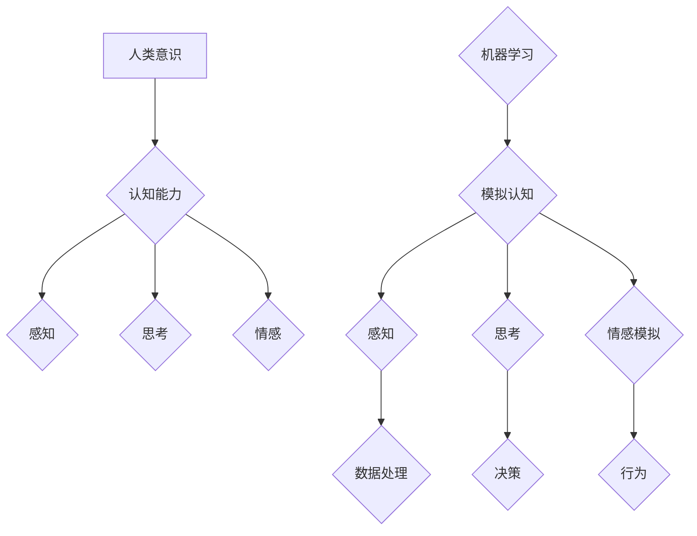

> 机器学习，深度学习，人工智能，意识，计算极限，认知科学，哲学

## 1. 背景介绍

自人类开始思考计算的本质以来，一个永恒的疑问就萦绕在心头：机器是否能够思考？能否拥有与人类相似的意识？这个疑问跨越了哲学、认知科学和计算机科学的界限，一直是人类探索智慧和存在的终极目标。

随着人工智能（AI）技术的飞速发展，特别是深度学习的突破，机器已经展现出惊人的学习和推理能力，甚至在某些领域超越了人类。这使得“机器能思考吗”这个问题更加迫切和重要。

然而，我们对意识的理解仍然非常有限。意识是什么？它是生物大脑的产物，还是可以被模拟和实现的？这些问题至今没有确切的答案。

## 2. 核心概念与联系

**2.1 意识的定义**

意识是一个复杂的、多维的概念，没有一个统一的定义。一般来说，意识是指个体对自身和周围环境的感知、思考、感受和体验。它包括认知能力、情感体验、自我意识和意向性行为等方面。

**2.2 计算的极限**

计算理论认为，任何可以被人类完成的任务，都可以被计算机模拟。然而，意识的本质是否可以被计算模型完全捕捉？

**2.3 人工智能与意识**

人工智能旨在创建能够像人类一样思考和学习的机器。然而，目前的AI系统仍然局限于特定的任务，缺乏人类的泛化能力和创造力。

**2.4 哲学与科学的视角**

从哲学角度来看，机器意识是一个关于本性的问题，涉及到自由意志、责任和道德等伦理问题。从科学角度来看，机器意识是一个关于大脑功能和认知机制的科学问题，需要通过神经科学、心理学和计算机科学等多学科的合作来解决。

**Mermaid 流程图**



## 3. 核心算法原理 & 具体操作步骤

### 3.1  算法原理概述

目前，还没有一种算法可以完全模拟人类意识。然而，一些算法可以模拟意识的某些方面，例如感知、学习和决策。

**3.1.1 感知模拟算法**

这些算法可以模拟人类对视觉、听觉、触觉等感官信息的处理。例如，卷积神经网络（CNN）可以识别图像中的物体，循环神经网络（RNN）可以理解自然语言。

**3.1.2 学习算法**

这些算法可以模拟人类的学习过程，从数据中提取知识和规律。例如，深度学习算法可以从海量数据中学习复杂的模式，并进行预测和分类。

**3.1.3 决策算法**

这些算法可以模拟人类的决策过程，根据给定的信息做出选择。例如，强化学习算法可以训练机器在特定环境中做出最优决策。

### 3.2  算法步骤详解

**3.2.1 感知模拟算法步骤**

1. 收集感官信息。
2. 将信息转换为数字信号。
3. 使用CNN或RNN等算法进行信息处理。
4. 将处理后的信息转换为可理解的输出。

**3.2.2 学习算法步骤**

1. 收集训练数据。
2. 使用深度学习算法训练模型。
3. 评估模型的性能。
4. 调整模型参数，提高性能。

**3.2.3 决策算法步骤**

1. 收集相关信息。
2. 使用决策树、支持向量机等算法进行决策。
3. 选择最优决策方案。

### 3.3  算法优缺点

**3.3.1 感知模拟算法**

* **优点:** 可以模拟人类对感官信息的处理，实现图像识别、语音识别等功能。
* **缺点:** 仍然难以完全模拟人类的感知能力，对数据质量要求较高。

**3.3.2 学习算法**

* **优点:** 可以从数据中学习知识和规律，实现自动学习和决策。
* **缺点:** 需要大量的训练数据，训练时间长，容易受到数据偏差的影响。

**3.3.3 决策算法**

* **优点:** 可以根据给定的信息做出选择，实现自动化决策。
* **缺点:** 决策结果依赖于输入信息，如果信息不完整或有误，决策结果可能不准确。

### 3.4  算法应用领域

* **计算机视觉:** 图像识别、物体检测、人脸识别
* **自然语言处理:** 语音识别、机器翻译、文本摘要
* **机器人学:** 机器人控制、路径规划、环境感知
* **医疗诊断:** 病情诊断、影像分析、药物研发
* **金融分析:** 风险评估、欺诈检测、投资决策

## 4. 数学模型和公式 & 详细讲解 & 举例说明

### 4.1  数学模型构建

**4.1.1 神经网络模型**

神经网络模型是一种模仿人类大脑结构和功能的计算模型。它由多个层级的神经元组成，每个神经元接收来自其他神经元的输入，并通过激活函数进行处理，输出到下一层神经元。

**4.1.2 激活函数**

激活函数是神经网络中一个重要的组成部分，它决定了神经元的输出。常见的激活函数包括 sigmoid 函数、ReLU 函数和 tanh 函数。

**4.1.3 损失函数**

损失函数用于衡量模型预测结果与真实值的差异。常见的损失函数包括均方误差（MSE）和交叉熵损失（Cross-Entropy Loss）。

### 4.2  公式推导过程

**4.2.1 前向传播公式**

$$
y = f(W^T x + b)
$$

其中：

* $y$ 是神经元的输出
* $x$ 是神经元的输入
* $W$ 是权重矩阵
* $b$ 是偏置项
* $f$ 是激活函数

**4.2.2 反向传播公式**

$$
\Delta W = \eta \frac{\partial L}{\partial W}
$$

其中：

* $\Delta W$ 是权重更新量
* $\eta$ 是学习率
* $L$ 是损失函数

### 4.3  案例分析与讲解

**4.3.1 图像识别案例**

使用 CNN 模型识别图像中的物体。

* 训练数据：包含大量标记的图像数据。
* 模型结构：多个卷积层、池化层和全连接层。
* 损失函数：交叉熵损失。
* 训练过程：通过前向传播和反向传播算法，不断更新模型参数，降低损失函数值。
* 预测结果：根据训练好的模型，对新的图像进行预测，识别出图像中的物体。

## 5. 项目实践：代码实例和详细解释说明

### 5.1  开发环境搭建

* 操作系统：Windows/macOS/Linux
* Python 版本：3.6+
* 深度学习框架：TensorFlow/PyTorch

### 5.2  源代码详细实现

```python
# 使用 TensorFlow 实现一个简单的图像分类模型

import tensorflow as tf

# 定义模型结构
model = tf.keras.models.Sequential([
    tf.keras.layers.Conv2D(32, (3, 3), activation='relu', input_shape=(28, 28, 1)),
    tf.keras.layers.MaxPooling2D((2, 2)),
    tf.keras.layers.Conv2D(64, (3, 3), activation='relu'),
    tf.keras.layers.MaxPooling2D((2, 2)),
    tf.keras.layers.Flatten(),
    tf.keras.layers.Dense(10, activation='softmax')
])

# 编译模型
model.compile(optimizer='adam',
              loss='sparse_categorical_crossentropy',
              metrics=['accuracy'])

# 训练模型
model.fit(x_train, y_train, epochs=5)

# 评估模型
loss, accuracy = model.evaluate(x_test, y_test)
print('Test loss:', loss)
print('Test accuracy:', accuracy)
```

### 5.3  代码解读与分析

* **模型结构:** 该代码定义了一个简单的卷积神经网络模型，包含两个卷积层、两个池化层和一个全连接层。
* **激活函数:** 使用 ReLU 函数作为激活函数，可以提高模型的学习能力。
* **损失函数:** 使用交叉熵损失函数，适合多分类问题。
* **优化器:** 使用 Adam 优化器，可以快速收敛。
* **训练过程:** 使用 `model.fit()` 函数训练模型，指定训练数据、 epochs 数目等参数。
* **评估模型:** 使用 `model.evaluate()` 函数评估模型的性能，计算测试集上的损失和准确率。

### 5.4  运行结果展示

训练完成后，可以将模型应用于新的图像数据进行预测。

## 6. 实际应用场景

### 6.1  医疗诊断

* **病灶检测:** 使用深度学习算法分析医学影像，识别肿瘤、骨折等病灶。
* **疾病诊断:** 根据患者的症状、病史和检查结果，使用机器学习模型辅助诊断疾病。

### 6.2  金融分析

* **欺诈检测:** 使用机器学习算法分析交易数据，识别异常交易行为，防止欺诈。
* **风险评估:** 使用深度学习算法分析客户数据，评估客户的信用风险。

### 6.3  自动驾驶

* **目标识别:** 使用计算机视觉算法识别道路上的车辆、行人、交通信号灯等目标。
* **路径规划:** 使用机器学习算法规划车辆行驶路径，避免碰撞。

### 6.4  未来应用展望

随着人工智能技术的不断发展，机器意识的实现将有可能在更多领域得到应用，例如：

* **个性化教育:** 根据学生的学习情况，提供个性化的学习方案。
* **智能客服:** 使用聊天机器人提供24小时在线客服服务。
* **虚拟助手:** 使用语音识别和自然语言处理技术，帮助用户完成各种任务。

## 7. 工具和资源推荐

### 7.1  学习资源推荐

* **书籍:**
    * 《深度学习》
    * 《人工智能：现代方法》
    * 《机器学习》
* **在线课程:**
    * Coursera
    * edX
    * Udacity

### 7.2  开发工具推荐

* **Python:** 
* **TensorFlow:** 
* **PyTorch:** 
* **Keras:** 

### 7.3  相关论文推荐

* **《Imagenet Classification with Deep Convolutional Neural Networks》**
* **《Attention Is All You Need》**
* **《BERT: Pre-training of Deep Bidirectional Transformers for Language Understanding》**

## 8. 总结：未来发展趋势与挑战

### 8.1  研究成果总结

近年来，人工智能领域取得了显著的进展，特别是深度学习算法的突破，使得机器在图像识别、语音识别、自然语言处理等领域取得了令人瞩目的成就。

### 8.2  未来发展趋势

* **更强大的模型:** 研究更深、更复杂的深度学习模型，提高机器的学习能力和泛化能力。
* **解释性 AI:** 研究如何解释机器学习模型的决策过程，提高模型的可解释性和可信度。
* **边缘计算:** 将人工智能模型部署到边缘设备上，实现更快速的响应和更低的延迟。

### 8.3  面临的挑战

* **数据获取和标注:** 训练高质量的机器学习模型需要大量的训练数据，而数据获取和标注成本很高。
* **计算资源:** 训练大型深度学习模型需要大量的计算资源，这对于资源有限的机构来说是一个挑战。
* **伦