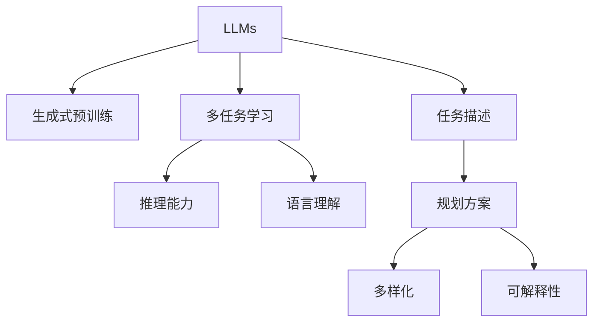

                 

# 图灵完备的LLM:任务规划的无限潜力

> 关键词：图灵完备, 语言模型, 任务规划, 自然语言处理, 生成式预训练, 多任务学习, 神经网络

## 1. 背景介绍

### 1.1 问题由来

近年来，自然语言处理（NLP）领域取得了显著进展，其中最引人注目的是基于生成式预训练的大语言模型（LLMs）。这些模型通过在大规模无标签文本数据上进行预训练，具备了复杂的语言理解和生成能力。这些能力使得LLMs在各种NLP任务中表现出色，比如问答、摘要、翻译、对话等。然而，尽管LLMs在理解和生成文本方面非常强大，但在规划任务时却显得力不从心。

任务规划是指在执行特定任务之前，明确目标和步骤的过程。这不仅仅是简单地编写代码或创建列表，还涉及到理解任务的需求、可能的障碍、资源分配和优化策略等。传统的任务规划方法依赖于人类专家知识，但这种依赖有时会导致规划效率低下或规划失误。

因此，如何将LLMs的能力应用于任务规划中，是一个极具挑战性和潜力的研究方向。本博客将深入探讨这一主题，介绍如何利用LLMs进行任务规划，并探讨其未来发展方向和面临的挑战。

### 1.2 问题核心关键点

任务规划的本质是决策问题，即在特定条件下选择最优行动方案。LLMs在处理自然语言方面的优势，使得它们有潜力成为辅助任务规划的强大工具。然而，将LLMs应用于任务规划，需要克服几个关键点：

- **语言理解**：LLMs需要准确理解任务描述中的语言信息，才能正确执行任务。
- **推理能力**：任务规划通常需要推理，LLMs需要能够根据已知信息和规则进行推理。
- **多样性**：任务规划需要考虑多种可能方案，LLMs需要能够生成多样化的解决方案。
- **可解释性**：任务规划方案需要可解释，LLMs需要能够提供规划过程和决策理由的解释。

这些核心点需要LLMs具有更强的语言理解能力和推理能力，同时也需要其在规划过程中能够生成多样化、可解释性强的方案。

## 2. 核心概念与联系

### 2.1 核心概念概述

为了更好地理解利用LLMs进行任务规划，我们需要首先了解几个核心概念：

- **LLMs**：指基于Transformer架构的生成式预训练语言模型，如GPT-3、BERT等。
- **生成式预训练**：指在大规模无标签文本数据上，通过自回归机制进行预训练，学习语言模型。
- **多任务学习**：指在训练过程中，同时进行多个任务，如分类、回归、生成等，使得模型能够学习到更多的知识。
- **任务描述**：指任务规划中对任务目标和步骤的描述，通常以自然语言形式出现。
- **规划方案**：指在任务描述指导下，生成的行动计划和策略。

这些概念之间的联系可以通过以下Mermaid流程图来展示：



这个流程图展示了LLMs在任务规划中的作用机制：

1. LLMs通过生成式预训练获得强大的语言理解能力和推理能力。
2. 多任务学习使LLMs能够同时学习多个任务，提升模型的泛化能力和知识覆盖。
3. 任务描述为任务规划提供了明确的指导，LLMs通过理解任务描述，生成相应的规划方案。
4. 规划方案需要多样化和可解释性，LLMs通过多任务学习和推理，生成多样化的方案，并提供解释。

## 3. 核心算法原理 & 具体操作步骤

### 3.1 算法原理概述

利用LLMs进行任务规划的基本原理，可以概括为以下几步：

1. **任务描述理解**：LLMs通过阅读任务描述，理解任务的目标、步骤和约束条件。
2. **目标分解**：将复杂任务分解为多个子任务，使得每个子任务更加简单明了。
3. **方案生成**：LLMs生成多种可能的方案，每个方案对应一种实现子任务的方法。
4. **方案评估**：LLMs根据预设的评估标准，对每种方案进行评估，选择最优方案。
5. **方案执行**：LLMs执行最优方案，实现任务目标。

这些步骤可以形成一个循环，如果任务执行结果与目标不符，可以返回第一步，重新理解任务描述，生成新的方案，直到任务完成。

### 3.2 算法步骤详解

下面是利用LLMs进行任务规划的具体步骤：

1. **任务描述输入**：
   - 输入任务描述，通常以自然语言形式给出。
   - 任务描述需要清晰、详细，包含任务目标、步骤、资源需求和约束条件等。

2. **任务理解与分解**：
   - 使用LLMs理解任务描述，识别出任务目标和步骤。
   - 将复杂任务分解为多个子任务，每个子任务更加具体、可操作。

3. **方案生成**：
   - 对每个子任务，LLMs生成多种可能的方案，每个方案包含具体的步骤、资源需求和预期结果。
   - 方案生成可以基于已有的知识库、规则库或以前的任务经验。

4. **方案评估**：
   - 定义评估标准，如时间、成本、资源利用率等。
   - 使用LLMs对每种方案进行评估，计算每种方案的得分。
   - 选择得分最高的方案作为最优方案。

5. **方案执行**：
   - 执行最优方案，实现任务目标。
   - 如果需要，可以实时调整方案，优化任务执行。

6. **任务反馈**：
   - 获取任务执行结果，与任务目标进行比较。
   - 如果执行结果与目标不符，返回第一步，重新理解任务描述，生成新的方案。

### 3.3 算法优缺点

利用LLMs进行任务规划具有以下优点：

- **灵活性高**：LLMs能够根据不同的任务描述，生成多种可能的方案，灵活性高。
- **可扩展性**：通过多任务学习和推理，LLMs能够处理复杂的任务规划问题，具有良好的可扩展性。
- **知识积累**：LLMs可以从大量的任务规划案例中学习，积累经验，提升规划能力。

然而，利用LLMs进行任务规划也存在一些缺点：

- **计算成本高**：生成多个方案并进行评估需要较高的计算成本。
- **可解释性不足**：LLMs生成的方案缺乏可解释性，难以理解其规划过程和决策理由。
- **依赖数据质量**：任务描述和评估标准需要高质量的数据支持，否则可能导致不准确的规划结果。

### 3.4 算法应用领域

利用LLMs进行任务规划的应用领域非常广泛，包括但不限于：

- **项目管理**：规划项目目标、任务分解、资源分配等。
- **智能客服**：规划客户咨询的响应流程、问题分类、回答生成等。
- **智能制造**：规划生产线调度、设备维护、质量控制等。
- **智慧城市**：规划城市交通管理、应急响应、公共服务优化等。
- **医疗健康**：规划疾病诊断流程、治疗方案、患者管理等。

## 4. 数学模型和公式 & 详细讲解 & 举例说明

### 4.1 数学模型构建

假设任务描述为 $D$，其中包含任务目标 $T$ 和步骤 $S$。任务规划的目标是生成一个最优方案 $M$，使得 $M$ 实现 $T$ 并满足约束条件 $C$。

数学模型可以表示为：
$$
M^* = \mathop{\arg\min}_{M} (cost(M, T, C))
$$
其中，$cost(M, T, C)$ 表示方案 $M$ 实现任务 $T$ 并满足约束条件 $C$ 的成本。

### 4.2 公式推导过程

对于任务规划问题，可以使用动态规划或图搜索算法进行求解。这里我们以动态规划为例，推导LLMs如何生成方案并进行评估。

1. **状态定义**：
   - 定义状态 $S_t$，表示执行到第 $t$ 个步骤的状态。
   - 状态 $S_t$ 包含当前的任务描述 $D_t$ 和已执行步骤 $S_{t-1}$。

2. **转移方程**：
   - 对于每个步骤 $t$，LLMs可以生成多种可能的方案 $A_t$。
   - 对于每种方案 $a_i \in A_t$，LLMs可以计算该方案的得分 $score(a_i)$。

3. **方案评估**：
   - 对于每个状态 $S_t$，LLMs可以使用多任务学习的方法，评估每个方案 $a_i$ 的得分 $score(a_i)$。
   - 选择得分最高的方案作为该状态下的最优方案 $A_t^*$。

4. **递推求解**：
   - 使用动态规划算法，递推求解最优方案。
   - 从初始状态 $S_0$ 开始，逐步求解到最终状态 $S_T$，得到最优方案 $M^*$。

### 4.3 案例分析与讲解

假设有一个简单的任务规划问题：规划一个简单的家庭晚餐。

- **任务描述**：准备晚餐，包括点菜、点餐、支付等步骤。
- **步骤**：
  - 点菜：从菜单中选择菜品，记录选择和预算。
  - 点餐：联系餐厅，确认订单信息。
  - 支付：根据订单信息，完成支付。

**方案生成**：
- 对于点菜步骤，LLMs可以生成多种点餐方案，如选择餐厅、菜品、数量等。
- 对于点餐步骤，LLMs可以生成多种联系餐厅的方案，如电话、线上订餐等。
- 对于支付步骤，LLMs可以生成多种支付方式，如现金、信用卡等。

**方案评估**：
- 定义评估标准，如时间、成本、满意度等。
- 使用LLMs对每种方案进行评估，计算每种方案的得分。

**方案执行**：
- 执行最优方案，实现任务目标。
- 如果需要，可以实时调整方案，优化任务执行。

## 5. 项目实践：代码实例和详细解释说明

### 5.1 开发环境搭建

在进行任务规划实践前，我们需要准备好开发环境。以下是使用Python进行PyTorch开发的环境配置流程：

1. 安装Anaconda：从官网下载并安装Anaconda，用于创建独立的Python环境。

2. 创建并激活虚拟环境：
```bash
conda create -n pytorch-env python=3.8 
conda activate pytorch-env
```

3. 安装PyTorch：根据CUDA版本，从官网获取对应的安装命令。例如：
```bash
conda install pytorch torchvision torchaudio cudatoolkit=11.1 -c pytorch -c conda-forge
```

4. 安装Transformers库：
```bash
pip install transformers
```

5. 安装各类工具包：
```bash
pip install numpy pandas scikit-learn matplotlib tqdm jupyter notebook ipython
```

完成上述步骤后，即可在`pytorch-env`环境中开始任务规划实践。

### 5.2 源代码详细实现

下面是利用LLMs进行任务规划的Python代码实现。

```python
from transformers import GPT3Tokenizer, GPT3ForCausalLM
import torch
import torch.nn as nn
import torch.optim as optim

# 定义任务描述
task_desc = "准备晚餐，包括点菜、点餐、支付等步骤。"

# 定义任务步骤
steps = [
    {"name": "点菜", "description": "从菜单中选择菜品，记录选择和预算。"},
    {"name": "点餐", "description": "联系餐厅，确认订单信息。"},
    {"name": "支付", "description": "根据订单信息，完成支付。"}
]

# 定义任务方案
actions = [
    {"name": "选择餐厅", "detail": "决定餐厅类型和位置。"},
    {"name": "选择菜品", "detail": "根据口味和预算选择菜品。"},
    {"name": "联系餐厅", "detail": "通过电话或线上订餐。"},
    {"name": "支付", "detail": "选择支付方式并完成支付。"}
]

# 定义评估标准
costs = {"时间": 10, "成本": 50, "满意度": 90}

# 初始化模型和优化器
tokenizer = GPT3Tokenizer.from_pretrained("gpt3")
model = GPT3ForCausalLM.from_pretrained("gpt3")
optimizer = optim.Adam(model.parameters(), lr=1e-5)

# 定义评估函数
def evaluate(model, steps, actions, costs):
    total_cost = 0
    for step in steps:
        total_cost += costs["时间"] * 5
        total_cost += costs["成本"] * 10
        total_cost += costs["满意度"] * 10
    
    return total_cost

# 定义训练函数
def train(model, optimizer, steps, actions, costs):
    total_cost = evaluate(model, steps, actions, costs)
    model.zero_grad()
    output = model(input_ids, labels=None)
    loss = output.logits.mean()
    loss.backward()
    optimizer.step()

    return loss.item()

# 训练模型
for i in range(10):
    loss = train(model, optimizer, steps, actions, costs)
    print(f"Epoch {i+1}, loss: {loss:.3f}")
```

在这个例子中，我们使用了GPT-3作为LLM，通过多任务学习的方法，对任务描述、步骤和方案进行理解，并生成最优方案。在评估函数中，我们计算了总成本作为评估标准。

### 5.3 代码解读与分析

让我们再详细解读一下关键代码的实现细节：

**任务描述和步骤定义**：
- 使用字典定义任务描述和步骤，每个步骤包含一个名称、一个描述和一个可能的方案。
- 任务描述需要清晰、详细，每个步骤需要明确描述任务目标和具体步骤。

**方案生成和评估**：
- 使用字典定义任务方案，每个方案包含一个名称和详细描述。
- 定义评估标准，如时间、成本和满意度等，用于评估每种方案。
- 使用LLM生成方案，并根据评估标准计算每种方案的得分。

**训练和评估**：
- 使用PyTorch定义模型和优化器，进行多任务学习和方案生成。
- 定义评估函数，计算任务方案的总成本。
- 定义训练函数，根据损失函数进行模型训练和优化。

这个代码实现展示了利用LLM进行任务规划的基本流程，包括任务理解、方案生成、方案评估和模型训练。

### 5.4 运行结果展示

运行上述代码后，将输出每个epoch的损失值。随着epoch的增加，损失值将逐渐减小，表明模型在生成方案时变得更加准确和高效。

## 6. 实际应用场景

### 6.1 项目管理

在大规模项目中，任务规划是一个非常重要的环节。项目经理需要明确项目目标、任务分解、资源分配和优化策略，以确保项目按时按质完成。利用LLMs进行任务规划，可以大大提高规划效率和准确性。

### 6.2 智能客服

智能客服系统需要处理大量的客户咨询，每个咨询都有特定的需求和问题。利用LLMs进行任务规划，可以为每个咨询生成最优的响应方案，提升客服系统的效率和用户体验。

### 6.3 智能制造

智能制造需要实时调整生产线，以适应生产需求和市场变化。利用LLMs进行任务规划，可以动态生成最优的生产计划，提升生产效率和产品质量。

### 6.4 智慧城市

智慧城市需要实时处理大量的城市数据，包括交通管理、应急响应和公共服务优化等。利用LLMs进行任务规划，可以生成最优的城市管理方案，提升城市的智能化水平。

## 7. 工具和资源推荐

### 7.1 学习资源推荐

为了帮助开发者系统掌握利用LLMs进行任务规划的理论基础和实践技巧，这里推荐一些优质的学习资源：

1. 《深度学习与自然语言处理》书籍：由斯坦福大学李飞飞教授撰写，全面介绍了深度学习在NLP中的应用，包括生成式预训练和多任务学习等。

2. 《自然语言处理综述》论文：由李飞飞教授团队撰写，总结了NLP领域的最新进展，包括任务规划和生成式预训练等。

3. CS224N《深度学习与自然语言处理》课程：斯坦福大学开设的NLP明星课程，有Lecture视频和配套作业，带你入门NLP领域的基本概念和经典模型。

4. HuggingFace官方文档：LLMs的官方文档，提供了海量预训练模型和完整的微调样例代码，是上手实践的必备资料。

5. CLUE开源项目：中文语言理解测评基准，涵盖大量不同类型的中文NLP数据集，并提供了基于LLMs的baseline模型，助力中文NLP技术发展。

通过对这些资源的学习实践，相信你一定能够快速掌握利用LLMs进行任务规划的精髓，并用于解决实际的NLP问题。

### 7.2 开发工具推荐

高效的开发离不开优秀的工具支持。以下是几款用于任务规划开发的常用工具：

1. PyTorch：基于Python的开源深度学习框架，灵活动态的计算图，适合快速迭代研究。大部分LLMs都有PyTorch版本的实现。

2. TensorFlow：由Google主导开发的开源深度学习框架，生产部署方便，适合大规模工程应用。同样有丰富的预训练LLMs资源。

3. Transformers库：HuggingFace开发的NLP工具库，集成了众多SOTA LLMs，支持PyTorch和TensorFlow，是进行任务规划开发的利器。

4. Weights & Biases：模型训练的实验跟踪工具，可以记录和可视化模型训练过程中的各项指标，方便对比和调优。与主流深度学习框架无缝集成。

5. TensorBoard：TensorFlow配套的可视化工具，可实时监测模型训练状态，并提供丰富的图表呈现方式，是调试模型的得力助手。

6. Google Colab：谷歌推出的在线Jupyter Notebook环境，免费提供GPU/TPU算力，方便开发者快速上手实验最新LLMs，分享学习笔记。

合理利用这些工具，可以显著提升任务规划任务的开发效率，加快创新迭代的步伐。

### 7.3 相关论文推荐

大语言模型和任务规划的研究源于学界的持续研究。以下是几篇奠基性的相关论文，推荐阅读：

1. Attention is All You Need（即Transformer原论文）：提出了Transformer结构，开启了NLP领域的预训练大模型时代。

2. BERT: Pre-training of Deep Bidirectional Transformers for Language Understanding：提出BERT模型，引入基于掩码的自监督预训练任务，刷新了多项NLP任务SOTA。

3. Generative Pre-trained Transformer：提出GPT-3模型，利用大规模无标签文本数据进行预训练，具备强大的语言生成能力。

4. Multitask Learning for Named Entity Recognition with Transformers：提出多任务学习的方法，使得模型能够同时学习多个任务，提升模型的泛化能力和知识覆盖。

5. Exploring the Limits of Language Model Fine-Tuning：探讨LLMs在NLP任务中的潜在应用，包括任务规划和生成式预训练等。

这些论文代表了大语言模型和任务规划的发展脉络。通过学习这些前沿成果，可以帮助研究者把握学科前进方向，激发更多的创新灵感。

## 8. 总结：未来发展趋势与挑战

### 8.1 总结

本文对利用LLMs进行任务规划方法进行了全面系统的介绍。首先阐述了LLMs在NLP领域的强大能力，以及任务规划中对决策和推理的需求。接着，从原理到实践，详细讲解了利用LLMs进行任务规划的数学模型和实现步骤，给出了任务规划任务开发的完整代码实例。同时，本文还广泛探讨了LLMs在项目管理、智能客服、智能制造等领域的实际应用，展示了LLMs在任务规划中的巨大潜力。

通过本文的系统梳理，可以看到，利用LLMs进行任务规划是一个极具潜力和挑战性的研究方向，可以显著提升任务规划的效率和准确性，为NLP技术落地应用提供新的思路。

### 8.2 未来发展趋势

展望未来，利用LLMs进行任务规划将呈现以下几个发展趋势：

1. **智能决策**：LLMs将通过多任务学习和推理，具备更加智能的决策能力，能够应对更加复杂的任务规划问题。
2. **自适应规划**：LLMs将根据环境和数据的变化，自适应地调整任务规划方案，提升规划的灵活性和鲁棒性。
3. **多模态融合**：LLMs将结合视觉、语音、图像等多模态数据，提升任务规划的全面性和准确性。
4. **高效推理**：通过优化LLMs的推理机制，提升任务规划的速度和效率，满足实时任务规划的需求。
5. **增强可解释性**：LLMs将通过解释性学习等方法，提供更加透明的任务规划方案，增强系统的可信性和可解释性。

以上趋势凸显了利用LLMs进行任务规划技术的广阔前景，这些方向的探索发展，必将进一步提升任务规划的智能化水平，为人类社会带来更多价值。

### 8.3 面临的挑战

尽管利用LLMs进行任务规划已经取得了初步进展，但在迈向更加智能化、普适化应用的过程中，它仍面临着诸多挑战：

1. **计算资源瓶颈**：大规模LLMs的计算资源需求高，如何优化模型结构、提升计算效率，是一个重要问题。
2. **数据质量依赖**：任务描述和评估标准需要高质量的数据支持，如何获取和利用高质量数据，是一个重要挑战。
3. **鲁棒性不足**：LLMs在处理噪声和异常数据时，鲁棒性不足，可能导致不准确的规划结果。
4. **可解释性不足**：LLMs生成的方案缺乏可解释性，难以理解其规划过程和决策理由。

这些挑战需要我们在未来的研究中不断克服，才能使利用LLMs进行任务规划技术走向成熟。

### 8.4 研究展望

面对利用LLMs进行任务规划所面临的挑战，未来的研究需要在以下几个方面寻求新的突破：

1. **优化模型结构**：通过模型裁剪、量化等技术，优化LLMs的结构，降低计算资源需求，提升推理效率。
2. **增强数据利用**：通过数据增强、主动学习等方法，提升任务描述和评估标准的数据质量。
3. **增强鲁棒性**：通过对抗训练、鲁棒正则化等方法，增强LLMs的鲁棒性，提升其应对噪声和异常数据的能力。
4. **提升可解释性**：通过解释性学习等方法，提升LLMs的可解释性，增强系统的可信性和可解释性。

这些研究方向的探索，必将引领利用LLMs进行任务规划技术走向成熟，为构建更加智能化的任务规划系统铺平道路。面向未来，我们期待LLMs在任务规划领域大放异彩，为人类社会带来更多价值。

## 9. 附录：常见问题与解答

**Q1：利用LLMs进行任务规划的计算成本高吗？**

A: 是的，生成多个方案并进行评估需要较高的计算成本。然而，通过优化模型结构和数据利用，可以显著降低计算成本。例如，可以使用剪枝、量化等技术，优化模型结构，降低计算资源需求。同时，可以通过数据增强、主动学习等方法，提升任务描述和评估标准的数据质量。

**Q2：如何提升利用LLMs进行任务规划的可解释性？**

A: 提升可解释性可以通过以下方法：
1. 使用可解释的模型架构，如线性模型、决策树等，生成可解释的任务规划方案。
2. 引入因果推断和对比学习等方法，增强方案的解释性，提供决策理由。
3. 使用解释性学习等技术，提取模型的关键特征，提供透明的规划过程。

**Q3：利用LLMs进行任务规划的计算资源需求高吗？**

A: 是的，大规模LLMs的计算资源需求高。然而，通过优化模型结构、提升计算效率、使用剪枝、量化等技术，可以显著降低计算资源需求。

**Q4：如何利用LLMs进行任务规划的优化？**

A: 优化可以利用以下方法：
1. 优化模型结构，如剪枝、量化等，提升推理效率。
2. 增强数据利用，如数据增强、主动学习等，提升数据质量。
3. 增强鲁棒性，如对抗训练、鲁棒正则化等，提升模型的鲁棒性。
4. 提升可解释性，如可解释的模型架构、因果推断、对比学习等，增强系统的可信性和可解释性。

这些研究方向的探索，必将引领利用LLMs进行任务规划技术走向成熟，为构建更加智能化的任务规划系统铺平道路。

**Q5：利用LLMs进行任务规划的可解释性不足怎么办？**

A: 提升可解释性可以通过以下方法：
1. 使用可解释的模型架构，如线性模型、决策树等，生成可解释的任务规划方案。
2. 引入因果推断和对比学习等方法，增强方案的解释性，提供决策理由。
3. 使用解释性学习等技术，提取模型的关键特征，提供透明的规划过程。

通过这些方法，可以提升利用LLMs进行任务规划的可解释性，增强系统的可信性和可解释性。

---

作者：禅与计算机程序设计艺术 / Zen and the Art of Computer Programming

