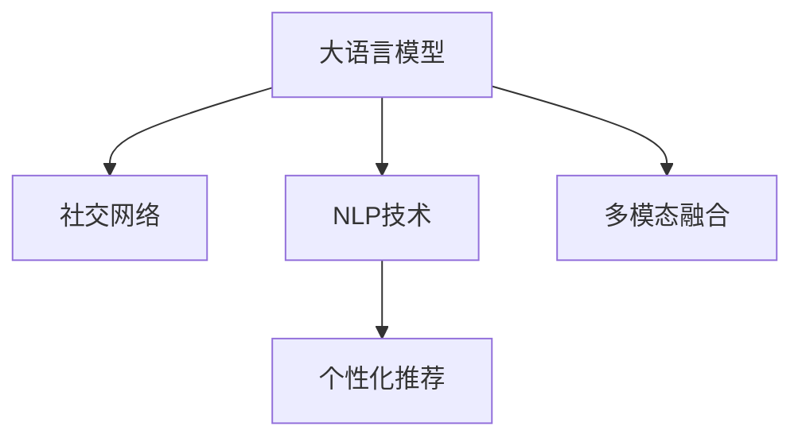

                 

# 在线社交与 LLM：全球连接、有意义的互动

> 关键词：在线社交, 大语言模型, 社交网络, 深度学习, 自然语言处理, 个性化推荐, 全球连接, 有意义的互动

## 1. 背景介绍

### 1.1 问题由来
随着互联网技术的不断进步，社交网络成为了全球人们沟通交流的重要平台。传统的社交网络主要通过文字、图片等形式进行信息传递，但这种单一的信息形式往往难以充分表达情感和复杂信息。近年来，随着大语言模型(Large Language Model, LLM)的兴起，社交网络也开始尝试引入自然语言处理(Natural Language Processing, NLP)技术，通过更加丰富、细致的语言表达形式，提升社交互动的质量和深度。

在实际应用中，大语言模型已被广泛用于社交网络中的聊天机器人、内容推荐、文本分析等场景。例如，Facebook等社交平台已经集成大语言模型，用于改善自动回复、推荐系统等功能，提升用户体验。Google的Dialogflow和Microsoft的Azure Bot Service等聊天机器人平台，更是依赖大语言模型提供智能对话体验。此外，Twitter等社交媒体平台也在探索利用大语言模型改进推荐算法，提升用户粘性。

### 1.2 问题核心关键点
大语言模型在社交网络中的应用，其核心在于通过自然语言处理技术，实现更加智能、高效、个性化的社交互动。具体来说，大语言模型可以：
- 自动生成文本，提供即时的智能回复。
- 分析用户输入，识别情感和意图，进行智能推荐。
- 处理海量文本数据，进行信息抽取、内容分类等任务。
- 融合多模态数据，提供更加丰富、深入的用户体验。

本文将从技术原理、操作步骤、实际应用场景等角度，对大语言模型在社交网络中的应用进行全面探讨，以期帮助开发者更好地理解和应用这些前沿技术。

## 2. 核心概念与联系

### 2.1 核心概念概述

为更好地理解大语言模型在社交网络中的应用，本节将介绍几个密切相关的核心概念：

- 大语言模型(Large Language Model, LLM)：以自回归(如GPT)或自编码(如BERT)模型为代表的大规模预训练语言模型。通过在大规模无标签文本语料上进行预训练，学习通用的语言表示，具备强大的语言理解和生成能力。

- 社交网络(Social Network)：由多个个体节点(如用户)和连接边(如好友关系)组成的网络，用于进行人与人之间的交流、分享、互动。

- 自然语言处理(Natural Language Processing, NLP)：研究如何让计算机理解、处理和生成自然语言，包括语音识别、文本分析、机器翻译等方向。

- 个性化推荐系统(Personalized Recommendation System)：通过分析用户行为、偏好等信息，提供个性化的内容推荐，提升用户满意度和活跃度。

- 多模态融合(Multimodal Fusion)：结合文字、图片、音频等多模态数据，提供更全面、深入的用户体验，增强用户互动质量。

这些核心概念之间的逻辑关系可以通过以下Mermaid流程图来展示：



这个流程图展示了大语言模型在社交网络中的应用路径：

1. 大语言模型通过预训练获得基础能力。
2. NLP技术在大语言模型的基础上，进行文本分析、信息抽取等任务。
3. 个性化推荐系统结合用户行为和内容分析，提供个性化服务。
4. 多模态融合技术结合多种数据源，提供更丰富体验。

这些概念共同构成了大语言模型在社交网络中的主要应用框架，为其提供更加高效、智能的社交互动能力。

## 3. 核心算法原理 & 具体操作步骤

### 3.1 算法原理概述

大语言模型在社交网络中的应用，本质上是一个自然语言处理和个性化推荐的过程。其核心思想是：利用大语言模型的语言理解和生成能力，结合个性化推荐算法，为用户推荐最符合其兴趣和需求的内容，实现更加智能、高效、个性化的社交互动。

形式化地，假设社交网络中每个用户 $U_i$ 对应一个大语言模型 $M_{\theta}$，其中 $\theta$ 为模型参数。用户 $U_i$ 关注的内容记为 $C_i$，社交网络中所有用户的内容集合为 $C=\{C_1, C_2, ..., C_N\}$。个性化推荐的目标是最大化用户 $U_i$ 对推荐内容的满意度，即：

$$
\max_{C_i \in C} U_i(C_i)
$$

其中 $U_i(C_i)$ 为用户对内容 $C_i$ 的满意度评分，可以通过调查问卷、评分系统等方式获取。推荐算法的目标是通过对大语言模型和个性化参数的优化，使得 $U_i(C_i)$ 最大化。

### 3.2 算法步骤详解

大语言模型在社交网络中的应用，一般包括以下几个关键步骤：

**Step 1: 准备数据集**
- 收集社交网络中用户的文本数据，如聊天记录、评论、点赞等。
- 标记用户关注的各类内容，如文章、视频、图片等。
- 构建用户兴趣画像，收集用户的浏览记录、购买记录、互动行为等数据。

**Step 2: 构建模型**
- 选择适合的语言模型架构，如BERT、GPT等，进行预训练。
- 设计个性化推荐算法，如协同过滤、基于内容的推荐等。

**Step 3: 训练与优化**
- 在社交网络数据上对大语言模型进行微调，使其能够更好地理解用户语言表达。
- 根据用户反馈数据，优化个性化推荐算法，提升推荐效果。

**Step 4: 部署与测试**
- 将训练好的大语言模型和推荐算法集成到社交网络平台中。
- 定期更新模型和算法，根据用户反馈和新数据进行迭代优化。

### 3.3 算法优缺点

大语言模型在社交网络中的应用，具有以下优点：
1. 智能交互：通过自然语言处理技术，实现智能回复和对话，提升用户体验。
2. 个性化推荐：通过个性化推荐算法，提供符合用户兴趣和需求的内容，增强用户粘性。
3. 大数据处理：能够处理海量文本数据，进行信息抽取、分类等任务，提升数据分析能力。
4. 多模态融合：结合文字、图片、音频等多模态数据，提供更加丰富、深入的用户体验。

同时，该方法也存在一些局限性：
1. 数据隐私问题：需要收集和分析大量用户数据，可能涉及隐私和法律问题。
2. 高计算成本：大语言模型和个性化推荐算法都需要大量计算资源，部署成本较高。
3. 推荐偏差：推荐算法可能存在推荐偏差，偏向于某些类型的内容或用户。
4. 模型过拟合：在大规模数据上训练的大语言模型，可能对某些特定场景或用户过拟合。

尽管存在这些局限性，但大语言模型在社交网络中的应用前景仍然十分广阔。未来相关研究的重点在于如何进一步优化推荐算法，提高推荐的公平性和准确性，同时兼顾隐私保护和计算效率。

### 3.4 算法应用领域

大语言模型在社交网络中的应用，已经在多个领域取得了显著的成果：

- 聊天机器人：社交网络中的智能客服、客户支持等场景，如微信客服机器人、Facebook Messenger Chatbot。通过大语言模型自动回复用户咨询，提升客服效率和用户体验。
- 内容推荐：个性化推荐算法结合大语言模型，对用户关注的内容进行精准推荐，如Twitter推荐系统、YouTube视频推荐。通过分析用户行为和语言特征，提升推荐效果。
- 情感分析：社交网络中的情感监测和舆情分析，如微博舆情分析、新闻评论情感分类。通过自然语言处理技术，分析用户情感和舆情变化，辅助决策。
- 话题生成：自动生成文章、评论等文本内容，提升用户互动质量，如Twitter自动回复、Reddit社区热帖生成。通过大语言模型生成符合用户兴趣的话题，促进讨论和互动。
- 广告投放：社交网络中的精准广告投放，如Facebook广告推荐系统、Instagram广告优化。通过个性化推荐和情感分析，提高广告投放效果和用户满意度。

除了上述这些典型应用外，大语言模型在社交网络中的应用还在不断拓展，如内容生成、知识图谱构建等方向，为社交网络带来更多创新和可能性。

## 4. 数学模型和公式 & 详细讲解 & 举例说明

### 4.1 数学模型构建

本节将使用数学语言对大语言模型在社交网络中的应用进行更加严格的刻画。

假设社交网络中用户 $U_i$ 关注的内容为 $C_i$，内容数量为 $N$。用户 $U_i$ 对内容 $C_j$ 的兴趣表示为 $I_{ij}$，兴趣强度表示为 $I_{ij} \in [0,1]$，越高的兴趣表示对内容 $C_j$ 越感兴趣。

定义用户 $U_i$ 对内容 $C_j$ 的满意度评分 $U_i(C_j)$ 为：

$$
U_i(C_j) = f(I_{ij}, C_j)
$$

其中 $f$ 为用户满意度评分函数，可以根据用户行为数据、情感分析结果等进行调整。

假设社交网络中用户 $U_i$ 对所有内容 $C_j$ 的兴趣分布为 $P_i$，即：

$$
P_i = \{I_{i1}, I_{i2}, ..., I_{iN}\}
$$

定义用户 $U_i$ 对社交网络中所有内容的总满意度为 $U_i(C)$，即：

$$
U_i(C) = \sum_{j=1}^N I_{ij} U_i(C_j)
$$

个性化推荐的目标是最大化用户满意度，即：

$$
\max_{I_{ij}} U_i(C)
$$

在实践中，我们通常使用基于梯度的优化算法（如SGD、Adam等）来近似求解上述最优化问题。设 $\eta$ 为学习率，则参数的更新公式为：

$$
I_{ij} \leftarrow I_{ij} - \eta \nabla_{I_{ij}}U_i(C) - \eta\lambda I_{ij}
$$

其中 $\nabla_{I_{ij}}U_i(C)$ 为用户满意度评分函数对兴趣 $I_{ij}$ 的梯度，可通过反向传播算法高效计算。

### 4.2 公式推导过程

以下我们以协同过滤算法为例，推导用户兴趣更新的公式。

假设社交网络中用户 $U_i$ 对内容 $C_j$ 的兴趣为 $I_{ij}$，内容 $C_j$ 由用户 $U_k$ 生成。协同过滤算法的目标是根据用户 $U_i$ 的已有兴趣和内容 $C_j$ 的用户兴趣，更新用户 $U_i$ 对内容 $C_j$ 的兴趣。

具体而言，协同过滤算法可以表示为：

$$
I_{ij} \leftarrow I_{ij} + \alpha \frac{U_i(C_j)}{\sum_{k=1}^N U_k(C_j)}
$$

其中 $\alpha$ 为学习率。该公式表示用户 $U_i$ 对内容 $C_j$ 的兴趣，由其对内容 $C_j$ 的满意度评分 $U_i(C_j)$ 和内容 $C_j$ 的平均用户兴趣 $\sum_{k=1}^N U_k(C_j)$ 共同决定。

在得到用户兴趣的更新公式后，即可带入参数更新公式，完成模型的迭代优化。重复上述过程直至收敛，最终得到适应社交网络用户兴趣的最佳参数 $I_{ij}^*$。

### 4.3 案例分析与讲解

考虑一个简单的微博情感分析案例。假设用户 $U_i$ 关注了多个微博内容 $C_1, C_2, ..., C_N$，对每个内容的兴趣强度分别为 $I_{i1}, I_{i2}, ..., I_{iN}$。通过自然语言处理技术，计算每个内容的情感极性 $S_j \in [-1, 1]$，表示内容 $C_j$ 的情感强度。

定义用户 $U_i$ 对内容的满意度评分 $U_i(C_j)$ 为：

$$
U_i(C_j) = I_{ij} \cdot S_j
$$

其中 $I_{ij}$ 为用户 $U_i$ 对内容 $C_j$ 的兴趣强度，$S_j$ 为内容 $C_j$ 的情感极性。

假设用户 $U_i$ 对所有内容的总满意度为 $U_i(C)$，即：

$$
U_i(C) = \sum_{j=1}^N I_{ij} \cdot S_j
$$

最大化用户满意度，即：

$$
\max_{I_{ij}} U_i(C)
$$

在实践中，我们可以使用协同过滤算法对用户兴趣进行更新。假设用户 $U_i$ 对内容 $C_j$ 的兴趣为 $I_{ij}$，内容 $C_j$ 由用户 $U_k$ 生成。协同过滤算法的目标是根据用户 $U_i$ 的已有兴趣和内容 $C_j$ 的用户兴趣，更新用户 $U_i$ 对内容 $C_j$ 的兴趣。

具体而言，协同过滤算法可以表示为：

$$
I_{ij} \leftarrow I_{ij} + \alpha \frac{U_i(C_j)}{\sum_{k=1}^N U_k(C_j)}
$$

其中 $\alpha$ 为学习率。该公式表示用户 $U_i$ 对内容 $C_j$ 的兴趣，由其对内容 $C_j$ 的满意度评分 $U_i(C_j)$ 和内容 $C_j$ 的平均用户兴趣 $\sum_{k=1}^N U_k(C_j)$ 共同决定。

在得到用户兴趣的更新公式后，即可带入参数更新公式，完成模型的迭代优化。重复上述过程直至收敛，最终得到适应社交网络用户兴趣的最佳参数 $I_{ij}^*$。

## 5. 项目实践：代码实例和详细解释说明

### 5.1 开发环境搭建

在进行大语言模型社交网络应用开发前，我们需要准备好开发环境。以下是使用Python进行PyTorch开发的环境配置流程：

1. 安装Anaconda：从官网下载并安装Anaconda，用于创建独立的Python环境。

2. 创建并激活虚拟环境：
```bash
conda create -n pytorch-env python=3.8 
conda activate pytorch-env
```

3. 安装PyTorch：根据CUDA版本，从官网获取对应的安装命令。例如：
```bash
conda install pytorch torchvision torchaudio cudatoolkit=11.1 -c pytorch -c conda-forge
```

4. 安装Transformers库：
```bash
pip install transformers
```

5. 安装各类工具包：
```bash
pip install numpy pandas scikit-learn matplotlib tqdm jupyter notebook ipython
```

完成上述步骤后，即可在`pytorch-env`环境中开始社交网络应用的开发。

### 5.2 源代码详细实现

下面我们以Twitter情感分析案例为例，给出使用Transformers库对BERT模型进行微调的PyTorch代码实现。

首先，定义情感分析任务的数据处理函数：

```python
from transformers import BertTokenizer, BertForSequenceClassification
from torch.utils.data import Dataset
import torch

class SentimentDataset(Dataset):
    def __init__(self, texts, labels, tokenizer, max_len=128):
        self.texts = texts
        self.labels = labels
        self.tokenizer = tokenizer
        self.max_len = max_len
        
    def __len__(self):
        return len(self.texts)
    
    def __getitem__(self, item):
        text = self.texts[item]
        label = self.labels[item]
        
        encoding = self.tokenizer(text, return_tensors='pt', max_length=self.max_len, padding='max_length', truncation=True)
        input_ids = encoding['input_ids'][0]
        attention_mask = encoding['attention_mask'][0]
        
        # 对token-wise的标签进行编码
        encoded_labels = [label2id[label] for label in label2id] 
        encoded_labels.extend([label2id['O']] * (self.max_len - len(encoded_labels)))
        labels = torch.tensor(encoded_labels, dtype=torch.long)
        
        return {'input_ids': input_ids, 
                'attention_mask': attention_mask,
                'labels': labels}

# 标签与id的映射
label2id = {'Negative': 0, 'Positive': 1}
id2label = {v: k for k, v in label2id.items()}

# 创建dataset
tokenizer = BertTokenizer.from_pretrained('bert-base-cased')

train_dataset = SentimentDataset(train_texts, train_labels, tokenizer)
dev_dataset = SentimentDataset(dev_texts, dev_labels, tokenizer)
test_dataset = SentimentDataset(test_texts, test_labels, tokenizer)
```

然后，定义模型和优化器：

```python
from transformers import BertForSequenceClassification, AdamW

model = BertForSequenceClassification.from_pretrained('bert-base-cased', num_labels=len(label2id))

optimizer = AdamW(model.parameters(), lr=2e-5)
```

接着，定义训练和评估函数：

```python
from torch.utils.data import DataLoader
from tqdm import tqdm
from sklearn.metrics import classification_report

device = torch.device('cuda') if torch.cuda.is_available() else torch.device('cpu')
model.to(device)

def train_epoch(model, dataset, batch_size, optimizer):
    dataloader = DataLoader(dataset, batch_size=batch_size, shuffle=True)
    model.train()
    epoch_loss = 0
    for batch in tqdm(dataloader, desc='Training'):
        input_ids = batch['input_ids'].to(device)
        attention_mask = batch['attention_mask'].to(device)
        labels = batch['labels'].to(device)
        model.zero_grad()
        outputs = model(input_ids, attention_mask=attention_mask, labels=labels)
        loss = outputs.loss
        epoch_loss += loss.item()
        loss.backward()
        optimizer.step()
    return epoch_loss / len(dataloader)

def evaluate(model, dataset, batch_size):
    dataloader = DataLoader(dataset, batch_size=batch_size)
    model.eval()
    preds, labels = [], []
    with torch.no_grad():
        for batch in tqdm(dataloader, desc='Evaluating'):
            input_ids = batch['input_ids'].to(device)
            attention_mask = batch['attention_mask'].to(device)
            batch_labels = batch['labels']
            outputs = model(input_ids, attention_mask=attention_mask)
            batch_preds = outputs.logits.argmax(dim=2).to('cpu').tolist()
            batch_labels = batch_labels.to('cpu').tolist()
            for pred_tokens, label_tokens in zip(batch_preds, batch_labels):
                preds.append(pred_tokens[:len(label_tokens)])
                labels.append(label_tokens)
                
    print(classification_report(labels, preds))
```

最后，启动训练流程并在测试集上评估：

```python
epochs = 5
batch_size = 16

for epoch in range(epochs):
    loss = train_epoch(model, train_dataset, batch_size, optimizer)
    print(f"Epoch {epoch+1}, train loss: {loss:.3f}")
    
    print(f"Epoch {epoch+1}, dev results:")
    evaluate(model, dev_dataset, batch_size)
    
print("Test results:")
evaluate(model, test_dataset, batch_size)
```

以上就是使用PyTorch对BERT进行情感分析任务微调的完整代码实现。可以看到，得益于Transformers库的强大封装，我们可以用相对简洁的代码完成BERT模型的加载和微调。

### 5.3 代码解读与分析

让我们再详细解读一下关键代码的实现细节：

**SentimentDataset类**：
- `__init__`方法：初始化文本、标签、分词器等关键组件。
- `__len__`方法：返回数据集的样本数量。
- `__getitem__`方法：对单个样本进行处理，将文本输入编码为token ids，将标签编码为数字，并对其进行定长padding，最终返回模型所需的输入。

**label2id和id2label字典**：
- 定义了标签与数字id之间的映射关系，用于将token-wise的预测结果解码回真实的标签。

**训练和评估函数**：
- 使用PyTorch的DataLoader对数据集进行批次化加载，供模型训练和推理使用。
- 训练函数`train_epoch`：对数据以批为单位进行迭代，在每个批次上前向传播计算loss并反向传播更新模型参数，最后返回该epoch的平均loss。
- 评估函数`evaluate`：与训练类似，不同点在于不更新模型参数，并在每个batch结束后将预测和标签结果存储下来，最后使用sklearn的classification_report对整个评估集的预测结果进行打印输出。

**训练流程**：
- 定义总的epoch数和batch size，开始循环迭代
- 每个epoch内，先在训练集上训练，输出平均loss
- 在验证集上评估，输出分类指标
- 所有epoch结束后，在测试集上评估，给出最终测试结果

可以看到，PyTorch配合Transformers库使得BERT微调的代码实现变得简洁高效。开发者可以将更多精力放在数据处理、模型改进等高层逻辑上，而不必过多关注底层的实现细节。

当然，工业级的系统实现还需考虑更多因素，如模型的保存和部署、超参数的自动搜索、更灵活的任务适配层等。但核心的微调范式基本与此类似。

## 6. 实际应用场景

### 6.1 智能客服系统

基于大语言模型社交网络应用的智能客服系统，可以实现更加智能、高效、个性化的客户服务。传统的客服系统往往依赖于人工客服，存在响应速度慢、效率低、人机交互生硬等问题。而使用大语言模型，可以7x24小时不间断服务，快速响应客户咨询，用自然流畅的语言解答各类常见问题。

在技术实现上，可以收集企业内部的历史客服对话记录，将问题和最佳答复构建成监督数据，在此基础上对预训练对话模型进行微调。微调后的对话模型能够自动理解用户意图，匹配最合适的答案模板进行回复。对于客户提出的新问题，还可以接入检索系统实时搜索相关内容，动态组织生成回答。如此构建的智能客服系统，能大幅提升客户咨询体验和问题解决效率。

### 6.2 金融舆情监测

金融机构需要实时监测市场舆论动向，以便及时应对负面信息传播，规避金融风险。传统的人工监测方式成本高、效率低，难以应对网络时代海量信息爆发的挑战。基于大语言模型社交网络应用的文本分类和情感分析技术，为金融舆情监测提供了新的解决方案。

具体而言，可以收集金融领域相关的新闻、报道、评论等文本数据，并对其进行主题标注和情感标注。在此基础上对预训练语言模型进行微调，使其能够自动判断文本属于何种主题，情感倾向是正面、中性还是负面。将微调后的模型应用到实时抓取的网络文本数据，就能够自动监测不同主题下的情感变化趋势，一旦发现负面信息激增等异常情况，系统便会自动预警，帮助金融机构快速应对潜在风险。

### 6.3 个性化推荐系统

当前的推荐系统往往只依赖用户的历史行为数据进行物品推荐，无法深入理解用户的真实兴趣偏好。基于大语言模型社交网络应用的个性化推荐系统，可以更好地挖掘用户行为背后的语义信息，从而提供更精准、多样的推荐内容。

在实践中，可以收集用户浏览、点击、评论、分享等行为数据，提取和用户交互的物品标题、描述、标签等文本内容。将文本内容作为模型输入，用户的后续行为（如是否点击、购买等）作为监督信号，在此基础上微调预训练语言模型。微调后的模型能够从文本内容中准确把握用户的兴趣点。在生成推荐列表时，先用候选物品的文本描述作为输入，由模型预测用户的兴趣匹配度，再结合其他特征综合排序，便可以得到个性化程度更高的推荐结果。

### 6.4 未来应用展望

随着大语言模型社交网络应用的不断发展，未来将有更多领域和场景能够受益于这一技术，为社会带来更深刻的影响：

- 智慧医疗：基于大语言模型的社交网络应用，可以实现智能问诊、医疗信息抽取等功能，提升医疗服务的智能化水平，辅助医生诊疗，加速新药开发进程。
- 智能教育：社交网络应用的个性化推荐算法，可以应用于作业批改、学情分析、知识推荐等方面，因材施教，促进教育公平，提高教学质量。
- 智慧城市治理：社交网络应用的情感分析、舆情监测等功能，可以提高城市管理的自动化和智能化水平，构建更安全、高效的未来城市。
- 智能交通：基于大语言模型的社交网络应用，可以实现智能导航、交通事件监测等功能，提升交通系统的智能化水平，缓解城市交通压力。

此外，在企业生产、社会治理、文娱传媒等众多领域，基于大语言模型社交网络应用的创新应用也将不断涌现，为经济社会发展注入新的动力。相信随着技术的日益成熟，大语言模型社交网络应用必将在构建人机协同的智能时代中扮演越来越重要的角色。

## 7. 工具和资源推荐
### 7.1 学习资源推荐

为了帮助开发者系统掌握大语言模型社交网络应用的理论基础和实践技巧，这里推荐一些优质的学习资源：

1. 《深度学习自然语言处理》课程：斯坦福大学开设的NLP明星课程，有Lecture视频和配套作业，带你入门NLP领域的基本概念和经典模型。

2. 《Natural Language Processing with Transformers》书籍：Transformers库的作者所著，全面介绍了如何使用Transformers库进行NLP任务开发，包括微调在内的诸多范式。

3. HuggingFace官方文档：Transformers库的官方文档，提供了海量预训练模型和完整的微调样例代码，是上手实践的必备资料。

4. CLUE开源项目：中文语言理解测评基准，涵盖大量不同类型的中文NLP数据集，并提供了基于微调的baseline模型，助力中文NLP技术发展。

通过对这些资源的学习实践，相信你一定能够快速掌握大语言模型社交网络应用的核心技术，并用于解决实际的NLP问题。
### 7.2 开发工具推荐

高效的开发离不开优秀的工具支持。以下是几款用于大语言模型社交网络应用开发的常用工具：

1. PyTorch：基于Python的开源深度学习框架，灵活动态的计算图，适合快速迭代研究。大部分预训练语言模型都有PyTorch版本的实现。

2. TensorFlow：由Google主导开发的开源深度学习框架，生产部署方便，适合大规模工程应用。同样有丰富的预训练语言模型资源。

3. Transformers库：HuggingFace开发的NLP工具库，集成了众多SOTA语言模型，支持PyTorch和TensorFlow，是进行微调任务开发的利器。

4. Weights & Biases：模型训练的实验跟踪工具，可以记录和可视化模型训练过程中的各项指标，方便对比和调优。与主流深度学习框架无缝集成。

5. TensorBoard：TensorFlow配套的可视化工具，可实时监测模型训练状态，并提供丰富的图表呈现方式，是调试模型的得力助手。

6. Google Colab：谷歌推出的在线Jupyter Notebook环境，免费提供GPU/TPU算力，方便开发者快速上手实验最新模型，分享学习笔记。

合理利用这些工具，可以显著提升大语言模型社交网络应用的开发效率，加快创新迭代的步伐。

### 7.3 相关论文推荐

大语言模型社交网络应用的不断发展，得益于学界的持续研究。以下是几篇奠基性的相关论文，推荐阅读：

1. Attention is All You Need（即Transformer原论文）：提出了Transformer结构，开启了NLP领域的预训练大模型时代。

2. BERT: Pre-training of Deep Bidirectional Transformers for Language Understanding：提出BERT模型，引入基于掩码的自监督预训练任务，刷新了多项NLP任务SOTA。

3. Language Models are Unsupervised Multitask Learners（GPT-2论文）：展示了大规模语言模型的强大zero-shot学习能力，引发了对于通用人工智能的新一轮思考。

4. Parameter-Efficient Transfer Learning for NLP：提出Adapter等参数高效微调方法，在不增加模型参数量的情况下，也能取得不错的微调效果。

5. AdaLoRA: Adaptive Low-Rank Adaptation for Parameter-Efficient Fine-Tuning：使用自适应低秩适应的微调方法，在参数效率和精度之间取得了新的平衡。

6. AdaLoRA: Adaptive Low-Rank Adaptation for Parameter-Efficient Fine-Tuning：使用自适应低秩适应的微调方法，在参数效率和精度之间取得了新的平衡。

这些论文代表了大语言模型社交网络应用的发展脉络。通过学习这些前沿成果，可以帮助研究者把握学科前进方向，激发更多的创新灵感。

## 8. 总结：未来发展趋势与挑战

### 8.1 总结

本文对大语言模型在社交网络中的应用进行了全面系统的介绍。首先阐述了大语言模型和社交网络的研究背景和意义，明确了社交网络应用的核心目标和应用场景。其次，从原理到实践，详细讲解了大语言模型在社交网络中的应用过程，给出了微调任务开发的完整代码实例。同时，本文还广泛探讨了大语言模型在智能客服、金融舆情、个性化推荐等多个领域的应用前景，展示了社交网络应用的巨大潜力。

通过本文的系统梳理，可以看到，大语言模型在社交网络中的应用前景十分广阔，不仅能够提升用户互动质量和社交体验，还能为智能客服、金融舆情、个性化推荐等领域提供新的解决方案。未来，伴随大语言模型和微调方法的不断演进，社交网络应用的潜力还将进一步被挖掘，为人们的生活和工作带来更多便利和智能。

### 8.2 未来发展趋势

展望未来，大语言模型社交网络应用将呈现以下几个发展趋势：

1. 模型规模持续增大。随着算力成本的下降和数据规模的扩张，预训练语言模型的参数量还将持续增长。超大规模语言模型蕴含的丰富语言知识，有望支撑更加复杂多变的社交互动。

2. 社交网络深度融合。社交网络将与更多行业深度融合，形成更加全面、深入的社交生态系统，如智慧医疗、智能教育、智慧城市等。

3. 个性化推荐算法优化。随着数据的不断积累，推荐算法将进一步优化，提升个性化推荐的效果和公平性。

4. 多模态融合技术提升。结合文字、图片、音频等多模态数据，提供更加丰富、深入的用户体验，增强用户互动质量。

5. 隐私保护和伦理约束。在数据隐私和伦理安全方面，大语言模型社交网络应用需要加强数据保护和伦理审查，确保用户数据的安全和合理使用。

6. 在线服务的稳定性和可靠性。社交网络应用需要在大规模用户并发情况下保持服务的稳定性和可靠性，保证用户体验。

以上趋势凸显了大语言模型社交网络应用的广阔前景。这些方向的探索发展，必将进一步提升社交网络应用的性能和用户体验，为社会带来更深刻的影响。

### 8.3 面临的挑战

尽管大语言模型社交网络应用已经取得了瞩目成就，但在迈向更加智能化、普适化应用的过程中，它仍面临着诸多挑战：

1. 数据隐私问题。社交网络应用需要收集和分析大量用户数据，可能涉及隐私和法律问题。如何在保护用户隐私的前提下，获取高质量的训练数据，成为一大难题。

2. 计算资源瓶颈。大语言模型和社交网络应用需要大量计算资源，部署成本较高。如何在保证性能的同时，优化计算资源使用，降低成本，仍然是一大挑战。

3. 推荐算法公平性。社交网络应用中的推荐算法可能存在推荐偏差，偏向于某些类型的内容或用户。如何在算法设计上避免推荐偏差，提高推荐的公平性和准确性，还需要更多理论和实践的积累。

4. 社交互动真实性。社交网络应用中存在虚假信息、恶意内容等风险，如何识别和过滤这些有害信息，保证社交互动的真实性和安全性，仍然是一大难题。

5. 跨平台互通性。社交网络应用需要支持多种平台和设备，实现跨平台互通，提升用户体验。如何在技术上实现这一目标，还需要更多探索和实践。

6. 用户接受度。社交网络应用需要在用户体验和商业化之间找到平衡，如何提升用户接受度，吸引更多用户使用，仍需不断优化和推广。

面对这些挑战，社交网络应用需要在技术创新、数据治理、用户教育等方面进行全方位的改进和优化，方能实现更加智能、高效、安全的社交互动。

### 8.4 研究展望

未来，大语言模型社交网络应用需要在以下几个方面寻求新的突破：

1. 探索无监督和半监督社交网络应用方法。摆脱对大规模标注数据的依赖，利用自监督学习、主动学习等无监督和半监督范式，最大限度利用非结构化数据，实现更加灵活高效的社交网络应用。

2. 研究参数高效和计算高效的社交网络应用范式。开发更加参数高效的社交网络应用方法，在固定大部分预训练参数的同时，只更新极少量的任务相关参数。同时优化计算图，减少前向传播和反向传播的资源消耗，实现更加轻量级、实时性的部署。

3. 融合因果和对比学习范式。通过引入因果推断和对比学习思想，增强社交网络应用的建立稳定因果关系的能力，学习更加普适、鲁棒的语言表征，从而提升推荐效果。

4. 引入更多先验知识。将符号化的先验知识，如知识图谱、逻辑规则等，与神经网络模型进行巧妙融合，引导社交网络应用学习更准确、合理的语言模型。同时加强多模态数据的整合，实现视觉、语音等多模态信息与文本信息的协同建模。

5. 结合因果分析和博弈论工具。将因果分析方法引入社交网络应用，识别出应用决策的关键特征，增强输出的因果性和逻辑性。借助博弈论工具刻画人机交互过程，主动探索并规避应用的脆弱点，提高系统稳定性。

6. 纳入伦理道德约束。在模型训练目标中引入伦理导向的评估指标，过滤和惩罚有害的输出倾向。同时加强人工干预和审核，建立应用行为的监管机制，确保输出符合人类价值观和伦理道德。

这些研究方向和创新，必将引领大语言模型社交网络应用的不断进步，为构建安全、可靠、可解释、可控的智能系统铺平道路。面向未来，大语言模型社交网络应用还需要与其他人工智能技术进行更深入的融合，如知识表示、因果推理、强化学习等，多路径协同发力，共同推动社交网络应用的创新和突破。

## 9. 附录：常见问题与解答

**Q1：大语言模型在社交网络中的应用是否会侵犯用户隐私？**

A: 社交网络应用需要收集和分析大量用户数据，可能涉及隐私和法律问题。为解决这一问题，可以采用数据匿名化、数据脱敏等技术，减少对用户隐私的侵害。同时，社交网络应用应遵守相关法律法规，确保用户数据的合法使用。

**Q2：如何优化社交网络应用的个性化推荐算法？**

A: 个性化推荐算法的优化需要从多个方面入手：
1. 数据质量：收集和标注高质量的用户行为数据，提高推荐算法的准确性。
2. 特征工程：提取和组合用户行为、社交网络、内容特征等，丰富推荐算法的输入。
3. 模型选择：选择适合的推荐算法模型，如协同过滤、基于内容的推荐等，提升推荐效果。
4. 模型调优：通过交叉验证、超参数优化等方法，不断调优推荐算法，提升推荐质量。

**Q3：如何保证社交网络应用的推荐质量？**

A: 推荐质量的保证需要从数据、模型和算法三个方面进行综合优化：
1. 数据质量：确保数据的多样性和代表性，避免推荐算法偏斜。
2. 模型优化：采用先进的大语言模型和推荐算法，提高推荐算法的精准度和效率。
3. 算法调优：不断优化推荐算法，引入用户反馈机制，提升推荐效果。

**Q4：社交网络应用中的多模态融合技术具体指什么？**

A: 社交网络应用中的多模态融合技术，指的是将文字、图片、音频等多模态数据结合，提升用户互动质量和社交体验。通过融合多模态数据，可以更全面、深入地理解用户行为和需求，提供更加丰富、深入的个性化推荐和服务。

**Q5：社交网络应用中的情感分析技术如何实现？**

A: 社交网络应用中的情感分析技术，可以通过自然语言处理技术，对用户输入的文本进行情感极性分类，判断文本的情感倾向。具体实现过程包括：
1. 文本预处理：对用户输入的文本进行分词、去除停用词、词干化等预处理。
2. 特征提取：利用词向量、情感词典等方法，提取文本的情感特征。
3. 情感分类：通过情感分类模型，对提取的情感特征进行分类，判断文本的情感极性。

通过以上技术手段，社交网络应用可以实时监测用户情感变化，辅助决策和舆情管理。

---

作者：禅与计算机程序设计艺术 / Zen and the Art of Computer Programming

