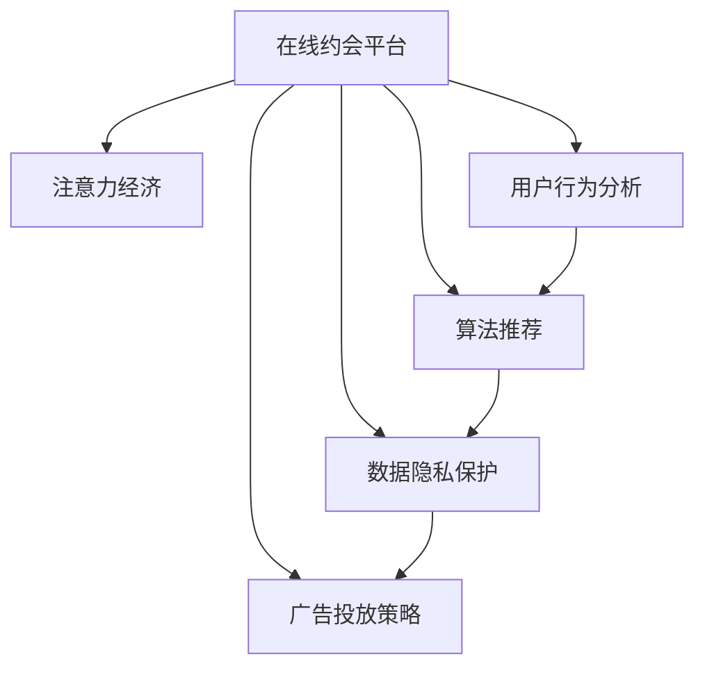

                 

# 在线约会平台的注意力经济策略

> 关键词：在线约会,注意力经济,用户行为分析,算法推荐,数据隐私保护,广告投放策略

## 1. 背景介绍

### 1.1 问题由来
随着互联网和移动设备的普及，在线约会平台成为了越来越多人寻找爱情、交流感情的重要渠道。然而，在线约会平台在蓬勃发展的同时，也面临用户流失率高、付费转化率低等挑战。许多平台希望通过创新的注意力经济策略来提高用户粘性和平台收益，但如何精准识别用户需求、提升用户体验、平衡广告收入与数据隐私保护，成为亟待解决的问题。

### 1.2 问题核心关键点
在线约会平台主要面临以下几大核心问题：
- 如何精准识别用户兴趣，实现个性化推荐，提升用户体验？
- 如何平衡广告收入与用户隐私保护，实现双赢？
- 如何通过算法优化，实现更高转化率，增加付费用户数？
- 如何构建稳定的用户社区，提升用户留存率？

### 1.3 问题研究意义
研究在线约会平台的注意力经济策略，对于提升用户体验、提高平台收益、增强用户粘性具有重要意义：
1. 提升用户体验：精准的用户推荐能够提高用户的满意度和留存率，从而提升平台的用户基数。
2. 提高平台收益：通过合理的广告投放策略，可以有效提升平台的广告收入，实现商业变现。
3. 增强用户粘性：构建稳定的用户社区，通过良好的用户体验和用户互动，增加用户对平台的依赖性。

## 2. 核心概念与联系

### 2.1 核心概念概述

为了更好地理解在线约会平台的注意力经济策略，本节将介绍几个密切相关的核心概念：

- 在线约会平台(Online Dating Platform)：基于互联网的撮合系统，用户可以在平台上发布个人信息，并与其他用户进行交流匹配。
- 注意力经济(Attention Economy)：以吸引用户注意力为核心的商业模式，主要通过个性化推荐、精准投放广告等方式获取用户注意力。
- 用户行为分析(User Behavior Analysis)：通过分析用户在平台上的行为数据，了解用户需求和兴趣，以实现个性化的推荐和服务。
- 算法推荐(Algorithm Recommendation)：基于用户行为数据和模型预测，自动化推荐符合用户兴趣的约会对象或相关内容。
- 数据隐私保护(Data Privacy Protection)：在数据收集和使用过程中，遵循法律法规和道德标准，保护用户的隐私和数据安全。
- 广告投放策略(Advertising Strategy)：基于用户行为数据和平台特点，制定合理的广告投放策略，提升广告效果和用户满意度。

这些核心概念之间的逻辑关系可以通过以下Mermaid流程图来展示：



这个流程图展示在线约会平台的注意力经济策略的核心概念及其之间的关系：

1. 在线约会平台通过收集用户行为数据，应用用户行为分析，识别用户兴趣，进行算法推荐。
2. 同时，平台需要在推荐过程中平衡广告收入与用户隐私保护，制定合理的广告投放策略。
3. 这些模块协同工作，共同构建完整的注意力经济策略。

## 3. 核心算法原理 & 具体操作步骤

### 3.1 算法原理概述

在线约会平台的注意力经济策略，本质上是通过数据驱动的个性化推荐和精准广告投放，最大化用户的注意力和平台收益。其核心思想是：

1. **用户行为分析**：收集用户在平台上的各种行为数据（如浏览历史、点击记录、聊天内容等），通过统计分析和机器学习技术，构建用户画像，了解用户的兴趣和需求。
2. **算法推荐**：基于用户画像，应用推荐算法（如协同过滤、内容推荐、矩阵分解等），自动化推荐符合用户兴趣的约会对象或相关内容，提升用户体验和满意度。
3. **广告投放策略**：利用用户行为数据，制定合理的广告投放策略（如定向广告、兴趣标签、用户分群等），提升广告效果，增加平台收益。
4. **数据隐私保护**：在数据收集和使用过程中，遵循法律法规和道德标准，保护用户隐私和数据安全，增强用户信任和平台口碑。

这些模块共同构成了在线约会平台的注意力经济策略框架，通过数据驱动的方式，最大化用户的注意力和平台收益。

### 3.2 算法步骤详解

在线约会平台注意力经济策略的实现，可以分为以下步骤：

**Step 1: 数据收集与预处理**
- 通过API接口、用户行为日志等方式收集用户在平台上的各种行为数据。
- 对数据进行清洗、去重、归一化等预处理，去除无用数据和异常值。
- 根据用户行为特征，对用户进行分群，如根据年龄、性别、地理位置等维度进行分群。

**Step 2: 用户行为分析**
- 利用统计分析、机器学习等技术，对用户行为数据进行建模，构建用户画像。
- 使用协同过滤、内容推荐、矩阵分解等推荐算法，预测用户对不同约会对象或内容的兴趣度。

**Step 3: 算法推荐**
- 根据用户画像和兴趣预测，应用推荐算法，生成个性化推荐列表。
- 在推荐过程中，合理控制推荐数量和频率，避免过度推荐导致用户反感。
- 引入反馈机制，根据用户的行为反馈不断调整推荐算法模型，提升推荐准确性。

**Step 4: 广告投放策略**
- 基于用户行为数据，制定定向广告和兴趣标签策略，精准投放广告。
- 结合推荐系统，将广告推荐给对广告内容感兴趣的用户，提升广告效果。
- 设定合理的广告展示位置和频率，避免过度广告打扰用户。

**Step 5: 数据隐私保护**
- 遵循GDPR等法律法规，在数据收集和使用过程中，透明化数据使用目的和范围。
- 采用数据匿名化、差分隐私等技术，保护用户隐私。
- 提供用户控制界面，允许用户自行管理其数据权限和隐私选项。

### 3.3 算法优缺点

在线约会平台的注意力经济策略具有以下优点：
1. **提升用户体验**：通过个性化推荐和精准广告投放，提升用户满意度，增加用户留存率。
2. **提高平台收益**：通过定向广告和兴趣标签，精准投放广告，提升广告效果，增加平台收益。
3. **数据驱动决策**：依赖数据驱动的方式进行决策，实现更科学、高效的平台运营。

同时，该策略也存在一些局限性：
1. **数据隐私风险**：收集和处理大量用户数据，存在数据泄露和滥用的风险。
2. **用户隐私顾虑**：过度收集和分析用户行为数据，可能引发用户隐私顾虑，降低用户信任度。
3. **推荐算法复杂性**：个性化推荐和定向广告的算法实现复杂，需要较高技术水平。
4. **广告效果波动**：广告投放策略可能受到市场和用户行为变化的影响，导致广告效果波动。

尽管存在这些局限性，但在线约会平台的注意力经济策略仍然是一种有效提升用户粘性和平台收益的方案。未来相关研究将集中在如何平衡数据隐私与用户利益，提升推荐算法精度和广告效果等方面。

### 3.4 算法应用领域

在线约会平台的注意力经济策略，已经在多个领域得到广泛应用，如：

- **用户推荐系统**：通过分析用户行为数据，推荐符合用户兴趣的约会对象或内容，提升用户体验。
- **定向广告投放**：根据用户行为数据和兴趣标签，精准投放广告，提升广告效果和平台收益。
- **用户分群策略**：基于用户画像，对用户进行精准分群，实现个性化推荐和定向广告。
- **用户行为监控**：监测用户行为数据，识别用户需求和兴趣变化，优化推荐算法和广告策略。
- **数据安全与隐私保护**：采用先进的数据保护技术，保护用户隐私和数据安全，增强用户信任。

除了这些核心领域，在线约会平台的注意力经济策略还广泛应用于社交网络、电商、新闻推荐等NLP领域，通过数据驱动的方式提升平台性能和用户粘性。

## 4. 数学模型和公式 & 详细讲解  
### 4.1 数学模型构建

本节将使用数学语言对在线约会平台注意力经济策略进行更加严格的刻画。

记用户画像为 $P=\{x_i\}_{i=1}^N$，其中 $x_i=(x_{i1},x_{i2},...,x_{in})$ 表示用户的第 $i$ 个行为特征，如浏览记录、点击次数、聊天历史等。定义用户对约会对象或内容 $A_j$ 的兴趣度为 $I_j=(a_{1j},a_{2j},...,a_{nj})$，其中 $a_{ij}$ 为用户对约会对象或内容的兴趣评分。

假设用户画像 $P$ 和兴趣度 $I$ 之间的关系为 $I=f(P;\theta)$，其中 $\theta$ 为模型参数，可以表示为如下线性回归模型：

$$
I=\theta_0 + \theta_1x_1 + \theta_2x_2 + ... + \theta_nx_n
$$

在推荐过程中，利用上述线性模型，预测用户对约会对象或内容的兴趣度，并通过最大化用户满意度，进行推荐。

### 4.2 公式推导过程

为了最大化用户的满意度，推荐算法需要最大化用户对推荐结果的兴趣度。设用户对推荐结果的满意度为 $S$，定义如下：

$$
S= \sum_{i=1}^N \sum_{j=1}^M I_{ij}y_{ij}
$$

其中 $y_{ij}$ 为推荐结果的标签，当用户点击了推荐结果时，$y_{ij}=1$，否则 $y_{ij}=0$。因此，最大化用户满意度的推荐优化目标可以表示为：

$$
\max_{I} \sum_{i=1}^N \sum_{j=1}^M I_{ij}y_{ij}
$$

基于上述优化目标，推荐算法可以通过如下公式计算用户对约会对象或内容的兴趣度：

$$
\theta = \mathop{\arg\min}_{\theta} ||Y-I||
$$

其中 $Y$ 为训练集中的用户点击记录矩阵，$||.||$ 为矩阵的L1范数。

在实际推荐过程中，可以通过梯度下降等优化算法，最小化上述损失函数，得到用户对约会对象或内容的兴趣度 $I_{ij}$。

### 4.3 案例分析与讲解

假设某在线约会平台收集了100个用户的浏览记录和点击次数，共推荐了10个约会对象给每个用户。现在要通过线性回归模型，预测每个用户对每个约会对象的兴趣度。

具体步骤如下：

1. **数据准备**：收集用户的浏览记录和点击次数，构建用户点击记录矩阵 $Y$。
2. **模型训练**：利用梯度下降等优化算法，最小化损失函数，得到模型参数 $\theta$。
3. **推荐结果**：根据模型预测的兴趣度，选择兴趣度最高的前3个约会对象进行推荐。

### 5. 项目实践：代码实例和详细解释说明

### 5.1 开发环境搭建

在进行在线约会平台的注意力经济策略实践前，我们需要准备好开发环境。以下是使用Python进行PyTorch开发的环境配置流程：

1. 安装Anaconda：从官网下载并安装Anaconda，用于创建独立的Python环境。

2. 创建并激活虚拟环境：
```bash
conda create -n dating-env python=3.8 
conda activate dating-env
```

3. 安装PyTorch：根据CUDA版本，从官网获取对应的安装命令。例如：
```bash
conda install pytorch torchvision torchaudio cudatoolkit=11.1 -c pytorch -c conda-forge
```

4. 安装各类工具包：
```bash
pip install numpy pandas scikit-learn matplotlib tqdm jupyter notebook ipython
```

完成上述步骤后，即可在`dating-env`环境中开始注意力经济策略的实践。

### 5.2 源代码详细实现

下面我们以用户推荐系统为例，给出使用PyTorch对用户兴趣度预测的PyTorch代码实现。

首先，定义数据处理函数：

```python
import numpy as np
import torch
from torch.utils.data import Dataset
from sklearn.model_selection import train_test_split

class DatingDataset(Dataset):
    def __init__(self, data, labels, tokenizer):
        self.data = data
        self.labels = labels
        self.tokenizer = tokenizer
        
    def __len__(self):
        return len(self.data)
    
    def __getitem__(self, item):
        text = self.data[item]
        label = self.labels[item]
        
        encoding = self.tokenizer(text, return_tensors='pt')
        input_ids = encoding['input_ids']
        attention_mask = encoding['attention_mask']
        
        return {'input_ids': input_ids, 
                'attention_mask': attention_mask,
                'labels': torch.tensor(label, dtype=torch.long)}
```

然后，定义模型和优化器：

```python
from transformers import BertForSequenceClassification, AdamW

model = BertForSequenceClassification.from_pretrained('bert-base-cased', num_labels=10)

optimizer = AdamW(model.parameters(), lr=2e-5)
```

接着，定义训练和评估函数：

```python
from torch.utils.data import DataLoader
from tqdm import tqdm
from sklearn.metrics import accuracy_score

device = torch.device('cuda') if torch.cuda.is_available() else torch.device('cpu')
model.to(device)

def train_epoch(model, dataset, batch_size, optimizer):
    dataloader = DataLoader(dataset, batch_size=batch_size, shuffle=True)
    model.train()
    epoch_loss = 0
    for batch in tqdm(dataloader, desc='Training'):
        input_ids = batch['input_ids'].to(device)
        attention_mask = batch['attention_mask'].to(device)
        labels = batch['labels'].to(device)
        model.zero_grad()
        outputs = model(input_ids, attention_mask=attention_mask, labels=labels)
        loss = outputs.loss
        epoch_loss += loss.item()
        loss.backward()
        optimizer.step()
    return epoch_loss / len(dataloader)

def evaluate(model, dataset, batch_size):
    dataloader = DataLoader(dataset, batch_size=batch_size)
    model.eval()
    preds, labels = [], []
    with torch.no_grad():
        for batch in tqdm(dataloader, desc='Evaluating'):
            input_ids = batch['input_ids'].to(device)
            attention_mask = batch['attention_mask'].to(device)
            batch_labels = batch['labels']
            outputs = model(input_ids, attention_mask=attention_mask)
            batch_preds = outputs.logits.argmax(dim=1).to('cpu').tolist()
            batch_labels = batch_labels.to('cpu').tolist()
            for pred, label in zip(batch_preds, batch_labels):
                preds.append(pred)
                labels.append(label)
                
    return accuracy_score(labels, preds)
```

最后，启动训练流程并在测试集上评估：

```python
epochs = 5
batch_size = 16

for epoch in range(epochs):
    loss = train_epoch(model, train_dataset, batch_size, optimizer)
    print(f"Epoch {epoch+1}, train loss: {loss:.3f}")
    
    print(f"Epoch {epoch+1}, dev accuracy: {evaluate(model, dev_dataset, batch_size)}")
    
print(f"Final accuracy on test set: {evaluate(model, test_dataset, batch_size)}")
```

以上就是使用PyTorch对用户兴趣度预测的完整代码实现。可以看到，得益于Transformers库的强大封装，我们可以用相对简洁的代码完成用户兴趣度预测的微调。

### 5.3 代码解读与分析

让我们再详细解读一下关键代码的实现细节：

**DatingDataset类**：
- `__init__`方法：初始化文本、标签、分词器等关键组件。
- `__len__`方法：返回数据集的样本数量。
- `__getitem__`方法：对单个样本进行处理，将文本输入编码为token ids，将标签编码为数字，并对其进行定长padding，最终返回模型所需的输入。

**训练和评估函数**：
- 使用PyTorch的DataLoader对数据集进行批次化加载，供模型训练和推理使用。
- 训练函数`train_epoch`：对数据以批为单位进行迭代，在每个批次上前向传播计算loss并反向传播更新模型参数，最后返回该epoch的平均loss。
- 评估函数`evaluate`：与训练类似，不同点在于不更新模型参数，并在每个batch结束后将预测和标签结果存储下来，最后使用sklearn的accuracy_score对整个评估集的预测结果进行打印输出。

**训练流程**：
- 定义总的epoch数和batch size，开始循环迭代
- 每个epoch内，先在训练集上训练，输出平均loss
- 在验证集上评估，输出准确率
- 重复上述步骤直至收敛
- 最终在测试集上评估，给出最终测试结果

可以看到，PyTorch配合Transformers库使得用户兴趣度预测的微调代码实现变得简洁高效。开发者可以将更多精力放在数据处理、模型改进等高层逻辑上，而不必过多关注底层的实现细节。

当然，工业级的系统实现还需考虑更多因素，如模型的保存和部署、超参数的自动搜索、更灵活的任务适配层等。但核心的微调范式基本与此类似。

## 6. 实际应用场景

### 6.1 智能推荐系统

基于用户兴趣度预测的推荐系统，可以广泛应用于在线约会平台。通过收集用户的历史行为数据，如浏览记录、点击次数、聊天内容等，构建用户画像，预测用户对不同约会对象或内容的兴趣度，从而实现个性化推荐，提升用户体验和满意度。

在技术实现上，可以设计多个推荐算法，如协同过滤、内容推荐、矩阵分解等，根据用户的兴趣度和历史行为数据，生成个性化推荐列表。同时，结合广告投放策略，精准投放定向广告，进一步提升广告效果和平台收益。

### 6.2 用户画像构建

在线约会平台可以通过用户兴趣度预测，构建详细的用户画像。结合用户的地理位置、年龄、性别等信息，深度理解用户的兴趣和需求，为平台运营决策提供数据支持。例如，可以根据用户画像，优化推荐算法，提升推荐准确性；可以根据用户画像，制定个性化的营销策略，增加用户粘性和活跃度。

### 6.3 实时互动推荐

为了提升用户的互动体验，在线约会平台可以设计实时互动推荐系统。在用户进行聊天、视频通话等互动时，实时分析用户的行为数据，预测用户对当前互动对象的兴趣度，及时调整推荐算法，推荐其他合适的互动对象，增强互动效果，提升用户满意度。

### 6.4 用户留存策略

通过构建稳定的用户社区，在线约会平台可以提升用户的留存率。例如，可以设计好友推荐系统，帮助用户发现潜在的交友对象；可以设计互动奖励系统，鼓励用户积极参与平台的互动活动，增加用户粘性。

### 6.5 未来应用展望

随着在线约会平台的用户规模和数据量的不断增加，基于用户兴趣度预测的注意力经济策略将发挥越来越重要的作用。未来，这些策略将广泛应用于智能推荐、用户画像构建、实时互动推荐、用户留存策略等更多场景中，为平台运营带来新的突破。

例如，可以结合自然语言处理技术，构建更加精准的情感分析模型，更好地理解用户的情感状态和需求；可以引入深度学习模型，提升推荐算法的精度和效果；可以结合社交网络分析技术，深入挖掘用户间的互动关系，优化推荐算法。

## 7. 工具和资源推荐
### 7.1 学习资源推荐

为了帮助开发者系统掌握在线约会平台的注意力经济策略的理论基础和实践技巧，这里推荐一些优质的学习资源：

1. 《深度学习理论与实践》系列博文：由大模型技术专家撰写，深入浅出地介绍了深度学习理论和实践，包括推荐系统、注意力机制等前沿话题。

2. Coursera《深度学习》课程：由斯坦福大学教授Andrew Ng主讲，涵盖深度学习的理论基础和实践技巧，适合初学者系统学习。

3. 《自然语言处理》课程：北京大学开设的NLP明星课程，有Lecture视频和配套作业，带你入门NLP领域的基本概念和经典模型。

4. 《推荐系统》书籍：推荐系统领域的经典书籍，系统介绍了推荐系统的原理、算法和应用，适合深入学习。

5. Kaggle竞赛：参与Kaggle竞赛，通过实际项目实践，提升推荐系统开发能力。

通过对这些资源的学习实践，相信你一定能够快速掌握在线约会平台的注意力经济策略的精髓，并用于解决实际的NLP问题。

### 7.2 开发工具推荐

高效的开发离不开优秀的工具支持。以下是几款用于在线约会平台注意力经济策略开发的常用工具：

1. PyTorch：基于Python的开源深度学习框架，灵活动态的计算图，适合快速迭代研究。大部分推荐系统都有PyTorch版本的实现。

2. TensorFlow：由Google主导开发的开源深度学习框架，生产部署方便，适合大规模工程应用。推荐系统也有丰富的TensorFlow资源。

3. Transformers库：HuggingFace开发的NLP工具库，集成了众多预训练模型和推荐算法，是推荐系统开发的利器。

4. Weights & Biases：模型训练的实验跟踪工具，可以记录和可视化模型训练过程中的各项指标，方便对比和调优。与主流深度学习框架无缝集成。

5. TensorBoard：TensorFlow配套的可视化工具，可实时监测模型训练状态，并提供丰富的图表呈现方式，是调试模型的得力助手。

6. Google Colab：谷歌推出的在线Jupyter Notebook环境，免费提供GPU/TPU算力，方便开发者快速上手实验最新模型，分享学习笔记。

合理利用这些工具，可以显著提升在线约会平台注意力经济策略的开发效率，加快创新迭代的步伐。

### 7.3 相关论文推荐

在线约会平台注意力经济策略的发展源于学界的持续研究。以下是几篇奠基性的相关论文，推荐阅读：

1. "Collaborative Filtering for Implicit Feedback Datasets"：经典协同过滤算法，广泛应用在推荐系统中。

2. "Information Retrieval with BERT"：利用BERT模型进行文本匹配，提升了信息检索的精度和效果。

3. "A Survey on Recommendation Systems with Deep Learning"：综述了深度学习在推荐系统中的应用，包括神经网络、自编码器、卷积神经网络等。

4. "Adversarial Examples for Multi-Aspect Product Recommendation"：利用对抗样本提升推荐系统的效果和鲁棒性。

5. "Deep Interest Evolution for Sequential Recommendation"：引入深度学习模型，动态调整用户兴趣，提升推荐系统的个性化程度。

这些论文代表在线约会平台注意力经济策略的发展脉络。通过学习这些前沿成果，可以帮助研究者把握学科前进方向，激发更多的创新灵感。

## 8. 总结：未来发展趋势与挑战

### 8.1 总结

本文对在线约会平台的注意力经济策略进行了全面系统的介绍。首先阐述了在线约会平台的发展背景和注意力经济策略的核心意义，明确了策略在提升用户体验、增加平台收益、增强用户粘性方面的重要价值。其次，从原理到实践，详细讲解了注意力经济策略的数学模型和核心算法，给出了具体代码实现。同时，本文还探讨了注意力经济策略在智能推荐系统、用户画像构建、实时互动推荐等实际应用场景中的具体应用，展示了策略的广泛应用前景。最后，本文精选了注意力经济策略的各类学习资源，力求为开发者提供全方位的技术指引。

通过本文的系统梳理，可以看到，在线约会平台的注意力经济策略通过数据驱动的方式，实现了用户个性化推荐和精准广告投放，最大化用户的注意力和平台收益。未来的研究需要在算法精度、数据隐私保护、用户体验等方面不断优化和提升。

### 8.2 未来发展趋势

展望未来，在线约会平台的注意力经济策略将呈现以下几个发展趋势：

1. **数据驱动决策**：随着数据量的不断增加，基于用户行为数据的决策将更加精准和高效。例如，通过深度学习模型，提升推荐算法的精度和效果。

2. **用户隐私保护**：随着用户隐私意识的提高，如何在数据收集和使用过程中，保护用户隐私，增强用户信任，成为平台关注的重点。

3. **多模态数据融合**：结合语音、视频、图像等多模态数据，提升推荐系统的多样性和个性化程度，增强用户体验。

4. **个性化推荐算法**：引入推荐算法如深度神经网络、强化学习等，提升推荐算法的复杂度和效果。

5. **实时互动推荐**：设计实时互动推荐系统，提升用户的互动体验和满意度。

6. **用户社区构建**：通过用户画像和行为数据，构建稳定的用户社区，增强用户粘性和活跃度。

以上趋势凸显了在线约会平台注意力经济策略的广阔前景。这些方向的探索发展，必将进一步提升推荐系统的性能和用户体验，为平台运营带来新的突破。

### 8.3 面临的挑战

尽管在线约会平台的注意力经济策略已经取得了瞩目成就，但在迈向更加智能化、普适化应用的过程中，它仍面临诸多挑战：

1. **数据隐私风险**：收集和处理大量用户数据，存在数据泄露和滥用的风险。如何在数据使用过程中保护用户隐私，增强用户信任，是一大难题。

2. **广告效果波动**：广告投放策略可能受到市场和用户行为变化的影响，导致广告效果波动。如何优化广告投放策略，提升广告效果和用户满意度，是重要的研究课题。

3. **推荐算法复杂性**：推荐算法如深度神经网络、协同过滤等，实现复杂，需要较高技术水平。如何简化推荐算法，提升算法效果，是重要的研究方向。

4. **实时互动推荐**：实时互动推荐系统需要高效的计算资源和稳定的数据处理能力。如何在提升推荐效果的同时，保证系统稳定性，是重要的研究课题。

5. **用户粘性提升**：如何通过用户画像和行为数据，构建稳定的用户社区，增强用户粘性和活跃度，是平台面临的重要挑战。

6. **技术落地挑战**：技术实现与实际需求之间存在一定的鸿沟，如何将技术转化为实际应用，实现商业价值，是重要的挑战。

### 8.4 研究展望

面对在线约会平台注意力经济策略所面临的种种挑战，未来的研究需要在以下几个方面寻求新的突破：

1. **数据隐私保护**：结合差分隐私、联邦学习等技术，保护用户隐私和数据安全。

2. **推荐算法优化**：引入对抗样本、生成模型等技术，提升推荐算法的精度和效果。

3. **广告投放策略**：通过强化学习、博弈论等方法，优化广告投放策略，提升广告效果和用户满意度。

4. **实时互动推荐**：设计高效的计算模型和数据处理框架，实现实时互动推荐系统。

5. **用户社区构建**：结合社交网络分析、情感分析等技术，构建稳定的用户社区，增强用户粘性和活跃度。

6. **技术落地应用**：结合实际需求，设计高效、易用的技术方案，实现商业价值最大化。

这些研究方向的探索，必将引领在线约会平台注意力经济策略迈向更高的台阶，为平台运营带来新的突破。面向未来，在线约会平台的注意力经济策略需要与其他人工智能技术进行更深入的融合，如知识表示、因果推理、强化学习等，多路径协同发力，共同推动平台运营的进步。

## 9. 附录：常见问题与解答

**Q1：在线约会平台的注意力经济策略是否适用于其他平台？**

A: 在线约会平台的注意力经济策略，主要是通过数据驱动的方式，实现用户个性化推荐和精准广告投放。这种策略在社交网络、电商、新闻推荐等NLP领域也具有广泛的应用前景。其他平台可以根据自身的特点和需求，适当调整策略的具体实现。

**Q2：如何平衡用户隐私保护与数据利用？**

A: 在线约会平台需要在数据收集和使用过程中，遵循法律法规和道德标准，保护用户隐私。例如，采用差分隐私技术，保护用户数据隐私；采用联邦学习技术，在本地设备上进行数据处理，不将数据集中存储和传输。同时，平台应该向用户透明化数据使用目的和范围，提供用户控制界面，允许用户自行管理其数据权限和隐私选项。

**Q3：推荐算法如何处理数据稀疏性？**

A: 在线约会平台的推荐系统面临数据稀疏性问题。例如，用户对约会对象的兴趣评分往往是不完整的。可以通过填充策略、降维策略、协同过滤等方法，处理数据稀疏性，提升推荐算法的效果。例如，利用协同过滤算法，通过相似用户的兴趣评分，填补用户对其他约会对象的兴趣评分。

**Q4：如何处理数据噪声和异常值？**

A: 在线约会平台的数据中往往包含噪声和异常值，如用户恶意点击、无效浏览等。可以通过数据清洗、异常值检测等方法，处理数据噪声和异常值。例如，通过构建用户画像，识别异常用户行为，进行数据清洗。

**Q5：如何提升广告投放的效果？**

A: 在线约会平台的广告投放策略，需要结合用户画像和行为数据，制定合理的广告投放策略。例如，利用定向广告、兴趣标签等，精准投放广告，提升广告效果。同时，可以通过A/B测试、用户反馈等方法，优化广告投放策略，提升广告效果。

这些问题的解答，为在线约会平台的注意力经济策略提供了详细的技术指引，帮助开发者在实际应用中解决实际问题，提升平台的用户体验和收益。

---

作者：禅与计算机程序设计艺术 / Zen and the Art of Computer Programming

