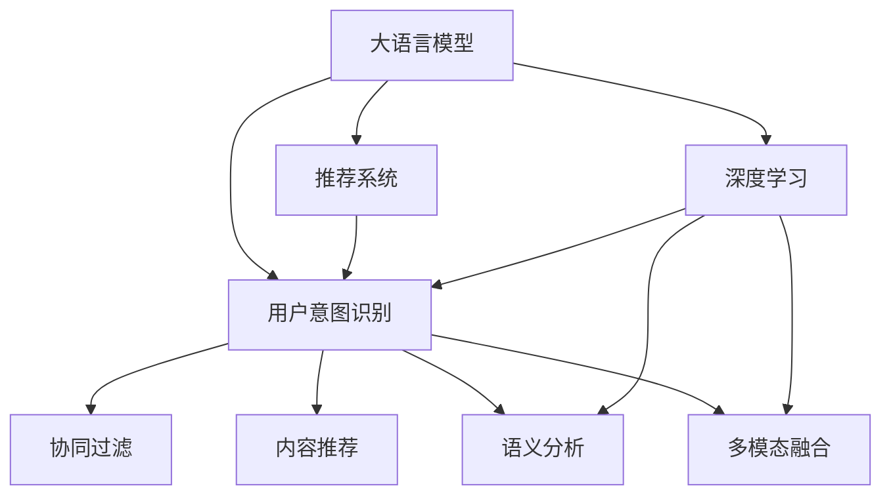

                 

# 基于LLM的推荐系统用户意图识别

> 关键词：大语言模型(LLM)，推荐系统，用户意图识别，自然语言处理(NLP)，深度学习，语义分析，多模态融合

## 1. 背景介绍

### 1.1 问题由来
推荐系统作为互联网产品的重要组成部分，通过分析用户行为数据，预测用户的潜在需求，向用户推荐最相关的物品。目前推荐系统主要分为两类：基于协同过滤的推荐系统和基于内容的推荐系统。前者主要通过分析用户历史行为数据，发现用户间的相似度，进行物品推荐；后者则从物品的属性信息出发，寻找最匹配用户需求的对象。然而，现实中的用户行为是多样且复杂的，单一的推荐策略往往难以精准把握用户的真实需求。

近年来，自然语言处理（NLP）技术迅猛发展，大语言模型（Large Language Model, LLM）凭借其强大的语言理解和生成能力，在推荐系统中逐步崭露头角。基于大语言模型的推荐系统能够更深入地理解用户的文本描述，结合上下文信息，更准确地识别用户的真实需求。其中，用户意图识别作为推荐系统的核心组件之一，通过识别用户输入的自然语言描述，提取用户需求的关键信息，进行推荐决策，在提升推荐系统效果方面具有重要意义。

## 2. 核心概念与联系

### 2.1 核心概念概述

为更好地理解基于大语言模型推荐系统用户意图识别的原理，本节将介绍几个核心概念：

- 大语言模型(Large Language Model, LLM)：如GPT、BERT等，能够处理大规模无标签文本语料，学习通用的语言表示，具备强大的语言理解和生成能力。
- 推荐系统(Recommendation System, RS)：基于用户行为数据和物品属性信息，通过推荐算法向用户推荐物品的系统，涵盖协同过滤、内容推荐等多种技术。
- 用户意图识别(User Intent Recognition, UIR)：通过分析用户输入的自然语言描述，识别用户的真实需求，提取用户意图信息，指导推荐决策。
- 自然语言处理(Natural Language Processing, NLP)：涉及自然语言分析、理解、生成等技术，是大语言模型推荐系统用户意图识别的基础。
- 深度学习(Deep Learning, DL)：一种基于神经网络的机器学习技术，在语音、图像、自然语言处理等领域广泛应用。
- 语义分析(Semantic Analysis)：分析文本中的语义信息，识别出文本的含义和用户需求。
- 多模态融合(Multi-modal Fusion)：结合文本、图像、语音等多模态数据，进行更全面、深入的用户意图识别。

这些核心概念之间的逻辑关系可以通过以下Mermaid流程图来展示：



这个流程图展示了大语言模型推荐系统用户意图识别的核心概念及其之间的关系：

1. 大语言模型通过深度学习技术从大规模文本数据中学习通用的语言表示，是推荐系统用户意图识别的基础。
2. 用户意图识别是推荐系统的关键组件，通过分析用户输入的自然语言描述，提取用户需求信息，指导推荐决策。
3. 推荐系统通过协同过滤、内容推荐等技术，向用户推荐最相关的物品。
4. 语义分析和多模态融合是用户意图识别的重要手段，结合文本、图像、语音等多模态数据，提升用户意图识别的准确性和全面性。

## 3. 核心算法原理 & 具体操作步骤

### 3.1 算法原理概述

基于大语言模型的推荐系统用户意图识别，本质上是一个基于深度学习的序列建模问题。其核心思想是：通过大语言模型学习用户输入的自然语言描述和用户意图的关联，建立用户意图预测模型，从而在新的自然语言描述输入时，能够准确预测用户的意图信息。

形式化地，假设用户输入的自然语言描述为 $x$，用户意图信息为 $y$，则用户意图识别问题可以表示为：

$$
p(y|x) = \frac{e^{f(x; \theta)}}{\sum_{y'} e^{f(x; \theta)}}
$$

其中 $f(x; \theta)$ 为模型参数为 $\theta$ 的用户意图预测函数，$e$ 为自然常数底数。通过最大化似然函数 $L(p(y|x)) = \prod_{i=1}^{N}p(y_i|x_i)$，即可得到参数 $\theta$ 的最佳估计，从而实现用户意图识别的预测。

### 3.2 算法步骤详解

基于深度学习的大语言模型推荐系统用户意图识别一般包括以下几个关键步骤：

**Step 1: 数据预处理**
- 收集用户输入的自然语言描述和用户行为数据。
- 对自然语言描述进行分词、去除停用词、转换为向量表示等预处理操作。
- 对用户行为数据进行归一化、编码等处理。

**Step 2: 选择模型架构**
- 选择合适的深度学习模型架构，如Transformer、RNN等。
- 设计合适的模型输入输出，通常是自然语言描述的词向量表示。

**Step 3: 设计损失函数**
- 选择适当的损失函数，如交叉熵损失、均方误差损失等。
- 根据用户意图预测模型的输出和真实标签计算损失。

**Step 4: 训练用户意图识别模型**
- 使用数据集训练用户意图识别模型。
- 优化模型参数，使得模型输出与真实标签尽可能接近。
- 定期在验证集上评估模型性能，防止过拟合。

**Step 5: 集成到推荐系统中**
- 将训练好的用户意图识别模型集成到推荐系统中。
- 在用户输入自然语言描述时，使用模型预测用户意图信息。
- 根据用户意图信息，结合协同过滤、内容推荐等策略，生成推荐结果。

### 3.3 算法优缺点

基于深度学习的大语言模型推荐系统用户意图识别方法具有以下优点：

1. 高效性。深度学习模型能够处理大规模自然语言数据，快速学习用户意图信息。
2. 准确性。深度学习模型具备强大的语义理解和生成能力，能够准确预测用户意图。
3. 可扩展性。深度学习模型可以通过增量学习不断更新，适应新用户和变化的需求。
4. 鲁棒性。深度学习模型能够适应不同的文本语言和噪声数据，具有较强的泛化能力。

同时，该方法也存在一些局限性：

1. 数据依赖。深度学习模型需要大量的标注数据进行训练，数据获取成本较高。
2. 模型复杂。深度学习模型的复杂度较高，训练和推理速度较慢。
3. 可解释性不足。深度学习模型往往是"黑盒"，难以解释内部决策过程。
4. 资源消耗大。深度学习模型需要大量的计算资源和存储空间。

尽管存在这些局限性，但就目前而言，基于深度学习的大语言模型推荐系统用户意图识别方法仍然是推荐系统领域的主流范式。未来相关研究的重点在于如何进一步降低数据依赖，提高模型效率，增强可解释性和可扩展性。

### 3.4 算法应用领域

基于大语言模型的推荐系统用户意图识别技术，已经在电子商务、在线广告、内容推荐等多个领域得到了广泛应用，成为推荐系统的重要组成部分。

- 电子商务：通过对用户评论和搜索历史进行分析，用户意图识别能够帮助电商平台推荐最相关的商品。
- 在线广告：通过对用户搜索查询和点击行为进行分析，用户意图识别能够帮助广告平台精准推送广告内容。
- 内容推荐：通过对用户阅读历史和评分信息进行分析，用户意图识别能够帮助内容平台推荐最符合用户兴趣的文章或视频。

除了上述这些经典应用外，用户意图识别技术还被创新性地应用到更多场景中，如智能客服、智能家居、智能交通等，为各行各业带来新的价值。随着大语言模型和用户意图识别技术的不断进步，相信推荐系统必将在更广阔的领域大放异彩。

## 4. 数学模型和公式 & 详细讲解 & 举例说明

### 4.1 数学模型构建

本节将使用数学语言对基于深度学习的大语言模型推荐系统用户意图识别过程进行更加严格的刻画。

记用户输入的自然语言描述为 $x$，用户意图信息为 $y$，用户意图识别模型的参数为 $\theta$。则用户意图识别模型的输出为：

$$
f(x; \theta) = \sum_{i=1}^{n} w_i a_i(x; \theta)
$$

其中 $n$ 为模型的层数，$w_i$ 为第 $i$ 层的权重，$a_i(x; \theta)$ 为第 $i$ 层的激活函数。

假设用户意图识别任务为二分类问题，即 $y \in \{0, 1\}$，则损失函数为：

$$
L = -\frac{1}{N} \sum_{i=1}^{N} (y_i \log p(y_i|x_i) + (1-y_i) \log (1-p(y_i|x_i)))
$$

其中 $p(y_i|x_i) = \sigma(f(x_i; \theta))$，$\sigma$ 为激活函数，如sigmoid函数。

### 4.2 公式推导过程

以下我们以二分类任务为例，推导用户意图识别模型的损失函数及其梯度计算公式。

假设用户输入的自然语言描述 $x$ 经过Embedding层后，得到词向量表示 $x_v \in \mathbb{R}^d$，模型共包含 $n$ 层隐藏层，第 $i$ 层隐藏层输出的表示为 $a_i(x; \theta)$。则模型输出的预测结果为：

$$
f(x; \theta) = \sum_{i=1}^{n} w_i a_i(x; \theta)
$$

其中 $w_i$ 为第 $i$ 层的权重，$a_i(x; \theta)$ 为第 $i$ 层的激活函数。模型输出的预测概率为：

$$
p(y|x) = \sigma(f(x; \theta))
$$

假设模型在训练数据集 $D=\{(x_i, y_i)\}_{i=1}^N$ 上的损失函数为：

$$
L = -\frac{1}{N} \sum_{i=1}^{N} (y_i \log p(y_i|x_i) + (1-y_i) \log (1-p(y_i|x_i)))
$$

根据链式法则，损失函数对模型参数 $\theta$ 的梯度为：

$$
\nabla_{\theta} L = \frac{\partial L}{\partial w_1} + \frac{\partial L}{\partial w_2} + \dots + \frac{\partial L}{\partial w_n}
$$

其中，第 $i$ 层权重 $w_i$ 的梯度为：

$$
\frac{\partial L}{\partial w_i} = \frac{1}{N} \sum_{i=1}^{N} (p(y_i|x_i) - y_i) \nabla_{\theta} a_i(x; \theta)
$$

其中 $\nabla_{\theta} a_i(x; \theta)$ 为第 $i$ 层的激活函数对模型参数 $\theta$ 的梯度，可通过反向传播算法高效计算。

在得到损失函数的梯度后，即可带入深度学习框架进行优化，最小化损失函数，完成用户意图识别模型的训练。

### 4.3 案例分析与讲解

假设我们构建了一个基于BERT的用户意图识别模型，用于推荐电商平台的用户购买意图。

**数据集准备**
- 收集用户评论和搜索历史数据。
- 对评论和搜索文本进行分词、去除停用词、转换为BERT所需的格式。
- 对用户行为数据进行归一化、编码等处理。

**模型架构**
- 选择BERT作为预训练模型，用于对用户输入的自然语言描述进行编码。
- 在前向传播阶段，通过多层全连接网络对BERT输出的表示进行分类。
- 在后向传播阶段，使用交叉熵损失函数计算模型输出与真实标签之间的差异。

**模型训练**
- 使用训练集对用户意图识别模型进行训练。
- 使用Adam优化算法，设置合适的学习率和批大小，进行迭代优化。
- 在验证集上评估模型性能，使用Early Stopping策略避免过拟合。

**模型部署**
- 将训练好的用户意图识别模型集成到电商平台的推荐系统中。
- 在用户输入评论或搜索查询时，使用模型预测用户的购买意图。
- 根据用户的购买意图信息，结合协同过滤、内容推荐等策略，生成商品推荐列表。

## 5. 项目实践：代码实例和详细解释说明

### 5.1 开发环境搭建

在进行推荐系统用户意图识别实践前，我们需要准备好开发环境。以下是使用Python进行TensorFlow开发的环境配置流程：

1. 安装Anaconda：从官网下载并安装Anaconda，用于创建独立的Python环境。

2. 创建并激活虚拟环境：
```bash
conda create -n tf-env python=3.8 
conda activate tf-env
```

3. 安装TensorFlow：根据CUDA版本，从官网获取对应的安装命令。例如：
```bash
pip install tensorflow==2.4
```

4. 安装各类工具包：
```bash
pip install numpy pandas scikit-learn matplotlib tqdm jupyter notebook ipython
```

完成上述步骤后，即可在`tf-env`环境中开始推荐系统用户意图识别的实践。

### 5.2 源代码详细实现

这里我们以用户评论和搜索历史数据为输入，构建基于BERT的电商平台推荐系统用户意图识别模型。

首先，定义用户评论和搜索数据处理函数：

```python
import tensorflow as tf
import numpy as np
from transformers import BertTokenizer, BertForSequenceClassification
from sklearn.model_selection import train_test_split

class DataProcessor:
    def __init__(self, data_path, max_len):
        self.tokenizer = BertTokenizer.from_pretrained('bert-base-uncased')
        self.max_len = max_len
        
        with open(data_path, 'r') as f:
            self.texts, self.labels = self._process_data(f)
            
    def _process_data(self, file):
        texts = []
        labels = []
        for line in file:
            text, label = line.strip().split('\t')
            texts.append(text)
            labels.append(int(label))
        return texts, labels
    
    def encode(self, texts):
        tokenized_texts = [self.tokenizer.encode(text, max_length=self.max_len, truncation=True, padding='max_length') for text in texts]
        return tokenized_texts
    
    def encode_labels(self, labels):
        return [np.array(label) for label in labels]
```

然后，定义用户意图识别模型：

```python
model = BertForSequenceClassification.from_pretrained('bert-base-uncased', num_labels=2)

optimizer = tf.keras.optimizers.Adam(learning_rate=2e-5)
loss = tf.keras.losses.BinaryCrossentropy(from_logits=True)

def train_epoch(model, data, batch_size, optimizer, loss, metrics):
    dataloader = tf.data.Dataset.from_tensor_slices((data.input_ids, data.attention_mask, data.labels))
    dataloader = dataloader.shuffle(buffer_size=1024).batch(batch_size).prefetch(tf.data.experimental.AUTOTUNE)
    model.trainable = True
    
    total_loss = 0.0
    total_steps = 0
    for step, batch in enumerate(dataloader):
        with tf.GradientTape() as tape:
            input_ids = batch[0]
            attention_mask = batch[1]
            labels = batch[2]
            outputs = model(input_ids, attention_mask=attention_mask)
            loss_value = loss(labels, outputs)
        grads = tape.gradient(loss_value, model.trainable_variables)
        optimizer.apply_gradients(zip(grads, model.trainable_variables))
        total_loss += loss_value.numpy()
        total_steps += 1
        
    return total_loss / total_steps

def evaluate(model, data, batch_size, loss, metrics):
    dataloader = tf.data.Dataset.from_tensor_slices((data.input_ids, data.attention_mask, data.labels))
    dataloader = dataloader.batch(batch_size).prefetch(tf.data.experimental.AUTOTUNE)
    model.trainable = False
    
    total_loss = 0.0
    total_steps = 0
    for step, batch in enumerate(dataloader):
        with tf.GradientTape() as tape:
            input_ids = batch[0]
            attention_mask = batch[1]
            labels = batch[2]
            outputs = model(input_ids, attention_mask=attention_mask)
            loss_value = loss(labels, outputs)
        total_loss += loss_value.numpy()
        total_steps += 1
        
    return total_loss / total_steps
```

最后，启动训练流程并在测试集上评估：

```python
epochs = 5
batch_size = 16

# 数据集划分
train_texts, dev_texts, train_labels, dev_labels = train_test_split(train_texts, train_labels, test_size=0.2, random_state=42)

# 编码数据集
tokenizer = BertTokenizer.from_pretrained('bert-base-uncased')
train_encodings = tokenizer.encode(train_texts, max_length=128, truncation=True, padding='max_length')
dev_encodings = tokenizer.encode(dev_texts, max_length=128, truncation=True, padding='max_length')
test_encodings = tokenizer.encode(test_texts, max_length=128, truncation=True, padding='max_length')

# 编码标签数据集
train_labels = np.array(train_labels)
dev_labels = np.array(dev_labels)
test_labels = np.array(test_labels)

# 训练模型
model.compile(optimizer=optimizer, loss=loss, metrics=['accuracy'])
model.fit(train_encodings, train_labels, epochs=epochs, validation_data=(dev_encodings, dev_labels))

# 评估模型
model.evaluate(test_encodings, test_labels)
```

以上就是使用TensorFlow对基于BERT的电商平台推荐系统用户意图识别模型进行训练的完整代码实现。可以看到，借助TensorFlow的高效工具库，构建基于深度学习的推荐系统用户意图识别模型变得相对简洁。

### 5.3 代码解读与分析

让我们再详细解读一下关键代码的实现细节：

**DataProcessor类**：
- `__init__`方法：初始化分词器、最大长度等关键组件，加载训练数据。
- `_process_data`方法：解析数据文件，将文本和标签按行划分。
- `encode`方法：使用分词器将文本转换为模型所需的token ids。
- `encode_labels`方法：将标签转换为模型所需的numpy数组。

**训练和评估函数**：
- 使用TensorFlow的DataLoader对数据集进行批次化加载，供模型训练和推理使用。
- 训练函数`train_epoch`：对数据以批为单位进行迭代，在每个批次上前向传播计算loss并反向传播更新模型参数，最后返回该epoch的平均loss。
- 评估函数`evaluate`：与训练类似，不同点在于不更新模型参数，并在每个batch结束后将预测和标签结果存储下来，最后使用TensorFlow的内置评估器计算模型精度。

**训练流程**：
- 定义总的epoch数和batch size，开始循环迭代
- 每个epoch内，先在训练集上训练，输出平均loss
- 在验证集上评估，输出模型精度
- 所有epoch结束后，在测试集上评估，给出最终测试结果

可以看到，TensorFlow配合Bert等预训练语言模型使得推荐系统用户意图识别的代码实现变得简洁高效。开发者可以将更多精力放在数据处理、模型改进等高层逻辑上，而不必过多关注底层的实现细节。

当然，工业级的系统实现还需考虑更多因素，如模型的保存和部署、超参数的自动搜索、更灵活的任务适配层等。但核心的微调范式基本与此类似。

## 6. 实际应用场景

### 6.1 电商平台推荐系统

基于大语言模型的推荐系统用户意图识别技术，在电商平台中得到了广泛应用。传统推荐系统往往只能根据用户历史行为数据进行推荐，难以捕捉用户的多样化需求。而利用用户意图识别技术，电商平台能够更深入地理解用户的购物动机，生成更具针对性的推荐列表。

在技术实现上，可以收集用户评论、搜索历史等文本数据，构建监督数据集，训练用户意图识别模型。在用户输入评论或搜索查询时，模型能够预测用户的购买意图，结合协同过滤、内容推荐等策略，生成符合用户需求的商品推荐。通过不断优化用户意图识别模型，电商平台可以持续提升推荐效果，增强用户体验。

### 6.2 在线广告投放

在线广告平台通过分析用户搜索查询和点击行为，精准推送广告内容。传统广告投放往往依赖单一的行为特征，难以覆盖用户的全面需求。而基于用户意图识别技术，广告平台能够更全面地理解用户需求，生成更精准的广告内容。

在技术实现上，可以收集用户搜索查询、点击记录等文本数据，构建监督数据集，训练用户意图识别模型。在用户输入搜索查询时，模型能够预测用户的广告意图，结合广告内容、关键词等信息，生成匹配用户需求的广告内容。通过不断优化用户意图识别模型，广告平台可以提升广告的点击率、转化率，提高广告投放效果。

### 6.3 内容推荐系统

内容平台通过分析用户阅读历史、评分信息等数据，推荐最符合用户兴趣的文章或视频。传统内容推荐系统往往只能根据用户的单一行为数据进行推荐，难以捕捉用户的深度兴趣。而利用用户意图识别技术，内容平台能够更全面地理解用户需求，生成更具深度和多样性的推荐内容。

在技术实现上，可以收集用户阅读历史、评分信息等文本数据，构建监督数据集，训练用户意图识别模型。在用户输入阅读请求时，模型能够预测用户的内容需求，结合用户历史阅读记录、内容属性等信息，生成匹配用户兴趣的文章或视频。通过不断优化用户意图识别模型，内容平台可以提升推荐效果，增强用户粘性。

### 6.4 未来应用展望

随着大语言模型推荐系统用户意图识别技术的不断发展，未来在更多领域将得到应用，为各行各业带来新的价值。

在智慧医疗领域，基于用户意图识别技术，医疗推荐系统能够更精准地匹配患者需求，推荐最合适的医疗资源和诊疗方案。在智能教育领域，用户意图识别技术可以帮助学习平台推荐最适合用户学习风格的教育内容，提升学习效果。在智能交通领域，用户意图识别技术能够帮助出行平台推荐最优的路线和交通工具，提升出行体验。

此外，在企业生产、社会治理、文娱传媒等众多领域，基于用户意图识别的推荐系统必将不断涌现，为各行各业带来新的机遇。相信随着技术的日益成熟，用户意图识别技术必将在更广阔的应用领域大放异彩，深刻影响人类的生产生活方式。

## 7. 工具和资源推荐

### 7.1 学习资源推荐

为了帮助开发者系统掌握大语言模型推荐系统用户意图识别的理论基础和实践技巧，这里推荐一些优质的学习资源：

1. 《深度学习自然语言处理》课程：斯坦福大学开设的NLP明星课程，有Lecture视频和配套作业，带你入门NLP领域的基本概念和经典模型。

2. 《Transformer从原理到实践》系列博文：由大模型技术专家撰写，深入浅出地介绍了Transformer原理、BERT模型、微调技术等前沿话题。

3. 《Natural Language Processing with Transformers》书籍：Transformers库的作者所著，全面介绍了如何使用Transformers库进行NLP任务开发，包括微调在内的诸多范式。

4. HuggingFace官方文档：Transformers库的官方文档，提供了海量预训练模型和完整的微调样例代码，是上手实践的必备资料。

5. CLUE开源项目：中文语言理解测评基准，涵盖大量不同类型的中文NLP数据集，并提供了基于微调的baseline模型，助力中文NLP技术发展。

通过对这些资源的学习实践，相信你一定能够快速掌握大语言模型推荐系统用户意图识别的精髓，并用于解决实际的NLP问题。

### 7.2 开发工具推荐

高效的开发离不开优秀的工具支持。以下是几款用于大语言模型推荐系统用户意图识别开发的常用工具：

1. TensorFlow：基于Python的开源深度学习框架，灵活动态的计算图，适合快速迭代研究。TensorFlow提供了丰富的深度学习组件，支持TensorBoard等可视化工具。

2. PyTorch：基于Python的开源深度学习框架，灵活高效，易于调试和优化。PyTorch提供了丰富的深度学习组件，支持TensorBoard等可视化工具。

3. Weights & Biases：模型训练的实验跟踪工具，可以记录和可视化模型训练过程中的各项指标，方便对比和调优。

4. Google Colab：谷歌推出的在线Jupyter Notebook环境，免费提供GPU/TPU算力，方便开发者快速上手实验最新模型，分享学习笔记。

合理利用这些工具，可以显著提升大语言模型推荐系统用户意图识别的开发效率，加快创新迭代的步伐。

### 7.3 相关论文推荐

大语言模型推荐系统用户意图识别技术的发展源于学界的持续研究。以下是几篇奠基性的相关论文，推荐阅读：

1. Attention is All You Need：提出了Transformer结构，开启了NLP领域的预训练大模型时代。

2. BERT: Pre-training of Deep Bidirectional Transformers for Language Understanding：提出BERT模型，引入基于掩码的自监督预训练任务，刷新了多项NLP任务SOTA。

3. Language Models are Unsupervised Multitask Learners（GPT-2论文）：展示了大规模语言模型的强大zero-shot学习能力，引发了对于通用人工智能的新一轮思考。

4. Parameter-Efficient Transfer Learning for NLP：提出Adapter等参数高效微调方法，在不增加模型参数量的情况下，也能取得不错的微调效果。

5. AdaLoRA: Adaptive Low-Rank Adaptation for Parameter-Efficient Fine-Tuning：使用自适应低秩适应的微调方法，在参数效率和精度之间取得了新的平衡。

这些论文代表了大语言模型推荐系统用户意图识别的发展脉络。通过学习这些前沿成果，可以帮助研究者把握学科前进方向，激发更多的创新灵感。

## 8. 总结：未来发展趋势与挑战

### 8.1 总结

本文对基于深度学习的大语言模型推荐系统用户意图识别方法进行了全面系统的介绍。首先阐述了基于深度学习的推荐系统用户意图识别的研究背景和意义，明确了用户意图识别在推荐系统中的关键作用。其次，从原理到实践，详细讲解了用户意图识别模型的数学原理和关键步骤，给出了推荐系统用户意图识别的完整代码实例。同时，本文还广泛探讨了用户意图识别技术在电子商务、在线广告、内容推荐等多个领域的应用前景，展示了用户意图识别范式的巨大潜力。

通过本文的系统梳理，可以看到，基于大语言模型的推荐系统用户意图识别技术正在成为推荐系统领域的重要范式，极大地拓展了推荐系统的应用边界，催生了更多的落地场景。受益于深度学习技术和大语言模型的强大能力，推荐系统能够更深入地理解用户需求，提升推荐效果，在互联网产品中扮演越来越重要的角色。未来，伴随深度学习和大语言模型技术的不断演进，基于用户意图识别的推荐系统必将在更广阔的领域大放异彩，深刻影响人类的生产生活方式。

### 8.2 未来发展趋势

展望未来，大语言模型推荐系统用户意图识别技术将呈现以下几个发展趋势：

1. 模型规模持续增大。随着算力成本的下降和数据规模的扩张，深度学习模型的参数量还将持续增长。超大规模深度学习模型蕴含的丰富语言知识，有望支撑更加复杂多变的推荐系统用户意图识别。

2. 微调方法日趋多样。除了传统的全参数微调外，未来会涌现更多参数高效的微调方法，如Adapter、LoRA等，在节省计算资源的同时也能保证推荐系统用户意图识别的精度。

3. 持续学习成为常态。随着数据分布的不断变化，用户意图识别模型也需要持续学习新知识以保持性能。如何在不遗忘原有知识的同时，高效吸收新样本信息，将成为重要的研究课题。

4. 标注样本需求降低。受启发于提示学习(Prompt-based Learning)的思路，未来的用户意图识别方法将更好地利用深度学习模型的语言理解能力，通过更加巧妙的任务描述，在更少的标注样本上也能实现理想的推荐系统用户意图识别效果。

5. 多模态融合崛起。当前的推荐系统用户意图识别主要聚焦于文本数据，未来会进一步拓展到图像、视频、语音等多模态数据微调。多模态信息的融合，将显著提升推荐系统用户意图识别的准确性和全面性。

6. 模型通用性增强。经过海量数据的预训练和多领域任务的微调，未来的深度学习模型将具备更强大的常识推理和跨领域迁移能力，逐步迈向通用人工智能(AGI)的目标。

以上趋势凸显了大语言模型推荐系统用户意图识别技术的广阔前景。这些方向的探索发展，必将进一步提升推荐系统的性能和应用范围，为推荐系统带来新的突破。

### 8.3 面临的挑战

尽管大语言模型推荐系统用户意图识别技术已经取得了瞩目成就，但在迈向更加智能化、普适化应用的过程中，它仍面临着诸多挑战：

1. 数据依赖。深度学习模型需要大量的标注数据进行训练，数据获取成本较高。如何进一步降低数据依赖，提高模型泛化能力，将成为一大难题。

2. 模型鲁棒性不足。深度学习模型面对域外数据时，泛化性能往往大打折扣。对于测试样本的微小扰动，深度学习模型的预测也容易发生波动。如何提高模型的鲁棒性，避免过拟合，还需要更多理论和实践的积累。

3. 可解释性不足。深度学习模型往往是"黑盒"，难以解释内部决策过程。对于医疗、金融等高风险应用，算法的可解释性和可审计性尤为重要。如何赋予深度学习模型更强的可解释性，将是亟待攻克的难题。

4. 资源消耗大。深度学习模型需要大量的计算资源和存储空间。如何在保证性能的同时，减小模型复杂度，提升推理速度，优化资源占用，将是重要的优化方向。

尽管存在这些局限性，但就目前而言，基于深度学习的大语言模型推荐系统用户意图识别技术仍然是推荐系统领域的主流范式。未来相关研究的重点在于如何进一步降低数据依赖，提高模型效率，增强可解释性和可扩展性。

### 8.4 研究展望

面对大语言模型推荐系统用户意图识别所面临的种种挑战，未来的研究需要在以下几个方面寻求新的突破：

1. 探索无监督和半监督微调方法。摆脱对大规模标注数据的依赖，利用自监督学习、主动学习等无监督和半监督范式，最大限度利用非结构化数据，实现更加灵活高效的推荐系统用户意图识别。

2. 研究参数高效和计算高效的微调范式。开发更加参数高效的微调方法，在固定大部分预训练参数的同时，只更新极少量的任务相关参数。同时优化微调模型的计算图，减少前向传播和反向传播的资源消耗，实现更加轻量级、实时性的部署。

3. 引入更多先验知识。将符号化的先验知识，如知识图谱、逻辑规则等，与神经网络模型进行巧妙融合，引导微调过程学习更准确、合理的语言模型。同时加强不同模态数据的整合，实现视觉、语音等多模态信息与文本信息的协同建模。

4. 结合因果分析和博弈论工具。将因果分析方法引入微调模型，识别出模型决策的关键特征，增强输出解释的因果性和逻辑性。借助博弈论工具刻画人机交互过程，主动探索并规避模型的脆弱点，提高系统稳定性。

5. 纳入伦理道德约束。在模型训练目标中引入伦理导向的评估指标，过滤和惩罚有偏见、有害的输出倾向。同时加强人工干预和审核，建立模型行为的监管机制，确保输出符合人类价值观和伦理道德。

这些研究方向的探索，必将引领大语言模型推荐系统用户意图识别技术迈向更高的台阶，为构建安全、可靠、可解释、可控的推荐系统提供新的动力。面向未来，大语言模型推荐系统用户意图识别技术还需要与其他人工智能技术进行更深入的融合，如知识表示、因果推理、强化学习等，多路径协同发力，共同推动推荐系统技术的发展和应用。只有勇于创新、敢于突破，才能不断拓展语言模型的边界，让智能技术更好地造福人类社会。

## 9. 附录：常见问题与解答

**Q1：深度学习模型是否适合所有推荐系统用户意图识别任务？**

A: 深度学习模型适合大多数推荐系统用户意图识别任务，特别是那些需要处理大规模自然语言数据的任务。但对于一些特定领域的任务，如医学、法律等，仅仅依靠通用语料预训练的模型可能难以很好地适应。此时需要在特定领域语料上进一步预训练，再进行微调，才能获得理想效果。

**Q2：推荐系统用户意图识别模型的性能是否依赖于标注数据的质量？**

A: 推荐系统用户意图识别模型的性能很大程度上取决于标注数据的质量。高质量的标注数据可以帮助模型更好地学习用户意图信息，提高模型精度。然而，标注数据获取成本较高，标注工作耗时耗力。因此，未来研究需要探索无监督、半监督等低成本的标注方法，提升推荐系统用户意图识别的泛化能力。

**Q3：推荐系统用户意图识别模型是否需要在大规模数据集上预训练？**

A: 推荐系统用户意图识别模型通常需要在大规模数据集上进行预训练，以便学习通用的语言表示和用户意图信息。预训练过程可以通过自监督学习任务实现，如掩码语言模型、文本分类等。预训练后的模型能够更好地适应新的推荐系统用户意图识别任务，提升模型性能。

**Q4：推荐系统用户意图识别模型是否需要多轮迭代优化？**

A: 推荐系统用户意图识别模型通常需要多轮迭代优化，才能达到理想的精度。在每个epoch内，模型在前向传播和反向传播过程中不断更新参数，最小化损失函数。为了避免过拟合，可以在验证集上定期评估模型性能，根据性能指标决定是否停止迭代。

**Q5：推荐系统用户意图识别模型是否需要结合协同过滤、内容推荐等策略？**

A: 推荐系统用户意图识别模型可以结合协同过滤、内容推荐等策略，提升推荐效果。在用户意图识别的基础上，模型可以综合考虑用户历史行为数据、物品属性信息等因素，生成更加精准的推荐列表。不同的推荐策略可以相互补充，共同提高推荐系统的效果和用户体验。

**Q6：推荐系统用户意图识别模型是否需要优化资源占用和推理速度？**

A: 推荐系统用户意图识别模型需要优化资源占用和推理速度，以便在大规模系统中高效运行。可以通过模型裁剪、量化加速、模型并行等技术，减少模型参数量和计算资源消耗，提升推理速度。合理优化资源占用和推理速度，是推荐系统用户意图识别模型落地的关键。

---

作者：禅与计算机程序设计艺术 / Zen and the Art of Computer Programming

