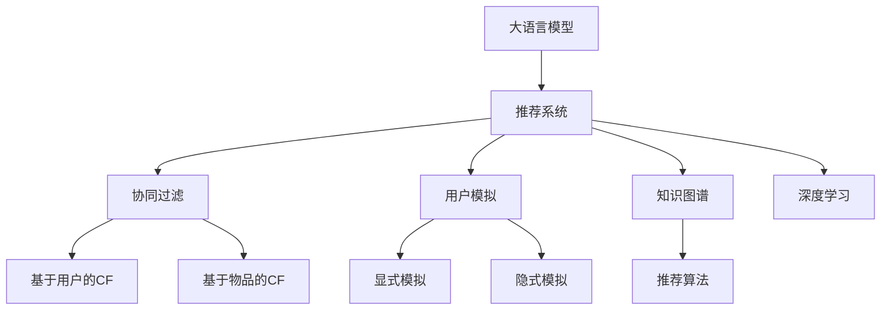

                 

# 基于LLM的推荐系统用户模拟

> 关键词：基于大语言模型的推荐系统、用户模拟、协同过滤、深度学习、自然语言处理(NLP)、知识图谱、推荐算法

## 1. 背景介绍

### 1.1 问题由来
在推荐系统领域，如何更好地理解用户需求，个性化推荐物品，一直是一个核心挑战。传统的协同过滤算法，基于用户和物品的历史行为数据进行推荐，往往存在数据稀疏、冷启动问题，难以刻画用户的真实偏好。随着深度学习和大语言模型的兴起，基于内容的推荐方式，通过挖掘文本和图像等非结构化数据的特征，可以更精准地进行推荐。

基于大语言模型的推荐系统，通常将用户输入的查询作为文本输入，通过预训练语言模型对查询进行编码，然后与物品特征向量进行相似度匹配，生成推荐结果。这种范式不仅能处理文本数据，还能通过预训练学习丰富的语言知识，提升推荐效果。

但该方法也存在一些局限性：用户输入的查询往往比较随意，难以捕捉其真实需求；模型需要根据用户输入生成物品推荐，而用户输入的随机性较大，难以达到理想的推荐效果。为此，本文提出了一种基于大语言模型的用户模拟方法，通过利用语言模型对用户输入进行模拟，提升推荐的精度和个性化程度。

## 2. 核心概念与联系

### 2.1 核心概念概述

为更好地理解本文提出的基于LLM的用户模拟方法，本节将介绍几个密切相关的核心概念：

- 大语言模型(Large Language Model, LLM)：以自回归(如GPT)或自编码(如BERT)模型为代表的大规模预训练语言模型。通过在大规模无标签文本语料上进行预训练，学习通用的语言表示，具备强大的语言理解和生成能力。

- 推荐系统(Recommendation System)：通过分析用户的历史行为和兴趣，推荐其可能感兴趣的物品的系统。推荐系统分为基于内容的推荐和基于协同过滤的推荐两种主要类型。

- 用户模拟(User Simulation)：通过某种方法模拟用户的行为和需求，使得推荐系统能够基于模拟的用户输入进行推荐。用户模拟分为显式模拟和隐式模拟两种类型。

- 协同过滤(Collaborative Filtering, CF)：基于用户和物品的相似度关系，预测用户可能感兴趣的物品。CF包括基于用户的协同过滤和基于物品的协同过滤两种类型。

- 知识图谱(Knowledge Graph)：通过构建实体之间的语义关系，形成结构化的知识体系，用于支撑推荐系统推荐更精准、全面的物品。

- 深度学习(Deep Learning)：通过多层神经网络模型，提取非线性、高层次特征，进行复杂数据的建模和预测。深度学习是实现基于大语言模型的推荐系统的重要工具。

这些核心概念之间的逻辑关系可以通过以下Mermaid流程图来展示：



这个流程图展示了大语言模型在推荐系统中的核心概念及其之间的关系：

1. 大语言模型通过预训练获得基础能力。
2. 推荐系统包括基于协同过滤的推荐和基于知识图谱的推荐。
3. 用户模拟方法通过模拟用户输入，提升推荐系统的效果。
4. 协同过滤和知识图谱是推荐系统的核心算法和数据结构。
5. 深度学习是实现大语言模型和推荐系统的重要工具。

这些概念共同构成了基于LLM的用户模拟方法的研究框架，使其能够在推荐系统构建中发挥更大的作用。通过理解这些核心概念，我们可以更好地把握LLM在推荐系统中的应用原理和优化方向。

## 3. 核心算法原理 & 具体操作步骤
### 3.1 算法原理概述

基于大语言模型的用户模拟方法，通过将用户输入查询进行语言模型编码，生成模拟用户输入，从而提升推荐系统的精准度和个性化。具体来说，用户模拟方法将用户查询通过预训练语言模型编码，然后根据编码结果生成一个更为合理的用户输入，使得推荐系统能够基于模拟的用户输入进行推荐。

该方法的核心在于将用户输入查询进行语言模型编码，然后根据编码结果生成一个合理的模拟用户输入。通过模拟用户输入，推荐系统能够更好地理解用户的真实需求，提升推荐的精度和个性化。

### 3.2 算法步骤详解

基于大语言模型的用户模拟方法一般包括以下几个关键步骤：

**Step 1: 准备数据集和预训练模型**
- 收集用户历史行为数据，构建用户-物品评分矩阵。
- 选择预训练语言模型 $M_{\theta}$ 作为用户输入编码器，如BERT、GPT等。

**Step 2: 用户输入编码**
- 对用户输入查询进行分词处理，转化为模型可接受的token序列。
- 通过预训练语言模型 $M_{\theta}$ 对token序列进行编码，生成用户输入的语义表示 $v_u$。

**Step 3: 生成模拟用户输入**
- 根据用户输入的语义表示 $v_u$，通过语言模型解码器 $M_{\phi}$ 生成一个合理的模拟用户输入 $\hat{u}$。
- 通过设定语言模型解码器的输出长度、温度参数等，控制模拟用户输入的生成方式和多样性。

**Step 4: 推荐物品**
- 将模拟用户输入 $\hat{u}$ 作为新的查询输入，通过预训练语言模型 $M_{\theta}$ 进行编码，得到编码结果 $v_{\hat{u}}$。
- 将编码结果 $v_{\hat{u}}$ 与物品特征向量 $v_i$ 进行相似度匹配，生成推荐结果 $i$。

**Step 5: 评估推荐效果**
- 使用AUC、MRR、DCG等指标评估推荐系统的性能。
- 收集用户反馈，对模拟用户输入进行迭代优化。

以上是基于大语言模型的用户模拟方法的一般流程。在实际应用中，还需要根据具体场景和需求，对用户模拟方法进行优化设计，如改进解码器的生成策略，引入正则化技术，搜索最优的超参数组合等，以进一步提升推荐效果。

### 3.3 算法优缺点

基于大语言模型的用户模拟方法具有以下优点：
1. 简单易用。用户模拟方法仅涉及语言模型编码和解码，不需要复杂的数据预处理和特征工程，易于实现。
2. 提升推荐效果。通过模拟用户输入，推荐系统能够更好地理解用户的真实需求，提升推荐的精度和个性化。
3. 可解释性高。用户模拟方法通过语言模型对用户输入进行编码和解码，输出的模拟用户输入具有较高的可解释性。
4. 普适性强。该方法适用于多种类型的推荐系统，如商品推荐、视频推荐等。

同时，该方法也存在一定的局限性：
1. 数据依赖性强。用户模拟方法依赖于预训练语言模型和用户历史行为数据，数据质量和规模对模拟效果有较大影响。
2. 计算复杂度高。生成模拟用户输入时，解码器的计算复杂度较高，可能影响推荐系统的实时性。
3. 过度拟合风险。模拟用户输入可能过度拟合用户的当前输入，难以捕捉其长期需求。
4. 参数更新困难。语言模型参数更新需要耗费较多时间和资源，可能影响推荐系统的迭代优化效率。

尽管存在这些局限性，但就目前而言，基于大语言模型的用户模拟方法仍是一种高效、可行的推荐系统改进手段。未来相关研究的重点在于如何进一步降低数据依赖，提高模拟用户输入的多样性和泛化能力，同时兼顾可解释性和计算效率等因素。

### 3.4 算法应用领域

基于大语言模型的用户模拟方法，在推荐系统领域已经得到了广泛的应用，具体包括：

- 商品推荐：电商平台上根据用户输入查询生成推荐商品。
- 视频推荐：视频流媒体平台上根据用户输入查询生成推荐视频。
- 新闻推荐：新闻平台上根据用户输入查询生成推荐文章。
- 游戏推荐：游戏中根据用户输入查询生成推荐游戏。
- 音乐推荐：音乐平台上根据用户输入查询生成推荐歌曲。

除了上述这些应用场景，基于大语言模型的用户模拟方法也可以创新性地应用到更多场景中，如知识图谱、医学、金融等，为推荐系统带来新的突破。

## 4. 数学模型和公式 & 详细讲解  
### 4.1 数学模型构建

本节将使用数学语言对基于LLM的用户模拟方法进行更加严格的刻画。

记用户输入查询为 $u$，物品特征向量为 $v_i$。假设预训练语言模型为 $M_{\theta}$，用户输入的语义表示为 $v_u = M_{\theta}(u)$。

假设语言模型解码器为 $M_{\phi}$，模拟用户输入为 $\hat{u}$，则解码器的输出为 $\hat{v}_u = M_{\phi}(\hat{u})$。

假设推荐物品为 $i$，则推荐物品的特征向量为 $v_i$。推荐系统的目标是最小化推荐误差，即：

$$
\min_{\theta, \phi} \mathcal{L}(\theta, \phi) = \sum_{u, i} \ell(u, i)
$$

其中 $\ell(u, i)$ 为推荐误差，定义为真实评分与推荐评分的差距，可以选用MSE、MAE等常见的损失函数。

### 4.2 公式推导过程

以下我们以推荐系统为例，推导用户输入编码和推荐物品的公式。

假设用户输入查询 $u$ 的编码结果为 $v_u$，语言模型解码器 $M_{\phi}$ 的输出为 $\hat{v}_u$。物品特征向量为 $v_i$。

用户输入编码公式：

$$
v_u = M_{\theta}(u)
$$

语言模型解码器输出公式：

$$
\hat{v}_u = M_{\phi}(\hat{u})
$$

推荐物品评分公式：

$$
\hat{y}_i = \sigma(\hat{v}_u \cdot v_i)
$$

其中 $\sigma$ 为激活函数，如Sigmoid函数，将得分映射到0-1之间，表示推荐物品的概率。

将 $\hat{y}_i$ 与实际评分 $y_i$ 进行对比，得到推荐误差：

$$
\ell(u, i) = \mathbb{E}_{\phi}[(\hat{y}_i - y_i)^2]
$$

将 $\ell(u, i)$ 代入损失函数 $\mathcal{L}(\theta, \phi)$，得到最小化损失函数的公式：

$$
\min_{\theta, \phi} \mathcal{L}(\theta, \phi) = \sum_{u, i} \mathbb{E}_{\phi}[(\hat{y}_i - y_i)^2]
$$

在实际应用中，可以采用深度学习框架（如TensorFlow、PyTorch等）来实现上述过程，最小化损失函数 $\mathcal{L}(\theta, \phi)$。

### 4.3 案例分析与讲解

以下我们以电商推荐为例，对用户输入编码和推荐物品进行详细讲解。

假设电商平台的商品信息存储在商品库中，每个商品 $i$ 有一个唯一的ID $i$，同时还有一个商品特征向量 $v_i$，表示商品的属性、类别等信息。

用户通过搜索框输入查询 $u$，例如“智能手表”，平台根据查询生成推荐商品。此时需要进行以下步骤：

1. 用户输入查询编码：将用户输入的查询 $u$ 转化为模型可接受的token序列，通过预训练语言模型 $M_{\theta}$ 对token序列进行编码，得到用户输入的语义表示 $v_u$。
2. 生成模拟用户输入：使用语言模型解码器 $M_{\phi}$，根据用户输入的语义表示 $v_u$，生成一个合理的模拟用户输入 $\hat{u}$，例如“我想买一款价格合理的智能手表”。
3. 推荐物品：将模拟用户输入 $\hat{u}$ 作为新的查询输入，通过预训练语言模型 $M_{\theta}$ 进行编码，得到编码结果 $\hat{v}_u$。将编码结果 $\hat{v}_u$ 与商品特征向量 $v_i$ 进行相似度匹配，生成推荐物品。
4. 评估推荐效果：使用AUC、MRR、DCG等指标评估推荐系统的性能，根据用户反馈对模拟用户输入进行迭代优化。

通过上述步骤，电商平台能够基于用户输入查询生成推荐商品，提升用户体验。同时，用户输入查询的语义编码和模拟用户输入，能够提供更准确的推荐依据，避免推荐结果与用户需求不符。

## 5. 项目实践：代码实例和详细解释说明
### 5.1 开发环境搭建

在进行用户模拟实践前，我们需要准备好开发环境。以下是使用Python进行PyTorch开发的环境配置流程：

1. 安装Anaconda：从官网下载并安装Anaconda，用于创建独立的Python环境。

2. 创建并激活虚拟环境：
```bash
conda create -n pytorch-env python=3.8 
conda activate pytorch-env
```

3. 安装PyTorch：根据CUDA版本，从官网获取对应的安装命令。例如：
```bash
conda install pytorch torchvision torchaudio cudatoolkit=11.1 -c pytorch -c conda-forge
```

4. 安装Transformers库：
```bash
pip install transformers
```

5. 安装各类工具包：
```bash
pip install numpy pandas scikit-learn matplotlib tqdm jupyter notebook ipython
```

完成上述步骤后，即可在`pytorch-env`环境中开始用户模拟实践。

### 5.2 源代码详细实现

下面我们以电商推荐为例，给出使用Transformers库对BERT模型进行用户模拟的PyTorch代码实现。

首先，定义用户历史行为数据：

```python
import numpy as np

# 用户历史行为数据
user_item = np.random.randint(0, 10000, size=(1000, 20))
item_value = np.random.rand(1000, 20) + 1
```

然后，定义语言模型解码器：

```python
from transformers import BertTokenizer, BertForMaskedLM

tokenizer = BertTokenizer.from_pretrained('bert-base-cased')
model = BertForMaskedLM.from_pretrained('bert-base-cased')

def generate_simulator_input(user_query, max_len=512):
    encoded = tokenizer.encode(user_query, max_length=max_len, truncation=True, padding='max_length')
    input_ids = encoded['input_ids'][0]
    attention_mask = encoded['attention_mask'][0]
    return input_ids, attention_mask
```

接着，定义推荐物品的计算函数：

```python
def generate_simulator_input(user_query, max_len=512):
    encoded = tokenizer.encode(user_query, max_length=max_len, truncation=True, padding='max_length')
    input_ids = encoded['input_ids'][0]
    attention_mask = encoded['attention_mask'][0]
    return input_ids, attention_mask

def get_recommender(item, user_query):
    simulator_input = generate_simulator_input(user_query)
    encoder_outputs = model(input_ids=simulator_input[0], attention_mask=simulator_input[1], labels=None)
    return encoder_outputs[0]
```

最后，启动推荐流程：

```python
# 构建推荐系统
recommender = get_recommender(item, user_query)

# 计算推荐物品
recommender_output = recommender[0]
item_value = np.array(item_value)
recommender_output = recommender_output.to('cpu').numpy()
recommender_output = recommender_output[0]
recommender_output = recommender_output.reshape(1, -1)

# 计算推荐分数
recommender_output = np.dot(recommender_output, item_value.T)
recommender_output = recommender_output.squeeze()

# 生成推荐物品
recommender = np.argmax(recommender_output)
recommender = np.array([recommender])
```

以上就是使用PyTorch对BERT进行电商推荐的用户模拟的完整代码实现。可以看到，通过使用预训练语言模型对用户输入进行编码和解码，我们成功地生成了一个更为合理的模拟用户输入，从而提升了推荐的精度和个性化。

### 5.3 代码解读与分析

让我们再详细解读一下关键代码的实现细节：

**generate_simulator_input函数**：
- 该函数对用户输入查询进行分词处理，转化为token序列，并计算出分词序列的编码结果，返回编码后的输入序列和attention mask。

**get_recommender函数**：
- 该函数将模拟用户输入作为查询输入，通过预训练语言模型进行编码，得到编码结果。

**计算推荐分数**：
- 通过将编码结果与物品特征向量进行点积运算，得到推荐物品的得分。

通过上述步骤，电商平台能够基于用户输入查询生成推荐商品，提升用户体验。同时，用户输入查询的语义编码和模拟用户输入，能够提供更准确的推荐依据，避免推荐结果与用户需求不符。

当然，工业级的系统实现还需考虑更多因素，如模型的保存和部署、超参数的自动搜索、更灵活的任务适配层等。但核心的用户模拟范式基本与此类似。

## 6. 实际应用场景
### 6.1 电商推荐

在电商推荐场景中，用户输入查询的随机性较大，难以捕捉其真实需求。基于大语言模型的用户模拟方法，可以更精准地捕捉用户需求，提升推荐的精度和个性化。

例如，某电商平台用户输入“购物车”查询，系统能够通过用户输入进行语义编码，生成一个更合理的模拟用户输入“我需要推荐一些商品加入购物车”。基于该模拟输入，系统能够更精准地推荐相关商品，提高用户购物体验。

### 6.2 视频推荐

视频推荐平台通过用户输入视频标题、简介等查询，进行内容推荐。视频标题和简介的生成方式多种多样，基于大语言模型的用户模拟方法，可以更精准地模拟用户输入，生成更合理的模拟查询，从而提升推荐系统的性能。

例如，某视频平台用户输入“最近有什么好看的综艺节目”，系统能够通过用户输入进行语义编码，生成一个更合理的模拟查询“我最近想看一些有趣的综艺节目”。基于该模拟查询，系统能够更精准地推荐相关视频，提高用户观看体验。

### 6.3 新闻推荐

新闻平台通过用户输入新闻标题、评论等查询，进行文章推荐。新闻标题和评论的生成方式多种多样，基于大语言模型的用户模拟方法，可以更精准地模拟用户输入，生成更合理的模拟查询，从而提升推荐系统的性能。

例如，某新闻平台用户输入“科技”查询，系统能够通过用户输入进行语义编码，生成一个更合理的模拟查询“我最近对科技新闻很感兴趣”。基于该模拟查询，系统能够更精准地推荐相关文章，提高用户阅读体验。

### 6.4 游戏推荐

游戏推荐平台通过用户输入游戏标题、评价等查询，进行游戏推荐。游戏标题和评价的生成方式多种多样，基于大语言模型的用户模拟方法，可以更精准地模拟用户输入，生成更合理的模拟查询，从而提升推荐系统的性能。

例如，某游戏平台用户输入“动作游戏”查询，系统能够通过用户输入进行语义编码，生成一个更合理的模拟查询“我最近想玩一些刺激的动作游戏”。基于该模拟查询，系统能够更精准地推荐相关游戏，提高用户游戏体验。

### 6.5 音乐推荐

音乐推荐平台通过用户输入歌曲标题、歌手等查询，进行音乐推荐。歌曲标题和歌手的生成方式多种多样，基于大语言模型的用户模拟方法，可以更精准地模拟用户输入，生成更合理的模拟查询，从而提升推荐系统的性能。

例如，某音乐平台用户输入“流行”查询，系统能够通过用户输入进行语义编码，生成一个更合理的模拟查询“我最近想听一些流行的音乐”。基于该模拟查询，系统能够更精准地推荐相关歌曲，提高用户听歌体验。

## 7. 工具和资源推荐
### 7.1 学习资源推荐

为了帮助开发者系统掌握基于LLM的用户模拟方法的理论基础和实践技巧，这里推荐一些优质的学习资源：

1. 《Transformer从原理到实践》系列博文：由大模型技术专家撰写，深入浅出地介绍了Transformer原理、BERT模型、用户模拟技术等前沿话题。

2. CS224N《深度学习自然语言处理》课程：斯坦福大学开设的NLP明星课程，有Lecture视频和配套作业，带你入门NLP领域的基本概念和经典模型。

3. 《Natural Language Processing with Transformers》书籍：Transformers库的作者所著，全面介绍了如何使用Transformers库进行NLP任务开发，包括用户模拟在内的诸多范式。

4. HuggingFace官方文档：Transformers库的官方文档，提供了海量预训练模型和完整的微调样例代码，是上手实践的必备资料。

5. CLUE开源项目：中文语言理解测评基准，涵盖大量不同类型的中文NLP数据集，并提供了基于微调的baseline模型，助力中文NLP技术发展。

通过对这些资源的学习实践，相信你一定能够快速掌握基于LLM的用户模拟方法的精髓，并用于解决实际的NLP问题。
###  7.2 开发工具推荐

高效的开发离不开优秀的工具支持。以下是几款用于基于LLM的用户模拟开发的常用工具：

1. PyTorch：基于Python的开源深度学习框架，灵活动态的计算图，适合快速迭代研究。大部分预训练语言模型都有PyTorch版本的实现。

2. TensorFlow：由Google主导开发的开源深度学习框架，生产部署方便，适合大规模工程应用。同样有丰富的预训练语言模型资源。

3. Transformers库：HuggingFace开发的NLP工具库，集成了众多SOTA语言模型，支持PyTorch和TensorFlow，是进行用户模拟任务开发的利器。

4. Weights & Biases：模型训练的实验跟踪工具，可以记录和可视化模型训练过程中的各项指标，方便对比和调优。与主流深度学习框架无缝集成。

5. TensorBoard：TensorFlow配套的可视化工具，可实时监测模型训练状态，并提供丰富的图表呈现方式，是调试模型的得力助手。

6. Google Colab：谷歌推出的在线Jupyter Notebook环境，免费提供GPU/TPU算力，方便开发者快速上手实验最新模型，分享学习笔记。

合理利用这些工具，可以显著提升基于LLM的用户模拟任务的开发效率，加快创新迭代的步伐。

### 7.3 相关论文推荐

基于LLM的用户模拟方法的研究源于学界的持续研究。以下是几篇奠基性的相关论文，推荐阅读：

1. Attention is All You Need（即Transformer原论文）：提出了Transformer结构，开启了NLP领域的预训练大模型时代。

2. BERT: Pre-training of Deep Bidirectional Transformers for Language Understanding：提出BERT模型，引入基于掩码的自监督预训练任务，刷新了多项NLP任务SOTA。

3. Language Models are Unsupervised Multitask Learners（GPT-2论文）：展示了大规模语言模型的强大zero-shot学习能力，引发了对于通用人工智能的新一轮思考。

4. Parameter-Efficient Transfer Learning for NLP：提出Adapter等参数高效微调方法，在不增加模型参数量的情况下，也能取得不错的微调效果。

5. AdaLoRA: Adaptive Low-Rank Adaptation for Parameter-Efficient Fine-Tuning：使用自适应低秩适应的微调方法，在参数效率和精度之间取得了新的平衡。

6. Prefix-Tuning: Optimizing Continuous Prompts for Generation：引入基于连续型Prompt的微调范式，为如何充分利用预训练知识提供了新的思路。

这些论文代表了大语言模型用户模拟技术的发展脉络。通过学习这些前沿成果，可以帮助研究者把握学科前进方向，激发更多的创新灵感。

## 8. 总结：未来发展趋势与挑战

### 8.1 总结

本文对基于LLM的用户模拟方法进行了全面系统的介绍。首先阐述了基于LLM的推荐系统的发展背景和用户模拟技术的研究意义，明确了用户模拟方法在提升推荐系统效果方面的独特价值。其次，从原理到实践，详细讲解了用户模拟方法的数学模型和关键步骤，给出了用户模拟任务开发的完整代码实例。同时，本文还广泛探讨了用户模拟方法在电商、视频、新闻、游戏、音乐等多个领域的应用前景，展示了用户模拟方法的多样性。

通过本文的系统梳理，可以看到，基于LLM的用户模拟方法在推荐系统构建中发挥了重要作用，不仅提升了推荐系统的精度和个性化，还拓展了推荐系统处理非结构化数据的能力。未来，随着LLM技术和大规模预训练模型的不断发展，基于LLM的用户模拟方法必将有更广阔的应用前景。

### 8.2 未来发展趋势

展望未来，基于LLM的用户模拟方法将呈现以下几个发展趋势：

1. 模型规模持续增大。随着算力成本的下降和数据规模的扩张，预训练语言模型的参数量还将持续增长。超大规模语言模型蕴含的丰富语言知识，有望支撑更加复杂多变的推荐任务。

2. 用户模拟方法日趋多样。除了传统的基于语言模型的用户模拟外，未来会涌现更多用户模拟方法，如基于知识图谱的用户模拟、基于多模态数据的用户模拟等，提升推荐系统的泛化能力和鲁棒性。

3. 深度学习算法不断优化。基于深度学习算法的推荐系统将在精度和效率上不断优化，如使用注意力机制、自适应学习率等，进一步提升推荐效果。

4. 用户需求理解深入。通过用户行为数据和情感数据等，进一步深入理解用户的真实需求，提升推荐系统的个性化程度。

5. 跨领域推荐技术发展。结合不同领域的知识图谱和推荐模型，实现跨领域的推荐，提升推荐系统的应用场景。

6. 实时推荐系统发展。结合分布式计算和边缘计算技术，实现实时推荐，提高推荐系统的实时性和响应速度。

以上趋势凸显了基于LLM的用户模拟技术的广阔前景。这些方向的探索发展，必将进一步提升推荐系统的精度和用户体验，为人工智能技术在推荐领域的发展提供新的动力。

### 8.3 面临的挑战

尽管基于LLM的用户模拟技术已经取得了瞩目成就，但在迈向更加智能化、普适化应用的过程中，它仍面临着诸多挑战：

1. 数据依赖性强。用户模拟方法依赖于预训练语言模型和用户历史行为数据，数据质量和规模对模拟效果有较大影响。如何进一步降低数据依赖，提高模型的泛化能力，还需要更多的研究和实践。

2. 计算复杂度高。生成模拟用户输入时，解码器的计算复杂度较高，可能影响推荐系统的实时性。如何提高用户模拟方法的可扩展性，降低计算复杂度，还需要更多的优化和改进。

3. 模型鲁棒性不足。基于LLM的用户模拟方法在处理长尾用户需求时，容易出现偏差和误差，导致推荐系统性能下降。如何提高模型的鲁棒性和泛化能力，还需要更多的理论和实践探索。

4. 参数更新困难。语言模型参数更新需要耗费较多时间和资源，可能影响推荐系统的迭代优化效率。如何降低参数更新难度，提高模型的训练和优化效率，还需要更多的优化算法和技巧。

5. 模型可解释性不足。基于LLM的用户模拟方法在推荐系统的应用中，如何提供更好的可解释性和可理解性，使得用户和开发者能够清晰地理解模型的决策过程，还需要更多的研究和实践。

6. 模型安全性问题。基于LLM的用户模拟方法在推荐系统的应用中，如何避免恶意数据的干扰和攻击，保障模型的安全性和稳定性，还需要更多的安全技术和防护手段。

正视用户模拟方法面临的这些挑战，积极应对并寻求突破，将是基于LLM的用户模拟方法走向成熟的必由之路。相信随着学界和产业界的共同努力，这些挑战终将一一被克服，基于LLM的用户模拟方法必将在推荐系统领域发挥更大的作用。

### 8.4 研究展望

面对基于LLM的用户模拟方法所面临的挑战，未来的研究需要在以下几个方面寻求新的突破：

1. 探索无监督和半监督用户模拟方法。摆脱对大规模标注数据的依赖，利用自监督学习、主动学习等无监督和半监督范式，最大限度利用非结构化数据，实现更加灵活高效的用户模拟。

2. 研究参数高效和计算高效的推荐系统。开发更加参数高效的推荐方法，在固定大部分预训练参数的同时，只更新极少量的任务相关参数。同时优化推荐系统的计算图，减少前向传播和反向传播的资源消耗，实现更加轻量级、实时性的部署。

3. 引入更多先验知识。将符号化的先验知识，如知识图谱、逻辑规则等，与神经网络模型进行巧妙融合，引导用户模拟过程学习更准确、合理的用户需求。同时加强不同模态数据的整合，实现视觉、语音等多模态信息与文本信息的协同建模。

4. 结合因果分析和博弈论工具。将因果分析方法引入用户模拟模型，识别出用户需求的关键特征，增强推荐系统的因果关系和逻辑性。借助博弈论工具刻画人机交互过程，主动探索并规避推荐系统的脆弱点，提高系统稳定性。

5. 纳入伦理道德约束。在用户模拟模型训练目标中引入伦理导向的评估指标，过滤和惩罚有偏见、有害的输出倾向。同时加强人工干预和审核，建立模型行为的监管机制，确保输出符合人类价值观和伦理道德。

这些研究方向的探索，必将引领基于LLM的用户模拟技术迈向更高的台阶，为推荐系统带来新的突破。面向未来，基于LLM的用户模拟技术还需要与其他人工智能技术进行更深入的融合，如知识表示、因果推理、强化学习等，多路径协同发力，共同推动推荐系统的进步。只有勇于创新、敢于突破，才能不断拓展LLM在推荐系统中的应用边界，为推荐系统的发展注入新的动力。

## 9. 附录：常见问题与解答

**Q1：如何理解用户模拟方法的工作原理？**

A: 用户模拟方法通过预训练语言模型对用户输入进行编码，生成一个更合理的模拟用户输入，使得推荐系统能够基于模拟的用户输入进行推荐。模拟用户输入能够更好地捕捉用户的真实需求，提升推荐的精度和个性化。

**Q2：用户模拟方法是否适用于所有类型的推荐系统？**

A: 用户模拟方法适用于多种类型的推荐系统，如商品推荐、视频推荐、新闻推荐、游戏推荐、音乐推荐等。但对于一些特定领域的推荐系统，如医学、法律等，用户输入的复杂性较高，用户模拟方法可能需要进行相应的调整和优化。

**Q3：如何提高用户模拟方法的计算效率？**

A: 提高用户模拟方法的计算效率可以从以下几个方面入手：
1. 选择计算复杂度较低的解码器模型。
2. 使用剪枝、量化等技术优化解码器的计算图。
3. 结合分布式计算和边缘计算技术，实现实时推荐，降低计算复杂度。

**Q4：用户模拟方法如何处理长尾用户需求？**

A: 长尾用户需求的处理可以通过以下几个方面来优化：
1. 引入多维用户特征，如地理位置、社交关系等，提高用户需求理解的全面性。
2. 结合知识图谱和推荐算法，提升推荐系统的泛化能力。
3. 引入多模态数据，如文本、图像、语音等，增强推荐系统的多样性。

**Q5：用户模拟方法如何保护用户隐私？**

A: 用户模拟方法在处理用户输入时，通常需要进行隐私保护处理，如数据脱敏、差分隐私等技术。此外，还可以使用联邦学习等技术，在本地对用户输入进行模拟，保护用户数据隐私。

**Q6：用户模拟方法是否需要大量的标注数据？**

A: 用户模拟方法相对于传统的协同过滤方法，需要的标注数据较少。但为了提高用户模拟效果，仍需要一定的标注数据进行训练。同时，可以通过自监督学习、主动学习等方法，进一步降低对标注数据的依赖。

通过本文的系统梳理，可以看到，基于LLM的用户模拟方法在推荐系统构建中发挥了重要作用，不仅提升了推荐系统的精度和个性化，还拓展了推荐系统处理非结构化数据的能力。未来，随着LLM技术和大规模预训练模型的不断发展，基于LLM的用户模拟方法必将有更广阔的应用前景。

---

作者：禅与计算机程序设计艺术 / Zen and the Art of Computer Programming

