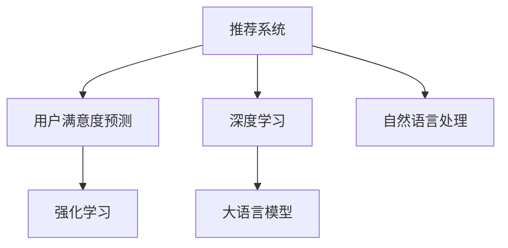

                 

# 基于LLM的推荐系统用户满意度预测

> 关键词：大语言模型,推荐系统,用户满意度预测,深度学习,自然语言处理

## 1. 背景介绍

### 1.1 问题由来

推荐系统已成为互联网公司中不可或缺的业务组成部分，影响着用户的选择、购买行为及满意度。而传统的推荐系统往往基于用户的静态数据（如点击、浏览、评分等行为）进行预测，忽略了用户反馈与评价的重要信息。通过大语言模型（Large Language Model, LLM），推荐系统可以更全面地整合用户评价信息，预测用户满意度，为用户提供更为精准、个性化的推荐。

### 1.2 问题核心关键点

基于大语言模型的推荐系统用户满意度预测，旨在通过分析用户对推荐结果的反馈（如评价、评论、评分等），预测其满意度。这一过程基于深度学习与自然语言处理（NLP）技术，将文本信息转化为数值预测结果，进而指导推荐算法的迭代优化。

核心问题包括：
- 如何有效整合用户反馈数据？
- 如何通过深度学习模型进行满意度预测？
- 预测结果如何与推荐算法结合？

### 1.3 问题研究意义

进行用户满意度预测，可以有效提高推荐系统的精准度和用户满意度，促进其经济效益和社会效益。通过预测用户对推荐结果的满意度，推荐系统可以根据用户反馈优化推荐内容，进而提升整体推荐效果。

具体意义包括：
- 提高推荐内容的相关性与个性化程度，增强用户体验。
- 实时监测用户满意度，优化推荐算法，提升商业价值。
- 辅助产品设计与服务优化，构建良性循环的用户生态。
- 辅助决策支持，帮助公司准确把握市场动态，及时调整策略。

## 2. 核心概念与联系

### 2.1 核心概念概述

为更好地理解基于大语言模型的推荐系统用户满意度预测方法，本节将介绍几个关键概念：

- 推荐系统（Recommendation System, RS）：通过分析用户行为数据，预测用户可能感兴趣的商品或内容，并提供个性化的推荐。

- 用户满意度（User Satisfaction, US）：用户对其接收到的推荐内容的主观评价，可以通过评价、评论、评分等方式体现。

- 大语言模型（LLM）：通过大规模无标签文本数据预训练得到的语言模型，具备强大的文本理解与生成能力。

- 深度学习（Deep Learning）：基于神经网络等模型，通过多层次的学习过程，实现对复杂数据的高效表示与处理。

- 自然语言处理（NLP）：涉及文本的自动化处理，包括文本分类、信息抽取、情感分析等技术。

- 强化学习（Reinforcement Learning, RL）：通过奖励机制优化决策过程，提升推荐系统的性能。

这些概念之间的逻辑关系可以通过以下Mermaid流程图来展示：



这个流程图展示了大语言模型在推荐系统中的核心作用，通过深度学习与自然语言处理技术，结合大语言模型进行用户满意度预测，辅助推荐系统的优化。

## 3. 核心算法原理 & 具体操作步骤

### 3.1 算法原理概述

基于大语言模型的推荐系统用户满意度预测，主要包括以下几个步骤：

1. **数据收集与处理**：收集用户对推荐结果的评价数据，包括评价文本、评分等。
2. **特征提取与文本预处理**：将文本数据转换为模型可以处理的形式，如通过分词、去停用词、词向量等方法。
3. **大语言模型预测**：使用预训练的大语言模型，对文本评价进行情感分析或评分预测。
4. **模型训练与优化**：根据预测结果与真实标签进行模型训练，使用优化算法调整模型参数，提高预测精度。
5. **模型应用与反馈**：将训练好的模型应用于推荐系统，实时更新预测结果，辅助推荐算法优化。

### 3.2 算法步骤详解

#### 3.2.1 数据收集与处理

1. **评价数据收集**：
   - 从推荐系统日志中提取用户对推荐结果的评价文本。
   - 标注好评价文本的情感极性（如正面、负面、中性），或直接使用评分。

2. **文本预处理**：
   - 分词：将文本划分成词汇序列，保留有意义的词汇，去除停用词。
   - 词向量表示：将词汇序列转换为向量表示，便于大语言模型进行理解。
   - 文本增强：如回译、同义词替换等，扩充训练集，增加多样性。

#### 3.2.2 大语言模型预测

1. **选择大语言模型**：
   - 如BERT、GPT等，已经在大量文本数据上进行了预训练，具备较强的情感理解与生成能力。

2. **情感分析**：
   - 使用BERT等模型对评价文本进行情感分析，输出情感极性概率。
   - 通过计算情感极性概率与真实标签的交叉熵损失，更新模型参数。

3. **评分预测**：
   - 使用GPT等模型对评价文本进行评分预测，输出预测评分。
   - 通过计算预测评分与真实评分的均方误差损失，更新模型参数。

#### 3.2.3 模型训练与优化

1. **选择合适的优化算法**：
   - 如Adam、SGD等，调整学习率、批大小等超参数。

2. **模型训练**：
   - 将处理后的文本数据与真实标签输入模型，进行前向传播和反向传播，更新模型参数。
   - 使用正则化技术如L2正则、Dropout等，防止过拟合。

3. **模型评估**：
   - 在验证集上评估模型性能，如精确率、召回率、F1值等指标。
   - 根据评估结果调整模型结构与参数，进行迭代优化。

#### 3.2.4 模型应用与反馈

1. **模型部署**：
   - 将训练好的模型部署到推荐系统后端，实时处理用户评价数据。

2. **反馈优化**：
   - 实时收集用户的满意度反馈，用于模型再训练与优化。
   - 动态调整推荐算法，提高推荐精度与个性化程度。

### 3.3 算法优缺点

基于大语言模型的推荐系统用户满意度预测有以下优点：
- 整合用户评价数据，提升推荐系统的个性化与精准度。
- 通过情感分析与评分预测，全面理解用户反馈。
- 实时更新模型，提高推荐系统效率与灵活性。

同时，该方法也存在一些局限性：
- 评价数据噪声大，模型容易受到低质量评价影响。
- 大语言模型依赖大量数据预训练，资源消耗大。
- 模型可解释性不足，难以理解具体预测依据。

尽管如此，基于大语言模型的用户满意度预测仍为推荐系统提供了新的解决方案，通过融合文本与评分信息，提高了推荐系统的整体性能。

### 3.4 算法应用领域

基于大语言模型的推荐系统用户满意度预测，已广泛应用于多个领域：

1. **电商推荐**：
   - 通过用户评论与评分，预测用户对推荐商品的满意度，优化电商推荐算法。
   - 实时监测商品评价，提升用户体验与满意度。

2. **内容推荐**：
   - 分析用户对推荐内容的评价与评分，优化视频、音乐、文章等内容的推荐。
   - 构建基于用户满意度的推荐模型，提高推荐效果。

3. **旅行推荐**：
   - 收集用户对旅行路线、酒店、景点等的评价与评分，预测用户满意度。
   - 根据用户反馈调整推荐算法，提升旅行推荐服务的质量。

4. **金融推荐**：
   - 通过分析用户对金融产品的评价与评分，预测用户满意度。
   - 根据用户反馈优化金融推荐模型，提高用户对金融服务的满意度。

## 4. 数学模型和公式 & 详细讲解 & 举例说明

### 4.1 数学模型构建

设用户评价文本为 $X$，评价文本对应的真实情感极性或评分为 $Y$，大语言模型为 $M_{\theta}$。假设 $M_{\theta}$ 在评价文本 $X$ 上的情感极性概率分布为 $\mathbb{P}(Y|X; \theta)$，目标是最小化预测值与真实值之间的差距，即：

$$
\min_{\theta} \mathbb{E}[\mathcal{L}(\mathbb{P}(Y|X; \theta), Y)]
$$

其中 $\mathcal{L}(\mathbb{P}(Y|X; \theta), Y)$ 为损失函数，可以选用交叉熵损失或均方误差损失。

### 4.2 公式推导过程

1. **交叉熵损失函数**：
   - 若评价文本 $X$ 对应的情感极性为 $y$，真实情感极性概率分布为 $\mathbb{P}(Y|X; \theta)$，则交叉熵损失为：

$$
\mathcal{L}_{CE}(\mathbb{P}(Y|X; \theta), y) = -y\log \mathbb{P}(Y|X; \theta) - (1-y)\log (1-\mathbb{P}(Y|X; \theta))
$$

2. **均方误差损失函数**：
   - 若评价文本 $X$ 对应的评分为 $y$，预测评分为 $\hat{y}$，则均方误差损失为：

$$
\mathcal{L}_{MSE}(\hat{y}, y) = \frac{1}{N}\sum_{i=1}^N (\hat{y_i} - y_i)^2
$$

### 4.3 案例分析与讲解

假设我们有一个基于GPT的推荐系统用户满意度预测模型，已知用户对某商品的评价文本为“商品质量很好，性价比高”，该评价的情感极性概率分布为 $\mathbb{P}(Y|X; \theta) = [0.8, 0.2]$，其中0.8为正面情感，0.2为负面情感。

1. **交叉熵损失计算**：
   - 假设真实情感极性为正面，则损失为：

$$
\mathcal{L}_{CE} = -1\log 0.8 + 0 = 0.223
$$

2. **均方误差损失计算**：
   - 假设真实评分为4分，预测评分为4.5分，则损失为：

$$
\mathcal{L}_{MSE} = \frac{(4.5-4)^2}{1} = 0.25
$$

## 5. 项目实践：代码实例和详细解释说明

### 5.1 开发环境搭建

在进行用户满意度预测实践前，我们需要准备好开发环境。以下是使用Python进行PyTorch开发的环境配置流程：

1. 安装Anaconda：从官网下载并安装Anaconda，用于创建独立的Python环境。

2. 创建并激活虚拟环境：
```bash
conda create -n pytorch-env python=3.8 
conda activate pytorch-env
```

3. 安装PyTorch：根据CUDA版本，从官网获取对应的安装命令。例如：
```bash
conda install pytorch torchvision torchaudio cudatoolkit=11.1 -c pytorch -c conda-forge
```

4. 安装Transformers库：
```bash
pip install transformers
```

5. 安装各类工具包：
```bash
pip install numpy pandas scikit-learn matplotlib tqdm jupyter notebook ipython
```

完成上述步骤后，即可在`pytorch-env`环境中开始实践。

### 5.2 源代码详细实现

下面我们以GPT模型为例，给出使用Transformers库对用户满意度进行预测的PyTorch代码实现。

首先，定义用户满意度预测的数据处理函数：

```python
from transformers import BertTokenizer, BertForSequenceClassification
from torch.utils.data import Dataset, DataLoader
import torch

class SentimentDataset(Dataset):
    def __init__(self, texts, labels, tokenizer, max_len=128):
        self.texts = texts
        self.labels = labels
        self.tokenizer = tokenizer
        self.max_len = max_len
        
    def __len__(self):
        return len(self.texts)
    
    def __getitem__(self, item):
        text = self.texts[item]
        label = self.labels[item]
        
        encoding = self.tokenizer(text, return_tensors='pt', max_length=self.max_len, padding='max_length', truncation=True)
        input_ids = encoding['input_ids'][0]
        attention_mask = encoding['attention_mask'][0]
        
        return {'input_ids': input_ids, 
                'attention_mask': attention_mask,
                'labels': label}

# 标签与id的映射
label2id = {'positive': 1, 'negative': 0}

# 创建dataset
tokenizer = BertTokenizer.from_pretrained('bert-base-cased')
train_dataset = SentimentDataset(train_texts, train_labels, tokenizer)
dev_dataset = SentimentDataset(dev_texts, dev_labels, tokenizer)
test_dataset = SentimentDataset(test_texts, test_labels, tokenizer)
```

然后，定义模型和优化器：

```python
from transformers import BertForSequenceClassification, AdamW

model = BertForSequenceClassification.from_pretrained('bert-base-cased', num_labels=2)

optimizer = AdamW(model.parameters(), lr=2e-5)
```

接着，定义训练和评估函数：

```python
from tqdm import tqdm

device = torch.device('cuda') if torch.cuda.is_available() else torch.device('cpu')
model.to(device)

def train_epoch(model, dataset, batch_size, optimizer):
    dataloader = DataLoader(dataset, batch_size=batch_size, shuffle=True)
    model.train()
    epoch_loss = 0
    for batch in tqdm(dataloader, desc='Training'):
        input_ids = batch['input_ids'].to(device)
        attention_mask = batch['attention_mask'].to(device)
        labels = batch['labels'].to(device)
        model.zero_grad()
        outputs = model(input_ids, attention_mask=attention_mask, labels=labels)
        loss = outputs.loss
        epoch_loss += loss.item()
        loss.backward()
        optimizer.step()
    return epoch_loss / len(dataloader)

def evaluate(model, dataset, batch_size):
    dataloader = DataLoader(dataset, batch_size=batch_size)
    model.eval()
    preds, labels = [], []
    with torch.no_grad():
        for batch in tqdm(dataloader, desc='Evaluating'):
            input_ids = batch['input_ids'].to(device)
            attention_mask = batch['attention_mask'].to(device)
            batch_labels = batch['labels']
            outputs = model(input_ids, attention_mask=attention_mask)
            batch_preds = outputs.logits.argmax(dim=2).to('cpu').tolist()
            batch_labels = batch_labels.to('cpu').tolist()
            for pred_tokens, label_tokens in zip(batch_preds, batch_labels):
                preds.append(pred_tokens[:len(label_tokens)])
                labels.append(label_tokens)
                
    print(classification_report(labels, preds))
```

最后，启动训练流程并在测试集上评估：

```python
epochs = 5
batch_size = 16

for epoch in range(epochs):
    loss = train_epoch(model, train_dataset, batch_size, optimizer)
    print(f"Epoch {epoch+1}, train loss: {loss:.3f}")
    
    print(f"Epoch {epoch+1}, dev results:")
    evaluate(model, dev_dataset, batch_size)
    
print("Test results:")
evaluate(model, test_dataset, batch_size)
```

以上就是使用PyTorch对GPT进行用户满意度预测的完整代码实现。可以看到，得益于Transformers库的强大封装，我们可以用相对简洁的代码完成GPT模型的加载和微调。

### 5.3 代码解读与分析

让我们再详细解读一下关键代码的实现细节：

**SentimentDataset类**：
- `__init__`方法：初始化文本、标签、分词器等关键组件。
- `__len__`方法：返回数据集的样本数量。
- `__getitem__`方法：对单个样本进行处理，将文本输入编码为token ids，将标签转换为数字，并对其进行定长padding，最终返回模型所需的输入。

**label2id字典**：
- 定义了情感标签与数字id之间的映射关系，用于将预测结果解码回真实的情感标签。

**训练和评估函数**：
- 使用PyTorch的DataLoader对数据集进行批次化加载，供模型训练和推理使用。
- 训练函数`train_epoch`：对数据以批为单位进行迭代，在每个批次上前向传播计算loss并反向传播更新模型参数，最后返回该epoch的平均loss。
- 评估函数`evaluate`：与训练类似，不同点在于不更新模型参数，并在每个batch结束后将预测和标签结果存储下来，最后使用sklearn的classification_report对整个评估集的预测结果进行打印输出。

**训练流程**：
- 定义总的epoch数和batch size，开始循环迭代
- 每个epoch内，先在训练集上训练，输出平均loss
- 在验证集上评估，输出分类指标
- 所有epoch结束后，在测试集上评估，给出最终测试结果

可以看到，PyTorch配合Transformers库使得GPT微调的用户满意度预测代码实现变得简洁高效。开发者可以将更多精力放在数据处理、模型改进等高层逻辑上，而不必过多关注底层的实现细节。

当然，工业级的系统实现还需考虑更多因素，如模型的保存和部署、超参数的自动搜索、更灵活的任务适配层等。但核心的微调范式基本与此类似。

## 6. 实际应用场景

### 6.1 智能客服系统

基于大语言模型的推荐系统用户满意度预测，可以应用于智能客服系统的构建。传统客服往往需要配备大量人力，高峰期响应缓慢，且一致性和专业性难以保证。而使用预测用户满意度的推荐系统，可以实时监测用户反馈，及时优化服务流程，提升客服质量。

在技术实现上，可以收集用户与智能客服的对话记录，分析用户对客服推荐的满意度。根据分析结果，调整客服推荐的策略和内容，提供更精准、个性化的服务。

### 6.2 电商平台

电商平台可以通过用户对商品评价的满意度预测，优化推荐算法，提升用户的购物体验。例如，在用户评价中，预测用户对推荐商品的满意度，并根据预测结果调整推荐算法，减少推荐内容与用户需求的不匹配。

具体而言，可以收集用户在电商平台上对商品、服务等的评价数据，分析用户对不同商品、服务的满意度。根据分析结果，优化推荐算法，提升推荐效果。

### 6.3 内容平台

内容平台可以通过用户对推荐内容的满意度预测，优化推荐算法，提高内容的曝光率和用户粘性。例如，在用户对推荐内容进行评价时，预测用户对内容的满意度，并根据预测结果调整推荐策略。

具体实现中，可以收集用户在视频、文章、音乐等平台上的评价数据，分析用户对不同内容形式的满意度。根据分析结果，优化推荐算法，提升推荐效果。

### 6.4 未来应用展望

随着大语言模型和用户满意度预测技术的不断发展，基于微调范式将在更多领域得到应用，为传统行业带来变革性影响。

在智慧医疗领域，通过用户对医疗服务的满意度预测，可以优化医疗资源配置，提高医疗服务质量。例如，对用户的医疗咨询、诊疗评价进行情感分析，预测用户对医疗服务的满意度，并根据预测结果优化诊疗方案。

在智能教育领域，通过用户对在线课程的满意度预测，可以优化课程推荐，提升教育质量。例如，对用户对在线课程的评价进行情感分析，预测用户对课程的满意度，并根据预测结果调整课程推荐策略。

在智慧城市治理中，通过用户对城市服务的满意度预测，可以优化城市管理，提升城市服务质量。例如，对用户对城市服务的评价进行情感分析，预测用户对城市服务的满意度，并根据预测结果调整城市服务策略。

此外，在企业生产、社会治理、文娱传媒等众多领域，基于大语言模型微调的用户满意度预测技术也将不断涌现，为NLP技术带来新的突破。相信随着预训练语言模型和微调方法的持续演进，用户满意度预测技术必将逐步成熟，为构建人机协同的智能系统铺平道路。

## 7. 工具和资源推荐

### 7.1 学习资源推荐

为了帮助开发者系统掌握基于大语言模型的推荐系统用户满意度预测的理论基础和实践技巧，这里推荐一些优质的学习资源：

1. 《深度学习》课程（CS231n）：斯坦福大学开设的深度学习经典课程，内容全面，涵盖深度学习基础知识和实际应用。

2. 《自然语言处理》课程（CS224N）：斯坦福大学开设的NLP经典课程，详细讲解了NLP中的各项技术，包括情感分析、文本分类等。

3. 《推荐系统》书籍：全面介绍了推荐系统的基础知识、模型算法和实际应用，是推荐系统学习的重要参考。

4. 《Python深度学习》书籍：适合初学者的深度学习入门书籍，涵盖深度学习基础知识和实际应用，适合初学者入门。

5. 《PyTorch深度学习》书籍：深入浅出地讲解了PyTorch的各项功能，是深度学习开发的重要工具。

通过对这些资源的学习实践，相信你一定能够快速掌握基于大语言模型的推荐系统用户满意度预测的精髓，并用于解决实际的推荐系统问题。

### 7.2 开发工具推荐

高效的开发离不开优秀的工具支持。以下是几款用于大语言模型用户满意度预测开发的常用工具：

1. PyTorch：基于Python的开源深度学习框架，灵活动态的计算图，适合快速迭代研究。

2. TensorFlow：由Google主导开发的开源深度学习框架，生产部署方便，适合大规模工程应用。

3. Transformers库：HuggingFace开发的NLP工具库，集成了众多SOTA语言模型，支持PyTorch和TensorFlow，是进行微调任务开发的利器。

4. Weights & Biases：模型训练的实验跟踪工具，可以记录和可视化模型训练过程中的各项指标，方便对比和调优。

5. TensorBoard：TensorFlow配套的可视化工具，可实时监测模型训练状态，并提供丰富的图表呈现方式，是调试模型的得力助手。

6. Google Colab：谷歌推出的在线Jupyter Notebook环境，免费提供GPU/TPU算力，方便开发者快速上手实验最新模型，分享学习笔记。

合理利用这些工具，可以显著提升大语言模型用户满意度预测任务的开发效率，加快创新迭代的步伐。

### 7.3 相关论文推荐

大语言模型和用户满意度预测技术的发展源于学界的持续研究。以下是几篇奠基性的相关论文，推荐阅读：

1. Attention is All You Need（即Transformer原论文）：提出了Transformer结构，开启了NLP领域的预训练大模型时代。

2. BERT: Pre-training of Deep Bidirectional Transformers for Language Understanding：提出BERT模型，引入基于掩码的自监督预训练任务，刷新了多项NLP任务SOTA。

3. Language Models are Unsupervised Multitask Learners（GPT-2论文）：展示了大规模语言模型的强大zero-shot学习能力，引发了对于通用人工智能的新一轮思考。

4. Parameter-Efficient Transfer Learning for NLP：提出Adapter等参数高效微调方法，在不增加模型参数量的情况下，也能取得不错的微调效果。

5. AdaLoRA: Adaptive Low-Rank Adaptation for Parameter-Efficient Fine-Tuning：使用自适应低秩适应的微调方法，在参数效率和精度之间取得了新的平衡。

这些论文代表了大语言模型用户满意度预测技术的发展脉络。通过学习这些前沿成果，可以帮助研究者把握学科前进方向，激发更多的创新灵感。

## 8. 总结：未来发展趋势与挑战

### 8.1 总结

本文对基于大语言模型的推荐系统用户满意度预测方法进行了全面系统的介绍。首先阐述了大语言模型和微调技术的研究背景和意义，明确了微调在拓展预训练模型应用、提升推荐系统性能方面的独特价值。其次，从原理到实践，详细讲解了用户满意度预测的数学原理和关键步骤，给出了微调任务开发的完整代码实例。同时，本文还广泛探讨了用户满意度预测在智能客服、电商平台、内容平台等多个行业领域的应用前景，展示了微调范式的巨大潜力。此外，本文精选了用户满意度预测的各类学习资源，力求为读者提供全方位的技术指引。

通过本文的系统梳理，可以看到，基于大语言模型的用户满意度预测技术正在成为推荐系统的重要范式，极大地拓展了预训练语言模型的应用边界，催生了更多的落地场景。得益于大语言模型和微调方法的持续演进，推荐系统能够更好地整合用户反馈，优化推荐内容，提高用户体验和满意度。未来，伴随预训练语言模型和微调方法的不断进步，推荐系统将更加智能、高效、精准，为各行各业提供更优质的服务。

### 8.2 未来发展趋势

展望未来，基于大语言模型的推荐系统用户满意度预测技术将呈现以下几个发展趋势：

1. 用户反馈数据的整合。未来的推荐系统将更加注重整合多渠道、多形式的用户反馈数据，提高用户满意度预测的准确性和全面性。

2. 深度学习模型的优化。未来的推荐系统将探索更多深度学习模型，如自注意力机制、Transformer-XL等，提升预测模型的性能与效率。

3. 多模态数据的融合。未来的推荐系统将融合多模态数据，如图像、音频、视频等，提升推荐的丰富性和个性化程度。

4. 实时预测与反馈。未来的推荐系统将实现实时预测与反馈，即时调整推荐策略，提升用户体验。

5. 用户隐私与公平性。未来的推荐系统将更加注重用户隐私保护与公平性，避免用户画像的滥用与歧视现象。

6. 智能客服与个性化推荐。未来的推荐系统将与智能客服系统紧密结合，实现个性化推荐与智能客服的协同优化。

以上趋势凸显了大语言模型在推荐系统中的核心作用，通过整合用户反馈，提升预测模型的性能与效率，融合多模态数据，实现实时预测与反馈，未来的推荐系统将更加智能、高效、精准，为各行各业提供更优质的服务。

### 8.3 面临的挑战

尽管基于大语言模型的用户满意度预测技术已经取得了显著成效，但在迈向更加智能化、普适化应用的过程中，它仍面临一些挑战：

1. 用户反馈数据的噪声。用户反馈数据往往存在噪声，模型容易受到低质量评价的影响，影响预测的准确性。

2. 数据分布的变化。用户行为与偏好随时间变化，模型需要不断更新以适应新的数据分布。

3. 模型资源消耗。大语言模型的预训练与微调消耗大量计算资源，对算力与存储提出较高要求。

4. 模型可解释性不足。用户满意度预测模型通常视为"黑盒"系统，难以解释其内部工作机制与决策依据。

5. 推荐系统的公平性与隐私保护。推荐系统需要避免算法偏见，保护用户隐私，构建公平、透明、可控的推荐系统。

6. 推荐系统的动态性与稳定性。推荐系统需要具备动态调整的能力，同时保持系统稳定性，避免频繁变动影响用户体验。

这些挑战要求未来的研究需要在数据收集、模型训练、模型部署等多个环节进行全面优化，以实现更好的用户体验与推荐效果。

### 8.4 研究展望

面对用户满意度预测技术所面临的挑战，未来的研究需要在以下几个方面寻求新的突破：

1. 探索无监督与半监督学习。摆脱对大规模标注数据的依赖，利用自监督学习、主动学习等方法，最大限度利用非结构化数据，实现更灵活高效的微调。

2. 研究多模态融合技术。将符号化的先验知识与神经网络模型进行融合，引导微调过程学习更准确、合理的语言模型。

3. 引入因果推断与对比学习。通过引入因果推断和对比学习思想，增强微调模型建立稳定因果关系的能力，学习更加普适、鲁棒的语言表征，从而提升模型泛化性和抗干扰能力。

4. 加强模型可解释性与用户反馈。采用可解释性技术如LIME、SHAP等，解释模型的决策依据，增强用户对模型的信任感。

5. 融合知识图谱与推荐系统。将知识图谱中的结构化知识与推荐系统进行融合，提升推荐内容的相关性与精准度。

6. 结合用户行为与推荐系统。将用户行为数据与推荐系统进行融合，动态调整推荐策略，提升推荐效果。

这些研究方向的探索，必将引领推荐系统技术迈向更高的台阶，为构建安全、可靠、可解释、可控的智能推荐系统铺平道路。面向未来，大语言模型用户满意度预测技术还需要与其他人工智能技术进行更深入的融合，如知识表示、因果推理、强化学习等，多路径协同发力，共同推动推荐系统的进步。只有勇于创新、敢于突破，才能不断拓展推荐系统的边界，让智能技术更好地造福人类社会。

## 9. 附录：常见问题与解答

**Q1：基于大语言模型的推荐系统用户满意度预测是否适用于所有推荐场景？**

A: 基于大语言模型的推荐系统用户满意度预测适用于大多数推荐场景，特别是对于数据量较小的场景，效果尤为显著。但对于一些特定领域的推荐场景，如金融、法律等，预训练模型可能难以很好地适应，需要进行领域特定的微调。

**Q2：如何选择合适的模型和超参数？**

A: 选择合适的模型和超参数需要考虑多个因素：
1. 数据量大小：数据量较大时，可以选择大模型如BERT、GPT等，数据量较小时，可以选择轻量级模型如AdaLoRA等。
2. 计算资源：计算资源充足时，可以选择参数较大的模型，资源有限时，可以选择参数较小的模型。
3. 任务复杂度：任务复杂度高时，可以选择复杂的模型如Transformer-XL等，任务复杂度低时，可以选择简单的模型如BERT等。

**Q3：用户满意度预测模型在实际应用中如何部署？**

A: 用户满意度预测模型在实际应用中需要考虑以下几个方面：
1. 模型裁剪：去除不必要的层和参数，减小模型尺寸，加快推理速度。
2. 量化加速：将浮点模型转为定点模型，压缩存储空间，提高计算效率。
3. 服务化封装：将模型封装为标准化服务接口，便于集成调用。
4. 弹性伸缩：根据请求流量动态调整资源配置，平衡服务质量和成本。
5. 监控告警：实时采集系统指标，设置异常告警阈值，确保服务稳定性。
6. 安全防护：采用访问鉴权、数据脱敏等措施，保障数据和模型安全。

## 结语

本文全面介绍了基于大语言模型的推荐系统用户满意度预测方法，通过整合用户反馈数据，利用深度学习与自然语言处理技术，进行用户满意度的预测与优化。通过实际应用案例的展示，展示了该技术在多个领域中的广泛应用前景。通过分析未来发展趋势与面临的挑战，为研究者指明了未来的研究方向。希望本文能对基于大语言模型的推荐系统用户满意度预测技术的研究与应用提供有益的参考。

---

作者：禅与计算机程序设计艺术 / Zen and the Art of Computer Programming

