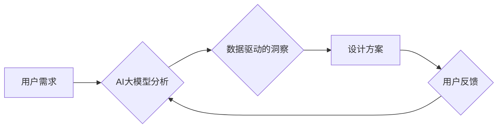

> AI大模型，用户界面，用户体验，设计优化，交互设计，自然语言处理，生成式模型，个性化定制

## 1. 背景介绍

随着人工智能技术的飞速发展，特别是大规模语言模型（LLM）的涌现，AI已经开始深刻地改变着我们生活的方方面面。在用户界面（UI）和用户体验（UX）设计领域，AI大模型也展现出巨大的潜力，能够帮助设计师更高效、更智能地设计出更符合用户需求的界面和体验。

传统UI/UX设计往往依赖于设计师的经验和直觉，需要反复迭代才能达到理想的效果。而AI大模型可以利用海量数据和强大的计算能力，分析用户行为、偏好和反馈，为设计师提供数据驱动的洞察和建议，从而加速设计流程，提升设计质量。

## 2. 核心概念与联系

### 2.1  AI大模型

AI大模型是指在海量数据上训练的深度学习模型，拥有强大的泛化能力和知识表示能力。常见的AI大模型包括GPT-3、LaMDA、BERT等。这些模型能够理解和生成人类语言，并完成各种自然语言处理任务，例如文本生成、翻译、问答等。

### 2.2  用户界面（UI）

用户界面是指用户与计算机系统交互的视觉界面，包括按钮、菜单、图标、文本等元素。UI设计旨在使界面易于理解、使用和导航。

### 2.3  用户体验（UX）

用户体验是指用户使用产品或服务时所感受到的整体感受，包括易用性、可用性、愉悦度、效率等方面。UX设计旨在优化用户与产品或服务的交互过程，提升用户满意度和忠诚度。

### 2.4  AI大模型在UI/UX设计中的应用

AI大模型可以应用于UI/UX设计的各个环节，例如：

* **用户研究:** 分析用户行为数据、反馈和评论，洞察用户需求和偏好。
* **原型设计:** 基于用户需求和数据分析，自动生成UI原型，加速设计迭代。
* **界面风格和元素设计:** 利用AI生成不同风格的界面元素，帮助设计师探索新的设计方向。
* **交互设计:** 根据用户行为模式，优化界面交互流程，提升用户体验。
* **个性化定制:** 根据用户的个人喜好和使用习惯，定制个性化的界面和体验。

**Mermaid 流程图**



## 3. 核心算法原理 & 具体操作步骤

### 3.1  算法原理概述

AI大模型在UI/UX设计中的应用主要基于以下核心算法：

* **自然语言处理（NLP）:** 用于理解和分析用户文本数据，例如用户评论、反馈和聊天记录。
* **机器学习（ML）:** 用于从用户行为数据中学习用户偏好和模式，并预测用户未来的行为。
* **深度学习（DL）:** 用于训练更强大的AI模型，例如生成式对抗网络（GAN）和变分自编码器（VAE），用于生成新的界面元素和交互设计。

### 3.2  算法步骤详解

**以用户界面风格设计为例，具体操作步骤如下：**

1. **数据收集:** 收集大量不同风格的UI界面数据，例如图片、代码和设计规范。
2. **数据预处理:** 对收集到的数据进行清洗、格式化和标注，以便AI模型训练使用。
3. **模型训练:** 利用深度学习算法，例如GAN，训练一个生成式模型，能够根据用户需求生成新的UI界面风格。
4. **模型评估:** 使用测试数据评估模型的性能，例如生成风格的逼真度、多样性和符合用户需求程度。
5. **模型优化:** 根据评估结果，调整模型参数和训练策略，不断优化模型性能。
6. **应用部署:** 将训练好的模型部署到实际应用场景中，例如UI设计工具或网站平台。

### 3.3  算法优缺点

**优点:**

* **自动化设计:** AI模型可以自动生成UI设计方案，节省设计师的时间和精力。
* **个性化定制:** AI模型可以根据用户需求和偏好，生成个性化的UI设计。
* **数据驱动:** AI模型基于数据分析，能够提供更科学、更合理的UI设计方案。

**缺点:**

* **数据依赖:** AI模型的性能取决于训练数据的质量和数量。
* **缺乏创造力:** AI模型生成的UI设计可能缺乏人类设计师的创意和灵感。
* **伦理问题:** AI模型可能产生带有偏见或歧视性的设计方案，需要谨慎处理。

### 3.4  算法应用领域

AI大模型在UI/UX设计领域的应用领域非常广泛，例如：

* **移动应用设计:** 生成个性化的手机应用界面，提升用户体验。
* **网站设计:** 自动生成网站布局和风格，提高网站美观度和用户友好度。
* **游戏设计:** 生成游戏界面元素和交互设计，提升游戏趣味性和沉浸感。
* **虚拟现实（VR）和增强现实（AR）设计:** 生成逼真的虚拟环境和交互体验。

## 4. 数学模型和公式 & 详细讲解 & 举例说明

### 4.1  数学模型构建

在AI大模型驱动的UI/UX设计中，常用的数学模型包括：

* **用户行为模型:** 用于预测用户在界面中的行为，例如点击、滑动、停留时间等。常用的模型包括马尔科夫链、隐马尔可夫模型和深度神经网络。
* **用户偏好模型:** 用于学习用户的界面偏好，例如颜色、字体、布局等。常用的模型包括协同过滤、聚类和深度神经网络。
* **界面生成模型:** 用于根据用户需求和偏好，生成新的界面设计方案。常用的模型包括生成对抗网络（GAN）和变分自编码器（VAE）。

### 4.2  公式推导过程

**以用户行为模型为例，其核心公式为：**

$$P(a_t|h_t) = \sigma(W_a h_t + b_a)$$

其中：

* $P(a_t|h_t)$ 表示在时间步 $t$，给定历史状态 $h_t$，用户执行动作 $a_t$ 的概率。
* $\sigma$ 是 sigmoid 函数，用于将线性输出映射到 [0, 1] 的概率范围。
* $W_a$ 和 $b_a$ 是模型参数，需要通过训练学习得到。

### 4.3  案例分析与讲解

**以用户点击行为为例，我们可以利用马尔科夫链模型来预测用户下一步的点击行为。**

假设用户界面有三个按钮，分别为按钮 A、按钮 B 和按钮 C。我们可以构建一个三维的马尔科夫链，其中每个状态代表用户点击的按钮，状态转移概率可以根据历史数据进行估计。

例如，如果用户之前点击了按钮 A，那么下一步点击按钮 B 的概率可能比点击按钮 C 的概率更高。通过训练马尔科夫链模型，我们可以预测用户在不同状态下的点击行为，从而优化界面布局和交互设计。

## 5. 项目实践：代码实例和详细解释说明

### 5.1  开发环境搭建

* **操作系统:** Ubuntu 20.04 LTS
* **编程语言:** Python 3.8
* **深度学习框架:** TensorFlow 2.x
* **其他工具:** Jupyter Notebook、Git

### 5.2  源代码详细实现

```python
import tensorflow as tf

# 定义用户行为模型
class UserBehaviorModel(tf.keras.Model):
    def __init__(self, num_actions):
        super(UserBehaviorModel, self).__init__()
        self.dense1 = tf.keras.layers.Dense(64, activation='relu')
        self.dense2 = tf.keras.layers.Dense(32, activation='relu')
        self.output = tf.keras.layers.Dense(num_actions)

    def call(self, inputs):
        x = self.dense1(inputs)
        x = self.dense2(x)
        return self.output(x)

# 训练数据
user_history = [[1, 2, 3], [2, 3, 1], [3, 1, 2]]
actions = [0, 1, 2]

# 创建模型实例
model = UserBehaviorModel(num_actions=3)

# 编译模型
model.compile(optimizer='adam', loss='sparse_categorical_crossentropy', metrics=['accuracy'])

# 训练模型
model.fit(user_history, actions, epochs=10)

# 预测用户下一步的行为
predicted_action = model.predict([[1, 2, 3]])
print(predicted_action)
```

### 5.3  代码解读与分析

* **用户行为模型:** 代码中定义了一个简单的用户行为模型，使用两层全连接神经网络来预测用户下一步的行为。
* **训练数据:** 训练数据包含用户历史行为和对应的动作标签。
* **模型编译:** 使用Adam优化器、交叉熵损失函数和准确率作为评估指标。
* **模型训练:** 使用训练数据训练模型，训练epochs设置为10。
* **模型预测:** 使用训练好的模型预测用户下一步的行为。

### 5.4  运行结果展示

运行代码后，会输出预测的用户下一步行为的概率分布。例如，如果预测结果为 [0.2, 0.7, 0.1]，则表示用户下一步最有可能点击按钮 B。

## 6. 实际应用场景

### 6.1  移动应用设计

AI大模型可以帮助设计师生成个性化的手机应用界面，例如根据用户的年龄、性别、兴趣爱好等信息，生成不同的界面风格和元素布局。

### 6.2  网站设计

AI大模型可以自动生成网站布局和风格，并根据用户行为数据进行优化，提高网站美观度和用户友好度。

### 6.3  游戏设计

AI大模型可以生成游戏界面元素和交互设计，提升游戏趣味性和沉浸感。例如，可以根据玩家的性格和游戏进度，生成不同的游戏界面和任务提示。

### 6.4  未来应用展望

随着AI技术的不断发展，AI大模型在UI/UX设计领域的应用将更加广泛和深入。未来，我们可以期待看到：

* 更智能、更个性化的UI设计方案。
* 更高效、更便捷的UI设计流程。
* 更丰富的交互体验和更具沉浸感的虚拟环境。

## 7. 工具和资源推荐

### 7.1  学习资源推荐

* **书籍:**
    * 《深度学习》
    * 《自然语言处理》
    * 《人机交互》
* **在线课程:**
    * Coursera: 深度学习
    * edX: 自然语言处理
    * Udacity: 人机交互

### 7.2  开发工具推荐

* **TensorFlow:** 开源深度学习框架
* **PyTorch:** 开源深度学习框架
* **Jupyter Notebook:** 用于代码编写和可视化分析的工具

### 7.3  相关论文推荐

* **Generative Adversarial Networks**
* **Variational Autoencoders**
* **Recurrent Neural Networks for Sequence Modeling**

## 8. 总结：未来发展趋势与挑战

### 8.1  研究成果总结

AI大模型在UI/UX设计领域取得了显著的成果，例如能够自动生成界面设计方案、个性化定制界面风格、优化用户交互体验等。

### 8.2  未来发展趋势

未来，AI大模型在UI/UX设计领域的应用将更加智能、个性化和深入。例如，我们可以期待看到：

* 基于用户情感分析的界面设计。
* 基于虚拟现实和增强现实技术的沉浸式交互体验。
* 更高效、更便捷的AI辅助设计工具。

### 8.3  面临的挑战

AI大模型在UI/UX设计领域也面临一些挑战，例如：

* 数据质量和可用性问题。
* 模型解释性和可信度问题。
* 伦理和社会影响问题。