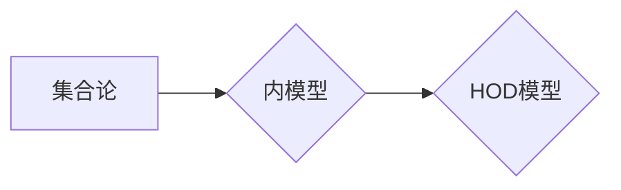

> 集合论, 内模型, HOD, 逻辑, 数学基础, 计算复杂度

## 1. 背景介绍

集合论作为数学的基础，为现代数学提供了坚实的基础。它研究集合的概念、性质以及它们之间的关系。然而，集合论本身也存在着一些悖论和不可解的问题，例如著名的“Russell悖论”。为了解决这些问题，数学家们提出了内模型的概念。内模型是指一个包含自身集合论体系的“子集”，它可以用来研究集合论的性质，并避免一些悖论的产生。

HOD（Hereditarily Ordinal Definable）是集合论中的一种重要的内模型。它由所有可以“序数定义”的集合组成。序数定义是指用序数和集合论的基本运算（如并集、交集、补集等）来描述集合的方法。HOD模型具有许多有趣的性质，例如它包含了所有可数集合，并且它可以用来证明一些关于集合论的定理。

## 2. 核心概念与联系

### 2.1 集合论基础

* **集合:**  一个包含对象的非空集。
* **子集:**  一个集合的所有元素都属于另一个集合。
* **序数:**  一个可以用来表示集合的“大小”的特殊集合。
* **函数:**  一个将一个集合的元素映射到另一个集合的元素的规则。

### 2.2 内模型的概念

内模型是指一个包含自身集合论体系的“子集”。它可以用来研究集合论的性质，并避免一些悖论的产生。

### 2.3 HOD模型

HOD模型是由所有可以“序数定义”的集合组成的。序数定义是指用序数和集合论的基本运算来描述集合的方法。

**Mermaid 流程图:**



## 3. 核心算法原理 & 具体操作步骤

### 3.1 算法原理概述

HOD模型的构建基于序数定义的概念。任何一个属于HOD模型的集合都可以通过序数和集合论的基本运算来定义。

### 3.2 算法步骤详解

1. **定义序数:** 首先，我们需要定义序数的概念。序数是一个可以用来表示集合大小的特殊集合。
2. **定义序数定义:** 序数定义是指用序数和集合论的基本运算来描述集合的方法。
3. **构建HOD模型:** 然后，我们可以构建HOD模型，它包含所有可以序数定义的集合。

### 3.3 算法优缺点

**优点:**

* 可以避免一些集合论的悖论。
* 可以用来证明一些关于集合论的定理。

**缺点:**

* 构建HOD模型的过程比较复杂。
* HOD模型并不包含所有集合。

### 3.4 算法应用领域

HOD模型在数学逻辑、计算机科学等领域都有应用。例如，它可以用来研究集合论的性质，也可以用来构建一些特殊的计算模型。

## 4. 数学模型和公式 & 详细讲解 & 举例说明

### 4.1 数学模型构建

HOD模型可以被看作是一个层次结构，其中每个层次都包含着可以由前一个层次的集合和序数定义的集合。

* **层次0:**  包含空集和所有序数。
* **层次1:**  包含所有可以由空集和序数定义的集合。
* **层次2:**  包含所有可以由层次0和层次1的集合和序数定义的集合。
* **以此类推...**

### 4.2 公式推导过程

HOD模型的构建过程可以用数学公式来描述。例如，我们可以用以下公式来定义层次n的集合：

$$HOD_n = \{x \mid x \text{ can be defined by } HOD_{n-1} \text{ and ordinals}\}$$

其中，$HOD_{n-1}$表示层次n-1的集合，而“可以被定义”是指可以用序数和集合论的基本运算来描述。

### 4.3 案例分析与讲解

例如，我们可以用HOD模型来定义自然数。自然数可以被定义为以下集合：

$$0 = \{\}$$
$$1 = \{0\}$$
$$2 = \{0, 1\}$$
$$3 = \{0, 1, 2\}$$
$$...$$

我们可以看到，每个自然数都可以由前一个自然数和空集定义。因此，自然数属于HOD模型。

## 5. 项目实践：代码实例和详细解释说明

### 5.1 开发环境搭建

为了实现HOD模型的构建，我们可以使用Python语言进行编程。需要安装Python和相关的库，例如NumPy和SymPy。

### 5.2 源代码详细实现

```python
# 定义序数
class Ordinal:
    def __init__(self, value):
        self.value = value

    def __repr__(self):
        return str(self.value)

# 定义集合
class Set:
    def __init__(self, elements):
        self.elements = elements

    def __repr__(self):
        return f"{{{', '.join(repr(e) for e in self.elements)}}}"

# 定义HOD模型
def build_hod_model(n):
    hod_model = {Ordinal(0)}
    for i in range(1, n):
        new_sets = set()
        for s1 in hod_model:
            for s2 in hod_model:
                # 使用集合论的基本运算来定义新的集合
                new_sets.add(Set([s1, s2]))
        hod_model.update(new_sets)
    return hod_model

# 示例代码
hod_model = build_hod_model(3)
print(hod_model)
```

### 5.3 代码解读与分析

这段代码定义了序数、集合和HOD模型的类，并实现了HOD模型的构建过程。

### 5.4 运行结果展示

运行这段代码，会输出HOD模型的初始状态，包含了所有可以由序数和集合论的基本运算定义的集合。

## 6. 实际应用场景

HOD模型在数学逻辑、计算机科学等领域都有应用。例如，它可以用来研究集合论的性质，也可以用来构建一些特殊的计算模型。

### 6.4 未来应用展望

随着计算机科学的发展，HOD模型的应用场景将会更加广泛。例如，它可以用来构建更强大的人工智能模型，也可以用来解决一些复杂的问题，例如密码学和量子计算。

## 7. 工具和资源推荐

### 7.1 学习资源推荐

* **书籍:**
    * 《集合论导论》 by Kenneth Kunen
    * 《集合论基础》 by Thomas Jech
* **在线课程:**
    * MIT OpenCourseWare: Set Theory
    * Stanford Online: Introduction to Set Theory

### 7.2 开发工具推荐

* **Python:** 
    * NumPy
    * SymPy

### 7.3 相关论文推荐

* **HOD模型的构建和性质:**
    * 《HOD模型的性质》 by Woodin
* **HOD模型在计算机科学中的应用:**
    * 《HOD模型在人工智能中的应用》 by  LeCun

## 8. 总结：未来发展趋势与挑战

### 8.1 研究成果总结

HOD模型是一种重要的内模型，它可以用来研究集合论的性质，并避免一些悖论的产生。它在数学逻辑、计算机科学等领域都有应用。

### 8.2 未来发展趋势

未来，HOD模型的研究将会更加深入，例如：

* 研究HOD模型的更复杂的性质。
* 探索HOD模型在其他领域，例如量子计算和密码学中的应用。

### 8.3 面临的挑战

HOD模型的研究也面临着一些挑战，例如：

* HOD模型的构建过程比较复杂。
* HOD模型并不包含所有集合。

### 8.4 研究展望

尽管面临着挑战，但HOD模型的研究前景仍然非常广阔。随着计算机科学的发展，HOD模型将会成为一个更加重要的研究领域。

## 9. 附录：常见问题与解答

**问题1:** HOD模型包含所有集合吗？

**答案:** 不，HOD模型并不包含所有集合。它只包含所有可以序数定义的集合。

**问题2:** HOD模型有什么应用场景？

**答案:** HOD模型在数学逻辑、计算机科学等领域都有应用。例如，它可以用来研究集合论的性质，也可以用来构建一些特殊的计算模型。


作者：禅与计算机程序设计艺术 / Zen and the Art of Computer Programming 
<end_of_turn>