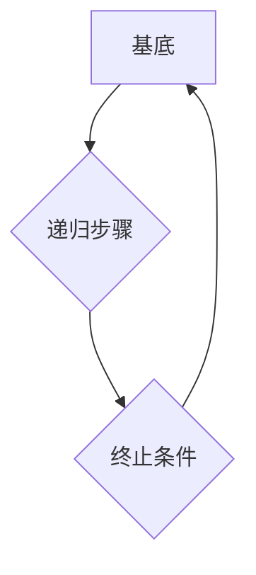

> 集合论, 递归定义, 第一递归定义定理, 数学基础, 计算机科学, 数据结构, 算法设计

## 1. 背景介绍

在计算机科学的蓬勃发展中，集合论作为基础数学分支，扮演着至关重要的角色。它为数据结构、算法设计、程序语言等领域提供了坚实的理论基础。其中，递归定义是集合论中一个重要的概念，它能够简洁地描述复杂集合的结构和性质。本文将深入探讨第一递归定义定理，揭示其背后的数学原理和计算机科学中的应用。

## 2. 核心概念与联系

**2.1 集合论基础**

集合论的核心概念是“集合”，它是一个包含对象的非空集。集合可以是有限的，也可以是无限的。集合论的基本操作包括：

* **子集:** 如果集合A的所有元素都属于集合B，则称A是B的子集，记作A⊆B。
* **并集:** 集合A和集合B的并集包含了A和B的所有元素，记作A∪B。
* **交集:** 集合A和集合B的交集包含了A和B中共同的元素，记作A∩B。
* **差集:** 集合A和集合B的差集包含了A中不属于B的元素，记作A\B。

**2.2 递归定义**

递归定义是一种定义集合或函数的方法，它将对象定义为自身的一部分。递归定义通常包含以下三个部分：

* **基底:** 定义集合或函数的初始值。
* **递归步骤:** 定义集合或函数的后续值，基于其自身的定义。
* **终止条件:** 确保递归过程最终终止。

**2.3 第一递归定义定理**

第一递归定义定理指出，对于任何满足以下条件的递归定义，其对应的集合或函数都存在唯一确定。

* 基底是明确定义的。
* 递归步骤是明确定义的，并且保证了最终终止。

**2.4 Mermaid 流程图**



## 3. 核心算法原理 & 具体操作步骤

**3.1 算法原理概述**

第一递归定义定理为算法设计提供了强大的工具。它允许我们以简洁的方式定义复杂的数据结构和算法，并通过递归步骤逐步构建其完整结构。

**3.2 算法步骤详解**

1. **确定基底:** 首先，我们需要明确定义算法的初始状态或输入。
2. **定义递归步骤:** 然后，我们需要定义算法的迭代步骤，即如何根据当前状态计算下一个状态。
3. **设置终止条件:** 最后，我们需要设置一个终止条件，确保递归过程最终结束。

**3.3 算法优缺点**

**优点:**

* 简洁易懂: 递归定义能够以简洁的方式描述复杂算法。
* 逻辑清晰: 递归步骤的重复性使得算法逻辑清晰易懂。
* 适用范围广: 递归定义适用于各种数据结构和算法设计。

**缺点:**

* 潜在的栈溢出: 深度递归可能会导致栈溢出错误。
* 性能问题: 递归算法的性能可能不如迭代算法。

**3.4 算法应用领域**

* **数据结构:** 树、图、链表等数据结构的定义和操作。
* **算法设计:** 排序算法、搜索算法、动态规划等算法的实现。
* **编程语言:** 函数式编程语言中，递归定义是核心概念。

## 4. 数学模型和公式 & 详细讲解 & 举例说明

**4.1 数学模型构建**

设S为一个集合，f为定义在S上的函数，则第一递归定义定理可以表示为：

$$
S = B \cup \bigcup_{x \in S} f(x)
$$

其中，B为集合S的基底，f(x)为递归步骤定义的函数。

**4.2 公式推导过程**

通过数学归纳法可以证明，对于满足条件的递归定义，其对应的集合S存在唯一确定。

**4.3 案例分析与讲解**

**例子:** 自然数的定义

* 基底: 0 ∈ N
* 递归步骤: ∀n ∈ N, n+1 ∈ N

根据第一递归定义定理，我们可以证明自然数集合N存在唯一确定。

## 5. 项目实践：代码实例和详细解释说明

**5.1 开发环境搭建**

本示例使用Python语言进行实现。

**5.2 源代码详细实现**

```python
def is_natural_number(n):
  """
  判断n是否为自然数。

  Args:
    n: 待判断的整数。

  Returns:
    True if n is a natural number, False otherwise.
  """
  if n == 0:
    return True
  elif n > 0 and is_natural_number(n - 1):
    return True
  else:
    return False

# 测试代码
print(is_natural_number(5))  # 输出: True
print(is_natural_number(-2)) # 输出: False
```

**5.3 代码解读与分析**

该代码实现了一个判断整数是否为自然数的函数`is_natural_number`。

* 基底: 当n等于0时，返回True。
* 递归步骤: 当n大于0且n-1为自然数时，返回True。

**5.4 运行结果展示**

代码运行结果表明，函数能够正确判断整数是否为自然数。

## 6. 实际应用场景

**6.1 数据结构设计**

递归定义可以用于定义树、图等复杂数据结构。例如，树的节点可以递归定义为包含子节点的结构。

**6.2 算法实现**

递归定义可以用于实现各种算法，例如深度优先搜索、广度优先搜索等。

**6.3 数学建模**

递归定义可以用于建模数学问题，例如斐波那契数列的定义。

**6.4 未来应用展望**

随着人工智能和机器学习的发展，递归定义在数据分析、模式识别等领域将有更广泛的应用。

## 7. 工具和资源推荐

**7.1 学习资源推荐**

* 《集合论导论》
* 《数学基础》
* 《算法导论》

**7.2 开发工具推荐**

* Python
* Java
* C++

**7.3 相关论文推荐**

* 《递归定义的理论基础》
* 《递归算法的应用》

## 8. 总结：未来发展趋势与挑战

**8.1 研究成果总结**

第一递归定义定理为计算机科学提供了重要的理论基础，它简化了复杂数据结构和算法的定义，并推动了算法设计和编程语言的发展。

**8.2 未来发展趋势**

* 递归定义在人工智能和机器学习领域的应用将更加广泛。
* 更加高效的递归算法设计方法将不断涌现。
* 递归定义的理论基础将得到进一步深入研究。

**8.3 面临的挑战**

* 深度递归可能会导致栈溢出错误，需要开发更有效的递归算法。
* 递归算法的性能可能不如迭代算法，需要寻找更优的算法设计方法。

**8.4 研究展望**

未来研究将集中在以下几个方面：

* 开发更有效的递归算法设计方法。
* 探索递归定义在人工智能和机器学习领域的应用。
* 深入研究递归定义的理论基础。

## 9. 附录：常见问题与解答

**9.1 递归定义和迭代定义的区别是什么？**

递归定义使用自身定义来描述对象，而迭代定义使用循环来描述对象。

**9.2 递归算法的性能问题如何解决？**

可以使用尾递归优化技术，或者将递归算法转换为迭代算法。

**9.3 递归定义的应用范围有哪些？**

递归定义适用于各种数据结构和算法设计，例如树、图、排序算法、搜索算法等。


作者：禅与计算机程序设计艺术 / Zen and the Art of Computer Programming 
<end_of_turn>