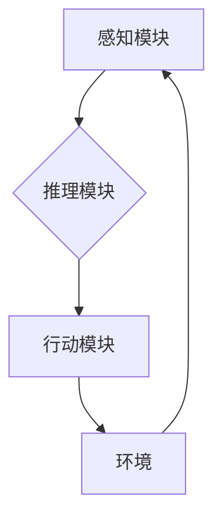

> AI Agent, 智能化运营, 机器学习, 深度强化学习, 自然语言处理, 决策优化, 自动化流程

## 1. 背景介绍

在当今数字化转型加速的时代，企业面临着日益激烈的市场竞争和不断变化的客户需求。传统运营模式已难以满足快速发展的市场需求，智能化运营成为企业提升效率、降低成本、增强竞争力的关键驱动力。

AI Agent作为一种新型的智能化技术，凭借其强大的学习、推理和决策能力，正在深刻地改变着企业运营模式。AI Agent能够自动学习和理解业务规则，并根据实时数据进行决策，从而实现自动化、智能化和高效化的运营流程。

## 2. 核心概念与联系

**2.1 AI Agent的概念**

AI Agent是一种能够感知环境、做出决策并执行行动的智能体。它通常由以下几个核心组件组成：

* **感知模块:** 用于收集环境信息，例如传感器数据、用户行为、市场趋势等。
* **推理模块:** 用于分析和理解环境信息，并根据业务规则和知识库进行决策。
* **行动模块:** 用于执行决策，例如控制设备、发送邮件、更新数据库等。
* **学习模块:** 用于不断学习和改进决策策略，提高运营效率。

**2.2 AI Agent与智能化运营的联系**

AI Agent能够通过自动化、智能化和高效化的运营流程，帮助企业实现以下目标：

* **提高运营效率:** 自动化重复性任务，释放人力资源，提高工作效率。
* **降低运营成本:** 通过优化资源配置和流程设计，降低运营成本。
* **增强客户体验:** 提供个性化服务和快速响应，提升客户满意度。
* **提升决策质量:** 基于数据分析和预测模型，提供更准确的决策支持。

**2.3 AI Agent架构**



## 3. 核心算法原理 & 具体操作步骤

**3.1 算法原理概述**

AI Agent的决策和行为通常基于以下核心算法：

* **机器学习:** 用于训练模型，使AI Agent能够从数据中学习并预测未来事件。
* **深度强化学习:** 用于训练AI Agent在复杂环境中进行决策，并通过奖励机制不断优化策略。
* **自然语言处理:** 用于理解和处理自然语言文本，例如用户查询、客服对话等。

**3.2 算法步骤详解**

**3.2.1 机器学习算法步骤**

1. **数据收集:** 收集相关数据，例如用户行为、市场趋势、产品信息等。
2. **数据预处理:** 对数据进行清洗、转换和特征提取，使其适合模型训练。
3. **模型选择:** 选择合适的机器学习模型，例如线性回归、决策树、支持向量机等。
4. **模型训练:** 使用训练数据训练模型，并调整模型参数，使其能够准确预测目标变量。
5. **模型评估:** 使用测试数据评估模型性能，并进行模型调优。
6. **模型部署:** 将训练好的模型部署到生产环境中，用于进行预测和决策。

**3.2.2 深度强化学习算法步骤**

1. **环境定义:** 定义AI Agent所处的环境，包括状态空间、动作空间和奖励函数。
2. **策略网络训练:** 使用深度神经网络训练策略网络，用于根据当前状态选择最优动作。
3. **价值网络训练:** 使用深度神经网络训练价值网络，用于评估不同状态的价值。
4. **强化学习算法:** 使用强化学习算法，例如Q学习、SARSA等，更新策略网络和价值网络的参数。
5. **策略评估:** 使用训练好的策略网络评估AI Agent在环境中的性能。

**3.3 算法优缺点**

**3.3.1 机器学习算法**

* **优点:** 能够从数据中学习，并自动发现模式和规律。
* **缺点:** 需要大量的数据进行训练，对数据质量要求较高。

**3.3.2 深度强化学习算法**

* **优点:** 能够解决复杂环境下的决策问题，并不断优化策略。
* **缺点:** 训练过程复杂，需要大量的计算资源和时间。

**3.4 算法应用领域**

* **推荐系统:** 基于用户行为数据，推荐个性化商品或服务。
* **智能客服:** 使用自然语言处理技术，自动回复用户咨询。
* **自动化流程:** 自动化重复性任务，例如数据录入、报表生成等。
* **预测分析:** 基于历史数据，预测未来趋势，例如销售预测、风险评估等。

## 4. 数学模型和公式 & 详细讲解 & 举例说明

**4.1 数学模型构建**

AI Agent的决策过程可以抽象为一个数学模型，其中状态空间、动作空间和奖励函数是模型的关键要素。

* **状态空间:** 表示AI Agent所处的环境状态，例如用户位置、商品库存、市场价格等。
* **动作空间:** 表示AI Agent可以执行的动作，例如移动、购买、销售等。
* **奖励函数:** 用于评估AI Agent在不同状态下执行不同动作的奖励，例如获得利润、减少成本等。

**4.2 公式推导过程**

深度强化学习算法的核心是通过最大化累积奖励来训练AI Agent的策略网络。

* **Bellman方程:** 用于描述状态价值函数和动作价值函数之间的关系。

$$
V(s) = \max_a Q(s, a)
$$

$$
Q(s, a) = R(s, a) + \gamma \max_{a'} Q(s', a')
$$

其中：

* $V(s)$ 表示状态 $s$ 的价值函数。
* $Q(s, a)$ 表示在状态 $s$ 执行动作 $a$ 的价值函数。
* $R(s, a)$ 表示执行动作 $a$ 在状态 $s$ 得到的奖励。
* $\gamma$ 表示折扣因子，用于权衡未来奖励的价值。

**4.3 案例分析与讲解**

例如，在智能客服系统中，AI Agent需要根据用户的自然语言输入进行理解和回复。可以使用深度学习模型训练一个语言模型，例如BERT，来理解用户的意图和需求。然后，可以使用强化学习算法训练一个策略网络，来选择最合适的回复语句，并根据用户的反馈进行策略更新。

## 5. 项目实践：代码实例和详细解释说明

**5.1 开发环境搭建**

* Python 3.x
* TensorFlow 或 PyTorch
* Jupyter Notebook

**5.2 源代码详细实现**

```python
# 使用 TensorFlow 训练一个简单的 Q 学习模型

import tensorflow as tf

# 定义状态空间和动作空间
state_size = 10
action_size = 5

# 定义 Q 网络
model = tf.keras.Sequential([
    tf.keras.layers.Dense(64, activation='relu', input_shape=(state_size,)),
    tf.keras.layers.Dense(action_size)
])

# 定义损失函数和优化器
optimizer = tf.keras.optimizers.Adam()
loss_fn = tf.keras.losses.MeanSquaredError()

# 训练循环
for episode in range(1000):
    # 初始化状态
    state = tf.random.uniform((1, state_size))

    # 执行训练步骤
    with tf.GradientTape() as tape:
        # 获取 Q 值
        q_values = model(state)
        # 选择动作
        action = tf.argmax(q_values, axis=1)
        # 执行动作并获取奖励
        reward = tf.random.uniform((1,), minval=0, maxval=1)
        # 计算损失
        target_q_value = reward
        loss = loss_fn(target_q_value, q_values[0, action])
    # 更新模型参数
    gradients = tape.gradient(loss, model.trainable_variables)
    optimizer.apply_gradients(zip(gradients, model.trainable_variables))

# 保存模型
model.save('q_learning_model.h5')
```

**5.3 代码解读与分析**

这段代码演示了如何使用 TensorFlow 训练一个简单的 Q 学习模型。

* 首先，定义了状态空间和动作空间。
* 然后，定义了一个 Q 网络，用于预测不同状态下执行不同动作的价值。
* 使用 Adam 优化器和均方误差损失函数训练模型。
* 训练循环中，随机选择一个状态，根据 Q 网络的输出选择动作，执行动作并获取奖励，然后更新模型参数。
* 最后，保存训练好的模型。

**5.4 运行结果展示**

训练完成后，可以将模型应用于实际场景中，例如控制机器人运动、玩游戏等。

## 6. 实际应用场景

**6.1 智能客服**

AI Agent可以理解用户自然语言，并提供个性化服务，例如回答常见问题、预约服务、处理投诉等。

**6.2 自动化流程**

AI Agent可以自动化重复性任务，例如数据录入、报表生成、邮件发送等，提高工作效率。

**6.3 个性化推荐**

AI Agent可以根据用户行为数据，推荐个性化商品或服务，提升用户体验。

**6.4 预测分析**

AI Agent可以基于历史数据，预测未来趋势，例如销售预测、风险评估等，帮助企业做出更明智的决策。

**6.5 未来应用展望**

AI Agent的应用场景还在不断扩展，未来将应用于更多领域，例如医疗诊断、金融风险控制、交通管理等。

## 7. 工具和资源推荐

**7.1 学习资源推荐**

* **书籍:**
    * 《Reinforcement Learning: An Introduction》
    * 《Deep Learning》
* **在线课程:**
    * Coursera: Reinforcement Learning Specialization
    * Udacity: Deep Learning Nanodegree

**7.2 开发工具推荐**

* **TensorFlow:** 开源深度学习框架
* **PyTorch:** 开源深度学习框架
* **OpenAI Gym:** 强化学习环境库

**7.3 相关论文推荐**

* **Deep Reinforcement Learning with Double Q-Learning**
* **Proximal Policy Optimization Algorithms**

## 8. 总结：未来发展趋势与挑战

**8.1 研究成果总结**

近年来，AI Agent技术取得了显著进展，在智能客服、自动化流程、个性化推荐等领域取得了成功应用。

**8.2 未来发展趋势**

* **模型规模和能力提升:** 未来AI Agent模型将更加强大，能够处理更复杂的任务。
* **多模态感知:** AI Agent将能够感知多种数据类型，例如文本、图像、音频等。
* **联邦学习:** AI Agent将能够在不共享数据的情况下进行协同学习。

**8.3 面临的挑战**

* **数据安全和隐私保护:** AI Agent的训练和应用需要大量数据，如何保证数据安全和隐私保护是一个重要挑战。
* **算法可解释性和信任度:** AI Agent的决策过程通常是复杂的，如何提高算法的可解释性和信任度是一个关键问题。
* **伦理和社会影响:** AI Agent的应用可能带来一些伦理和社会问题，需要进行深入研究和探讨。

**8.4 研究展望**

未来，AI Agent技术将继续发展，并应用于更多领域，为人类社会带来更多福祉。


## 9. 附录：常见问题与解答

**9.1 如何选择合适的 AI Agent 算法？**

选择合适的 AI Agent 算法取决于具体的应用场景和需求。例如，对于简单的任务，可以使用 Q 学习算法；对于复杂的任务，可以使用深度强化学习算法。

**9.2 如何保证 AI Agent 的数据安全和隐私保护？**

可以使用联邦学习等技术，在不共享数据的情况下进行 AI Agent 的训练和应用。

**9.3 如何提高 AI Agent 的决策可解释性和信任度？**

可以使用可解释机器学习模型，或者结合专家知识进行决策解释。

**9.4 AI Agent 会取代人类工作吗？**

AI Agent 可以自动化一些重复性任务，但它无法完全取代人类工作。人类仍然需要发挥创造力、批判性思维和情感智能等优势。


作者：禅与计算机程序设计艺术 / Zen