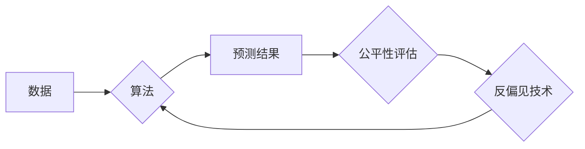

> AI 公平性，算法偏见，公平算法，反偏见技术，机器学习，深度学习，数据预处理，模型解释，伦理规范，政策法规

## 1. 背景介绍

人工智能（AI）技术的飞速发展，为各个领域带来了革命性的变革。从医疗诊断到金融风险评估，从自动驾驶到个性化推荐，AI 正在深刻地影响着我们的生活。然而，随着 AI 应用的广泛普及，一个不容忽视的问题逐渐浮出水面：AI 系统的公平性。

算法偏见是指 AI 系统在训练数据中学习到的不公平或歧视性模式，导致其在决策和预测时对不同群体产生不平等的结果。这种偏见可能源于训练数据本身的偏差，也可能来自算法的设计缺陷。

算法偏见带来的后果十分严重，可能导致社会不公、经济不平等甚至侵犯人权。例如，在招聘领域，算法偏见可能导致某些群体被系统性地排除在外；在司法领域，算法偏见可能导致某些群体受到不公平的对待。

因此，消除算法偏见，确保 AI 系统的公平性，是当前 AI 发展面临的重大挑战之一。

## 2. 核心概念与联系

**2.1 算法偏见**

算法偏见是指 AI 系统在训练数据中学习到的不公平或歧视性模式，导致其在决策和预测时对不同群体产生不平等的结果。

**2.2 数据偏差**

数据偏差是指训练数据中反映社会不平等的偏见，例如种族、性别、年龄、收入等方面的差异。

**2.3 模型偏差**

模型偏差是指算法本身的设计缺陷导致的偏见，例如使用不合适的特征或算法参数。

**2.4 公平性指标**

公平性指标用于衡量 AI 系统的公平性，例如准确率、召回率、F1-score、公平度等。

**2.5 反偏见技术**

反偏见技术旨在消除算法偏见，例如数据预处理、模型调整、公平性约束等。

**2.6 伦理规范**

伦理规范为 AI 开发和应用提供指导原则，例如透明度、可解释性、责任追究等。

**2.7 政策法规**

政策法规旨在规范 AI 的开发和应用，例如数据隐私保护、算法透明度等。

**Mermaid 流程图**



## 3. 核心算法原理 & 具体操作步骤

### 3.1  算法原理概述

消除算法偏见的技术主要集中在以下几个方面：

* **数据预处理:** 识别和修正训练数据中的偏差，例如使用加权采样、数据合成等技术。
* **模型调整:** 设计和训练更公平的算法模型，例如使用公平性约束、对抗训练等技术。
* **模型解释:** 解释 AI 系统的决策过程，帮助识别和理解算法偏见。
* **公平性评估:** 使用公平性指标评估 AI 系统的公平性，并根据评估结果进行改进。

### 3.2  算法步骤详解

**数据预处理:**

1. **数据收集:** 收集用于训练 AI 系统的数据。
2. **数据清洗:** 删除数据中的缺失值、错误值和重复值。
3. **数据特征工程:** 选择和转换数据特征，以减少算法偏见。
4. **数据平衡:** 使用加权采样、数据合成等技术，平衡不同群体的样本比例。

**模型调整:**

1. **选择公平性约束:** 根据具体应用场景选择合适的公平性约束，例如禁止歧视某个群体、保证不同群体之间的公平性等。
2. **设计公平性损失函数:** 将公平性约束融入到模型的损失函数中，引导模型学习更公平的决策规则。
3. **训练公平性模型:** 使用训练数据和公平性损失函数训练 AI 模型。

**模型解释:**

1. **选择模型解释方法:** 选择合适的模型解释方法，例如局部解释、全局解释等。
2. **解释模型决策:** 使用模型解释方法解释 AI 系统的决策过程，识别和理解算法偏见。

**公平性评估:**

1. **选择公平性指标:** 根据具体应用场景选择合适的公平性指标，例如准确率、召回率、公平度等。
2. **评估模型公平性:** 使用公平性指标评估 AI 系统的公平性，并根据评估结果进行改进。

### 3.3  算法优缺点

**优点:**

* 可以有效地减少算法偏见。
* 可以提高 AI 系统的公平性和可解释性。
* 可以促进 AI 技术的伦理发展。

**缺点:**

* 需要大量的计算资源和时间。
* 需要专业的技术人员进行开发和维护。
* 难以完全消除算法偏见。

### 3.4  算法应用领域

* **医疗保健:** 确保医疗资源的公平分配，避免医疗歧视。
* **金融服务:** 减少贷款申请的歧视性拒绝，促进金融包容。
* **司法系统:** 避免司法判决的偏见，保障司法公正。
* **教育领域:** 促进教育资源的公平分配，提高教育公平性。

## 4. 数学模型和公式 & 详细讲解 & 举例说明

### 4.1  数学模型构建

**4.1.1  公平性约束**

公平性约束可以表示为以下形式：

$$
\min_{w} L(w) + \lambda \cdot \Delta(w)
$$

其中：

* $w$ 是模型参数。
* $L(w)$ 是模型损失函数。
* $\lambda$ 是权重参数，用于控制公平性约束的强度。
* $\Delta(w)$ 是公平性损失函数，用于衡量模型的公平性。

**4.1.2  公平性损失函数**

常见的公平性损失函数包括：

* **差分公平性损失函数:**

$$
\Delta(w) = \frac{1}{2} \left( \left| f_p(x) - f_n(x) \right| \right)^2
$$

其中：

* $f_p(x)$ 和 $f_n(x)$ 分别是模型对正向和负向样本的预测结果。

* **比例公平性损失函数:**

$$
\Delta(w) = \frac{1}{2} \left( \frac{f_p(x)}{f_n(x)} - 1 \right)^2
$$

其中：

* $f_p(x)$ 和 $f_n(x)$ 分别是模型对正向和负向样本的预测结果。

### 4.2  公式推导过程

**4.2.1  差分公平性损失函数推导:**

差分公平性损失函数旨在最小化不同群体之间模型预测结果的差异。

假设模型对正向样本的预测结果为 $f_p(x)$，对负向样本的预测结果为 $f_n(x)$，则差分公平性损失函数可以表示为：

$$
\Delta(w) = \frac{1}{2} \left( \left| f_p(x) - f_n(x) \right| \right)^2
$$

该公式计算了模型对正向和负向样本预测结果的绝对差值的平方，并将其取平均值。

**4.2.2  比例公平性损失函数推导:**

比例公平性损失函数旨在最小化不同群体之间模型预测结果的比例差异。

假设模型对正向样本的预测结果为 $f_p(x)$，对负向样本的预测结果为 $f_n(x)$，则比例公平性损失函数可以表示为：

$$
\Delta(w) = \frac{1}{2} \left( \frac{f_p(x)}{f_n(x)} - 1 \right)^2
$$

该公式计算了模型对正向和负向样本预测结果的比例差异的平方，并将其取平均值。

### 4.3  案例分析与讲解

**4.3.1  差分公平性案例:**

假设我们训练一个模型用于预测贷款申请的风险，其中正向样本表示贷款申请被批准，负向样本表示贷款申请被拒绝。如果模型对不同群体（例如不同种族）的预测结果存在差异，则可能存在算法偏见。

使用差分公平性损失函数可以引导模型学习更公平的决策规则，减少不同群体之间预测结果的差异。

**4.3.2  比例公平性案例:**

假设我们训练一个模型用于预测招聘候选人的能力，其中正向样本表示候选人被录用，负向样本表示候选人未被录用。如果模型对不同群体（例如不同性别）的预测结果存在比例差异，则可能存在算法偏见。

使用比例公平性损失函数可以引导模型学习更公平的决策规则，减少不同群体之间预测结果的比例差异。

## 5. 项目实践：代码实例和详细解释说明

### 5.1  开发环境搭建

* **操作系统:** Ubuntu 20.04 LTS
* **编程语言:** Python 3.8
* **深度学习框架:** TensorFlow 2.0
* **其他工具:** Jupyter Notebook, Git

### 5.2  源代码详细实现

```python
import tensorflow as tf

# 定义模型
model = tf.keras.models.Sequential([
    tf.keras.layers.Dense(64, activation='relu', input_shape=(10,)),
    tf.keras.layers.Dense(32, activation='relu'),
    tf.keras.layers.Dense(1, activation='sigmoid')
])

# 定义损失函数
def custom_loss(y_true, y_pred):
    # 计算差分公平性损失
    diff_fairness_loss = tf.reduce_mean(tf.square(y_pred[:, 0] - y_pred[:, 1]))
    # 计算原始损失
    binary_crossentropy_loss = tf.keras.losses.BinaryCrossentropy()(y_true, y_pred)
    # 合并损失
    return binary_crossentropy_loss + 0.1 * diff_fairness_loss

# 编译模型
model.compile(optimizer='adam', loss=custom_loss, metrics=['accuracy'])

# 训练模型
model.fit(x_train, y_train, epochs=10)
```

### 5.3  代码解读与分析

* **模型定义:** 代码定义了一个简单的多层感知机模型，用于预测分类任务。
* **损失函数定义:** 自定义损失函数，将原始损失函数（二分类交叉熵损失）与差分公平性损失函数相加。
* **模型编译:** 使用 Adam 优化器，自定义损失函数和准确率作为评估指标。
* **模型训练:** 使用训练数据训练模型，训练 epochs 次。

### 5.4  运行结果展示

训练完成后，可以评估模型的性能，并使用公平性指标评估模型的公平性。

## 6. 实际应用场景

**6.1  医疗保健:**

* **疾病诊断:** 训练 AI 模型用于诊断疾病，确保不同群体获得公平的诊断结果。
* **医疗资源分配:** 使用 AI 模型优化医疗资源分配，避免特定群体因地理位置或其他因素而无法获得医疗服务。

**6.2  金融服务:**

* **贷款申请:** 训练 AI 模型用于评估贷款申请，避免对特定群体进行歧视性拒绝。
* **风险评估:** 使用 AI 模型评估金融风险，确保不同群体获得公平的金融服务。

**6.3  司法系统:**

* **罪犯风险评估:** 训练 AI 模型用于评估罪犯的风险，避免对特定群体进行不公平的判决。
* **司法案件分配:** 使用 AI 模型分配司法案件，确保案件得到公平的审理。

**6.4  未来应用展望:**

随着 AI 技术的不断发展，公平性技术将应用于更多领域，例如教育、就业、交通等，促进社会公平正义。

## 7. 工具和资源推荐

### 7.1  学习