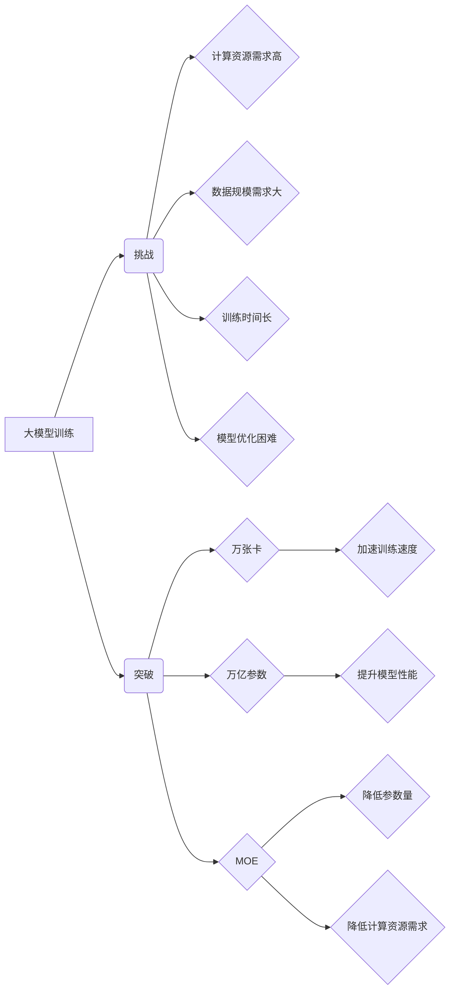

> 大模型、训练、万张卡、万亿参数、MOE、Transformer、深度学习、自然语言处理

## 1. 背景介绍

近年来，深度学习技术取得了飞速发展，大规模人工智能模型的训练成为一个重要的研究方向。大模型是指参数量达到数十亿甚至万亿级别的人工智能模型，它们在自然语言处理、计算机视觉、语音识别等领域展现出强大的能力。然而，大模型的训练也面临着巨大的挑战，例如训练成本高、硬件资源需求大、训练时间长等。

突破万张卡和万亿参数的临界点是推动大模型发展的重要里程碑。万张卡指的是使用数千甚至上万张GPU进行并行训练，而万亿参数指的是模型参数量达到百亿甚至万亿级别。这两个临界点代表着大模型训练进入了新的阶段，也为大模型的应用带来了新的可能性。

## 2. 核心概念与联系

**2.1 大模型训练的挑战**

大模型训练面临着以下主要挑战：

* **计算资源需求高:** 大模型的参数量巨大，训练需要消耗大量的计算资源。
* **数据规模需求大:** 大模型需要大量的训练数据才能达到良好的性能。
* **训练时间长:** 大模型的训练时间通常很长，甚至需要数周甚至数月。
* **模型优化困难:** 大模型的训练过程复杂，需要复杂的优化算法才能有效地训练模型。

**2.2  万张卡和万亿参数的意义**

突破万张卡和万亿参数的临界点，可以有效地解决大模型训练中的部分挑战：

* **加速训练速度:** 使用万张卡进行并行训练可以显著加速模型的训练速度。
* **提升模型性能:** 训练更大的模型可以提升模型的性能，使其能够更好地处理复杂的任务。
* **拓展应用场景:** 突破万张卡和万亿参数的临界点，可以为大模型的应用拓展新的场景。

**2.3  MOE 训练策略**

MOE（Mixture of Experts）是一种用于训练大模型的训练策略，它可以有效地解决大模型训练中的参数量过大、计算资源需求高的挑战。MOE 将大模型分成多个专家子模型，每个专家子模型只负责处理特定类型的输入数据。在训练过程中，根据输入数据的类型选择合适的专家子模型进行训练，从而降低了模型的整体参数量和计算资源需求。

**2.4  核心概念关系图**



## 3. 核心算法原理 & 具体操作步骤

### 3.1  算法原理概述

大模型训练的核心算法是深度学习算法，其中最常用的算法是Transformer。Transformer是一种基于注意力机制的序列模型，它能够有效地处理长序列数据，并具有强大的表示能力。

### 3.2  算法步骤详解

大模型训练的具体步骤如下：

1. **数据预处理:** 将原始数据进行清洗、格式化和编码，使其能够被模型理解。
2. **模型构建:** 根据任务需求选择合适的模型架构，并初始化模型参数。
3. **模型训练:** 使用训练数据训练模型，并通过反向传播算法更新模型参数。
4. **模型评估:** 使用验证数据评估模型的性能，并根据评估结果调整训练参数。
5. **模型部署:** 将训练好的模型部署到实际应用场景中。

### 3.3  算法优缺点

**优点:**

* 表现能力强: Transformer模型能够有效地处理长序列数据，并具有强大的表示能力。
* 训练效率高: Transformer模型的训练效率较高，可以利用并行计算加速训练速度。

**缺点:**

* 计算资源需求高: Transformer模型的参数量巨大，训练需要消耗大量的计算资源。
* 训练时间长: Transformer模型的训练时间通常很长，甚至需要数周甚至数月。

### 3.4  算法应用领域

Transformer模型在自然语言处理、计算机视觉、语音识别等领域都有广泛的应用，例如：

* **自然语言处理:** 机器翻译、文本摘要、问答系统、情感分析等。
* **计算机视觉:** 图像分类、目标检测、图像分割等。
* **语音识别:** 语音转文本、语音合成等。

## 4. 数学模型和公式 & 详细讲解 & 举例说明

### 4.1  数学模型构建

Transformer模型的核心是注意力机制，注意力机制可以帮助模型关注输入序列中重要的信息。注意力机制的数学模型可以表示为：

$$
Attention(Q, K, V) = softmax(\frac{QK^T}{\sqrt{d_k}})V
$$

其中：

* $Q$：查询矩阵
* $K$：键矩阵
* $V$：值矩阵
* $d_k$：键向量的维度
* $softmax$：softmax函数

### 4.2  公式推导过程

注意力机制的公式推导过程如下：

1. 计算查询矩阵 $Q$ 和键矩阵 $K$ 的点积，并除以 $\sqrt{d_k}$。
2. 对点积结果应用 softmax 函数，得到注意力权重。
3. 将注意力权重与值矩阵 $V$ 相乘，得到最终的注意力输出。

### 4.3  案例分析与讲解

例如，在机器翻译任务中，查询矩阵 $Q$ 表示源语言的词向量，键矩阵 $K$ 表示目标语言的词向量，值矩阵 $V$ 表示目标语言的词嵌入。注意力机制可以帮助模型找到源语言和目标语言之间对应的词语，从而进行准确的翻译。

## 5. 项目实践：代码实例和详细解释说明

### 5.1  开发环境搭建

* 操作系统：Ubuntu 20.04
* Python 版本：3.8
* CUDA 版本：11.0
* cuDNN 版本：8.0
* 深度学习框架：PyTorch

### 5.2  源代码详细实现

```python
import torch
import torch.nn as nn

class Transformer(nn.Module):
    def __init__(self, vocab_size, embedding_dim, num_heads, num_layers):
        super(Transformer, self).__init__()
        self.embedding = nn.Embedding(vocab_size, embedding_dim)
        self.transformer_layers = nn.ModuleList([
            nn.TransformerEncoderLayer(embedding_dim, num_heads)
            for _ in range(num_layers)
        ])
        self.linear = nn.Linear(embedding_dim, vocab_size)

    def forward(self, x):
        x = self.embedding(x)
        for layer in self.transformer_layers:
            x = layer(x)
        x = self.linear(x)
        return x
```

### 5.3  代码解读与分析

* `__init__` 方法：初始化模型参数，包括词嵌入层、Transformer编码器层和输出层。
* `forward` 方法：定义模型的正向传播过程，包括词嵌入、Transformer编码器层和输出层。

### 5.4  运行结果展示

使用训练好的模型进行预测，并评估模型的性能。

## 6. 实际应用场景

大模型在各个领域都有广泛的应用场景，例如：

* **自然语言处理:** 机器翻译、文本摘要、问答系统、情感分析、对话系统等。
* **计算机视觉:** 图像分类、目标检测、图像分割、图像生成等。
* **语音识别:** 语音转文本、语音合成、语音识别等。
* **推荐系统:** 商品推荐、内容推荐、用户画像等。

### 6.4  未来应用展望

随着大模型技术的不断发展，未来大模型将在更多领域得到应用，例如：

* **医疗保健:** 疾病诊断、药物研发、个性化医疗等。
* **教育:** 智能辅导、个性化学习、教育资源推荐等。
* **金融:** 风险评估、欺诈检测、投资决策等。

## 7. 工具和资源推荐

### 7.1  学习资源推荐

* **书籍:**
    * 《深度学习》
    * 《自然语言处理》
    * 《Transformer模型》
* **在线课程:**
    * Coursera: 深度学习
    * Udacity: 自然语言处理
    * fast.ai: 深度学习

### 7.2  开发工具推荐

* **深度学习框架:** PyTorch, TensorFlow
* **GPU平台:** Google Colab, AWS, Azure

### 7.3  相关论文推荐

* 《Attention Is All You Need》
* 《BERT: Pre-training of Deep Bidirectional Transformers for Language Understanding》
* 《GPT-3: Language Models are Few-Shot Learners》

## 8. 总结：未来发展趋势与挑战

### 8.1  研究成果总结

近年来，大模型训练取得了显著进展，突破了万张卡和万亿参数的临界点，并展现出强大的应用潜力。

### 8.2  未来发展趋势

* **模型规模继续扩大:** 未来，大模型的规模将继续扩大，参数量将达到万亿甚至千亿级别。
* **训练效率提升:** 研究人员将继续探索新的训练方法和算法，以提高大模型的训练效率。
* **应用场景拓展:** 大模型将应用于更多领域，例如医疗保健、教育、金融等。

### 8.3  面临的挑战

* **计算资源需求:** 大模型的训练需要消耗大量的计算资源，这对于资源有限的机构和个人来说是一个挑战。
* **数据安全:** 大模型的训练需要大量的训练数据，如何保证数据安全是一个重要的问题。
* **模型可解释性:** 大模型的决策过程往往难以理解，如何提高模型的可解释性是一个重要的研究方向。

### 8.4  研究展望

未来，大模型研究将继续朝着以下方向发展：

* **探索更有效的训练方法和算法:** 例如，研究更有效的并行训练方法、更有效的参数优化算法等。
* **开发更强大的模型架构:** 例如，研究新的模型架构，例如混合模型、联邦学习等。
* **提高模型的可解释性:** 例如，研究模型的可视化技术、模型推理的解释方法等。

## 9. 附录：常见问题与解答

**Q1: 大模型训练需要多少计算资源？**

A1: 大模型训练需要大量的计算资源，例如万张GPU和数千个CPU。

**Q2: 大模型训练需要多少时间？**

A2: 大模型训练的时间取决于模型规模、训练数据量和硬件资源等因素，通常需要数周甚至数月。

**Q3: 如何评估大模型的性能？**

A3: 大模型的性能可以通过各种指标评估，例如准确率、召回率、F1-score等。

**Q4: 大模型有哪些应用场景？**

A4: 大模型在各个领域都有广泛的应用场景，例如自然语言处理、计算机视觉、语音识别等。

**Q5: 大模型的未来发展趋势是什么？**

A5: 大模型的未来发展趋势是模型规模继续扩大、训练效率提升、应用场景拓展。


作者：禅与计算机程序设计艺术 / Zen and the Art of Computer Programming 
<end_of_turn>