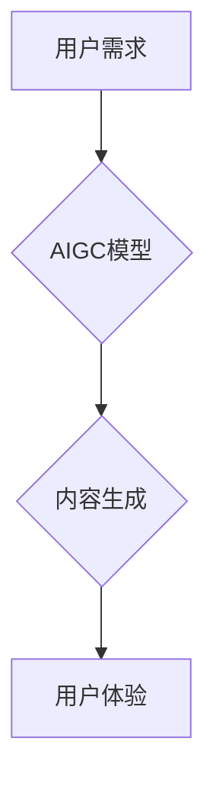

> AIGC, 
> 
> 人工智能生成内容, 
> 
> 职业规划, 
> 
> 技能提升, 
> 
> 未来趋势, 
> 
> 数字转型

## 1. 背景介绍

近年来，人工智能技术突飞猛进，特别是生成式人工智能（AIGC）的兴起，正在深刻地改变着我们生活和工作的方式。AIGC能够自动生成各种文本、图像、音频、视频等内容，极大地提高了内容生产效率，也为人们带来了全新的创作体验。

然而，AIGC的快速发展也引发了人们对职业未来的担忧。许多人担心，AIGC会取代人类的工作，导致失业率上升。面对这样的焦虑，我们需要冷静地分析AIGC带来的机遇和挑战，并积极调整自己的职业规划，以适应未来的发展趋势。

## 2. 核心概念与联系

**2.1 AIGC 简介**

AIGC是指利用人工智能技术，自动生成各种类型内容的系统。它基于深度学习算法，能够学习和理解大量数据，并根据这些数据生成新的、原创的内容。

**2.2 AIGC 的核心技术**

AIGC 的核心技术包括：

* **自然语言处理 (NLP)**：用于理解和生成人类语言。
* **计算机视觉 (CV)**：用于理解和生成图像和视频。
* **语音识别和合成 (ASR/TTS)**：用于理解和生成语音。
* **机器学习 (ML)**：用于训练 AIGC 模型，使其能够学习和生成高质量的内容。

**2.3 AIGC 与传统内容生产的对比**

| 特征 | 传统内容生产 | AIGC |
|---|---|---|
| 内容生成方式 | 人工创作 | 自动生成 |
| 效率 | 低 | 高 |
| 成本 | 高 | 低 |
| 创意 | 高 | 中等 |
| 个性化 | 高 | 中等 |

**2.4 AIGC 的应用场景**

AIGC 的应用场景非常广泛，包括：

* **内容创作**: 自动生成文章、博客、广告文案、剧本等。
* **教育**: 自动生成学习材料、练习题、个性化辅导等。
* **娱乐**: 自动生成游戏、音乐、视频等。
* **客服**: 自动回复客户咨询，提供个性化服务。
* **营销**: 自动生成营销文案、广告创意等。

**2.5 AIGC 的发展趋势**

AIGC 还在快速发展中，未来将朝着以下方向发展：

* **更强大的生成能力**: AIGC 模型将能够生成更复杂、更具创意的内容。
* **更广泛的应用场景**: AIGC 将应用于更多领域，改变更多行业。
* **更个性化的体验**: AIGC 将能够根据用户的需求和喜好，生成个性化的内容。

**2.6 Mermaid 流程图**



## 3. 核心算法原理 & 具体操作步骤

**3.1 算法原理概述**

AIGC 的核心算法主要基于深度学习，特别是 Transformer 架构。Transformer 模型能够有效地捕捉文本中的长距离依赖关系，从而生成更流畅、更自然的文本。

**3.2 算法步骤详解**

1. **数据预处理**: 将原始数据进行清洗、格式化和编码，以便模型训练。
2. **模型训练**: 使用训练数据训练 Transformer 模型，使其能够学习语言的规律和模式。
3. **文本生成**: 将待生成的文本输入到训练好的模型中，模型会根据其学习到的知识生成新的文本。
4. **文本后处理**: 对生成的文本进行语法检查、格式调整等操作，使其更加符合用户的需求。

**3.3 算法优缺点**

**优点**:

* 生成能力强，能够生成高质量、原创的内容。
* 效率高，能够快速生成大量内容。
* 可定制性强，可以根据用户的需求进行调整。

**缺点**:

* 训练成本高，需要大量的计算资源和数据。
* 模型容易受到训练数据的影响，可能生成带有偏见或错误的内容。
* 缺乏真正的创造力，生成的文本往往缺乏深度和思考。

**3.4 算法应用领域**

AIGC 的算法应用领域非常广泛，包括：

* 文本生成：文章、故事、诗歌、代码等。
* 图像生成：图片、插画、视频等。
* 音频生成：音乐、语音合成等。
* 机器翻译：将一种语言翻译成另一种语言。
* 聊天机器人：与用户进行自然语言对话。

## 4. 数学模型和公式 & 详细讲解 & 举例说明

**4.1 数学模型构建**

AIGC 的数学模型通常基于神经网络，特别是 Transformer 架构。Transformer 模型由多个编码器和解码器组成，每个编码器和解码器由多个注意力层和多层感知机组成。

**4.2 公式推导过程**

Transformer 模型的注意力机制是其核心组成部分，其计算公式如下：

$$
Attention(Q, K, V) = softmax(\frac{QK^T}{\sqrt{d_k}})V
$$

其中：

* $Q$：查询矩阵
* $K$：键矩阵
* $V$：值矩阵
* $d_k$：键向量的维度
* $softmax$：softmax 函数

**4.3 案例分析与讲解**

假设我们想要训练一个 AIGC 模型生成诗歌。我们可以使用 Transformer 模型，并训练它在大量的诗歌数据上。模型会学习诗歌的结构、韵律和主题，并能够根据用户的输入生成新的诗歌。

## 5. 项目实践：代码实例和详细解释说明

**5.1 开发环境搭建**

AIGC 的开发环境通常需要 Python 语言、深度学习框架（如 TensorFlow 或 PyTorch）以及一些必要的库（如 NLTK、Transformers）。

**5.2 源代码详细实现**

```python
from transformers import AutoModelForCausalLM, AutoTokenizer

# 加载预训练模型和词典
model_name = "gpt2"
tokenizer = AutoTokenizer.from_pretrained(model_name)
model = AutoModelForCausalLM.from_pretrained(model_name)

# 输入文本
prompt = "今天天气真好"

# 生成文本
inputs = tokenizer(prompt, return_tensors="pt")
outputs = model.generate(**inputs)

# 输出生成文本
generated_text = tokenizer.decode(outputs[0], skip_special_tokens=True)
print(generated_text)
```

**5.3 代码解读与分析**

这段代码演示了如何使用预训练的 GPT-2 模型生成文本。首先，我们加载了 GPT-2 的模型和词典。然后，我们输入了一个文本提示，并使用模型生成文本。最后，我们解码生成的文本，并将其打印出来。

**5.4 运行结果展示**

运行这段代码后，模型会根据输入的提示生成一段相关的文本。例如，输入 "今天天气真好"，模型可能会生成 "阳光明媚，心情愉快" 这样的文本。

## 6. 实际应用场景

**6.1 内容创作**

AIGC 可以帮助作家、记者、广告文案撰写人等快速生成高质量的内容，例如文章、博客、广告文案、剧本等。

**6.2 教育**

AIGC 可以帮助老师生成个性化的学习材料、练习题、辅导等，提高教学效率和学生的学习体验。

**6.3 娱乐**

AIGC 可以用于生成游戏、音乐、视频等娱乐内容，为用户提供更丰富多彩的体验。

**6.4 未来应用展望**

AIGC 的应用场景还在不断扩展，未来将应用于更多领域，例如：

* **医疗**: 自动生成病历、诊断报告等。
* **法律**: 自动生成法律文件、合同等。
* **金融**: 自动生成财务报表、风险评估等。

## 7. 工具和资源推荐

**7.1 学习资源推荐**

* **书籍**:
    * 《深度学习》
    * 《自然语言处理》
    * 《Transformer 详解》
* **在线课程**:
    * Coursera 上的深度学习课程
    * edX 上的自然语言处理课程
* **博客**:
    * Jay Alammar 的博客
    * Hugging Face 的博客

**7.2 开发工具推荐**

* **深度学习框架**: TensorFlow, PyTorch
* **自然语言处理库**: NLTK, SpaCy
* **AIGC 平台**: OpenAI API, Hugging Face Hub

**7.3 相关论文推荐**

* 《Attention Is All You Need》
* 《BERT: Pre-training of Deep Bidirectional Transformers for Language Understanding》
* 《GPT-3: Language Models are Few-Shot Learners》

## 8. 总结：未来发展趋势与挑战

**8.1 研究成果总结**

近年来，AIGC 领域取得了显著的进展，模型的生成能力和应用场景不断扩展。

**8.2 未来发展趋势**

AIGC 将朝着以下方向发展：

* **更强大的生成能力**: 模型将能够生成更复杂、更具创意的内容。
* **更广泛的应用场景**: AIGC 将应用于更多领域，改变更多行业。
* **更个性化的体验**: AIGC 将能够根据用户的需求和喜好，生成个性化的内容。

**8.3 面临的挑战**

AIGC 发展也面临一些挑战：

* **数据安全和隐私**: AIGC 模型的训练需要大量数据，如何保证数据的安全和隐私是一个重要问题。
* **算法偏见**: AIGC 模型容易受到训练数据的影响，可能生成带有偏见或错误的内容。
* **伦理问题**: AIGC 的应用可能会引发一些伦理问题，例如内容原创权、人工智能的责任等。

**8.4 研究展望**

未来，我们需要继续研究 AIGC 的算法原理、模型架构和应用场景，并积极解决其面临的挑战，推动 AIGC 技术的健康发展。

## 9. 附录：常见问题与解答

**9.1 如何学习 AIGC 技术？**

学习 AIGC 技术需要掌握深度学习、自然语言处理等相关知识。可以参考上述学习资源进行学习。

**9.2 如何使用 AIGC 工具？**

不同的 AIGC 工具使用方法不同，需要参考其官方文档进行学习。

**9.3 AIGC 会取代人类工作吗？**

AIGC 能够提高工作效率，但不会完全取代人类工作。人类仍然需要发挥创造力、批判性思维和解决问题的能力。


作者：禅与计算机程序设计艺术 / Zen and the Art of Computer Programming 
<end_of_turn>