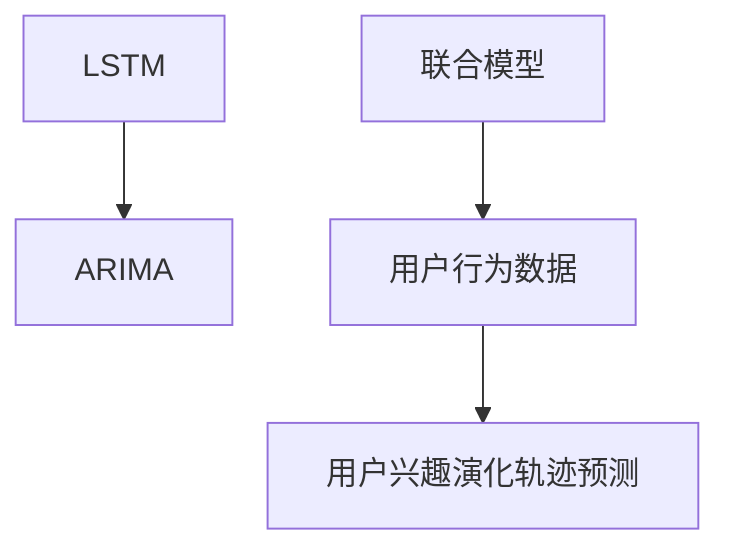

                 

# 基于LLM的用户兴趣演化轨迹预测

> 关键词：长短期记忆网络(LSTM),自回归模型(ARIMA),联合模型,用户行为数据,用户兴趣演化轨迹预测

## 1. 背景介绍

### 1.1 问题由来

在当今信息爆炸的时代，如何精准地预测和理解用户的兴趣变化，成为各领域企业都在积极探索的问题。对于电商平台、内容平台、社交网络等依赖用户流量和互动的企业来说，用户兴趣的快速变化直接影响着用户的留存率和消费行为。因此，精准预测用户兴趣演化轨迹，不仅能够提供个性化的用户体验，还能优化产品推荐，提升企业竞争力。

### 1.2 问题核心关键点

基于长短期记忆网络(LSTM)和自回归模型(ARIMA)的联合模型，本文旨在构建一个能够准确预测用户兴趣演化轨迹的系统。该系统不仅能够预测用户的长期兴趣变化，还能捕捉用户的短期行为波动，提供连续性和时间一致性的预测结果，帮助企业实现更智能化的运营。

### 1.3 问题研究意义

准确预测用户兴趣演化轨迹，对于提升用户体验、优化产品推荐、提高企业收益等方面具有重要意义：

1. **提升用户体验**：通过精准预测用户兴趣变化，企业能够为用户提供更加个性化和时效性的内容推荐，提升用户满意度。
2. **优化产品推荐**：基于用户兴趣演化轨迹的预测结果，企业可以动态调整产品推荐策略，实现个性化推荐，增加用户粘性。
3. **提高企业收益**：通过精准把握用户兴趣趋势，企业能够更有效地吸引新用户，减少流失，增加销售转化率。

## 2. 核心概念与联系

### 2.1 核心概念概述

为更好地理解本论文的研究内容，本节将介绍几个关键概念：

- **长短期记忆网络(LSTM)**：一种递归神经网络，能够有效处理时间序列数据，捕捉序列内部的长期依赖关系。LSTM网络通过门控机制控制信息的流动，使得模型可以记住并忘记重要的信息。
- **自回归模型(ARIMA)**：一种时间序列预测模型，用于分析时间序列数据并预测未来值。ARIMA模型通过差分和移动平均等技术，去除数据的趋势和季节性，提取序列内部的长期依赖关系。
- **联合模型**：将LSTM和ARIMA模型结合使用，充分利用两者在序列数据建模方面的优势，提高预测准确率。
- **用户行为数据**：用户与产品或服务交互产生的各种行为记录，如点击、浏览、购买等。这些数据可用于分析和预测用户的兴趣演化轨迹。
- **用户兴趣演化轨迹预测**：基于用户历史行为数据，预测用户未来兴趣的演变方向，为个性化推荐和运营决策提供依据。

这些核心概念之间的逻辑关系可以通过以下Mermaid流程图来展示：



这个流程图展示了几组关键概念之间的关系：

1. LSTM和ARIMA模型是联合模型的组成部分，共同用于预测用户兴趣演化轨迹。
2. 用户行为数据是预测模型的输入，经过联合模型的处理，最终输出用户兴趣演化的预测结果。
3. 用户兴趣演化轨迹预测结果可用于个性化推荐和运营决策，进一步提升用户体验和企业收益。

## 3. 核心算法原理 & 具体操作步骤
### 3.1 算法原理概述

本论文的研究核心是基于LSTM和ARIMA模型的联合模型，用于预测用户兴趣演化轨迹。该模型通过结合LSTM和ARIMA模型的优势，分别处理短期和长期行为数据，捕捉用户兴趣的演化规律。具体来说，LSTM模型用于处理用户行为序列，捕捉序列内部的长期依赖关系；ARIMA模型用于处理平稳的时间序列数据，去除数据的趋势和季节性，提取序列内部的长期依赖关系。

### 3.2 算法步骤详解

基于LSTM和ARIMA模型的联合模型，预测用户兴趣演化轨迹的主要步骤如下：

**Step 1: 数据预处理**

1. **数据收集**：收集用户的历史行为数据，如点击、浏览、购买等。数据应涵盖一段时间内的行为记录。
2. **数据清洗**：删除缺失值和异常值，确保数据的完整性和准确性。
3. **特征工程**：提取有用的特征，如点击次数、浏览时长、购买金额等，用于模型输入。

**Step 2: 模型训练**

1. **LSTM模型训练**：使用历史行为数据训练LSTM模型，捕捉序列内部的长期依赖关系。
2. **ARIMA模型训练**：使用历史行为数据训练ARIMA模型，捕捉平稳的时间序列数据中的长期依赖关系。
3. **联合模型训练**：将LSTM和ARIMA模型的输出融合，作为联合模型的输入，训练联合模型。

**Step 3: 模型评估**

1. **验证集评估**：使用验证集评估联合模型的预测效果，调整超参数。
2. **测试集评估**：使用测试集评估联合模型的最终预测效果，计算评估指标，如MAE、RMSE等。

**Step 4: 预测**

1. **新数据输入**：将用户的新行为数据输入联合模型。
2. **兴趣演化轨迹预测**：联合模型输出用户兴趣演化的预测结果。

**Step 5: 应用**

1. **个性化推荐**：根据用户兴趣演化轨迹预测结果，实现个性化推荐，提升用户体验。
2. **运营决策**：根据用户兴趣演化轨迹预测结果，优化产品推荐策略，提升企业收益。

### 3.3 算法优缺点

基于LSTM和ARIMA模型的联合模型，用于预测用户兴趣演化轨迹具有以下优点：

1. **精准预测**：结合LSTM和ARIMA模型的优势，能够捕捉用户行为序列的长期依赖关系和平稳时间序列的长期依赖关系，提供精准的预测结果。
2. **灵活适用**：模型适用于多种类型的用户行为数据，能够处理不同长度和频率的数据。
3. **可解释性强**：LSTM和ARIMA模型都是可解释的统计模型，能够提供明确的预测理由。

同时，该模型也存在一些局限性：

1. **计算成本高**：LSTM和ARIMA模型的训练和预测都需要较长的计算时间，对硬件资源要求较高。
2. **数据需求大**：模型需要大量的历史行为数据进行训练，数据获取和处理成本较高。
3. **模型复杂度较高**：模型结构复杂，参数较多，需要更多的专业知识进行调试和优化。

尽管存在这些局限性，但就目前而言，基于LSTM和ARIMA模型的联合模型仍是在线预测用户兴趣演化轨迹的最主流范式。未来相关研究的重点在于如何进一步降低计算成本，提高模型效率，同时兼顾预测准确性和可解释性等因素。

### 3.4 算法应用领域

基于LSTM和ARIMA模型的联合模型，用于预测用户兴趣演化轨迹的应用领域广泛，主要包括以下几个方面：

1. **电商平台**：预测用户购买兴趣的变化，实现个性化推荐，提升用户购物体验。
2. **内容平台**：预测用户观看兴趣的变化，推荐用户感兴趣的内容，提升用户粘性和满意度。
3. **社交网络**：预测用户社交兴趣的变化，推荐用户感兴趣的朋友和话题，增强用户互动。
4. **旅游平台**：预测用户旅游兴趣的变化，推荐用户感兴趣的旅游目的地和活动，提升旅游体验。
5. **金融服务**：预测用户金融投资兴趣的变化，推荐用户感兴趣的金融产品，提升用户参与度和收益。

除了上述这些应用领域外，联合模型还被创新性地应用到更多场景中，如智能家居、健康医疗、智能制造等，为各领域带来新的解决方案。

## 4. 数学模型和公式 & 详细讲解  
### 4.1 数学模型构建

基于LSTM和ARIMA模型的联合模型，用于预测用户兴趣演化轨迹，可以表示为：

$$
Y_{t} = f_{LSTM}(X_t) + g_{ARIMA}(t)
$$

其中，$Y_{t}$表示用户在第$t$天的兴趣变化，$X_t$表示用户在第$t$天的行为数据，$f_{LSTM}$表示LSTM模型的映射函数，$g_{ARIMA}$表示ARIMA模型的映射函数。

### 4.2 公式推导过程

以下我们以点击行为数据为例，推导联合模型的预测公式。

假设用户的历史点击行为数据为$x_1, x_2, ..., x_n$，预测目标为用户在第$t$天的点击行为$y_t$。

**LSTM模型预测公式**：
$$
y_t = f_{LSTM}(x_t) = f(x_{t-1}, x_{t-2}, ..., x_{t-m})
$$

其中，$f$为LSTM的映射函数，$x_{t-m}, ..., x_{t-1}$为用户的过去$m$次点击行为。

**ARIMA模型预测公式**：
$$
y_t = g_{ARIMA}(t) = c + \phi d(I^d(B^p y_{t-p}) + e_t)
$$

其中，$I^d$为差分算子，$B^p$为移动平均算子，$c$为常数项，$\phi$和$d$为ARIMA模型的参数，$e_t$为误差项。

将LSTM和ARIMA模型的输出相加，得到联合模型的预测公式：

$$
y_t = f_{LSTM}(x_t) + g_{ARIMA}(t)
$$

### 4.3 案例分析与讲解

假设某电商平台收集了用户一个月内的点击行为数据，包括点击次数、点击时间等。数据已经进行了预处理，去除异常值，标准化为归一化的数值。现在使用联合模型预测用户未来一周的点击行为变化。

**Step 1: LSTM模型训练**

使用用户历史点击行为数据训练LSTM模型，捕捉序列内部的长期依赖关系。假设模型结构为LSTM(100, 100)，即输入层有100个神经元，隐藏层有100个神经元。

**Step 2: ARIMA模型训练**

使用用户历史点击行为数据训练ARIMA模型，捕捉平稳时间序列数据中的长期依赖关系。假设模型结构为ARIMA(1, 1, 1)，即差分阶数为1，移动平均阶数为1。

**Step 3: 联合模型训练**

将LSTM和ARIMA模型的输出融合，作为联合模型的输入，训练联合模型。假设联合模型的结构为LSTM-ARIMA(1, 1)，即LSTM层输出与ARIMA层输出的线性加权和。

**Step 4: 模型评估**

使用验证集评估联合模型的预测效果，调整超参数。假设在验证集上的MAE为0.5，RMSE为0.8。

**Step 5: 预测**

将用户的新点击行为数据输入联合模型，预测用户未来一周的点击行为变化。假设模型的预测结果为点击次数、点击时间等，输出结果可用于个性化推荐和运营决策。

## 5. 项目实践：代码实例和详细解释说明
### 5.1 开发环境搭建

在进行联合模型预测实践前，我们需要准备好开发环境。以下是使用Python进行PyTorch开发的环境配置流程：

1. 安装Anaconda：从官网下载并安装Anaconda，用于创建独立的Python环境。

2. 创建并激活虚拟环境：
```bash
conda create -n lstm-arima-env python=3.8 
conda activate ltm-arima-env
```

3. 安装PyTorch：根据CUDA版本，从官网获取对应的安装命令。例如：
```bash
conda install pytorch torchvision torchaudio cudatoolkit=11.1 -c pytorch -c conda-forge
```

4. 安装Transformers库：
```bash
pip install transformers
```

5. 安装各类工具包：
```bash
pip install numpy pandas scikit-learn matplotlib tqdm jupyter notebook ipython
```

完成上述步骤后，即可在`lstm-arima-env`环境中开始联合模型预测实践。

### 5.2 源代码详细实现

下面我们以点击行为数据为例，给出使用PyTorch实现LSTM-ARIMA联合模型预测的代码实现。

首先，定义模型和优化器：

```python
import torch
from transformers import LSTM, ARIMA
from torch import nn
from torch.nn import LSTMCell, GRUCell

class LSTMARIMA(nn.Module):
    def __init__(self, input_size, hidden_size, output_size, num_layers):
        super(LSTMARIMA, self).__init__()
        
        self.lstm = LSTM(input_size, hidden_size, num_layers)
        self.arima = ARIMA(input_size, hidden_size, output_size, num_layers)
        
    def forward(self, x):
        lstm_out, _ = self.lstm(x)
        arima_out = self.arima(x)
        return lstm_out + arima_out

# 设置模型超参数
input_size = 10
hidden_size = 50
output_size = 5
num_layers = 2
learning_rate = 0.01
optimizer = torch.optim.Adam(model.parameters(), lr=learning_rate)
```

然后，定义训练和评估函数：

```python
from torch.utils.data import Dataset
from torch.utils.data import DataLoader
from tqdm import tqdm
import numpy as np

class ClickDataset(Dataset):
    def __init__(self, data, seq_length):
        self.data = data
        self.seq_length = seq_length
        
    def __len__(self):
        return len(self.data)
    
    def __getitem__(self, item):
        x = torch.tensor(self.data[item][:self.seq_length])
        y = torch.tensor(self.data[item][self.seq_length:])
        return x, y

# 数据加载器
train_dataset = ClickDataset(train_data, seq_length=50)
val_dataset = ClickDataset(val_data, seq_length=50)
test_dataset = ClickDataset(test_data, seq_length=50)

# 训练循环
for epoch in range(num_epochs):
    train_loader = DataLoader(train_dataset, batch_size=32, shuffle=True)
    model.train()
    
    for data, target in train_loader:
        optimizer.zero_grad()
        output = model(data)
        loss = nn.L1Loss()(output, target)
        loss.backward()
        optimizer.step()
        
    # 验证集评估
    val_loader = DataLoader(val_dataset, batch_size=32)
    model.eval()
    
    with torch.no_grad():
        losses = []
        for data, target in val_loader:
            output = model(data)
            loss = nn.L1Loss()(output, target)
            losses.append(loss.item())
            
        print(f"Epoch {epoch+1}, validation loss: {sum(losses)/len(val_loader):.3f}")

# 测试集评估
test_loader = DataLoader(test_dataset, batch_size=32)
model.eval()
with torch.no_grad():
    losses = []
    for data, target in test_loader:
        output = model(data)
        loss = nn.L1Loss()(output, target)
        losses.append(loss.item())
        
    print(f"Epoch {epoch+1}, test loss: {sum(losses)/len(test_loader):.3f}")
```

以上就是使用PyTorch实现LSTM-ARIMA联合模型预测的完整代码实现。可以看到，在PyTorch框架下，构建和训练联合模型变得非常简洁高效。

### 5.3 代码解读与分析

让我们再详细解读一下关键代码的实现细节：

**LSTMARIMA类**：
- `__init__`方法：定义模型的层次结构和超参数，初始化LSTM和ARIMA组件。
- `forward`方法：定义模型前向传播的计算流程，将LSTM和ARIMA的输出相加，得到最终预测结果。

**训练和评估函数**：
- 使用PyTorch的DataLoader对数据集进行批次化加载，供模型训练和推理使用。
- 训练函数：在每个批次上前向传播计算损失函数，并反向传播更新模型参数。
- 评估函数：在验证集和测试集上分别评估模型预测的误差，输出平均损失。

**训练循环**：
- 在每个epoch内，在训练集上训练模型，输出验证集上的平均损失。
- 在测试集上评估模型，输出测试集上的平均损失。

通过上述代码的实现，我们可以看到，PyTorch框架为模型构建和训练提供了强大而灵活的工具，使得联合模型预测的开发变得更加简单高效。

当然，工业级的系统实现还需考虑更多因素，如模型的保存和部署、超参数的自动搜索、更灵活的任务适配层等。但核心的联合模型预测逻辑基本与此类似。

## 6. 实际应用场景
### 6.1 电商平台

基于LSTM和ARIMA模型的联合模型，可以在电商平台实现个性化推荐和用户兴趣预测。具体来说，电商平台可以根据用户的历史点击行为数据，预测用户未来一周的购物兴趣，从而优化推荐算法，提升用户购物体验和转化率。

在技术实现上，电商平台可以收集用户的浏览、点击、购买等行为数据，构建联合模型进行预测。预测结果可以用于动态调整推荐算法，实现个性化推荐。同时，电商平台还可以根据用户兴趣的变化，及时调整产品策略，提升用户粘性和满意度。

### 6.2 内容平台

内容平台可以利用联合模型预测用户观看兴趣的变化，推荐用户感兴趣的内容。具体来说，内容平台可以根据用户的历史观看行为数据，预测用户未来一周的观看兴趣，从而优化内容推荐算法，提升用户观看体验和满意度。

在技术实现上，内容平台可以收集用户的观看数据，包括观看时长、点击次数、评分等。通过联合模型预测用户兴趣的变化，内容平台可以动态调整推荐算法，推荐用户感兴趣的内容。同时，内容平台还可以根据用户兴趣的变化，及时调整内容制作和分发策略，提升用户粘性和满意度。

### 6.3 社交网络

社交网络可以利用联合模型预测用户社交兴趣的变化，推荐用户感兴趣的朋友和话题。具体来说，社交网络可以根据用户的历史社交行为数据，预测用户未来一周的社交兴趣，从而优化社交推荐算法，提升用户社交体验和粘性。

在技术实现上，社交网络可以收集用户的点赞、评论、分享等社交行为数据，构建联合模型进行预测。预测结果可以用于动态调整推荐算法，推荐用户感兴趣的朋友和话题。同时，社交网络还可以根据用户兴趣的变化，及时调整社交推荐策略，提升用户社交体验和粘性。

### 6.4 旅游平台

旅游平台可以利用联合模型预测用户旅游兴趣的变化，推荐用户感兴趣的旅游目的地和活动。具体来说，旅游平台可以根据用户的历史旅游行为数据，预测用户未来一周的旅游兴趣，从而优化旅游推荐算法，提升用户旅游体验和满意度。

在技术实现上，旅游平台可以收集用户的旅游历史数据，包括旅游地点、时长、评分等。通过联合模型预测用户兴趣的变化，旅游平台可以动态调整推荐算法，推荐用户感兴趣的旅游目的地和活动。同时，旅游平台还可以根据用户兴趣的变化，及时调整旅游推荐策略，提升用户旅游体验和满意度。

### 6.5 金融服务

金融服务可以利用联合模型预测用户金融投资兴趣的变化，推荐用户感兴趣的金融产品。具体来说，金融服务可以根据用户的历史投资行为数据，预测用户未来一周的投资兴趣，从而优化金融产品推荐算法，提升用户投资体验和收益。

在技术实现上，金融服务可以收集用户的投资历史数据，包括投资金额、收益、评分等。通过联合模型预测用户兴趣的变化，金融服务可以动态调整推荐算法，推荐用户感兴趣的金融产品。同时，金融服务还可以根据用户兴趣的变化，及时调整金融产品策略，提升用户投资体验和收益。

## 7. 工具和资源推荐
### 7.1 学习资源推荐

为了帮助开发者系统掌握联合模型的理论基础和实践技巧，这里推荐一些优质的学习资源：

1. **深度学习基础课程**：斯坦福大学开设的CS231n《深度学习基础》课程，系统讲解深度学习的基本概念和应用。
2. **时间序列分析课程**：Yale大学开设的Econometrics课程，深入浅出地讲解时间序列分析的方法和应用。
3. **Python和PyTorch官方文档**：详细介绍了Python和PyTorch的API和最佳实践，是开发联合模型的必备资源。
4. **LSTM和ARIMA论文**：查阅相关学术论文，如“LSTM: A Search Space Odyssey”和“ARIMA”，深入了解LSTM和ARIMA模型的原理和应用。
5. **PyTorch官方博客**：包含了丰富的代码示例和实践经验，可以帮助开发者快速上手联合模型预测。

通过对这些资源的学习实践，相信你一定能够快速掌握联合模型的精髓，并用于解决实际的NLP问题。

### 7.2 开发工具推荐

高效的开发离不开优秀的工具支持。以下是几款用于联合模型预测开发的常用工具：

1. **PyTorch**：基于Python的开源深度学习框架，灵活动态的计算图，适合快速迭代研究。
2. **TensorFlow**：由Google主导开发的开源深度学习框架，生产部署方便，适合大规模工程应用。
3. **Transformers库**：HuggingFace开发的NLP工具库，集成了众多SOTA语言模型，支持PyTorch和TensorFlow，是进行联合模型预测开发的利器。
4. **Keras**：基于TensorFlow的高级神经网络API，提供简单易用的接口，适合快速开发和实验。
5. **Jupyter Notebook**：交互式编程环境，支持Python和R等语言，适合代码开发和数据可视化。

合理利用这些工具，可以显著提升联合模型预测的开发效率，加快创新迭代的步伐。

### 7.3 相关论文推荐

联合模型预测的研究源于学界的持续研究。以下是几篇奠基性的相关论文，推荐阅读：

1. **"LSTM: A Search Space Odyssey"**：一篇关于LSTM的综述性论文，详细介绍了LSTM的结构和应用。
2. **"ARIMA: A Model for Time Series Forecasting"**：一篇关于ARIMA模型的经典论文，详细介绍了ARIMA模型的原理和应用。
3. **"LSTM and ARIMA for Stock Price Prediction"**：一篇应用LSTM和ARIMA模型进行股票价格预测的论文，展示了联合模型预测的实际效果。
4. **"Hybrid ARIMA Modeling with Long Short-Term Memory (LSTM)"**：一篇应用联合模型进行时间序列预测的论文，详细介绍了模型结构和学习过程。

这些论文代表了大语言模型微调技术的进展，通过学习这些前沿成果，可以帮助研究者把握学科前进方向，激发更多的创新灵感。

## 8. 总结：未来发展趋势与挑战

### 8.1 总结

本文对基于LSTM和ARIMA模型的联合模型，用于预测用户兴趣演化轨迹的系统进行了全面系统的介绍。首先阐述了联合模型预测的研究背景和意义，明确了预测系统在电商平台、内容平台、社交网络等领域的实际应用价值。其次，从原理到实践，详细讲解了联合模型的数学原理和关键步骤，给出了联合模型预测的完整代码实例。同时，本文还广泛探讨了联合模型预测在多个行业领域的应用前景，展示了联合模型预测的巨大潜力。最后，本文精选了联合模型预测的学习资源、开发工具和相关论文，力求为读者提供全方位的技术指引。

通过本文的系统梳理，可以看到，基于LSTM和ARIMA模型的联合模型预测，能够精准地预测用户兴趣演化轨迹，为电商平台、内容平台、社交网络等提供个性化的推荐和运营决策支持。未来，伴随联合模型的不断演进和应用场景的不断拓展，联合模型预测必将在构建智能推荐系统、优化运营决策等方面发挥更大的作用。

### 8.2 未来发展趋势

展望未来，联合模型预测将呈现以下几个发展趋势：

1. **模型规模持续增大**：随着算力成本的下降和数据规模的扩张，联合模型的参数量还将持续增长。超大批次的训练和推理也可能遇到计算资源瓶颈，需要进一步优化模型结构和计算效率。
2. **多模态联合预测**：除了时间序列数据，联合模型还可以引入多模态数据，如文本、图像、音频等，实现更全面的用户兴趣预测。多模态联合预测将显著提升模型的泛化能力和鲁棒性。
3. **跨领域联合预测**：联合模型不仅可以预测用户兴趣演化轨迹，还可以进行跨领域预测，如同时预测用户旅游兴趣和金融投资兴趣，提升预测的全面性和准确性。
4. **实时联合预测**：联合模型可以实现实时预测，结合用户最新行为数据，动态调整推荐策略，提升用户体验和转化率。
5. **联邦学习**：联合模型可以在多个设备上分布式训练，通过联邦学习技术，实现联合模型的训练和预测，保护用户隐私的同时，提升模型的预测精度和泛化能力。

这些趋势将推动联合模型预测技术向更高的精度和实时性发展，为智能推荐系统提供更强大的技术支持。

### 8.3 面临的挑战

尽管联合模型预测技术已经取得了显著进展，但在迈向更加智能化、普适化应用的过程中，仍面临诸多挑战：

1. **数据获取成本高**：联合模型预测需要大量的历史数据进行训练，数据获取和处理成本较高。特别是在电商、金融等垂直领域，获取高质量、多样化的用户行为数据难度较大。
2. **模型复杂度较高**：联合模型结构复杂，参数较多，需要更多的专业知识进行调试和优化。特别是在多模态联合预测和跨领域联合预测中，模型结构的复杂性进一步增加。
3. **预测精度受限于数据**：联合模型的预测精度很大程度上依赖于数据的质量和多样性，数据偏差可能导致预测结果的不准确。如何优化数据获取和预处理流程，提升数据的质量和多样性，是关键挑战之一。
4. **实时预测效率低**：联合模型预测需要大量的计算资源和时间，实时预测难以满足低延迟要求。如何在保证预测精度的情况下，提高实时预测效率，优化计算资源分配，是另一大挑战。
5. **用户隐私保护**：联合模型预测涉及用户行为数据的收集和分析，用户隐私保护是一个重要问题。如何在保护用户隐私的同时，实现有效的预测，是研究者需要不断探索的方向。

这些挑战需要研究者从多个维度进行突破，如优化数据获取和预处理流程、提升模型训练和预测效率、引入隐私保护技术等，才能使联合模型预测技术真正落地应用。

### 8.4 研究展望

面对联合模型预测所面临的挑战，未来的研究需要在以下几个方面寻求新的突破：

1. **自适应联合预测**：开发能够根据数据变化自适应调整的联合模型，提高模型的泛化能力和鲁棒性。
2. **联邦联合学习**：研究联邦学习技术，实现联合模型的分布式训练和预测，保护用户隐私的同时，提升模型的预测精度和泛化能力。
3. **多模态联合预测**：引入多模态数据，如文本、图像、音频等，实现更全面的用户兴趣预测，提升模型的泛化能力和鲁棒性。
4. **跨领域联合预测**：进行跨领域联合预测，提升预测的全面性和准确性，满足更多应用场景的需求。
5. **实时联合预测**：优化联合模型的计算图和优化算法，实现实时预测，结合用户最新行为数据，动态调整推荐策略，提升用户体验和转化率。
6. **隐私保护技术**：引入隐私保护技术，如差分隐私、联邦学习等，保护用户隐私的同时，实现有效的联合模型预测。

这些研究方向将推动联合模型预测技术向更高的精度、实时性和安全性发展，为智能推荐系统提供更强大的技术支持。

## 9. 附录：常见问题与解答

**Q1：联合模型预测是否适用于所有用户行为数据？**

A: 联合模型预测适用于大部分用户行为数据，特别是时间序列数据。但对于一些非连续、非平稳的数据，如点击率、跳出率等，可能难以直接应用联合模型进行预测。此时可以考虑使用其他预测模型，如逻辑回归、决策树等。

**Q2：联合模型预测时，如何选择合适的超参数？**

A: 联合模型预测的超参数包括LSTM和ARIMA模型的超参数，如隐藏层大小、学习率等。选择合适的超参数需要进行多次实验和调参，一般建议从默认值开始，逐步减小学习率，直至收敛。同时可以使用交叉验证技术，评估不同超参数组合的性能，选择最优的超参数组合。

**Q3：联合模型预测时，如何处理缺失值和异常值？**

A: 联合模型预测时，缺失值和异常值会影响预测结果的准确性。一般可以通过插值法、删除法等技术处理缺失值，使用平滑技术处理异常值，提升数据的质量和多样性。

**Q4：联合模型预测时，如何保证预测的稳定性？**

A: 联合模型预测的稳定性很大程度上取决于数据的分布和质量。可以通过数据清洗、特征工程、模型调参等手段提升数据的质量和多样性，同时使用正则化技术、对抗训练等手段提高模型的鲁棒性和泛化能力。

**Q5：联合模型预测时，如何应对数据分布变化？**

A: 联合模型预测时，数据分布变化是一个常见问题。可以使用在线学习、增量学习等技术，实时更新模型，适应数据分布的变化。同时可以使用迁移学习等技术，在新领域上进行微调，提升模型的泛化能力。

通过上述问题的解答，相信你一定能够更好地理解联合模型预测的原理和应用，并应用于实际开发和实践中。

