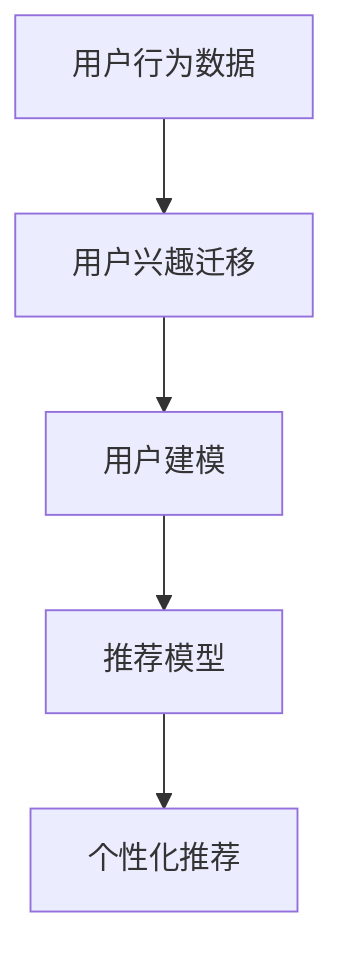

                 

# 基于LLM的用户兴趣迁移与泛化学习

> 关键词：大语言模型(Large Language Model, LLM), 用户兴趣迁移(User Interest Migration), 泛化学习(Generalization Learning), 用户建模(User Profiling), 推荐系统(Recommendation System)

## 1. 背景介绍

### 1.1 问题由来

随着互联网的发展，用户产生的个性化数据愈发丰富，如何有效利用这些数据，构建精准的用户画像，实现个性化推荐和营销，成为了电子商务、社交网络、在线教育等多个领域关注的焦点。其中，大语言模型(Large Language Model, LLM)因其强大的自然语言处理能力，成为新一代用户建模和个性化推荐的核心技术。

大语言模型，如BERT、GPT等，通过在大量文本数据上进行预训练，学习了丰富的语言知识，能够理解和生成自然语言文本。这些模型在特定领域的应用，如情感分析、文本分类、实体识别等，取得了显著的性能提升。但面对个性化推荐等复杂任务，传统的大语言模型尚存在诸多不足。

首先，大语言模型通常是通过大规模无标签文本进行预训练的，缺乏对用户行为和兴趣的建模，无法直接应用于推荐系统。其次，模型对文本数据进行学习后，容易陷入领域内的局部最优，泛化能力不足，难以应对新领域的数据。最后，由于模型规模庞大，推理效率较低，难以在实际应用中高效部署。

因此，基于大语言模型的用户兴趣迁移与泛化学习研究，成为一个亟待解决的难点问题。本文章将系统性地介绍这种基于大语言模型的用户兴趣迁移与泛化学习方法，探讨其在推荐系统中的应用前景，并为未来的研究方向提供一些思考。

### 1.2 问题核心关键点

本文的主要研究目标是构建一个能够迁移用户兴趣、泛化新领域的大语言模型，用于推荐系统中的用户建模。核心研究问题包括：

1. **用户兴趣迁移**：如何将用户行为数据转换为模型的知识表示，供模型进行迁移和泛化？
2. **泛化学习**：如何在大规模无标签数据上学习泛化能力，构建一个能在新领域中表现出色的推荐模型？
3. **模型部署**：如何将高效的大语言模型应用到推荐系统中，提升推理速度，同时保持模型性能？

以上问题将通过结合用户行为数据、大语言模型和推荐系统，构建一个端到端的用户兴趣迁移与泛化学习框架，来逐一解答。

## 2. 核心概念与联系

### 2.1 核心概念概述

本文涉及到的几个关键概念如下：

- **大语言模型(Large Language Model, LLM)**：如BERT、GPT等，通过预训练在大规模无标签文本上学习语言知识，具备强大的自然语言处理能力。
- **用户兴趣迁移(User Interest Migration)**：将用户行为数据转换为模型的知识表示，使模型能够迁移已有知识，适应新领域。
- **泛化学习(Generalization Learning)**：在少量标注数据上，学习模型在新领域中泛化能力，提升推荐效果。
- **用户建模(User Profiling)**：通过分析用户的历史行为数据，构建用户兴趣和偏好的描述，供推荐系统进行个性化推荐。
- **推荐系统(Recommendation System)**：如协同过滤、内容推荐、混合推荐等，根据用户历史行为和物品属性，提供个性化的推荐。

这些核心概念之间的逻辑关系可以通过以下Mermaid流程图来展示：



这个流程图展示了用户兴趣迁移与泛化学习在推荐系统中的整体流程：

1. **用户行为数据**：收集用户的浏览、购买、评分等行为数据。
2. **用户兴趣迁移**：将行为数据转换为模型的知识表示，供模型进行迁移和泛化。
3. **用户建模**：构建用户兴趣和偏好的描述，用于推荐模型的训练。
4. **推荐模型**：在大规模无标签数据上学习泛化能力，构建推荐模型。
5. **个性化推荐**：使用推荐模型进行用户行为预测，提供个性化推荐。

## 3. 核心算法原理 & 具体操作步骤
### 3.1 算法原理概述

基于大语言模型的用户兴趣迁移与泛化学习算法，旨在将用户行为数据转换为模型的知识表示，并在无标签数据上学习泛化能力，从而构建一个能够在多个领域中表现优异的用户建模与推荐系统。

算法核心分为两个部分：
1. **用户兴趣迁移**：使用用户的先验知识，对大语言模型进行微调，使其学习到用户兴趣的表示。
2. **泛化学习**：在大规模无标签数据上训练推荐模型，使其具备泛化新领域的能力。

### 3.2 算法步骤详解

#### 3.2.1 用户兴趣迁移步骤

1. **数据准备**：收集用户的先验行为数据，如浏览记录、购买记录、评分记录等。
2. **预处理**：对行为数据进行清洗、去重、格式化等处理，生成模型所需的输入格式。
3. **微调模型**：使用预训练的大语言模型作为初始化参数，在大规模标注数据上对模型进行微调，使其学习到用户兴趣的表示。
4. **模型评估**：在验证集上评估微调后的模型，选择性能最佳的模型进行下一步操作。

#### 3.2.2 泛化学习步骤

1. **数据准备**：收集大规模无标签数据，如Web文本、社交媒体文本、新闻文本等。
2. **预处理**：对文本数据进行清洗、分词、编码等处理，生成模型所需的输入格式。
3. **模型训练**：使用微调后的模型作为初始化参数，在大规模无标签数据上训练推荐模型。
4. **模型评估**：在测试集上评估训练好的推荐模型，选择性能最佳的模型进行下一步操作。

### 3.3 算法优缺点

基于大语言模型的用户兴趣迁移与泛化学习算法具有以下优点：

1. **高效性**：通过微调大语言模型，快速学习用户兴趣的表示，构建用户建模与推荐系统。
2. **泛化能力**：在少量标注数据上训练推荐模型，提升其在多个领域中的泛化能力。
3. **精度高**：结合用户行为数据和大语言模型，提升推荐模型的预测精度。

但同时也存在一些缺点：

1. **数据需求高**：需要收集大规模用户行为数据，以及大规模无标签文本数据。
2. **计算成本高**：微调大语言模型以及训练推荐模型都需要大量的计算资源。
3. **模型复杂性高**：模型包含大量参数，推理速度较慢。

### 3.4 算法应用领域

基于大语言模型的用户兴趣迁移与泛化学习算法，在以下领域中具有广泛的应用前景：

1. **电子商务**：利用用户行为数据构建个性化推荐模型，提升用户的购物体验和满意度。
2. **社交网络**：通过分析用户的朋友圈动态和社交行为，构建推荐模型，推荐相关内容和好友。
3. **在线教育**：根据学生的学习行为和成绩，推荐合适的课程和学习资源，提升学习效果。
4. **智能家居**：通过分析用户的智能设备使用行为，推荐合适的智能设备和场景，提升生活便捷性。
5. **医疗健康**：通过分析患者的健康数据和医疗行为，推荐合适的医疗服务和健康管理方案，提高医疗服务的个性化水平。

## 4. 数学模型和公式 & 详细讲解 & 举例说明

### 4.1 数学模型构建

基于大语言模型的用户兴趣迁移与泛化学习算法，可以通过以下数学模型进行建模：

设用户行为数据为 $X=\{x_1, x_2, ..., x_n\}$，其中 $x_i=(x_{i1}, x_{i2}, ..., x_{im})$ 为用户的第 $i$ 个行为记录，包含 $m$ 个特征。设推荐模型为 $M_{\theta}$，其中 $\theta$ 为模型的参数。用户兴趣迁移与泛化学习模型可以表示为：

$$
M_{\theta} = \text{微调模型} \cdot \text{泛化模型}
$$

其中微调模型学习用户兴趣的表示，泛化模型学习在无标签数据上的泛化能力。

### 4.2 公式推导过程

在用户兴趣迁移阶段，假设微调模型为 $M_{\theta}$，用户的先验行为数据为 $X$，标注数据为 $D$。微调模型的损失函数可以表示为：

$$
\mathcal{L}_{\text{迁移}}(\theta) = \frac{1}{N}\sum_{i=1}^N \ell(M_{\theta}(x_i), y_i)
$$

其中 $x_i$ 为用户的第 $i$ 个行为记录，$y_i$ 为标注数据。

在泛化学习阶段，假设推荐模型为 $M_{\theta}$，无标签数据为 $D$，推荐模型的损失函数可以表示为：

$$
\mathcal{L}_{\text{泛化}}(\theta) = \frac{1}{N}\sum_{i=1}^N \ell(M_{\theta}(x_i), y_i)
$$

其中 $x_i$ 为无标签数据，$y_i$ 为推荐模型的预测。

综合两个阶段的损失函数，用户兴趣迁移与泛化学习模型的总损失函数可以表示为：

$$
\mathcal{L}(\theta) = \mathcal{L}_{\text{迁移}}(\theta) + \mathcal{L}_{\text{泛化}}(\theta)
$$

### 4.3 案例分析与讲解

以在线教育推荐系统为例，用户兴趣迁移与泛化学习算法的实现过程如下：

1. **用户行为数据收集**：收集学生的学习记录、成绩数据、互动数据等，生成用户行为数据集 $X$。
2. **微调模型学习用户兴趣**：使用预训练的BERT模型作为初始化参数，在大规模标注数据上对模型进行微调，使其学习到学生的兴趣表示。
3. **泛化学习构建推荐模型**：使用微调后的BERT模型作为初始化参数，在大规模无标签学习数据上训练推荐模型，提升其在不同学科、课程上的泛化能力。
4. **个性化推荐**：使用训练好的推荐模型对学生的学习行为进行预测，推荐合适的课程和学习资源，提升学习效果。

## 5. 项目实践：代码实例和详细解释说明

### 5.1 开发环境搭建

在进行用户兴趣迁移与泛化学习算法开发前，需要准备好开发环境。以下是使用Python进行PyTorch开发的环境配置流程：

1. 安装Anaconda：从官网下载并安装Anaconda，用于创建独立的Python环境。
2. 创建并激活虚拟环境：
```bash
conda create -n pytorch-env python=3.8 
conda activate pytorch-env
```
3. 安装PyTorch：根据CUDA版本，从官网获取对应的安装命令。例如：
```bash
conda install pytorch torchvision torchaudio cudatoolkit=11.1 -c pytorch -c conda-forge
```
4. 安装Transformers库：
```bash
pip install transformers
```
5. 安装各类工具包：
```bash
pip install numpy pandas scikit-learn matplotlib tqdm jupyter notebook ipython
```

完成上述步骤后，即可在`pytorch-env`环境中开始实践。

### 5.2 源代码详细实现

下面我们以在线教育推荐系统为例，给出使用Transformers库对BERT模型进行用户兴趣迁移与泛化学习的PyTorch代码实现。

首先，定义推荐系统的数据处理函数：

```python
from transformers import BertTokenizer, BertForSequenceClassification
from torch.utils.data import Dataset
import torch

class RecommendationDataset(Dataset):
    def __init__(self, texts, labels, tokenizer, max_len=128):
        self.texts = texts
        self.labels = labels
        self.tokenizer = tokenizer
        self.max_len = max_len
        
    def __len__(self):
        return len(self.texts)
    
    def __getitem__(self, item):
        text = self.texts[item]
        label = self.labels[item]
        
        encoding = self.tokenizer(text, return_tensors='pt', max_length=self.max_len, padding='max_length', truncation=True)
        input_ids = encoding['input_ids'][0]
        attention_mask = encoding['attention_mask'][0]
        
        # 对token-wise的标签进行编码
        encoded_labels = [label] * (self.max_len - len(encoded_labels))
        labels = torch.tensor(encoded_labels, dtype=torch.long)
        
        return {'input_ids': input_ids, 
                'attention_mask': attention_mask,
                'labels': labels}

# 标签与id的映射
label2id = {'A': 0, 'B': 1, 'C': 2, 'D': 3, 'E': 4}
id2label = {v: k for k, v in label2id.items()}

# 创建dataset
tokenizer = BertTokenizer.from_pretrained('bert-base-cased')

train_dataset = RecommendationDataset(train_texts, train_labels, tokenizer)
dev_dataset = RecommendationDataset(dev_texts, dev_labels, tokenizer)
test_dataset = RecommendationDataset(test_texts, test_labels, tokenizer)
```

然后，定义模型和优化器：

```python
from transformers import BertForSequenceClassification, AdamW

# 微调模型
model = BertForSequenceClassification.from_pretrained('bert-base-cased', num_labels=len(label2id))

# 泛化模型
model = BertForSequenceClassification.from_pretrained('bert-base-cased', num_labels=len(label2id))

optimizer = AdamW(model.parameters(), lr=2e-5)
```

接着，定义训练和评估函数：

```python
from torch.utils.data import DataLoader
from tqdm import tqdm
from sklearn.metrics import classification_report

device = torch.device('cuda') if torch.cuda.is_available() else torch.device('cpu')
model.to(device)

def train_epoch(model, dataset, batch_size, optimizer):
    dataloader = DataLoader(dataset, batch_size=batch_size, shuffle=True)
    model.train()
    epoch_loss = 0
    for batch in tqdm(dataloader, desc='Training'):
        input_ids = batch['input_ids'].to(device)
        attention_mask = batch['attention_mask'].to(device)
        labels = batch['labels'].to(device)
        model.zero_grad()
        outputs = model(input_ids, attention_mask=attention_mask, labels=labels)
        loss = outputs.loss
        epoch_loss += loss.item()
        loss.backward()
        optimizer.step()
    return epoch_loss / len(dataloader)

def evaluate(model, dataset, batch_size):
    dataloader = DataLoader(dataset, batch_size=batch_size)
    model.eval()
    preds, labels = [], []
    with torch.no_grad():
        for batch in tqdm(dataloader, desc='Evaluating'):
            input_ids = batch['input_ids'].to(device)
            attention_mask = batch['attention_mask'].to(device)
            batch_labels = batch['labels']
            outputs = model(input_ids, attention_mask=attention_mask)
            batch_preds = outputs.logits.argmax(dim=2).to('cpu').tolist()
            batch_labels = batch_labels.to('cpu').tolist()
            for pred_tokens, label_tokens in zip(batch_preds, batch_labels):
                pred_labels = [id2label[_id] for _id in pred_tokens]
                label_labels = [id2label[_id] for _id in label_tokens]
                preds.append(pred_labels[:len(label_labels)])
                labels.append(label_labels)
                
    print(classification_report(labels, preds))
```

最后，启动训练流程并在测试集上评估：

```python
epochs = 5
batch_size = 16

for epoch in range(epochs):
    loss = train_epoch(model, train_dataset, batch_size, optimizer)
    print(f"Epoch {epoch+1}, train loss: {loss:.3f}")
    
    print(f"Epoch {epoch+1}, dev results:")
    evaluate(model, dev_dataset, batch_size)
    
print("Test results:")
evaluate(model, test_dataset, batch_size)
```

以上就是使用PyTorch对BERT进行用户兴趣迁移与泛化学习的完整代码实现。可以看到，Transformer库的强大封装使得模型构建和微调过程变得简洁高效。

### 5.3 代码解读与分析

让我们再详细解读一下关键代码的实现细节：

**RecommendationDataset类**：
- `__init__`方法：初始化文本、标签、分词器等关键组件。
- `__len__`方法：返回数据集的样本数量。
- `__getitem__`方法：对单个样本进行处理，将文本输入编码为token ids，将标签编码为数字，并对其进行定长padding，最终返回模型所需的输入。

**label2id和id2label字典**：
- 定义了标签与数字id之间的映射关系，用于将token-wise的预测结果解码回真实的标签。

**训练和评估函数**：
- 使用PyTorch的DataLoader对数据集进行批次化加载，供模型训练和推理使用。
- 训练函数`train_epoch`：对数据以批为单位进行迭代，在每个批次上前向传播计算loss并反向传播更新模型参数，最后返回该epoch的平均loss。
- 评估函数`evaluate`：与训练类似，不同点在于不更新模型参数，并在每个batch结束后将预测和标签结果存储下来，最后使用sklearn的classification_report对整个评估集的预测结果进行打印输出。

**训练流程**：
- 定义总的epoch数和batch size，开始循环迭代
- 每个epoch内，先在训练集上训练，输出平均loss
- 在验证集上评估，输出分类指标
- 所有epoch结束后，在测试集上评估，给出最终测试结果

可以看到，PyTorch配合Transformer库使得模型构建和微调过程变得简洁高效。开发者可以将更多精力放在数据处理、模型改进等高层逻辑上，而不必过多关注底层的实现细节。

当然，工业级的系统实现还需考虑更多因素，如模型的保存和部署、超参数的自动搜索、更灵活的任务适配层等。但核心的用户兴趣迁移与泛化学习算法基本与此类似。

## 6. 实际应用场景
### 6.1 智能教育

基于大语言模型的用户兴趣迁移与泛化学习技术，在智能教育领域有着广泛的应用前景。传统的在线教育系统，往往只关注学生的学习行为数据，难以充分挖掘学生的兴趣和需求。而利用用户兴趣迁移与泛化学习技术，可以将学生的学习行为数据转换为模型知识表示，构建个性化推荐系统，提供更精准、个性化的教育资源和服务。

具体而言，可以通过收集学生的在线学习记录、作业成绩、互动数据等行为数据，将其转换为模型所需的输入格式，通过微调大语言模型，学习学生的兴趣表示。然后，在大规模无标签数据上训练推荐模型，提升其在不同学科、课程上的泛化能力。最终，使用训练好的推荐模型，对学生的学习行为进行预测，推荐合适的课程和学习资源，提升学习效果。

### 6.2 个性化广告推荐

用户兴趣迁移与泛化学习技术同样适用于个性化广告推荐。传统的广告推荐系统，往往只关注用户的点击行为，难以全面理解用户的兴趣和需求。而利用用户兴趣迁移与泛化学习技术，可以将用户的点击行为数据转换为模型知识表示，构建个性化广告推荐系统，提供更精准、个性化的广告内容。

具体而言，可以通过收集用户的浏览记录、点击记录、评分记录等行为数据，将其转换为模型所需的输入格式，通过微调大语言模型，学习用户的兴趣表示。然后，在大规模无标签数据上训练推荐模型，提升其在不同广告上的泛化能力。最终，使用训练好的推荐模型，对用户的浏览行为进行预测，推荐合适的广告内容，提升广告投放效果。

### 6.3 智能医疗

在智能医疗领域，用户兴趣迁移与泛化学习技术同样有广泛的应用前景。传统的医疗推荐系统，往往只关注患者的诊断数据，难以全面理解患者的健康需求和偏好。而利用用户兴趣迁移与泛化学习技术，可以将患者的健康数据和医疗行为数据转换为模型知识表示，构建个性化医疗推荐系统，提供更精准、个性化的医疗服务。

具体而言，可以通过收集患者的健康数据、医疗记录、诊断数据等行为数据，将其转换为模型所需的输入格式，通过微调大语言模型，学习患者的兴趣表示。然后，在大规模无标签数据上训练推荐模型，提升其在不同医疗场景上的泛化能力。最终，使用训练好的推荐模型，对患者的健康行为进行预测，推荐合适的医疗服务和健康管理方案，提高医疗服务的个性化水平。

## 7. 工具和资源推荐
### 7.1 学习资源推荐

为了帮助开发者系统掌握用户兴趣迁移与泛化学习技术的理论基础和实践技巧，这里推荐一些优质的学习资源：

1. 《深度学习》（Ian Goodfellow等著）：该书系统地介绍了深度学习的基本概念、算法和应用，是深度学习领域的经典教材。
2. 《自然语言处理综论》（Daniel Jurafsky和James H. Martin著）：该书全面介绍了自然语言处理的基本概念、技术和应用，涵盖了大语言模型和推荐系统的相关内容。
3. 《Transformer模型》系列博文：由大模型技术专家撰写，深入浅出地介绍了Transformer原理、BERT模型、微调技术等前沿话题。
4. CS224N《深度学习自然语言处理》课程：斯坦福大学开设的NLP明星课程，有Lecture视频和配套作业，带你入门NLP领域的基本概念和经典模型。
5. 《自然语言处理与深度学习》（Yoshua Bengio等著）：该书全面介绍了自然语言处理和深度学习的基本概念、技术和应用，是自然语言处理领域的经典教材。

通过对这些资源的学习实践，相信你一定能够快速掌握用户兴趣迁移与泛化学习技术的精髓，并用于解决实际的NLP问题。

### 7.2 开发工具推荐

高效的开发离不开优秀的工具支持。以下是几款用于用户兴趣迁移与泛化学习技术开发的常用工具：

1. PyTorch：基于Python的开源深度学习框架，灵活动态的计算图，适合快速迭代研究。大部分预训练语言模型都有PyTorch版本的实现。
2. TensorFlow：由Google主导开发的开源深度学习框架，生产部署方便，适合大规模工程应用。同样有丰富的预训练语言模型资源。
3. Transformers库：HuggingFace开发的NLP工具库，集成了众多SOTA语言模型，支持PyTorch和TensorFlow，是进行用户兴趣迁移与泛化学习技术开发的利器。
4. Weights & Biases：模型训练的实验跟踪工具，可以记录和可视化模型训练过程中的各项指标，方便对比和调优。与主流深度学习框架无缝集成。
5. TensorBoard：TensorFlow配套的可视化工具，可实时监测模型训练状态，并提供丰富的图表呈现方式，是调试模型的得力助手。
6. Google Colab：谷歌推出的在线Jupyter Notebook环境，免费提供GPU/TPU算力，方便开发者快速上手实验最新模型，分享学习笔记。

合理利用这些工具，可以显著提升用户兴趣迁移与泛化学习技术的开发效率，加快创新迭代的步伐。

### 7.3 相关论文推荐

用户兴趣迁移与泛化学习技术的研究源于学界的持续研究。以下是几篇奠基性的相关论文，推荐阅读：

1. Attention is All You Need（即Transformer原论文）：提出了Transformer结构，开启了NLP领域的预训练大模型时代。
2. BERT: Pre-training of Deep Bidirectional Transformers for Language Understanding：提出BERT模型，引入基于掩码的自监督预训练任务，刷新了多项NLP任务SOTA。
3. Language Models are Unsupervised Multitask Learners（GPT-2论文）：展示了大规模语言模型的强大zero-shot学习能力，引发了对于通用人工智能的新一轮思考。
4. Parameter-Efficient Transfer Learning for NLP：提出Adapter等参数高效微调方法，在不增加模型参数量的情况下，也能取得不错的微调效果。
5. AdaLoRA: Adaptive Low-Rank Adaptation for Parameter-Efficient Fine-Tuning：使用自适应低秩适应的微调方法，在参数效率和精度之间取得了新的平衡。
6. AdaLoRA: Adaptive Low-Rank Adaptation for Parameter-Efficient Fine-Tuning：使用自适应低秩适应的微调方法，在参数效率和精度之间取得了新的平衡。

这些论文代表了大语言模型用户兴趣迁移与泛化学习技术的发展脉络。通过学习这些前沿成果，可以帮助研究者把握学科前进方向，激发更多的创新灵感。

## 8. 总结：未来发展趋势与挑战

### 8.1 总结

本文对基于大语言模型的用户兴趣迁移与泛化学习技术进行了全面系统的介绍。首先阐述了用户兴趣迁移与泛化学习技术的研究背景和意义，明确了其在推荐系统中的应用价值。其次，从原理到实践，详细讲解了用户兴趣迁移与泛化学习的数学模型和关键步骤，给出了完整的代码实例。同时，本文还探讨了该技术在智能教育、个性化广告推荐、智能医疗等多个领域的应用前景，展示了其广阔的应用前景。

通过本文的系统梳理，可以看到，用户兴趣迁移与泛化学习技术在推荐系统中具有重要意义，通过结合大语言模型和用户行为数据，构建精准的推荐模型，能够有效提升用户的体验和满意度。未来，伴随技术的不断演进，该技术必将在更多场景中得到应用，成为推荐系统中的重要组成部分。

### 8.2 未来发展趋势

展望未来，用户兴趣迁移与泛化学习技术将呈现以下几个发展趋势：

1. **多模态数据融合**：结合文本、图像、语音等多种模态数据，构建更加全面、精准的用户兴趣模型，提升推荐系统的表现力。
2. **动态兴趣更新**：根据用户的实时行为数据，动态更新用户的兴趣模型，提升推荐系统的实时性和个性化水平。
3. **跨领域迁移学习**：通过多领域数据联合训练，提升推荐模型在不同领域的泛化能力，提升模型的通用性。
4. **个性化推荐算法优化**：引入先进的推荐算法，如深度协同过滤、增强推荐等，提升推荐系统的效果和效率。
5. **推荐系统可解释性增强**：结合因果分析、深度学习解释等技术，提升推荐系统的可解释性，增强用户的信任感。

这些趋势凸显了用户兴趣迁移与泛化学习技术的广阔前景。这些方向的探索发展，必将进一步提升推荐系统的性能和应用范围，为用户的个性化体验提供有力保障。

### 8.3 面临的挑战

尽管用户兴趣迁移与泛化学习技术在推荐系统中取得了显著的进展，但在迈向更加智能化、普适化应用的过程中，仍面临一些挑战：

1. **数据隐私保护**：用户行为数据的收集和处理涉及隐私问题，如何在保护用户隐私的前提下进行数据收集和分析，是亟待解决的问题。
2. **模型可解释性不足**：推荐模型的决策过程复杂，难以解释其内部工作机制和决策逻辑，如何提升模型的可解释性，增强用户的信任感，是未来的一个重要研究方向。
3. **模型偏见和公平性**：推荐模型可能学习到数据中的偏见，导致推荐结果的不公平性，如何消除模型偏见，提升推荐系统的公平性，是值得关注的问题。
4. **算力资源消耗大**：用户兴趣迁移与泛化学习技术需要大量的计算资源，如何在有限的算力资源下提升模型的性能，是亟待解决的问题。

解决这些挑战需要结合技术、伦理、社会等多个方面的努力，不断推动用户兴趣迁移与泛化学习技术的进步。

### 8.4 研究展望

面对用户兴趣迁移与泛化学习技术面临的挑战，未来的研究需要在以下几个方面寻求新的突破：

1. **多领域数据联合训练**：通过多领域数据联合训练，提升推荐模型在不同领域的泛化能力，提升模型的通用性。
2. **推荐系统可解释性增强**：结合因果分析、深度学习解释等技术，提升推荐系统的可解释性，增强用户的信任感。
3. **动态兴趣更新机制**：根据用户的实时行为数据，动态更新用户的兴趣模型，提升推荐系统的实时性和个性化水平。
4. **跨领域迁移学习**：通过多领域数据联合训练，提升推荐模型在不同领域的泛化能力，提升模型的通用性。
5. **推荐系统公平性研究**：研究推荐系统的公平性问题，消除模型偏见，提升推荐系统的公平性。

这些研究方向的探索，必将引领用户兴趣迁移与泛化学习技术迈向更高的台阶，为推荐系统带来新的突破。面向未来，用户兴趣迁移与泛化学习技术还需要与其他人工智能技术进行更深入的融合，如知识表示、因果推理、强化学习等，多路径协同发力，共同推动推荐系统的进步。

## 9. 附录：常见问题与解答

**Q1：用户兴趣迁移与泛化学习技术是否适用于所有推荐场景？**

A: 用户兴趣迁移与泛化学习技术在大多数推荐场景中都能取得不错的效果，特别是对于数据量较大的场景。但对于一些特定领域的推荐场景，如垂直领域推荐、长尾需求推荐等，可能需要结合领域特定的知识，进行定制化的改进。

**Q2：用户兴趣迁移与泛化学习技术需要哪些资源？**

A: 用户兴趣迁移与泛化学习技术需要收集大量的用户行为数据，以及大规模无标签文本数据。同时，还需要高效的计算资源，如GPU/TPU等，进行模型的微调和训练。

**Q3：用户兴趣迁移与泛化学习技术的瓶颈是什么？**

A: 用户兴趣迁移与泛化学习技术的瓶颈主要在以下几个方面：
1. **数据隐私保护**：用户行为数据的收集和处理涉及隐私问题，如何在保护用户隐私的前提下进行数据收集和分析，是亟待解决的问题。
2. **模型可解释性不足**：推荐模型的决策过程复杂，难以解释其内部工作机制和决策逻辑，如何提升模型的可解释性，增强用户的信任感，是未来的一个重要研究方向。
3. **模型偏见和公平性**：推荐模型可能学习到数据中的偏见，导致推荐结果的不公平性，如何消除模型偏见，提升推荐系统的公平性，是值得关注的问题。
4. **算力资源消耗大**：用户兴趣迁移与泛化学习技术需要大量的计算资源，如何在有限的算力资源下提升模型的性能，是亟待解决的问题。

这些瓶颈需要结合技术、伦理、社会等多个方面的努力，不断推动用户兴趣迁移与泛化学习技术的进步。

**Q4：用户兴趣迁移与泛化学习技术在实际应用中需要注意哪些问题？**

A: 用户兴趣迁移与泛化学习技术在实际应用中需要注意以下几个问题：
1. **数据隐私保护**：用户行为数据的收集和处理涉及隐私问题，需要在保护用户隐私的前提下进行数据收集和分析。
2. **模型可解释性不足**：推荐模型的决策过程复杂，难以解释其内部工作机制和决策逻辑，需要提升模型的可解释性，增强用户的信任感。
3. **模型偏见和公平性**：推荐模型可能学习到数据中的偏见，导致推荐结果的不公平性，需要消除模型偏见，提升推荐系统的公平性。
4. **算力资源消耗大**：用户兴趣迁移与泛化学习技术需要大量的计算资源，需要在有限的算力资源下提升模型的性能。

合理利用这些工具，可以显著提升用户兴趣迁移与泛化学习技术的开发效率，加快创新迭代的步伐。

**Q5：用户兴趣迁移与泛化学习技术的未来展望是什么？**

A: 用户兴趣迁移与泛化学习技术的未来展望主要在以下几个方面：
1. **多模态数据融合**：结合文本、图像、语音等多种模态数据，构建更加全面、精准的用户兴趣模型，提升推荐系统的表现力。
2. **动态兴趣更新**：根据用户的实时行为数据，动态更新用户的兴趣模型，提升推荐系统的实时性和个性化水平。
3. **跨领域迁移学习**：通过多领域数据联合训练，提升推荐模型在不同领域的泛化能力，提升模型的通用性。
4. **个性化推荐算法优化**：引入先进的推荐算法，如深度协同过滤、增强推荐等，提升推荐系统的效果和效率。
5. **推荐系统可解释性增强**：结合因果分析、深度学习解释等技术，提升推荐系统的可解释性，增强用户的信任感。

这些趋势凸显了用户兴趣迁移与泛化学习技术的广阔前景。这些方向的探索发展，必将进一步提升推荐系统的性能和应用范围，为用户的个性化体验提供有力保障。

---

作者：禅与计算机程序设计艺术 / Zen and the Art of Computer Programming

