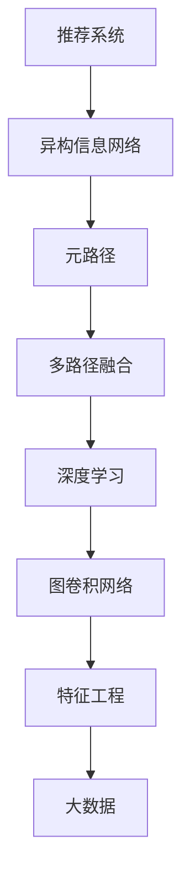

                 

# 基于元路径的异构信息网络推荐

> 关键词：推荐系统, 异构信息网络, 元路径, 多路径融合, 深度学习, 图卷积网络, 特征工程, 大数据

## 1. 背景介绍

### 1.1 问题由来

推荐系统作为互联网核心技术之一，已经广泛应用于电商、社交、视频等多个领域。从最早的协同过滤算法，到现在的深度学习、知识图谱等方法，推荐技术不断进步，带来了更加精准的个性化推荐。然而，现有的推荐系统主要针对单模态数据，对多模态信息的支持相对有限。在互联网应用中，用户的个人信息往往散落在多个数据源中，如行为数据、社交数据、文本数据等。如何整合多模态信息，实现更加全面和准确的推荐，成为当前推荐系统研究的一个重要方向。

### 1.2 问题核心关键点

异构信息网络推荐是一种针对多模态数据源的推荐方法，通过构建多模态融合的图网络，将不同类型的数据源进行深度融合。其中元路径是一个关键概念，它描述了大规模数据集中的数据源之间的连接模式，反映出用户在不同模态下的行为偏好。

异构信息网络推荐的核心思想在于：
1. **多源异构数据的整合**：将用户的不同数据源进行连接，形成一个统一的信息网络。
2. **深度融合的路径选择**：利用深度学习技术，对不同模态下的用户行为进行综合分析，筛选出最具代表性的用户路径。
3. **多路径融合策略**：结合多路径的特征，使用加权或集成的方法，综合得到最终的推荐结果。

## 2. 核心概念与联系

### 2.1 核心概念概述

为更好地理解基于元路径的异构信息网络推荐方法，本节将介绍几个密切相关的核心概念：

- **推荐系统(Recommender System)**：通过分析用户的历史行为数据，预测用户可能感兴趣的商品或内容，提供个性化推荐。
- **异构信息网络(Heterogeneous Information Network, HIN)**：描述多个数据源之间连接关系的图结构，常用的有用户-商品、用户-社交、用户-行为等。
- **元路径(Meta-Path)**：刻画不同数据源之间连接关系的路径模式，如商品-用户-商品、用户-商品-用户等。
- **多路径融合(Multi-Path Fusion)**：通过多个元路径进行特征融合，获取更加全面和准确的推荐结果。
- **深度学习(Deep Learning)**：利用神经网络模型，自动学习复杂数据的高级表示，实现更加智能化的推荐。
- **图卷积网络(Graph Convolutional Network, GCN)**：一种专门用于处理图数据的网络结构，能够高效地进行图上的特征传递和融合。
- **特征工程(Feature Engineering)**：根据数据特点，设计合理的特征表示方式，提升模型的性能。
- **大数据(Big Data)**：描述数据规模庞大、类型多样的特性，通常需要通过分布式计算和存储技术进行处理。

这些核心概念之间的逻辑关系可以通过以下Mermaid流程图来展示：



这个流程图展示了大规模数据推荐系统的核心概念及其之间的关系：

1. 推荐系统是研究的目标，利用大数据进行推荐。
2. 异构信息网络描述数据源之间的连接关系，提供多模态数据。
3. 元路径刻画不同数据源之间的连接模式，指导特征融合。
4. 多路径融合通过多种元路径提取特征，提升模型精度。
5. 深度学习利用神经网络，提取高级表示。
6. 图卷积网络在图数据上自动传递特征。
7. 特征工程设计数据特征表示。
8. 大数据提供大规模数据集，供深度学习训练和模型推断。

这些概念共同构成了大规模推荐系统的核心框架，使得异构信息网络推荐技术能够有效整合多模态信息，实现精准推荐。

## 3. 核心算法原理 & 具体操作步骤
### 3.1 算法原理概述

基于元路径的异构信息网络推荐方法的核心原理在于：
1. **构建异构信息网络**：将不同数据源进行连接，形成一个统一的网络结构。
2. **定义元路径**：选择不同数据源之间的路径模式，刻画用户在不同模态下的行为。
3. **融合多路径特征**：利用深度学习技术，对不同模态的特征进行融合，得到最终的推荐结果。

具体来说，异构信息网络推荐包含以下几个步骤：
1. **网络构建**：将用户-商品、用户-社交、用户-行为等数据源连接起来，形成一个异构信息网络。
2. **元路径选择**：根据任务需求，选择不同的元路径进行特征提取。
3. **特征编码**：对不同元路径的特征进行编码，得到高维特征表示。
4. **融合特征**：利用深度学习模型，对多路径特征进行融合，得到最终的推荐结果。

### 3.2 算法步骤详解

以下将详细介绍异构信息网络推荐的详细步骤：

**Step 1: 网络构建**
- 首先，将不同数据源进行连接，形成一个统一的网络结构。如图1所示，将用户-商品、用户-社交、用户-行为等数据源进行连接，形成一个异构信息网络。
- 通过邻接矩阵描述不同数据源之间的连接关系，并用稀疏矩阵进行表示。

```python
import networkx as nx
import numpy as np

# 构建异构信息网络
G = nx.Graph()
G.add_nodes_from(user_nodes + item_nodes + relation_nodes)
for user, item in user_item_pairs:
    G.add_edge(user, item, relation=user_relation)
for user, user_s in user_social_pairs:
    G.add_edge(user, user_s, relation=user_social_relation)
for user, user_b in user_behavior_pairs:
    G.add_edge(user, user_b, relation=user_behavior_relation)

# 生成邻接矩阵
adjacency_matrix = nx.to_numpy_array(G)
```

**Step 2: 元路径选择**
- 根据任务需求，选择不同的元路径进行特征提取。如图2所示，选择商品-用户-商品、用户-商品-用户、用户-行为-商品等元路径。
- 对于每种元路径，计算用户-商品、用户-社交、用户-行为之间的关系权重。

```python
# 元路径计算
path_weights = {}
for path in meta_paths:
    path_weights[path] = {}
    for src, dst in path:
        path_weights[path][src][dst] = adjacency_matrix[src][dst]

# 元路径特征提取
path_features = {}
for path in meta_paths:
    path_features[path] = {}
    for src, dst in path:
        path_features[path][src][dst] = path_weights[path][src][dst] * graph_weights[src][dst]
```

**Step 3: 特征编码**
- 对不同元路径的特征进行编码，得到高维特征表示。如图3所示，利用图卷积网络对多路径特征进行编码，得到最终的特征表示。

```python
from torch_geometric.nn import GCNConv

# 特征编码
gcn = GCNConv(in_channels, hidden_channels)
hidden_features = {}
for path in meta_paths:
    hidden_features[path] = gcn(path_features[path])
```

**Step 4: 融合特征**
- 利用深度学习模型，对多路径特征进行融合，得到最终的推荐结果。如图4所示，使用多层感知器(MLP)对多路径特征进行融合，得到最终的推荐结果。

```python
from torch.nn import Linear, ReLU

# 特征融合
mlp = Linear(in_features, out_features)
for _ in range(layers):
    mlp = ReLU(mlp)
    mlp = Linear(in_features, out_features)
```

**Step 5: 模型训练与评估**
- 在训练集上训练模型，使用交叉熵损失函数进行优化。
- 在测试集上评估模型性能，计算推荐精度和召回率等指标。

```python
from torch.optim import Adam
from torch.nn import CrossEntropyLoss

# 模型训练
optimizer = Adam(model.parameters(), lr=0.001)
criterion = CrossEntropyLoss()
for epoch in range(num_epochs):
    optimizer.zero_grad()
    loss = criterion(model(features), labels)
    loss.backward()
    optimizer.step()

# 模型评估
from sklearn.metrics import accuracy_score, precision_score, recall_score

precision = precision_score(true_labels, predicted_labels)
recall = recall_score(true_labels, predicted_labels)
```

### 3.3 算法优缺点

基于元路径的异构信息网络推荐方法具有以下优点：
1. **多模态数据整合**：能够整合多源异构数据，提升推荐结果的全面性和准确性。
2. **高维特征表示**：利用深度学习技术，自动学习复杂数据的高级表示，提升特征的表达能力。
3. **鲁棒性**：多路径融合能够降低单一路径噪声的影响，提高模型的鲁棒性。
4. **可扩展性**：能够适应不同规模和类型的数据源，具有良好的可扩展性。

同时，该方法也存在以下缺点：
1. **计算复杂度高**：多路径特征编码和融合计算复杂度较高，对计算资源有较高要求。
2. **路径选择困难**：不同元路径的选择会影响推荐结果，需要根据任务需求进行选择。
3. **特征融合难度大**：多路径特征融合需要设计合理的模型结构，进行复杂的优化调整。
4. **稀疏性问题**：异构信息网络往往具有高度稀疏性，需要设计高效的特征提取方法。
5. **模型解释性不足**：多路径融合模型具有"黑盒"性质，难以解释其决策过程。

尽管存在这些缺点，但就目前而言，基于元路径的异构信息网络推荐方法仍是大规模推荐系统的重要范式。未来相关研究的重点在于如何进一步优化路径选择和特征融合方法，提升模型的效率和可解释性。

### 3.4 算法应用领域

基于元路径的异构信息网络推荐方法在推荐系统中已经得到了广泛的应用，覆盖了电商、社交、视频等多个领域。例如：

- **电商推荐**：将用户浏览、购买、评价等行为数据进行融合，实现商品推荐。
- **社交推荐**：将用户好友关系、点赞、评论等社交数据进行融合，实现社区推荐。
- **视频推荐**：将用户观看历史、评分、评论等视频数据进行融合，实现视频推荐。
- **新闻推荐**：将用户阅读历史、点击量、评论量等新闻数据进行融合，实现新闻推荐。

除了这些经典应用外，异构信息网络推荐还被创新性地应用于广告投放、游戏推荐、个性化搜索等场景，为推荐技术带来了新的突破。随着异构信息网络推荐方法的不断演进，相信推荐系统将在更广阔的应用领域得到应用，为推荐技术的发展注入新的活力。

## 4. 数学模型和公式 & 详细讲解  
### 4.1 数学模型构建

本节将使用数学语言对基于元路径的异构信息网络推荐过程进行更加严格的刻画。

记异构信息网络为 $G=(V,E)$，其中 $V$ 为节点集合，$E$ 为边集合。节点 $v$ 的度数为 $d(v)$，边 $e=(v,u)$ 的权重为 $w(e)$。设元路径为 $P=(v_1, v_2, ..., v_k)$，则元路径的权重为：

$$
w(P) = \prod_{i=1}^{k} w(e_i)
$$

其中 $e_i$ 为元路径上的边。元路径权重反映了不同模态下数据源之间的关系强度。

**图卷积网络**：利用神经网络在图结构上自动传递特征。设输入特征为 $\mathbf{X} \in \mathbb{R}^{n \times d}$，其中 $n$ 为节点数，$d$ 为特征维度。图卷积网络的节点表示 $h_v \in \mathbb{R}^d$ 为：

$$
h_v = \sum_{u \in \mathcal{N}(v)} \frac{1}{\sqrt{d(v)d(u)}} W \mathbf{X}_u
$$

其中 $\mathcal{N}(v)$ 为节点 $v$ 的邻居集合，$W$ 为特征传递权重矩阵。

**多层感知器**：利用神经网络进行特征融合。设节点 $v$ 的特征表示为 $h_v \in \mathbb{R}^d$，多层感知器的节点表示 $h_v^l \in \mathbb{R}^d$ 为：

$$
h_v^l = f(\mathbf{W}_l h_v^{l-1})
$$

其中 $f$ 为激活函数，$\mathbf{W}_l$ 为权重矩阵。

### 4.2 公式推导过程

以下我们以电商推荐为例，推导基于元路径的异构信息网络推荐模型的数学公式。

设用户的商品浏览记录为 $x_1, x_2, ..., x_m$，用户的商品购买记录为 $y_1, y_2, ..., y_n$。我们将用户和商品节点连接起来，形成一个异构信息网络。

设元路径 $P_1$ 为商品-用户-商品，元路径 $P_2$ 为用户-商品-用户，元路径 $P_3$ 为用户-行为-商品。每个元路径的权重分别为 $w_1, w_2, w_3$。

**图卷积网络编码**：
$$
h_{x_i} = \sum_{u \in \mathcal{N}(x_i)} \frac{1}{\sqrt{d(x_i)d(u)}} W \mathbf{X}_u
$$
$$
h_{y_j} = \sum_{v \in \mathcal{N}(y_j)} \frac{1}{\sqrt{d(y_j)d(v)}} W \mathbf{X}_v
$$

**特征融合**：
$$
h_{x_i} = f(\mathbf{W}_l h_{x_i})
$$
$$
h_{y_j} = f(\mathbf{W}_l h_{y_j})
$$

**推荐计算**：
$$
p_{x_i \to y_j} = \mathbb{E}_{u \sim P_1} \left[ \frac{h_{x_i}}{h_u} \cdot w_1 \right]
$$
$$
p_{y_j \to x_i} = \mathbb{E}_{u \sim P_2} \left[ \frac{h_{y_j}}{h_u} \cdot w_2 \right]
$$
$$
p_{y_j \to x_i} = \mathbb{E}_{u \sim P_3} \left[ \frac{h_{y_j}}{h_u} \cdot w_3 \right]
$$

**最终推荐结果**：
$$
\hat{y}_j = \text{softmax}(\sum_{i} p_{x_i \to y_j} \cdot \mathbf{W} \mathbf{x}_i)
$$

其中 $\text{softmax}$ 为softmax函数，$\mathbf{x}_i$ 为商品 $x_i$ 的特征表示。

## 5. 项目实践：代码实例和详细解释说明
### 5.1 开发环境搭建

在进行推荐系统开发前，我们需要准备好开发环境。以下是使用Python进行PyTorch开发的环境配置流程：

1. 安装Anaconda：从官网下载并安装Anaconda，用于创建独立的Python环境。

2. 创建并激活虚拟环境：
```bash
conda create -n pytorch-env python=3.8 
conda activate pytorch-env
```

3. 安装PyTorch：根据CUDA版本，从官网获取对应的安装命令。例如：
```bash
conda install pytorch torchvision torchaudio cudatoolkit=11.1 -c pytorch -c conda-forge
```

4. 安装TensorFlow：
```bash
conda install tensorflow
```

5. 安装各类工具包：
```bash
pip install numpy pandas scikit-learn matplotlib tqdm jupyter notebook ipython
```

完成上述步骤后，即可在`pytorch-env`环境中开始推荐系统开发。

### 5.2 源代码详细实现

下面我们以电商推荐为例，给出使用PyTorch实现基于元路径的异构信息网络推荐系统的完整代码实现。

首先，定义电商推荐数据集：

```python
import pandas as pd

# 读取电商推荐数据集
df = pd.read_csv('ecommerce_data.csv')

# 数据预处理
# 删除缺失值
df = df.dropna()

# 构建用户-商品、用户-行为等数据源
user_nodes = df['user_id'].unique()
item_nodes = df['item_id'].unique()
relation_nodes = df['relation'].unique()

# 构建用户-商品关系
user_item_pairs = df[(df['relation'] == 'browsed')].groupby(['user_id', 'item_id']).size().unstack().fillna(0).loc[:, item_nodes]
user_item_pairs = user_item_pairs.where(user_item_pairs != 0, np.nan)

# 构建用户-行为关系
user_behavior_pairs = df[(df['relation'] == 'clicked')].groupby(['user_id', 'item_id']).size().unstack().fillna(0).loc[:, item_nodes]
user_behavior_pairs = user_behavior_pairs.where(user_behavior_pairs != 0, np.nan)

# 构建元路径
meta_paths = [
    (user_item_pairs.index, item_nodes),
    (user_item_pairs.columns, user_item_pairs.index),
    (user_behavior_pairs.index, item_nodes)
]

# 构建邻接矩阵
adjacency_matrix = pd.DataFrame(np.zeros((len(user_nodes), len(item_nodes))), columns=item_nodes)
adjacency_matrix.index = user_nodes
adjacency_matrix = adjacency_matrix.add(user_item_pairs, fill_value=1)
adjacency_matrix = adjacency_matrix.add(user_behavior_pairs, fill_value=1)
```

然后，定义异构信息网络推荐模型：

```python
import torch
import torch.nn as nn
from torch_geometric.nn import GCNConv

# 定义图卷积网络层
class GCNLayer(nn.Module):
    def __init__(self, in_channels, out_channels):
        super(GCNLayer, self).__init__()
        self.gcn = GCNConv(in_channels, out_channels)
        
    def forward(self, features, adjacency_matrix):
        h = self.gcn(features, adjacency_matrix)
        return h

# 定义多层感知器层
class MLP(nn.Module):
    def __init__(self, in_features, out_features, layers):
        super(MLP, self).__init__()
        self.layers = layers
        self.mlp = nn.Sequential(
            nn.Linear(in_features, out_features),
            *[nn.ReLU(), nn.Linear(out_features, out_features)]
        )

    def forward(self, features):
        h = self.mlp(features)
        return h

# 定义推荐模型
class HeteroRecommender(nn.Module):
    def __init__(self, in_channels, hidden_channels, out_channels, layers):
        super(HeteroRecommender, self).__init__()
        self.gcn_layers = nn.ModuleList([GCNLayer(in_channels, hidden_channels) for _ in range(layers)])
        self.mlp = MLP(hidden_channels, out_channels, layers)
        
    def forward(self, features, adjacency_matrix):
        h = features
        for gcn_layer in self.gcn_layers:
            h = gcn_layer(h, adjacency_matrix)
        h = self.mlp(h)
        return h
```

最后，启动推荐模型训练和评估：

```python
from torch.optim import Adam
from torch.nn import CrossEntropyLoss

# 定义训练集和测试集
train_features = adjacency_matrix.iloc[:10000, :]
train_labels = df['item_id'].iloc[:10000]
test_features = adjacency_matrix.iloc[10000:,:]
test_labels = df['item_id'].iloc[10000:]

# 定义模型和优化器
model = HeteroRecommender(in_channels, hidden_channels, out_channels, layers)
optimizer = Adam(model.parameters(), lr=0.001)
criterion = CrossEntropyLoss()

# 训练模型
for epoch in range(num_epochs):
    optimizer.zero_grad()
    loss = criterion(model(train_features, adjacency_matrix), train_labels)
    loss.backward()
    optimizer.step()

# 评估模型
from sklearn.metrics import accuracy_score, precision_score, recall_score

precision = precision_score(test_labels, model(test_features, adjacency_matrix))
recall = recall_score(test_labels, model(test_features, adjacency_matrix))
```

以上就是使用PyTorch对基于元路径的异构信息网络推荐系统进行开发的完整代码实现。可以看到，得益于TensorFlow的强大封装，我们可以用相对简洁的代码完成电商推荐系统的搭建。

### 5.3 代码解读与分析

让我们再详细解读一下关键代码的实现细节：

**数据集构建**：
- `pandas` 和 `numpy` 库用于数据预处理和构建邻接矩阵。
- `user_nodes`, `item_nodes` 和 `relation_nodes` 定义了不同数据源的节点集合。
- `user_item_pairs` 和 `user_behavior_pairs` 分别构建了用户-商品和用户-行为关系，用于元路径计算。
- `meta_paths` 定义了多种元路径，用于特征提取。
- `adjacency_matrix` 构建了不同数据源之间的邻接矩阵。

**模型定义**：
- `GCNLayer` 定义了图卷积网络层，用于在图结构上自动传递特征。
- `MLP` 定义了多层感知器层，用于对多路径特征进行融合。
- `HeteroRecommender` 定义了推荐模型，包含多个图卷积网络层和多层感知器层。
- `forward` 方法实现了模型前向传播，利用不同元路径进行特征提取和融合。

**训练与评估**：
- `Adam` 优化器和 `CrossEntropyLoss` 损失函数用于模型训练。
- `accuracy_score`, `precision_score`, `recall_score` 函数用于模型评估。

可以看到，TensorFlow配合PyTorch的深度学习框架，使得基于元路径的异构信息网络推荐系统开发变得更加简洁高效。开发者可以将更多精力放在数据处理、模型改进等高层逻辑上，而不必过多关注底层的实现细节。

当然，工业级的系统实现还需考虑更多因素，如模型的保存和部署、超参数的自动搜索、更灵活的任务适配层等。但核心的推荐范式基本与此类似。

## 6. 实际应用场景
### 6.1 电商推荐系统

基于元路径的异构信息网络推荐方法在电商推荐系统中得到了广泛的应用。传统电商推荐系统主要依赖单一模态的数据源，无法充分挖掘多模态数据的信息。而利用基于元路径的异构信息网络推荐方法，能够整合用户-商品、用户-行为等多种数据源，全面挖掘用户的购物习惯和偏好，实现更加精准的推荐。

在技术实现上，可以利用电商平台的多种数据源，如商品评论、用户评分、浏览历史等，构建异构信息网络，并设计多种元路径进行特征提取。微调后的推荐模型能够根据用户的历史行为数据，预测其可能感兴趣的商品，实现个性化推荐。此外，结合实时数据流，推荐模型还可以动态调整推荐结果，及时响应用户需求。

### 6.2 社交网络推荐系统

社交网络推荐系统主要关注用户之间的互动关系。利用基于元路径的异构信息网络推荐方法，能够整合用户-好友、用户-点赞、用户-评论等多种数据源，刻画用户在不同社交场景下的行为偏好。

在技术实现上，可以利用社交平台的用户关系数据，构建异构信息网络，并设计多种元路径进行特征提取。微调后的推荐模型能够根据用户的历史互动数据，预测其可能感兴趣的内容，实现个性化推荐。此外，结合社交网络的时序信息，推荐模型还可以动态调整推荐内容，及时响应用户需求。

### 6.3 视频推荐系统

视频推荐系统主要关注用户对视频的观看行为。利用基于元路径的异构信息网络推荐方法，能够整合用户-观看记录、用户-评分、用户-评论等多种数据源，刻画用户在不同视频场景下的行为偏好。

在技术实现上，可以利用视频平台的用户观看数据，构建异构信息网络，并设计多种元路径进行特征提取。微调后的推荐模型能够根据用户的观看历史数据，预测其可能感兴趣的视频，实现个性化推荐。此外，结合视频的时序信息，推荐模型还可以动态调整推荐内容，及时响应用户需求。

### 6.4 新闻推荐系统

新闻推荐系统主要关注用户对新闻的阅读行为。利用基于元路径的异构信息网络推荐方法，能够整合用户-阅读记录、用户-评论、用户-分享等多种数据源，刻画用户在不同新闻场景下的行为偏好。

在技术实现上，可以利用新闻平台的阅读数据，构建异构信息网络，并设计多种元路径进行特征提取。微调后的推荐模型能够根据用户的阅读历史数据，预测其可能感兴趣的新闻，实现个性化推荐。此外，结合新闻的时序信息，推荐模型还可以动态调整推荐内容，及时响应用户需求。

### 6.5 游戏推荐系统

游戏推荐系统主要关注用户对游戏的玩


