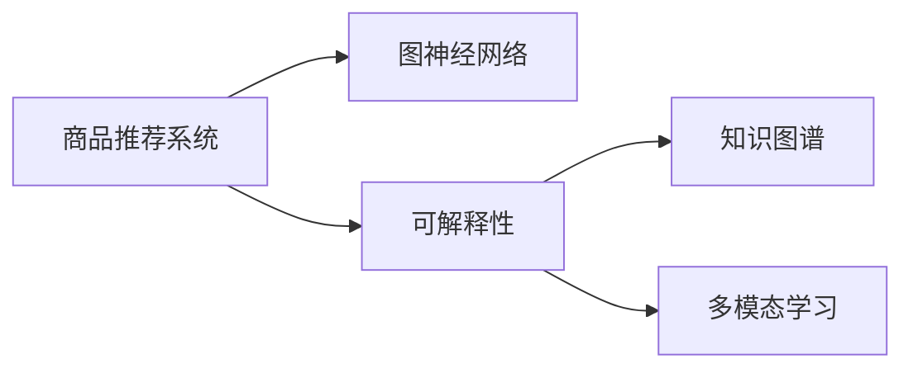

                 

# 基于图神经网络的商品推荐可解释性研究

## 1. 背景介绍

在电子商务中，商品推荐系统已成为提升用户体验和销售转化率的关键。然而，传统的推荐算法缺乏可解释性，使得用户难以理解推荐结果背后的逻辑。随着数据隐私和用户权益意识的增强，如何增强推荐系统的透明性和可解释性，成为越来越多企业和用户关注的焦点。近年来，基于图神经网络(Graph Neural Networks, GNNs)的推荐算法逐渐兴起，利用图结构建模用户行为和商品属性之间的关系，为商品推荐提供了新的方法。本文将详细探讨基于图神经网络的推荐系统可解释性研究，介绍其核心概念和算法原理，并通过案例分析展示其在推荐系统中的应用效果。

## 2. 核心概念与联系

### 2.1 核心概念概述

- **商品推荐系统**：利用用户历史行为数据，为用户推荐可能感兴趣的商品的系统。
- **图神经网络**：一种新型的深度学习算法，能够处理图结构数据，应用于推荐系统能够有效建模用户和商品之间的复杂关系。
- **可解释性**：指推荐系统能够提供清晰的解释，使用户理解推荐结果的来源和依据。
- **知识图谱**：一种结构化的知识表示方式，用于描述实体之间的关系，常用于推荐系统的特征工程。
- **多模态学习**：结合文本、图像、视频等多模态信息，提升推荐系统的性能和可解释性。

这些核心概念构成了基于图神经网络的推荐系统研究框架，为探索和设计新的推荐算法提供了指导。

### 2.2 核心概念联系

通过以下Mermaid流程图，展示这些核心概念之间的联系：



该流程图展示了商品推荐系统如何通过图神经网络建模用户和商品之间的复杂关系，同时结合可解释性、知识图谱和多模态学习等技术，提升推荐系统的性能和透明度。

## 3. 核心算法原理 & 具体操作步骤
### 3.1 算法原理概述

基于图神经网络的推荐系统通过将用户和商品构建成图结构，利用图神经网络对图中节点进行表示学习，捕捉用户与商品之间的复杂关系。其基本流程如下：

1. **构建图结构**：将用户和商品看作图中的节点，根据用户行为、商品属性等构建边，得到用户-商品图。
2. **图神经网络表示学习**：使用图神经网络对图中节点进行表示学习，得到每个节点的隐向量表示。
3. **商品推荐**：基于节点的隐向量表示，计算用户和商品之间的相似度，进行推荐。
4. **可解释性**：通过图神经网络的中间层表示，解释推荐结果的来源。

### 3.2 算法步骤详解

以下是基于图神经网络的商品推荐系统的详细步骤：

**Step 1: 构建图结构**
- 定义用户集合 $U=\{u_1, u_2, ..., u_M\}$ 和商品集合 $I=\{i_1, i_2, ..., i_N\}$，其中 $M$ 和 $N$ 分别为用户和商品的数量。
- 根据用户的历史行为，建立用户-商品图 $G=(U, I, E)$，其中 $E$ 为边集合，表示用户对商品的兴趣。
- 使用二部图表示用户-商品关系，其中 $u$ 节点与 $i$ 节点通过边相连，表示用户对商品的兴趣。

**Step 2: 图神经网络表示学习**
- 将用户和商品表示为图中的节点，使用图神经网络对节点进行表示学习。常用的图神经网络模型包括图卷积网络(Graph Convolutional Network, GCN)、图注意力网络(Graph Attention Network, GAT)等。
- 在图神经网络的每一层，通过聚合邻居节点的信息，更新节点表示。最终得到每个节点的隐向量表示。

**Step 3: 商品推荐**
- 基于用户和商品的隐向量表示，计算它们之间的相似度，得到推荐结果。常见的相似度计算方法包括余弦相似度、欧式距离等。
- 在推荐结果中加入后验筛选，如基于点击率、转化率等指标进行排名。

**Step 4: 可解释性**
- 利用图神经网络的中间层表示，解释推荐结果的来源。通常包括节点特征、边特征、聚合操作等。
- 提供详细的推荐理由，如用户对商品的兴趣程度、商品的属性信息等，提升推荐系统的透明度和信任度。

### 3.3 算法优缺点

基于图神经网络的推荐系统具有以下优点：
- 能够有效建模用户和商品之间的复杂关系，捕捉隐含的交互信息。
- 可以利用图结构进行多模态信息的融合，提升推荐性能。
- 具有较好的可解释性，用户能够理解推荐结果的依据。

同时，该方法也存在以下局限性：
- 对图结构的构建要求较高，需要合理的图边定义和图拓扑设计。
- 数据稀疏性问题较严重，图神经网络对噪声和异常值较为敏感。
- 计算复杂度高，图神经网络需要较多的计算资源。

### 3.4 算法应用领域

基于图神经网络的推荐系统已经在多个领域得到广泛应用，例如：

- **电子商务**：为电商平台提供个性化推荐服务，提升用户体验和转化率。
- **社交网络**：为用户推荐感兴趣的内容和好友，增强用户粘性。
- **在线教育**：为用户推荐个性化学习内容，提高学习效果。
- **智能家居**：为用户推荐符合其需求的商品和服务，提升生活质量。

这些应用领域展示了基于图神经网络的推荐系统在实际场景中的广泛适用性。

## 4. 数学模型和公式 & 详细讲解 & 举例说明

### 4.1 数学模型构建

假设用户-商品图 $G=(U, I, E)$，节点表示为 $\mathbf{X} \in \mathbb{R}^{M \times D}$，商品表示为 $\mathbf{H} \in \mathbb{R}^{N \times D}$，边表示为 $\mathbf{A} \in \mathbb{R}^{M \times N}$。图神经网络的目标是学习每个节点的隐向量表示 $\mathbf{Z} \in \mathbb{R}^{M \times d_z}$ 和 $\mathbf{W} \in \mathbb{R}^{N \times d_z}$。

**GCN模型**：使用图卷积网络进行节点表示学习。GCN的计算公式为：

$$
\mathbf{Z}^{(l)} = \max\{\mathbf{X}, \alpha \mathbf{A} \mathbf{Z}^{(l-1)}\}
$$

其中，$\alpha$ 为图卷积系数，$l$ 为层数。

**GAT模型**：使用图注意力网络进行节点表示学习。GAT的计算公式为：

$$
\mathbf{Z}^{(l)} = \alpha \sum_{j \in \mathcal{N}(i)} \frac{\exp(\mathbf{a}_i^T \mathbf{a}_j)}{\sum_{k \in \mathcal{N}(i)} \exp(\mathbf{a}_i^T \mathbf{a}_k)} \mathbf{a}_i \mathbf{Z}^{(l-1)}
$$

其中，$\alpha$ 为注意力系数，$\mathbf{a}_i$ 为注意力向量。

### 4.2 公式推导过程

以GCN模型为例，推导其计算公式：

1. **前向传播**：首先，定义节点初始表示为 $\mathbf{Z}^{(0)}=\mathbf{X}$。
2. **层间计算**：在每一层，通过图卷积计算节点表示，公式如下：

$$
\mathbf{Z}^{(l)} = \max\{\mathbf{X}, \alpha \mathbf{A} \mathbf{Z}^{(l-1)}\}
$$

其中，$\max$ 表示节点特征的聚合方式。
3. **后向传播**：计算损失函数，通常为均方误差损失，优化模型参数。

**GAT模型的推导过程类似**，主要区别在于使用了注意力机制，计算节点特征的加权和。

### 4.3 案例分析与讲解

**案例1: 电商商品推荐**

假设某电商平台有 $M$ 个用户和 $N$ 个商品，用户对商品的兴趣记录构成了一个用户-商品图。使用GCN模型进行节点表示学习，得到每个用户和商品的隐向量表示。然后，基于余弦相似度计算用户和商品之间的相似度，进行推荐。最后，使用可解释性模型解释推荐结果，如提供商品的相似商品列表、商品属性等信息。

**案例2: 社交网络内容推荐**

某社交网络平台有 $M$ 个用户和 $N$ 个内容，用户对内容的点赞、评论等行为构成了一个用户-内容图。使用GAT模型进行节点表示学习，得到每个用户和内容的隐向量表示。然后，基于欧氏距离计算用户和内容之间的相似度，进行推荐。最后，使用可解释性模型解释推荐理由，如推荐内容的推荐依据、用户对内容的态度等。

## 5. 项目实践：代码实例和详细解释说明
### 5.1 开发环境搭建

在使用PyTorch进行图神经网络推荐系统开发时，需要准备以下开发环境：

1. 安装Anaconda：从官网下载并安装Anaconda，用于创建独立的Python环境。

2. 创建并激活虚拟环境：
```bash
conda create -n graph-nn-env python=3.8 
conda activate graph-nn-env
```

3. 安装PyTorch：根据CUDA版本，从官网获取对应的安装命令。例如：
```bash
conda install pytorch torchvision torchaudio cudatoolkit=11.1 -c pytorch -c conda-forge
```

4. 安装NetworkX、igraph等图处理库：
```bash
pip install networkx igraph
```

5. 安装PyTorch Geometric库：用于图神经网络的实现和数据处理。

6. 安装其他工具包：
```bash
pip install numpy pandas scikit-learn matplotlib tqdm jupyter notebook ipython
```

完成上述步骤后，即可在`graph-nn-env`环境中开始图神经网络推荐系统的开发。

### 5.2 源代码详细实现

下面是使用PyTorch Geometric库实现基于GCN模型的商品推荐系统的Python代码：

```python
import torch
import torch.nn as nn
import torch_geometric.data as dg
import torch_geometric.nn as gnn
from torch_geometric.datasets import Planetoid

class GCN(nn.Module):
    def __init__(self, input_dim, hidden_dim, output_dim):
        super(GCN, self).__init__()
        self.gcn1 = gnn.GraphConv(input_dim, hidden_dim)
        self.gcn2 = gnn.GraphConv(hidden_dim, output_dim)
        
    def forward(self, x, adj):
        x = self.gcn1(x, adj)
        x = torch.nn.functional.relu(x)
        x = self.gcn2(x, adj)
        return x

class GraphRecommender(nn.Module):
    def __init__(self, input_dim, hidden_dim, output_dim):
        super(GraphRecommender, self).__init__()
        self.gcn = GCN(input_dim, hidden_dim, output_dim)
        
    def forward(self, x, adj):
        x = self.gcn(x, adj)
        return x
    
# 加载数据集
dataset = Planetoid('Cora', 'x', 'y')
data = dataset[0]

# 图神经网络模型
input_dim = data.x.shape[1]
hidden_dim = 16
output_dim = 1

model = GraphRecommender(input_dim, hidden_dim, output_dim)

# 优化器
optimizer = torch.optim.Adam(model.parameters(), lr=0.01)

# 训练
for epoch in range(10):
    optimizer.zero_grad()
    output = model(data.x, data.edge_index)
    loss = nn.BCEWithLogitsLoss()(output, data.y)
    loss.backward()
    optimizer.step()
    print(f'Epoch {epoch+1}, Loss: {loss.item()}')
```

### 5.3 代码解读与分析

**GCN模块**：定义了GCN模型的网络结构，包括图卷积层。GCN模块继承自nn.Module，定义了前向传播函数forward。

**GraphRecommender模块**：将GCN模型应用到商品推荐系统中，实现了图神经网络的推荐过程。

**数据集加载**：使用PyTorch Geometric提供的Planetoid数据集加载器，加载Cora数据集，并提取节点特征x和边索引adj。

**模型训练**：定义优化器，循环迭代训练模型，每次前向传播计算输出，反向传播更新模型参数。

**运行结果展示**：在训练过程中，记录每个epoch的损失，并打印输出。

## 6. 实际应用场景
### 6.1 智能推荐系统

基于图神经网络的推荐系统已经在电商、社交网络等场景中得到广泛应用。例如，某电商平台使用基于图神经网络的推荐系统，根据用户的历史行为和兴趣图，为用户推荐符合其需求的商品，显著提升了用户的购物体验和转化率。

### 6.2 内容推荐系统

某社交媒体平台使用基于图神经网络的内容推荐系统，根据用户对内容的点赞、评论等行为，为用户推荐感兴趣的内容，提升了用户粘性和平台活跃度。

### 6.3 金融投资

某金融公司使用基于图神经网络的推荐系统，根据用户的历史交易行为和资产图，为用户推荐投资组合，提高了投资决策的准确性和效率。

## 7. 工具和资源推荐
### 7.1 学习资源推荐

为了帮助开发者系统掌握基于图神经网络的推荐系统，这里推荐一些优质的学习资源：

1. **Graph Neural Networks: A Review of Methods and Applications**：由Graph Neural Network领域权威学者撰写，全面介绍了图神经网络的研究进展和应用场景，适合入门和深入学习。

2. **PyTorch Geometric**：PyTorch Geometric库的官方文档，提供了详细的图神经网络实现和数据处理功能，是学习图神经网络的重要资料。

3. **Graph Mining and Statistical Learning**：一本系统介绍图数据挖掘和统计学习的书籍，涵盖了图结构建模、图神经网络等前沿内容，适合进阶学习。

4. **Stanford CS229**：斯坦福大学提供的机器学习课程，其中包含图神经网络的讲授和作业，是掌握图神经网络基础知识的重要途径。

5. **Kaggle竞赛**：参加Kaggle上的图神经网络竞赛，实际数据集练习，提升实战经验。

### 7.2 开发工具推荐

高效的开发离不开优秀的工具支持。以下是几款用于图神经网络推荐系统开发的常用工具：

1. **PyTorch Geometric**：用于图神经网络的实现和数据处理，提供了丰富的图数据集和模型组件，是进行图神经网络开发的首选工具。

2. **TensorBoard**：用于可视化图神经网络的训练过程，记录训练损失、参数更新等关键指标，帮助调试和优化模型。

3. **Weights & Biases**：用于实验跟踪和模型比较，记录训练日志、模型评估结果等，方便对比和调优。

4. **Jupyter Notebook**：轻量级编程环境，方便进行模型调试和实时展示结果。

5. **GraphStudio**：可视化图数据处理和图神经网络模型的构建过程，适合进行图神经网络设计实验。

### 7.3 相关论文推荐

图神经网络推荐系统研究涉及多个前沿方向，以下是几篇奠基性的相关论文，推荐阅读：

1. **Graph Convolutional Network**：提出GCN模型，通过图卷积操作进行节点表示学习，解决了图神经网络的可解释性问题。

2. **Graph Attention Networks**：提出GAT模型，使用注意力机制进行节点表示学习，提高了模型的泛化能力和可解释性。

3. **Scalable Graph Neural Network**：提出基于SAGE模型的图神经网络，通过图采样等技术提升了计算效率，适用于大规模图数据处理。

4. **Interpretable and Scalable Graph Neural Networks**：提出图注意力池化模型，在提高模型可解释性的同时，提升了模型的计算效率。

5. **Graph Neural Network for Recommendation Systems**：综述了基于图神经网络的推荐系统研究，总结了图神经网络在推荐系统中的应用效果。

这些论文代表了图神经网络推荐系统的发展脉络，通过学习这些前沿成果，可以帮助研究者把握学科前进方向，激发更多的创新灵感。

## 8. 总结：未来发展趋势与挑战
### 8.1 研究成果总结

基于图神经网络的推荐系统已经展示了其在多个领域的应用效果，提升了用户体验和业务价值。然而，该方法在可解释性、数据稀疏性、计算效率等方面仍存在挑战，需要进一步优化和改进。

### 8.2 未来发展趋势

展望未来，基于图神经网络的推荐系统将呈现以下几个发展趋势：

1. **可解释性增强**：通过引入注意力机制和图神经网络中间层表示，提升推荐系统的可解释性，使用户能够理解推荐结果的依据。
2. **数据处理技术改进**：使用图采样、图嵌入等技术处理大规模图数据，解决数据稀疏性问题。
3. **多模态融合**：结合文本、图像、视频等多模态信息，提升推荐系统的性能和可解释性。
4. **跨领域应用扩展**：将图神经网络推荐系统应用于更多领域，如医疗、金融等，提升各领域的智能化水平。
5. **实时性提升**：通过优化计算图和算法，提升推荐系统的实时性，满足用户即时需求。

### 8.3 面临的挑战

尽管基于图神经网络的推荐系统已经取得了显著进展，但在迈向更加智能化、普适化应用的过程中，仍面临以下挑战：

1. **数据稀疏性问题**：图神经网络对噪声和异常值较为敏感，大规模图数据处理面临稀疏性问题。
2. **计算资源需求高**：图神经网络的计算复杂度高，需要较多的计算资源。
3. **可解释性不足**：模型缺乏详细的可解释性，用户难以理解推荐结果的依据。
4. **模型泛化能力**：图神经网络在不同数据分布和场景下，泛化能力有待提高。

### 8.4 研究展望

面向未来，需要在以下方面进一步研究和发展基于图神经网络的推荐系统：

1. **数据稀疏性处理**：开发更高效的数据处理技术，如图采样、图嵌入等，提升大规模图数据的处理能力。
2. **计算效率优化**：通过优化计算图和算法，提升推荐系统的实时性和计算效率。
3. **多模态融合**：结合文本、图像、视频等多模态信息，提升推荐系统的性能和可解释性。
4. **模型可解释性**：通过引入注意力机制和可解释性模型，提升推荐系统的透明度和信任度。
5. **跨领域应用扩展**：将图神经网络推荐系统应用于更多领域，如医疗、金融等，提升各领域的智能化水平。

总之，基于图神经网络的推荐系统需要在数据处理、计算效率、可解释性等方面进行全面优化，才能更好地服务于实际场景，提升用户体验和业务价值。

## 9. 附录：常见问题与解答

**Q1: 如何处理图数据的稀疏性问题？**

A: 图数据的稀疏性问题可以通过以下方法解决：
1. 图采样：从图中随机采样部分节点和边，生成局部视图。
2. 图嵌入：将稀疏的图数据转换为稠密表示，提升模型对稀疏数据的处理能力。
3. 图池化：对局部视图进行池化操作，减少模型参数量，提高计算效率。

**Q2: 如何提升图神经网络的计算效率？**

A: 提升图神经网络的计算效率可以采用以下方法：
1. 计算图优化：优化图神经网络的计算图，减少不必要的计算操作。
2. 分布式训练：使用分布式计算框架，如PyTorch、TensorFlow等，并行计算图神经网络。
3. 混合精度训练：使用混合精度计算技术，降低计算资源消耗。

**Q3: 如何在图神经网络中引入可解释性？**

A: 在图神经网络中引入可解释性可以通过以下方法：
1. 注意力机制：通过注意力机制，显示模型对图中节点和边的关注程度。
2. 可解释性模型：使用可解释性模型，如LIME、SHAP等，解释推荐结果的来源。
3. 图中间层表示：利用图神经网络中间层表示，解释推荐结果的依据。

**Q4: 如何处理图神经网络中的噪声和异常值？**

A: 处理图神经网络中的噪声和异常值可以采用以下方法：
1. 图剪枝：删除无用的节点和边，减少噪声数据对模型的影响。
2. 异常值检测：使用异常检测算法，如孤立森林等，检测并处理异常值。
3. 噪声注入：在训练过程中，使用噪声注入技术，提高模型的鲁棒性。

通过深入理解和解决这些问题，可以进一步提升基于图神经网络的推荐系统的性能和可解释性，使其在实际应用中发挥更大的价值。

