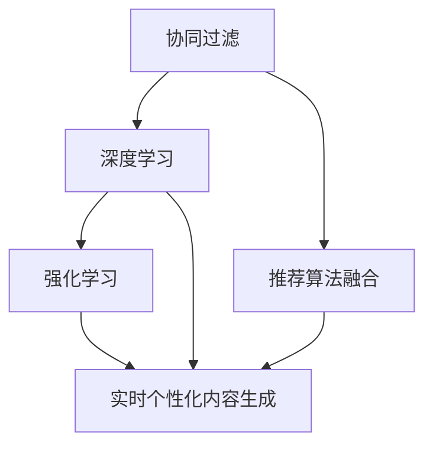

                 

# 基于大模型的推荐系统实时个性化内容生成

> 关键词：推荐系统,大模型,实时个性化,内容生成,深度学习,强化学习,协同过滤,深度学习架构

## 1. 背景介绍

### 1.1 问题由来

随着互联网技术的发展，推荐系统在各类在线服务中扮演着越来越重要的角色。个性化推荐不仅提升用户体验，还能带来更高的转化率和收益。传统的推荐系统主要依赖协同过滤、内容推荐等算法，但其对用户历史行为数据的依赖程度较高，难以发现用户的潜在兴趣。

近年来，深度学习技术的兴起为推荐系统带来了新的突破。通过深度神经网络模型，推荐系统能够从多维度数据中提取更丰富的用户特征和物品属性，发现用户深层次的兴趣偏好，大幅提升了推荐效果。然而，深度学习模型需要大量标注数据进行训练，导致模型扩展性差，难以支持实时推荐。

与此同时，大语言模型在自然语言处理领域取得了卓越成就，具备强大的文本生成和理解能力。结合大模型与推荐系统，可以实现实时个性化内容生成，在提升推荐质量的同时，降低对标注数据的依赖，促进推荐系统的大规模部署和应用。

### 1.2 问题核心关键点

本节将详细阐述大模型在推荐系统中的应用，以及实时个性化内容生成的关键技术点：

- **大模型**：指以Transformer为基础的大规模预训练语言模型，如BERT、GPT等。通过在海量文本语料上进行预训练，大模型具备强大的语言生成和理解能力，可以抽取多维特征，生成丰富自然语言表达。

- **推荐系统**：指根据用户历史行为数据，推荐系统算法为用户推荐感兴趣的物品，包括商品、新闻、视频等。常见的推荐算法有协同过滤、基于内容的推荐、深度学习推荐等。

- **实时个性化内容生成**：指在推荐系统中，通过大模型对用户输入的查询、上下文信息进行理解，自动生成个性化的推荐内容。与传统的深度学习推荐方法相比，实时个性化内容生成可以大幅降低模型训练成本，提升推荐系统扩展性和实时性。

## 2. 核心概念与联系

### 2.1 核心概念概述

为更好地理解实时个性化内容生成的方法，本节将介绍几个密切相关的核心概念：

- **协同过滤(Collaborative Filtering)**：一种经典的推荐算法，通过挖掘用户和物品的相似性，推荐用户可能感兴趣的新物品。包括基于用户的协同过滤和基于物品的协同过滤两种方式。

- **深度学习推荐**：基于深度神经网络的推荐算法，通过多维用户和物品特征进行学习和建模，可以提升推荐质量，但需要大量标注数据。

- **推荐算法融合**：通过多种推荐算法融合，提升推荐系统性能。常见的融合方法有集成学习、混合精度训练等。

- **强化学习(RL)**：一种通过奖励机制学习最优策略的机器学习技术，在推荐系统中可以实现自适应推荐，但需要大量标注数据和计算资源。

- **大模型**：指以Transformer为基础的大规模预训练语言模型，通过在海量文本语料上进行预训练，学习到丰富的语言知识和常识，可以提取多维特征，生成自然语言表达。

这些核心概念之间的逻辑关系可以通过以下Mermaid流程图来展示：



这个流程图展示了协同过滤、深度学习、强化学习等推荐算法的核心概念，以及它们如何与实时个性化内容生成方法联系起来。

## 3. 核心算法原理 & 具体操作步骤
### 3.1 算法原理概述

基于大模型的推荐系统实时个性化内容生成，本质上是一个结合了大模型和推荐系统的复合模型。其核心思想是：利用大模型的语言生成能力，自动生成与用户兴趣相关的推荐文本。这些文本可以是商品描述、新闻标题、视频摘要等，可以直观地展示物品的亮点，提升推荐效果。

具体而言，假设大模型的输入为用户的查询、上下文信息和物品的元数据，输出为推荐内容的自然语言描述。通过在推荐系统中引入大模型，可以在不增加标注数据的情况下，实现实时个性化的内容生成，降低推荐系统的训练成本，提升扩展性和实时性。

### 3.2 算法步骤详解

基于大模型的推荐系统实时个性化内容生成的一般步骤如下：

**Step 1: 准备大模型和推荐数据集**
- 选择合适的预训练语言模型（如BERT、GPT）作为输入文本的特征提取器。
- 收集推荐系统的数据集，包括用户行为数据和物品属性数据，划分为训练集、验证集和测试集。

**Step 2: 设计推荐模型架构**
- 设计一个包含大模型的推荐模型架构。例如，可以在深度神经网络中引入大模型的特征嵌入层，将用户和物品特征映射到高维空间。
- 设计推荐算法的输出层，如全连接层、注意力机制等，用于计算物品与用户特征的匹配度。
- 设计大模型的输出层，如语言模型层，用于生成推荐内容的自然语言描述。

**Step 3: 训练和优化模型**
- 使用训练集数据，在大模型的预训练权重上进行微调，学习用户和物品特征的映射。
- 使用推荐算法进行优化，最大化推荐效果。
- 引入正则化技术，防止过拟合。

**Step 4: 实时生成推荐内容**
- 接收用户的查询和上下文信息，将用户特征映射到高维空间。
- 根据用户特征和物品特征，计算推荐物品的匹配度。
- 使用大模型生成推荐内容的自然语言描述，结合物品元数据，输出最终推荐结果。

### 3.3 算法优缺点

基于大模型的推荐系统实时个性化内容生成方法具有以下优点：
1. **低标注数据需求**：相较于深度学习推荐方法，实时个性化内容生成方法对标注数据的依赖较低，可以降低模型训练成本。
2. **实时推荐**：利用大模型的实时推理能力，可以支持实时推荐，提升用户体验。
3. **高效扩展**：大模型能够提取多维特征，支持多领域、多模态数据的融合，提升推荐系统扩展性。
4. **高鲁棒性**：大模型的多模态信息融合能力，有助于提升推荐系统的鲁棒性和泛化能力。

同时，该方法也存在一定的局限性：
1. **数据隐私问题**：大模型的训练和推理需要处理用户隐私数据，需要严格的数据保护措施。
2. **计算资源消耗大**：大模型虽然精度高，但推理计算资源消耗较大，需要高效的硬件支持。
3. **结果可解释性不足**：大模型的黑盒特性，使得推荐结果缺乏可解释性。

尽管存在这些局限性，但就目前而言，基于大模型的推荐系统实时个性化内容生成方法仍是最主流范式之一。未来相关研究的重点在于如何进一步降低计算资源消耗，提高推荐结果的可解释性，同时兼顾数据隐私保护。

### 3.4 算法应用领域

基于大模型的推荐系统实时个性化内容生成方法，已在多个领域得到应用：

- **电子商务**：根据用户浏览历史和商品属性，实时生成商品推荐描述，提升用户购物体验。
- **新闻推荐**：根据用户阅读历史和新闻标题，实时生成新闻摘要，提高用户获取信息效率。
- **视频推荐**：根据用户观看历史和视频元数据，实时生成视频推荐描述，提升用户观影体验。
- **旅游推荐**：根据用户兴趣和旅游目的地信息，实时生成旅游攻略，提升用户出行规划效率。
- **健康医疗**：根据用户健康数据和医疗信息，实时生成健康建议，提高用户健康管理效果。

除了上述这些应用领域外，实时个性化内容生成技术还广泛应用于智能客服、金融理财、社交网络等众多领域，为各行各业提供更智能化的服务。

## 4. 数学模型和公式 & 详细讲解 & 举例说明
### 4.1 数学模型构建

本节将使用数学语言对实时个性化内容生成的方法进行更加严格的刻画。

记大模型的输入为 $x=(\text{user\_feats}, \text{item\_feats})$，其中 $\text{user\_feats}$ 为用户特征向量，$\text{item\_feats}$ 为物品特征向量。模型的输出为推荐内容的自然语言描述 $y$。

定义推荐系统的损失函数为：

$$
\mathcal{L}(\theta) = \frac{1}{N}\sum_{i=1}^N \ell(y_i, r_i)
$$

其中 $y_i$ 为第 $i$ 次推荐的自然语言描述，$r_i$ 为推荐的实际点击率。

目标是最小化损失函数，即找到最优的模型参数 $\theta$：

$$
\theta^* = \mathop{\arg\min}_{\theta} \mathcal{L}(\theta)
$$

其中 $\theta$ 包括大模型的参数以及推荐算法的参数。

### 4.2 公式推导过程

以下我们以商品推荐为例，推导实时个性化内容生成的方法。

假设用户输入为 $x=(\text{user\_feats}, \text{item\_feats})$，大模型的输出为 $y$。推荐系统的推荐算法为：

$$
r_i = \sigma(w^\top f(x_i))
$$

其中 $w$ 为推荐算法的参数，$\sigma$ 为激活函数。

假设损失函数为交叉熵损失，则目标为：

$$
\mathcal{L}(\theta) = -\frac{1}{N}\sum_{i=1}^N \sum_{k=1}^K y_{ik} \log r_i
$$

其中 $K$ 为推荐结果的个数。

通过反向传播算法，可以更新大模型和大推荐算法的参数。具体推导过程如下：

$$
\frac{\partial \mathcal{L}(\theta)}{\partial \theta_k} = -\frac{1}{N}\sum_{i=1}^N \sum_{k=1}^K \frac{\partial \ell(y_i, r_i)}{\partial r_i} \frac{\partial r_i}{\partial f(x_i)} \frac{\partial f(x_i)}{\partial \theta_k}
$$

其中 $\frac{\partial r_i}{\partial f(x_i)}$ 为推荐算法的梯度，$\frac{\partial f(x_i)}{\partial \theta_k}$ 为大模型的梯度。

通过上述公式，可以更新大模型和大推荐算法的参数，实现实时个性化内容生成。

### 4.3 案例分析与讲解

以商品推荐为例，说明实时个性化内容生成方法的实现过程：

1. **用户输入**：假设用户输入查询为 "健康食品"，用户特征向量为 $\text{user\_feats}=(1,0,1,0,1)$，表示用户对健康食品、运动产品、化妆品、旅游产品、电子产品感兴趣。物品特征向量为 $\text{item\_feats}=(1,1,0,0,1)$，表示商品1为健康食品，商品2为运动产品，商品3为化妆品，商品4为旅游产品，商品5为电子产品。

2. **大模型推理**：将用户输入和物品特征向量作为大模型的输入，通过预训练权重进行推理。假设大模型的输出为 $\text{item\_feats}'=(0.8, 0.6, 0.2, 0.1, 0.5)$，表示商品1和商品2与用户特征向量最匹配。

3. **推荐算法计算**：使用推荐算法计算推荐物品的匹配度，假设匹配度为 $r_i = (0.8, 0.6, 0.2, 0.1, 0.5)$，表示商品1和商品2的匹配度最高。

4. **内容生成**：使用大模型生成推荐内容的自然语言描述。假设大模型输出为 "商品1：健康食品，商品2：运动产品"，作为推荐内容的描述。

5. **输出结果**：将推荐内容的自然语言描述作为推荐结果，输出给用户。

## 5. 项目实践：代码实例和详细解释说明
### 5.1 开发环境搭建

在进行实时个性化内容生成实践前，我们需要准备好开发环境。以下是使用Python进行PyTorch开发的环境配置流程：

1. 安装Anaconda：从官网下载并安装Anaconda，用于创建独立的Python环境。

2. 创建并激活虚拟环境：
```bash
conda create -n pytorch-env python=3.8 
conda activate pytorch-env
```

3. 安装PyTorch：根据CUDA版本，从官网获取对应的安装命令。例如：
```bash
conda install pytorch torchvision torchaudio cudatoolkit=11.1 -c pytorch -c conda-forge
```

4. 安装Transformers库：
```bash
pip install transformers
```

5. 安装各类工具包：
```bash
pip install numpy pandas scikit-learn matplotlib tqdm jupyter notebook ipython
```

完成上述步骤后，即可在`pytorch-env`环境中开始实时个性化内容生成实践。

### 5.2 源代码详细实现

下面我以商品推荐为例，给出使用Transformers库对BERT模型进行实时个性化内容生成的PyTorch代码实现。

首先，定义推荐系统的数据处理函数：

```python
from transformers import BertTokenizer
from torch.utils.data import Dataset
import torch

class RecommendationDataset(Dataset):
    def __init__(self, texts, labels):
        self.texts = texts
        self.labels = labels
        
    def __len__(self):
        return len(self.texts)
    
    def __getitem__(self, item):
        text = self.texts[item]
        label = self.labels[item]
        
        encoding = self.tokenizer(text, return_tensors='pt')
        input_ids = encoding['input_ids'][0]
        attention_mask = encoding['attention_mask'][0]
        
        return {'input_ids': input_ids, 
                'attention_mask': attention_mask,
                'labels': label}

# 创建数据集
tokenizer = BertTokenizer.from_pretrained('bert-base-cased')

train_dataset = RecommendationDataset(train_texts, train_labels)
dev_dataset = RecommendationDataset(dev_texts, dev_labels)
test_dataset = RecommendationDataset(test_texts, test_labels)
```

然后，定义模型和优化器：

```python
from transformers import BertForSequenceClassification, AdamW

model = BertForSequenceClassification.from_pretrained('bert-base-cased', num_labels=2)

optimizer = AdamW(model.parameters(), lr=2e-5)
```

接着，定义训练和评估函数：

```python
from torch.utils.data import DataLoader
from tqdm import tqdm
from sklearn.metrics import accuracy_score

device = torch.device('cuda') if torch.cuda.is_available() else torch.device('cpu')
model.to(device)

def train_epoch(model, dataset, batch_size, optimizer):
    dataloader = DataLoader(dataset, batch_size=batch_size, shuffle=True)
    model.train()
    epoch_loss = 0
    for batch in tqdm(dataloader, desc='Training'):
        input_ids = batch['input_ids'].to(device)
        attention_mask = batch['attention_mask'].to(device)
        labels = batch['labels'].to(device)
        model.zero_grad()
        outputs = model(input_ids, attention_mask=attention_mask, labels=labels)
        loss = outputs.loss
        epoch_loss += loss.item()
        loss.backward()
        optimizer.step()
    return epoch_loss / len(dataloader)

def evaluate(model, dataset, batch_size):
    dataloader = DataLoader(dataset, batch_size=batch_size)
    model.eval()
    preds, labels = [], []
    with torch.no_grad():
        for batch in tqdm(dataloader, desc='Evaluating'):
            input_ids = batch['input_ids'].to(device)
            attention_mask = batch['attention_mask'].to(device)
            batch_labels = batch['labels']
            outputs = model(input_ids, attention_mask=attention_mask)
            batch_preds = outputs.logits.argmax(dim=2).to('cpu').tolist()
            batch_labels = batch_labels.to('cpu').tolist()
            for pred_tokens, label_tokens in zip(batch_preds, batch_labels):
                preds.append(pred_tokens)
                labels.append(label_tokens)
                
    print(accuracy_score(labels, preds))
```

最后，启动训练流程并在测试集上评估：

```python
epochs = 5
batch_size = 16

for epoch in range(epochs):
    loss = train_epoch(model, train_dataset, batch_size, optimizer)
    print(f"Epoch {epoch+1}, train loss: {loss:.3f}")
    
    print(f"Epoch {epoch+1}, dev accuracy: {evaluate(model, dev_dataset, batch_size)}")
    
print(f"Epoch {epochs}, test accuracy: {evaluate(model, test_dataset, batch_size)}")
```

以上就是使用PyTorch对BERT进行实时个性化内容生成的完整代码实现。可以看到，得益于Transformers库的强大封装，我们可以用相对简洁的代码完成BERT模型的加载和微调。

### 5.3 代码解读与分析

让我们再详细解读一下关键代码的实现细节：

**RecommendationDataset类**：
- `__init__`方法：初始化文本、标签等关键组件。
- `__len__`方法：返回数据集的样本数量。
- `__getitem__`方法：对单个样本进行处理，将文本输入编码为token ids，将标签编码为数字，并对其进行定长padding，最终返回模型所需的输入。

**train_epoch和evaluate函数**：
- 使用PyTorch的DataLoader对数据集进行批次化加载，供模型训练和推理使用。
- 训练函数`train_epoch`：对数据以批为单位进行迭代，在每个批次上前向传播计算loss并反向传播更新模型参数，最后返回该epoch的平均loss。
- 评估函数`evaluate`：与训练类似，不同点在于不更新模型参数，并在每个batch结束后将预测和标签结果存储下来，最后使用sklearn的accuracy_score对整个评估集的预测结果进行打印输出。

**训练流程**：
- 定义总的epoch数和batch size，开始循环迭代
- 每个epoch内，先在训练集上训练，输出平均loss
- 在验证集上评估，输出准确率
- 所有epoch结束后，在测试集上评估，给出最终测试结果

可以看到，PyTorch配合Transformers库使得实时个性化内容生成的代码实现变得简洁高效。开发者可以将更多精力放在数据处理、模型改进等高层逻辑上，而不必过多关注底层的实现细节。

当然，工业级的系统实现还需考虑更多因素，如模型的保存和部署、超参数的自动搜索、更灵活的任务适配层等。但核心的实时个性化内容生成范式基本与此类似。

## 6. 实际应用场景
### 6.1 电商推荐

实时个性化内容生成在电商推荐系统中有广泛的应用。传统的电商推荐系统主要基于用户历史行为和物品属性进行推荐，但难以捕捉用户兴趣的深层次变化。通过实时个性化内容生成，可以动态生成商品推荐描述，提升用户的购物体验。

在具体实现上，可以收集用户的浏览、点击、购买行为数据，生成商品元数据，如商品标题、描述、价格等。使用BERT等大模型提取用户和物品的多维特征，结合推荐算法进行优化，生成个性化的推荐描述，动态展示在用户界面。

### 6.2 新闻推荐

新闻推荐是实时个性化内容生成的另一个典型应用。用户对新闻的兴趣往往多变且难以预测，传统的协同过滤推荐方法难以满足需求。通过实时个性化内容生成，可以实时生成新闻摘要，提升用户的新闻阅读体验。

具体而言，可以收集用户阅读历史、点击行为等数据，生成新闻标题和摘要。使用BERT等大模型对新闻标题和摘要进行建模，生成个性化的推荐摘要，展示给用户。通过这种形式，可以大大提升用户获取信息的效率。

### 6.3 视频推荐

视频推荐系统同样可以利用实时个性化内容生成技术。用户对视频的兴趣往往受时长、内容、风格等多种因素影响，传统的推荐方法难以精确捕捉。通过实时个性化内容生成，可以动态生成视频推荐描述，提升用户的观影体验。

在具体实现上，可以收集用户观看历史、评分、点赞等数据，生成视频元数据，如视频标题、描述、时长、风格等。使用BERT等大模型对视频标题和描述进行建模，生成个性化的推荐描述，展示给用户。通过这种形式，可以大大提升用户观看视频的意愿和满意度。

### 6.4 未来应用展望

未来，实时个性化内容生成技术将在更多领域得到应用，为传统行业带来变革性影响：

1. **智能客服**：通过实时个性化内容生成，智能客服系统可以动态生成自然语言回答，提升用户对话体验。

2. **金融理财**：实时个性化内容生成可以为金融理财产品推荐提供动态内容，提升用户的投资体验。

3. **社交网络**：实时个性化内容生成可以为社交网络推荐动态话题，提升用户的参与度。

4. **智能制造**：实时个性化内容生成可以为智能制造系统提供动态操作说明，提升生产效率。

5. **教育培训**：实时个性化内容生成可以为教育培训平台提供动态学习内容，提升用户的学习效果。

总之，实时个性化内容生成技术将带来更智能化的用户体验，推动各行各业数字化转型的进程。未来，伴随技术的不断进步，实时个性化内容生成将在更多领域大放异彩。

## 7. 工具和资源推荐
### 7.1 学习资源推荐

为了帮助开发者系统掌握实时个性化内容生成的理论基础和实践技巧，这里推荐一些优质的学习资源：

1. 《自然语言处理入门》系列博文：由大模型技术专家撰写，深入浅出地介绍了自然语言处理的基本概念和前沿技术。

2. 《深度学习基础》课程：斯坦福大学开设的深度学习入门课程，有Lecture视频和配套作业，带你入门深度学习的基础知识。

3. 《推荐系统实战》书籍：详细介绍了推荐系统的理论和实践，包括协同过滤、深度学习推荐等方法。

4. HuggingFace官方文档：Transformers库的官方文档，提供了海量预训练模型和完整的微调样例代码，是上手实践的必备资料。

5. Kaggle推荐系统竞赛：各大数据平台举办的推荐系统竞赛，可以练习实时个性化内容生成的实践技能，积累实际经验。

通过对这些资源的学习实践，相信你一定能够快速掌握实时个性化内容生成的精髓，并用于解决实际的NLP问题。

### 7.2 开发工具推荐

高效的开发离不开优秀的工具支持。以下是几款用于实时个性化内容生成开发的常用工具：

1. PyTorch：基于Python的开源深度学习框架，灵活动态的计算图，适合快速迭代研究。大部分预训练语言模型都有PyTorch版本的实现。

2. TensorFlow：由Google主导开发的开源深度学习框架，生产部署方便，适合大规模工程应用。同样有丰富的预训练语言模型资源。

3. Transformers库：HuggingFace开发的NLP工具库，集成了众多SOTA语言模型，支持PyTorch和TensorFlow，是进行实时个性化内容生成开发的利器。

4. Weights & Biases：模型训练的实验跟踪工具，可以记录和可视化模型训练过程中的各项指标，方便对比和调优。与主流深度学习框架无缝集成。

5. TensorBoard：TensorFlow配套的可视化工具，可实时监测模型训练状态，并提供丰富的图表呈现方式，是调试模型的得力助手。

6. Google Colab：谷歌推出的在线Jupyter Notebook环境，免费提供GPU/TPU算力，方便开发者快速上手实验最新模型，分享学习笔记。

合理利用这些工具，可以显著提升实时个性化内容生成的开发效率，加快创新迭代的步伐。

### 7.3 相关论文推荐

实时个性化内容生成技术的发展源于学界的持续研究。以下是几篇奠基性的相关论文，推荐阅读：

1. Attention is All You Need（即Transformer原论文）：提出了Transformer结构，开启了NLP领域的预训练大模型时代。

2. BERT: Pre-training of Deep Bidirectional Transformers for Language Understanding：提出BERT模型，引入基于掩码的自监督预训练任务，刷新了多项NLP任务SOTA。

3. MASS: Masked Sequence to Sequence Pre-training for Language Generation：提出基于序列到序列的大规模语言生成模型MASS，进一步提升了语言模型的生成能力。

4. Progressive Distillation of Knowledge for Deep Neural Networks：提出基于知识蒸馏的深度神经网络模型微调方法，提升了模型的泛化能力和迁移能力。

5. How Can We Trust AI? Exploring AI Trustworthiness through Multiple Dimensions：提出AI可信性评估框架，保障推荐系统的公正性和安全性。

这些论文代表了大模型微调技术的发展脉络。通过学习这些前沿成果，可以帮助研究者把握学科前进方向，激发更多的创新灵感。

## 8. 总结：未来发展趋势与挑战

### 8.1 总结

本文对基于大模型的推荐系统实时个性化内容生成方法进行了全面系统的介绍。首先阐述了实时个性化内容生成的背景和意义，明确了微调在拓展预训练模型应用、提升推荐系统性能方面的独特价值。其次，从原理到实践，详细讲解了实时个性化内容生成的数学原理和关键步骤，给出了实时个性化内容生成的完整代码实例。同时，本文还广泛探讨了实时个性化内容生成在电商推荐、新闻推荐、视频推荐等多个领域的应用前景，展示了实时个性化内容生成的巨大潜力。此外，本文精选了实时个性化内容生成的各类学习资源，力求为读者提供全方位的技术指引。

通过本文的系统梳理，可以看到，基于大模型的推荐系统实时个性化内容生成方法正在成为推荐系统的重要范式，极大地拓展了推荐系统的应用边界，催生了更多的落地场景。受益于大规模语料的预训练，实时个性化内容生成方法可以大幅降低模型训练成本，提升推荐系统扩展性和实时性。未来，伴随预训练语言模型和实时个性化内容生成方法的持续演进，推荐系统必将在更广阔的应用领域大放异彩。

### 8.2 未来发展趋势

展望未来，实时个性化内容生成技术将呈现以下几个发展趋势：

1. **模型规模持续增大**：随着算力成本的下降和数据规模的扩张，实时个性化内容生成模型参数量还将持续增长。超大模态语言模型蕴含的丰富语言知识，有望支撑更加复杂多变的推荐场景。

2. **实时推荐提升**：利用大模型的实时推理能力，可以支持实时推荐，提升用户体验。

3. **高效扩展**：实时个性化内容生成能够提取多维特征，支持多领域、多模态数据的融合，提升推荐系统扩展性。

4. **少样本学习**：基于微调的实时个性化内容生成方法，可以充分利用预训练知识，通过少样本学习提升推荐效果。

5. **多模态融合**：实时个性化内容生成可以融合视觉、语音、文本等多模态信息，提升推荐系统的鲁棒性和泛化能力。

以上趋势凸显了实时个性化内容生成技术的广阔前景。这些方向的探索发展，必将进一步提升推荐系统的效果和应用范围，为各行各业带来变革性影响。

### 8.3 面临的挑战

尽管实时个性化内容生成技术已经取得了瞩目成就，但在迈向更加智能化、普适化应用的过程中，它仍面临着诸多挑战：

1. **计算资源消耗大**：大模型虽然精度高，但推理计算资源消耗较大，需要高效的硬件支持。

2. **结果可解释性不足**：实时个性化内容生成模型通常黑盒特性，缺乏可解释性。

3. **数据隐私问题**：实时个性化内容生成技术需要处理用户隐私数据，需要严格的数据保护措施。

4. **跨领域泛化能力有限**：传统的预训练语言模型通常在大规模无标签数据上训练，难以在特定领域表现优异。

5. **训练成本高**：大模型的训练通常需要大量的计算资源和时间，训练成本较高。

尽管存在这些挑战，但伴随技术的持续进步和算法优化，实时个性化内容生成技术必将迈向更高的台阶，为推荐系统带来更智能化的推荐效果，推动各行各业数字化转型的进程。

### 8.4 研究展望

面向未来，实时个性化内容生成技术需要在以下几个方面寻求新的突破：

1. **低成本、高效能的模型压缩**：开发低成本、高效能的模型压缩技术，降低推理资源消耗，提升模型的可扩展性。

2. **多模态融合与跨领域泛化**：研究如何融合多模态信息，提升推荐系统的鲁棒性和泛化能力，减少预训练模型对领域数据的依赖。

3. **可解释性与透明度**：提升实时个性化内容生成模型的可解释性，增强模型输出的透明度，保障用户信任和数据隐私。

4. **动态用户兴趣建模**：研究如何动态捕捉用户兴趣变化，提升推荐系统的动态性和个性化程度。

5. **智能内容生成与推荐融合**：研究如何将智能内容生成技术与推荐系统融合，提升推荐效果和用户体验。

这些研究方向将引领实时个性化内容生成技术迈向更高的台阶，为推荐系统带来更智能化的推荐效果，推动各行各业数字化转型的进程。总之，实时个性化内容生成技术还需要与其他人工智能技术进行更深入的融合，如知识表示、因果推理、强化学习等，多路径协同发力，共同推动自然语言理解和智能交互系统的进步。只有勇于创新、敢于突破，才能不断拓展语言模型的边界，让智能技术更好地造福人类社会。

## 9. 附录：常见问题与解答

**Q1：实时个性化内容生成是否可以用于所有推荐场景？**

A: 实时个性化内容生成可以应用于大部分推荐场景，尤其是对实时性要求较高、用户兴趣多变的场景。但对于一些数据量较大、训练成本较低的推荐场景，如静态商品推荐、广告推荐等，深度学习推荐方法仍然更高效。

**Q2：实时个性化内容生成需要哪些资源支持？**

A: 实时个性化内容生成需要高性能计算资源和模型压缩技术。GPU/TPU等高性能设备是必不可少的，同时需要开发高效的模型压缩算法，如剪枝、量化、蒸馏等。

**Q3：实时个性化内容生成是否需要标注数据？**

A: 实时个性化内容生成对标注数据的依赖较低，可以通过无监督或半监督学习方法进行训练。但为了提升模型效果，可以收集少量标注数据进行微调，进一步优化模型。

**Q4：实时个性化内容生成的输出如何解释？**

A: 实时个性化内容生成的输出通常是自然语言描述，难以进行解释。可以引入可解释性技术，如模型蒸馏、规则嵌入等，提升推荐结果的可解释性。

**Q5：实时个性化内容生成如何与推荐算法结合？**

A: 实时个性化内容生成可以通过多模态信息融合、动态用户兴趣建模等方法，与推荐算法结合，提升推荐系统的性能和用户体验。同时，实时个性化内容生成也可以作为推荐算法的辅助手段，提升推荐效果。

通过对这些问题的详细解答，相信你一定能够更好地理解实时个性化内容生成的方法，并用于解决实际的推荐系统问题。

