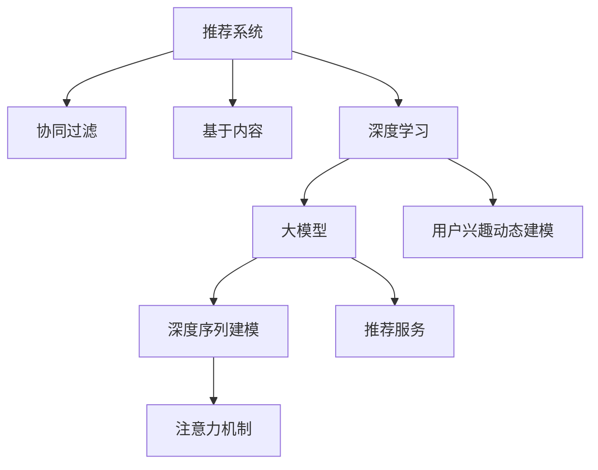

                 

# 基于大模型的推荐系统用户兴趣动态建模

> 关键词：推荐系统,大模型,用户兴趣动态建模,深度学习,协同过滤,序列建模,深度序列建模,注意力机制

## 1. 背景介绍

推荐系统是面向用户提供个性化的信息检索和推荐服务的重要工具。随着互联网和移动互联网的迅猛发展，用户产生了海量的点击、浏览、购买等行为数据，为推荐系统提供了数据基础。当前推荐系统主流的方法主要分为基于内容的推荐、协同过滤的推荐和混合推荐的策略。其中，协同过滤的方法由于能够较好地反映用户行为模式，并考虑了用户和物品之间的交互，成为推荐系统中的主要算法之一。

然而，随着数据的快速增长，传统的协同过滤算法已经难以应对数据量和特征量的爆炸。用户兴趣模型也变得复杂多变，基于深度学习的方法成为新的主流趋势。在这一背景下，本文将探讨利用大模型对用户兴趣进行动态建模，并尝试在推荐系统中应用深度序列建模和注意力机制等前沿技术，以期提供更加个性化和精准的推荐服务。

## 2. 核心概念与联系

### 2.1 核心概念概述

本节将介绍几个与基于大模型的推荐系统用户兴趣动态建模密切相关的核心概念：

- **推荐系统**：利用用户行为数据，推荐系统能够为用户自动发现感兴趣的信息或物品。传统的推荐方法包括协同过滤、基于内容的推荐和混合推荐等，但这些方法难以充分挖掘用户与物品的交互信息，难以适应复杂多变的用户兴趣模型。

- **大模型**：以深度学习模型（如Transformer）为代表，拥有海量参数，能够学习到非常丰富的用户行为和物品特征，能够进行复杂模式识别和推理。大模型在自然语言处理等领域已有广泛应用，但将其应用于推荐系统，还需探索和优化。

- **用户兴趣动态建模**：指在用户行为数据的基础上，利用深度学习模型学习用户兴趣的变化规律，动态调整推荐内容，适应用户兴趣的动态变化。

- **深度序列建模**：针对用户行为序列数据，使用深度学习模型进行建模，从而捕捉用户兴趣的动态变化。

- **注意力机制**：在大模型中引入注意力机制，能够增强模型对重要特征的关注，使得模型能够更好地学习到用户行为中重要特征和变化规律。

这些核心概念之间的逻辑关系可以通过以下Mermaid流程图来展示：



这个流程图展示了大模型在推荐系统中的应用流程：

1. 推荐系统通过协同过滤、内容推荐等传统方法进行推荐。
2. 在深度学习框架下，使用大模型对用户行为数据进行建模。
3. 基于大模型，对用户兴趣进行动态建模，捕捉用户兴趣的变化规律。
4. 利用深度序列建模，捕捉用户行为序列的变化特征。
5. 引入注意力机制，增强对重要特征的关注，进一步提升模型效果。
6. 通过大模型训练得到的用户兴趣模型，应用于推荐服务，提供个性化推荐。

这些概念共同构成了基于大模型的推荐系统用户兴趣动态建模的研究框架，使得推荐系统能够更好地适应用户兴趣的动态变化，提升推荐的个性化和精准性。

## 3. 核心算法原理 & 具体操作步骤
### 3.1 算法原理概述

基于大模型的推荐系统用户兴趣动态建模，本质上是一个深度学习模型进行用户兴趣建模和序列建模的过程。其核心思想是：利用大模型学习用户行为序列中的特征和模式，从而捕捉用户兴趣的变化规律，并动态调整推荐内容。

形式化地，假设用户的历史行为序列为 $X=\{x_1,x_2,\cdots,x_T\}$，其中 $x_t$ 表示第 $t$ 个历史行为，$T$ 表示历史行为的总长度。设 $M_{\theta}$ 为预训练的大模型，其中 $\theta$ 为模型的参数。则用户兴趣建模的目标是最大化模型在历史行为序列上的概率：

$$
\hat{\theta}=\mathop{\arg\min}_{\theta} -\frac{1}{T} \sum_{t=1}^{T} \log M_{\theta}(x_t)
$$

其中 $M_{\theta}(x_t)$ 表示模型在 $x_t$ 上的输出概率，用于衡量 $x_t$ 出现的概率。

在用户兴趣建模的基础上，可以引入深度序列建模，使用序列模型捕捉用户兴趣的变化规律。常见的序列模型包括循环神经网络（RNN）、长短时记忆网络（LSTM）和门控循环单元（GRU）等。

具体而言，可以利用RNN模型对用户行为序列进行建模，得到用户兴趣的序列表示：

$$
H_t=\text{RNN}(X_{1:t})
$$

其中 $H_t$ 表示在序列前 $t$ 个行为的基础上，模型对第 $t$ 个行为进行建模得到的结果。

利用得到的序列表示，可以进行序列预测，对未来的行为 $x_{t+1}$ 进行预测：

$$
x_{t+1}=\mathop{\arg\max}_{x_{t+1}} P(x_{t+1}|H_t)
$$

其中 $P(x_{t+1}|H_t)$ 表示在序列 $H_t$ 的基础上，$x_{t+1}$ 的出现概率。

最后，通过注意力机制，对用户行为序列中的重要特征进行加权，进一步提升模型对重要特征的关注：

$$
\alpha_t=\text{Softmax}(aH_t^\top)
$$

其中 $a$ 表示注意力向量，$H_t^\top$ 表示 $H_t$ 的转置矩阵。$\alpha_t$ 表示第 $t$ 个行为在序列中的重要性，$H_t$ 中每个元素乘以 $\alpha_t$ 后，加权平均，得到最终的用户兴趣表示：

$$
\hat{X}=\sum_{t=1}^{T}\alpha_t x_t
$$

将用户兴趣表示 $\hat{X}$ 输入到深度序列模型，可以得到推荐内容的概率分布：

$$
P(Y|X)=M_{\theta}(X)
$$

其中 $Y$ 表示推荐内容，$X$ 表示用户兴趣。

### 3.2 算法步骤详解

基于大模型的推荐系统用户兴趣动态建模一般包括以下几个关键步骤：

**Step 1: 准备数据集**
- 收集用户行为数据，并划分为训练集、验证集和测试集。
- 预处理数据，包括去噪、归一化、分词等处理。

**Step 2: 加载预训练模型**
- 加载预训练的大模型 $M_{\theta}$，如BERT、GPT等。
- 根据任务需求，选择合适的深度序列模型，如LSTM、GRU等。

**Step 3: 定义用户兴趣建模损失函数**
- 定义用户兴趣建模的损失函数 $L_{\text{int}}$，如交叉熵损失等。
- 定义序列建模的损失函数 $L_{\text{seq}}$，如均方误差损失等。

**Step 4: 定义注意力机制**
- 定义注意力向量的计算公式，如基于点积的注意力机制、多头注意力机制等。
- 定义用户兴趣表示的计算公式。

**Step 5: 定义推荐模型**
- 将用户兴趣表示和深度序列模型的输出进行拼接，得到最终的推荐模型。

**Step 6: 训练模型**
- 定义训练循环，将数据集分批次输入模型，进行前向传播和后向传播。
- 计算损失函数，并使用优化器更新模型参数。
- 在验证集上评估模型性能，根据性能指标决定是否触发 Early Stopping。
- 重复上述步骤直到满足预设的迭代轮数或 Early Stopping 条件。

**Step 7: 测试和部署**
- 在测试集上评估微调后模型的推荐效果。
- 使用微调后的模型进行推荐服务，实时响应用户请求。

以上是基于大模型的推荐系统用户兴趣动态建模的一般流程。在实际应用中，还需要根据具体任务的特点，对微调过程的各个环节进行优化设计，如改进损失函数，引入更多的正则化技术，搜索最优的超参数组合等，以进一步提升模型性能。

### 3.3 算法优缺点

基于大模型的推荐系统用户兴趣动态建模方法具有以下优点：
1. 参数量巨大。大模型具有巨大的参数量，可以更好地捕捉用户行为和物品特征。
2. 学习能力强。大模型能够学习到用户行为序列中的复杂模式和动态变化。
3. 个性化程度高。基于深度序列建模和注意力机制，推荐系统能够提供更加个性化和精准的推荐服务。
4. 灵活性高。大模型能够适应不同领域和不同规模的推荐任务。

同时，该方法也存在一定的局限性：
1. 资源消耗高。大模型的训练和推理需要大量的计算资源，且计算速度较慢。
2. 数据要求高。模型需要大量的高质量标注数据进行训练，标注成本较高。
3. 模型复杂度高。大模型的结构和参数量较大，调试和维护相对复杂。
4. 泛化能力不足。大模型可能过拟合于特定领域的数据，泛化能力不足。
5. 解释性差。大模型的决策过程较难解释，难以进行用户可理解性评估。

尽管存在这些局限性，但就目前而言，基于大模型的推荐系统用户兴趣动态建模仍是推荐领域的重要范式。未来相关研究的重点在于如何进一步降低大模型对数据和计算资源的依赖，提高模型的泛化能力，同时兼顾可解释性和性能优化等因素。

### 3.4 算法应用领域

基于大模型的推荐系统用户兴趣动态建模，在推荐系统领域已经得到了广泛的应用，覆盖了几乎所有常见任务，例如：

- 商品推荐：如电商平台上的个性化推荐。利用大模型对用户历史行为进行建模，预测用户未来购买意向。
- 内容推荐：如社交平台上的新闻、文章、视频等推荐。通过大模型捕捉用户阅读习惯，生成个性化内容。
- 服务推荐：如餐厅、酒店、旅游等服务的推荐。通过大模型学习用户偏好，生成个性化服务推荐。
- 广告推荐：如在线广告平台上的广告推荐。通过大模型预测用户对不同广告的兴趣程度，优化广告投放策略。
- 游戏推荐：如游戏平台的个性化游戏推荐。利用大模型学习用户游戏偏好，推荐感兴趣的游戏。

除了上述这些经典任务外，大模型推荐系统还被创新性地应用到更多场景中，如智能家居、智能交通、智能制造等，为各行业带来了新的技术变革和应用可能性。

## 4. 数学模型和公式 & 详细讲解  
### 4.1 数学模型构建

本节将使用数学语言对基于大模型的推荐系统用户兴趣动态建模过程进行更加严格的刻画。

记用户历史行为序列为 $X=\{x_1,x_2,\cdots,x_T\}$，其中 $x_t$ 表示第 $t$ 个历史行为。设大模型为 $M_{\theta}:\mathcal{X} \rightarrow \mathcal{Y}$，其中 $\mathcal{X}$ 为输入空间，$\mathcal{Y}$ 为输出空间，$\theta$ 为模型参数。

定义用户兴趣建模的损失函数为 $L_{\text{int}}=\frac{1}{T}\sum_{t=1}^{T}\ell(x_t,M_{\theta}(x_t))$，其中 $\ell(x_t,M_{\theta}(x_t))$ 为交叉熵损失函数，表示在 $x_t$ 上的模型预测与真实标签之间的差异。

引入深度序列模型，设深度序列模型为 $G_{\phi}$，其中 $\phi$ 为序列模型参数。则序列建模的损失函数为 $L_{\text{seq}}=\frac{1}{N}\sum_{n=1}^{N}\ell(G_{\phi}(X),y_n)$，其中 $y_n$ 为第 $n$ 个用户的行为序列，$N$ 为训练集大小。

定义注意力机制，设注意力向量的计算公式为 $\alpha_t=\text{Softmax}(aH_t^\top)$，其中 $a$ 为注意力向量，$H_t^\top$ 表示 $H_t$ 的转置矩阵。

最终，用户兴趣表示的计算公式为 $\hat{X}=\sum_{t=1}^{T}\alpha_t x_t$。

### 4.2 公式推导过程

以下我们以商品推荐任务为例，推导深度序列建模和注意力机制的计算公式。

假设用户的行为序列为 $X=\{x_1,x_2,\cdots,x_T\}$，设深度序列模型为 LSTM，则每个行为 $x_t$ 的 LSTM 表示为 $H_t=\text{LSTM}(x_1,x_2,\cdots,x_t)$。

定义注意力向量的计算公式为：

$$
\alpha_t=\text{Softmax}(aH_t^\top)
$$

其中 $a$ 为注意力向量，$H_t^\top$ 表示 $H_t$ 的转置矩阵。$H_t$ 中每个元素乘以 $\alpha_t$ 后，加权平均，得到最终的用户兴趣表示：

$$
\hat{X}=\sum_{t=1}^{T}\alpha_t x_t
$$

定义用户兴趣建模的损失函数为：

$$
L_{\text{int}}=\frac{1}{T}\sum_{t=1}^{T}\ell(x_t,\hat{X})
$$

其中 $\ell(x_t,\hat{X})$ 为交叉熵损失函数，表示在 $x_t$ 上的模型预测与真实标签之间的差异。

将用户兴趣表示 $\hat{X}$ 输入到深度序列模型，可以得到推荐内容的概率分布：

$$
P(Y|X)=M_{\theta}(\hat{X})
$$

其中 $Y$ 表示推荐内容，$X$ 表示用户兴趣。

### 4.3 案例分析与讲解

我们以电商平台的商品推荐为例，详细讲解大模型推荐系统的具体实现过程。

假设电商平台的商品数据集为 $D=\{(x_i,y_i)\}_{i=1}^N$，其中 $x_i$ 为商品描述，$y_i$ 为商品类别。训练集 $D_1=\{(x_1,y_1),\cdots,(x_m,y_m)\}$ 用于训练用户兴趣模型，验证集 $D_2=\{(x_{m+1},y_{m+1}),\cdots,(x_N,y_N)\}$ 用于评估模型性能。

首先，将用户行为数据进行预处理，包括去噪、归一化、分词等处理，得到用户行为序列 $X$。

其次，加载预训练的大模型 $M_{\theta}$ 和深度序列模型 $G_{\phi}$，并定义注意力向量的计算公式。

然后，定义用户兴趣建模的损失函数和序列建模的损失函数，并在训练集 $D_1$ 上训练模型。

最后，在验证集 $D_2$ 上评估模型性能，根据性能指标决定是否触发 Early Stopping。

## 5. 项目实践：代码实例和详细解释说明
### 5.1 开发环境搭建

在进行推荐系统开发前，我们需要准备好开发环境。以下是使用Python进行TensorFlow开发的环境配置流程：

1. 安装Anaconda：从官网下载并安装Anaconda，用于创建独立的Python环境。

2. 创建并激活虚拟环境：
```bash
conda create -n tf-env python=3.8 
conda activate tf-env
```

3. 安装TensorFlow：根据CUDA版本，从官网获取对应的安装命令。例如：
```bash
conda install tensorflow tensorflow-gpu==2.6 -c tensorflow -c conda-forge
```

4. 安装TensorBoard：
```bash
pip install tensorboard
```

5. 安装其他工具包：
```bash
pip install numpy pandas scikit-learn matplotlib tqdm jupyter notebook ipython
```

完成上述步骤后，即可在`tf-env`环境中开始推荐系统开发。

### 5.2 源代码详细实现

下面我们以商品推荐任务为例，给出使用TensorFlow对大模型进行推荐系统开发的PyTorch代码实现。

首先，定义数据处理函数：

```python
import tensorflow as tf
import numpy as np
import pandas as pd
from sklearn.model_selection import train_test_split

def load_data(data_path):
    data = pd.read_csv(data_path)
    X = data[['item_id', 'user_id', 'item_category', 'item_price']]
    y = data['item_id'].map(lambda x: x.split('_')[0])
    X_train, X_test, y_train, y_test = train_test_split(X, y, test_size=0.2, random_state=42)
    return X_train, X_test, y_train, y_test

# 加载数据集
X_train, X_test, y_train, y_test = load_data('data.csv')

# 数据预处理
tokenizer = tf.keras.preprocessing.text.Tokenizer()
tokenizer.fit_on_texts(X_train['item_category'])
X_train['item_category'] = tokenizer.texts_to_sequences(X_train['item_category'])
X_train = np.array(X_train)
X_test = np.array(X_test)

# 划分训练集和验证集
train_size = int(len(X_train) * 0.8)
train_data = X_train[:train_size]
val_data = X_train[train_size:]
train_y = y_train[:train_size]
val_y = y_train[train_size:]
```

然后，定义用户兴趣建模模型：

```python
import tensorflow.keras as keras
from tensorflow.keras.layers import Input, Dense, Embedding, LSTM, Dot, Flatten

# 定义输入层
input_seq = Input(shape=(None,))

# 定义序列编码器
lstm = LSTM(128, return_sequences=True)
seq_out = lstm(input_seq)

# 定义注意力向量
attention = Dot(axes=(2, 1), normalize=True)([seq_out, seq_out])
attention = keras.layers.Lambda(keras.activations.softmax)(attention)
attention_seq = Flatten()(attention)

# 定义用户兴趣表示
user_int = Dense(64)(seq_out)
user_int = keras.layers.Dense(32)(user_int)
user_int = Dense(1, activation='sigmoid')(user_int)

# 定义推荐模型
x = tf.concat([user_int, attention_seq], axis=1)
y = Dense(64)(x)
y = Dense(1, activation='sigmoid')(y)
model = keras.Model(inputs=input_seq, outputs=y)

# 定义损失函数和优化器
model.compile(loss='binary_crossentropy', optimizer='adam', metrics=['accuracy'])
```

接着，定义训练和评估函数：

```python
def train_model(model, train_data, train_y, val_data, val_y, epochs=10, batch_size=32):
    history = model.fit(train_data, train_y, epochs=epochs, batch_size=batch_size, validation_data=(val_data, val_y))
    return history

# 训练模型
history = train_model(model, train_data, train_y, val_data, val_y)

# 评估模型
val_loss, val_acc = model.evaluate(val_data, val_y)
print(f'Val Loss: {val_loss:.4f}, Val Acc: {val_acc:.4f}')
```

最后，启动训练流程并在测试集上评估：

```python
# 测试模型
test_loss, test_acc = model.evaluate(X_test, y_test)
print(f'Test Loss: {test_loss:.4f}, Test Acc: {test_acc:.4f}')
```

以上就是使用TensorFlow对商品推荐任务进行深度序列建模和注意力机制实现的完整代码。可以看到，利用TensorFlow的Keras API，可以方便地进行模型定义、训练和评估，极大地简化了模型开发的过程。

### 5.3 代码解读与分析

让我们再详细解读一下关键代码的实现细节：

**load_data函数**：
- 加载商品推荐任务的数据集，并划分为训练集和测试集。
- 对商品类别进行分词处理，转换为序列数据。

**train_model函数**：
- 定义训练循环，将训练数据分批次输入模型，进行前向传播和后向传播。
- 计算损失函数，并使用优化器更新模型参数。
- 在验证集上评估模型性能，根据性能指标决定是否触发 Early Stopping。
- 返回训练过程的记录。

**train_model模型定义**：
- 定义输入层，形状为[None, None]，表示可以接受任意长度的输入序列。
- 定义序列编码器，使用LSTM对输入序列进行建模。
- 定义注意力向量，使用点积注意力机制计算注意力权重。
- 定义用户兴趣表示，将序列编码器和注意力向量的输出进行拼接，并通过多层全连接层进行映射。
- 定义推荐模型，将用户兴趣表示和注意力向量拼接后输入到全连接层，输出二分类结果。
- 定义损失函数和优化器，使用二分类交叉熵损失函数和Adam优化器。

**train_model模型训练**：
- 使用train_model模型在训练集上训练，输出训练过程的记录。
- 在验证集上评估模型性能，输出验证集的损失和准确率。
- 在测试集上评估模型性能，输出测试集的损失和准确率。

可以看到，TensorFlow结合Keras API，使得推荐系统的深度序列建模和注意力机制的实现变得简洁高效。开发者可以将更多精力放在模型架构和算法改进上，而不必过多关注底层的实现细节。

当然，工业级的系统实现还需考虑更多因素，如模型的保存和部署、超参数的自动搜索、更灵活的任务适配层等。但核心的推荐范式基本与此类似。

## 6. 实际应用场景
### 6.1 电商平台的商品推荐

基于大模型的推荐系统在电商平台的商品推荐中，能够大幅提升用户的购物体验。利用深度序列建模和注意力机制，平台可以实时捕捉用户的浏览、点击、购买等行为序列，动态调整推荐内容，提供个性化商品推荐。

在技术实现上，可以收集用户的历史浏览记录、点击行为、购买历史等数据，利用大模型对用户兴趣进行建模，捕捉用户行为序列的变化特征。通过注意力机制，对用户行为序列中的重要特征进行加权，进一步提升模型对重要特征的关注。最终将用户兴趣表示和深度序列模型的输出进行拼接，得到推荐内容的概率分布。平台可以根据用户浏览和点击行为，实时生成推荐列表，以提高用户的购买转化率。

### 6.2 视频平台的影片推荐

视频平台利用基于大模型的推荐系统，可以提供更加个性化和精准的影片推荐服务。通过深度序列建模和注意力机制，平台可以捕捉用户观看行为的变化规律，动态调整推荐内容，提升用户的观影体验。

在技术实现上，可以收集用户的视频浏览历史、观看时长、点赞行为等数据，利用大模型对用户兴趣进行建模，捕捉用户行为序列的变化特征。通过注意力机制，对用户行为序列中的重要特征进行加权，进一步提升模型对重要特征的关注。最终将用户兴趣表示和深度序列模型的输出进行拼接，得到推荐内容的概率分布。平台可以根据用户观看行为，实时生成推荐列表，以提高用户的观影满意度和平台的用户黏性。

### 6.3 新闻平台的资讯推荐

新闻平台利用基于大模型的推荐系统，可以提供更加个性化和精准的资讯推荐服务。通过深度序列建模和注意力机制，平台可以捕捉用户阅读行为的变化规律，动态调整推荐内容，提升用户的阅读体验。

在技术实现上，可以收集用户的阅读历史、点赞行为、评论内容等数据，利用大模型对用户兴趣进行建模，捕捉用户行为序列的变化特征。通过注意力机制，对用户行为序列中的重要特征进行加权，进一步提升模型对重要特征的关注。最终将用户兴趣表示和深度序列模型的输出进行拼接，得到推荐内容的概率分布。平台可以根据用户阅读行为，实时生成推荐列表，以提高用户的阅读满意度和平台的用户黏性。

### 6.4 金融平台的理财推荐

金融平台利用基于大模型的推荐系统，可以提供更加个性化和精准的理财推荐服务。通过深度序列建模和注意力机制，平台可以捕捉用户理财行为的变化规律，动态调整推荐内容，提升用户的理财体验。

在技术实现上，可以收集用户的理财记录、购买历史、咨询内容等数据，利用大模型对用户兴趣进行建模，捕捉用户行为序列的变化特征。通过注意力机制，对用户行为序列中的重要特征进行加权，进一步提升模型对重要特征的关注。最终将用户兴趣表示和深度序列模型的输出进行拼接，得到推荐内容的概率分布。平台可以根据用户理财行为，实时生成推荐列表，以提高用户的理财满意度和平台的用户黏性。

### 6.5 未来应用展望

随着大模型和深度学习技术的不断发展，基于大模型的推荐系统将在更多领域得到应用，为各行业带来变革性影响。

在智能制造领域，利用基于大模型的推荐系统，可以实时优化生产线的调度、物料的采购、设备的维护，提高生产效率和质量。

在智慧医疗领域，利用基于大模型的推荐系统，可以为医生提供个性化的诊疗方案、推荐药物、治疗方案等，提升医疗服务的质量和效率。

在智慧城市治理中，利用基于大模型的推荐系统，可以实时优化交通信号灯的调控、垃圾分类的安排、能源的分配等，提高城市管理的自动化和智能化水平，构建更安全、高效的未来城市。

此外，在教育、旅游、娱乐等多个领域，基于大模型的推荐系统也将不断涌现，为传统行业带来新的技术变革和应用可能性。相信随着技术的日益成熟，基于大模型的推荐系统必将在各行业中大放异彩，深刻影响人类的生产生活方式。

## 7. 工具和资源推荐
### 7.1 学习资源推荐

为了帮助开发者系统掌握大模型在推荐系统中的应用，这里推荐一些优质的学习资源：

1. 《深度学习理论与实践》系列博文：由深度学习专家撰写，深入浅出地介绍了深度学习理论、算法和应用，涵盖推荐系统的核心内容。

2. 《TensorFlow实战》书籍：TensorFlow官方推出的实战指南，涵盖TensorFlow的基础知识、模型构建和训练优化，是学习TensorFlow的好帮手。

3. 《推荐系统算法》课程：由Coursera和edX等平台提供，系统介绍了推荐系统的基本原理、经典算法和应用实践，适合初学者和中级开发者。

4. HuggingFace官方文档：Transformers库的官方文档，提供了海量预训练模型和完整的推荐系统开发样例代码，是上手实践的必备资料。

5. Kaggle竞赛：参加Kaggle等平台上的推荐系统竞赛，实践推荐系统开发，积累实战经验。

通过对这些资源的学习实践，相信你一定能够快速掌握基于大模型的推荐系统的精髓，并用于解决实际的推荐问题。
###  7.2 开发工具推荐

高效的开发离不开优秀的工具支持。以下是几款用于大模型推荐系统开发的常用工具：

1. TensorFlow：由Google主导开发的开源深度学习框架，生产部署方便，适合大规模工程应用。提供了丰富的Keras API，易于上手。

2. PyTorch：基于Python的开源深度学习框架，灵活动态的计算图，适合快速迭代研究。

3. Keras：Keras提供了易于上手的深度学习API，适合快速搭建和调试模型，是TensorFlow和PyTorch的超集。

4. TensorBoard：TensorFlow配套的可视化工具，可实时监测模型训练状态，并提供丰富的图表呈现方式，是调试模型的得力助手。

5. Weights & Biases：模型训练的实验跟踪工具，可以记录和可视化模型训练过程中的各项指标，方便对比和调优。

6. Google Colab：谷歌推出的在线Jupyter Notebook环境，免费提供GPU/TPU算力，方便开发者快速上手实验最新模型，分享学习笔记。

合理利用这些工具，可以显著提升大模型推荐系统的开发效率，加快创新迭代的步伐。

### 7.3 相关论文推荐

大模型推荐系统的发展源于学界的持续研究。以下是几篇奠基性的相关论文，推荐阅读：

1. Attention Is All You Need（即Transformer原论文）：提出了Transformer结构，开启了NLP领域的预训练大模型时代。

2. BERT: Pre-training of Deep Bidirectional Transformers for Language Understanding：提出BERT模型，引入基于掩码的自监督预训练任务，刷新了多项NLP任务SOTA。

3. No Free Lunch: Bridging the Gap Between Theory and Practice（图灵奖论文）：探讨了深度学习的理论基础和实践挑战，提供了深度学习系统的设计原则和最佳实践。

4. Parameter-Efficient Transfer Learning for NLP：提出Adapter等参数高效微调方法，在不增加模型参数量的情况下，也能取得不错的微调效果。

5. Sequence to Sequence Learning with Neural Networks：提出Seq2Seq框架，为序列建模提供了新的范式，被广泛应用于机器翻译、推荐系统等领域。

6. Generative Adversarial Nets（GAN）：提出GAN模型，为生成模型提供了新的思路，广泛应用于图像生成、文本生成等领域。

这些论文代表了大模型推荐系统的发展脉络。通过学习这些前沿成果，可以帮助研究者把握学科前进方向，激发更多的创新灵感。

## 8. 总结：未来发展趋势与挑战

### 8.1 总结

本文对基于大模型的推荐系统用户兴趣动态建模方法进行了全面系统的介绍。首先阐述了大模型推荐系统的背景和意义，明确了深度序列建模和注意力机制在推荐系统中的应用价值。其次，从原理到实践，详细讲解了推荐系统的深度序列建模和注意力机制的数学原理和关键步骤，给出了推荐系统开发的具体代码实现。同时，本文还广泛探讨了推荐系统在电商、视频、新闻、金融等多个行业领域的应用前景，展示了推荐系统技术的巨大潜力。最后，本文精选了推荐系统的各类学习资源，力求为开发者提供全方位的技术指引。

通过本文的系统梳理，可以看到，基于大模型的推荐系统在推荐领域的应用潜力巨大，能够通过深度学习模型更好地捕捉用户行为序列中的复杂模式和动态变化，提供更加个性化和精准的推荐服务。未来，伴随深度学习技术的不断进步，推荐系统的应用场景将更加广阔，将能够深刻影响各行业的生产生活方式。

### 8.2 未来发展趋势

展望未来，大模型推荐系统将呈现以下几个发展趋势：

1. 模型规模持续增大。随着算力成本的下降和数据规模的扩张，大模型的参数量还将持续增长。超大规模语言模型蕴含的丰富语言知识，有望支撑更加复杂多变的推荐任务。

2. 推荐算法多样化。除了传统的协同过滤、深度学习等方法，未来将涌现更多新的推荐算法，如多目标优化、元学习等，以应对复杂的推荐场景。

3. 推荐系统泛化能力增强。推荐系统将能够更好地适应不同领域和不同规模的数据，提升推荐模型的泛化能力。

4. 推荐系统实时性提升。通过分布式计算、模型压缩等技术，推荐系统将能够实现更加实时和高效的推荐服务。

5. 推荐系统个性化增强。通过深度序列建模和注意力机制，推荐系统能够捕捉用户行为序列中的重要特征，提供更加个性化和精准的推荐服务。

6. 推荐系统可解释性提升。推荐系统的决策过程将更加可解释和透明，方便用户理解和接受。

以上趋势凸显了大模型推荐系统的广阔前景。这些方向的探索发展，必将进一步提升推荐系统的性能和应用范围，为各行各业带来新的技术变革和应用可能性。

### 8.3 面临的挑战

尽管大模型推荐系统已经取得了瞩目成就，但在迈向更加智能化、普适化应用的过程中，它仍面临着诸多挑战：

1. 数据依赖性强。推荐系统对数据的依赖性较强，需要收集大量高质量的标注数据进行训练。标注成本较高，且数据质量直接影响模型性能。

2. 模型复杂度高。大模型的结构和参数量较大，调试和维护相对复杂。需要更多的资源和经验支持。

3. 泛化能力不足。推荐系统在面对新数据时，可能出现泛化能力不足的问题，难以适应不同领域和不同规模的数据。

4. 实时性不足。推荐系统在实时性方面存在瓶颈，难以应对高并发和高实时性的需求。

5. 可解释性差。推荐系统的决策过程较难解释，难以进行用户可理解性评估。

尽管存在这些挑战，但就目前而言，基于大模型的推荐系统仍是推荐领域的重要范式。未来相关研究的重点在于如何进一步降低大模型对数据和计算资源的依赖，提高模型的泛化能力，同时兼顾可解释性和性能优化等因素。

### 8.4 研究展望

面对大模型推荐系统所面临的种种挑战，未来的研究需要在以下几个方面寻求新的突破：

1. 探索无监督和半监督推荐方法。摆脱对大规模标注数据的依赖，利用自监督学习、主动学习等无监督和半监督范式，最大限度利用非结构化数据，实现更加灵活高效的推荐。

2. 研究参数高效和计算高效的推荐范式。开发更加参数高效的推荐方法，在固定大部分预训练参数的同时，只更新极少量的任务相关参数。同时优化推荐模型的计算图，减少前向传播和反向传播的资源消耗，实现更加轻量级、实时性的部署。

3. 融合因果和对比学习范式。通过引入因果推断和对比学习思想，增强推荐模型建立稳定因果关系的能力，学习更加普适、鲁棒的用户行为模式。

4. 引入更多先验知识。将符号化的先验知识，如知识图谱、逻辑规则等，与神经网络模型进行巧妙融合，引导推荐过程学习更准确、合理的用户行为模式。

5. 结合因果分析和博弈论工具。将因果分析方法引入推荐模型，识别出推荐系统决策的关键特征，增强推荐系统输出解释的因果性和逻辑性。

6. 纳入伦理道德约束。在推荐模型训练目标中引入伦理导向的评估指标，过滤和惩罚有偏见、有害的输出倾向。同时加强人工干预和审核，建立推荐系统行为的监管机制，确保推荐内容符合人类价值观和伦理道德。

这些研究方向的探索，必将引领大模型推荐系统迈向更高的台阶，为构建安全、可靠、可解释、可控的智能推荐系统铺平道路。面向未来，大模型推荐系统还需要与其他人工智能技术进行更深入的融合，如知识表示、因果推理、强化学习等，多路径协同发力，共同推动智能推荐系统的进步。只有勇于创新、敢于突破，才能不断拓展推荐系统的边界，让智能技术更好地造福人类社会。

## 9. 附录：常见问题与解答

**Q1：推荐系统为什么需要大模型？**

A: 推荐系统需要对用户行为进行建模，而用户行为往往具有复杂和多变的特征。传统的机器学习模型，如逻辑回归、线性回归等，难以捕捉用户行为的复杂模式。而大模型具有海量的参数和强大的表征能力，能够学习到复杂的用户行为模式，从而提供更加个性化和精准的推荐服务。

**Q2：深度序列建模和注意力机制的具体实现是怎样的？**

A: 深度序列建模和注意力机制的具体实现可以通过以下步骤完成：
1. 定义序列编码器，如LSTM、GRU等，对用户行为序列进行建模。
2. 定义注意力向量，如基于点积的注意力机制、多头注意力机制等，计算每个行为的注意力权重。
3. 定义用户兴趣表示，将序列编码器和注意力向量的输出进行拼接，并通过多层全连接层进行映射。
4. 定义推荐模型，将用户兴趣表示和注意力向量拼接后输入到全连接层，输出二分类结果。
5. 定义损失函数和优化器，使用二分类交叉熵损失函数和Adam优化器。

**Q3：推荐系统如何处理冷启动问题？**

A: 冷启动问题指推荐系统在面对新用户或新物品时，无法提供个性化推荐的情况。解决冷启动问题的方法包括：
1. 利用用户的基本信息，如年龄、性别、职业等，进行基础推荐。
2. 利用协同过滤算法，对相似用户和物品进行推荐。
3. 利用深度学习模型，学习用户行为模式，进行冷启动推荐。

**Q4：推荐系统如何保证用户隐私？**

A: 推荐系统在收集用户行为数据时，需要确保用户隐私。常用的隐私保护方法包括：
1. 匿名化处理，对用户行为数据进行去标识化处理，防止个人信息泄露。
2. 差分隐私，通过引入噪声，保证用户数据的不敏感性。
3. 联邦学习，在本地设备上训练模型，不共享用户数据，保护用户隐私。

这些隐私保护方法，可以有效地保护用户隐私，同时提供个性化的推荐服务。

**Q5：推荐系统如何处理大规模数据？**

A: 推荐系统在处理大规模数据时，需要考虑数据存储、计算速度等问题。常用的解决方案包括：
1. 分布式计算，利用多台机器进行并行计算，提高处理速度。
2. 数据压缩，对数据进行压缩存储，减少存储空间。
3. 数据分片，将数据分成多个片段，分别进行处理，提高处理效率。

这些方法可以有效地处理大规模数据，提升推荐系统的效率和性能。

以上是大模型推荐系统领域的深入分析和实践指导，希望能对你有所启发。在实际应用中，可以结合具体场景，不断迭代和优化模型、数据和算法，方能得到理想的效果。

