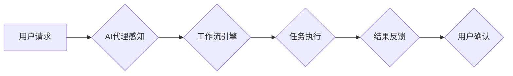

> 人工智能代理，工作流，用户体验，交互设计，自然语言处理，机器学习，深度学习

## 1. 背景介绍

随着人工智能技术的飞速发展，人工智能代理（AI Agent）逐渐成为一个备受关注的领域。人工智能代理是指能够自主学习、决策和执行任务的智能软件实体。它们能够模拟人类的行为，与用户进行交互，并根据用户的需求提供服务。

传统的软件系统通常是静态的，需要用户按照预设的流程操作。而人工智能代理则可以根据用户的需求和上下文进行动态调整，提供更加个性化和智能化的服务体验。

## 2. 核心概念与联系

### 2.1 人工智能代理

人工智能代理是一个能够感知环境、做出决策并执行行动的智能体。它通常由以下几个核心组件组成：

* **感知模块:** 用于收集环境信息，例如用户输入、传感器数据等。
* **推理模块:** 用于分析环境信息，做出决策。
* **行动模块:** 用于执行决策，例如控制设备、生成文本等。

### 2.2 工作流

工作流是一种描述业务流程的模型，它定义了任务的顺序、依赖关系和执行规则。工作流可以帮助组织提高效率、降低成本和增强协作。

### 2.3 人工智能代理工作流

人工智能代理工作流是指将人工智能代理与工作流技术相结合，构建一种能够自动执行业务流程的智能系统。

**Mermaid 流程图:**



## 3. 核心算法原理 & 具体操作步骤

### 3.1 算法原理概述

人工智能代理工作流的实现需要结合多种算法，例如：

* **自然语言处理 (NLP):** 用于理解用户的自然语言请求，并将其转换为工作流引擎可以理解的指令。
* **机器学习 (ML):** 用于训练人工智能代理，使其能够根据历史数据做出更准确的决策。
* **深度学习 (DL):** 用于构建更复杂的智能代理，例如能够理解图像、语音等多模态数据。

### 3.2 算法步骤详解

1. **用户请求:** 用户向人工智能代理提出请求，例如“请帮我申请假期”。
2. **自然语言理解:** 人工智能代理使用 NLP 算法解析用户的请求，识别出关键信息，例如“申请假期”，“日期”等。
3. **工作流匹配:** 人工智能代理根据用户的请求，从工作流库中匹配相应的业务流程。
4. **任务分配:** 工作流引擎根据匹配到的流程，将任务分配给相应的执行者。
5. **任务执行:** 执行者完成任务，例如审批假期申请。
6. **结果反馈:** 工作流引擎将执行结果反馈给人工智能代理。
7. **结果展示:** 人工智能代理将结果展示给用户，例如“您的假期申请已通过”。

### 3.3 算法优缺点

**优点:**

* **自动化:** 可以自动执行重复性任务，提高效率。
* **智能化:** 可以根据用户的需求和上下文进行动态调整，提供个性化服务。
* **协作:** 可以帮助团队成员更好地协作，提高工作效率。

**缺点:**

* **复杂性:** 设计和实现人工智能代理工作流需要复杂的算法和技术。
* **数据依赖:** 人工智能代理需要大量数据进行训练，否则性能会下降。
* **安全风险:** 人工智能代理可能存在安全风险，例如被恶意攻击或滥用。

### 3.4 算法应用领域

人工智能代理工作流可以应用于各个领域，例如：

* **客户服务:** 自动化客户服务流程，例如回答常见问题、处理投诉等。
* **人力资源:** 自动化招聘流程，例如筛选简历、安排面试等。
* **金融:** 自动化金融交易，例如投资理财、贷款审批等。
* **医疗:** 自动化医疗诊断，例如分析病历、推荐治疗方案等。

## 4. 数学模型和公式 & 详细讲解 & 举例说明

### 4.1 数学模型构建

人工智能代理工作流的数学模型可以基于状态机、决策树或强化学习等方法构建。

**状态机模型:**

状态机模型将工作流视为一系列状态的转换，每个状态代表一个任务或步骤。状态之间的转换由条件触发，例如用户输入、任务完成等。

**决策树模型:**

决策树模型将工作流视为一棵树形结构，每个节点代表一个决策，每个叶子节点代表一个结果。决策树根据用户的输入和历史数据，选择最优的决策路径。

**强化学习模型:**

强化学习模型将工作流视为一个马尔可夫决策过程 (MDP)，人工智能代理通过与环境交互，学习最优的策略，以最大化奖励。

### 4.2 公式推导过程

**状态机模型:**

状态机模型的数学表示可以使用状态转移函数来描述。

$$
s_{t+1} = f(s_t, a_t)
$$

其中：

* $s_t$ 表示当前状态。
* $a_t$ 表示当前动作。
* $s_{t+1}$ 表示下一个状态。

**决策树模型:**

决策树模型的数学表示可以使用信息增益或基尼不纯度等指标来评估节点的划分效果。

$$
Gain(S, A) = Entropy(S) - \sum_{v \in V} \frac{|S_v|}{|S|} Entropy(S_v)
$$

其中：

* $S$ 表示父节点的样本集。
* $A$ 表示划分属性。
* $V$ 表示属性 $A$ 的取值集合。
* $S_v$ 表示属性 $A$ 取值为 $v$ 的子集。

**强化学习模型:**

强化学习模型的数学表示可以使用Bellman方程来描述价值函数的更新过程。

$$
V(s) = \max_{\pi} \sum_{t=0}^{\infty} \gamma^t r(s_t, a_t)
$$

其中：

* $V(s)$ 表示状态 $s$ 的价值函数。
* $\gamma$ 表示折扣因子。
* $r(s_t, a_t)$ 表示在状态 $s_t$ 执行动作 $a_t$ 得到的奖励。

### 4.3 案例分析与讲解

**案例:** 假设我们构建一个自动审批假期的AI代理工作流。

**状态机模型:**

* 状态1: 用户提交假期申请
* 状态2: 管理员审批
* 状态3: 假期申请通过
* 状态4: 假期申请拒绝

**决策树模型:**

* 根节点: 用户提交假期申请
* 子节点1: 假期天数
* 子节点2: 审批人
* 叶子节点: 假期申请通过/拒绝

**强化学习模型:**

* 状态: 假期申请信息
* 动作: 审批通过/拒绝
* 奖励: 假期申请通过获得高奖励，拒绝获得低奖励

## 5. 项目实践：代码实例和详细解释说明

### 5.1 开发环境搭建

* 操作系统: Ubuntu 20.04
* Python 版本: 3.8
* 依赖库: Flask, NLTK, TensorFlow

### 5.2 源代码详细实现

```python
from flask import Flask, request, jsonify
from nltk.tokenize import word_tokenize
from tensorflow.keras.models import load_model

app = Flask(__name__)

# 加载预训练的自然语言处理模型
nlp_model = load_model('nlp_model.h5')

# 加载工作流引擎
workflow_engine = WorkflowEngine()

@app.route('/apply_vacation', methods=['POST'])
def apply_vacation():
    data = request.get_json()
    reason = data['reason']
    start_date = data['start_date']
    end_date = data['end_date']

    # 使用自然语言处理模型解析用户请求
    tokens = word_tokenize(reason)
    # ... (使用 nlp_model 进行预测)

    # 根据预测结果，调用工作流引擎执行审批流程
    workflow_engine.execute_workflow(tokens, start_date, end_date)

    return jsonify({'message': 'Vacation request submitted successfully'})

if __name__ == '__main__':
    app.run(debug=True)
```

### 5.3 代码解读与分析

* 该代码实现了一个简单的AI代理工作流，用于处理用户的假期申请。
* 使用Flask框架构建RESTful API，接收用户的假期申请请求。
* 使用NLTK库进行自然语言处理，解析用户的申请理由。
* 使用TensorFlow加载预训练的NLP模型，进行更精准的理解。
* 调用工作流引擎执行审批流程，根据用户的申请信息和审批规则进行审批。

### 5.4 运行结果展示

当用户向API发送假期申请请求时，AI代理会解析用户的请求，并根据预设的工作流规则进行审批。最终，用户会收到API返回的审批结果。

## 6. 实际应用场景

### 6.1 客户服务

* 自动化常见问题解答，例如产品信息、订单状态等。
* 提供个性化推荐，例如根据用户的浏览历史推荐产品。
* 处理客户投诉，例如收集客户反馈，并转交给相关部门处理。

### 6.2 人力资源

* 自动化招聘流程，例如筛选简历、安排面试等。
* 自动化员工培训，例如根据员工的技能水平推荐培训课程。
* 自动化绩效评估，例如收集员工绩效数据，并生成评估报告。

### 6.3 金融

* 自动化金融交易，例如投资理财、贷款审批等。
* 自动化风险管理，例如识别潜在的金融风险。
* 自动化客户服务，例如提供个性化的理财建议。

### 6.4 医疗

* 自动化医疗诊断，例如分析病历、推荐治疗方案等。
* 自动化患者管理，例如预约挂号、提醒服药等。
* 自动化科研工作，例如分析医学文献、发现新的药物靶点等。

### 6.5 未来应用展望

人工智能代理工作流的应用场景将会更加广泛，例如：

* 智能家居: 自动化家居设备控制，例如调节温度、灯光等。
* 智能交通: 自动化交通管理，例如优化交通流量、预测交通拥堵等。
* 智能教育: 个性化学习辅导，例如根据学生的学习进度和能力提供个性化的学习内容。

## 7. 工具和资源推荐

### 7.1 学习资源推荐

* **书籍:**
    * 《人工智能：现代方法》
    * 《深度学习》
    * 《机器学习》
* **在线课程:**
    * Coursera: 人工智能课程
    * edX: 深度学习课程
    * Udacity: 机器学习工程师课程

### 7.2 开发工具推荐

* **Python:** 人工智能开发的常用语言
* **TensorFlow:** 深度学习框架
* **PyTorch:** 深度学习框架
* **Flask:** Web框架
* **NLTK:** 自然语言处理库

### 7.3 相关论文推荐

* **Attention Is All You Need:** https://arxiv.org/abs/1706.03762
* **Deep Reinforcement Learning with Double Q-learning:** https://arxiv.org/abs/1509.06461
* **BERT: Pre-training of Deep Bidirectional Transformers for Language Understanding:** https://arxiv.org/abs/1810.04805

## 8. 总结：未来发展趋势与挑战

### 8.1 研究成果总结

人工智能代理工作流是一个快速发展的领域，取得了显著的成果。例如：

* 自然语言处理技术取得了长足进步，能够更准确地理解用户的自然语言请求。
* 深度学习算法能够学习更复杂的模式，提高人工智能代理的智能化水平。
* 工作流引擎技术不断完善，能够更好地支持