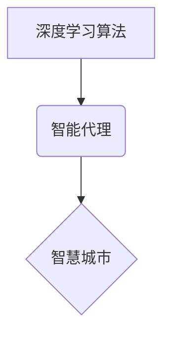

> 深度学习、智能代理、智慧城市、强化学习、预测建模、数据分析

## 1. 背景介绍

智慧城市建设是全球范围内一个重要的发展趋势，旨在通过信息技术和数据分析，提升城市管理效率、改善居民生活质量。在智慧城市建设中，人工智能（AI）技术扮演着越来越重要的角色。其中，深度学习算法作为AI领域的重要分支，凭借其强大的学习能力和数据处理能力，在智慧城市应用中展现出巨大的潜力。

智能代理作为一种能够自主学习、决策和执行任务的软件实体，在智慧城市中具有广泛的应用场景。例如，智能交通管理系统可以利用深度学习算法分析交通流量数据，预测交通拥堵情况，并智能调整交通信号灯，优化交通流；智能环境监测系统可以利用深度学习算法分析环境数据，监测空气质量、水质等，并及时发出预警信息；智能公共服务系统可以利用深度学习算法分析居民需求，提供个性化服务。

## 2. 核心概念与联系

**2.1 深度学习算法**

深度学习算法是一种基于人工神经网络的机器学习算法，其结构灵感来源于人类大脑的神经网络。深度学习算法通过多层神经网络结构，学习数据中的复杂特征和模式，从而实现对数据的理解和预测。

**2.2 智能代理**

智能代理是一种能够自主学习、决策和执行任务的软件实体。它通常具有以下特征：

* **自主性:** 智能代理能够根据自身的目标和环境信息，自主做出决策并执行相应的行动。
* **学习能力:** 智能代理能够从经验中学习，不断改进自己的决策策略。
* **适应性:** 智能代理能够适应不断变化的环境，调整自己的行为策略。

**2.3 智慧城市**

智慧城市是指利用信息技术和数据分析，提升城市管理效率、改善居民生活质量的城市。智慧城市建设的核心目标是通过数据驱动，实现城市资源的优化配置、城市服务的智能化和城市居民的幸福提升。

**2.4 核心概念关系图**



## 3. 核心算法原理 & 具体操作步骤

**3.1 算法原理概述**

在智慧城市中，深度学习算法可以用于各种场景，例如智能交通管理、智能环境监测、智能公共服务等。

**3.2 算法步骤详解**

1. **数据收集:** 收集相关数据，例如交通流量数据、环境监测数据、居民需求数据等。
2. **数据预处理:** 对收集到的数据进行清洗、转换、特征提取等预处理操作，使其适合深度学习算法的训练。
3. **模型选择:** 选择合适的深度学习算法模型，例如卷积神经网络（CNN）、循环神经网络（RNN）、深度强化学习等。
4. **模型训练:** 利用训练数据，训练深度学习模型，使其能够学习数据中的复杂特征和模式。
5. **模型评估:** 利用测试数据，评估模型的性能，例如准确率、召回率、F1-score等。
6. **模型部署:** 将训练好的模型部署到实际应用场景中，例如部署到智能交通管理系统、智能环境监测系统等。

**3.3 算法优缺点**

**优点:**

* 强大的学习能力：深度学习算法能够学习数据中的复杂特征和模式，实现对数据的理解和预测。
* 数据处理能力强：深度学习算法能够处理海量数据，并从中提取有价值的信息。
* 应用场景广泛：深度学习算法可以应用于各种智慧城市场景，例如智能交通管理、智能环境监测、智能公共服务等。

**缺点:**

* 训练数据需求大：深度学习算法需要大量的训练数据才能达到较好的性能。
* 计算资源消耗大：深度学习算法的训练过程需要大量的计算资源。
* 可解释性差：深度学习算法的决策过程比较复杂，难以解释其决策依据。

**3.4 算法应用领域**

* **智能交通管理:** 预测交通流量、优化交通信号灯控制、智能驾驶辅助系统等。
* **智能环境监测:** 监测空气质量、水质、噪音等环境指标，并及时发出预警信息。
* **智能公共服务:** 提供个性化服务，例如智能客服、智能预约、智能推荐等。
* **城市安全保障:** 人脸识别、视频监控、犯罪预测等。

## 4. 数学模型和公式 & 详细讲解 & 举例说明

**4.1 数学模型构建**

深度学习算法的核心是神经网络模型。神经网络模型由多个层组成，每一层包含多个神经元。神经元之间通过连接权重进行信息传递。

**4.2 公式推导过程**

深度学习算法的训练过程是通过优化连接权重来实现的。常用的优化算法包括梯度下降法、动量法、Adam算法等。

**梯度下降法:**

$$
\theta = \theta - \alpha \nabla J(\theta)
$$

其中：

* $\theta$ 是连接权重
* $\alpha$ 是学习率
* $\nabla J(\theta)$ 是损失函数 $J(\theta)$ 的梯度

**4.3 案例分析与讲解**

例如，在图像分类任务中，可以使用卷积神经网络（CNN）模型。CNN模型通过卷积层、池化层和全连接层，学习图像特征，并最终输出类别预测结果。

## 5. 项目实践：代码实例和详细解释说明

**5.1 开发环境搭建**

可以使用Python语言和深度学习框架TensorFlow或PyTorch搭建开发环境。

**5.2 源代码详细实现**

```python
import tensorflow as tf

# 定义模型结构
model = tf.keras.models.Sequential([
    tf.keras.layers.Conv2D(32, (3, 3), activation='relu', input_shape=(28, 28, 1)),
    tf.keras.layers.MaxPooling2D((2, 2)),
    tf.keras.layers.Conv2D(64, (3, 3), activation='relu'),
    tf.keras.layers.MaxPooling2D((2, 2)),
    tf.keras.layers.Flatten(),
    tf.keras.layers.Dense(10, activation='softmax')
])

# 编译模型
model.compile(optimizer='adam',
              loss='sparse_categorical_crossentropy',
              metrics=['accuracy'])

# 训练模型
model.fit(x_train, y_train, epochs=5)

# 评估模型
loss, accuracy = model.evaluate(x_test, y_test)
print('Test loss:', loss)
print('Test accuracy:', accuracy)
```

**5.3 代码解读与分析**

这段代码定义了一个简单的卷积神经网络模型，用于手写数字识别任务。模型包含两层卷积层、两层池化层和一层全连接层。

**5.4 运行结果展示**

训练完成后，可以将模型应用于新的手写数字图像，并预测其类别。

## 6. 实际应用场景

**6.1 智能交通管理**

* **交通流量预测:** 利用深度学习算法分析历史交通流量数据，预测未来交通流量，帮助交通管理部门优化交通信号灯控制策略，缓解交通拥堵。
* **智能停车管理:** 利用深度学习算法分析停车场空闲车位信息，为驾驶员提供实时停车位导航，提高停车效率。
* **自动驾驶:** 利用深度学习算法实现车辆感知、决策和控制，推动自动驾驶技术发展。

**6.2 智能环境监测**

* **空气质量监测:** 利用深度学习算法分析空气质量传感器数据，预测空气污染程度，及时发出预警信息。
* **水质监测:** 利用深度学习算法分析水质传感器数据，监测水质污染情况，及时采取措施保护水资源。
* **噪音监测:** 利用深度学习算法分析噪音传感器数据，监测噪音污染程度，帮助城市规划部门制定噪音控制措施。

**6.3 智能公共服务**

* **智能客服:** 利用深度学习算法构建智能客服系统，为市民提供24小时在线服务，解答常见问题，提高服务效率。
* **智能预约:** 利用深度学习算法分析市民预约需求，优化预约流程，提高预约效率。
* **智能推荐:** 利用深度学习算法分析市民兴趣爱好，推荐个性化服务，提升市民生活体验。

**6.4 未来应用展望**

随着人工智能技术的不断发展，深度学习算法在智慧城市中的应用场景将更加广泛。例如，可以利用深度学习算法实现城市规划、城市管理、城市安全保障等方面的智能化。

## 7. 工具和资源推荐

**7.1 学习资源推荐**

* **深度学习课程:** Coursera、edX、Udacity等平台提供丰富的深度学习课程。
* **深度学习书籍:** 《深度学习》、《动手学深度学习》等书籍对深度学习算法原理和应用进行了详细介绍。
* **深度学习社区:** TensorFlow、PyTorch等深度学习框架的官方社区提供丰富的学习资源和技术支持。

**7.2 开发工具推荐**

* **TensorFlow:** Google开发的开源深度学习框架，支持多种硬件平台和编程语言。
* **PyTorch:** Facebook开发的开源深度学习框架，以其灵活性和易用性而闻名。
* **Keras:** TensorFlow和Theano的高级API，简化了深度学习模型的构建和训练过程。

**7.3 相关论文推荐**

* **AlexNet:** 《ImageNet Classification with Deep Convolutional Neural Networks》
* **VGGNet:** 《Very Deep Convolutional Networks for Large-Scale Image Recognition》
* **ResNet:** 《Deep Residual Learning for Image Recognition》

## 8. 总结：未来发展趋势与挑战

**8.1 研究成果总结**

近年来，深度学习算法在智慧城市应用领域取得了显著的成果，例如智能交通管理、智能环境监测、智能公共服务等方面都取得了突破性进展。

**8.2 未来发展趋势**

* **模型更加复杂:** 未来深度学习模型将更加复杂，包含更多的层数和参数，能够学习更加复杂的特征和模式。
* **数据更加丰富:** 未来智慧城市将收集更加丰富的数据，为深度学习算法提供更加充足的训练数据。
* **应用场景更加广泛:** 深度学习算法将应用于更多智慧城市场景，例如城市规划、城市管理、城市安全保障等方面。

**8.3 面临的挑战**

* **数据安全:** 智慧城市收集的大量数据涉及个人隐私，需要采取有效的措施保障数据安全。
* **算法可解释性:** 深度学习算法的决策过程比较复杂，难以解释其决策依据，需要提高算法的可解释性。
* **模型部署成本:** 深度学习模型的部署成本较高，需要降低部署成本，使其更加易于推广应用。

**8.4 研究展望**

未来，需要继续加强深度学习算法在智慧城市应用领域的研发，解决数据安全、算法可解释性和模型部署成本等挑战，推动深度学习技术在智慧城市建设中的应用，为城市居民提供更加便捷、舒适、安全的城市生活环境。

## 9. 附录：常见问题与解答

**9.1 如何选择合适的深度学习算法模型？**

选择合适的深度学习算法模型需要根据具体的应用场景和数据特点进行选择。例如，对于图像分类任务，可以使用卷积神经网络（CNN）模型；对于文本分类任务，可以使用循环神经网络（RNN）模型。

**9.2 如何解决深度学习模型的过拟合问题？**

过拟合是指深度学习模型在训练数据上表现良好，但在测试数据上表现较差。解决过拟合问题的方法包括：

* 增加训练数据量
* 使用正则化技术
* 使用Dropout技术
* 使用早停策略

**9.3 如何评估深度学习模型的性能？**

常用的深度学习模型性能评估指标包括：

* 准确率
* 召回率
* F1-score
* AUC

作者：禅与计算机程序设计艺术 / Zen and the Art of Computer Programming


<end_of_turn>