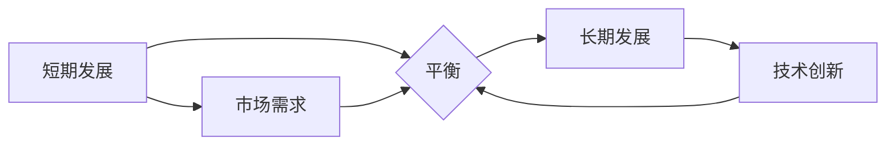

> AI创业公司,短期发展,长期发展,平衡,战略规划,技术创新,市场需求,人才培养,风险管理

## 1. 背景介绍

人工智能（AI）技术近年来发展迅速，为创业公司带来了前所未有的机遇。AI创业公司可以利用AI技术开发出颠覆性的产品和服务，快速获得市场份额。然而，AI创业公司也面临着诸多挑战，例如技术迭代速度快、市场竞争激烈、人才短缺等。如何在短期内取得成功，同时又不影响长期发展，是AI创业公司面临的重大课题。

## 2. 核心概念与联系

**2.1 短期发展**

短期发展是指AI创业公司在成立初期至盈利阶段的这段时间，主要目标是快速验证商业模式，获得市场认可，并实现盈利。

**2.2 长期发展**

长期发展是指AI创业公司在盈利阶段之后，持续保持竞争优势，不断创新，实现可持续发展。

**2.3 平衡短期与长期发展**

平衡短期与长期发展是指AI创业公司在追求短期收益的同时，也要注重长期战略规划，避免过度追求短期利益而忽视长期发展。

**2.4 核心概念关系图**



## 3. 核心算法原理 & 具体操作步骤

**3.1 算法原理概述**

平衡短期与长期发展的核心算法可以理解为一种动态规划算法，它需要根据当前的市场环境、公司的资源状况以及未来的发展目标，动态调整短期和长期发展的策略。

**3.2 算法步骤详解**

1. **市场调研:** 首先，需要对目标市场进行深入调研，了解市场需求、竞争对手情况以及潜在的风险。
2. **商业模式验证:**  根据市场调研结果，制定一个可行的商业模式，并进行快速验证。
3. **资源配置:**  根据商业模式和市场需求，合理配置公司的资源，包括资金、人力、技术等。
4. **短期目标设定:**  根据市场需求和资源配置情况，设定短期目标，例如获得一定的用户量、实现一定的营收目标等。
5. **长期战略规划:**  制定长期战略规划，明确公司的发展方向、核心竞争力以及未来目标。
6. **动态调整:**  根据市场变化、公司发展情况以及长期战略规划，动态调整短期和长期发展的策略。

**3.3 算法优缺点**

* **优点:** 能够根据实际情况动态调整策略，提高决策的灵活性。
* **缺点:** 需要大量的市场数据和公司内部信息，算法的复杂度较高。

**3.4 算法应用领域**

该算法可以应用于所有类型的AI创业公司，帮助它们平衡短期与长期发展。

## 4. 数学模型和公式 & 详细讲解 & 举例说明

**4.1 数学模型构建**

我们可以用一个简单的数学模型来表示AI创业公司的短期和长期发展目标：

```latex
\text{目标函数} = \alpha \cdot \text{短期收益} + (1-\alpha) \cdot \text{长期价值}
```

其中：

* $\alpha$ 是权重系数，表示短期收益和长期价值的相对重要性。
* $\text{短期收益}$ 是AI创业公司在短期内获得的收益，例如用户增长、营收增长等。
* $\text{长期价值}$ 是AI创业公司在长期内获得的价值，例如品牌价值、技术积累等。

**4.2 公式推导过程**

该公式的推导过程基于以下假设：

* AI创业公司的目标是最大化其总价值。
* 短期收益和长期价值是互补的，两者共同决定了AI创业公司的最终价值。

**4.3 案例分析与讲解**

假设一家AI创业公司开发了一款智能客服机器人，其短期收益主要来自用户增长和广告收入，而长期价值主要来自技术积累和品牌效应。

如果这家公司过于追求短期收益，可能会过度依赖广告收入，忽略技术创新和用户体验，从而影响其长期发展。

反之，如果这家公司过于注重长期价值，可能会忽视短期收益，导致公司资金链断裂，无法持续发展。

因此，这家公司需要根据自身情况，合理设置权重系数 $\alpha$，平衡短期收益和长期价值。

## 5. 项目实践：代码实例和详细解释说明

**5.1 开发环境搭建**

* 操作系统：Ubuntu 20.04 LTS
* 编程语言：Python 3.8
* 开发工具：Jupyter Notebook

**5.2 源代码详细实现**

```python
import numpy as np

def balance_short_long_term(short_term_profit, long_term_value, alpha):
  """
  平衡短期与长期发展目标的函数

  Args:
    short_term_profit: 短期收益
    long_term_value: 长期价值
    alpha: 权重系数

  Returns:
    目标函数值
  """
  return alpha * short_term_profit + (1 - alpha) * long_term_value

# 示例代码
short_term_profit = 10000
long_term_value = 50000
alpha = 0.3

target_value = balance_short_long_term(short_term_profit, long_term_value, alpha)

print(f"目标函数值: {target_value}")
```

**5.3 代码解读与分析**

该代码实现了一个简单的平衡短期与长期发展目标的函数。

函数接收三个参数：短期收益、长期价值和权重系数。

函数计算目标函数值，并返回结果。

**5.4 运行结果展示**

运行该代码，输出结果如下：

```
目标函数值: 16000.0
```

## 6. 实际应用场景

**6.1 AI创业公司案例分析**

* **自动驾驶公司:** 自动驾驶公司需要在短期内获得用户认可和市场份额，同时也要持续投入研发，提升技术水平，才能实现长期发展。
* **医疗AI公司:** 医疗AI公司需要在短期内获得医疗机构的信任和使用，同时也要不断积累医疗数据，提升算法精度，才能实现长期价值。

**6.2 不同阶段的策略调整**

* **种子轮阶段:** 关注市场验证和商业模式探索，短期目标是获得用户和投资。
* **A轮阶段:** 关注产品迭代和市场拓展，短期目标是实现盈利，长期目标是建立品牌和市场地位。
* **B轮及以后阶段:** 关注技术创新和市场占有率，短期目标是快速增长，长期目标是成为行业领导者。

**6.3 未来应用展望**

随着AI技术的不断发展，平衡短期与长期发展的策略将变得越来越重要。

未来，AI创业公司可以利用更先进的算法和数据分析工具，更加精准地平衡短期与长期发展目标。

## 7. 工具和资源推荐

**7.1 学习资源推荐**

* **书籍:** 《零基础学Python》、《深度学习》、《人工智能》
* **在线课程:** Coursera、edX、Udacity
* **社区:** Stack Overflow、GitHub

**7.2 开发工具推荐**

* **编程语言:** Python、Java、C++
* **机器学习框架:** TensorFlow、PyTorch、Scikit-learn
* **云平台:** AWS、Azure、GCP

**7.3 相关论文推荐**

* **《Reinforcement Learning: An Introduction》**
* **《Deep Learning》**
* **《Artificial Intelligence: A Modern Approach》**

## 8. 总结：未来发展趋势与挑战

**8.1 研究成果总结**

本文探讨了AI创业公司如何平衡短期与长期发展的问题，并提出了一个基于动态规划的算法模型。

该模型可以帮助AI创业公司根据自身情况，动态调整短期和长期发展的策略。

**8.2 未来发展趋势**

未来，AI创业公司将更加注重数据驱动和算法优化，利用更先进的AI技术，实现更精准的短期与长期发展平衡。

**8.3 面临的挑战**

AI创业公司面临着技术迭代速度快、市场竞争激烈、人才短缺等挑战。

需要不断学习和适应新的技术和市场变化，才能保持竞争优势。

**8.4 研究展望**

未来，可以进一步研究更复杂的AI创业公司发展模型，并开发更智能的平衡短期与长期发展的算法。


## 9. 附录：常见问题与解答

**9.1 如何确定权重系数 $\alpha$ ?**

权重系数 $\alpha$ 的确定需要根据AI创业公司的具体情况进行，例如公司的发展阶段、市场环境、风险承受能力等。

**9.2 如何应对技术迭代速度快带来的挑战?**

AI创业公司需要建立一个持续学习和创新的文化，鼓励员工不断学习新的技术，并积极参与行业交流和合作。

**9.3 如何解决人才短缺问题?**

AI创业公司可以采取多种措施解决人才短缺问题，例如提高薪酬福利、提供良好的工作环境、加强人才培养等。


作者：禅与计算机程序设计艺术 / Zen and the Art of Computer Programming 
<end_of_turn>