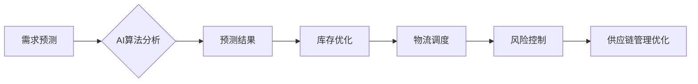

> AI, 供应链管理, 优化, 机器学习, 深度学习, 预见性分析, 预测模型

## 1. 背景介绍

在当今全球化经济的快速发展下，供应链管理已成为企业核心竞争力的关键因素。传统的供应链管理模式往往面临着信息不对称、预测精度低、响应速度慢等问题，难以适应市场需求的快速变化和复杂性。而人工智能（AI）技术的快速发展为供应链管理带来了新的机遇和挑战。

AI技术能够通过对海量数据的分析和学习，实现对供应链各个环节的智能化管理，例如需求预测、库存优化、物流调度、风险控制等。AI驱动的供应链管理能够显著提高效率、降低成本、提升客户满意度，为企业带来更大的竞争优势。

## 2. 核心概念与联系

**2.1 供应链管理概述**

供应链管理是指企业从原材料采购到最终产品交付的全过程管理，涉及到多个环节和参与方，包括供应商、制造商、分销商、零售商等。

**2.2 AI技术在供应链管理中的应用**

AI技术在供应链管理中的应用主要包括以下几个方面：

* **需求预测:** 利用机器学习算法分析历史销售数据、市场趋势等信息，预测未来需求，帮助企业优化库存管理和生产计划。
* **库存优化:** 通过AI算法分析库存数据、销售数据、供应商信息等，优化库存水平，减少库存积压和缺货风险。
* **物流调度:** 利用AI算法优化运输路线、车辆调度、仓储管理等，提高物流效率和降低物流成本。
* **风险控制:** 通过AI算法分析市场风险、供应链风险等信息，识别潜在风险，并采取措施进行风险控制。

**2.3 AI技术与供应链管理的关联**

AI技术为供应链管理提供了强大的工具和手段，能够帮助企业实现以下目标：

* **提高效率:** 自动化流程、优化决策，提高供应链运营效率。
* **降低成本:** 优化库存、物流、生产等环节，降低供应链运营成本。
* **提升客户满意度:** 准确预测需求、及时交付产品，提升客户满意度。
* **增强竞争力:** 通过供应链管理的优化，提升企业核心竞争力。

**2.4 Mermaid 流程图**



## 3. 核心算法原理 & 具体操作步骤

**3.1 算法原理概述**

在AI驱动的供应链管理中，常用的算法包括机器学习、深度学习、强化学习等。

* **机器学习:** 通过训练模型，从数据中学习规律，进行预测和分类。
* **深度学习:** 利用多层神经网络，对复杂数据进行更深入的学习和分析。
* **强化学习:** 通过试错学习，找到最优的决策策略。

**3.2 算法步骤详解**

以需求预测为例，其算法步骤如下：

1. **数据收集:** 收集历史销售数据、市场趋势数据、季节性数据等相关信息。
2. **数据预处理:** 对数据进行清洗、转换、特征工程等处理，使其适合模型训练。
3. **模型选择:** 根据数据特点和预测目标，选择合适的机器学习模型，例如线性回归、决策树、支持向量机等。
4. **模型训练:** 利用训练数据，训练模型参数，使其能够准确预测未来需求。
5. **模型评估:** 利用测试数据，评估模型的预测精度，并进行模型调优。
6. **模型部署:** 将训练好的模型部署到生产环境中，用于实时预测未来需求。

**3.3 算法优缺点**

不同的算法具有不同的优缺点，需要根据实际情况选择合适的算法。

* **机器学习:** 优点：易于理解和实现，训练速度快；缺点：对数据质量要求高，难以处理复杂数据。
* **深度学习:** 优点：能够处理复杂数据，预测精度高；缺点：训练时间长，对计算资源要求高。
* **强化学习:** 优点：能够学习最优决策策略；缺点：训练难度高，需要大量的试错数据。

**3.4 算法应用领域**

AI算法在供应链管理中的应用领域非常广泛，例如：

* **需求预测:** 预测产品需求、库存需求、物流需求等。
* **库存优化:** 优化库存水平、库存布局、库存管理策略等。
* **物流调度:** 优化运输路线、车辆调度、仓储管理等。
* **风险控制:** 识别供应链风险、预测风险发生概率、制定风险应对策略等。

## 4. 数学模型和公式 & 详细讲解 & 举例说明

**4.1 数学模型构建**

在AI驱动的供应链管理中，常用的数学模型包括线性规划模型、整数规划模型、随机规划模型等。

**4.2 公式推导过程**

以库存优化为例，其数学模型可以表示为：

```latex
min \sum_{i=1}^{n} h_i x_i + \sum_{i=1}^{n} p_i (1-y_i)
```

其中：

* $h_i$：库存持有成本
* $x_i$：库存量
* $p_i$：缺货成本
* $y_i$：缺货概率

**4.3 案例分析与讲解**

假设一家公司需要对两种产品进行库存优化，产品A的库存持有成本为10元/单位，缺货成本为20元/单位；产品B的库存持有成本为5元/单位，缺货成本为10元/单位。

通过构建上述数学模型，并利用线性规划算法进行求解，可以得到最优的库存量和缺货概率，从而实现库存成本的最小化。

## 5. 项目实践：代码实例和详细解释说明

**5.1 开发环境搭建**

* 操作系统：Windows/Linux/macOS
* Python版本：3.6+
* 必要的库：pandas, numpy, scikit-learn, TensorFlow等

**5.2 源代码详细实现**

```python
import pandas as pd
from sklearn.linear_model import LinearRegression

# 数据加载
data = pd.read_csv('demand_data.csv')

# 数据预处理
X = data[['month', 'season', 'promotion']]
y = data['demand']

# 模型训练
model = LinearRegression()
model.fit(X, y)

# 模型预测
future_demand = model.predict(pd.DataFrame({'month': [12], 'season': ['winter'], 'promotion': [True]}))

# 结果展示
print(f'未来需求预测值: {future_demand[0]}')
```

**5.3 代码解读与分析**

* 代码首先加载数据，并进行数据预处理，将特征数据和目标数据分离。
* 然后，使用线性回归模型进行模型训练，训练模型参数。
* 最后，利用训练好的模型对未来数据进行预测，并输出预测结果。

**5.4 运行结果展示**

运行代码后，将输出未来需求预测值。

## 6. 实际应用场景

**6.1 需求预测**

AI驱动的需求预测可以帮助企业准确预测未来产品需求，从而优化库存管理、生产计划和物流调度。

**6.2 库存优化**

AI算法可以帮助企业优化库存水平，减少库存积压和缺货风险，降低库存成本。

**6.3 物流调度**

AI驱动的物流调度可以优化运输路线、车辆调度、仓储管理等，提高物流效率和降低物流成本。

**6.4 风险控制**

AI算法可以帮助企业识别供应链风险、预测风险发生概率、制定风险应对策略，降低供应链风险。

**6.5 未来应用展望**

随着AI技术的不断发展，其在供应链管理中的应用将更加广泛和深入，例如：

* **个性化供应链:** 根据客户需求，提供个性化的产品和服务。
* **智能化供应链:** 利用AI技术实现供应链的自动化和智能化管理。
* **可持续供应链:** 利用AI技术提高供应链的效率和可持续性。

## 7. 工具和资源推荐

**7.1 学习资源推荐**

* **书籍:**
    * 《人工智能：一种现代方法》
    * 《深度学习》
    * 《机器学习实战》
* **在线课程:**
    * Coursera: AI for Everyone
    * edX: Artificial Intelligence
    * Udacity: Machine Learning Engineer Nanodegree

**7.2 开发工具推荐**

* **Python:** 广泛应用于AI开发，拥有丰富的库和工具。
* **TensorFlow:** 开源深度学习框架，用于构建和训练深度学习模型。
* **PyTorch:** 开源深度学习框架，灵活易用，适合研究和开发。

**7.3 相关论文推荐**

* **《Recurrent Neural Networks for Sequence Modeling》**
* **《Attention Is All You Need》**
* **《Generative Adversarial Networks》**

## 8. 总结：未来发展趋势与挑战

**8.1 研究成果总结**

AI技术在供应链管理领域的应用取得了显著成果，例如提高了预测精度、优化了库存管理、降低了物流成本等。

**8.2 未来发展趋势**

未来，AI技术在供应链管理领域的应用将更加深入和广泛，例如：

* **更精准的预测:** 利用更先进的算法和更丰富的数据，实现更精准的需求预测。
* **更智能的决策:** 利用AI技术辅助决策，实现更智能的供应链管理。
* **更可持续的供应链:** 利用AI技术提高供应链的效率和可持续性。

**8.3 面临的挑战**

AI技术在供应链管理领域的应用也面临着一些挑战，例如：

* **数据质量问题:** AI算法对数据质量要求高，数据不完整、不准确会影响模型性能。
* **算法解释性问题:** 一些AI算法的决策过程难以解释，难以获得用户的信任。
* **伦理问题:** AI技术在供应链管理中的应用可能引发一些伦理问题，例如数据隐私、算法偏见等。

**8.4 研究展望**

未来，需要进一步研究解决上述挑战，例如：

* 开发更鲁棒的AI算法，能够处理不完整、不准确的数据。
* 研究AI算法的解释性，提高算法的可解释性和可信度。
* 探索AI技术在供应链管理中的伦理问题，制定相应的规范和制度。

## 9. 附录：常见问题与解答

**9.1 如何选择合适的AI算法？**

选择合适的AI算法需要根据具体应用场景和数据特点进行选择。例如，对于预测连续数值数据，可以使用线性回归、支持向量机等算法；对于分类问题，可以使用决策树、随机森林等算法。

**9.2 如何处理数据质量问题？**

数据质量问题是AI算法应用中的常见问题，需要采取以下措施进行处理：

* 数据清洗：删除重复数据、缺失数据等。
* 数据转换：将数据转换为适合模型训练的格式。
* 数据特征工程：提取数据中的特征，提高模型性能。

**9.3 如何评估AI模型的性能？**

常用的AI模型性能评估指标包括准确率、召回率、F1-score等。

作者：禅与计算机程序设计艺术 / Zen and the Art of Computer Programming


<end_of_turn>