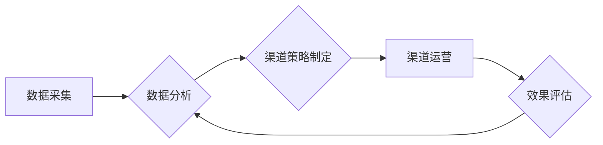

> AI创业公司, 渠道管理, 策略, 市场营销, 客户获取, 生态系统, 数据驱动, 运营效率

## 1. 背景介绍

在人工智能（AI）技术蓬勃发展的时代，AI创业公司应运而生，涌现出众多创新产品和服务。然而，AI创业公司面临着独特的挑战，其中之一就是如何有效地管理渠道，将产品和服务推向目标用户。传统的渠道管理模式难以适应AI创业公司的快速发展和个性化需求，因此，需要探索新的渠道管理策略，以帮助AI创业公司实现可持续发展。

## 2. 核心概念与联系

**2.1 渠道管理概述**

渠道管理是指企业通过建立和管理一系列的合作伙伴关系，将产品或服务从生产者传递到最终消费者，实现价值创造和价值传递的过程。

**2.2 AI创业公司渠道管理特点**

* **技术驱动:** AI创业公司的产品和服务基于先进的AI技术，需要通过技术平台和数据驱动的方式进行渠道管理。
* **用户个性化:** AI技术可以根据用户的需求和行为进行个性化推荐和服务，因此渠道管理需要更加注重用户体验和精准营销。
* **生态系统建设:** AI创业公司需要与其他企业、机构和个人建立合作关系，构建一个完整的AI生态系统，以实现资源共享和协同发展。

**2.3 渠道管理策略**

AI创业公司渠道管理策略应遵循以下原则：

* **数据驱动:** 利用数据分析和预测模型，了解用户需求和渠道效果，优化渠道策略。
* **生态合作:** 建立合作伙伴关系，构建AI生态系统，共享资源和协同发展。
* **用户体验:** 注重用户体验，提供个性化服务和便捷的渠道入口。
* **持续优化:** 不断监测和评估渠道效果，及时调整策略，提升运营效率。

**2.4 渠道管理架构**



## 3. 核心算法原理 & 具体操作步骤

**3.1 算法原理概述**

AI创业公司渠道管理的核心算法通常涉及以下几个方面：

* **用户画像:** 利用机器学习算法，分析用户行为数据，构建用户画像，了解用户的兴趣、需求和偏好。
* **渠道推荐:** 基于用户画像和渠道数据，利用推荐算法，推荐最合适的渠道，提高用户触达率和转化率。
* **效果预测:** 利用时间序列分析和机器学习算法，预测渠道的效果，帮助企业优化资源分配和渠道策略。

**3.2 算法步骤详解**

**用户画像算法:**

1. 收集用户行为数据，包括用户浏览记录、购买记录、评论记录等。
2. 使用聚类算法，将用户按照相似度进行分组，构建用户画像。
3. 对每个用户画像，提取关键特征，例如年龄、性别、兴趣爱好、消费习惯等。

**渠道推荐算法:**

1. 收集渠道数据，包括渠道类型、用户数量、转化率、成本等。
2. 使用协同过滤算法或内容过滤算法，推荐最合适的渠道。
3. 根据用户画像和渠道数据，计算推荐得分，并排序推荐结果。

**效果预测算法:**

1. 收集渠道效果数据，包括点击率、转化率、成本等。
2. 使用时间序列分析或机器学习算法，预测未来渠道效果。
3. 根据预测结果，优化资源分配和渠道策略。

**3.3 算法优缺点**

**优点:**

* 数据驱动，决策更加科学和精准。
* 个性化推荐，提高用户体验和转化率。
* 持续优化，提升运营效率。

**缺点:**

* 需要大量的数据支持。
* 算法模型需要不断更新和改进。
* 数据隐私和安全需要得到保障。

**3.4 算法应用领域**

* 用户精准营销
* 渠道优化和管理
* 产品推荐和个性化服务
* 风险控制和欺诈检测

## 4. 数学模型和公式 & 详细讲解 & 举例说明

**4.1 数学模型构建**

假设我们有一个AI创业公司，其目标是通过渠道营销将产品推向目标用户。我们可以构建一个数学模型来描述渠道营销过程中的关键因素：

* **用户数量:** U
* **转化率:** T
* **成本:** C
* **收益:** R

我们可以用以下公式来表示渠道营销的收益：

$$R = U * T * P - C$$

其中，P表示产品的单价。

**4.2 公式推导过程**

* **用户数量:** U 可以通过市场调研、用户画像分析等方式获取。
* **转化率:** T 可以通过A/B测试、用户行为分析等方式进行优化。
* **成本:** C 包括渠道推广成本、人员成本、运营成本等。
* **收益:** R 是渠道营销带来的净利润。

**4.3 案例分析与讲解**

假设一个AI创业公司开发了一款智能语音助手产品，其单价为100元。通过市场调研，该公司估计目标用户数量为10000人，转化率为5%。渠道推广成本为5000元。

根据上述公式，我们可以计算出该公司的渠道营销收益：

$$R = 10000 * 0.05 * 100 - 5000 = 5000 - 5000 = 0$$

结果表明，该公司的渠道营销收益为0，这意味着该公司需要进一步优化渠道策略，提高转化率或降低成本，才能实现盈利。

## 5. 项目实践：代码实例和详细解释说明

**5.1 开发环境搭建**

* Python 3.x
* TensorFlow 或 PyTorch
* Jupyter Notebook

**5.2 源代码详细实现**

```python
# 用户画像算法
from sklearn.cluster import KMeans

# 用户行为数据
user_data = [
    [25, '男', '科技', '游戏'],
    [30, '女', '时尚', '购物'],
    [28, '男', '科技', '阅读'],
    [32, '女', '美食', '旅游'],
]

# 构建用户画像模型
kmeans = KMeans(n_clusters=2)
kmeans.fit(user_data)

# 获取用户画像
user_clusters = kmeans.labels_

# 渠道推荐算法
from sklearn.metrics.pairwise import cosine_similarity

# 渠道数据
channel_data = [
    ['科技', '游戏', 0.8],
    ['时尚', '购物', 0.6],
    ['科技', '阅读', 0.9],
    ['美食', '旅游', 0.7],
]

# 计算渠道相似度
channel_similarity = cosine_similarity(channel_data, user_data)

# 推荐渠道
recommended_channels = channel_data[channel_similarity.argmax()]

# 效果预测算法
from statsmodels.tsa.arima.model import ARIMA

# 渠道效果数据
channel_effect = [10, 12, 15, 18, 20]

# 构建ARIMA模型
model = ARIMA(channel_effect, order=(5, 1, 0))
model_fit = model.fit()

# 预测未来效果
future_effect = model_fit.predict(start=len(channel_effect), end=len(channel_effect)+4)

```

**5.3 代码解读与分析**

* 用户画像算法使用KMeans聚类算法，将用户按照相似度进行分组，构建用户画像。
* 渠道推荐算法使用余弦相似度计算渠道和用户的相似度，推荐最合适的渠道。
* 效果预测算法使用ARIMA模型预测未来渠道效果。

**5.4 运行结果展示**

运行上述代码，可以得到用户画像、推荐渠道和未来效果预测结果。

## 6. 实际应用场景

**6.1 AI创业公司渠道管理案例**

* **智能客服机器人:** AI创业公司可以利用智能客服机器人作为渠道，通过微信、QQ等平台与用户进行互动，提供产品信息和技术支持。
* **在线教育平台:** AI创业公司可以利用在线教育平台作为渠道，提供AI相关的课程和培训，吸引目标用户。
* **数据分析服务:** AI创业公司可以利用数据分析服务作为渠道，为企业提供数据分析和决策支持，帮助企业提高运营效率。

**6.2 渠道管理策略应用场景**

* **精准营销:** 利用用户画像和渠道数据，进行精准营销，提高用户触达率和转化率。
* **渠道优化:** 利用效果预测模型，优化渠道策略，提高运营效率。
* **生态合作:** 建立合作伙伴关系，构建AI生态系统，共享资源和协同发展。

**6.3 未来应用展望**

随着AI技术的不断发展，AI创业公司的渠道管理策略将更加智能化、个性化和自动化。

* **人工智能驱动的渠道管理平台:** 将整合各种渠道数据和AI算法，提供全面的渠道管理解决方案。
* **个性化渠道推荐:** 基于用户的行为数据和偏好，提供个性化的渠道推荐。
* **自动化的渠道运营:** 利用AI算法，自动完成渠道运营任务，例如广告投放、用户沟通等。

## 7. 工具和资源推荐

**7.1 学习资源推荐**

* **书籍:**
    * 《数据驱动营销》
    * 《AI营销》
    * 《渠道管理》
* **在线课程:**
    * Coursera: 数据分析与机器学习
    * Udemy: AI营销
* **博客和论坛:**
    * MarketingProfs
    * Search Engine Land

**7.2 开发工具推荐**

* **Python:** 数据分析、机器学习、人工智能开发
* **TensorFlow/PyTorch:** 深度学习框架
* **Jupyter Notebook:** 数据分析和代码开发环境

**7.3 相关论文推荐**

* **AI驱动的渠道管理策略研究**
* **基于机器学习的渠道推荐算法**
* **AI技术在渠道营销中的应用**

## 8. 总结：未来发展趋势与挑战

**8.1 研究成果总结**

本文探讨了AI创业公司渠道管理策略，介绍了核心概念、算法原理、代码实例和实际应用场景。

**8.2 未来发展趋势**

AI技术将进一步推动AI创业公司渠道管理的智能化、个性化和自动化。

**8.3 面临的挑战**

* 数据质量和隐私保护
* 算法模型的准确性和可靠性
* 人工智能伦理问题

**8.4 研究展望**

未来研究方向包括：

* 开发更精准的AI驱动的渠道管理平台
* 研究AI技术在渠道营销中的伦理问题
* 探索AI技术与其他技术（例如区块链技术）的融合应用

## 9. 附录：常见问题与解答

**9.1 如何构建用户画像？**

可以使用聚类算法、机器学习算法等方法，分析用户行为数据，构建用户画像。

**9.2 如何推荐合适的渠道？**

可以使用余弦相似度、协同过滤算法等方法，计算渠道和用户的相似度，推荐最合适的渠道。

**9.3 如何预测渠道效果？**

可以使用ARIMA模型、机器学习算法等方法，预测未来渠道效果。


作者：禅与计算机程序设计艺术 / Zen and the Art of Computer Programming 
<end_of_turn>