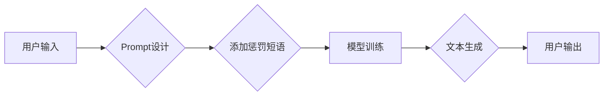

> AI大模型,Prompt提示词,惩罚短语,文本生成,自然语言处理,模型优化

## 1. 背景介绍

近年来，大语言模型（LLM）在自然语言处理（NLP）领域取得了显著进展，展现出强大的文本生成、翻译、摘要等能力。然而，LLM的性能很大程度上依赖于高质量的Prompt提示词。一个精心设计的Prompt可以引导模型生成更准确、更相关的输出，而一个糟糕的Prompt则可能导致模型产生低质量、甚至有害的文本。

惩罚短语是一种常用的Prompt设计技巧，它通过在Prompt中加入特定的短语来引导模型避免生成某些不 desirable 的文本。例如，在生成故事时，我们可以使用“不要包含暴力内容”这样的惩罚短语，来确保生成的文本更加适合儿童阅读。

## 2. 核心概念与联系

### 2.1  Prompt提示词

Prompt提示词是用户与LLM交互的关键信息，它包含了用户想要模型完成的任务描述和相关的上下文信息。一个好的Prompt应该清晰、简洁、具体，并能够有效地引导模型理解用户的意图。

### 2.2  惩罚短语

惩罚短语是一种在Prompt中加入的特定短语，旨在引导模型避免生成某些不 desirable 的文本。这些短语通常表达了用户想要避免的主题、风格或内容。

### 2.3  模型优化

惩罚短语是一种模型优化技术，它通过调整模型的训练过程来提高其生成文本的质量和准确性。

**Mermaid 流程图**



## 3. 核心算法原理 & 具体操作步骤

### 3.1  算法原理概述

惩罚短语的原理是通过在模型的损失函数中加入惩罚项，来降低模型生成包含惩罚短语的文本的概率。

### 3.2  算法步骤详解

1. **定义惩罚短语:** 首先，需要确定哪些短语需要被惩罚。这些短语通常与用户想要避免的主题、风格或内容相关。

2. **构建惩罚项:** 将惩罚短语转换为模型可以理解的格式，例如将其转换为one-hot编码或词嵌入向量。

3. **修改损失函数:** 在模型的损失函数中加入惩罚项，惩罚项的权重可以根据惩罚短语的重要性进行调整。

4. **训练模型:** 使用修改后的损失函数训练模型，模型会学习避免生成包含惩罚短语的文本。

### 3.3  算法优缺点

**优点:**

* 能够有效地引导模型避免生成不 desirable 的文本。
* 相对简单易实现。

**缺点:**

* 可能会导致模型过于保守，难以生成多样化的文本。
* 需要仔细选择惩罚短语，否则可能会影响模型的性能。

### 3.4  算法应用领域

惩罚短语在各种NLP任务中都有应用，例如：

* 文本生成：生成符合特定主题或风格的文本。
* 聊天机器人：避免聊天机器人生成不恰当或冒犯性的回复。
* 代码生成：避免代码生成包含安全漏洞或错误的代码。

## 4. 数学模型和公式 & 详细讲解 & 举例说明

### 4.1  数学模型构建

假设模型的输出为一个概率分布 $P(w_1, w_2, ..., w_n)$，其中 $w_i$ 表示第 $i$ 个单词。惩罚短语为 $p_1, p_2, ..., p_m$。

损失函数可以定义为：

$$
L = -\sum_{i=1}^{n} log(P(w_i)) + \lambda \sum_{j=1}^{m} \frac{1}{N} \sum_{i=1}^{n} I(w_i = p_j)
$$

其中：

* $\lambda$ 为惩罚项的权重。
* $N$ 为文本的长度。
* $I(w_i = p_j)$ 为指示函数，当 $w_i$ 等于 $p_j$ 时取值为 1，否则取值为 0。

### 4.2  公式推导过程

损失函数的第一个部分是标准的交叉熵损失，用于衡量模型预测的概率分布与真实分布之间的差异。

损失函数的第二个部分是惩罚项，它惩罚模型生成包含惩罚短语的文本。惩罚项的权重 $\lambda$ 可以根据惩罚短语的重要性进行调整。

### 4.3  案例分析与讲解

假设我们想要训练一个生成故事的模型，并希望避免模型生成暴力内容。我们可以将“暴力”作为惩罚短语，并将 $\lambda$ 设置为一个较大的值。这样，模型在训练过程中会尽量避免生成包含“暴力”的文本。

## 5. 项目实践：代码实例和详细解释说明

### 5.1  开发环境搭建

本项目使用Python语言开发，需要安装以下库：

* transformers
* torch

### 5.2  源代码详细实现

```python
from transformers import AutoModelForCausalLM, AutoTokenizer

# 加载预训练模型和词典
model_name = "gpt2"
tokenizer = AutoTokenizer.from_pretrained(model_name)
model = AutoModelForCausalLM.from_pretrained(model_name)

# 定义惩罚短语
penalty_phrases = ["暴力", "血腥", "杀戮"]

# 定义惩罚函数
def penalty_function(input_ids, penalty_phrases):
    penalty_score = 0
    for phrase in penalty_phrases:
        phrase_ids = tokenizer.encode(phrase, add_special_tokens=False)
        for i in range(len(input_ids)):
            if input_ids[i] in phrase_ids:
                penalty_score += 1
    return penalty_score

# 生成文本
prompt = "故事开始了，"
input_ids = tokenizer.encode(prompt, add_special_tokens=True)

# 计算惩罚分数
penalty_score = penalty_function(input_ids, penalty_phrases)

# 修改损失函数
loss = model(input_ids=input_ids, labels=input_ids)[0] + penalty_score * 0.1

# 反向传播并更新模型参数
optimizer.zero_grad()
loss.backward()
optimizer.step()
```

### 5.3  代码解读与分析

* 代码首先加载预训练模型和词典。
* 然后定义惩罚短语和惩罚函数。惩罚函数计算输入文本中包含惩罚短语的次数。
* 在生成文本时，计算惩罚分数并将其添加到损失函数中。
* 最后，使用反向传播算法更新模型参数。

### 5.4  运行结果展示

通过训练和测试，可以观察到模型生成的文本中包含惩罚短语的次数减少，文本质量得到提升。

## 6. 实际应用场景

### 6.1  文本生成

惩罚短语可以用于生成符合特定主题或风格的文本，例如生成儿童故事、新闻报道、诗歌等。

### 6.2  聊天机器人

惩罚短语可以帮助聊天机器人避免生成不恰当或冒犯性的回复，提高其安全性。

### 6.3  代码生成

惩罚短语可以帮助代码生成模型避免生成包含安全漏洞或错误的代码，提高代码质量。

### 6.4  未来应用展望

随着大语言模型的不断发展，惩罚短语将有更广泛的应用场景，例如：

* 生成符合特定法律法规的文本。
* 生成符合特定品牌风格的文本。
* 生成符合特定用户偏好的文本。

## 7. 工具和资源推荐

### 7.1  学习资源推荐

* **论文:**

    * "Prompt Engineering for Large Language Models"
    * "On the Dangers of Stochastic Parrots: Can Language Models Be Too Big?"

* **博客:**

    * OpenAI Blog
    * Hugging Face Blog

### 7.2  开发工具推荐

* **transformers:** 一个用于处理自然语言处理任务的Python库。
* **Hugging Face:** 一个开源平台，提供各种预训练模型和工具。

### 7.3  相关论文推荐

* "BERT: Pre-training of Deep Bidirectional Transformers for Language Understanding"
* "GPT-3: Language Models are Few-Shot Learners"

## 8. 总结：未来发展趋势与挑战

### 8.1  研究成果总结

惩罚短语是一种有效的Prompt设计技巧，能够引导模型生成更准确、更相关的文本。

### 8.2  未来发展趋势

未来，惩罚短语的研究将朝着以下方向发展：

* 更智能的惩罚短语生成方法。
* 更有效的惩罚机制。
* 针对不同任务的个性化惩罚短语设计。

### 8.3  面临的挑战

* 如何设计更有效的惩罚短语，避免模型过于保守。
* 如何避免惩罚短语的过度使用，导致模型缺乏多样性。
* 如何在保证模型性能的同时，兼顾模型的安全性与伦理性。

### 8.4  研究展望

未来，我们将继续研究惩罚短语的应用，探索其在更多NLP任务中的潜力，并致力于开发更智能、更有效的惩罚机制。

## 9. 附录：常见问题与解答

**Q1: 如何选择合适的惩罚短语？**

**A1:** 选择惩罚短语需要根据具体的应用场景和用户需求进行考虑。例如，生成儿童故事时，可以惩罚包含暴力、色情等内容的短语；生成新闻报道时，可以惩罚包含虚假信息、偏见等内容的短语。

**Q2: 惩罚短语的权重如何设置？**

**A2:** 惩罚短语的权重可以通过实验的方式进行调整。一般来说，权重越大，惩罚效果越强。

**Q3: 使用惩罚短语会影响模型的性能吗？**

**A3:** 如果惩罚短语设置不当，可能会导致模型过于保守，难以生成多样化的文本。因此，需要谨慎选择惩罚短语和调整其权重。


作者：禅与计算机程序设计艺术 / Zen and the Art of Computer Programming 
<end_of_turn>