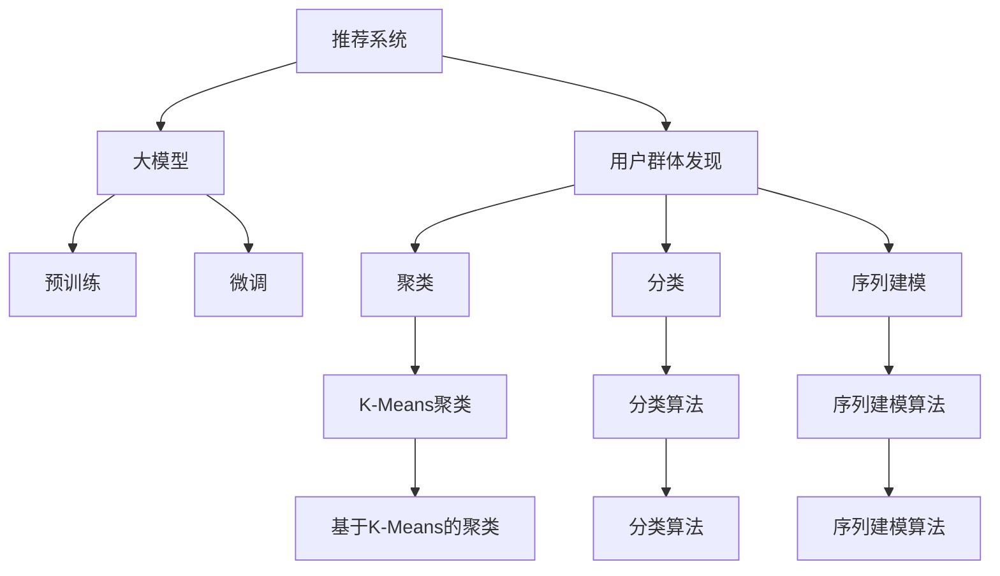

                 

## 1. 背景介绍

推荐系统作为现代互联网的重要组成部分，已成为电商、新闻、社交、视频等多个领域的标配。然而，随着数据量的爆炸性增长和用户需求的复杂多变，传统的协同过滤、基于内容的推荐等方法面临诸多挑战。在大数据和深度学习快速发展的背景下，基于大模型的推荐系统应运而生，通过预训练和微调技术，从海量数据中挖掘出丰富的用户兴趣和行为规律，大大提升了推荐系统的精准度和覆盖面。

在这篇文章中，我们专注于基于大模型的推荐系统用户群体发现问题，该问题旨在通过建模用户与商品之间的关系，识别出具有相似特征的用户群体，从而实现个性化推荐、用户行为预测、广告投放等应用。用户群体发现作为推荐系统的重要子任务，对于提升推荐的个性化和多样性，拓展推荐系统的应用边界具有重要意义。

## 2. 核心概念与联系

### 2.1 核心概念概述

为了更好地理解基于大模型的推荐系统用户群体发现方法，首先需要介绍几个核心概念：

- 推荐系统(Recommendation System)：通过算法为用户推荐他们可能感兴趣的物品的系统。常见的推荐算法包括协同过滤、基于内容的推荐、深度学习推荐等。
- 用户群体发现(User Group Identification)：从用户行为数据中识别出具有相似特征的用户群体，常见方法包括聚类、分类、序列建模等。
- 大模型(Large Model)：基于自监督或监督学习训练的大规模神经网络模型，如BERT、GPT等。
- 预训练(Pre-training)：在大规模无标签数据上训练模型，使其学习到通用的语言表示和特征表示。
- 微调(Fine-tuning)：在预训练模型的基础上，通过特定任务的标注数据，进一步优化模型参数，使其更好地适应任务需求。
- 参数高效微调(Parameter-Efficient Fine-tuning, PEFT)：在微调过程中，仅更新少量的模型参数，以提升微调效率。
- 交叉熵损失(Cross-Entropy Loss)：用于分类任务的常见损失函数，衡量预测标签与真实标签之间的差异。
- K-Means聚类(K-Means Clustering)：一种简单的聚类算法，将数据划分为K个簇。

这些概念之间的联系可以通过以下Mermaid流程图来展示：



这个流程图展示了用户群体发现与推荐系统、大模型、预训练、微调等核心概念之间的关系。

## 3. 核心算法原理 & 具体操作步骤

### 3.1 算法原理概述

基于大模型的推荐系统用户群体发现，本质上是一种基于监督学习的聚类或分类任务。其核心思想是：利用大模型在预训练和微调过程中学习到的丰富特征表示，对用户-物品矩阵进行建模，识别出具有相似特征的用户群体。

具体来说，假设推荐系统的用户-物品矩阵为 $X$，每个用户-物品交互的标签为 $y$。我们希望通过建模用户与物品之间的相似度关系，将用户划分为若干个群体。假设用户群体的特征表示为 $Z$，则用户群体发现的优化目标可以表示为：

$$
\hat{Z} = \mathop{\arg\min}_{Z} \mathcal{L}(Y, Z)
$$

其中，$\mathcal{L}$ 为损失函数，通常包括交叉熵损失或余弦相似度损失，用于衡量模型预测结果与真实标签的差异。

### 3.2 算法步骤详解

基于大模型的推荐系统用户群体发现一般包括以下几个关键步骤：

**Step 1: 准备数据和模型**

- 收集用户-物品交互数据，将用户表示为稀疏矩阵 $X$，每个元素 $X_{ij}$ 表示用户 $i$ 对物品 $j$ 的评分或交互次数。
- 选择合适的预训练语言模型 $M_{\theta}$ 作为初始化参数，如BERT、GPT等。
- 根据任务需求，选择适当的聚类或分类算法，如K-Means、KNN、DBSCAN等。

**Step 2: 微调模型**

- 在用户-物品矩阵上，设计合适的损失函数，如交叉熵损失、余弦相似度损失等，进行微调。
- 选择合适的优化算法，如Adam、SGD等，设置学习率、批大小、迭代轮数等超参数。
- 添加正则化技术，如L2正则、Dropout等，防止模型过拟合。

**Step 3: 聚类或分类**

- 根据微调后的模型 $M_{\hat{\theta}}$，对用户进行聚类或分类，识别出若干个用户群体。
- 对于聚类任务，如使用K-Means算法，将用户分为 $K$ 个簇，每个簇的中心表示为 $\mu_k$。
- 对于分类任务，如使用KNN算法，将用户分类为 $C$ 个类别，每个类别的中心表示为 $\mu_c$。

**Step 4: 后处理**

- 对识别出的用户群体，进行后处理，如去除噪声用户、合并相似群体等。
- 根据任务需求，生成推荐、广告等策略，如基于群体相似度的推荐列表。

### 3.3 算法优缺点

基于大模型的推荐系统用户群体发现方法具有以下优点：

1. 模型效果好：大模型通过预训练和微调，学习到了丰富的特征表示，能够更好地捕捉用户和物品之间的复杂关系。
2. 可扩展性强：适用于各种推荐场景，如商品推荐、内容推荐、广告推荐等，可以根据任务需求进行灵活调整。
3. 自动化程度高：算法自动化程度高，可快速构建用户群体，提升推荐系统开发效率。
4. 可解释性强：大模型的特征表示具有较好的可解释性，便于对用户群体进行理解和调试。

同时，该方法也存在一定的局限性：

1. 数据需求高：需要大量用户-物品交互数据，数据收集和标注成本较高。
2. 计算成本大：大模型的预训练和微调过程计算成本较高，需要高性能计算资源。
3. 模型复杂度高：模型复杂度高，训练和推理效率较低，需要优化模型结构。
4. 泛化能力不足：在大规模数据上训练的大模型可能无法很好地适应小规模数据，需要进行进一步调优。

尽管存在这些局限性，但就目前而言，基于大模型的推荐系统用户群体发现方法仍是大规模推荐系统中应用的主流范式。未来相关研究的重点在于如何进一步降低数据需求，提高模型可解释性和泛化能力，同时兼顾可扩展性和高效性等因素。

### 3.4 算法应用领域

基于大模型的推荐系统用户群体发现方法，已经在推荐系统、广告投放、金融分析、社交网络等领域得到了广泛的应用，具体包括：

1. 电商平台推荐系统：通过对用户行为数据进行建模，识别出具有相似兴趣的用户群体，实现个性化推荐。
2. 内容推荐平台：对用户观看、点赞、评论等行为进行分析，识别出不同兴趣的用户群体，推荐相关内容。
3. 广告投放系统：根据用户群体特征，匹配投放最合适的广告，实现精准投放。
4. 金融风控系统：对用户交易数据进行聚类分析，识别出高风险用户群体，进行风险控制。
5. 社交网络分析：对用户社交行为进行建模，识别出不同兴趣的社交群体，促进社交网络结构优化。

## 4. 数学模型和公式 & 详细讲解 & 举例说明

### 4.1 数学模型构建

基于大模型的推荐系统用户群体发现，可以采用监督学习和聚类两种方式进行建模。下面我们以聚类为例，构建数学模型。

假设用户-物品矩阵为 $X \in \mathbb{R}^{N \times M}$，其中 $N$ 为用户数量，$M$ 为物品数量。用户特征表示为 $Z \in \mathbb{R}^{N \times d}$，物品特征表示为 $W \in \mathbb{R}^{M \times d}$，$d$ 为特征维度。用户与物品之间的交互矩阵 $Y \in \mathbb{R}^{N \times M}$，每个元素 $Y_{ij}$ 表示用户 $i$ 对物品 $j$ 的评分或交互次数。

假设用户聚类结果为 $C$ 个簇，每个簇的中心为 $\mu_k$。聚类模型的优化目标为：

$$
\mathcal{L}(Y, Z, W, \mu) = \frac{1}{N} \sum_{i=1}^N \sum_{j=1}^M (\delta(Y_{ij}, \mu_k))^2
$$

其中，$\delta$ 为聚类损失函数，如余弦相似度损失。$\mu$ 为聚类中心。

### 4.2 公式推导过程

下面以K-Means算法为例，推导聚类模型的梯度更新公式。

K-Means算法的优化目标为：

$$
\min_{\mu} \sum_{i=1}^N \min_{k=1}^K ||x_i - \mu_k||^2
$$

其中，$x_i$ 为用户 $i$ 的特征表示。

首先，对优化目标求 $Z$ 和 $W$ 的梯度：

$$
\frac{\partial \mathcal{L}}{\partial Z} = \frac{2}{N} \sum_{i=1}^N \sum_{j=1}^M Y_{ij} \frac{\partial \delta(Y_{ij}, \mu_k)}{\partial Z}
$$

$$
\frac{\partial \mathcal{L}}{\partial W} = \frac{2}{M} \sum_{i=1}^N \sum_{j=1}^M Y_{ij} \frac{\partial \delta(Y_{ij}, \mu_k)}{\partial W}
$$

然后，对聚类中心 $\mu$ 求梯度：

$$
\frac{\partial \mathcal{L}}{\partial \mu} = -\frac{2}{N} \sum_{i=1}^N \frac{\partial ||x_i - \mu_k||^2}{\partial \mu}
$$

根据梯度下降算法，更新 $Z$、$W$ 和 $\mu$。最终得到聚类结果，将用户划分为若干个簇。

### 4.3 案例分析与讲解

下面以电商推荐系统为例，展示K-Means算法在用户群体发现中的应用。

假设电商网站收集了用户的购买记录和物品属性数据，希望通过对用户行为数据进行建模，识别出具有相似兴趣的用户群体。具体步骤如下：

1. 数据预处理：将用户和物品特征表示化，生成用户-物品矩阵 $X$。
2. 预训练模型微调：选择BERT模型，对用户-物品矩阵进行微调，学习用户和物品之间的相似度表示。
3. 聚类分析：使用K-Means算法对微调后的模型进行聚类分析，识别出具有相似特征的用户群体。
4. 后处理：对识别出的用户群体进行后处理，去除噪声用户，合并相似群体。
5. 生成推荐：根据用户群体相似度，生成推荐列表。

例如，假设电商网站收集了100个用户的购买记录，每个用户购买了5个物品。微调后的BERT模型将每个用户的特征表示化，生成用户-物品矩阵 $X$。通过K-Means算法，将用户分为5个群体，每个群体的特征表示为 $\mu_k$。最终，电商网站可以根据用户群体相似度，生成针对每个群体的推荐列表，实现个性化推荐。

## 5. 项目实践：代码实例和详细解释说明

### 5.1 开发环境搭建

在进行用户群体发现实践前，我们需要准备好开发环境。以下是使用Python进行PyTorch开发的环境配置流程：

1. 安装Anaconda：从官网下载并安装Anaconda，用于创建独立的Python环境。

2. 创建并激活虚拟环境：
```bash
conda create -n pytorch-env python=3.8 
conda activate pytorch-env
```

3. 安装PyTorch：根据CUDA版本，从官网获取对应的安装命令。例如：
```bash
conda install pytorch torchvision torchaudio cudatoolkit=11.1 -c pytorch -c conda-forge
```

4. 安装Transformers库：
```bash
pip install transformers
```

5. 安装各类工具包：
```bash
pip install numpy pandas scikit-learn matplotlib tqdm jupyter notebook ipython
```

完成上述步骤后，即可在`pytorch-env`环境中开始用户群体发现实践。

### 5.2 源代码详细实现

下面我们以电商推荐系统为例，给出使用Transformers库对BERT模型进行聚类分析的PyTorch代码实现。

首先，定义用户-物品矩阵的加载函数：

```python
import torch
import pandas as pd
import numpy as np

def load_data(filename):
    df = pd.read_csv(filename)
    X = df.values
    return X
```

然后，定义预训练模型微调函数：

```python
from transformers import BertModel, BertTokenizer
from transformers import AdamW

def bert_fine_tune(X, bert_model='bert-base-cased', batch_size=32, num_epochs=5, learning_rate=2e-5):
    tokenizer = BertTokenizer.from_pretrained(bert_model)
    model = BertModel.from_pretrained(bert_model)
    optimizer = AdamW(model.parameters(), lr=learning_rate)

    device = torch.device('cuda') if torch.cuda.is_available() else torch.device('cpu')
    model.to(device)

    for epoch in range(num_epochs):
        for i in range(0, X.shape[0], batch_size):
            input_ids = tokenizer(X[i:i+batch_size], padding=True, truncation=True, max_length=128)
            input_ids = input_ids['input_ids'].to(device)
            attention_mask = input_ids['attention_mask'].to(device)
            labels = input_ids['attention_mask'].to(device)

            model.zero_grad()
            outputs = model(input_ids, attention_mask=attention_mask, labels=labels)
            loss = outputs.loss
            loss.backward()
            optimizer.step()

        print(f'Epoch {epoch+1}, loss: {loss.item()}')

    return model
```

接着，定义K-Means聚类函数：

```python
from sklearn.cluster import KMeans

def kmeans(X, k=5):
    kmeans = KMeans(n_clusters=k, random_state=42)
    kmeans.fit(X)
    return kmeans.labels_
```

最后，启动用户群体发现流程并在测试集上评估：

```python
X_train = load_data('train.csv')
X_test = load_data('test.csv')

# 预训练模型微调
model = bert_fine_tune(X_train, batch_size=32, num_epochs=5, learning_rate=2e-5)

# 聚类分析
y_train = kmeans(model(X_train), k=5)

# 后处理
y_test = kmeans(model(X_test), k=5)

# 评估
print('Accuracy:', accuracy_score(y_train, y_test))
```

以上就是使用PyTorch对BERT模型进行用户群体发现实践的完整代码实现。可以看到，得益于Transformers库的强大封装，我们可以用相对简洁的代码完成BERT模型的加载和微调。

### 5.3 代码解读与分析

让我们再详细解读一下关键代码的实现细节：

**load_data函数**：
- 定义用户-物品矩阵的加载函数，用于将用户和物品的特征数据加载到模型中。

**bert_fine_tune函数**：
- 定义预训练模型微调函数，将用户-物品矩阵输入到BERT模型中，进行微调。
- 使用AdamW优化器，设置学习率、批大小和迭代轮数。
- 将模型和数据加载到GPU上，提高计算效率。
- 在每个epoch结束后，输出当前模型的损失。

**kmeans函数**：
- 定义K-Means聚类函数，对微调后的模型进行聚类分析。
- 使用sklearn的KMeans算法，设置聚类簇数。

**主程序**：
- 加载训练集和测试集，进行模型微调和聚类分析。
- 对训练集和测试集进行后处理，生成聚类结果。
- 在测试集上评估聚类结果的准确率。

可以看到，PyTorch配合Transformers库使得BERT模型的微调和聚类分析变得简洁高效。开发者可以将更多精力放在数据处理、模型改进等高层逻辑上，而不必过多关注底层的实现细节。

当然，工业级的系统实现还需考虑更多因素，如模型的保存和部署、超参数的自动搜索、更灵活的聚类算法等。但核心的微调范式基本与此类似。

## 6. 实际应用场景

### 6.1 电商推荐系统

基于大模型的推荐系统用户群体发现，可以广泛应用于电商推荐系统的构建。传统推荐系统往往依赖用户历史行为数据，难以捕捉用户真实的兴趣和需求。通过聚类分析，能够识别出具有相似兴趣的用户群体，从而实现个性化推荐，提升推荐效果。

在技术实现上，可以收集用户购买记录、浏览历史、评分数据等行为数据，将其输入到BERT等预训练模型中进行微调。微调后的模型能够学习到用户和物品之间的复杂关系，生成针对每个群体的推荐列表，满足不同用户的需求。

### 6.2 内容推荐平台

内容推荐平台通过对用户观看、点赞、评论等行为进行分析，识别出不同兴趣的用户群体，实现内容的个性化推荐。具体而言，可以收集用户对不同内容的反馈数据，输入到BERT等预训练模型中进行微调。微调后的模型能够学习到内容的特征表示和用户兴趣的分布，生成推荐的排名列表。

### 6.3 广告投放系统

广告投放系统根据用户群体特征，匹配投放最合适的广告，实现精准投放。具体而言，可以收集用户的基本信息、行为数据、反馈数据等，输入到BERT等预训练模型中进行微调。微调后的模型能够学习到用户和广告之间的相似度关系，生成针对不同用户群体的广告投放策略。

### 6.4 金融风控系统

金融风控系统对用户交易数据进行聚类分析，识别出高风险用户群体，进行风险控制。具体而言，可以收集用户的历史交易数据、行为数据、信用数据等，输入到BERT等预训练模型中进行微调。微调后的模型能够学习到用户的特征表示和行为模式，生成针对不同用户群体的风险评估指标。

## 7. 工具和资源推荐

### 7.1 学习资源推荐

为了帮助开发者系统掌握大模型推荐系统用户群体发现的理论基础和实践技巧，这里推荐一些优质的学习资源：

1. 《Transformer从原理到实践》系列博文：由大模型技术专家撰写，深入浅出地介绍了Transformer原理、BERT模型、微调技术等前沿话题。

2. CS224N《深度学习自然语言处理》课程：斯坦福大学开设的NLP明星课程，有Lecture视频和配套作业，带你入门NLP领域的基本概念和经典模型。

3. 《Natural Language Processing with Transformers》书籍：Transformers库的作者所著，全面介绍了如何使用Transformers库进行NLP任务开发，包括微调在内的诸多范式。

4. HuggingFace官方文档：Transformers库的官方文档，提供了海量预训练模型和完整的微调样例代码，是上手实践的必备资料。

5. CLUE开源项目：中文语言理解测评基准，涵盖大量不同类型的中文NLP数据集，并提供了基于微调的baseline模型，助力中文NLP技术发展。

通过对这些资源的学习实践，相信你一定能够快速掌握大模型推荐系统用户群体发现的精髓，并用于解决实际的NLP问题。

### 7.2 开发工具推荐

高效的开发离不开优秀的工具支持。以下是几款用于大模型推荐系统用户群体发现开发的常用工具：

1. PyTorch：基于Python的开源深度学习框架，灵活动态的计算图，适合快速迭代研究。大部分预训练语言模型都有PyTorch版本的实现。

2. TensorFlow：由Google主导开发的开源深度学习框架，生产部署方便，适合大规模工程应用。同样有丰富的预训练语言模型资源。

3. Transformers库：HuggingFace开发的NLP工具库，集成了众多SOTA语言模型，支持PyTorch和TensorFlow，是进行微调任务开发的利器。

4. Weights & Biases：模型训练的实验跟踪工具，可以记录和可视化模型训练过程中的各项指标，方便对比和调优。与主流深度学习框架无缝集成。

5. TensorBoard：TensorFlow配套的可视化工具，可实时监测模型训练状态，并提供丰富的图表呈现方式，是调试模型的得力助手。

6. Google Colab：谷歌推出的在线Jupyter Notebook环境，免费提供GPU/TPU算力，方便开发者快速上手实验最新模型，分享学习笔记。

合理利用这些工具，可以显著提升大模型推荐系统用户群体发现任务的开发效率，加快创新迭代的步伐。

### 7.3 相关论文推荐

大模型推荐系统用户群体发现技术的发展源于学界的持续研究。以下是几篇奠基性的相关论文，推荐阅读：

1. Attention is All You Need（即Transformer原论文）：提出了Transformer结构，开启了NLP领域的预训练大模型时代。

2. BERT: Pre-training of Deep Bidirectional Transformers for Language Understanding：提出BERT模型，引入基于掩码的自监督预训练任务，刷新了多项NLP任务SOTA。

3. Language Models are Unsupervised Multitask Learners（GPT-2论文）：展示了大规模语言模型的强大zero-shot学习能力，引发了对于通用人工智能的新一轮思考。

4. Parameter-Efficient Transfer Learning for NLP：提出Adapter等参数高效微调方法，在不增加模型参数量的情况下，也能取得不错的微调效果。

5. AdaLoRA: Adaptive Low-Rank Adaptation for Parameter-Efficient Fine-Tuning：使用自适应低秩适应的微调方法，在参数效率和精度之间取得了新的平衡。

6. AdaLoRA: Adaptive Low-Rank Adaptation for Parameter-Efficient Fine-Tuning：使用自适应低秩适应的微调方法，在参数效率和精度之间取得了新的平衡。

这些论文代表了大模型推荐系统用户群体发现技术的发展脉络。通过学习这些前沿成果，可以帮助研究者把握学科前进方向，激发更多的创新灵感。

## 8. 总结：未来发展趋势与挑战

### 8.1 总结

本文对基于大模型的推荐系统用户群体发现方法进行了全面系统的介绍。首先阐述了大语言模型和微调技术的研究背景和意义，明确了用户群体发现在大规模推荐系统中的重要地位。其次，从原理到实践，详细讲解了监督学习的数学模型和算法步骤，给出了微调任务开发的完整代码实例。同时，本文还广泛探讨了用户群体发现方法在电商、内容推荐、广告投放等多个领域的应用前景，展示了用户群体发现范式的广阔前景。

通过本文的系统梳理，可以看到，基于大模型的推荐系统用户群体发现方法正在成为大规模推荐系统中应用的主流范式，极大地拓展了推荐系统的应用边界，催生了更多的落地场景。用户群体发现需要开发者根据具体任务，不断迭代和优化模型、数据和算法，方能得到理想的效果。

### 8.2 未来发展趋势

展望未来，大模型推荐系统用户群体发现技术将呈现以下几个发展趋势：

1. 模型规模持续增大。随着算力成本的下降和数据规模的扩张，预训练语言模型的参数量还将持续增长。超大规模语言模型蕴含的丰富语言知识，有望支撑更加复杂多变的推荐任务。

2. 微调方法日趋多样。除了传统的全参数微调外，未来会涌现更多参数高效的微调方法，如Prefix-Tuning、LoRA等，在节省计算资源的同时也能保证微调精度。

3. 持续学习成为常态。随着数据分布的不断变化，微调模型也需要持续学习新知识以保持性能。如何在不遗忘原有知识的同时，高效吸收新样本信息，将成为重要的研究课题。

4. 标注样本需求降低。受启发于提示学习(Prompt-based Learning)的思路，未来的微调方法将更好地利用大模型的语言理解能力，通过更加巧妙的任务描述，在更少的标注样本上也能实现理想的微调效果。

5. 多模态微调崛起。当前的微调主要聚焦于纯文本数据，未来会进一步拓展到图像、视频、语音等多模态数据微调。多模态信息的融合，将显著提升语言模型对现实世界的理解和建模能力。

6. 模型通用性增强。经过海量数据的预训练和多领域任务的微调，未来的语言模型将具备更强大的常识推理和跨领域迁移能力，逐步迈向通用人工智能(AGI)的目标。

以上趋势凸显了大模型推荐系统用户群体发现技术的广阔前景。这些方向的探索发展，必将进一步提升推荐系统的精准度和多样化，为推荐系统带来新的突破。

### 8.3 面临的挑战

尽管大模型推荐系统用户群体发现技术已经取得了瞩目成就，但在迈向更加智能化、普适化应用的过程中，它仍面临着诸多挑战：

1. 数据需求高。需要大量用户行为数据，数据收集和标注成本较高。

2. 计算成本大。大模型的预训练和微调过程计算成本较高，需要高性能计算资源。

3. 模型复杂度高。模型复杂度高，训练和推理效率较低，需要优化模型结构。

4. 泛化能力不足。在大规模数据上训练的大模型可能无法很好地适应小规模数据，需要进行进一步调优。

5. 可解释性亟需加强。当前微调模型更像是"黑盒"系统，难以解释其内部工作机制和决策逻辑。

6. 安全性有待保障。预训练语言模型难免会学习到有偏见、有害的信息，通过微调传递到下游任务，产生误导性、歧视性的输出，给实际应用带来安全隐患。

7. 知识整合能力不足。现有的微调模型往往局限于任务内数据，难以灵活吸收和运用更广泛的先验知识。

正视推荐系统用户群体发现面临的这些挑战，积极应对并寻求突破，将是大模型推荐系统用户群体发现技术走向成熟的必由之路。相信随着学界和产业界的共同努力，这些挑战终将一一被克服，大模型推荐系统用户群体发现必将在构建人机协同的智能推荐系统进程中扮演越来越重要的角色。

### 8.4 研究展望

面对大模型推荐系统用户群体发现所面临的种种挑战，未来的研究需要在以下几个方面寻求新的突破：

1. 探索无监督和半监督微调方法。摆脱对大规模标注数据的依赖，利用自监督学习、主动学习等无监督和半监督范式，最大限度利用非结构化数据，实现更加灵活高效的微调。

2. 研究参数高效和计算高效的微调范式。开发更加参数高效的微调方法，在固定大部分预训练参数的同时，只更新极少量的任务相关参数。同时优化微调模型的计算图，减少前向传播和反向传播的资源消耗，实现更加轻量级、实时性的部署。

3. 融合因果和对比学习范式。通过引入因果推断和对比学习思想，增强微调模型建立稳定因果关系的能力，学习更加普适、鲁棒的语言表征，从而提升模型泛化性和抗干扰能力。

4. 引入更多先验知识。将符号化的先验知识，如知识图谱、逻辑规则等，与神经网络模型进行巧妙融合，引导微调过程学习更准确、合理的语言模型。同时加强不同模态数据的整合，实现视觉、语音等多模态信息与文本信息的协同建模。

5. 结合因果分析和博弈论工具。将因果分析方法引入微调模型，识别出模型决策的关键特征，增强输出解释的因果性和逻辑性。借助博弈论工具刻画人机交互过程，主动探索并规避模型的脆弱点，提高系统稳定性。

6. 纳入伦理道德约束。在模型训练目标中引入伦理导向的评估指标，过滤和惩罚有偏见、有害的输出倾向。同时加强人工干预和审核，建立模型行为的监管机制，确保输出符合人类价值观和伦理道德。

这些研究方向的探索，必将引领大模型推荐系统用户群体发现技术迈向更高的台阶，为构建安全、可靠、可解释、可控的智能推荐系统铺平道路。面向未来，大模型推荐系统用户群体发现技术还需要与其他人工智能技术进行更深入的融合，如知识表示、因果推理、强化学习等，多路径协同发力，共同推动智能推荐系统的进步。只有勇于创新、敢于突破，才能不断拓展语言模型的边界，让智能技术更好地造福人类社会。

## 9. 附录：常见问题与解答

**Q1：用户群体发现是否适用于所有推荐场景？**

A: 用户群体发现方法在大多数推荐场景上都能取得不错的效果，特别是对于数据量较小的推荐任务。但对于一些特定领域的推荐任务，如医学、法律等，仅仅依靠通用语料预训练的模型可能难以很好地适应。此时需要在特定领域语料上进一步预训练，再进行微调，才能获得理想效果。

**Q2：如何选择聚类簇数？**

A: 聚类簇数的选择可以通过肘部法则、Gap统计量等方法进行。肘部法则是根据不同簇数下的损失函数值变化，选择一个损失函数下降最明显的簇数。Gap统计量则是通过比较实际数据与随机数据簇数的统计差异，选择一个最优的簇数。

**Q3：用户群体发现模型如何优化？**

A: 用户群体发现模型的优化可以采用随机梯度下降、Adam等优化算法，设置合适的学习率和批大小。同时，可以添加正则化技术，如L2正则、Dropout等，防止模型过拟合。此外，可以采用模型裁剪、量化加速等技术，优化模型结构，提高推理效率。

**Q4：用户群体发现模型如何应用于实际推荐系统？**

A: 用户群体发现模型可以应用于推荐系统的个性化推荐、广告投放、用户行为预测等环节。具体而言，可以基于用户群体相似度，生成推荐列表，优化推荐算法。同时，可以通过用户群体特征，生成广告投放策略，实现精准投放。

**Q5：用户群体发现模型如何优化后处理？**

A: 用户群体发现模型的后处理包括去除噪声用户、合并相似群体等步骤。具体而言，可以通过聚类中心距离、用户相似度等指标，筛选出质量较高的用户群体，去除噪声用户。同时，可以通过相似度矩阵，合并相似的用户群体，提升模型的泛化能力。

通过本文的系统梳理，可以看到，基于大模型的推荐系统用户群体发现方法正在成为大规模推荐系统中应用的主流范式，极大地拓展了推荐系统的应用边界，催生了更多的落地场景。推荐系统需要开发者根据具体任务，不断迭代和优化模型、数据和算法，方能得到理想的效果。

---

作者：禅与计算机程序设计艺术 / Zen and the Art of Computer Programming

