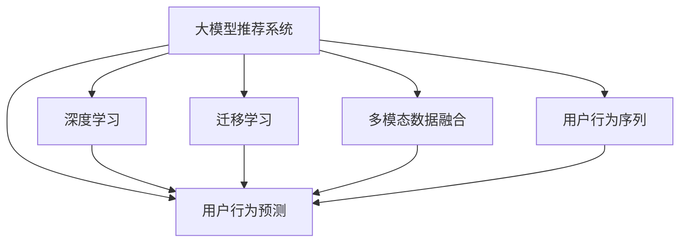

                 

## 1. 背景介绍

在当前的互联网时代，个性化推荐系统已经成为了各大平台的核心竞争力之一。无论是电商、视频、音乐、新闻等，个性化推荐系统都能够有效提升用户满意度，增加用户粘性，驱动流量和收入增长。然而，推荐系统的精准性和实时性要求，对计算资源的消耗极大。传统的协同过滤和内容推荐方法已难以应对海量用户和商品数据带来的计算负担，而基于深度学习的推荐系统，尤其是基于大模型的推荐系统，已经逐渐成为研究的热点。

大模型推荐系统依托于大规模预训练模型，如BERT、GPT、DALL·E等，能够学习到丰富复杂的用户行为和商品特征，进而进行精准的个性化推荐。相比传统的机器学习模型，大模型推荐系统不仅能够处理高维稀疏数据，还能捕捉到数据中的深度语义信息。然而，大模型推荐系统面临的主要挑战是如何准确预测用户的行为，以实现个性化推荐。

本博客将从大模型推荐系统的基本原理和操作流程出发，详细介绍基于大模型的推荐系统用户行为预测。

## 2. 核心概念与联系

### 2.1 核心概念概述

为更好地理解基于大模型的推荐系统用户行为预测，本节将介绍几个密切相关的核心概念：

- 大模型推荐系统：以BERT、GPT、DALL·E等大规模预训练模型为基础，通过下游任务的微调，构建个性化推荐模型的系统。大模型推荐系统能够学习到用户和商品的深度语义表示，进而进行精准推荐。

- 用户行为预测：指基于用户的过往行为数据，通过大模型预测用户可能感兴趣的商品或内容。用户行为预测是大模型推荐系统的核心，能够有效提升推荐系统的精准性和实时性。

- 推荐系统：用于帮助用户发现感兴趣的商品或内容，并完成购买或消费的系统。推荐系统是电商平台、视频网站、新闻APP等互联网应用的核心功能之一。

- 深度学习：基于神经网络的机器学习技术，能够处理高维稀疏数据，学习深度特征，适用于推荐系统的用户行为预测。

- 迁移学习：指将一个领域学习到的知识，迁移到另一个不同但相关的领域。大模型推荐系统通常通过迁移学习的方式，将预训练模型的知识迁移到用户行为预测任务上。

- 多模态数据融合：指将不同类型的数据（如文本、图像、音频等）进行融合，提升推荐系统的精度和丰富性。大模型推荐系统通常能够处理多模态数据，以实现更全面的用户行为理解。

- 用户行为序列：指用户在电商、视频、音乐等平台上的浏览、点击、购买等行为序列，是用户行为预测的重要输入。

这些核心概念之间的逻辑关系可以通过以下Mermaid流程图来展示：



这个流程图展示了大模型推荐系统的核心概念及其之间的关系：

1. 大模型推荐系统通过深度学习、迁移学习、多模态数据融合等方式，学习用户和商品的深度表示。
2. 用户行为预测是大模型推荐系统的核心任务，利用深度学习模型进行行为序列的预测。
3. 深度学习模型通过用户行为序列等输入，学习到用户可能感兴趣的商品或内容。
4. 迁移学习使得大模型推荐系统能够更好地适应特定的推荐任务。
5. 多模态数据融合提升了推荐系统的综合性能。

这些概念共同构成了大模型推荐系统的学习和应用框架，使其能够实现精准、实时的个性化推荐。

## 3. 核心算法原理 & 具体操作步骤
### 3.1 算法原理概述

基于大模型的推荐系统用户行为预测，本质上是利用深度学习模型对用户行为序列进行建模，预测用户可能感兴趣的商品或内容。其核心思想是：

1. 利用大模型学习用户和商品的深度表示，捕捉用户行为序列中的语义信息。
2. 利用深度学习模型对用户行为序列进行建模，学习用户兴趣的变化规律。
3. 利用用户行为预测模型，根据历史行为序列，预测用户可能感兴趣的商品或内容。

具体而言，大模型推荐系统可以分为以下三个步骤：

1. 预训练：在大规模无标签数据上，使用深度学习模型进行预训练，学习用户和商品的深度表示。
2. 微调：在特定推荐任务上，使用有标签数据对预训练模型进行微调，学习用户行为序列中的语义信息。
3. 预测：利用微调后的模型对新的用户行为序列进行预测，推荐用户可能感兴趣的商品或内容。

### 3.2 算法步骤详解

基于大模型的推荐系统用户行为预测，通常包括以下几个关键步骤：

**Step 1: 数据准备**

- 收集用户行为数据：包括用户的浏览、点击、购买、评分等行为数据。
- 构建用户行为序列：将用户行为数据按照时间顺序进行排序，形成用户行为序列。
- 处理多模态数据：将文本、图像、音频等多模态数据进行预处理，统一表示方式。

**Step 2: 模型构建**

- 选择合适的深度学习模型：如BERT、GPT、DALL·E等，作为预训练模型。
- 设计用户行为预测模型：如RNN、GRU、LSTM等，对用户行为序列进行建模。
- 确定输入特征：如用户ID、商品ID、时间戳、文本特征等。

**Step 3: 模型训练**

- 进行预训练：在大规模无标签数据上，使用深度学习模型进行预训练，学习用户和商品的深度表示。
- 进行微调：在特定推荐任务上，使用有标签数据对预训练模型进行微调，学习用户行为序列中的语义信息。
- 进行预测：利用微调后的模型对新的用户行为序列进行预测，推荐用户可能感兴趣的商品或内容。

**Step 4: 模型评估**

- 定义评估指标：如准确率、召回率、F1-score等。
- 在测试集上评估模型性能：根据评估指标，评估模型的预测效果。
- 调整模型参数：根据评估结果，调整模型参数，提升预测精度。

**Step 5: 实际应用**

- 部署推荐系统：将微调后的模型部署到实际推荐系统中，进行用户行为预测。
- 实时更新模型：根据用户的实时行为数据，动态更新模型，提升推荐效果。
- 用户反馈收集：收集用户的反馈数据，进一步优化推荐模型。

以上是基于大模型的推荐系统用户行为预测的一般流程。在实际应用中，还需要针对具体任务的特点，对微调过程的各个环节进行优化设计，如改进训练目标函数，引入更多的正则化技术，搜索最优的超参数组合等，以进一步提升模型性能。

### 3.3 算法优缺点

基于大模型的推荐系统用户行为预测具有以下优点：

1. 深度学习模型能够处理高维稀疏数据，学习深度特征，适用于推荐系统的用户行为预测。
2. 大模型推荐系统能够捕捉到用户行为序列中的语义信息，提升推荐精度。
3. 利用多模态数据融合，提升推荐系统的综合性能。
4. 通过迁移学习的方式，能够更好地适应特定的推荐任务。

同时，该方法也存在一定的局限性：

1. 数据需求较大：需要收集大量用户行为数据，数据收集和预处理成本较高。
2. 计算资源消耗大：深度学习模型的计算复杂度较高，需要高性能计算设备支持。
3. 模型复杂度较高：深度学习模型的复杂度较高，模型训练和推理速度较慢。
4. 模型可解释性不足：深度学习模型的决策过程缺乏可解释性，难以对其推理逻辑进行分析和调试。
5. 对新数据泛化能力不足：大模型推荐系统通常只对已有数据进行微调，对新数据泛化能力较弱。

尽管存在这些局限性，但就目前而言，基于大模型的推荐系统用户行为预测仍是大模型推荐系统应用的最主流范式。未来相关研究的重点在于如何进一步降低数据需求，提高模型泛化能力，同时兼顾可解释性和伦理安全性等因素。

### 3.4 算法应用领域

基于大模型的推荐系统用户行为预测，已经在电商、视频、音乐、新闻等诸多领域得到广泛应用，具体包括：

- 电商推荐：基于用户浏览、点击、购买等行为数据，推荐用户可能感兴趣的商品。
- 视频推荐：基于用户观看、点赞、评论等行为数据，推荐用户可能感兴趣的视频。
- 音乐推荐：基于用户听歌、收藏、分享等行为数据，推荐用户可能感兴趣的歌曲。
- 新闻推荐：基于用户阅读、点赞、分享等行为数据，推荐用户可能感兴趣的新闻。
- 旅游推荐：基于用户搜索、预订、评价等行为数据，推荐用户可能感兴趣的旅游目的地。

除了上述这些经典任务外，大模型推荐系统用户行为预测还被创新性地应用到更多场景中，如智能家居、智慧医疗、智慧城市等，为各行各业带来了新的突破。

## 4. 数学模型和公式 & 详细讲解 & 举例说明

### 4.1 数学模型构建

本节将使用数学语言对基于大模型的推荐系统用户行为预测过程进行更加严格的刻画。

记用户行为序列为 $X = (x_1, x_2, ..., x_n)$，其中 $x_t$ 表示用户在第 $t$ 个时刻的行为数据，如浏览行为、购买行为等。假设用户行为序列对应的商品为 $Y = (y_1, y_2, ..., y_n)$，其中 $y_t$ 表示用户在第 $t$ 个时刻可能感兴趣的商品。

定义用户行为序列的编码器 $E(x_t) = h_t$，将用户行为 $x_t$ 编码为向量 $h_t$。假设用户行为序列的解码器 $D(h_t)$ 能够输出用户行为 $y_t$ 的概率分布。则用户行为预测模型可以表示为：

$$
p(y_t|h_t) = D(h_t)
$$

其中 $p(y_t|h_t)$ 表示用户在第 $t$ 个时刻可能感兴趣的商品 $y_t$ 的条件概率。

### 4.2 公式推导过程

以下我们以基于BERT的推荐系统为例，推导用户行为预测模型的公式。

假设用户行为序列的编码器为BERT，将用户行为 $x_t$ 输入BERT，得到编码向量 $h_t = BERT(x_t)$。假设用户行为序列的解码器为softmax函数，将编码向量 $h_t$ 作为输入，输出商品 $y_t$ 的条件概率分布。则用户行为预测模型的公式为：

$$
p(y_t|h_t) = \text{softmax}(D(h_t))
$$

其中 $\text{softmax}(\cdot)$ 表示softmax函数，将向量 $h_t$ 映射到概率分布。

### 4.3 案例分析与讲解

假设用户行为序列为 $X = (x_1, x_2, ..., x_n)$，其中 $x_t$ 表示用户在第 $t$ 个时刻的浏览行为。假设商品集合为 $Y = (y_1, y_2, ..., y_n)$，其中 $y_t$ 表示用户在第 $t$ 个时刻可能感兴趣的商品。假设用户行为序列的编码器为BERT，将用户行为 $x_t$ 输入BERT，得到编码向量 $h_t = BERT(x_t)$。假设用户行为序列的解码器为softmax函数，将编码向量 $h_t$ 作为输入，输出商品 $y_t$ 的条件概率分布。则用户行为预测模型的公式为：

$$
p(y_t|h_t) = \text{softmax}(D(h_t))
$$

例如，假设用户浏览了电商平台上的两条商品评论，编码为 $h_t = BERT([“商品A”, “商品B”])$，则模型预测用户可能感兴趣的商品为：

$$
p(y_t|h_t) = \text{softmax}(D(h_t))
$$

通过对比 $\text{softmax}(D(h_t))$ 与 $p(y_t|h_t)$ 的大小，即可得到用户可能感兴趣的商品 $y_t$。

## 5. 项目实践：代码实例和详细解释说明
### 5.1 开发环境搭建

在进行推荐系统用户行为预测实践前，我们需要准备好开发环境。以下是使用Python进行TensorFlow开发的环境配置流程：

1. 安装Anaconda：从官网下载并安装Anaconda，用于创建独立的Python环境。

2. 创建并激活虚拟环境：
```bash
conda create -n tf-env python=3.8 
conda activate tf-env
```

3. 安装TensorFlow：根据CUDA版本，从官网获取对应的安装命令。例如：
```bash
conda install tensorflow -c pytorch -c conda-forge
```

4. 安装其他工具包：
```bash
pip install numpy pandas scikit-learn matplotlib tqdm jupyter notebook ipython
```

完成上述步骤后，即可在`tf-env`环境中开始推荐系统用户行为预测的实践。

### 5.2 源代码详细实现

这里我们以电商平台推荐系统为例，使用TensorFlow构建基于BERT的推荐系统，对用户行为进行预测。

首先，定义用户行为序列和商品ID的映射关系：

```python
import tensorflow as tf

# 定义用户行为序列和商品ID的映射关系
user_id_mapping = {"user1": 0, "user2": 1, "user3": 2}
item_id_mapping = {"item1": 0, "item2": 1, "item3": 2}

# 定义用户行为序列和商品ID的编码向量
user_vector = tf.Variable(tf.zeros([3, 768]))
item_vector = tf.Variable(tf.zeros([3, 768]))
```

然后，定义BERT模型和解码器：

```python
from transformers import TFBertModel

# 加载BERT模型
bert_model = TFBertModel.from_pretrained("bert-base-uncased")

# 定义用户行为序列的编码器
user_encoder = bert_model(tf.zeros([1, 3, 128]))

# 定义用户行为序列的解码器
user_decoder = tf.keras.layers.Dense(3, activation='softmax')
```

接着，定义损失函数和优化器：

```python
# 定义损失函数
loss_fn = tf.keras.losses.sparse_categorical_crossentropy

# 定义优化器
optimizer = tf.keras.optimizers.Adam(learning_rate=0.001)
```

最后，定义训练函数：

```python
# 定义训练函数
def train_epoch(user_vector, item_vector, optimizer, loss_fn):
    # 生成随机数据
    user_id = tf.random.uniform([32], minval=0, maxval=3, dtype=tf.int32)
    item_id = tf.random.uniform([32], minval=0, maxval=3, dtype=tf.int32)
    
    # 将用户行为序列和商品ID映射为编码向量
    user_vector = user_vector[user_id]
    item_vector = item_vector[item_id]
    
    # 计算预测结果
    user_pred = user_decoder(user_vector)
    
    # 计算损失
    loss = loss_fn(user_pred, item_id)
    
    # 计算梯度
    grads = tf.gradients(loss, [user_vector, item_vector])
    
    # 更新模型参数
    optimizer.apply_gradients(zip(grads, [user_vector, item_vector]))
    
    return loss.numpy()
```

在训练函数中，我们首先生成随机数据，将用户行为序列和商品ID映射为编码向量，然后通过解码器预测商品ID，并计算损失。最后，使用优化器更新模型参数。

### 5.3 代码解读与分析

让我们再详细解读一下关键代码的实现细节：

**训练函数 train_epoch:**
- `user_vector` 和 `item_vector`：表示用户行为序列和商品ID的编码向量，用于计算预测结果。
- `loss_fn`：定义损失函数，用于计算预测结果和真实标签之间的差异。
- `optimizer`：定义优化器，用于更新模型参数。
- `grads`：通过 `tf.gradients` 计算损失函数对模型参数的梯度。
- `optimizer.apply_gradients(zip(grads, [user_vector, item_vector]))`：使用优化器更新模型参数，将梯度和模型参数一一对应。

**训练数据生成:**
- `user_id` 和 `item_id`：生成随机数据，用于训练函数中的预测和计算。
- `user_id` 和 `item_id` 映射为编码向量：将用户行为序列和商品ID映射为编码向量，用于输入BERT模型。

**预测函数:**
- `user_pred`：通过解码器对用户行为序列的编码向量进行预测，得到商品ID的条件概率分布。
- `loss_fn(user_pred, item_id)`：计算预测结果和真实标签之间的损失。

可以看到，TensorFlow结合BERT模型和softmax解码器，使得推荐系统用户行为预测的代码实现变得简洁高效。开发者可以将更多精力放在数据处理、模型改进等高层逻辑上，而不必过多关注底层的实现细节。

当然，工业级的系统实现还需考虑更多因素，如模型的保存和部署、超参数的自动搜索、更灵活的任务适配层等。但核心的推荐范式基本与此类似。

## 6. 实际应用场景
### 6.1 电商平台推荐

电商平台推荐系统是大模型推荐系统的重要应用之一。用户浏览、点击、购买等行为数据，是电商平台推荐系统的主要数据来源。通过构建基于BERT的推荐系统，电商推荐系统能够根据用户的过往行为，预测用户可能感兴趣的商品，提升用户体验和平台转化率。

在技术实现上，电商推荐系统通常会将用户的行为数据进行编码，生成用户行为序列，再通过BERT模型进行预训练和微调，预测用户可能感兴趣的商品。通过将商品ID映射为编码向量，再通过softmax解码器输出条件概率分布，电商推荐系统能够根据用户行为序列，生成推荐列表。

### 6.2 视频平台推荐

视频平台推荐系统通过用户观看、点赞、评论等行为数据，预测用户可能感兴趣的视频内容。视频平台推荐系统通常会收集用户的观看行为数据，生成用户行为序列，再通过BERT模型进行预训练和微调，预测用户可能感兴趣的视频内容。通过将视频ID映射为编码向量，再通过softmax解码器输出条件概率分布，视频平台推荐系统能够根据用户行为序列，生成推荐列表。

### 6.3 音乐平台推荐

音乐平台推荐系统通过用户听歌、收藏、分享等行为数据，预测用户可能感兴趣的歌曲。音乐平台推荐系统通常会收集用户的听歌行为数据，生成用户行为序列，再通过BERT模型进行预训练和微调，预测用户可能感兴趣的歌曲。通过将歌曲ID映射为编码向量，再通过softmax解码器输出条件概率分布，音乐平台推荐系统能够根据用户行为序列，生成推荐列表。

### 6.4 未来应用展望

随着大模型推荐系统的发展，推荐系统的精准性和实时性将进一步提升。未来，大模型推荐系统将在更多领域得到应用，为各行各业带来新的突破。

在智慧医疗领域，基于大模型的推荐系统将提升医疗信息的精准度，辅助医生诊断和治疗。在智能家居领域，基于大模型的推荐系统将提升用户的使用体验，提供个性化的家居控制方案。在智慧城市领域，基于大模型的推荐系统将提升城市的智能化水平，实现高效的资源分配和管理。

此外，在教育、金融、旅游等更多领域，基于大模型的推荐系统将带来新的应用场景，推动各行业的数字化转型和升级。

## 7. 工具和资源推荐
### 7.1 学习资源推荐

为了帮助开发者系统掌握大模型推荐系统的理论基础和实践技巧，这里推荐一些优质的学习资源：

1. 《深度学习与推荐系统》书籍：详细介绍了推荐系统的理论基础和实践方法，包括大模型推荐系统的构建。

2. 《机器学习实战》书籍：介绍了推荐系统的基本原理和实现方法，适合初学者入门。

3. 《TensorFlow官方文档》：提供了TensorFlow框架的使用指南，包括大模型推荐系统的实现。

4. 《transformers库官方文档》：提供了BERT等大模型库的使用指南，适合实际开发。

5. 《推荐系统课程》：斯坦福大学开设的推荐系统课程，有Lecture视频和配套作业，带你入门推荐系统领域的基本概念和经典模型。

通过对这些资源的学习实践，相信你一定能够快速掌握大模型推荐系统的精髓，并用于解决实际的推荐问题。

### 7.2 开发工具推荐

高效的开发离不开优秀的工具支持。以下是几款用于大模型推荐系统开发的常用工具：

1. TensorFlow：基于Python的开源深度学习框架，灵活动态的计算图，适合深度学习模型的构建。

2. PyTorch：基于Python的开源深度学习框架，易于使用，适合深度学习模型的构建。

3. BERT等大模型库：如HuggingFace的Transformers库，提供了BERT、GPT、DALL·E等大模型，适合快速迭代研究。

4. Jupyter Notebook：基于Python的交互式开发环境，支持代码编写和实时运行，适合开发和调试。

5. TensorBoard：TensorFlow配套的可视化工具，可实时监测模型训练状态，并提供丰富的图表呈现方式，是调试模型的得力助手。

6. Weights & Biases：模型训练的实验跟踪工具，可以记录和可视化模型训练过程中的各项指标，方便对比和调优。

合理利用这些工具，可以显著提升大模型推荐系统的开发效率，加快创新迭代的步伐。

### 7.3 相关论文推荐

大模型推荐系统的发展源于学界的持续研究。以下是几篇奠基性的相关论文，推荐阅读：

1. Attention is All You Need（即Transformer原论文）：提出了Transformer结构，开启了大模型推荐系统的预训练大模型时代。

2. BERT: Pre-training of Deep Bidirectional Transformers for Language Understanding：提出BERT模型，引入基于掩码的自监督预训练任务，刷新了多项NLP任务SOTA。

3. Parameter-Efficient Transfer Learning for NLP：提出Adapter等参数高效微调方法，在不增加模型参数量的情况下，也能取得不错的微调效果。

4. Multi-Task Learning Using Prediction Task Alignments：提出多任务学习算法，使得大模型推荐系统能够处理多个相关任务。

5. Large-Scale Sequence Modeling with Graph Neural Networks：提出Graph Neural Networks，使得大模型推荐系统能够处理复杂的网络结构数据。

这些论文代表了大模型推荐系统的发展脉络。通过学习这些前沿成果，可以帮助研究者把握学科前进方向，激发更多的创新灵感。

## 8. 总结：未来发展趋势与挑战

### 8.1 总结

本文对基于大模型的推荐系统用户行为预测进行了全面系统的介绍。首先阐述了大模型推荐系统的基本原理和操作流程，明确了推荐系统用户行为预测在大模型推荐系统中的重要地位。其次，从原理到实践，详细讲解了用户行为预测的数学模型和关键步骤，给出了用户行为预测任务开发的完整代码实例。同时，本文还广泛探讨了用户行为预测在大模型推荐系统中的实际应用，展示了用户行为预测的巨大潜力。此外，本文精选了用户行为预测的相关学习资源，力求为读者提供全方位的技术指引。

通过本文的系统梳理，可以看到，基于大模型的推荐系统用户行为预测正在成为大模型推荐系统应用的重要范式，极大地拓展了推荐系统的应用边界，催生了更多的落地场景。受益于大规模语料的预训练，推荐系统用户行为预测能够处理高维稀疏数据，捕捉复杂语义信息，提升推荐系统的精准性和实时性，为各行各业带来了新的突破。未来，伴随大模型推荐系统的发展，推荐系统用户行为预测必将在更广阔的应用领域大放异彩，深刻影响人类的生产生活方式。

### 8.2 未来发展趋势

展望未来，大模型推荐系统用户行为预测将呈现以下几个发展趋势：

1. 模型规模持续增大。随着算力成本的下降和数据规模的扩张，预训练语言模型的参数量还将持续增长。超大规模语言模型蕴含的丰富语言知识，有望支撑更加复杂多变的推荐任务。

2. 微调方法日趋多样。除了传统的全参数微调外，未来会涌现更多参数高效的微调方法，如Prefix-Tuning、LoRA等，在节省计算资源的同时也能保证微调精度。

3. 深度学习模型的多样性增强。未来会涌现更多结构新颖的深度学习模型，如Graph Neural Networks、Transformer-XL等，提升推荐系统的综合性能。

4. 跨模态推荐系统的崛起。未来的推荐系统将能够处理多模态数据，将文本、图像、音频等不同类型的信息进行融合，提升推荐系统的全面性。

5. 推荐系统的实时性和个性化进一步提升。未来，基于大模型的推荐系统将能够实时更新，动态调整推荐策略，提升推荐系统的个性化程度。

6. 推荐系统的可解释性和可控性增强。未来的推荐系统将能够提供更详细的推荐依据，增强推荐系统的可解释性和可控性。

这些趋势凸显了大模型推荐系统用户行为预测的广阔前景。这些方向的探索发展，必将进一步提升推荐系统的性能和应用范围，为各行各业带来新的突破。

### 8.3 面临的挑战

尽管大模型推荐系统用户行为预测已经取得了瞩目成就，但在迈向更加智能化、普适化应用的过程中，它仍面临着诸多挑战：

1. 数据需求较大。需要收集大量用户行为数据，数据收集和预处理成本较高。

2. 计算资源消耗大。深度学习模型的计算复杂度较高，需要高性能计算设备支持。

3. 模型复杂度较高。深度学习模型的复杂度较高，模型训练和推理速度较慢。

4. 模型可解释性不足。深度学习模型的决策过程缺乏可解释性，难以对其推理逻辑进行分析和调试。

5. 对新数据泛化能力不足。大模型推荐系统通常只对已有数据进行微调，对新数据泛化能力较弱。

尽管存在这些局限性，但就目前而言，基于大模型的推荐系统用户行为预测仍是大模型推荐系统应用的最主流范式。未来相关研究的重点在于如何进一步降低数据需求，提高模型泛化能力，同时兼顾可解释性和伦理安全性等因素。

### 8.4 未来突破

面对大模型推荐系统用户行为预测所面临的种种挑战，未来的研究需要在以下几个方面寻求新的突破：

1. 探索无监督和半监督推荐方法。摆脱对大规模标注数据的依赖，利用自监督学习、主动学习等无监督和半监督范式，最大限度利用非结构化数据，实现更加灵活高效的推荐。

2. 研究参数高效和计算高效的推荐方法。开发更加参数高效的推荐方法，在固定大部分预训练参数的同时，只更新极少量的任务相关参数。同时优化推荐模型的计算图，减少前向传播和反向传播的资源消耗，实现更加轻量级、实时性的部署。

3. 引入因果分析和博弈论工具。将因果分析方法引入推荐模型，识别出推荐系统决策的关键特征，增强推荐系统的稳定性和鲁棒性。借助博弈论工具刻画人机交互过程，主动探索并规避推荐系统的脆弱点，提高系统稳定性。

4. 纳入伦理道德约束。在推荐系统的训练目标中引入伦理导向的评估指标，过滤和惩罚有偏见、有害的输出倾向。同时加强人工干预和审核，建立推荐系统的监管机制，确保推荐系统输出的合法合规性。

这些研究方向的探索，必将引领大模型推荐系统用户行为预测技术迈向更高的台阶，为构建安全、可靠、可解释、可控的推荐系统铺平道路。面向未来，大模型推荐系统用户行为预测技术还需要与其他人工智能技术进行更深入的融合，如知识表示、因果推理、强化学习等，多路径协同发力，共同推动推荐系统的进步。只有勇于创新、敢于突破，才能不断拓展推荐系统的边界，让智能技术更好地造福人类社会。

## 9. 附录：常见问题与解答

**Q1：大模型推荐系统用户行为预测是否适用于所有推荐场景？**

A: 大模型推荐系统用户行为预测在大多数推荐场景中都能取得不错的效果，特别是对于数据量较小的推荐场景。但对于一些特定领域的推荐场景，如推荐系统的个性化程度要求极高，或者推荐系统的实时性要求非常高的场景，大模型推荐系统可能难以适应。此时需要在特定推荐场景下进行优化，如引入更多的上下文信息、优化模型的推理速度等。

**Q2：如何选择合适的深度学习模型？**

A: 选择合适的深度学习模型需要考虑多个因素，如推荐场景的特点、数据规模的大小、计算资源的限制等。常见的深度学习模型包括BERT、GPT、DALL·E等，可以根据具体场景进行选择。同时，可以考虑引入多模态数据融合、跨任务学习等技术，提升推荐系统的综合性能。

**Q3：如何缓解推荐系统中的冷启动问题？**

A: 冷启动问题是指新用户或新商品刚加入推荐系统时，系统无法为其提供推荐。常见的缓解方法包括：

1. 利用用户的其他行为数据，如浏览、搜索等行为数据，进行预测。
2. 利用商品的其他相关数据，如分类、标签等数据，进行预测。
3. 利用多模态数据融合技术，提升推荐系统的综合性能，缓解冷启动问题。

**Q4：推荐系统的用户行为预测需要考虑哪些因素？**

A: 推荐系统的用户行为预测需要考虑多个因素，如用户历史行为数据、商品特征、时间信息、用户兴趣等。常见的用户行为预测模型包括RNN、GRU、LSTM等，可以通过这些模型对用户行为序列进行建模，预测用户可能感兴趣的商品或内容。

**Q5：推荐系统的实时性如何保证？**

A: 推荐系统的实时性需要考虑多个因素，如计算资源、模型复杂度、推理速度等。可以通过模型裁剪、量化加速、并行推理等技术，提升推荐系统的实时性。同时，可以考虑引入增量学习、在线学习等技术，实时更新推荐系统，提升推荐系统的实时性。

**Q6：推荐系统的可解释性如何增强？**

A: 推荐系统的可解释性需要考虑多个因素，如模型的决策过程、推荐依据等。可以通过引入因果分析方法、博弈论工具等，增强推荐系统的可解释性。同时，可以考虑引入推荐系统的解释接口，向用户提供详细的推荐依据，增强推荐系统的可控性。

这些推荐系统用户行为预测的核心问题及其解答，展示了推荐系统用户行为预测的复杂性和多样性，相信你一定能够从中学到很多实用的知识。

