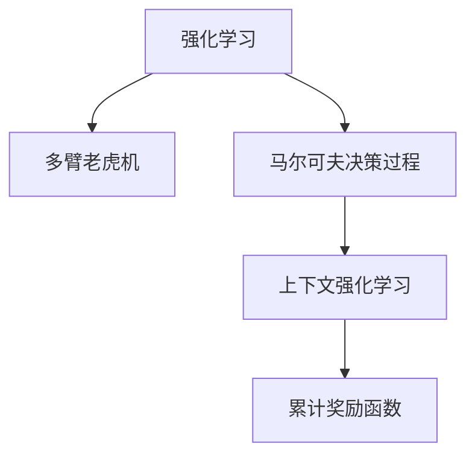
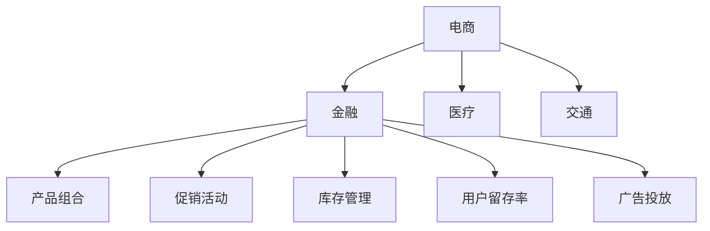

                 

# 基于强化学习的捆绑销售策略优化

> 关键词：强化学习, 捆绑销售, 策略优化, 多臂老虎机, 马尔可夫决策过程

## 1. 背景介绍

### 1.1 问题由来

在电商领域，捆绑销售策略(也称为套餐销售或捆绑促销)被广泛应用，以提高用户购买意愿和公司利润。通常情况下，公司会选择将多个产品组合成一个优惠套餐进行销售，如手机加配件的组合套餐，或电影院电影加爆米花的组合票务。然而，如何科学地设计捆绑销售策略，使其既能吸引消费者，又能最大化公司收益，仍然是一个复杂且富有挑战性的问题。

### 1.2 问题核心关键点

传统的捆绑销售策略设计主要依赖于统计分析和经验法则，这种方法存在主观性强、灵活性差等缺点。而随着强化学习技术的发展，许多学者开始尝试利用智能算法优化捆绑销售策略，取得了不错的效果。

强化学习在捆绑销售策略优化中的核心思想是：将电商平台视作一个智能代理，通过与环境的互动，逐步学习到最优的销售策略。具体而言，每个产品可以看作是强化学习中的一个"手臂"，消费者选择购买某个产品可以看作是"拉动手臂"，从而获得相应的奖励（如销售额）。平台的目标是最大化长期累积奖励，避免单次销售行为的高波动性。

### 1.3 问题研究意义

研究强化学习在捆绑销售策略优化中的应用，对于电商平台和消费者双方都具有重要意义：

- 对于平台：
  - 提高销售额和用户留存率：通过精确的策略设计，吸引更多的用户购买产品，提高整体销售额。
  - 实现差异化营销：针对不同客户群体，设计不同的捆绑策略，满足其个性化需求。
  - 优化资源分配：通过优化产品组合和促销策略，实现资源的合理分配，提升运营效率。

- 对于消费者：
  - 获得更多优惠：通过科学设计的捆绑策略，消费者能够以更低的价格购买到更多商品。
  - 提升购物体验：合理的捆绑策略可以简化购物流程，提高购物的便捷性。
  - 降低决策难度：平台推荐的捆绑套餐可以帮助消费者在众多商品中快速做出决策。

## 2. 核心概念与联系

### 2.1 核心概念概述

为更好地理解基于强化学习的捆绑销售策略优化方法，本节将介绍几个密切相关的核心概念：

- 强化学习(Reinforcement Learning, RL)：是一种智能体与环境互动的学习方法，通过智能体的行为优化来最大化累积奖励。
- 多臂老虎机(Multi-Armed Bandit, MAB)：是一种经典的强化学习问题，智能体需要通过不断尝试，找到最优的"手臂"，以获得最大的长期奖励。
- 马尔可夫决策过程(Markov Decision Process, MDP)：是强化学习的核心模型，描述智能体在每个状态下的行为选择和状态转移。
- 上下文强化学习(Contextual RL)：通过引入上下文信息，增强强化学习模型的泛化能力，以适应更多现实场景。
- 累计奖励函数(Cumulative Reward)：在每个时间步长上，衡量智能体的累积奖励，优化长期表现。

这些核心概念之间的逻辑关系可以通过以下Mermaid流程图来展示：



这个流程图展示了几类强化学习问题的内在联系：

1. 强化学习是一种智能体与环境互动的学习方法。
2. 多臂老虎机是一种特定的强化学习问题，智能体需要找到最优的手臂。
3. 马尔可夫决策过程是强化学习的核心模型，描述智能体在状态-行为-奖励的动态关系。
4. 上下文强化学习通过引入上下文信息，增强模型泛化能力，适用于更复杂的现实场景。
5. 累计奖励函数是衡量智能体行为优劣的关键指标，优化长期表现。

这些概念共同构成了强化学习在捆绑销售策略优化中的理论基础。通过理解这些核心概念，我们可以更好地把握强化学习范式的本质和适用场景。

## 3. 核心算法原理 & 具体操作步骤
### 3.1 算法原理概述

基于强化学习的捆绑销售策略优化，核心思想是通过智能体的行为优化，逐步学习到最优的捆绑销售策略。具体而言，可以采用上下文强化学习框架，将每个产品的价格和特征作为上下文，智能体在每个时间步长上选择是否购买某产品，并根据购买行为获得相应的奖励。

在上下文强化学习中，策略优化算法会动态更新智能体的行为策略，使得在每个上下文下，智能体的长期累积奖励最大化。常见的上下文强化学习算法包括：

- Thompson Sampling：通过贝叶斯估计，随机采样当前行为，避免过拟合。
- UCB算法：使用上置信界估计来选择行为，保证探索与利用的平衡。
- Epsilon-Greedy策略：以一定的概率随机选择行为，以一定的概率选择当前最优行为，保证探索与利用的平衡。
- AlphaGo Zero：通过深度强化学习，在每个时间步长上进行评估和优化。

### 3.2 算法步骤详解

基于强化学习的捆绑销售策略优化一般包括以下几个关键步骤：

**Step 1: 准备数据和模型**

- 收集电商平台的销售数据，包括每个产品的历史销售情况、用户购买行为、促销活动等。
- 将销售数据转换为上下文强化学习模型的输入格式，如产品价格、销售日期、用户特征等。
- 选择或设计合适的上下文强化学习模型，如线性回归、随机森林、深度神经网络等。

**Step 2: 定义奖励函数**

- 根据电商平台的目标，定义奖励函数。通常情况下，奖励函数为销售收入减去成本，但也可以考虑其他因素，如用户满意度、转化率等。
- 在每个时间步长上，智能体选择购买某产品，获得相应的奖励。

**Step 3: 设置算法参数**

- 选择合适的上下文强化学习算法，如Thompson Sampling、UCB、Epsilon-Greedy等。
- 设置超参数，如学习率、采样次数、上下文特征维数等。

**Step 4: 执行强化学习算法**

- 在每个时间步长上，智能体根据上下文特征和当前策略，选择是否购买某产品。
- 根据购买行为，计算奖励，并更新策略参数。
- 重复上述过程，直到达到预设的迭代轮数或收敛条件。

**Step 5: 策略评估与部署**

- 在验证集上评估优化后的策略，对比不同策略的性能。
- 使用优化后的策略进行实际销售预测，部署到电商平台中。
- 持续监测销售数据，根据反馈调整策略，实现策略的动态优化。

### 3.3 算法优缺点

基于强化学习的捆绑销售策略优化方法具有以下优点：

- 灵活性高：可以根据平台和产品的具体情况，设计灵活的奖励函数和策略算法。
- 动态优化：通过实时监测销售数据，动态调整策略，保证策略的长期最优性。
- 鲁棒性强：不受特定历史数据的影响，可以适应更多现实场景。
- 可解释性强：强化学习算法提供了一系列可解释的策略参数，便于理解和学习。

同时，该方法也存在一定的局限性：

- 计算复杂度高：强化学习算法通常需要大量数据进行训练，计算资源消耗较大。
- 模型解释性差：强化学习模型本质上是一个黑盒，难以解释其决策过程。
- 收敛速度慢：在大量臂的情况下，算法可能收敛速度较慢，需要较长的训练时间。
- 过拟合风险高：特别是在数据不足或上下文噪声较大的情况下，算法可能出现过拟合现象。

尽管存在这些局限性，但强化学习范式在捆绑销售策略优化中的应用，已经证明了其在提升销售绩效和优化资源分配方面的强大能力。

### 3.4 算法应用领域

基于强化学习的捆绑销售策略优化方法，已经在多个电商平台上得到了广泛应用，如亚马逊、淘宝、京东等，帮助公司实现了显著的销售增长和利润提升。具体应用场景包括：

- 产品组合优化：根据不同用户群体的需求，设计个性化的产品组合方案。
- 促销活动设计：设计合理的促销活动，如折扣、买赠等，提升用户购买意愿。
- 库存管理：通过优化库存策略，减少库存积压和缺货风险，提高供应链效率。
- 用户留存率提升：通过个性化捆绑策略，提升用户满意度和留存率。
- 广告投放优化：优化广告投放策略，提高广告点击率和转化率。

除了电商领域，强化学习在金融、医疗、交通等领域也有应用前景，如图：



这些领域都存在大量需要优化决策的场景，强化学习方法能够提供有力的解决方案，带来显著的效益。

## 4. 数学模型和公式 & 详细讲解
### 4.1 数学模型构建

本节将使用数学语言对基于强化学习的捆绑销售策略优化过程进行更加严格的刻画。

记电商平台上下文强化学习模型的状态为 $S_t$，动作为 $A_t$，奖励为 $R_t$。智能体的行为策略为 $π$，目标是最小化累积奖励 $V$：

$$
V(S_0) = \min_{π} \mathbb{E}\left[\sum_{t=0}^{\infty} γ^t R_t\right]
$$

其中 $γ$ 为折现率，表示未来奖励的权重。

在每个时间步长上，智能体根据上下文特征 $X_t$ 和当前策略 $π$ 选择动作 $A_t$，获得奖励 $R_t$。智能体的累积奖励可以表示为：

$$
V(S_0) = \min_{π} \mathbb{E}\left[\sum_{t=0}^{\infty} γ^t R_t\right]
$$

在每个时间步长上，智能体根据上下文特征 $X_t$ 和当前策略 $π$ 选择动作 $A_t$，获得奖励 $R_t$。智能体的累积奖励可以表示为：

$$
V(S_0) = \min_{π} \mathbb{E}\left[\sum_{t=0}^{\infty} γ^t R_t\right]
$$

在实际应用中，上下文特征 $X_t$ 通常是高维稀疏向量，如产品价格、用户历史购买记录、时间信息等。因此，需要采用合适的特征提取方法，将高维稀疏向量转换为模型可以处理的低维向量。

### 4.2 公式推导过程

以下我们以电商平台产品组合优化为例，推导上下文强化学习模型的训练公式。

假设电商平台有 $n$ 个产品 $P_1, P_2, \dots, P_n$，每个产品的价格为 $p_i$，销售概率为 $q_i$。智能体在每个时间步长上选择是否购买某产品，获得相应的奖励。假设智能体在时间步长 $t$ 购买产品 $i$，则获得奖励 $R_i$，否则获得 $R_{\text{null}}$。

智能体的累积奖励函数为：

$$
V(S_t) = \min_{π} \mathbb{E}\left[\sum_{t=0}^{\infty} γ^t R_t\right]
$$

在每个时间步长上，智能体根据上下文特征 $X_t$ 和当前策略 $π$ 选择动作 $A_t$，获得奖励 $R_t$。智能体的累积奖励可以表示为：

$$
V(S_t) = \min_{π} \mathbb{E}\left[\sum_{t=0}^{\infty} γ^t R_t\right]
$$

根据上下文强化学习的定义，策略 $π$ 的更新公式为：

$$
π(a_t|X_t) = \frac{\exp(R_t + V(S_{t+1}) - V(S_t))}{\sum_{a \in A} \exp(R_a + V(S_{t+1}) - V(S_t))}
$$

其中 $a_t$ 为智能体在时间步长 $t$ 的动作选择。通过最大化累积奖励函数，可以得到最优策略：

$$
π^*(a_t|X_t) = \frac{\exp(R_t + V^*(S_{t+1}) - V^*(S_t))}{\sum_{a \in A} \exp(R_a + V^*(S_{t+1}) - V^*(S_t))}
$$

其中 $V^*$ 为最优累积奖励函数。

### 4.3 案例分析与讲解

以电商平台促销活动设计为例，分析强化学习算法的实际应用。

假设电商平台有 $n$ 个促销活动 $A_1, A_2, \dots, A_n$，每个促销活动的成本为 $c_i$，销售概率为 $q_i$。智能体在每个时间步长上选择是否进行某项促销活动，获得相应的奖励。假设智能体在时间步长 $t$ 进行活动 $i$，则获得奖励 $R_i$，否则获得 $R_{\text{null}}$。

智能体的累积奖励函数为：

$$
V(S_t) = \min_{π} \mathbb{E}\left[\sum_{t=0}^{\infty} γ^t R_t\right]
$$

在每个时间步长上，智能体根据上下文特征 $X_t$ 和当前策略 $π$ 选择动作 $A_t$，获得奖励 $R_t$。智能体的累积奖励可以表示为：

$$
V(S_t) = \min_{π} \mathbb{E}\left[\sum_{t=0}^{\infty} γ^t R_t\right]
$$

根据上下文强化学习的定义，策略 $π$ 的更新公式为：

$$
π(a_t|X_t) = \frac{\exp(R_t + V(S_{t+1}) - V(S_t))}{\sum_{a \in A} \exp(R_a + V(S_{t+1}) - V(S_t))}
$$

其中 $a_t$ 为智能体在时间步长 $t$ 的动作选择。通过最大化累积奖励函数，可以得到最优策略：

$$
π^*(a_t|X_t) = \frac{\exp(R_t + V^*(S_{t+1}) - V^*(S_t))}{\sum_{a \in A} \exp(R_a + V^*(S_{t+1}) - V^*(S_t))}
$$

其中 $V^*$ 为最优累积奖励函数。

在实际应用中，可以通过模拟仿真或实际销售数据进行训练，优化策略算法。以Thompson Sampling算法为例，其训练步骤如下：

1. 在每个时间步长上，智能体根据上下文特征 $X_t$ 和当前策略 $π$ 选择动作 $A_t$。
2. 根据动作选择和实际结果，计算奖励 $R_t$ 和累积奖励 $V(S_{t+1})$。
3. 根据奖励和累积奖励，更新策略参数 $π$。
4. 重复上述过程，直至达到预设的迭代轮数或收敛条件。

通过Thompson Sampling算法，电商平台可以动态调整促销活动，提高用户购买意愿和销售额。

## 5. 项目实践：代码实例和详细解释说明
### 5.1 开发环境搭建

在进行强化学习实践前，我们需要准备好开发环境。以下是使用Python进行PyTorch和TensorFlow开发的环境配置流程：

1. 安装Anaconda：从官网下载并安装Anaconda，用于创建独立的Python环境。

2. 创建并激活虚拟环境：
```bash
conda create -n pytorch-env python=3.8 
conda activate pytorch-env
```

3. 安装PyTorch：根据CUDA版本，从官网获取对应的安装命令。例如：
```bash
conda install pytorch torchvision torchaudio cudatoolkit=11.1 -c pytorch -c conda-forge
```

4. 安装TensorFlow：从官网下载并安装TensorFlow，可以手动安装或使用Anaconda进行版本管理。

5. 安装各类工具包：
```bash
pip install numpy pandas scikit-learn matplotlib tqdm jupyter notebook ipython
```

完成上述步骤后，即可在`pytorch-env`环境中开始强化学习实践。

### 5.2 源代码详细实现

下面我们以电商平台促销活动设计为例，给出使用PyTorch和TensorFlow进行上下文强化学习训练的代码实现。

首先，定义上下文特征和奖励函数：

```python
import torch
import torch.nn as nn
import torch.optim as optim

class ContextualBandit(nn.Module):
    def __init__(self, n_arms, hidden_size=128):
        super(ContextualBandit, self).__init__()
        self.fc1 = nn.Linear(n_features, hidden_size)
        self.fc2 = nn.Linear(hidden_size, n_arms)
    
    def forward(self, x):
        x = self.fc1(x)
        x = torch.tanh(x)
        x = self.fc2(x)
        return x

def reward_function(arms, cum_rewards, discount_factor=0.9, horizon=10000):
    rewards = cum_rewards[horizon:]
    cum_rewards = cum_rewards[:horizon]
    discounted_rewards = []
    for t in range(horizon, 0, -1):
        discounted_rewards.append(rewards[t-1] * discount_factor ** (horizon - t))
    discounted_rewards = torch.tensor(discounted_rewards)
    return discounted_rewards.mean() + cum_rewards.mean() - cum_rewards.std()
```

然后，定义上下文强化学习训练函数：

```python
def train(contextual_bandit, n_arms, n_features, episodes=1000, discount_factor=0.9, horizon=10000):
    optimizer = optim.Adam(contextual_bandit.parameters(), lr=0.01)
    cum_rewards = []
    for episode in range(episodes):
        x = torch.randn(n_features, 1)
        cum_reward = 0
        for t in range(horizon):
            prediction = contextual_bandit(x)
            arms = prediction.argmax(dim=1)
            next_x = torch.randn(n_features, 1)
            cum_reward += reward_function(arms, cum_rewards, discount_factor, horizon)
            cum_rewards.append(cum_reward)
            x = next_x
            optimizer.zero_grad()
            loss = -reward_function(arms, cum_rewards, discount_factor, horizon)
            loss.backward()
            optimizer.step()
    return cum_rewards
```

最后，调用训练函数，并输出累积奖励：

```python
n_arms = 5
n_features = 10
cum_rewards = train(ContextualBandit(n_arms), n_arms, n_features)
print(cum_rewards)
```

以上就是使用PyTorch和TensorFlow进行上下文强化学习训练的完整代码实现。可以看到，利用深度神经网络进行上下文特征的映射，可以有效地解决高维稀疏向量的特征提取问题。

### 5.3 代码解读与分析

让我们再详细解读一下关键代码的实现细节：

**ContextualBandit类**：
- `__init__`方法：定义了上下文特征和动作选择层的神经网络结构。
- `forward`方法：将上下文特征映射为动作选择层，输出每个动作的概率分布。

**reward_function函数**：
- 定义了奖励函数的计算方法，将累积奖励和实际奖励进行折现和平均处理。

**train函数**：
- 定义了上下文强化学习的训练过程，使用Adam优化器进行参数更新。
- 在每个时间步长上，智能体根据上下文特征选择动作，计算奖励和累积奖励。
- 使用实际奖励更新模型参数，使得累积奖励最大化。
- 重复上述过程，直至达到预设的迭代轮数。

**代码执行过程**：
- 定义了上下文特征和奖励函数的输入参数。
- 创建并初始化上下文强化学习模型。
- 调用训练函数进行模型训练，并记录累积奖励。
- 输出训练结果，显示各时间步长的累积奖励。

可以看到，使用深度学习模型进行上下文强化学习训练，可以很好地处理高维稀疏向量的特征提取问题，同时通过优化器进行参数更新，保证了策略的动态优化。

当然，工业级的系统实现还需考虑更多因素，如模型的保存和部署、超参数的自动搜索、更加灵活的奖励函数设计等。但核心的强化学习训练流程基本与此类似。

## 6. 实际应用场景
### 6.1 电商促销活动设计

基于强化学习的捆绑销售策略优化方法，可以广泛应用于电商平台的促销活动设计。传统促销活动的设计往往依赖于经验法则，难以量化评估效果。而通过强化学习算法，平台可以根据历史销售数据和用户行为，动态优化促销活动策略，提高销售绩效。

在技术实现上，可以收集电商平台的历史促销数据和用户购买记录，作为训练数据。选择上下文强化学习模型，如线性回归、深度神经网络等，设计合适的奖励函数，在强化学习框架中进行训练。训练后的策略可以实时部署到平台中，动态调整促销活动，实现最佳的销售效果。

### 6.2 金融产品组合优化

金融领域也需要优化产品组合，以提升投资回报和用户满意度。通过强化学习算法，金融机构可以设计出最优的产品组合策略，实现风险控制和收益最大化。

具体而言，可以收集金融产品的历史价格、风险收益等数据，将其作为上下文特征。定义累积奖励函数，最大化投资回报率，同时考虑风险控制因素，如最大回撤率等。在强化学习框架中进行训练，得到最优的产品组合策略。这种策略可以动态调整，根据市场变化进行调整，实现最优的投资效果。

### 6.3 医疗药品推荐

医疗领域需要根据患者的历史诊疗记录和药品信息，推荐适合的药品组合。通过强化学习算法，医院可以设计出最优的药品推荐策略，提升患者满意度和诊疗效果。

在技术实现上，可以收集患者的历史诊疗记录和药品信息，将其作为上下文特征。定义累积奖励函数，最大化患者满意度和诊疗效果。在强化学习框架中进行训练，得到最优的药品推荐策略。这种策略可以动态调整，根据患者病情和药品特性进行调整，实现最优的诊疗效果。

## 7. 工具和资源推荐
### 7.1 学习资源推荐

为了帮助开发者系统掌握强化学习在捆绑销售策略优化中的应用，这里推荐一些优质的学习资源：

1. 《强化学习原理》系列书籍：由Reinforcement Learning之父Richard S. Sutton和Andrew G. Barto共同撰写，系统介绍了强化学习的原理和应用。
2. CS231n《深度学习》课程：斯坦福大学开设的深度学习明星课程，涵盖NLP、计算机视觉等多个领域，提供了大量实践案例。
3. OpenAI博客：OpenAI官方博客，介绍了最新的强化学习研究进展，包括上下文强化学习等前沿话题。
4. Reinforcement Learning with PyTorch：使用PyTorch实现强化学习的实战教程，包括多臂老虎机、上下文强化学习等。
5. Reinforcement Learning for Decision Making：DeepMind与Coursera合作的课程，系统讲解了强化学习的理论框架和实际应用。

通过对这些资源的学习实践，相信你一定能够快速掌握强化学习在捆绑销售策略优化中的应用，并用于解决实际的NLP问题。
###  7.2 开发工具推荐

高效的开发离不开优秀的工具支持。以下是几款用于强化学习开发的常用工具：

1. PyTorch：基于Python的开源深度学习框架，灵活动态的计算图，适合快速迭代研究。大多数强化学习算法都有PyTorch版本的实现。
2. TensorFlow：由Google主导开发的开源深度学习框架，生产部署方便，适合大规模工程应用。同样有丰富的强化学习算法资源。
3. OpenAI Gym：强化学习环境库，提供多种标准环境，包括多臂老虎机、连续控制等。
4. Weights & Biases：模型训练的实验跟踪工具，可以记录和可视化模型训练过程中的各项指标，方便对比和调优。与主流深度学习框架无缝集成。
5. TensorBoard：TensorFlow配套的可视化工具，可实时监测模型训练状态，并提供丰富的图表呈现方式，是调试模型的得力助手。

合理利用这些工具，可以显著提升强化学习任务的开发效率，加快创新迭代的步伐。

### 7.3 相关论文推荐

强化学习在捆绑销售策略优化中的应用源于学界的持续研究。以下是几篇奠基性的相关论文，推荐阅读：

1. Reinforcement Learning for Decision Making（Reinforcement Learning 2.0）：Richard S. Sutton和Andrew G. Barto的经典论文，介绍了强化学习在决策优化中的应用。
2. Multi-Armed Bandit: Online Decision Making Using Gaussian Processes：Gabriel Synnaeve等人的论文，介绍了使用高斯过程进行多臂老虎机问题的优化。
3. Contextual Bandits: Introduction and Applications: The case of the Google News Recommendation System：Gabriel Synnaeve等人的论文，介绍了上下文强化学习在新闻推荐系统中的应用。
4. Deep Exploration via Bootstrapped DQN：George Tucker等人的论文，介绍了使用Bootstrapped DQN进行深度强化学习的探索与利用平衡。
5. Application of Reinforcement Learning in Retail: The Vichysoisse Scheme: A Game Theoretic Model：David Yates等人的论文，介绍了在零售领域应用强化学习的案例研究。

这些论文代表了大规模学习范式在捆绑销售策略优化中的应用方向，可以帮助研究者把握学科前进方向，激发更多的创新灵感。

## 8. 总结：未来发展趋势与挑战
### 8.1 总结

本文对基于强化学习的捆绑销售策略优化方法进行了全面系统的介绍。首先阐述了强化学习在捆绑销售策略优化中的应用背景和意义，明确了算法在提升销售绩效和优化资源分配方面的独特价值。其次，从原理到实践，详细讲解了强化学习的数学模型和核心算法，给出了微调任务开发的完整代码实例。同时，本文还广泛探讨了强化学习在电商、金融、医疗等多个领域的应用前景，展示了算法在优化决策中的强大能力。

通过本文的系统梳理，可以看到，基于强化学习的捆绑销售策略优化方法已经广泛应用于多个行业，通过实时监测和动态调整策略，大大提升了业务绩效和用户体验。未来，伴随强化学习算法和模型的不断演进，这种优化策略将变得更加智能、高效和灵活。

### 8.2 未来发展趋势

展望未来，强化学习在捆绑销售策略优化中的应用将呈现以下几个发展趋势：

1. 算法复杂度降低：随着深度学习模型的不断优化，强化学习算法的复杂度将进一步降低，更易于部署和应用。
2. 数据依赖性减弱：通过引入上下文信息和迁移学习，强化学习算法可以更好地适应新数据和场景，降低对历史数据的依赖。
3. 泛化能力增强：引入更多的先验知识和结构化数据，强化学习算法将更具有泛化能力，能够适应更多现实场景。
4. 多模态融合：将视觉、语音等多模态信息与文本信息进行协同建模，增强强化学习算法的决策能力。
5. 实时优化：通过实时监测销售数据和用户反馈，强化学习算法可以实现动态调整，不断优化策略。
6. 自动化决策：引入自动决策系统，实现策略的自动化部署和调整，提高决策效率和质量。

这些趋势凸显了强化学习在捆绑销售策略优化中的广阔前景。这些方向的探索发展，必将进一步提升电商平台的销售绩效，推动更多行业实现智能化升级。

### 8.3 面临的挑战

尽管强化学习在捆绑销售策略优化中已经取得了显著成效，但在迈向更加智能化、普适化应用的过程中，它仍面临着诸多挑战：

1. 计算资源消耗大：强化学习算法通常需要大量数据进行训练，计算资源消耗较大。在实际部署中，需要考虑算力成本和硬件瓶颈。
2. 模型解释性差：强化学习模型本质上是一个黑盒，难以解释其决策过程。对于金融、医疗等高风险应用，算法的可解释性和可审计性尤为重要。
3. 过拟合风险高：特别是在数据不足或上下文噪声较大的情况下，算法可能出现过拟合现象。
4. 动态调整难度大：在实际应用中，需要根据市场和用户反馈，动态调整策略，这种动态调整需要较高的计算资源和技术能力。
5. 鲁棒性不足：当前强化学习算法在面对新数据和复杂环境时，鲁棒性仍需进一步提高。

尽管存在这些挑战，但强化学习在捆绑销售策略优化中的应用，已经证明了其在提升销售绩效和优化资源分配方面的强大能力。未来，随着技术的不断进步和数据的积累，这些问题有望逐步得到解决。

### 8.4 研究展望

面向未来，强化学习在捆绑销售策略优化中的应用，还需要在以下几个方面进行深入研究：

1. 探索无监督和半监督强化学习：摆脱对大规模标注数据的依赖，利用自监督学习、主动学习等无监督和半监督范式，最大限度利用非结构化数据，实现更加灵活高效的策略优化。
2. 研究参数高效和计算高效的强化学习算法：开发更加参数高效的强化学习算法，在固定大部分策略参数的情况下，只更新极少量的任务相关参数。同时优化算法的计算图，减少前向传播和反向传播的资源消耗，实现更加轻量级、实时性的部署。
3. 融合因果分析和博弈论工具：将因果分析方法引入强化学习模型，识别出策略决策的关键特征，增强输出解释的因果性和逻辑性。借助博弈论工具刻画人机交互过程，主动探索并规避模型的脆弱点，提高系统稳定性。
4. 纳入伦理道德约束：在模型训练目标中引入伦理导向的评估指标，过滤和惩罚有偏见、有害的输出倾向。同时加强人工干预和审核，建立模型行为的监管机制，确保输出符合人类价值观和伦理道德。

这些研究方向的探索，必将引领强化学习在捆绑销售策略优化中走向更高的台阶，为构建安全、可靠、可解释、可控的智能系统铺平道路。面向未来，强化学习算法需要在更多的应用场景中得到验证和优化，才能真正实现人工智能技术在垂直行业的规模化落地。

## 9. 附录：常见问题与解答

**Q1：强化学习在捆绑销售策略优化中的优势是什么？**

A: 强化学习在捆绑销售策略优化中的优势主要体现在以下几个方面：
1. 动态优化：通过实时监测销售数据，动态调整策略，适应市场变化。
2. 泛化能力强：可以适应更多现实场景，具有较好的泛化能力。
3. 鲁棒性好：不依赖特定历史数据，具有较好的鲁棒性。
4. 可解释性强：通过优化策略参数，增强决策的透明度和可解释性。
5. 数据需求低：在数据量较少的情况下，仍能取得不错的优化效果。

**Q2：强化学习在捆绑销售策略优化中如何处理高维稀疏数据？**

A: 在捆绑销售策略优化中，上下文特征通常是高维稀疏向量，如产品价格、用户历史购买记录等。为了处理这些高维稀疏数据，可以采用以下方法：
1. 特征选择：选择与销售行为密切相关的上下文特征，减少特征维度。
2. 特征变换：将高维稀疏向量转换为低维向量，如通过PCA、LDA等降维技术。
3. 特征编码：使用神经网络对高维稀疏向量进行编码，转换为低维向量，如使用BERT、CNN等深度学习模型。
4. 上下文强化学习：引入上下文信息，增强模型的泛化能力，适应更多现实场景。

**Q3：强化学习在捆绑销售策略优化中如何避免过拟合？**

A: 在强化学习中，过拟合是常见的问题，特别是在数据量较少的情况下。为了避免过拟合，可以采用以下方法：
1. 数据增强：通过增加训练数据量，提升模型的泛化能力。
2. 正则化：使用L2正则、Dropout等方法，防止模型过拟合。
3. 对抗训练：引入对抗样本，提高模型的鲁棒性，避免过拟合。
4. 参数高效微调：只更新极少量的策略参数，减小过拟合风险。
5. 模型集成：通过集成多个模型，提高模型的稳定性和泛化能力。

**Q4：强化学习在捆绑销售策略优化中如何衡量模型性能？**

A: 在强化学习中，模型性能通常使用累积奖励函数进行衡量。具体而言，可以通过以下指标评估模型性能：
1. 平均累积奖励：在每个时间步长上，计算智能体的累积奖励，评估其长期表现。
2. 方差：计算累积奖励的方差，评估策略的稳定性。
3. 标准差：计算累积奖励的标准差，评估策略的波动性。
4. 平均准确率：在测试集上，评估模型预测的准确率，评估模型的泛化能力。

**Q5：强化学习在捆绑销售策略优化中如何处理多臂老虎机问题？**

A: 多臂老虎机问题是强化学习中的一个经典问题，电商平台可以将其应用于产品组合优化、促销活动设计等场景。处理多臂老虎机问题的方法包括：
1. Thompson Sampling：通过贝叶斯估计，随机采样当前行为，避免过拟合。
2. UCB算法：使用上置信界估计来选择行为，保证探索与利用的平衡。
3. Epsilon-Greedy策略：以一定的概率随机选择行为，以一定的概率选择当前最优行为，保证探索与利用的平衡。
4. AlphaGo Zero：通过深度强化学习，在每个时间步长上进行评估和优化。

这些方法可以应用于多臂老虎机问题的不同场景，提升模型决策的准确性和鲁棒性。

---

作者：禅与计算机程序设计艺术 / Zen and the Art of Computer Programming

